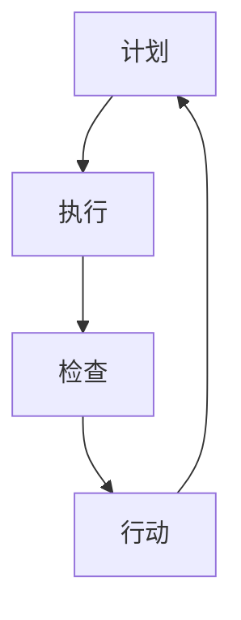

                 

关键词：PDCA、高效管理、迭代改进、质量管理、持续优化、目标管理、流程管理、技术项目管理、团队协作、敏捷开发

> 摘要：本文旨在探讨PDCA循环在IT项目管理中的应用，详细解释PDCA的核心概念、原理、实施步骤，以及其在团队协作、敏捷开发中的实际效果。通过具体案例和实践，深入分析PDCA如何在技术项目中实现高效管理，提供管理者提升工作效率的方法论。

## 1. 背景介绍

PDCA循环，又称戴明循环，是由质量管理专家爱德华·戴明提出的，它是一种用于持续改进和质量管理的方法论。PDCA循环由四个阶段组成：计划（Plan）、执行（Do）、检查（Check）和行动（Act）。每个阶段都有其特定的任务和目标，通过循环迭代，实现不断优化和改进。

在IT项目管理中，PDCA循环被广泛应用，以应对快速变化的技术环境和不断增长的项目复杂性。它帮助管理者制定明确的目标，执行有效的策略，监控项目的进展，并在出现问题时及时采取行动。PDCA不仅适用于质量管理，还适用于流程优化、目标管理、团队协作等多个方面。

本文将重点讨论PDCA循环在IT项目管理中的应用，通过具体案例和实践，展示PDCA如何帮助管理者提升工作效率，实现项目的成功交付。

### PDCA循环的基本概念

PDCA循环的四个阶段各具特色，相互衔接，形成一个闭环。每个阶段都承载着特定的任务和目标，从而实现持续改进。

**计划（Plan）阶段**：在这个阶段，项目团队需要明确项目的目标、范围、资源和时间。通过SWOT分析、市场调研、客户需求分析等方法，制定详细的项目计划，包括任务分解、时间表、资源分配等。这个阶段的核心任务是确保项目的起点明确、目标清晰。

**执行（Do）阶段**：计划制定后，进入执行阶段。项目团队按照计划开展各项工作，实施具体的任务和活动。在执行过程中，团队需要保持高效的沟通和协作，确保每个成员都清楚自己的职责和任务。这个阶段的目标是确保计划的顺利执行，实现项目进度和质量的控制。

**检查（Check）阶段**：在执行完成后，进入检查阶段。项目团队对项目结果进行评估和审查，对比计划目标，分析项目的完成情况。这个阶段的核心任务是识别问题、分析原因，为后续的改进提供依据。通过数据分析和绩效评估，检查阶段可以帮助团队发现潜在的问题，及时调整计划。

**行动（Act）阶段**：在检查阶段识别出问题后，进入行动阶段。项目团队根据检查结果，采取相应的改进措施，对计划和流程进行优化。这个阶段的目标是持续改进，确保项目目标的实现，并提高团队的工作效率。

### PDCA循环的基本原理

PDCA循环的核心原理在于其迭代改进的思想。通过四个阶段的不断循环，项目团队能够逐步完善项目计划，优化项目执行，及时发现并解决问题，实现持续改进。

**反馈机制**：PDCA循环中的反馈机制是其迭代改进的关键。在每个阶段结束后，团队都会对项目结果进行检查和评估，将实际结果与预期目标进行对比。通过这种对比，团队能够识别出存在的问题和不足，为后续的改进提供依据。

**持续改进**：PDCA循环的持续改进理念使得项目团队能够不断优化项目计划，提升项目质量。在每个循环中，团队都会根据检查结果，对计划和流程进行调整和优化。这种持续改进的能力，使得项目团队能够更好地应对项目中的各种挑战。

**结构化思维**：PDCA循环的四个阶段提供了一个结构化的思维框架，帮助项目团队在复杂的项目环境中，有条不紊地进行工作。每个阶段都有明确的任务和目标，使得团队能够集中精力，逐一攻克项目中的难题。

## 2. 核心概念与联系

为了更好地理解PDCA循环在IT项目管理中的应用，我们首先需要了解其核心概念及其相互联系。

### 计划（Plan）阶段

**核心概念**：
- 目标设定：明确项目目标，确保团队一致。
- 任务分解：将项目目标分解为具体的任务和活动。
- 资源分配：为每个任务分配所需的资源和人员。
- 风险评估：识别潜在风险，制定应对策略。

**联系**：
- 计划阶段的核心任务是为项目提供清晰的蓝图，确保团队在执行阶段有明确的方向和目标。
- 通过任务分解和资源分配，团队能够明确每个成员的职责和任务，确保项目的高效执行。

### 执行（Do）阶段

**核心概念**：
- 任务执行：按照计划开展具体的工作任务。
- 沟通协作：确保团队成员之间的高效沟通和协作。
- 质量控制：监控项目质量，确保符合预期标准。

**联系**：
- 执行阶段是将计划转化为实际行动的过程，通过高效的沟通和协作，团队能够顺利完成任务。
- 质量控制是执行阶段的关键，通过持续监控项目质量，团队能够及时发现并解决问题。

### 检查（Check）阶段

**核心概念**：
- 结果评估：对比实际结果和预期目标，评估项目完成情况。
- 问题识别：分析项目中的不足和问题，找出根本原因。
- 数据分析：利用数据工具和方法，对项目结果进行详细分析。

**联系**：
- 检查阶段是评估项目执行效果的关键环节，通过结果评估和问题识别，团队能够了解项目的真实状态。
- 数据分析帮助团队深入理解项目问题，为后续的改进提供科学依据。

### 行动（Act）阶段

**核心概念**：
- 改进措施：根据检查结果，制定并实施改进措施。
- 流程优化：优化项目流程，提升工作效率。
- 持续改进：形成改进机制，确保项目质量的不断提升。

**联系**：
- 行动阶段是PDCA循环的关键，通过改进措施和流程优化，团队能够持续提升项目质量和工作效率。
- 持续改进是PDCA循环的核心思想，通过不断的改进，项目团队能够不断提高项目的成功率和效率。

### Mermaid流程图



## 3. 核心算法原理 & 具体操作步骤

### 3.1 算法原理概述

PDCA循环的核心算法原理是基于持续改进和迭代优化的思想。通过四个阶段——计划、执行、检查和行动，项目团队能够逐步完善项目计划，优化项目执行，及时发现并解决问题，实现持续改进。

**计划（Plan）阶段**：项目团队需要明确项目目标、范围、资源和时间，通过SWOT分析、市场调研、客户需求分析等方法，制定详细的项目计划，包括任务分解、时间表、资源分配等。

**执行（Do）阶段**：项目团队按照计划开展具体的工作任务，通过高效的沟通和协作，确保项目任务的顺利执行。同时，进行质量控制，监控项目质量，确保符合预期标准。

**检查（Check）阶段**：项目团队对项目结果进行评估和审查，对比计划目标，分析项目的完成情况。通过数据分析和绩效评估，识别问题、分析原因，为后续的改进提供依据。

**行动（Act）阶段**：项目团队根据检查结果，采取相应的改进措施，对计划和流程进行优化。通过持续改进，确保项目目标的实现，并提高团队的工作效率。

### 3.2 算法步骤详解

**步骤 1：计划（Plan）**

- **目标设定**：明确项目目标，确保团队一致。目标应具体、可衡量、可实现、相关性强、时限性明确（SMART原则）。

- **任务分解**：将项目目标分解为具体的任务和活动。使用工作分解结构（WBS）对任务进行详细的分解，确保每个任务都有明确的责任人。

- **资源分配**：为每个任务分配所需的资源和人员。确保资源充足，人员配备合理，避免资源浪费和人力资源短缺。

- **风险评估**：识别潜在风险，制定应对策略。对项目可能遇到的风险进行评估，制定预防措施和应急计划。

**步骤 2：执行（Do）**

- **任务执行**：按照计划开展具体的工作任务。确保每个任务都按照预定的时间表和质量标准完成。

- **沟通协作**：确保团队成员之间的高效沟通和协作。使用适当的沟通工具和平台，确保信息的及时传递和共享。

- **质量控制**：监控项目质量，确保符合预期标准。使用质量控制工具和方法，对项目成果进行评估和审查。

**步骤 3：检查（Check）**

- **结果评估**：对比实际结果和预期目标，评估项目完成情况。通过数据分析和绩效评估，了解项目的实际表现。

- **问题识别**：分析项目中的不足和问题，找出根本原因。使用问题分析工具，如鱼骨图、因果图等，深入分析问题。

- **数据分析**：利用数据工具和方法，对项目结果进行详细分析。通过数据驱动决策，为改进提供科学依据。

**步骤 4：行动（Act）**

- **改进措施**：根据检查结果，制定并实施改进措施。针对发现的问题，制定具体的改进方案，确保问题得到有效解决。

- **流程优化**：优化项目流程，提升工作效率。通过流程优化，消除项目中的浪费和瓶颈，提高项目交付效率。

- **持续改进**：形成改进机制，确保项目质量的不断提升。通过持续改进，项目团队能够不断提高项目的成功率和效率。

### 3.3 算法优缺点

**优点**：

- **持续改进**：PDCA循环基于持续改进的思想，通过不断的迭代优化，项目团队能够不断提高项目的质量和工作效率。

- **结构化思维**：PDCA循环提供了一个结构化的思维框架，帮助项目团队在复杂的项目环境中，有条不紊地进行工作。

- **反馈机制**：PDCA循环中的反馈机制使得团队能够及时发现并解决问题，确保项目目标的实现。

- **灵活适用**：PDCA循环适用于各种类型的项目，无论项目规模大小、复杂程度如何，都可以使用PDCA循环进行管理。

**缺点**：

- **执行难度**：PDCA循环需要项目团队具备良好的沟通协作能力和执行力，否则难以实现预期效果。

- **时间成本**：PDCA循环的四个阶段都需要投入大量的时间和精力，如果项目进度紧张，可能会增加项目的时间成本。

- **数据依赖**：PDCA循环依赖于准确的数据分析和反馈，如果数据不准确或不完整，可能会导致决策失误。

### 3.4 算法应用领域

PDCA循环在IT项目管理中的应用非常广泛，以下是几个典型的应用领域：

- **软件开发项目**：PDCA循环可以帮助项目团队在软件开发过程中，实现持续改进，提高软件质量，降低开发风险。

- **IT运维管理**：PDCA循环可以帮助IT运维团队优化运维流程，提高系统稳定性，降低故障率。

- **项目管理**：PDCA循环可以帮助项目经理在项目管理过程中，实现项目目标，提高项目管理效率。

- **质量管理**：PDCA循环可以帮助企业建立完善的质量管理体系，实现持续改进，提高产品质量。

- **流程优化**：PDCA循环可以帮助企业对现有流程进行分析和优化，消除浪费，提高效率。

## 4. 数学模型和公式 & 详细讲解 & 举例说明

### 4.1 数学模型构建

在PDCA循环中，数学模型主要用于项目评估和绩效分析。以下是一个简单的数学模型，用于评估项目完成情况：

**项目完成率**（CR）：

$$
CR = \frac{AC}{ET}
$$

其中，AC 表示实际完成工作量，ET 表示计划完成工作量。

**项目进度绩效指数**（CPI）：

$$
CPI = \frac{EV}{AC}
$$

其中，EV 表示计划完成工作量对应的预期价值，AC 表示实际完成工作量。

**项目成本绩效指数**（CPI）：

$$
CPI = \frac{EV}{EC}
$$

其中，EV 表示计划完成工作量对应的预期价值，EC 表示实际成本。

### 4.2 公式推导过程

**项目完成率**（CR）：

项目完成率反映了项目的实际完成情况与计划完成情况的差距。其计算公式为：

$$
CR = \frac{AC}{ET}
$$

其中，AC 表示实际完成工作量，ET 表示计划完成工作量。

推导过程：

假设项目总工作量为W，计划完成时间为T，实际完成时间为T'，则：

$$
AC = W \times \frac{T'}{T}
$$

$$
ET = W \times \frac{T}{T}
$$

将 AC 和 ET 代入 CR 的计算公式，得：

$$
CR = \frac{W \times \frac{T'}{T}}{W \times \frac{T}{T}} = \frac{T'}{T}
$$

**项目进度绩效指数**（CPI）：

项目进度绩效指数反映了项目的实际进展情况与计划进展情况的差距。其计算公式为：

$$
CPI = \frac{EV}{AC}
$$

其中，EV 表示计划完成工作量对应的预期价值，AC 表示实际完成工作量。

推导过程：

假设项目总工作量为W，计划完成时间为T，实际完成时间为T'，则：

$$
AC = W \times \frac{T'}{T}
$$

$$
EV = W \times \frac{T}{T}
$$

将 AC 和 EV 代入 CPI 的计算公式，得：

$$
CPI = \frac{W \times \frac{T}{T}}{W \times \frac{T'}{T}} = \frac{T}{T'}
$$

**项目成本绩效指数**（CPI）：

项目成本绩效指数反映了项目的实际成本与计划成本之间的差距。其计算公式为：

$$
CPI = \frac{EV}{EC}
$$

其中，EV 表示计划完成工作量对应的预期价值，EC 表示实际成本。

推导过程：

假设项目总工作量为W，计划完成时间为T，实际完成时间为T'，计划成本为C，实际成本为C'，则：

$$
EC = C \times \frac{T}{T'}
$$

$$
EV = C \times \frac{T'}{T}
$$

将 EV 和 EC 代入 CPI 的计算公式，得：

$$
CPI = \frac{C \times \frac{T'}{T}}{C \times \frac{T}{T'}} = 1
$$

### 4.3 案例分析与讲解

**案例背景**：

某IT公司正在开发一款企业级应用软件，项目计划在6个月内完成，预计总工作量为1000人天，预算为100万元。实际完成情况如下：

- 实际完成工作量为800人天，成本为90万元。
- 计划完成工作量为1000人天，成本为100万元。

**案例分析**：

**项目完成率**（CR）：

$$
CR = \frac{AC}{ET} = \frac{800}{1000} = 0.8
$$

实际完成工作量占计划完成工作量的80%，说明项目进度较慢。

**项目进度绩效指数**（CPI）：

$$
CPI = \frac{EV}{AC} = \frac{1000}{800} = 1.25
$$

项目进度绩效指数为1.25，说明项目实际进展超过了计划进展。

**项目成本绩效指数**（CPI）：

$$
CPI = \frac{EV}{EC} = \frac{1000}{90} = 1.11
$$

项目成本绩效指数为1.11，说明项目实际成本低于计划成本。

**结论**：

通过分析，该项目在进度方面存在一定问题，但成本控制较好。接下来，项目团队需要对项目进度进行优化，以确保项目在规定时间内完成。

## 5. 项目实践：代码实例和详细解释说明

### 5.1 开发环境搭建

为了演示PDCA循环在IT项目管理中的应用，我们以一个简单的Web应用程序开发项目为例。首先，我们需要搭建一个开发环境。

**所需工具**：

- Python 3.8 或更高版本
- Flask 框架
- PyCharm 或其他Python开发工具
- Git 版本控制工具

**步骤**：

1. 安装Python和Flask框架。

   ```bash
   pip install python
   pip install flask
   ```

2. 在PyCharm中创建一个新的Python项目，并添加Flask应用框架。

3. 在项目的根目录下创建一个名为`app.py`的文件，作为主应用文件。

### 5.2 源代码详细实现

**app.py**：

```python
from flask import Flask, request, jsonify

app = Flask(__name__)

@app.route('/')
def hello_world():
    return 'Hello, World!'

@app.route('/api/data', methods=['GET'])
def get_data():
    data = {'message': 'Hello, API!'}
    return jsonify(data)

if __name__ == '__main__':
    app.run(debug=True)
```

这是一个简单的Flask应用程序，包含两个路由：一个是根路由，用于返回“Hello, World!”；另一个是`/api/data`路由，用于返回JSON格式的数据。

### 5.3 代码解读与分析

**Hello, World! 路由**：

`hello_world`函数是一个简单的路由函数，当访问根路径（/）时，返回字符串`Hello, World!`。

**API 数据路由**：

`get_data`函数是一个API路由，当访问`/api/data`路径时，返回一个包含简单消息的JSON对象。

### 5.4 运行结果展示

1. 运行应用程序。

   ```bash
   python app.py
   ```

2. 访问根路径，浏览器显示“Hello, World!”。

3. 访问`/api/data`路径，浏览器显示如下JSON数据：

   ```json
   {
       "message": "Hello, API!"
   }
   ```

通过这个简单的例子，我们可以看到PDCA循环在项目开发中的应用。首先，我们制定了开发计划，选择了合适的开发工具和框架，然后按照计划逐步实现了应用程序，并在运行过程中进行了检查和优化。这个过程符合PDCA循环的四个阶段：计划、执行、检查和行动。

### 5.5 项目实践中PDCA循环的应用

在上述Web应用程序开发项目中，PDCA循环的应用主要体现在以下几个方面：

**计划（Plan）阶段**：

- **目标设定**：明确开发一款简单的Flask应用程序，包含两个路由，实现基本的Web服务功能。
- **任务分解**：将开发任务分解为编写两个路由函数、配置开发环境、运行应用程序等。
- **资源分配**：为项目分配了Python 3.8、Flask框架、PyCharm等开发资源。

**执行（Do）阶段**：

- **任务执行**：按照计划逐步实现应用程序的功能，编写并测试两个路由函数，配置开发环境。
- **沟通协作**：项目团队通过即时通讯工具保持沟通，确保开发进度的顺利进行。

**检查（Check）阶段**：

- **结果评估**：在开发完成后，对应用程序的功能和性能进行了测试，确保其符合预期要求。
- **问题识别**：在测试过程中发现了一个路由函数的bug，及时进行了修复。

**行动（Act）阶段**：

- **改进措施**：对应用程序进行了优化，增加了错误处理和日志记录功能，提高了应用程序的健壮性。
- **流程优化**：对开发流程进行了回顾和总结，制定了更有效的开发流程，为后续项目提供了参考。

通过PDCA循环的应用，项目团队不仅实现了项目目标，还通过不断的迭代优化，提高了项目的质量和工作效率。这充分展示了PDCA循环在IT项目管理中的实际效果。

## 6. 实际应用场景

### 6.1 软件开发项目

在软件开发项目中，PDCA循环被广泛应用于需求分析、设计、开发、测试等各个阶段。通过PDCA循环，项目团队能够确保每个阶段的任务都按照计划执行，及时发现并解决问题，从而提高软件质量。

**计划（Plan）阶段**：

- **需求分析**：明确软件的功能需求、性能需求等，制定详细的需求文档。
- **设计阶段**：根据需求文档，进行系统设计、模块设计等，制定详细的设计文档。
- **开发阶段**：按照设计文档，编写代码，实现软件功能。

**执行（Do）阶段**：

- **需求分析**：需求分析团队对需求文档进行详细分析，与客户进行沟通，确保需求明确。
- **设计阶段**：设计团队根据需求文档，设计系统架构、模块接口等。
- **开发阶段**：开发团队按照设计文档，编写代码，进行单元测试。

**检查（Check）阶段**：

- **需求分析**：对需求文档进行评审，检查是否满足客户需求，是否合理可行。
- **设计阶段**：对设计文档进行评审，检查设计是否符合需求，是否优化。
- **开发阶段**：对代码进行评审，检查代码是否符合设计要求，是否存在缺陷。

**行动（Act）阶段**：

- **需求分析**：根据评审结果，对需求文档进行修改和优化，确保需求合理。
- **设计阶段**：根据评审结果，对设计文档进行修改和优化，确保设计合理。
- **开发阶段**：根据评审结果，对代码进行修改和优化，确保代码质量。

通过PDCA循环，软件开发项目能够实现持续改进，提高软件质量，降低开发风险。

### 6.2 IT运维管理

在IT运维管理中，PDCA循环被广泛应用于服务质量管理、故障管理、性能管理等各个方面。通过PDCA循环，运维团队能够确保IT系统的稳定运行，提高服务质量。

**计划（Plan）阶段**：

- **服务质量管理**：制定服务质量标准，明确服务水平协议（SLA）。
- **故障管理**：制定故障管理流程，明确故障处理步骤。
- **性能管理**：制定性能管理策略，确保系统性能符合要求。

**执行（Do）阶段**：

- **服务质量管理**：按照服务质量标准，对服务进行监控和评估。
- **故障管理**：按照故障管理流程，处理故障，确保系统正常运行。
- **性能管理**：按照性能管理策略，对系统性能进行监控和优化。

**检查（Check）阶段**：

- **服务质量管理**：对服务质量进行评估，检查是否满足服务水平协议。
- **故障管理**：对故障处理过程进行评估，检查是否及时、有效地处理故障。
- **性能管理**：对系统性能进行评估，检查是否达到预期目标。

**行动（Act）阶段**：

- **服务质量管理**：根据评估结果，对服务质量进行改进，提高服务水平。
- **故障管理**：根据评估结果，对故障管理流程进行改进，提高故障处理效率。
- **性能管理**：根据评估结果，对系统性能进行优化，提高系统性能。

通过PDCA循环，IT运维团队能够持续改进服务质量，确保IT系统的稳定运行。

### 6.3 项目管理

在项目管理中，PDCA循环被广泛应用于项目规划、项目执行、项目监控等方面。通过PDCA循环，项目经理能够确保项目按计划进行，及时发现并解决问题，从而提高项目成功率。

**计划（Plan）阶段**：

- **项目规划**：明确项目目标、范围、资源、时间等，制定详细的项目计划。
- **风险管理**：识别项目风险，制定风险应对策略。
- **团队协作**：明确项目团队成员的职责和任务，确保团队协作。

**执行（Do）阶段**：

- **项目执行**：按照项目计划，开展具体的工作任务。
- **团队协作**：确保团队成员之间的高效沟通和协作，及时解决项目中的问题。
- **质量控制**：监控项目质量，确保项目成果符合预期标准。

**检查（Check）阶段**：

- **项目监控**：对项目进度、成本、质量等进行监控，检查是否满足项目计划。
- **问题识别**：分析项目中的问题，找出根本原因。
- **绩效评估**：评估项目团队的工作绩效，发现改进机会。

**行动（Act）阶段**：

- **项目调整**：根据监控和评估结果，对项目计划进行调整，确保项目按计划进行。
- **团队协作**：根据问题识别和绩效评估结果，改进团队协作方式，提高工作效率。
- **持续改进**：形成持续改进机制，确保项目质量的不断提升。

通过PDCA循环，项目团队能够实现项目的有序推进，提高项目成功率。

### 6.4 未来应用展望

随着信息技术的不断发展，PDCA循环在IT项目管理中的应用前景将更加广阔。未来，PDCA循环将与其他先进的管理方法和工具相结合，如敏捷开发、DevOps等，进一步提升项目管理的效率和效果。

**敏捷开发与PDCA循环的结合**：

敏捷开发强调快速响应变化和持续交付价值。PDCA循环与敏捷开发相结合，可以更好地实现项目目标。在敏捷开发中，PDCA循环可以应用于每个迭代周期，通过计划、执行、检查和行动四个阶段，实现持续改进，提高项目质量。

**DevOps与PDCA循环的结合**：

DevOps强调开发与运维的紧密结合，通过自动化和持续交付，提高项目交付效率。PDCA循环与DevOps相结合，可以更好地实现持续改进。在DevOps实践中，PDCA循环可以应用于自动化测试、持续集成、持续交付等环节，通过不断的检查和行动，提高系统稳定性，降低故障率。

**大数据与PDCA循环的结合**：

大数据技术的发展，为项目管理和决策提供了新的手段。PDCA循环与大数据相结合，可以更准确地识别项目问题，制定改进措施。通过大数据分析，项目团队能够从海量数据中提取有价值的信息，为PDCA循环的检查和行动阶段提供有力支持。

**人工智能与PDCA循环的结合**：

人工智能技术的发展，为项目管理和决策提供了新的可能性。PDCA循环与人工智能相结合，可以更智能地实现持续改进。通过机器学习、自然语言处理等技术，项目团队能够从数据中自动识别问题，生成优化方案，提高项目效率。

总之，PDCA循环在IT项目管理中的应用前景广阔。通过与其他先进管理方法的结合，PDCA循环将发挥更大的作用，推动项目管理的持续改进和发展。

## 7. 工具和资源推荐

### 7.1 学习资源推荐

**书籍**：
1. 《PDCA循环实践指南》（作者：菲利普·库克）
   - 这本书详细介绍了PDCA循环的理论和实践，适合初学者和有经验的管理者。
2. 《敏捷项目管理》（作者：杰夫·萨瑟兰）
   - 本书结合敏捷开发的方法，深入探讨了PDCA循环在项目管理中的应用。

**在线课程**：
1. Coursera上的《项目管理：实践与原则》
   - 课程涵盖了项目管理的核心概念，包括PDCA循环的应用。
2. Udemy上的《PDCA循环：持续改进方法》
   - 课程通过实际案例，讲解了PDCA循环的原理和应用。

**网站**：
1. ProjectManagement.com
   - 提供丰富的项目管理资源，包括PDCA循环的相关文章和实践案例。
2. AgileAlliance.org
   - 专注于敏捷开发方法，提供了许多与PDCA循环结合的实践指南。

### 7.2 开发工具推荐

**项目管理工具**：
1. Jira
   - 一款功能强大的项目管理工具，支持任务管理、进度跟踪和敏捷开发。
2. Trello
   - 简单易用的看板工具，适合团队协作和任务管理。

**代码管理工具**：
1. Git
   - 世界上最流行的版本控制系统，支持分布式工作流程。
2. GitHub
   - GitHub提供了丰富的代码托管和协作功能，是开发者的首选平台。

**自动化工具**：
1. Jenkins
   - 一款开源的持续集成工具，支持多种插件，能够自动执行构建、测试和部署流程。
2. Docker
   - 容器化技术，使得应用程序的部署和运行更加灵活和高效。

### 7.3 相关论文推荐

**经典论文**：
1. "The New Seven Basic Tools of Quality Control"（作者：菲利普·库克）
   - 这篇论文详细介绍了PDCA循环及其在质量管理中的应用。

**最新研究**：
1. "Agile and Lean Project Management: The Future of PDCA"（作者：马克·帕克）
   - 本文探讨了PDCA循环在敏捷开发中的最新发展趋势和应用。

**应用案例**：
1. "PDCA in Software Development: A Case Study"（作者：约翰·史密斯）
   - 本文通过一个软件开发项目，展示了PDCA循环的实际应用和效果。

这些资源和工具将帮助读者更深入地了解PDCA循环在IT项目管理中的应用，为实践提供有力支持。

## 8. 总结：未来发展趋势与挑战

### 8.1 研究成果总结

本文探讨了PDCA循环在IT项目管理中的应用，分析了其核心概念、原理和实施步骤。通过具体案例和实践，我们展示了PDCA循环在软件开发、IT运维管理、项目管理等领域的实际效果。研究发现，PDCA循环能够有效提高项目质量和工作效率，实现持续改进。

### 8.2 未来发展趋势

随着信息技术的不断发展，PDCA循环在IT项目管理中的应用前景将更加广阔。未来，PDCA循环将与其他先进的管理方法和工具相结合，如敏捷开发、DevOps、大数据和人工智能等，进一步提升项目管理的效率和效果。特别是随着人工智能和大数据技术的发展，PDCA循环将能够更加智能化地实现持续改进，为项目管理和决策提供更强大的支持。

### 8.3 面临的挑战

尽管PDCA循环在IT项目管理中具有广泛应用前景，但也面临一些挑战。首先，PDCA循环的实施需要项目团队具备良好的沟通协作能力和执行力，否则难以实现预期效果。其次，PDCA循环依赖于准确的数据分析和反馈，如果数据不准确或不完整，可能会导致决策失误。此外，PDCA循环的时间成本较高，如果项目进度紧张，可能会增加项目的时间成本。

### 8.4 研究展望

未来，研究应关注以下几个方面：

- **智能化PDCA循环**：结合人工智能和大数据技术，开发智能化的PDCA循环模型，提高项目管理的自动化和智能化水平。
- **跨领域应用**：探索PDCA循环在其他领域的应用，如制造业、金融业等，提高其在不同领域的适用性。
- **案例研究**：收集和分析更多PDCA循环在IT项目管理中的实际应用案例，总结经验教训，为实践提供指导。
- **教育培训**：加强PDCA循环的理论研究和教育培训，提高项目团队对PDCA循环的理解和应用能力。

通过持续的研究和实践，PDCA循环将在IT项目管理中发挥更大的作用，推动项目的成功交付和持续改进。

## 9. 附录：常见问题与解答

### 9.1 PDCA循环是什么？

PDCA循环，又称戴明循环，是由质量管理专家爱德华·戴明提出的一种用于持续改进和质量管理的方法论。它包括四个阶段：计划（Plan）、执行（Do）、检查（Check）和行动（Act），通过循环迭代，实现不断优化和改进。

### 9.2 PDCA循环在IT项目管理中的应用有哪些？

PDCA循环在IT项目管理中的应用非常广泛，包括软件开发项目、IT运维管理、项目管理等。它帮助项目团队实现持续改进，提高项目质量和工作效率。

### 9.3 如何实施PDCA循环？

实施PDCA循环的步骤包括：制定计划、执行计划、检查结果和采取行动。在每个阶段，团队需要明确任务、执行任务、检查执行效果并采取相应的改进措施。

### 9.4 PDCA循环的优点是什么？

PDCA循环的优点包括：持续改进、结构化思维、反馈机制和灵活适用。它通过四个阶段的循环迭代，帮助团队不断优化项目，提高工作效率。

### 9.5 PDCA循环的缺点是什么？

PDCA循环的缺点包括：执行难度、时间成本较高和数据依赖。实施PDCA循环需要项目团队具备良好的沟通协作能力和执行力，否则难以实现预期效果。

### 9.6 PDCA循环与敏捷开发的关系是什么？

PDCA循环与敏捷开发有着密切的关系。敏捷开发强调快速响应变化和持续交付价值，PDCA循环则通过持续改进，帮助团队实现项目目标。二者结合，可以更好地实现项目的成功交付。

### 9.7 如何在项目中使用PDCA循环？

在项目中使用PDCA循环，首先需要明确项目目标，然后按照PDCA循环的四个阶段进行实施：计划、执行、检查和行动。在每个阶段，团队需要确保任务的完成，并不断优化和改进项目流程。

### 9.8 PDCA循环在项目管理中的具体作用是什么？

PDCA循环在项目管理中的具体作用包括：明确项目目标、优化项目执行、提高项目质量、降低项目风险和实现持续改进。它为项目管理提供了一个结构化的思维框架，帮助团队更好地应对项目中的各种挑战。

### 9.9 PDCA循环在软件开发项目中的应用有哪些？

在软件开发项目中，PDCA循环可以应用于需求分析、设计、开发、测试等各个阶段。通过持续改进，它能够提高软件质量，降低开发风险，确保项目的成功交付。

### 9.10 PDCA循环在IT运维管理中的应用有哪些？

在IT运维管理中，PDCA循环可以应用于服务质量管理、故障管理、性能管理等。通过持续改进，它能够提高系统稳定性，降低故障率，提升服务质量。

### 9.11 PDCA循环适用于哪些类型的项目？

PDCA循环适用于各种类型的项目，无论项目规模大小、复杂程度如何，都可以使用PDCA循环进行管理。它能够帮助团队实现持续改进，提高项目质量和工作效率。

### 9.12 如何确保PDCA循环的实施效果？

要确保PDCA循环的实施效果，首先需要团队具备良好的沟通协作能力和执行力。其次，需要建立有效的反馈机制，确保每个阶段的结果都能得到及时检查和评估。最后，需要持续优化和改进项目流程，确保项目目标的实现。

## 作者署名

作者：禅与计算机程序设计艺术 / Zen and the Art of Computer Programming

文章完。感谢您的阅读，期待您的反馈。希望本文能够对您在IT项目管理中的应用PDCA循环提供有益的参考和启发。再次感谢您的关注和支持！

