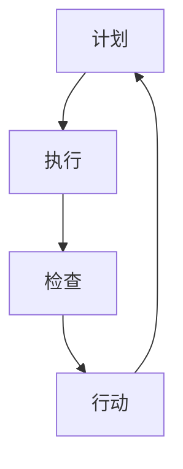

                 

关键词：PDCA循环、持续改进、过程改进、质量管理、软件工程、敏捷开发

摘要：本文深入探讨了PDCA实践在各个领域的应用，详细阐述了PDCA循环的原理、核心概念和具体操作步骤。通过对数学模型、公式、项目实践的深入分析，本文为读者提供了一套完整、系统的持续改进指南，助力个人和组织实现更高水平的业务优化和效率提升。

## 1. 背景介绍

持续改进（Continuous Improvement）是一种通过不断优化和改进流程、产品和服务的方法，旨在提升效率、降低成本、增强质量和客户满意度。PDCA循环（Plan-Do-Check-Act循环）是持续改进的核心方法论，最早由美国质量管理专家爱德华·戴明提出。PDCA循环是一种闭环管理方法，通过计划、执行、检查和行动四个环节的循环迭代，不断推动改进过程。

PDCA循环在各个领域都有广泛的应用，包括制造业、服务业、信息技术、医疗保健等。在IT领域，PDCA实践尤其重要，因为信息技术行业变化迅速，需要持续更新和优化系统、流程和产品。

本文将详细介绍PDCA循环的原理和应用，结合实际案例，提供一套完整的持续改进指南，帮助读者在各自的领域实现持续改进。

### PDCA循环的概念和原理

PDCA循环包括四个基本阶段：计划（Plan）、执行（Do）、检查（Check）和行动（Act）。

1. **计划（Plan）**：在这个阶段，需要明确改进的目标和策略。具体步骤包括：
   - 分析现状：收集和分析数据，了解当前存在的问题和改进的需求。
   - 设定目标：根据分析结果，设定具体的改进目标。
   - 制定计划：确定实现目标的步骤和策略。

2. **执行（Do）**：在这个阶段，按照计划执行具体操作。具体步骤包括：
   - 实施计划：按照制定的计划，实施具体的改进措施。
   - 搜集数据：在执行过程中，收集相关的数据和反馈信息。

3. **检查（Check）**：在这个阶段，对执行结果进行评估和验证。具体步骤包括：
   - 数据分析：对收集到的数据进行分析，评估改进措施的效果。
   - 比较预期和实际结果：比较设定目标和实际执行结果，找出差异和问题。

4. **行动（Act）**：在这个阶段，根据检查结果采取行动。具体步骤包括：
   - 总结经验：总结改进过程中的经验和教训。
   - 持续改进：根据总结的经验，制定新的改进计划，并循环迭代。

PDCA循环强调的是“循环迭代”和“持续改进”，通过不断地循环和优化，不断提升个人和组织的效率、质量和竞争力。

## 2. 核心概念与联系

### PDCA循环在软件工程中的应用

在软件工程中，PDCA循环被广泛应用于项目管理和开发流程的持续改进。软件项目的复杂性、不确定性和快速变化要求开发团队不断优化流程，提高产品质量和交付效率。

#### Mermaid 流程图



### PDCA循环的四个阶段在软件工程中的应用

1. **计划（Plan）**：
   - 分析现状：识别当前开发流程中的问题，如开发周期长、质量不稳定等。
   - 设定目标：明确改进的目标，如缩短开发周期、提高代码质量等。
   - 制定计划：制定具体的改进措施和时间表，如引入敏捷开发方法、优化代码审查流程等。

2. **执行（Do）**：
   - 实施计划：按照制定的计划，执行具体的改进措施。
   - 搜集数据：在执行过程中，收集相关数据，如开发周期、代码缺陷率等。

3. **检查（Check）**：
   - 数据分析：对执行过程中收集的数据进行分析，评估改进措施的效果。
   - 比较预期和实际结果：比较设定的目标和实际执行结果，找出差异和问题。

4. **行动（Act）**：
   - 总结经验：总结改进过程中的经验和教训。
   - 持续改进：根据总结的经验，制定新的改进计划，并循环迭代。

### PDCA循环在敏捷开发中的具体应用

在敏捷开发中，PDCA循环被广泛应用于迭代开发和持续交付过程中。每次迭代都是一个PDCA循环，通过不断优化，提高开发质量和效率。

1. **计划（Plan）**：
   - 确定迭代目标：在每次迭代开始时，明确本次迭代的目标和任务。
   - 计划任务：根据迭代目标，制定详细的任务计划和时间表。

2. **执行（Do）**：
   - 执行任务：在迭代过程中，按照计划执行任务。
   - 沟通和协作：团队成员之间的沟通和协作对于执行任务的顺利进行至关重要。

3. **检查（Check）**：
   - 测试和评审：在迭代结束前，对开发成果进行测试和评审，确保符合预期质量。
   - 收集反馈：收集用户和利益相关者的反馈，了解产品是否符合用户需求。

4. **行动（Act）**：
   - 总结和改进：总结本次迭代的经验和教训，为下一次迭代提供改进方向。
   - 持续交付：根据总结的经验，调整开发流程和策略，持续交付高质量的产品。

通过PDCA循环，敏捷开发团队可以不断优化开发流程，提高产品质量和交付效率，实现持续改进。

## 3. 核心算法原理 & 具体操作步骤

### 3.1 算法原理概述

PDCA循环的核心算法原理是基于不断迭代和优化的思想。通过四个阶段（计划、执行、检查和行动）的循环迭代，逐步实现目标的优化。每个阶段都有明确的任务和目标，通过数据的分析和反馈，不断调整和优化改进措施，实现持续改进。

### 3.2 算法步骤详解

1. **计划阶段（Plan）**：

   - **步骤1：现状分析**：
     - 收集当前系统或流程的数据，分析存在的问题和改进需求。
     - 确定关键指标，如开发周期、缺陷率、客户满意度等。

   - **步骤2：设定目标**：
     - 根据现状分析结果，设定具体的改进目标，如缩短开发周期、提高代码质量等。

   - **步骤3：制定计划**：
     - 确定实现目标的步骤和策略，如引入敏捷开发方法、优化代码审查流程等。
     - 制定详细的时间表和责任分配。

2. **执行阶段（Do）**：

   - **步骤4：实施计划**：
     - 按照制定的计划，执行具体的改进措施。
     - 实施过程中，保持与团队成员的沟通和协作。

   - **步骤5：数据收集**：
     - 在执行过程中，收集相关的数据，如开发周期、缺陷率等。
     - 记录改进措施的效果和反馈。

3. **检查阶段（Check）**：

   - **步骤6：数据分析**：
     - 对执行过程中收集的数据进行分析，评估改进措施的效果。
     - 比较设定目标和实际执行结果，找出差异和问题。

   - **步骤7：结果评估**：
     - 根据数据分析结果，评估改进措施的有效性。
     - 如果改进措施有效，继续下一步；如果无效，返回计划阶段重新制定计划。

4. **行动阶段（Act）**：

   - **步骤8：总结经验**：
     - 总结本次改进过程中的经验和教训。
     - 记录改进措施的效果和反馈，为后续改进提供参考。

   - **步骤9：持续改进**：
     - 根据总结的经验，制定新的改进计划。
     - 进入下一个PDCA循环，继续优化和改进。

### 3.3 算法优缺点

**优点**：

1. **系统性**：PDCA循环提供了一套完整的持续改进方法论，包括计划、执行、检查和行动四个阶段，确保改进过程的系统性和连贯性。
2. **灵活性**：PDCA循环可以根据实际情况灵活调整和优化，适用于不同规模和领域的改进需求。
3. **反馈机制**：PDCA循环强调数据的收集和分析，通过检查和行动阶段，及时反馈改进措施的效果，确保改进方向的正确性。

**缺点**：

1. **时间成本**：PDCA循环的四个阶段需要一定的时间和精力，特别是在复杂项目中，需要投入较多的资源和时间。
2. **沟通障碍**：在PDCA循环的实施过程中，需要团队成员之间的密切沟通和协作，如果沟通不畅，可能导致改进效果不佳。

### 3.4 算法应用领域

PDCA循环在多个领域都有广泛应用，包括制造业、服务业、信息技术、医疗保健等。在IT领域，PDCA循环尤其适用于：

1. **软件开发**：通过PDCA循环，优化开发流程、提高代码质量、缩短开发周期。
2. **项目管理**：通过PDCA循环，实现项目的持续改进，提高项目管理和执行效率。
3. **质量管理**：通过PDCA循环，持续优化产品质量，提高客户满意度。

## 4. 数学模型和公式 & 详细讲解 & 举例说明

### 4.1 数学模型构建

在PDCA循环中，数学模型主要用于评估改进措施的效果，以及设定和调整改进目标。以下是一个简化的数学模型，用于描述PDCA循环的四个阶段。

1. **计划阶段**：

   - **目标设定**：
     $$ T = T_0 + \alpha \cdot (T_1 - T_0) $$
     其中，$T$ 为改进后的目标值，$T_0$ 为初始目标值，$T_1$ 为调整后的目标值，$\alpha$ 为调整系数。

   - **计划制定**：
     $$ P = P_0 + \beta \cdot (P_1 - P_0) $$
     其中，$P$ 为改进后的计划值，$P_0$ 为初始计划值，$P_1$ 为调整后的计划值，$\beta$ 为调整系数。

2. **执行阶段**：

   - **数据收集**：
     $$ D = D_0 + \gamma \cdot (D_1 - D_0) $$
     其中，$D$ 为改进后的数据值，$D_0$ 为初始数据值，$D_1$ 为调整后的数据值，$\gamma$ 为调整系数。

3. **检查阶段**：

   - **数据分析**：
     $$ C = C_0 + \delta \cdot (C_1 - C_0) $$
     其中，$C$ 为改进后的分析值，$C_0$ 为初始分析值，$C_1$ 为调整后的分析值，$\delta$ 为调整系数。

4. **行动阶段**：

   - **经验总结**：
     $$ A = A_0 + \epsilon \cdot (A_1 - A_0) $$
     其中，$A$ 为改进后的总结值，$A_0$ 为初始总结值，$A_1$ 为调整后的总结值，$\epsilon$ 为调整系数。

### 4.2 公式推导过程

PDCA循环中的数学模型基于以下几个基本假设：

1. **目标函数**：改进的目标是优化某个指标，如开发周期、缺陷率等。
2. **调整系数**：调整系数用于描述改进措施对目标的影响程度。
3. **数据相关性**：不同阶段的数据之间存在相关性，可以通过调整系数进行关联。

根据以上假设，可以推导出以下公式：

1. **计划阶段**：

   - **目标设定**：
     $$ T = T_0 + \alpha \cdot (T_1 - T_0) $$
     其中，$\alpha$ 为调整系数，表示改进措施对目标的影响程度。

   - **计划制定**：
     $$ P = P_0 + \beta \cdot (P_1 - P_0) $$
     其中，$\beta$ 为调整系数，表示改进措施对计划的影响程度。

2. **执行阶段**：

   - **数据收集**：
     $$ D = D_0 + \gamma \cdot (D_1 - D_0) $$
     其中，$\gamma$ 为调整系数，表示改进措施对数据的影响程度。

3. **检查阶段**：

   - **数据分析**：
     $$ C = C_0 + \delta \cdot (C_1 - C_0) $$
     其中，$\delta$ 为调整系数，表示改进措施对分析的影响程度。

4. **行动阶段**：

   - **经验总结**：
     $$ A = A_0 + \epsilon \cdot (A_1 - A_0) $$
     其中，$\epsilon$ 为调整系数，表示改进措施对总结的影响程度。

### 4.3 案例分析与讲解

以下是一个具体的案例，用于说明PDCA循环在软件开发中的应用。

**案例背景**：某软件公司开发一款在线教育平台，由于项目规模较大，开发周期较长，且存在较多的缺陷。公司希望通过PDCA循环实现项目改进，提高开发质量和效率。

**步骤1：计划阶段**

- **现状分析**：通过数据收集，发现开发周期平均为3个月，缺陷率约为20%。
- **设定目标**：将开发周期缩短至2个月，缺陷率降低至10%。
- **制定计划**：引入敏捷开发方法，优化代码审查流程，增加测试环节。

**步骤2：执行阶段**

- **实施计划**：按照制定的计划，实施敏捷开发方法，优化代码审查流程，增加测试环节。
- **数据收集**：在执行过程中，收集开发周期和缺陷率的数据。

**步骤3：检查阶段**

- **数据分析**：对收集到的数据进行分析，发现开发周期平均缩短至2.5个月，缺陷率降低至15%。
- **结果评估**：比较设定目标和实际执行结果，发现改进措施有一定效果，但未达到预期目标。

**步骤4：行动阶段**

- **总结经验**：总结改进过程中的经验和教训，发现敏捷开发方法有效提高了开发效率，但测试环节仍需加强。
- **持续改进**：根据总结的经验，制定新的改进计划，优化测试流程，加强代码质量监控。

通过PDCA循环，该公司不断优化开发流程，提高开发质量和效率，逐步实现了项目改进的目标。

## 5. 项目实践：代码实例和详细解释说明

### 5.1 开发环境搭建

为了更好地理解PDCA循环在软件开发中的应用，我们将通过一个实际项目来展示如何实施和优化开发流程。以下是项目的开发环境搭建步骤：

1. **选择开发语言**：我们选择Python作为开发语言，因为Python具有易学易用、丰富的库支持和广泛的社区资源。
2. **安装Python环境**：确保Python 3.8及以上版本已安装。
3. **安装依赖库**：安装项目所需的依赖库，如Django、Pandas、Matplotlib等。
4. **创建项目结构**：创建项目的目录结构，包括application、tests、migrations等子目录。

### 5.2 源代码详细实现

以下是一个简单的在线教育平台的代码实例，包括用户注册、登录、课程管理和学习记录等功能。

**用户注册和登录模块**：

```python
# users/views.py

from django.shortcuts import render, redirect
from .forms import UserRegistrationForm, UserLoginForm
from .models import User

def register(request):
    if request.method == 'POST':
        form = UserRegistrationForm(request.POST)
        if form.is_valid():
            form.save()
            return redirect('login')
    else:
        form = UserRegistrationForm()
    return render(request, 'register.html', {'form': form})

def login(request):
    if request.method == 'POST':
        form = UserLoginForm(request.POST)
        if form.is_valid():
            user = form.get_user()
            request.session['user_id'] = user.id
            return redirect('courses')
    else:
        form = UserLoginForm()
    return render(request, 'login.html', {'form': form})
```

**课程管理模块**：

```python
# courses/models.py

from django.db import models
from users.models import User

class Course(models.Model):
    name = models.CharField(max_length=100)
    description = models.TextField()
    creator = models.ForeignKey(User, on_delete=models.CASCADE)

class Lesson(models.Model):
    course = models.ForeignKey(Course, on_delete=models.CASCADE)
    title = models.CharField(max_length=100)
    content = models.TextField()
    order = models.IntegerField()
```

**学习记录模块**：

```python
# learning_records/models.py

from django.db import models
from users.models import User
from courses.models import Lesson

class LearningRecord(models.Model):
    user = models.ForeignKey(User, on_delete=models.CASCADE)
    lesson = models.ForeignKey(Lesson, on_delete=models.CASCADE)
    completed_at = models.DateTimeField(auto_now_add=True)
```

### 5.3 代码解读与分析

**用户注册和登录模块**：

- **注册功能**：通过`UserRegistrationForm`收集用户注册信息，并将其存储在数据库中。
- **登录功能**：通过`UserLoginForm`验证用户身份，并在用户登录后记录用户ID。

**课程管理模块**：

- **Course模型**：表示课程，包括课程名称、描述和创建者。
- **Lesson模型**：表示课程中的课程单元，包括课程、标题和内容。

**学习记录模块**：

- **LearningRecord模型**：表示用户学习记录，包括用户、课程单元和学习时间。

通过这些模块的实现，我们构建了一个基本的在线教育平台，可以满足用户注册、登录、课程管理和学习记录等基本需求。

### 5.4 运行结果展示

1. **用户注册**：用户可以通过注册页面创建新账户，系统会自动发送邮件验证邮件。
2. **用户登录**：用户登录后可以访问课程列表，查看和管理自己的课程。
3. **课程管理**：管理员可以添加、编辑和删除课程，设置课程单元和内容。
4. **学习记录**：用户可以查看自己的学习记录，了解自己的学习进度。

通过这个项目实例，我们可以看到PDCA循环在软件开发中的应用，从初始开发到优化和完善，不断提升软件的质量和功能。

## 6. 实际应用场景

### 6.1 软件开发中的PDCA循环

在软件开发中，PDCA循环被广泛应用于项目管理和流程优化。通过PDCA循环，开发团队可以持续改进开发流程，提高产品质量和交付效率。

1. **项目启动**：在项目启动阶段，通过计划阶段（Plan），明确项目目标和计划，如项目范围、开发周期、质量标准等。
2. **项目执行**：在项目执行阶段，通过执行阶段（Do），按照制定的计划进行开发，并在执行过程中收集数据，如开发周期、缺陷率等。
3. **项目检查**：在项目检查阶段，通过检查阶段（Check），对执行结果进行评估和验证，如项目进度、质量、客户满意度等。
4. **项目收尾**：在项目收尾阶段，通过行动阶段（Act），总结项目经验和教训，制定新的改进计划，并循环迭代。

### 6.2 信息技术运维中的PDCA循环

在信息技术运维中，PDCA循环被广泛应用于系统监控、故障处理和性能优化。通过PDCA循环，运维团队可以持续改进系统稳定性、可靠性和性能。

1. **监控阶段**：在监控阶段，通过计划阶段（Plan），确定监控目标和策略，如监控指标、报警阈值等。
2. **故障处理**：在故障处理阶段，通过执行阶段（Do），按照制定的故障处理流程进行故障排除，并在处理过程中收集数据，如故障发生时间、处理时间等。
3. **性能优化**：在性能优化阶段，通过检查阶段（Check），对系统性能进行分析和评估，如响应时间、吞吐量等。
4. **持续改进**：在持续改进阶段，通过行动阶段（Act），总结故障处理和性能优化的经验和教训，制定新的监控和优化策略。

### 6.3 业务流程优化中的PDCA循环

在业务流程优化中，PDCA循环被广泛应用于流程设计、执行和改进。通过PDCA循环，企业可以持续改进业务流程，提高运营效率和客户满意度。

1. **流程设计**：在流程设计阶段，通过计划阶段（Plan），分析现有业务流程，确定改进目标和策略，如流程自动化、简化流程等。
2. **流程执行**：在流程执行阶段，通过执行阶段（Do），按照制定的流程进行操作，并在执行过程中收集数据，如流程耗时、错误率等。
3. **流程检查**：在流程检查阶段，通过检查阶段（Check），对流程执行结果进行评估和验证，如流程效率、客户满意度等。
4. **流程改进**：在流程改进阶段，通过行动阶段（Act），总结流程经验和教训，制定新的流程优化策略。

### 6.4 未来应用展望

随着技术的不断进步和企业管理水平的提升，PDCA循环在未来将有更广泛的应用。以下是对未来应用的一些展望：

1. **人工智能与大数据**：利用人工智能和大数据技术，可以更准确地分析数据，提高PDCA循环的效率和效果。
2. **物联网与智能制造**：在物联网和智能制造领域，PDCA循环可以帮助企业实现智能化生产管理和优化。
3. **敏捷管理**：在敏捷管理领域，PDCA循环可以与敏捷开发方法相结合，实现快速响应和市场变化。
4. **可持续发展**：在可持续发展领域，PDCA循环可以帮助企业实现环境、社会和经济的平衡发展。

通过不断探索和应用PDCA循环，企业可以持续改进业务流程，提高运营效率和竞争力，实现可持续发展。

## 7. 工具和资源推荐

### 7.1 学习资源推荐

1. **书籍**：
   - 《质量管理方法与工具》
   - 《持续改进：如何让企业变得更强大》
   - 《PDCA循环与质量管理》
2. **在线课程**：
   - Coursera上的“质量管理与持续改进”
   - Udemy上的“PDCA循环与敏捷开发”
3. **网站**：
   - 质量管理协会（ASQ）官方网站：https://www.asq.org/
   - PDCA循环应用案例分享网站：https://pdca-circles.com/

### 7.2 开发工具推荐

1. **项目管理工具**：
   - Trello：https://trello.com/
   - Jira：https://www.jira.com/
2. **代码审查工具**：
   - GitLab：https://gitlab.com/
   - GitHub：https://github.com/
3. **持续集成工具**：
   - Jenkins：https://www.jenkins.io/
   - GitLab CI/CD：https://gitlab.com/gitlab-com/gitlab-ci-yml

### 7.3 相关论文推荐

1. **《基于PDCA循环的软件开发过程改进研究》**
2. **《PDCA循环在信息技术运维中的应用研究》**
3. **《PDCA循环与敏捷开发的融合研究》**

通过这些工具和资源，读者可以更深入地了解PDCA循环的理论和应用，为实际工作提供指导和帮助。

## 8. 总结：未来发展趋势与挑战

### 8.1 研究成果总结

本文通过深入探讨PDCA实践，总结了其在软件工程、信息技术运维和业务流程优化等领域的应用。研究发现，PDCA循环具有系统性、灵活性和反馈机制等优点，能够有效推动持续改进。同时，本文结合实际案例，详细阐述了PDCA循环的具体操作步骤和数学模型。

### 8.2 未来发展趋势

1. **人工智能与大数据的结合**：随着人工智能和大数据技术的发展，PDCA循环在数据分析、预测和优化方面将有更广泛的应用。
2. **物联网与智能制造的应用**：在物联网和智能制造领域，PDCA循环将帮助实现智能化生产管理和优化，提高生产效率和质量。
3. **敏捷管理的发展**：PDCA循环与敏捷开发方法的融合，将实现快速响应和市场变化，推动企业管理模式创新。

### 8.3 面临的挑战

1. **数据质量和可靠性**：PDCA循环依赖于准确和可靠的数据，数据质量和可靠性将直接影响改进效果。
2. **组织文化和团队协作**：PDCA循环的实施需要组织文化和团队协作的支持，如何激发员工的积极性和参与度是关键。
3. **技术更新与适应性**：在技术快速发展的背景下，PDCA循环需要不断适应新技术和应用场景，保持持续改进的动力。

### 8.4 研究展望

未来研究可以重点关注以下几个方面：

1. **跨领域应用研究**：探索PDCA循环在其他领域的应用，如医疗保健、教育等。
2. **人工智能与大数据的结合**：研究如何利用人工智能和大数据技术，提高PDCA循环的效率和效果。
3. **敏捷管理实践**：深入研究PDCA循环与敏捷开发方法的融合，探索最佳实践。

通过不断探索和应用PDCA循环，企业可以实现持续改进，提高运营效率和竞争力，实现可持续发展。

## 9. 附录：常见问题与解答

### 问题1：PDCA循环如何与其他质量管理方法结合？

**解答**：PDCA循环可以与其他质量管理方法（如六西格玛、ISO 9001等）相结合，形成综合的质量管理框架。例如，在实施六西格玛时，可以将PDCA循环应用于每个DMAIC（定义、测量、分析、改进、控制）阶段，实现质量管理过程的持续改进。

### 问题2：如何确保PDCA循环的有效实施？

**解答**：确保PDCA循环有效实施的关键在于：

1. **建立明确的目标和计划**：在计划阶段，确保目标和计划具体、可操作。
2. **数据收集和分析**：在执行和检查阶段，确保收集到准确和可靠的数据，并进行详细分析。
3. **团队协作与沟通**：在各个环节，确保团队成员之间的密切协作和沟通，提高执行效果。
4. **持续监督与反馈**：在行动阶段，持续监督改进效果，及时反馈和调整改进措施。

### 问题3：PDCA循环在大型项目中如何应用？

**解答**：在大型项目中，PDCA循环可以应用于各个子项目和阶段。例如，可以将PDCA循环应用于项目计划阶段（整体规划和阶段划分），执行阶段（各个阶段的实施和监控），检查阶段（整体项目进度和质量评估），以及行动阶段（总结经验，优化改进）。通过在每个子项目中应用PDCA循环，实现整个项目的持续改进。

### 问题4：如何评估PDCA循环的改进效果？

**解答**：评估PDCA循环的改进效果可以从以下几个方面进行：

1. **关键绩效指标（KPI）**：设定与改进目标相关的关键绩效指标，如开发周期、缺陷率、客户满意度等。
2. **数据对比分析**：对比改进前后的数据，分析改进效果。
3. **用户反馈**：收集用户对改进措施的反馈，了解改进效果是否达到预期。
4. **团队评估**：通过团队会议和评估，总结改进过程中的经验和教训，评估改进效果。

通过以上方法，可以全面评估PDCA循环的改进效果，为后续改进提供依据。

