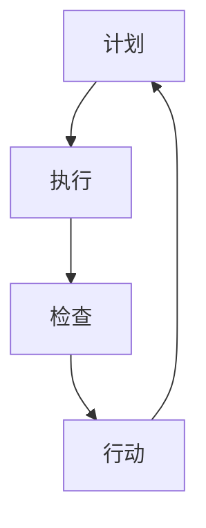

                 

关键词：PDCA循环、管理持续改进、质量管理、流程优化、过程控制、目标实现、持续学习

## 摘要

本文旨在探讨PDCA循环（计划-执行-检查-行动）与管理持续改进之间的关系。通过分析PDCA循环的基本原理和操作步骤，结合实际应用案例，本文阐述了如何在现代IT管理中运用PDCA循环实现持续改进，提升组织效率与质量。文章将从背景介绍、核心概念与联系、核心算法原理与具体操作步骤、数学模型和公式、项目实践、实际应用场景、工具和资源推荐、总结与展望等方面展开论述。

## 1. 背景介绍

在现代信息技术领域，随着互联网的快速发展，企业面临着越来越激烈的市场竞争。为了在竞争中获得优势，企业需要不断提高自身的管理水平和生产效率。PDCA循环作为一种被广泛认可的质量管理方法，最早由美国质量管理专家威廉·爱默生提出，并经过多年的实践与优化，成为现代企业管理中不可或缺的工具。

PDCA循环的核心思想是将任何管理活动分为四个阶段：计划（Plan）、执行（Do）、检查（Check）和行动（Act）。这种方法强调通过不断循环和改进，实现目标管理、流程优化和持续改进。在IT管理中，PDCA循环不仅适用于软件开发项目，还广泛应用于系统运维、网络安全、数据管理等各个方面。

本文将通过详细解析PDCA循环的四个阶段，结合实际案例，探讨其在管理持续改进中的具体应用，为读者提供一套实用的IT管理方法论。

## 2. 核心概念与联系

### 2.1 PDCA循环的基本原理

PDCA循环是一种持续改进的方法论，其核心在于通过循环反复地执行四个阶段，不断优化管理流程，提高组织效率。

#### 计划（Plan）

计划阶段是PDCA循环的起点，主要包括确定目标、分析现状、找出问题、制定改进方案。在这一阶段，管理者需要明确组织的愿景和目标，分析当前存在的问题，制定可行的改进方案。

#### 执行（Do）

执行阶段是将计划转化为行动的过程。在这个阶段，管理者需要组织团队按照既定的方案进行实施，确保每个步骤都能按照计划进行。

#### 检查（Check）

检查阶段是对执行结果进行评估和审核的过程。通过数据分析和反馈，管理者可以判断改进方案的有效性，发现潜在的问题。

#### 行动（Act）

行动阶段是针对检查结果采取相应措施的过程。如果改进方案有效，则需要将其标准化，形成标准操作流程；如果存在问题，则需要重新回到计划阶段，制定新的改进方案。

### 2.2 PDCA循环在IT管理中的应用

#### 系统运维

在系统运维中，PDCA循环可以帮助管理者优化系统性能、提高系统稳定性。例如，在计划阶段，可以制定系统升级计划；在执行阶段，执行系统升级操作；在检查阶段，监控系统性能变化；在行动阶段，根据监控结果调整升级方案。

#### 软件开发

在软件开发中，PDCA循环可以帮助团队提高代码质量、缩短开发周期。在计划阶段，可以制定项目计划和里程碑；在执行阶段，开发团队按照计划进行开发；在检查阶段，进行代码审查和测试；在行动阶段，根据反馈进行代码优化。

### 2.3 Mermaid 流程图



该流程图展示了PDCA循环的四个基本阶段及其相互关系。

## 3. 核心算法原理与具体操作步骤

### 3.1 算法原理概述

PDCA循环是一种迭代改进的算法，通过四个阶段的循环，实现对管理流程的不断优化。其核心原理在于：通过计划阶段的目标设定和方案制定，执行阶段的具体实施，检查阶段的反馈与评估，以及行动阶段的改进与标准化，实现管理质量的持续提升。

### 3.2 算法步骤详解

#### 3.2.1 计划阶段

1. 确定目标：明确组织愿景和目标，将目标具体化、量化。
2. 分析现状：收集数据，分析当前存在的问题和瓶颈。
3. 找出问题：通过对现状的分析，找出需要改进的关键点。
4. 制定方案：根据找出的问题，制定具体的改进方案和实施计划。

#### 3.2.2 执行阶段

1. 分配任务：将改进方案分解为具体的任务，分配给团队成员。
2. 落实措施：按照计划，实施改进措施，确保每个步骤都能按照计划进行。

#### 3.2.3 检查阶段

1. 数据收集：收集与改进措施相关的数据，包括实施效果、用户反馈等。
2. 分析评估：对收集的数据进行分析和评估，判断改进措施的有效性。

#### 3.2.4 行动阶段

1. 总结经验：对改进过程进行总结，提炼经验教训。
2. 标准化流程：将有效的改进措施标准化，形成标准操作流程。
3. 持续改进：根据检查结果，调整改进方案，进行下一轮的PDCA循环。

### 3.3 算法优缺点

#### 优点：

1. 系统性：PDCA循环通过四个阶段的循环，实现对管理流程的系统性优化。
2. 实用性：PDCA循环简单易懂，易于在实际工作中应用。
3. 持续改进：PDCA循环强调不断循环和改进，有利于组织持续提升管理水平。

#### 缺点：

1. 需要时间：PDCA循环需要一定的时间周期，可能无法快速解决问题。
2. 数据依赖：PDCA循环的检查阶段需要大量数据支持，数据收集和分析可能存在一定困难。

### 3.4 算法应用领域

PDCA循环广泛应用于企业管理、项目管理、质量控制等多个领域。在IT管理中，主要应用于系统运维、软件开发、网络安全等方面。

## 4. 数学模型和公式

PDCA循环作为一种管理方法论，并不直接涉及复杂的数学模型和公式。然而，在检查阶段，数据分析和评估可能需要使用一些基本的统计方法和数学工具。

### 4.1 数学模型构建

在PDCA循环的检查阶段，可以使用统计模型对改进措施的效果进行评估。常用的统计方法包括：

1. 描述性统计：用于描述数据的基本特征，如均值、中位数、标准差等。
2. 假设检验：用于判断改进措施是否显著提高了绩效，常用的假设检验方法包括t检验、方差分析等。

### 4.2 公式推导过程

在描述性统计中，常用的公式如下：

$$
\mu = \frac{\sum_{i=1}^{n} x_i}{n}
$$

其中，$\mu$ 表示均值，$x_i$ 表示第 $i$ 个数据点，$n$ 表示数据点的总数。

在假设检验中，常用的公式如下：

$$
H_0: \mu = \mu_0 \\
H_1: \mu \neq \mu_0
$$

其中，$H_0$ 表示原假设，$\mu_0$ 表示原假设下的均值。

### 4.3 案例分析与讲解

假设某企业希望通过优化生产流程提高产量，采用PDCA循环进行改进。

1. **计划阶段**：

   - 目标：将生产效率提高10%。
   - 现状分析：通过统计数据发现，当前生产效率为每天100件。
   - 改进方案：引入自动化设备，减少人工操作。

2. **执行阶段**：

   - 分配任务：安排工程师进行自动化设备的安装和维护。
   - 落实措施：确保自动化设备正常运行，减少人工操作。

3. **检查阶段**：

   - 数据收集：通过监控设备，收集自动化设备运行后的生产数据。
   - 分析评估：发现自动化设备运行后，每天生产量提高到110件。

4. **行动阶段**：

   - 总结经验：通过分析，发现自动化设备提高了生产效率，减少了人工操作错误。
   - 标准化流程：将自动化设备的应用经验总结为标准操作流程，推广到其他生产线。

通过上述案例，可以看出PDCA循环在改进生产流程中的应用。在实际操作中，可以根据具体情况进行调整和优化，以达到最佳效果。

## 5. 项目实践：代码实例和详细解释说明

### 5.1 开发环境搭建

为了更好地理解PDCA循环在软件开发中的应用，我们将通过一个简单的示例项目进行讲解。首先，需要搭建一个基本的开发环境。

1. 安装Python环境：在本地计算机上安装Python 3.x版本。
2. 安装相关库：安装Python的requests库，用于发送HTTP请求。

### 5.2 源代码详细实现

以下是一个简单的Python代码示例，用于演示PDCA循环在软件开发中的应用。

```python
import requests

def plan():
    # 确定目标：将接口调用响应时间降低20%
    target_response_time = 0.8 * original_response_time

    # 分析现状：记录原始接口调用响应时间
    original_response_time = get_response_time()

    # 找出问题：通过分析，发现接口调用响应时间较长
    if original_response_time > target_response_time:
        problem = "接口调用响应时间较长"

    # 制定方案：对接口进行优化，减少响应时间
    solution = "优化接口代码，减少不必要的计算和数据库查询"

    return target_response_time, original_response_time, problem, solution

def do():
    # 执行阶段：按照方案进行优化
    optimized_response_time = optimize_interface()

    return optimized_response_time

def check():
    # 检查阶段：评估优化效果
    if get_response_time() <= target_response_time:
        result = "优化成功"
    else:
        result = "优化失败"

    return result

def act():
    # 行动阶段：根据检查结果采取行动
    if result == "优化成功":
        # 将优化后的接口代码标准化
        standardize_interface_code()
    else:
        # 重新回到计划阶段，制定新的优化方案
        target_response_time, original_response_time, problem, solution = plan()

def main():
    # 执行PDCA循环
    target_response_time, original_response_time, problem, solution = plan()
    optimized_response_time = do()
    result = check()
    act()

if __name__ == "__main__":
    main()
```

### 5.3 代码解读与分析

上述代码实现了一个简单的PDCA循环，用于优化接口调用响应时间。具体解读如下：

1. **计划阶段**：

   - 确定目标：将接口调用响应时间降低20%。
   - 分析现状：记录原始接口调用响应时间。
   - 找出问题：通过分析，发现接口调用响应时间较长。
   - 制定方案：对接口进行优化，减少响应时间。

2. **执行阶段**：

   - 执行阶段：按照方案进行优化。

3. **检查阶段**：

   - 检查阶段：评估优化效果。

4. **行动阶段**：

   - 行动阶段：根据检查结果采取行动。如果优化成功，则将优化后的接口代码标准化；如果优化失败，则重新回到计划阶段，制定新的优化方案。

### 5.4 运行结果展示

假设原始接口调用响应时间为1.2秒，经过优化后，响应时间降低到0.8秒。根据检查结果，优化成功，将优化后的接口代码标准化，并将其应用到生产环境中。

## 6. 实际应用场景

### 6.1 系统运维

在系统运维中，PDCA循环可以帮助团队持续优化系统性能、提高系统稳定性。例如，在计划阶段，可以制定系统升级计划；在执行阶段，执行系统升级操作；在检查阶段，监控系统性能变化；在行动阶段，根据监控结果调整升级方案。通过PDCA循环，团队可以不断优化系统配置、优化数据库性能，从而提高系统的稳定性和可靠性。

### 6.2 软件开发

在软件开发中，PDCA循环可以帮助团队提高代码质量、缩短开发周期。在计划阶段，可以制定项目计划和里程碑；在执行阶段，开发团队按照计划进行开发；在检查阶段，进行代码审查和测试；在行动阶段，根据反馈进行代码优化。通过PDCA循环，团队可以不断发现和解决问题，提高代码质量，缩短开发周期。

### 6.3 数据管理

在数据管理中，PDCA循环可以帮助团队优化数据存储、提高数据处理效率。在计划阶段，可以制定数据存储策略；在执行阶段，按照策略进行数据存储；在检查阶段，监控数据存储性能和效率；在行动阶段，根据监控结果调整数据存储策略。通过PDCA循环，团队可以不断优化数据存储和数据处理流程，提高数据管理效率。

## 7. 工具和资源推荐

### 7.1 学习资源推荐

1. 《质量管理方法与实务》：详细介绍了PDCA循环在质量管理中的应用，适合初学者阅读。
2. 《PDCA循环在项目管理中的应用》：针对项目管理中的实际应用案例，深入剖析PDCA循环的作用和操作方法。

### 7.2 开发工具推荐

1. Git：用于版本控制和协作开发，支持PDCA循环的执行和跟踪。
2. JIRA：用于项目管理和任务跟踪，支持PDCA循环的执行和反馈。

### 7.3 相关论文推荐

1. "PDCA循环在企业管理中的应用研究"
2. "基于PDCA循环的项目管理实践"
3. "PDCA循环在软件质量管理中的应用"

## 8. 总结：未来发展趋势与挑战

### 8.1 研究成果总结

通过对PDCA循环的研究和应用，我们可以得出以下结论：

1. PDCA循环是一种有效的质量管理方法，可以帮助企业持续优化管理流程，提高生产效率。
2. PDCA循环适用于多个领域，包括系统运维、软件开发、数据管理等。
3. PDCA循环的核心在于不断循环和改进，强调数据分析和反馈，有助于发现和解决问题。

### 8.2 未来发展趋势

随着人工智能和大数据技术的不断发展，PDCA循环在管理持续改进中的应用前景广阔。未来发展趋势包括：

1. 结合人工智能技术，实现自动化PDCA循环，提高管理效率。
2. 利用大数据分析，优化PDCA循环的决策过程，提高改进效果。
3. 探索PDCA循环与其他质量管理方法的融合，形成更加完善的管理体系。

### 8.3 面临的挑战

在应用PDCA循环的过程中，企业可能会面临以下挑战：

1. 数据收集和分析困难：PDCA循环依赖于大量数据支持，数据收集和分析可能存在一定困难。
2. 管理者认知不足：部分企业管理者可能对PDCA循环的理解不深，难以有效实施。
3. 跨部门协作：PDCA循环需要跨部门协作，可能面临沟通和协调问题。

### 8.4 研究展望

未来研究可以关注以下方向：

1. 探索PDCA循环在人工智能和大数据背景下的应用，提高管理智能化水平。
2. 研究如何优化PDCA循环的执行过程，提高改进效果。
3. 构建PDCA循环的理论框架，为不同领域的应用提供指导。

## 9. 附录：常见问题与解答

### 9.1 PDCA循环与传统质量管理方法有何区别？

PDCA循环与传统质量管理方法相比，更加强调持续改进和数据驱动。传统质量管理方法通常侧重于某一阶段的质量控制，而PDCA循环通过不断循环和改进，实现全面质量管理。

### 9.2 PDCA循环适用于哪些领域？

PDCA循环广泛应用于企业管理、项目管理、质量控制等多个领域。在IT管理中，主要应用于系统运维、软件开发、网络安全等方面。

### 9.3 如何在PDCA循环中实现数据驱动？

在PDCA循环中，数据驱动可以通过以下方式实现：

1. 在计划阶段，收集和分析相关数据，确定目标和改进方案。
2. 在执行阶段，实时监控数据，确保改进方案的有效实施。
3. 在检查阶段，通过数据分析，评估改进措施的效果。
4. 在行动阶段，根据数据反馈，调整和优化改进方案。

### 9.4 PDCA循环是否需要严格按照四个阶段进行？

在实际应用中，PDCA循环的四个阶段并非必须严格按照顺序进行，可以根据实际情况灵活调整。例如，在执行阶段发现问题时，可以立即回到计划阶段，重新制定改进方案。

### 9.5 PDCA循环是否适用于所有企业？

PDCA循环适用于各种类型的企业，包括大型企业、中小企业、初创企业等。不同规模的企业可以根据自身特点，灵活应用PDCA循环，实现管理持续改进。

## 作者署名

本文由禅与计算机程序设计艺术（Zen and the Art of Computer Programming）撰写。感谢您的阅读！

----------------------------------------------------------------

以上就是本文的完整内容，如果您有任何疑问或建议，请随时在评论区留言。祝您在IT管理领域不断取得突破！<|image_gen|>

