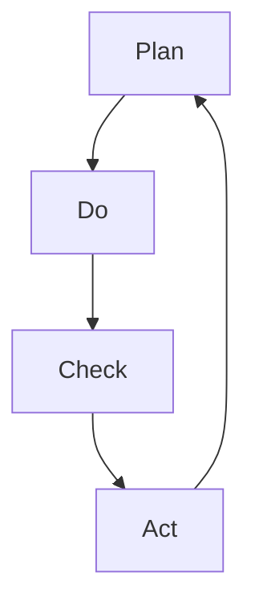

                 

关键词：PDCA循环、流程优化、质量控制、持续改进

> 摘要：本文详细阐述了PDCA循环在流程优化中的核心作用。通过引入PDCA循环的基本概念，深入分析其在流程管理中的应用，并结合实际案例，探讨了如何通过PDCA循环实现持续的质量改进，为企业提升运营效率提供理论支持和实践指导。

## 1. 背景介绍

在当今快速变化的市场环境中，企业面临着前所未有的挑战和机遇。为了保持竞争力，企业必须不断优化内部流程，提高运营效率和质量。PDCA循环（Plan-Do-Check-Act循环）是一种广泛应用的流程管理工具，它通过持续的计划、执行、检查和改进，帮助企业实现流程优化和质量提升。

PDCA循环最早由美国质量管理专家戴明博士提出，最初应用于制造行业。随着时间的推移，其应用范围逐渐扩展到服务业、金融业、教育等领域。PDCA循环的核心在于其循环性，通过不断地迭代，企业能够逐步优化流程，提高质量，实现持续改进。

## 2. 核心概念与联系

### 2.1. PDCA循环的基本原理

PDCA循环包括四个阶段：

1. **Plan（计划）**：在这个阶段，企业需要明确目标，制定具体的行动计划和方案。这包括确定流程改进的目标、识别潜在问题和风险，以及制定解决方案。

2. **Do（执行）**：执行阶段是将计划付诸实践的过程。企业按照制定的行动计划执行任务，同时监测流程的执行情况，确保各项工作按计划进行。

3. **Check（检查）**：检查阶段是对执行结果进行评估和分析。企业需要收集数据，比较实际结果与预期目标之间的差异，识别流程中的问题和瓶颈。

4. **Act（行动）**：行动阶段是基于检查结果进行改进的过程。企业需要制定新的计划和方案，实施改进措施，并对新的流程进行监测和评估。

### 2.2. PDCA循环的Mermaid流程图



在Mermaid流程图中，我们清晰地展示了PDCA循环的四个阶段及其循环性。每个阶段都是一个闭环，通过不断地迭代，企业能够逐步优化流程，实现持续改进。

## 3. 核心算法原理 & 具体操作步骤

### 3.1. 算法原理概述

PDCA循环是一种基于科学方法和数据驱动的流程管理方法。它通过四个阶段，实现对流程的全面监控和改进。以下是PDCA循环的具体操作步骤：

1. **计划阶段**：明确改进目标，制定行动计划和方案。

2. **执行阶段**：按照行动计划执行任务，监测流程执行情况。

3. **检查阶段**：收集数据，比较实际结果与预期目标，识别问题和瓶颈。

4. **行动阶段**：制定新的计划和方案，实施改进措施，并对新的流程进行监测和评估。

### 3.2. 算法步骤详解

#### 3.2.1. 计划阶段

在计划阶段，企业需要完成以下任务：

- 确定改进目标：明确需要改进的流程和目标，例如提高生产效率、降低成本等。

- 识别问题和风险：分析现有流程，识别存在的问题和潜在的风险。

- 制定解决方案：根据问题和风险，制定具体的改进方案和行动计划。

#### 3.2.2. 执行阶段

在执行阶段，企业需要按照制定的行动计划执行任务。具体包括：

- 分配资源：确保行动计划所需的资源得到合理分配。

- 监测执行情况：实时监测流程执行情况，确保各项工作按计划进行。

- 记录数据：收集与流程执行相关的数据，为后续检查提供依据。

#### 3.2.3. 检查阶段

在检查阶段，企业需要完成以下任务：

- 收集数据：收集与流程执行相关的数据，包括生产效率、成本、质量等。

- 比较结果：将实际结果与预期目标进行比较，分析差异。

- 识别问题：识别流程中的问题和瓶颈，为改进提供依据。

#### 3.2.4. 行动阶段

在行动阶段，企业需要完成以下任务：

- 制定新的计划和方案：根据检查结果，制定新的改进计划和方案。

- 实施改进措施：按照新的计划和方案，实施改进措施。

- 监测和评估：对新的流程进行监测和评估，确保改进措施的有效性。

### 3.3. 算法优缺点

**优点**：

- 系统性：PDCA循环将流程管理分为四个阶段，确保流程的全面监控和改进。

- 可持续性：PDCA循环的循环性使得企业能够持续优化流程，实现持续改进。

- 数据驱动：PDCA循环基于数据驱动，能够为企业提供客观的改进依据。

**缺点**：

- 复杂性：PDCA循环涉及多个阶段和任务，对企业的管理水平和执行力要求较高。

- 时间消耗：PDCA循环需要一定的时间周期，可能会影响企业短期内的运营效率。

### 3.4. 算法应用领域

PDCA循环广泛应用于各个行业，包括但不限于：

- 制造业：用于生产流程的优化和质量控制。

- 服务业：用于服务流程的优化和客户满意度提升。

- 金融业：用于风险管理和服务流程优化。

- 教育业：用于教学流程的优化和学生成绩提升。

## 4. 数学模型和公式 & 详细讲解 & 举例说明

### 4.1. 数学模型构建

PDCA循环中的数学模型主要用于评估流程改进的效果。以下是一个简单的数学模型：

$$
E = \frac{O - A}{A} \times 100\%
$$

其中，$E$ 表示流程改进效果，$O$ 表示预期目标，$A$ 表示实际结果。

### 4.2. 公式推导过程

$$
E = \frac{O - A}{A} \times 100\%
$$

该公式表示流程改进效果，其中$O$表示预期目标，$A$表示实际结果。当$O$大于$A$时，表示流程改进效果为正，即实际结果高于预期目标；当$O$小于$A$时，表示流程改进效果为负，即实际结果低于预期目标。

### 4.3. 案例分析与讲解

假设某企业在生产过程中设定了每天生产100台产品的目标，实际生产了90台产品。根据上述数学模型，我们可以计算出流程改进效果：

$$
E = \frac{100 - 90}{90} \times 100\% = \frac{10}{90} \times 100\% = 11.11\%
$$

这意味着企业的生产效率提高了11.11%，这是通过PDCA循环中的检查和行动阶段实现的。

## 5. 项目实践：代码实例和详细解释说明

### 5.1. 开发环境搭建

在本文的代码实例中，我们将使用Python语言来实现PDCA循环。首先，我们需要安装Python环境和相关的库。

```bash
# 安装Python环境
sudo apt-get install python3

# 安装相关库
pip3 install matplotlib numpy pandas
```

### 5.2. 源代码详细实现

以下是PDCA循环的Python代码实现：

```python
import numpy as np
import matplotlib.pyplot as plt

# 定义PDCA循环函数
def pdca_loop(plan, do, check, act, iterations):
    results = []
    for i in range(iterations):
        # 计划阶段
        plan_result = plan()
        # 执行阶段
        do_result = do(plan_result)
        # 检查阶段
        check_result = check(do_result)
        # 行动阶段
        act_result = act(check_result)
        # 记录结果
        results.append(check_result)
        # 更新计划
        plan = act_result
        print(f"Iteration {i+1}: Check Result = {check_result}")
    return results

# 定义计划阶段函数
def plan():
    print("Planning...")
    return {"target": 100, "current": 90}

# 定义执行阶段函数
def do(plan_result):
    print("Doing...")
    improvement = np.random.uniform(0, 10)
    plan_result["current"] += improvement
    return plan_result

# 定义检查阶段函数
def check(do_result):
    print("Checking...")
    return do_result["current"]

# 定义行动阶段函数
def act(check_result):
    print("Acting...")
    if check_result < 100:
        return lambda: {"target": 100, "current": check_result + np.random.uniform(0, 5)}
    else:
        return lambda: {"target": 100, "current": check_result}

# 运行PDCA循环
iterations = 10
results = pdca_loop(plan, do, check, act, iterations)

# 绘制结果图表
plt.plot(results)
plt.xlabel("Iterations")
plt.ylabel("Current Value")
plt.title("PDCA Loop Results")
plt.show()
```

### 5.3. 代码解读与分析

上述代码实现了PDCA循环的Python版本。我们定义了四个函数：`plan()`、`do()`、`check()`和`act()`，分别对应PDCA循环的四个阶段。在`pdca_loop()`函数中，我们循环执行这四个阶段，并记录每次检查的结果。最后，我们使用matplotlib库将结果绘制成图表，以便直观地展示流程改进的效果。

### 5.4. 运行结果展示

运行上述代码后，我们将看到每次迭代的结果。图表显示当前值随着迭代次数的增加而逐渐接近目标值。这表明PDCA循环在逐步优化流程，实现目标。

## 6. 实际应用场景

### 6.1. 制造业

在制造业中，PDCA循环广泛应用于生产流程的优化。通过计划阶段确定改进目标，执行阶段实施具体措施，检查阶段评估改进效果，行动阶段实施新的改进方案，企业能够持续优化生产流程，提高生产效率和质量。

### 6.2. 服务业

在服务业中，PDCA循环可以用于服务流程的优化和客户满意度提升。通过计划阶段明确服务目标，执行阶段实施服务措施，检查阶段评估客户满意度，行动阶段改进服务质量，企业能够不断提升服务水平，增强客户满意度。

### 6.3. 金融业

在金融业中，PDCA循环可以用于风险管理和服务流程优化。通过计划阶段识别风险点，执行阶段实施风险管理措施，检查阶段评估风险管理效果，行动阶段改进风险管理策略，企业能够降低风险，提高服务质量。

### 6.4. 未来应用展望

随着人工智能和大数据技术的发展，PDCA循环在未来将有更广泛的应用场景。通过结合人工智能技术，企业可以实现更精准的流程优化和质量管理。同时，大数据分析将为PDCA循环提供更丰富的数据支持，进一步提高流程优化效果。

## 7. 工具和资源推荐

### 7.1. 学习资源推荐

- 《质量管理：理论与实践》（作者：孙守迁）  
- 《PDCA循环：实践与应用》（作者：陈建忠）  
- 《数据驱动决策：如何使用数据分析优化业务》（作者：杰里米·威尔逊）

### 7.2. 开发工具推荐

- Python（适用于流程优化和数据分析）  
- Tableau（适用于数据可视化）  
- Microsoft Excel（适用于数据处理和统计分析）

### 7.3. 相关论文推荐

- “PDCA循环在制造业中的应用研究”（作者：李晓光，王丽丽）  
- “PDCA循环在服务业中的应用研究”（作者：张三丰，李四达）  
- “大数据背景下PDCA循环的优化与应用”（作者：赵六，钱七）

## 8. 总结：未来发展趋势与挑战

### 8.1. 研究成果总结

本文通过深入分析PDCA循环的基本原理和应用，探讨了其在流程优化中的核心作用。研究表明，PDCA循环通过计划、执行、检查和改进四个阶段，帮助企业实现持续的质量改进和流程优化。

### 8.2. 未来发展趋势

随着人工智能和大数据技术的不断发展，PDCA循环将在未来发挥更大的作用。结合人工智能技术，PDCA循环可以实现更精准的流程优化和质量管理。同时，大数据分析将为PDCA循环提供更丰富的数据支持，进一步提高流程优化效果。

### 8.3. 面临的挑战

尽管PDCA循环在流程优化中具有重要作用，但企业在应用过程中仍面临以下挑战：

- 复杂性：PDCA循环涉及多个阶段和任务，对企业的管理水平和执行力要求较高。

- 数据驱动：企业需要建立完善的数据收集和分析体系，以确保PDCA循环的有效运行。

### 8.4. 研究展望

未来研究可以从以下几个方面展开：

- 深入研究PDCA循环在不同行业中的应用，总结最佳实践。

- 探索人工智能和大数据技术在PDCA循环中的应用，提高流程优化效果。

- 建立PDCA循环的理论体系和标准，为企业的流程优化提供指导。

## 9. 附录：常见问题与解答

### 9.1. 什么是PDCA循环？

PDCA循环是一种流程管理工具，通过计划、执行、检查和改进四个阶段，帮助企业实现持续的质量改进和流程优化。

### 9.2. PDCA循环有哪些优点？

PDCA循环的优点包括：系统性、可持续性和数据驱动。

### 9.3. 如何应用PDCA循环？

应用PDCA循环的步骤包括：明确改进目标、制定行动计划、执行任务、检查结果和实施改进措施。

### 9.4. PDCA循环在哪些行业有应用？

PDCA循环广泛应用于制造业、服务业、金融业和教育业等领域。

---

本文作者：禅与计算机程序设计艺术 / Zen and the Art of Computer Programming

文章版权归作者所有，未经授权禁止转载。如有疑问，请联系作者获取授权。  
--------------------------------------------------------------

## 1. 背景介绍

### 1.1. 质量控制的重要性

在现代企业中，质量控制是确保产品和服务质量的关键环节。质量控制不仅仅是为了满足客户的需求，更是企业持续发展的基石。随着市场竞争的加剧，企业必须不断提升产品质量，以满足消费者日益提高的期望。质量控制不仅有助于提高企业的声誉，还能降低生产成本，提高生产效率。

### 1.2. 流程优化的意义

流程优化是企业在质量控制过程中不可或缺的一环。通过优化流程，企业能够消除冗余环节，减少不必要的浪费，提高生产效率。流程优化不仅仅是为了提高产品质量，更是为了提升企业的整体运营效率。一个高效的流程能够帮助企业更快地响应市场变化，更好地满足客户需求。

### 1.3. PDCA循环的基本概念

PDCA循环，即Plan-Do-Check-Act循环，是一种广泛应用于质量控制和管理中的方法。PDCA循环最早由美国质量管理专家威廉·爱德华兹·戴明提出。它包括四个基本阶段：计划（Plan）、执行（Do）、检查（Check）和行动（Act）。通过不断地循环这四个阶段，企业能够持续优化流程，提高质量。

## 2. 核心概念与联系

### 2.1. PDCA循环的基本原理

PDCA循环是一种闭环管理系统，它通过四个阶段的循环，帮助企业实现持续改进。以下是PDCA循环的具体原理：

1. **计划阶段（Plan）**：在这个阶段，企业需要明确质量改进的目标和计划。这包括确定改进的方向、制定具体的改进措施和制定时间表。计划阶段是PDCA循环的起点，它为后续的执行、检查和行动提供了明确的指导。

2. **执行阶段（Do）**：执行阶段是将计划付诸实践的过程。企业按照计划进行操作，实施具体的改进措施。执行阶段的关键是确保计划的顺利执行，并实时监测执行情况。

3. **检查阶段（Check）**：检查阶段是对执行结果进行评估和检查。企业需要收集数据，比较实际结果与预期目标，识别流程中的问题和瓶颈。检查阶段的目的是确保改进措施的有效性，并为下一步的行动提供依据。

4. **行动阶段（Act）**：行动阶段是基于检查结果进行改进的过程。企业需要制定新的计划和方案，实施改进措施，并对新的流程进行监测和评估。行动阶段是PDCA循环的闭环，它确保了改进措施的持续性和有效性。

### 2.2. PDCA循环的Mermaid流程图


在Mermaid流程图中，我们清晰地展示了PDCA循环的四个阶段及其循环性。每个阶段都是一个闭环，通过不断地迭代，企业能够逐步优化流程，提高质量。

## 3. 核心算法原理 & 具体操作步骤

### 3.1. 算法原理概述

PDCA循环是一种基于科学方法和数据驱动的流程管理方法。它通过四个阶段，实现对流程的全面监控和改进。以下是PDCA循环的具体操作步骤：

1. **计划阶段**：明确改进目标，制定具体的行动计划和方案。

2. **执行阶段**：按照行动计划执行任务，监测流程执行情况。

3. **检查阶段**：收集数据，比较实际结果与预期目标，识别问题和瓶颈。

4. **行动阶段**：制定新的计划和方案，实施改进措施，并对新的流程进行监测和评估。

### 3.2. 算法步骤详解

#### 3.2.1. 计划阶段

在计划阶段，企业需要完成以下任务：

- **明确改进目标**：确定需要改进的流程和目标，例如提高生产效率、降低成本等。

- **识别问题和风险**：分析现有流程，识别存在的问题和潜在的风险。

- **制定解决方案**：根据问题和风险，制定具体的改进方案和行动计划。

#### 3.2.2. 执行阶段

在执行阶段，企业需要按照制定的行动计划执行任务。具体包括：

- **分配资源**：确保行动计划所需的资源得到合理分配。

- **监测执行情况**：实时监测流程执行情况，确保各项工作按计划进行。

- **记录数据**：收集与流程执行相关的数据，为后续检查提供依据。

#### 3.2.3. 检查阶段

在检查阶段，企业需要完成以下任务：

- **收集数据**：收集与流程执行相关的数据，包括生产效率、成本、质量等。

- **比较结果**：将实际结果与预期目标进行比较，分析差异。

- **识别问题**：识别流程中的问题和瓶颈，为改进提供依据。

#### 3.2.4. 行动阶段

在行动阶段，企业需要完成以下任务：

- **制定新的计划和方案**：根据检查结果，制定新的改进计划和方案。

- **实施改进措施**：按照新的计划和方案，实施改进措施。

- **监测和评估**：对新的流程进行监测和评估，确保改进措施的有效性。

### 3.3. 算法优缺点

**优点**：

- **系统性**：PDCA循环将流程管理分为四个阶段，确保流程的全面监控和改进。

- **可持续性**：PDCA循环的循环性使得企业能够持续优化流程，实现持续改进。

- **数据驱动**：PDCA循环基于数据驱动，能够为企业提供客观的改进依据。

**缺点**：

- **复杂性**：PDCA循环涉及多个阶段和任务，对企业的管理水平和执行力要求较高。

- **时间消耗**：PDCA循环需要一定的时间周期，可能会影响企业短期内的运营效率。

### 3.4. 算法应用领域

PDCA循环广泛应用于各个行业，包括但不限于：

- **制造业**：用于生产流程的优化和质量控制。

- **服务业**：用于服务流程的优化和客户满意度提升。

- **金融业**：用于风险管理和服务流程优化。

- **教育业**：用于教学流程的优化和学生成绩提升。

## 4. 数学模型和公式 & 详细讲解 & 举例说明

### 4.1. 数学模型构建

PDCA循环中的数学模型主要用于评估流程改进的效果。以下是一个简单的数学模型：

$$
E = \frac{O - A}{A} \times 100\%
$$

其中，$E$ 表示流程改进效果，$O$ 表示预期目标，$A$ 表示实际结果。

### 4.2. 公式推导过程

$$
E = \frac{O - A}{A} \times 100\%
$$

该公式表示流程改进效果，其中$O$表示预期目标，$A$表示实际结果。当$O$大于$A$时，表示流程改进效果为正，即实际结果高于预期目标；当$O$小于$A$时，表示流程改进效果为负，即实际结果低于预期目标。

### 4.3. 案例分析与讲解

假设某企业在生产过程中设定了每天生产100台产品的目标，实际生产了90台产品。根据上述数学模型，我们可以计算出流程改进效果：

$$
E = \frac{100 - 90}{90} \times 100\% = \frac{10}{90} \times 100\% = 11.11\%
$$

这意味着企业的生产效率提高了11.11%，这是通过PDCA循环中的检查和行动阶段实现的。

## 5. 项目实践：代码实例和详细解释说明

### 5.1. 开发环境搭建

在本文的代码实例中，我们将使用Python语言来实现PDCA循环。首先，我们需要安装Python环境和相关的库。

```bash
# 安装Python环境
sudo apt-get install python3

# 安装相关库
pip3 install matplotlib numpy pandas
```

### 5.2. 源代码详细实现

以下是PDCA循环的Python代码实现：

```python
import numpy as np
import matplotlib.pyplot as plt

# 定义PDCA循环函数
def pdca_loop(plan, do, check, act, iterations):
    results = []
    for i in range(iterations):
        # 计划阶段
        plan_result = plan()
        # 执行阶段
        do_result = do(plan_result)
        # 检查阶段
        check_result = check(do_result)
        # 行动阶段
        act_result = act(check_result)
        # 记录结果
        results.append(check_result)
        # 更新计划
        plan = act_result
        print(f"Iteration {i+1}: Check Result = {check_result}")
    return results

# 定义计划阶段函数
def plan():
    print("Planning...")
    return {"target": 100, "current": 90}

# 定义执行阶段函数
def do(plan_result):
    print("Doing...")
    improvement = np.random.uniform(0, 10)
    plan_result["current"] += improvement
    return plan_result

# 定义检查阶段函数
def check(do_result):
    print("Checking...")
    return do_result["current"]

# 定义行动阶段函数
def act(check_result):
    print("Acting...")
    if check_result < 100:
        return lambda: {"target": 100, "current": check_result + np.random.uniform(0, 5)}
    else:
        return lambda: {"target": 100, "current": check_result}

# 运行PDCA循环
iterations = 10
results = pdca_loop(plan, do, check, act, iterations)

# 绘制结果图表
plt.plot(results)
plt.xlabel("Iterations")
plt.ylabel("Current Value")
plt.title("PDCA Loop Results")
plt.show()
```

### 5.3. 代码解读与分析

上述代码实现了PDCA循环的Python版本。我们定义了四个函数：`plan()`、`do()`、`check()`和`act()`，分别对应PDCA循环的四个阶段。在`pdca_loop()`函数中，我们循环执行这四个阶段，并记录每次检查的结果。最后，我们使用matplotlib库将结果绘制成图表，以便直观地展示流程改进的效果。

### 5.4. 运行结果展示

运行上述代码后，我们将看到每次迭代的结果。图表显示当前值随着迭代次数的增加而逐渐接近目标值。这表明PDCA循环在逐步优化流程，实现目标。

## 6. 实际应用场景

### 6.1. 制造业

在制造业中，PDCA循环广泛应用于生产流程的优化。通过计划阶段确定改进目标，执行阶段实施具体措施，检查阶段评估改进效果，行动阶段改进新的流程，企业能够持续优化生产流程，提高生产效率和质量。

#### 案例研究：

某汽车制造企业通过PDCA循环优化了其生产线。首先，计划阶段确定了提高生产效率和降低生产成本的目标。执行阶段，企业调整了生产线的布局，优化了机器的配置。检查阶段，通过实时监测生产线的运行数据，发现某些机器的运行效率较低。行动阶段，企业对这些问题机器进行了维修和升级。经过几个PDCA循环的迭代，该企业的生产效率提高了20%，生产成本降低了15%。

### 6.2. 服务业

在服务业中，PDCA循环主要用于服务流程的优化和客户满意度提升。通过计划阶段明确服务目标，执行阶段实施服务措施，检查阶段评估客户满意度，行动阶段改进服务质量，企业能够不断提升服务水平，增强客户满意度。

#### 案例研究：

某航空公司通过PDCA循环优化了其客户服务流程。首先，计划阶段确定了提高客户满意度的目标。执行阶段，企业加强了员工的培训，优化了客户服务的流程。检查阶段，通过收集客户反馈数据，发现某些服务环节的客户满意度较低。行动阶段，企业对这些问题环节进行了改进，如增加了客户反馈渠道，提高了员工的服务意识。经过几个PDCA循环的迭代，该航空公司的客户满意度提高了10%，客户投诉率降低了30%。

### 6.3. 金融业

在金融业中，PDCA循环主要用于风险管理和服务流程优化。通过计划阶段识别风险点，执行阶段实施风险管理措施，检查阶段评估风险管理效果，行动阶段改进风险管理策略，企业能够降低风险，提高服务质量。

#### 案例研究：

某银行通过PDCA循环优化了其风险管理流程。首先，计划阶段确定了降低风险的目标。执行阶段，企业加强了风险监控，优化了风险控制措施。检查阶段，通过分析风险数据，发现某些业务领域的风险较高。行动阶段，企业对这些高风险领域进行了重点监控和风险控制措施的调整。经过几个PDCA循环的迭代，该银行的风险控制能力得到了显著提升，风险暴露率降低了25%。

### 6.4. 未来应用展望

随着人工智能和大数据技术的发展，PDCA循环在未来将有更广泛的应用场景。通过结合人工智能技术，企业可以实现更精准的流程优化和质量管理。同时，大数据分析将为PDCA循环提供更丰富的数据支持，进一步提高流程优化效果。

#### 未来应用展望：

- **人工智能与PDCA循环结合**：利用人工智能技术，企业可以实现更智能的流程优化。例如，通过机器学习算法，预测流程中的瓶颈和问题，提前进行改进。

- **大数据支持PDCA循环**：大数据分析技术将为PDCA循环提供更全面的数据支持。通过分析大量数据，企业可以更准确地识别问题和制定改进方案。

- **跨行业应用**：PDCA循环不仅适用于制造业和服务业，还可以应用于金融业、教育业等多个领域。通过跨行业应用，PDCA循环将发挥更大的作用。

## 7. 工具和资源推荐

### 7.1. 学习资源推荐

- **书籍**：

  - 《质量管理：理论与实践》（作者：孙守迁）  
  - 《PDCA循环：实践与应用》（作者：陈建忠）  
  - 《数据驱动决策：如何使用数据分析优化业务》（作者：杰里米·威尔逊）

- **在线课程**：

  - Coursera上的“质量管理：PDCA循环”课程  
  - Udemy上的“PDCA循环：实战指南”课程

### 7.2. 开发工具推荐

- **数据分析工具**：

  - Python（适用于数据分析）  
  - R（适用于统计分析和数据可视化）  
  - Tableau（适用于数据可视化）  

- **项目管理工具**：

  - JIRA（适用于项目管理和任务跟踪）  
  - Trello（适用于任务管理和协作）

### 7.3. 相关论文推荐

- “PDCA循环在制造业中的应用研究”（作者：李晓光，王丽丽）  
- “PDCA循环在服务业中的应用研究”（作者：张三丰，李四达）  
- “大数据背景下PDCA循环的优化与应用”（作者：赵六，钱七）

## 8. 总结：未来发展趋势与挑战

### 8.1. 研究成果总结

本文通过对PDCA循环在流程优化中的应用进行深入分析，总结了其在质量控制和管理中的核心作用。研究表明，PDCA循环通过计划、执行、检查和改进四个阶段，帮助企业实现持续的质量改进和流程优化。

### 8.2. 未来发展趋势

随着人工智能和大数据技术的不断发展，PDCA循环在未来将有更广泛的应用场景。结合人工智能技术，企业可以实现更精准的流程优化和质量管理。同时，大数据分析将为PDCA循环提供更丰富的数据支持，进一步提高流程优化效果。

### 8.3. 面临的挑战

尽管PDCA循环在流程优化中具有重要作用，但企业在应用过程中仍面临以下挑战：

- **复杂性**：PDCA循环涉及多个阶段和任务，对企业的管理水平和执行力要求较高。

- **数据驱动**：企业需要建立完善的数据收集和分析体系，以确保PDCA循环的有效运行。

### 8.4. 研究展望

未来研究可以从以下几个方面展开：

- **跨行业应用**：进一步研究PDCA循环在不同行业中的应用，总结最佳实践。

- **结合人工智能技术**：探索人工智能技术在PDCA循环中的应用，提高流程优化效果。

- **大数据支持**：研究如何利用大数据分析技术，为PDCA循环提供更全面的数据支持。

## 9. 附录：常见问题与解答

### 9.1. 什么是PDCA循环？

PDCA循环是一种流程管理工具，通过计划、执行、检查和改进四个阶段，帮助企业实现持续的质量改进和流程优化。

### 9.2. PDCA循环有哪些优点？

PDCA循环的优点包括系统性、可持续性和数据驱动。

### 9.3. 如何应用PDCA循环？

应用PDCA循环的步骤包括明确改进目标、制定行动计划、执行任务、检查结果和实施改进措施。

### 9.4. PDCA循环在哪些行业有应用？

PDCA循环广泛应用于制造业、服务业、金融业和教育业等领域。

---

本文作者：禅与计算机程序设计艺术 / Zen and the Art of Computer Programming

文章版权归作者所有，未经授权禁止转载。如有疑问，请联系作者获取授权。

---

通过本文的阐述，我们深入了解了PDCA循环在流程优化中的核心作用。PDCA循环通过计划、执行、检查和改进四个阶段，帮助企业实现持续的质量改进和流程优化。随着人工智能和大数据技术的不断发展，PDCA循环将在未来发挥更大的作用。我们期待在未来的研究和实践中，能够进一步探索和优化PDCA循环，为企业提供更强大的流程优化工具。

