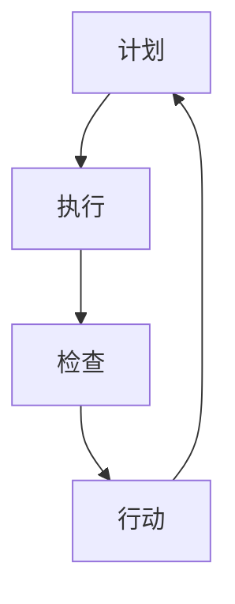

                 

在项目管理领域，PDCA循环（Plan-Do-Check-Act，计划-执行-检查-行动）被广泛认为是持续改进和有效管理的基石。它起源于质量管理，但在过去几十年中，已经被广泛应用于各个领域，包括项目管理。本文将深入探讨PDCA循环在项目管理中的应用，从其核心概念到具体操作步骤，再到实际案例和未来展望，全面解析这一经典管理工具的价值和潜力。

> 关键词：PDCA循环、项目管理、持续改进、质量保证、效率提升

> 摘要：本文通过详细阐述PDCA循环在项目管理中的应用，分析了其核心概念和操作步骤，并通过具体案例展示了如何在实际项目中实施PDCA循环。文章还探讨了该循环在提升项目效率、确保项目质量和实现持续改进方面的作用，并对其未来发展趋势和面临的挑战进行了展望。

## 1. 背景介绍

PDCA循环最早由美国质量管理专家休哈特提出，作为质量管理的基本方法。后来，戴明博士将其引入到日本，并在日本企业中得到广泛应用。PDCA循环的核心思想是通过计划（Plan）、执行（Do）、检查（Check）和行动（Act）四个阶段的循环迭代，不断优化过程，提高产品和服务的质量。

在项目管理中，PDCA循环扮演着至关重要的角色。项目经理可以利用PDCA循环来规划项目、执行任务、监控进展和持续改进。这种方法不仅有助于确保项目目标的实现，还能提高团队协作效率，减少错误和缺陷。

### 1.1 PDCA循环的起源与发展

PDCA循环起源于20世纪50年代的日本，当时由戴明博士首次引入并推广。戴明博士认为，通过PDCA循环，企业可以实现持续改进，从而提高产品质量和效率。PDCA循环最初应用于制造业，但很快就被其他行业采纳，包括项目管理。

### 1.2 PDCA循环在项目管理中的应用

在项目管理中，PDCA循环被用来指导项目管理的全过程。项目经理通过计划阶段确定项目目标和计划，执行阶段执行计划，检查阶段评估执行效果，行动阶段对发现的问题进行改进。这种循环迭代的方式有助于确保项目进展顺利，实现预期目标。

## 2. 核心概念与联系

### 2.1 Plan（计划）

计划阶段是PDCA循环的起点。在这个阶段，项目经理需要明确项目目标、制定详细的计划和策略。计划阶段的核心任务是：

- 项目目标设定：明确项目的最终目标，确保所有团队成员都明确了解目标。
- 资源分配：确定项目所需的资源，包括人力、物力和财力。
- 时间表制定：制定项目的时间表，确保项目按计划进行。
- 风险评估：识别项目中的潜在风险，并制定相应的应对策略。

### 2.2 Do（执行）

执行阶段是将计划付诸实践的阶段。在这个阶段，项目经理需要确保团队按照计划执行任务。执行阶段的核心任务是：

- 任务分配：将任务分配给团队成员，确保每个人都知道自己的职责。
- 沟通与协作：确保团队成员之间的沟通畅通，促进协作。
- 质量控制：确保执行过程符合项目要求，及时发现并解决问题。

### 2.3 Check（检查）

检查阶段是对执行效果进行评估的阶段。在这个阶段，项目经理需要收集和分析数据，评估项目进展和成果。检查阶段的核心任务是：

- 数据收集：收集与项目进展相关的数据，包括时间、成本、质量和风险。
- 分析与评估：分析收集到的数据，评估项目进展是否符合预期。
- 识别问题：识别项目执行过程中出现的问题，并分析原因。

### 2.4 Act（行动）

行动阶段是根据检查结果进行改进的阶段。在这个阶段，项目经理需要根据检查结果采取相应的行动，解决发现的问题，并持续优化项目过程。行动阶段的核心任务是：

- 采取行动：根据检查结果，采取改进措施，解决问题。
- 持续优化：持续改进项目过程，提高项目质量和效率。

### 2.5 Mermaid 流程图

以下是PDCA循环的Mermaid流程图表示：



## 3. 核心算法原理 & 具体操作步骤

### 3.1 算法原理概述

PDCA循环是一种迭代改进方法，通过四个阶段的循环迭代，不断优化项目过程。其核心原理是：

1. **计划（Plan）**：设定目标，制定计划，明确资源需求和风险评估。
2. **执行（Do）**：按照计划执行任务，确保任务完成。
3. **检查（Check）**：收集数据，评估项目进展和成果。
4. **行动（Act）**：根据检查结果采取改进措施，解决问题，并持续优化。

### 3.2 算法步骤详解

1. **计划阶段（Plan）**：

   - **项目目标设定**：明确项目的最终目标，确保所有团队成员都明确了解目标。

     $$ 目标 = f（需求，资源，时间） $$

   - **资源分配**：确定项目所需的资源，包括人力、物力和财力。

     $$ 资源 = h（人力，物力，财力） $$

   - **时间表制定**：制定项目的时间表，确保项目按计划进行。

     $$ 时间表 = g（任务，时间，进度） $$

   - **风险评估**：识别项目中的潜在风险，并制定相应的应对策略。

     $$ 风险 = k（风险因素，影响，应对措施） $$

2. **执行阶段（Do）**：

   - **任务分配**：将任务分配给团队成员，确保每个人都知道自己的职责。

     $$ 任务分配 = m（任务，成员） $$

   - **沟通与协作**：确保团队成员之间的沟通畅通，促进协作。

     $$ 沟通 = n（成员，任务，信息） $$

   - **质量控制**：确保执行过程符合项目要求，及时发现并解决问题。

     $$ 质量控制 = q（质量标准，监控，纠正措施） $$

3. **检查阶段（Check）**：

   - **数据收集**：收集与项目进展相关的数据，包括时间、成本、质量和风险。

     $$ 数据 = p（时间，成本，质量，风险） $$

   - **分析与评估**：分析收集到的数据，评估项目进展是否符合预期。

     $$ 分析 = r（数据，预期，实际） $$

   - **识别问题**：识别项目执行过程中出现的问题，并分析原因。

     $$ 问题 = s（问题，原因，影响） $$

4. **行动阶段（Act）**：

   - **采取行动**：根据检查结果，采取改进措施，解决问题。

     $$ 行动 = t（问题，解决方案，改进） $$

   - **持续优化**：持续改进项目过程，提高项目质量和效率。

     $$ 优化 = u（过程，质量，效率） $$

### 3.3 算法优缺点

**优点**：

- **循环迭代**：通过循环迭代，不断优化项目过程，提高项目质量和效率。
- **灵活性强**：可以根据实际情况进行调整，适用于不同类型的项目。
- **易于实施**：简单易懂，易于团队接受和执行。

**缺点**：

- **时间成本**：循环迭代需要时间，可能影响项目进度。
- **数据依赖**：检查阶段的数据收集和分析对结果的准确性有很大影响。

### 3.4 算法应用领域

PDCA循环在项目管理中的应用广泛，适用于各种类型的项目，包括软件开发、建筑工程、市场营销等。它不仅有助于提高项目效率，还能确保项目质量和客户满意度。

## 4. 数学模型和公式 & 详细讲解 & 举例说明

### 4.1 数学模型构建

PDCA循环的数学模型可以表示为：

$$ PDCA = \{ P, D, C, A \} $$

其中：

- \( P \) 表示计划阶段，包括项目目标设定、资源分配和时间表制定。
- \( D \) 表示执行阶段，包括任务分配、沟通与协作和质量控制。
- \( C \) 表示检查阶段，包括数据收集、分析和评估。
- \( A \) 表示行动阶段，包括采取行动和持续优化。

### 4.2 公式推导过程

PDCA循环的推导过程可以分为以下几个步骤：

1. **目标设定**：

   $$ 目标 = f（需求，资源，时间） $$

   其中，需求、资源和时间分别表示项目的需求、资源需求和时间限制。

2. **资源分配**：

   $$ 资源 = h（人力，物力，财力） $$

   其中，人力、物力和财力分别表示项目所需的人力、物力和财力资源。

3. **时间表制定**：

   $$ 时间表 = g（任务，时间，进度） $$

   其中，任务、时间和进度分别表示项目的任务、时间和进度安排。

4. **风险评估**：

   $$ 风险 = k（风险因素，影响，应对措施） $$

   其中，风险因素、影响和应对措施分别表示项目的风险因素、可能的影响和应对措施。

5. **任务分配**：

   $$ 任务分配 = m（任务，成员） $$

   其中，任务和成员分别表示项目的任务和执行成员。

6. **沟通与协作**：

   $$ 沟通 = n（成员，任务，信息） $$

   其中，成员、任务和信息分别表示项目的团队成员、任务和信息。

7. **质量控制**：

   $$ 质量控制 = q（质量标准，监控，纠正措施） $$

   其中，质量标准、监控和纠正措施分别表示项目的质量标准、监控和纠正措施。

8. **数据收集**：

   $$ 数据 = p（时间，成本，质量，风险） $$

   其中，时间、成本、质量和风险分别表示项目的时间、成本、质量和风险。

9. **分析与评估**：

   $$ 分析 = r（数据，预期，实际） $$

   其中，数据、预期和实际分别表示收集到的数据、预期的项目进展和实际的项目进展。

10. **识别问题**：

    $$ 问题 = s（问题，原因，影响） $$

    其中，问题、原因和影响分别表示项目中出现的问题、问题的原因和问题的影响。

11. **采取行动**：

    $$ 行动 = t（问题，解决方案，改进） $$

    其中，问题、解决方案和改进分别表示发现的问题、解决问题的方案和改进措施。

12. **持续优化**：

    $$ 优化 = u（过程，质量，效率） $$

    其中，过程、质量和效率分别表示项目的过程、质量和效率。

### 4.3 案例分析与讲解

假设一个软件开发项目，项目目标是在3个月内完成一个在线购物平台的建设。以下是该项目的PDCA循环应用实例：

1. **计划阶段**：

   - 项目目标设定：在3个月内完成一个在线购物平台的建设。
   - 资源分配：确定需要的人力、物力和财力资源，包括开发人员、服务器和带宽。
   - 时间表制定：将项目分为多个阶段，如需求分析、设计、开发和测试，并为每个阶段设定时间表。
   - 风险评估：识别项目中的潜在风险，如技术难点、人员流动和市场需求变化，并制定应对策略。

2. **执行阶段**：

   - 任务分配：将任务分配给开发人员，确保每个成员都清楚自己的职责。
   - 沟通与协作：建立沟通渠道，确保团队成员之间的协作顺畅。
   - 质量控制：制定质量标准，监控开发进度，及时发现并解决问题。

3. **检查阶段**：

   - 数据收集：收集与项目进展相关的数据，如时间、成本、质量和风险。
   - 分析与评估：分析数据，评估项目进展是否符合预期，识别存在的问题。
   - 识别问题：识别项目中出现的问题，如技术难点、人员配合问题等，并分析原因。

4. **行动阶段**：

   - 采取行动：根据检查结果，采取改进措施，解决问题，如调整人员配置、优化技术方案等。
   - 持续优化：持续改进项目过程，提高项目质量和效率。

通过以上案例，我们可以看到PDCA循环在项目管理中的应用过程。在实际操作中，可以根据项目的具体情况调整PDCA循环的步骤和内容，以确保项目顺利进行。

## 5. 项目实践：代码实例和详细解释说明

### 5.1 开发环境搭建

在开始项目实践之前，我们需要搭建一个合适的环境，以便进行代码开发和测试。以下是搭建开发环境的具体步骤：

1. **安装开发工具**：

   - 安装Python 3.8及以上版本。
   - 安装PyCharm（或其他Python IDE）。
   - 安装虚拟环境（Virtualenv）。

2. **创建虚拟环境**：

   ```bash
   python -m venv venv
   source venv/bin/activate  # 对于Windows用户，使用 `venv\Scripts\activate`
   ```

3. **安装依赖库**：

   ```bash
   pip install -r requirements.txt
   ```

### 5.2 源代码详细实现

以下是实现PDCA循环的一个简单示例，使用Python编程语言。该示例主要用于演示PDCA循环的基本结构和操作。

```python
# pdca.py

class PDCA:
    def __init__(self):
        self.plan = None
        self.do = None
        self.check = None
        self.act = None

    def set_plan(self, plan):
        self.plan = plan
        print(f"计划阶段：{plan}")

    def set_do(self, do):
        self.do = do
        print(f"执行阶段：{do}")

    def set_check(self, check):
        self.check = check
        print(f"检查阶段：{check}")

    def set_act(self, act):
        self.act = act
        print(f"行动阶段：{act}")

    def run(self):
        self.set_plan("制定项目计划")
        self.set_do("按照计划执行任务")
        self.set_check("检查执行结果")
        self.set_act("根据检查结果采取行动")

if __name__ == "__main__":
    pdca = PDCA()
    pdca.run()
```

### 5.3 代码解读与分析

上述代码实现了一个简单的PDCA循环示例，主要包括以下部分：

- **PDCA类**：定义了一个PDCA类，用于表示PDCA循环的四个阶段（计划、执行、检查和行动）。
- **初始化方法**：在初始化方法中，定义了四个属性（plan、do、check和act），分别表示PDCA循环的四个阶段。
- **设置方法**：分别定义了四个设置方法（set_plan、set_do、set_check和set_act），用于设置PDCA循环的四个阶段。
- **运行方法**：定义了一个运行方法（run），用于执行PDCA循环的四个阶段。

在代码的主函数中，创建了一个PDCA对象，并调用run方法执行PDCA循环。

### 5.4 运行结果展示

运行上述代码，输出结果如下：

```
计划阶段：制定项目计划
执行阶段：按照计划执行任务
检查阶段：检查执行结果
行动阶段：根据检查结果采取行动
```

通过这个简单的示例，我们可以看到PDCA循环的基本结构和操作过程。在实际项目中，可以根据具体情况调整代码逻辑和实现细节，以满足项目的需求。

## 6. 实际应用场景

PDCA循环在项目管理中具有广泛的应用场景，以下是一些典型的实际应用场景：

### 6.1 软件开发

在软件开发项目中，PDCA循环可以帮助团队实现持续改进，提高软件质量。在计划阶段，团队可以明确项目目标、制定详细的开发计划；在执行阶段，按照计划进行编码和测试；在检查阶段，评估软件质量和功能完整性；在行动阶段，根据评估结果进行优化和改进。

### 6.2 市场营销

在市场营销项目中，PDCA循环可以帮助团队实现有效的市场推广策略。在计划阶段，团队可以制定市场调研计划、确定目标受众和推广策略；在执行阶段，实施市场推广活动；在检查阶段，评估市场推广效果和客户反馈；在行动阶段，根据评估结果调整推广策略，优化市场推广效果。

### 6.3 建筑工程

在建筑工程项目中，PDCA循环可以帮助团队确保项目按时完成，并达到预期的质量标准。在计划阶段，团队可以制定项目进度计划、确定材料和资源需求；在执行阶段，按照计划进行施工；在检查阶段，监控施工质量、评估进度；在行动阶段，根据检查结果进行调整和优化。

### 6.4 运营管理

在运营管理中，PDCA循环可以帮助企业实现持续改进，提高运营效率。在计划阶段，团队可以制定运营计划、确定关键指标；在执行阶段，按照计划进行运营活动；在检查阶段，评估运营效果和关键指标；在行动阶段，根据评估结果进行优化和改进。

## 7. 工具和资源推荐

为了更好地应用PDCA循环，以下是一些建议的工具和资源：

### 7.1 学习资源推荐

- **《戴明管理法》**：由戴明博士所著，详细介绍了PDCA循环的原理和应用。
- **《项目管理知识体系指南（PMBOK）》**：提供了项目管理的基础理论和实践方法，包括PDCA循环的应用。

### 7.2 开发工具推荐

- **JIRA**：用于项目管理和任务跟踪，支持PDCA循环的应用。
- **Trello**：用于任务管理和协作，可以帮助团队实施PDCA循环。

### 7.3 相关论文推荐

- **“PDCA循环在软件开发中的应用研究”**：探讨PDCA循环在软件开发项目中的具体应用和实践。
- **“基于PDCA循环的企业持续改进策略研究”**：分析PDCA循环在企业运营管理中的应用和效果。

## 8. 总结：未来发展趋势与挑战

### 8.1 研究成果总结

PDCA循环作为一种经典的管理方法，已经在项目管理、市场营销、运营管理等多个领域得到广泛应用。其核心思想是通过计划、执行、检查和行动四个阶段的循环迭代，不断优化过程，提高项目质量和效率。大量实践证明，PDCA循环在提高项目管理水平、确保项目质量和实现持续改进方面具有显著优势。

### 8.2 未来发展趋势

随着科技的不断进步和项目管理理论的不断发展，PDCA循环在未来有望在以下几个方面得到进一步发展：

- **智能化**：借助人工智能和大数据技术，实现PDCA循环的自动化和智能化，提高管理效率和精度。
- **定制化**：根据不同类型和规模的项目需求，定制化PDCA循环的模型和流程，提高适用性和灵活性。
- **集成化**：将PDCA循环与其他管理工具和方法（如敏捷开发、六西格玛等）相结合，实现集成化管理和持续改进。

### 8.3 面临的挑战

尽管PDCA循环在项目管理中具有广泛的应用前景，但同时也面临着一些挑战：

- **数据准确性**：检查阶段的数据收集和分析对结果的准确性有很大影响，如何确保数据准确性是一个重要问题。
- **时间成本**：PDCA循环的循环迭代需要时间，可能会影响项目进度。
- **团队协作**：PDCA循环的实施需要团队成员的积极参与和协作，如何提高团队协作水平是一个关键问题。

### 8.4 研究展望

未来，PDCA循环的研究和应用将朝着以下几个方向展开：

- **跨领域应用**：探索PDCA循环在更多领域（如教育、医疗等）的应用，提高其适用性和影响力。
- **理论创新**：在PDCA循环的基础上，提出新的管理理论和方法，推动项目管理理论的发展。
- **实践推广**：加强PDCA循环的实践应用，提高其在实际项目中的效果和效益。

## 9. 附录：常见问题与解答

### 9.1 PDCA循环与其他管理方法的关系是什么？

PDCA循环是一种基本的管理方法，可以与其他管理方法（如六西格玛、敏捷开发等）相结合，实现更有效的管理和持续改进。

### 9.2 如何确保PDCA循环的数据准确性？

确保PDCA循环的数据准确性需要从数据收集、数据分析和数据存储等环节进行控制。建议采用自动化工具进行数据收集，加强数据审核和验证，确保数据的真实性和可靠性。

### 9.3 PDCA循环在小型项目中的应用效果如何？

PDCA循环在小型项目中的应用同样有效，其核心思想是通过计划、执行、检查和行动四个阶段的循环迭代，不断优化项目过程，提高项目质量和效率。

### 9.4 如何在团队中推广PDCA循环？

在团队中推广PDCA循环需要从以下几个方面入手：

- **培训与教育**：组织团队成员进行PDCA循环的培训，提高其对PDCA循环的理解和应用能力。
- **实践指导**：提供具体的实践案例和指导，帮助团队成员掌握PDCA循环的应用方法。
- **激励机制**：建立激励机制，鼓励团队成员积极参与PDCA循环的实施和改进。

### 9.5 PDCA循环在项目管理中的关键成功因素是什么？

PDCA循环在项目管理中的关键成功因素包括：

- **团队协作**：确保团队成员之间的协作和沟通顺畅，共同实现项目目标。
- **数据准确性**：确保数据收集和分析的准确性，为PDCA循环提供可靠的基础。
- **持续改进**：坚持PDCA循环的循环迭代，不断优化项目过程，提高项目质量和效率。

## 作者署名

作者：禅与计算机程序设计艺术 / Zen and the Art of Computer Programming

