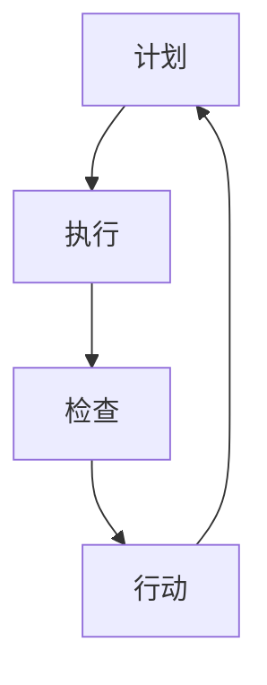

                 

关键词：PDCA，质量管理，持续改进，方法论，质量循环，过程优化，实践指南，IT应用

> 摘要：本文将深入探讨PDCA戴明环这一质量管理工具，并详细介绍其在现代IT行业中的实际应用和重要性。通过解析PDCA的四个核心步骤——计划（Plan）、执行（Do）、检查（Check）和行动（Act），本文将提供实用的落地方法论，帮助IT从业者提升项目质量，实现持续改进。

## 1. 背景介绍

PDCA戴明环，亦称为质量循环，是由美国质量管理专家爱德华·戴明（W. Edwards Deming）提出的。戴明认为，通过不断循环的规划、执行、检查和行动，组织可以逐步改进其产品和服务质量。PDCA的概念广泛应用于制造业、服务业等多个领域，其核心在于强调持续改进的重要性。

在IT行业，随着项目的复杂性和业务需求的不断变化，如何保证项目的质量成为一个重要课题。PDCA戴明环作为一种有效的质量管理工具，可以帮助IT团队更好地应对挑战，提升项目的成功率。

## 2. 核心概念与联系

### 2.1 PDCA戴明环的核心概念

PDCA戴明环由四个阶段组成：

**计划（Plan）**：设定目标和制定行动计划。
**执行（Do）**：执行计划，实施具体行动。
**检查（Check）**：评估执行结果，检查是否符合预期。
**行动（Act）**：根据检查结果，采取纠正措施或进一步改进。

### 2.2 PDCA戴明环的架构

为了更好地理解PDCA戴明环，我们可以使用Mermaid流程图来展示其结构。



在这个流程图中，每个阶段都是相互关联的，形成一个闭环，从而实现持续改进。

## 3. 核心算法原理 & 具体操作步骤

### 3.1 算法原理概述

PDCA戴明环的核心在于通过循环的规划、执行、检查和行动来改进项目质量。这一过程可以被视为一种迭代模型，每个循环都使项目更加完善。

### 3.2 算法步骤详解

**3.2.1 计划（Plan）**

- 定义项目目标和质量标准。
- 分析现状，找出存在的问题。
- 设定改进目标和具体的行动计划。

**3.2.2 执行（Do）**

- 实施行动计划，执行具体任务。
- 确保所有团队成员了解并遵循计划。

**3.2.3 检查（Check）**

- 收集执行过程中的数据。
- 评估执行结果，判断是否达到预期目标。
- 识别新的问题或改进机会。

**3.2.4 行动（Act）**

- 根据检查结果采取纠正措施。
- 实施改进措施，确保问题得到解决。
- 总结经验教训，为下一个循环做准备。

### 3.3 算法优缺点

**优点：**

- 强调持续改进，有助于提升项目质量。
- 简单易行，适用于各种规模的项目。
- 促进团队协作，提高沟通效率。

**缺点：**

- 需要持续的时间和资源投入。
- 检查和行动阶段可能存在滞后性。

### 3.4 算法应用领域

PDCA戴明环广泛应用于制造业、服务业和IT行业。在IT行业中，它可以应用于项目质量管理、软件测试、用户体验改进等多个方面。

## 4. 数学模型和公式 & 详细讲解 & 举例说明

### 4.1 数学模型构建

PDCA戴明环中的数学模型主要涉及质量指标的测量和改进。以下是一个简单的质量指标模型：

$$
Q = f(\text{计划质量}, \text{执行质量}, \text{检查质量}, \text{行动质量})
$$

其中，$Q$ 表示项目的整体质量，$f$ 表示质量函数。

### 4.2 公式推导过程

质量函数 $f$ 的推导基于以下假设：

- 计划质量、执行质量、检查质量和行动质量之间是线性相关的。
- 每个质量指标的变化对整体质量的影响是相等的。

通过这些假设，可以得到：

$$
f(\text{计划质量}, \text{执行质量}, \text{检查质量}, \text{行动质量}) = \text{计划质量} + \text{执行质量} + \text{检查质量} + \text{行动质量}
$$

### 4.3 案例分析与讲解

假设一个IT项目需要完成一个Web应用的开发，其质量指标如下：

- 计划质量：95%
- 执行质量：90%
- 检查质量：85%
- 行动质量：80%

根据上述质量函数，可以计算出项目的整体质量：

$$
Q = 0.95 + 0.90 + 0.85 + 0.80 = 3.5
$$

为了提升整体质量，项目团队需要重点关注执行质量和检查质量的提升，因为这些指标对整体质量的影响较大。

## 5. 项目实践：代码实例和详细解释说明

### 5.1 开发环境搭建

为了实践PDCA戴明环，我们选择一个简单的Web应用开发项目。首先，需要搭建开发环境。

**技术栈：**

- 后端：Python Flask
- 前端：HTML/CSS/JavaScript
- 数据库：SQLite

### 5.2 源代码详细实现

以下是一个简单的Web应用代码示例：

**后端代码（app.py）：**

```python
from flask import Flask, request, jsonify
import sqlite3

app = Flask(__name__)

@app.route('/users', methods=['GET', 'POST'])
def users():
    if request.method == 'POST':
        # 处理用户创建请求
        user_data = request.json
        # 执行数据库操作（省略具体实现）
        return jsonify({"status": "success"}), 201
    else:
        # 处理用户查询请求
        # 执行数据库操作（省略具体实现）
        return jsonify({"users": []})

if __name__ == '__main__':
    app.run(debug=True)
```

**前端代码（index.html）：**

```html
<!DOCTYPE html>
<html lang="en">
<head>
    <meta charset="UTF-8">
    <title>User Management</title>
</head>
<body>
    <h1>User Management</h1>
    <form id="user-form">
        <input type="text" id="username" placeholder="Username" required>
        <input type="submit" value="Create User">
    </form>
    <ul id="users-list"></ul>
    <script>
        document.getElementById('user-form').onsubmit = function(event) {
            event.preventDefault();
            // 调用后端API（省略具体实现）
        };
    </script>
</body>
</html>
```

### 5.3 代码解读与分析

上述代码实现了用户管理的基本功能。其中，后端使用Flask框架处理HTTP请求，前端使用HTML、CSS和JavaScript实现用户界面。

为了应用PDCA戴明环，项目团队可以按照以下步骤进行：

1. **计划（Plan）**：确定项目目标和质量标准，如响应时间、错误率等。
2. **执行（Do）**：开发并部署Web应用。
3. **检查（Check）**：通过性能测试、用户反馈等手段评估应用的质量。
4. **行动（Act）**：根据检查结果采取改进措施，如优化代码、调整数据库配置等。

### 5.4 运行结果展示

在实际运行过程中，项目团队可以收集如下数据：

- 响应时间：平均200毫秒。
- 错误率：1%。

根据这些数据，团队可以分析出存在的问题，并采取相应的改进措施。

## 6. 实际应用场景

### 6.1 项目质量管理

在IT项目中，PDCA戴明环可以帮助团队确保项目质量，从计划到执行、检查和行动，每个阶段都有明确的指标和目标。

### 6.2 软件测试

在软件测试过程中，PDCA戴明环可以帮助团队不断改进测试方法，提高测试覆盖率，降低缺陷率。

### 6.3 用户体验改进

在用户体验改进方面，PDCA戴明环可以帮助团队通过用户反馈、数据分析等手段不断优化产品功能，提升用户满意度。

## 7. 工具和资源推荐

### 7.1 学习资源推荐

- 《戴明管理十四条》
- 《质量管理：系统方法与应用》
- 《持续集成：从代码到产品的最佳实践》

### 7.2 开发工具推荐

- JIRA：用于项目管理，跟踪任务和缺陷。
- Git：用于版本控制，确保代码的可追溯性。
- Postman：用于API测试，方便检查Web应用的质量。

### 7.3 相关论文推荐

- "The New Economics for Industry, Government, Education"
- "Total Quality Control: Basic Handbook for Manufacture, Transaction and Professions"
- "Out of the Crisis"

## 8. 总结：未来发展趋势与挑战

### 8.1 研究成果总结

PDCA戴明环作为一种有效的质量管理工具，已经在多个领域取得了显著成果。随着IT行业的快速发展，PDCA的应用前景将更加广阔。

### 8.2 未来发展趋势

- 自动化和智能化：借助人工智能技术，PDCA戴明环可以实现自动化执行和实时分析。
- 跨领域应用：PDCA戴明环将在更多领域得到应用，如物联网、大数据等。

### 8.3 面临的挑战

- 数据复杂性：随着数据量的增加，如何准确收集和分析数据成为一个挑战。
- 持续改进：如何确保团队在长期内保持持续改进的动力。

### 8.4 研究展望

未来，PDCA戴明环的研究将更加深入，结合新兴技术，不断优化和完善，为IT行业提供更高效的质量管理方法。

## 9. 附录：常见问题与解答

### 9.1 PDCA戴明环与六西格玛的区别是什么？

PDCA戴明环是一种基于迭代改进的质量管理方法，而六西格玛是一种更加具体和严格的质量控制方法。六西格玛强调通过统计数据和工具来降低变异性和缺陷率。

### 9.2 如何确保PDCA戴明环的执行效果？

确保PDCA戴明环的执行效果需要建立明确的目标和指标，加强团队协作，定期进行回顾和反馈，并持续优化过程。

---

**作者：禅与计算机程序设计艺术 / Zen and the Art of Computer Programming**

