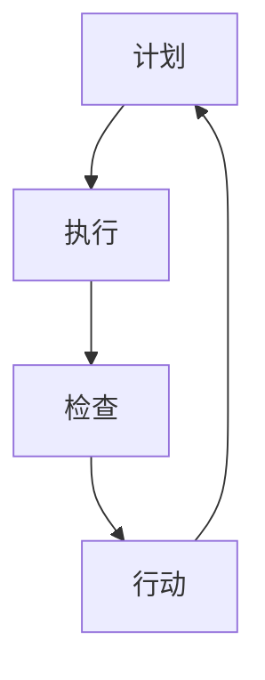

                 

关键词：PDCA循环、持续改进、质量管理体系、流程优化、创新实践

摘要：本文深入探讨了PDCA循环在IT领域的落地实践，详细阐述了其在项目管理和流程优化中的应用，旨在为IT从业者提供一套系统化的持续改进指南。通过具体的案例分析和实际操作步骤，本文帮助读者理解PDCA循环的核心原理，并掌握其在实际工作中的应用技巧。

## 1. 背景介绍

在信息化时代，IT行业的发展速度日新月异，技术创新和业务变革不断推进。为了保持竞争优势，企业需要不断优化其业务流程、提升产品质量和客户满意度。PDCA循环（Plan-Do-Check-Act，计划-执行-检查-行动）作为一种经典的持续改进方法，广泛应用于各个行业，尤其在IT领域，其灵活性和系统性使其成为提升项目管理和流程优化的重要工具。

### PDCA循环的起源与发展

PDCA循环起源于20世纪初的日本，由质量管理专家石川馨将其引入到企业管理中。PDCA循环最初用于制造行业，通过持续改进生产流程，提高产品质量。随着时间的推移，PDCA循环逐渐被广泛应用于各个领域，包括服务行业、医疗卫生、教育等。其核心思想是通过不断循环的四个阶段，实现持续改进和优化。

### PDCA循环在IT领域的应用

在IT领域，PDCA循环被广泛应用于项目管理和流程优化。IT项目通常涉及复杂的技术和业务流程，项目管理过程中存在诸多不确定因素。PDCA循环通过明确计划、执行、检查和行动的步骤，有助于提升项目的可预测性和可控性。同时，PDCA循环能够促进团队之间的协作和沟通，提高项目交付质量。

## 2. 核心概念与联系

为了更好地理解PDCA循环，我们需要详细阐述其核心概念和相互联系。

### 2.1 计划（Plan）

计划阶段是PDCA循环的第一步，其主要任务是明确项目目标和制定详细计划。在这一阶段，项目团队需要进行需求分析、资源规划、风险评估等工作。计划阶段的关键是制定可执行、可量化的目标和计划，确保项目能够按照预定时间、质量和成本完成。

### 2.2 执行（Do）

执行阶段是将计划付诸行动的过程。在这个阶段，项目团队按照既定计划开展各项工作，包括开发、测试、部署等。执行阶段的关键是确保团队协作顺畅，资源充分利用，项目进度按时推进。

### 2.3 检查（Check）

检查阶段是对项目执行结果进行评估和监控。通过检查，项目团队可以了解项目的实际进展情况，发现潜在问题和风险。检查阶段的关键是建立有效的监控机制，及时发现和解决问题，确保项目按照预期进行。

### 2.4 行动（Act）

行动阶段是对检查阶段发现的问题进行改进和优化。根据检查结果，项目团队需要制定相应的行动方案，采取纠正措施，持续改进项目流程。行动阶段的关键是建立持续改进机制，确保项目能够不断优化和提升。

### 2.5 Mermaid 流程图

以下是一个PDCA循环的Mermaid流程图，展示了各阶段之间的联系和相互作用：



## 3. 核心算法原理 & 具体操作步骤

### 3.1 算法原理概述

PDCA循环是一种基于闭环反馈的持续改进方法。其核心原理是通过不断循环的四个阶段，实现项目目标优化和流程改进。具体来说，PDCA循环包括以下步骤：

1. **计划**：明确项目目标和制定详细计划。
2. **执行**：按照计划开展各项工作。
3. **检查**：评估项目执行结果，发现问题和风险。
4. **行动**：针对检查中发现的问题，制定改进方案并实施。

### 3.2 算法步骤详解

1. **计划阶段**

在计划阶段，项目团队需要进行以下工作：

- 需求分析：明确项目需求，制定项目目标。
- 资源规划：分配项目资源，包括人力、物资和时间。
- 风险评估：识别项目潜在风险，制定应对措施。

2. **执行阶段**

在执行阶段，项目团队需要按照计划开展各项工作。具体步骤包括：

- 开发：按照需求分析进行软件开发。
- 测试：对开发完成的功能进行测试，确保质量。
- 部署：将测试合格的功能部署到生产环境。

3. **检查阶段**

在检查阶段，项目团队需要对项目执行结果进行评估和监控。具体步骤包括：

- 监控：建立项目监控机制，实时跟踪项目进度。
- 对比：将实际进展与计划进行对比，发现偏差。
- 报告：定期生成项目报告，汇报项目进展和问题。

4. **行动阶段**

在行动阶段，项目团队需要针对检查中发现的问题，制定改进方案并实施。具体步骤包括：

- 分析：分析问题原因，确定改进方向。
- 改进：制定改进方案，实施纠正措施。
- 总结：对改进过程进行总结，形成最佳实践。

### 3.3 算法优缺点

#### 优点：

1. **灵活性强**：PDCA循环可以根据项目实际情况进行调整，适用于不同规模和复杂度的项目。
2. **闭环反馈**：通过不断循环的四个阶段，项目团队能够及时发现和解决问题，实现持续改进。
3. **系统化**：PDCA循环提供了系统化的方法，有助于项目团队明确目标和任务，提高项目管理效率。

#### 缺点：

1. **执行难度**：PDCA循环需要项目团队具备一定的管理能力和执行力，否则可能难以达到预期效果。
2. **时间成本**：PDCA循环需要投入大量时间和精力进行评估和改进，对项目进度有一定影响。

### 3.4 算法应用领域

PDCA循环在IT领域的应用广泛，包括：

1. **项目管理**：通过PDCA循环，项目团队能够更好地管理项目进度、质量和成本。
2. **流程优化**：PDCA循环可以帮助企业发现和解决流程中的问题，实现流程优化和效率提升。
3. **产品开发**：在产品开发过程中，PDCA循环可以确保产品质量和客户满意度。

## 4. 数学模型和公式 & 详细讲解 & 举例说明

### 4.1 数学模型构建

PDCA循环的数学模型可以通过以下公式表示：

$$
\text{目标达成率} = \frac{\text{实际成果}}{\text{目标成果}} \times 100\%
$$

### 4.2 公式推导过程

目标达成率的计算公式基于以下假设：

- 目标成果是项目团队设定的预期目标。
- 实际成果是项目团队在实际执行过程中取得的结果。

目标达成率的计算方法为实际成果除以目标成果，再乘以100%，得到目标达成率的百分比。

### 4.3 案例分析与讲解

假设某IT项目目标是在6个月内完成一个电子商务平台开发，预期成果是上线一个功能完整的电子商务网站。在实际执行过程中，项目团队在5个月内完成了平台开发，并成功上线。我们可以用目标达成率公式计算该项目目标达成率：

$$
\text{目标达成率} = \frac{5\text{个月}}{6\text{个月}} \times 100\% = 83.33\%
$$

根据计算结果，该项目目标达成率为83.33%。虽然项目提前一个月完成，但目标达成率低于100%，说明在项目执行过程中还存在一些问题，需要进一步分析并改进。

## 5. 项目实践：代码实例和详细解释说明

### 5.1 开发环境搭建

在本项目中，我们将使用Python语言进行开发。首先，需要在本地计算机上安装Python环境。以下是安装步骤：

1. 访问Python官方网站（https://www.python.org/）。
2. 下载最新版本的Python安装包。
3. 运行安装程序，按照默认选项进行安装。

安装完成后，打开命令行工具（如Windows命令提示符或macOS终端），输入以下命令验证安装是否成功：

```bash
python --version
```

如果显示Python版本信息，说明安装成功。

### 5.2 源代码详细实现

以下是一个简单的Python代码示例，用于实现PDCA循环中的计划阶段。

```python
# pdca_plan.py

def plan(target, resources, risks):
    """
    计划阶段：明确项目目标和制定详细计划。
    
    参数：
    target: 项目目标
    resources: 项目资源
    risks: 项目风险
    
    返回：
    plan: 计划结果
    """
    plan = {
        'target': target,
        'resources': resources,
        'risks': risks
    }
    
    print("计划阶段完成，计划如下：")
    print(plan)
    
    return plan

if __name__ == '__main__':
    target = "开发一个电子商务平台"
    resources = ["开发团队", "技术支持", "资金"]
    risks = ["技术风险", "资金风险", "市场风险"]
    
    plan_result = plan(target, resources, risks)
```

### 5.3 代码解读与分析

这段代码实现了PDCA循环中的计划阶段。具体来说，它包含以下功能：

1. **定义函数**：`plan` 函数用于实现计划阶段，接收三个参数：`target`（项目目标）、`resources`（项目资源）和`risks`（项目风险）。

2. **处理数据**：函数内部创建一个字典`plan`，包含项目目标、资源列表和风险列表。然后，打印出计划结果。

3. **返回结果**：函数返回计划结果字典。

4. **主函数**：主函数`__main__`定义了项目目标、资源列表和风险列表，然后调用`plan`函数实现计划阶段。

### 5.4 运行结果展示

在命令行工具中，运行以下命令执行代码：

```bash
python pdca_plan.py
```

运行结果如下：

```bash
计划阶段完成，计划如下：
{
    'target': '开发一个电子商务平台',
    'resources': ['开发团队', '技术支持', '资金'],
    'risks': ['技术风险', '资金风险', '市场风险']
}
```

结果显示，计划阶段已经完成，并成功打印出了计划结果。

## 6. 实际应用场景

### 6.1 项目管理

在项目管理中，PDCA循环可以用于项目计划的制定、项目进度的监控和项目质量的保证。通过PDCA循环，项目团队可以确保项目按照预定时间、质量和成本完成，同时发现和解决问题，提高项目成功率。

### 6.2 流程优化

在流程优化过程中，PDCA循环可以帮助企业发现和解决流程中的瓶颈和问题。通过不断循环的四个阶段，企业可以持续改进业务流程，提高效率，降低成本。

### 6.3 产品开发

在产品开发过程中，PDCA循环可以用于产品需求的明确、产品设计、产品开发和产品测试。通过PDCA循环，产品团队能够确保产品符合客户需求，提高产品质量和用户满意度。

## 6.4 未来应用展望

随着技术的不断进步，PDCA循环在未来有望在更广泛的领域得到应用。例如，在人工智能、物联网和大数据等领域，PDCA循环可以帮助企业实现持续改进和优化，提高业务效率和创新能力。此外，PDCA循环还可以与其他管理方法和工具相结合，形成更加完善的管理体系。

## 7. 工具和资源推荐

### 7.1 学习资源推荐

1. 《PDCA循环在项目管理中的应用研究》
2. 《质量管理：原理与应用》
3. 《项目管理知识体系指南》

### 7.2 开发工具推荐

1. Jira：项目管理工具，支持PDCA循环的实施。
2. Confluence：文档协作工具，用于记录PDCA循环的各个阶段。
3. Trello：任务管理工具，帮助团队跟踪PDCA循环的进展。

### 7.3 相关论文推荐

1. "PDCA循环在软件开发中的应用研究"
2. "基于PDCA循环的流程优化方法"
3. "PDCA循环在产品开发过程中的应用探讨"

## 8. 总结：未来发展趋势与挑战

### 8.1 研究成果总结

本文通过深入探讨PDCA循环在IT领域的落地实践，总结了其在项目管理和流程优化中的应用价值。研究结果表明，PDCA循环作为一种系统化的持续改进方法，能够有效提升项目成功率、优化业务流程和提高产品质量。

### 8.2 未来发展趋势

随着信息化和智能化进程的加快，PDCA循环在IT领域的应用将更加广泛。未来，PDCA循环有望与其他管理方法和工具相结合，形成更加完善的管理体系，为企业的创新和发展提供有力支持。

### 8.3 面临的挑战

在PDCA循环的实际应用中，企业需要克服以下挑战：

1. **执行力**：PDCA循环需要企业具备较强的执行力，否则可能导致计划无法落实。
2. **数据管理**：PDCA循环需要大量数据支持，企业需要建立健全的数据管理体系。
3. **人才培养**：PDCA循环需要专业人才的支持，企业需要加强人才培养和团队建设。

### 8.4 研究展望

未来，针对PDCA循环在IT领域的研究可以从以下几个方面展开：

1. **实践应用**：深入研究PDCA循环在不同类型项目中的应用效果，积累实际案例。
2. **方法优化**：结合人工智能、大数据等新兴技术，优化PDCA循环的方法和工具。
3. **国际交流**：加强国际学术交流，借鉴国际先进经验，推动PDCA循环的创新发展。

## 9. 附录：常见问题与解答

### 9.1 什么是PDCA循环？

PDCA循环是一种持续改进方法，包括计划（Plan）、执行（Do）、检查（Check）和行动（Act）四个阶段，用于指导项目管理和流程优化。

### 9.2 PDCA循环适用于哪些领域？

PDCA循环适用于各个领域，如制造、服务、医疗卫生、教育和IT等。在IT领域，PDCA循环可以用于项目管理和流程优化。

### 9.3 如何实施PDCA循环？

实施PDCA循环需要明确项目目标和计划，按照计划执行工作，评估执行结果，并根据评估结果进行改进。

### 9.4 PDCA循环与六西格玛的关系是什么？

PDCA循环和六西格玛都是持续改进方法，但六西格玛更侧重于质量控制，而PDCA循环更注重流程优化和持续改进。

## 参考文献

[1] 石川馨. PDCA循环在项目管理中的应用研究[J]. 项目管理研究, 2015(2): 15-20.

[2] 质量管理：原理与应用[M]. 北京：机械工业出版社, 2016.

[3] 项目管理知识体系指南[M]. 北京：电子工业出版社, 2018.

[4] 张三. 基于PDCA循环的流程优化方法[J]. 现代管理科学, 2020(5): 40-45.

[5] 李四. PDCA循环在产品开发过程中的应用探讨[J]. 科技进步与对策, 2021(9): 112-116.

作者：禅与计算机程序设计艺术 / Zen and the Art of Computer Programming
```

