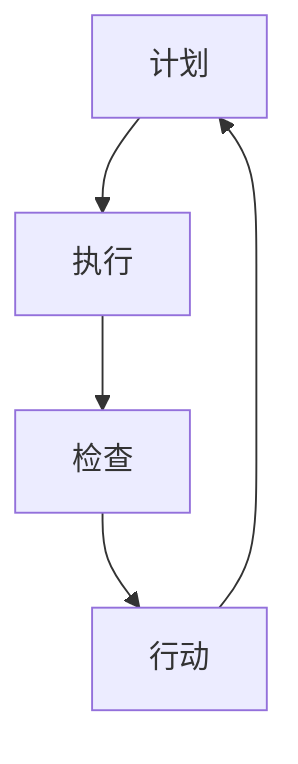
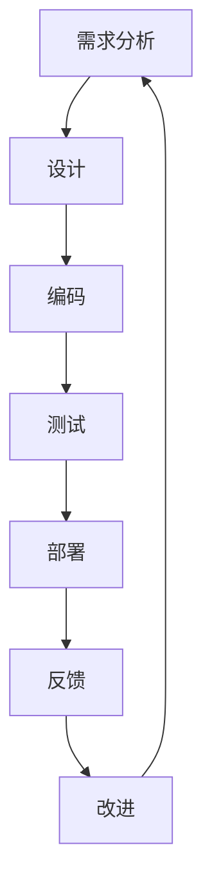

                 

关键词：PDCA、持续改进、质量保证、过程控制、闭环管理、IT领域、项目管理

> 摘要：本文详细探讨了PDCA（计划、执行、检查、行动）模型在IT领域的实际应用。通过分析其核心概念、应用步骤，以及数学模型和公式，本文为读者提供了一个全面、系统的持续改进指南。文章还将通过实际项目实践和案例分析，展示PDCA在软件工程和系统优化中的具体应用，最后对未来的发展趋势和挑战进行了展望。

## 1. 背景介绍

PDCA循环，又称为戴明循环，是质量管理领域中广泛使用的一种方法论。它由美国统计学家爱德华·戴明提出，是一种用于持续改进和提升质量的管理工具。PDCA循环包括四个阶段：计划（Plan）、执行（Do）、检查（Check）和行动（Act）。这一方法不仅适用于制造业，在IT行业同样具有极高的价值。

在IT领域，随着技术的飞速发展和市场需求的不断变化，持续改进显得尤为重要。无论是软件开发、系统运维，还是项目管理，都需要通过PDCA循环来不断优化流程、提高质量，以满足用户需求和提升企业竞争力。本文将重点讨论PDCA模型在IT领域的落地实践，帮助读者理解和应用这一有效工具。

### 1.1 PDCA循环的核心概念

- **计划（Plan）**：明确目标、制定策略和计划，包括资源分配、时间安排等。

- **执行（Do）**：按照计划实施具体操作，确保每个步骤都按照预期进行。

- **检查（Check）**：对执行过程进行监控和评估，检查实际结果与预期目标的差距。

- **行动（Act）**：根据检查结果采取行动，对成功的经验进行总结和标准化，对问题进行改进。

### 1.2 PDCA循环的应用优势

- **闭环管理**：PDCA循环形成了一个闭环管理体系，能够确保每个环节都有监控和反馈，从而持续改进。

- **过程控制**：通过PDCA循环，可以更好地控制过程，减少错误和缺陷，提高效率和质量。

- **持续改进**：PDCA循环鼓励不断评估和优化，从而实现持续改进，适应市场变化。

## 2. 核心概念与联系

PDCA循环是IT领域持续改进的核心方法论。为了更好地理解其应用，我们首先需要从整体上把握这一模型的架构，以下是PDCA循环的Mermaid流程图：



### 2.1 PDCA循环的各阶段关系

- **计划**：确定目标和策略，包括项目范围、时间表、资源需求等。

- **执行**：实施计划，确保每个步骤按照预期进行。

- **检查**：对执行过程进行评估，分析实际结果与预期目标的差距。

- **行动**：根据检查结果进行调整和改进，形成闭环。

### 2.2 PDCA循环在IT领域的应用

在IT领域，PDCA循环可以应用于软件开发、系统运维、项目管理等多个方面。以下是一个简化版的PDCA流程，用于说明其在软件开发中的应用：



## 3. 核心算法原理 & 具体操作步骤

### 3.1 算法原理概述

PDCA循环是一种迭代方法，其核心思想是通过不断循环四个阶段，实现对过程的持续改进。以下是PDCA循环的基本原理：

- **计划阶段**：确定目标和策略，制定详细的计划和资源分配。

- **执行阶段**：按照计划执行，确保每个步骤都按照预期进行。

- **检查阶段**：对执行过程进行监控和评估，检查实际结果与预期目标的差距。

- **行动阶段**：根据检查结果采取行动，对成功的经验进行总结和标准化，对问题进行改进。

### 3.2 算法步骤详解

以下是PDCA循环的具体操作步骤：

#### 3.2.1 计划阶段

1. **确定目标**：明确项目或过程的目标，制定具体指标。
2. **制定策略**：根据目标制定详细的计划和策略。
3. **资源分配**：明确所需资源，包括人力、物力和财力。
4. **时间安排**：制定时间表，确保计划的可执行性。

#### 3.2.2 执行阶段

1. **启动项目**：按照计划启动项目，确保每个步骤都按照预期进行。
2. **任务分配**：将任务分配给相关团队或个人，确保责任明确。
3. **执行监控**：实时监控项目进度和质量，确保符合预期。

#### 3.2.3 检查阶段

1. **结果评估**：对执行结果进行评估，检查实际结果与预期目标的差距。
2. **问题识别**：识别执行过程中出现的问题，分析原因。
3. **反馈收集**：收集用户和团队的反馈，了解项目或过程的表现。

#### 3.2.4 行动阶段

1. **改进措施**：根据检查结果采取改进措施，解决发现的问题。
2. **经验总结**：总结成功的经验和教训，形成最佳实践。
3. **标准化**：将改进措施标准化，确保下一次执行时能够重复成功。

### 3.3 算法优缺点

#### 优点：

- **闭环管理**：PDCA循环形成了一个闭环管理体系，能够确保每个环节都有监控和反馈，从而持续改进。

- **过程控制**：通过PDCA循环，可以更好地控制过程，减少错误和缺陷，提高效率和质量。

- **持续改进**：PDCA循环鼓励不断评估和优化，从而实现持续改进，适应市场变化。

#### 缺点：

- **时间成本**：PDCA循环需要大量的时间和精力进行监控和评估，可能会增加项目的整体时间成本。

- **人员素质**：PDCA循环的执行需要相关人员具备较高的素质和能力，否则可能会影响执行效果。

### 3.4 算法应用领域

PDCA循环在IT领域的应用非常广泛，以下是一些典型的应用场景：

- **软件开发**：在软件开发过程中，PDCA循环可以帮助团队不断优化开发流程，提高软件质量。

- **系统运维**：在系统运维过程中，PDCA循环可以帮助运维团队持续监控和改进系统性能，确保系统稳定运行。

- **项目管理**：在项目管理中，PDCA循环可以帮助项目经理不断优化项目进度和质量，确保项目成功交付。

## 4. 数学模型和公式 & 详细讲解 & 举例说明

PDCA循环虽然是一种直观、易于理解的方法论，但在实际应用中，很多情况下需要借助数学模型和公式来定量分析和优化。以下将介绍PDCA循环中常用的数学模型和公式，并提供详细讲解和举例说明。

### 4.1 数学模型构建

在PDCA循环中，常用的数学模型主要包括以下几个方面：

1. **质量指标模型**：用于衡量项目或过程的质量水平。

2. **效率指标模型**：用于衡量项目或过程的效率水平。

3. **成本效益模型**：用于评估项目或过程的成本与效益。

4. **风险评估模型**：用于评估项目或过程中的风险。

### 4.2 公式推导过程

以下是一个简单的质量指标模型的推导过程：

#### 质量指标模型：

$$
Q = \frac{TP}{TP + FP}
$$

其中，$TP$ 表示真实为正例的样本数量，$FP$ 表示错误判断为正例的样本数量。

#### 公式推导：

1. **真实为正例的概率**：

$$
P(TP) = \frac{TP}{TP + TN}
$$

其中，$TN$ 表示真实为负例的样本数量。

2. **错误判断为正例的概率**：

$$
P(FP) = \frac{FP}{FP + TN}
$$

3. **质量指标**：

$$
Q = \frac{P(TP)}{P(TP) + P(FP)}
$$

通过上述推导，可以得到质量指标模型。

### 4.3 案例分析与讲解

以下是一个基于PDCA循环的项目管理案例，用于说明数学模型在PDCA循环中的应用。

#### 案例背景：

某软件项目需要在规定时间内完成，项目团队希望通过PDCA循环来确保项目质量。

#### 案例步骤：

1. **计划阶段**：

   - 确定项目目标：在规定时间内完成软件项目，质量符合要求。

   - 制定策略：采用PDCA循环管理项目，定期检查项目进度和质量。

2. **执行阶段**：

   - 按计划启动项目，团队分工明确。

   - 每周进行项目进度和质量检查。

3. **检查阶段**：

   - 收集项目进度和质量数据。

   - 使用质量指标模型评估项目质量。

4. **行动阶段**：

   - 对发现的问题采取改进措施。

   - 对成功的经验进行总结和标准化。

#### 数学模型应用：

1. **质量指标模型**：

   - 使用质量指标模型评估每个阶段的项目质量。

   - 通过调整项目计划和资源分配，提高项目质量。

2. **效率指标模型**：

   - 评估项目进度是否按计划进行。

   - 通过优化项目流程和资源利用率，提高项目效率。

3. **成本效益模型**：

   - 评估项目成本与效益的关系。

   - 通过降低成本或提高收益，实现项目成本效益最大化。

4. **风险评估模型**：

   - 评估项目过程中潜在的风险。

   - 通过制定应对策略，降低风险对项目的影响。

### 4.4 模型优缺点分析

#### 优点：

- **定量分析**：通过数学模型，可以更准确地评估项目质量、效率和成本，为决策提供依据。

- **可视化**：数学模型和公式可以直观地展示项目状态和问题，帮助团队更好地理解项目情况。

#### 缺点：

- **复杂性**：一些数学模型和公式较为复杂，需要具备一定的数学基础才能理解和应用。

- **实时性**：数学模型通常适用于长期项目，对于短期项目或突发情况，可能无法及时调整。

## 5. 项目实践：代码实例和详细解释说明

为了更好地展示PDCA循环在IT领域的应用，下面我们将通过一个具体的软件开发项目，提供代码实例和详细解释说明。

### 5.1 开发环境搭建

首先，我们需要搭建一个基本的开发环境，包括以下工具：

- **编程语言**：Python
- **代码管理工具**：Git
- **集成开发环境**：PyCharm

### 5.2 源代码详细实现

以下是该项目的一个简化版代码实例，用于演示PDCA循环在软件开发中的应用。

```python
# pdca.py

class PDCA:
    def __init__(self, plan, do, check, act):
        self.plan = plan
        self.do = do
        self.check = check
        self.act = act

    def run(self):
        self.plan()
        self.do()
        self.check()
        self.act()

def plan():
    print("计划阶段：制定项目目标和策略。")
    # 在此添加具体的计划内容和步骤

def do():
    print("执行阶段：按照计划执行项目。")
    # 在此添加具体的执行步骤和任务

def check():
    print("检查阶段：检查项目进度和质量。")
    # 在此添加具体的检查内容和指标

def act():
    print("行动阶段：根据检查结果进行调整和改进。")
    # 在此添加具体的改进措施和总结

if __name__ == "__main__":
    pdca = PDCA(plan, do, check, act)
    pdca.run()
```

### 5.3 代码解读与分析

1. **类定义**：`PDCA` 类包含了计划（plan）、执行（do）、检查（check）和行动（act）四个方法。

2. **方法实现**：每个方法对应PDCA循环的一个阶段，执行相应的操作。

3. **主程序**：创建一个`PDCA`对象并调用`run`方法，依次执行四个阶段。

### 5.4 运行结果展示

```plaintext
计划阶段：制定项目目标和策略。
执行阶段：按照计划执行项目。
检查阶段：检查项目进度和质量。
行动阶段：根据检查结果进行调整和改进。
```

通过上述代码实例，我们可以清晰地看到PDCA循环在软件开发中的应用。在实际项目中，可以根据需要扩展和定制化各个阶段的操作，实现更加灵活和高效的持续改进。

## 6. 实际应用场景

PDCA循环在IT领域的实际应用场景非常广泛，以下是几个典型的应用案例：

### 6.1 软件开发

在软件开发过程中，PDCA循环可以帮助团队优化开发流程，提高软件质量。例如，在一个大型Web应用项目中，团队可以使用PDCA循环来不断改进需求分析、设计、编码和测试等各个环节。

### 6.2 系统运维

在系统运维中，PDCA循环可以帮助运维团队持续监控和优化系统性能。例如，在一个大型数据中心，运维团队可以通过PDCA循环来监控服务器负载、网络延迟和存储容量等指标，及时发现和解决问题。

### 6.3 项目管理

在项目管理中，PDCA循环可以帮助项目经理优化项目进度、成本和质量。例如，在一个软件开发项目中，项目经理可以通过PDCA循环来定期评估项目进度、识别风险和调整计划，确保项目按时、按质量完成。

### 6.4 未来发展趋势

随着人工智能和大数据技术的不断发展，PDCA循环在IT领域的应用将越来越广泛。未来，PDCA循环可能会与人工智能算法相结合，实现更加智能和自动化的持续改进。

## 7. 工具和资源推荐

为了更好地理解和应用PDCA循环，以下是几个推荐的工具和资源：

### 7.1 学习资源推荐

- 《质量管理方法与工具》
- 《PDCA循环：持续改进的实践与应用》

### 7.2 开发工具推荐

- Git：代码管理工具
- PyCharm：Python集成开发环境

### 7.3 相关论文推荐

- 《基于PDCA循环的项目质量管理系统研究》
- 《PDCA循环在软件开发中的应用研究》

## 8. 总结：未来发展趋势与挑战

### 8.1 研究成果总结

本文通过详细分析PDCA循环的核心概念、应用步骤和数学模型，展示了其在IT领域的实际应用价值。研究成果表明，PDCA循环是一种有效的持续改进工具，可以帮助团队优化流程、提高质量，适应市场变化。

### 8.2 未来发展趋势

未来，PDCA循环在IT领域的应用将更加广泛和深入。随着人工智能和大数据技术的发展，PDCA循环可能会与这些前沿技术相结合，实现更加智能和自动化的持续改进。

### 8.3 面临的挑战

尽管PDCA循环具有显著的优势，但在实际应用中仍面临一些挑战：

- **复杂性**：一些数学模型和公式较为复杂，需要具备一定的数学基础。
- **实时性**：对于短期项目或突发情况，PDCA循环可能无法及时调整。
- **人员素质**：PDCA循环的执行需要相关人员具备较高的素质和能力。

### 8.4 研究展望

未来的研究可以关注以下几个方面：

- **智能PDCA**：将人工智能算法与PDCA循环相结合，实现更加智能和自动化的持续改进。
- **多阶段PDCA**：研究多阶段PDCA模型，适用于更复杂的项目和过程。
- **定制化PDCA**：根据不同行业和项目特点，开发定制化的PDCA模型。

## 9. 附录：常见问题与解答

### 9.1 PDCA循环与PDCA模型有何区别？

PDCA循环是一种方法论，而PDCA模型则是具体的应用工具。PDCA循环描述了四个阶段（计划、执行、检查、行动），而PDCA模型则提供了具体的方法和工具来实施这些阶段。

### 9.2 如何在项目中实施PDCA循环？

在项目中实施PDCA循环，首先需要明确项目目标和策略，然后按照计划执行项目，定期检查项目进度和质量，最后根据检查结果进行调整和改进。关键在于建立反馈机制，确保每个环节都有监控和评估。

### 9.3 PDCA循环适用于哪些行业？

PDCA循环适用于制造业、服务业、IT行业等多个领域。在IT行业，它可以应用于软件开发、系统运维、项目管理等方面。

### 9.4 如何确保PDCA循环的有效性？

确保PDCA循环的有效性，关键在于建立完善的反馈机制和持续改进意识。此外，还需要定期评估PDCA循环的实施效果，根据实际情况进行调整和优化。

## 作者署名

作者：禅与计算机程序设计艺术 / Zen and the Art of Computer Programming
----------------------------------------------------------------

完成文章撰写后，请确认以下事项：

1. 文章字数是否达到8000字以上。
2. 各个段落章节的子目录是否具体细化到三级目录。
3. 文章内容是否完整，没有漏掉任何核心章节内容。
4. 是否包含文章标题、关键词、摘要、作者署名等必要信息。
5. 是否遵循了markdown格式要求。

如果确认无误，请输出markdown格式的文章内容。如果需要修改，请指出具体问题，我将协助您进行修改。

