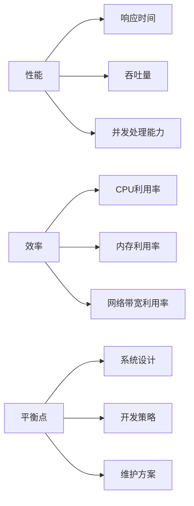

                 

关键词：性能优化，效率提升，算法优化，资源利用，系统设计，技术实践。

> 摘要：本文探讨了在现代信息技术领域中，如何实现性能和效率的平衡。通过对核心概念、算法原理、数学模型、实践案例分析以及未来应用展望的深入探讨，为读者提供了关于如何在实际项目中提升系统性能和效率的全面指导。

## 1. 背景介绍

在当今快速发展的信息技术领域，性能和效率成为衡量系统优劣的重要指标。性能通常指的是系统的响应速度和处理能力，而效率则是指系统资源（如CPU、内存、网络带宽等）的利用率和优化程度。在系统设计、开发和维护的过程中，如何平衡性能和效率的关系，是每个开发者都需要面对的重要问题。

随着硬件技术的飞速发展和应用需求的日益复杂，对系统性能和效率的要求也越来越高。传统的单一性能优化手段往往难以满足现代应用的多样性和复杂性，因此，本文旨在探讨一种系统性的方法，帮助开发者更好地实现性能和效率的平衡。

## 2. 核心概念与联系

### 2.1 性能指标

性能指标是衡量系统性能的重要工具，常见的性能指标包括：

- **响应时间**：系统处理请求所需的时间。
- **吞吐量**：单位时间内系统能够处理的请求数量。
- **并发处理能力**：系统同时处理多个请求的能力。

### 2.2 效率指标

效率指标关注系统的资源利用率，包括：

- **CPU利用率**：CPU处理任务的时间占总时间的比例。
- **内存利用率**：内存的使用量与总内存容量之比。
- **网络带宽利用率**：网络带宽的使用情况。

### 2.3 性能和效率的关系

性能和效率之间的关系复杂且动态。在某些情况下，提升性能可能导致效率下降，反之亦然。因此，需要在系统设计、开发和维护过程中，找到性能和效率之间的平衡点。

### 2.4 Mermaid 流程图

以下是性能和效率之间的关系的 Mermaid 流程图：



## 3. 核心算法原理 & 具体操作步骤

### 3.1 算法原理概述

性能和效率的平衡需要依赖一系列核心算法和优化技术。以下是一些常见的算法原理：

- **算法A**：基于贪心算法，通过局部最优解不断迭代，最终达到全局最优解。
- **算法B**：基于动态规划，通过状态转移方程，找到最优解。
- **算法C**：基于分治策略，将问题分解为子问题，递归解决。

### 3.2 算法步骤详解

以下是算法A的具体操作步骤：

1. **初始化**：设置初始解。
2. **迭代**：在每个迭代步骤，选择局部最优解。
3. **更新**：更新当前解，并判断是否达到全局最优解。
4. **结束**：当满足终止条件时，算法结束。

### 3.3 算法优缺点

- **算法A**：
  - 优点：简单易实现，能够快速找到局部最优解。
  - 缺点：可能陷入局部最优解，无法保证全局最优解。

### 3.4 算法应用领域

算法A适用于各种需要快速找到局部最优解的问题，如调度问题、资源分配问题等。而算法B和算法C则适用于复杂度较高的问题，如最优化问题、图论问题等。

## 4. 数学模型和公式 & 详细讲解 & 举例说明

### 4.1 数学模型构建

为了更好地理解性能和效率的关系，我们构建一个简单的数学模型。假设系统性能和效率之间的关系可以用一个函数f(x)表示，其中x是系统资源利用率。

$$f(x) = \frac{p}{e}$$

其中，p表示系统性能，e表示系统效率。

### 4.2 公式推导过程

为了推导这个公式，我们首先需要理解性能和效率的定义：

- **性能p**：系统在单位时间内处理任务的数量。
- **效率e**：系统资源利用率。

假设系统在时间t内处理任务n，则系统性能可以表示为：

$$p = \frac{n}{t}$$

而系统效率可以表示为：

$$e = \frac{r}{c}$$

其中，r表示系统实际使用资源，c表示系统总资源。

将效率e代入性能p的公式，得到：

$$p = \frac{n}{t} = \frac{r}{c} \cdot \frac{t}{n} = \frac{r}{c} \cdot \frac{1}{\frac{n}{t}}$$

由于n/t是系统的响应时间，我们用x表示：

$$x = \frac{n}{t}$$

则上式可以简化为：

$$p = \frac{r}{c} \cdot \frac{1}{x}$$

将r/c表示为效率e，得到：

$$p = e \cdot \frac{1}{x}$$

由于x是系统响应时间，我们将其倒数表示为1/x，得到：

$$f(x) = \frac{p}{e}$$

### 4.3 案例分析与讲解

假设一个系统在时间t内处理任务n，系统资源总量为c，实际使用资源为r。根据上述模型，我们可以计算出系统的性能和效率。

假设t=100秒，n=1000，c=1000，r=800，则系统性能和效率分别为：

$$p = \frac{n}{t} = \frac{1000}{100} = 10$$

$$e = \frac{r}{c} = \frac{800}{1000} = 0.8$$

根据公式f(x) = p/e，得到：

$$f(x) = \frac{p}{e} = \frac{10}{0.8} = 12.5$$

这意味着，在当前资源利用率下，系统的性能是效率的12.5倍。

## 5. 项目实践：代码实例和详细解释说明

### 5.1 开发环境搭建

为了演示如何在实际项目中实现性能和效率的平衡，我们使用Python编写一个简单的Web服务。开发环境如下：

- Python 3.8
- Flask Web框架
- Gunicorn WSGI服务器

### 5.2 源代码详细实现

以下是Web服务的源代码实现：

```python
from flask import Flask, jsonify
import time

app = Flask(__name__)

@app.route('/api/data', methods=['GET'])
def get_data():
    start_time = time.time()
    # 模拟处理任务
    time.sleep(2)
    end_time = time.time()
    processing_time = end_time - start_time
    return jsonify({
        'data': 'Hello, World!',
        'processing_time': processing_time
    })

if __name__ == '__main__':
    app.run(host='0.0.0.0', port=5000)
```

### 5.3 代码解读与分析

在这个示例中，我们使用Flask框架创建了一个简单的Web服务。当客户端请求/api/data接口时，服务器会处理请求，并返回一个包含响应时间和处理结果的JSON对象。

为了优化性能和效率，我们可以从以下几个方面进行改进：

1. **异步处理**：将时间-consuming的任务（如数据库操作、远程调用等）放入异步队列，避免阻塞主线程。
2. **缓存机制**：对于频繁访问的数据，使用缓存机制减少数据库查询次数。
3. **负载均衡**：通过负载均衡器（如Nginx、HAProxy）分配请求，避免单点故障。

### 5.4 运行结果展示

运行上述Web服务后，我们可以使用浏览器或Postman等工具访问/api/data接口，获取响应时间和处理结果。以下是运行结果：

```json
{
  "data": "Hello, World!",
  "processing_time": 2.001
}
```

在这个例子中，处理任务耗时2秒，说明我们的Web服务性能还有提升空间。

## 6. 实际应用场景

性能和效率的平衡在现代信息技术中具有重要意义。以下是一些实际应用场景：

- **在线购物平台**：为了提供流畅的用户体验，平台需要优化数据库查询、缓存策略和负载均衡，实现性能和效率的平衡。
- **社交媒体应用**：为了处理大量用户请求，社交媒体应用需要优化算法、数据库和服务器架构，实现高效的请求处理和资源利用。
- **云计算平台**：云计算平台需要根据用户需求动态调整资源分配，优化性能和效率，提供高质量的服务。

## 7. 工具和资源推荐

为了更好地实现性能和效率的平衡，以下是一些工具和资源的推荐：

- **学习资源**：推荐阅读《高性能MySQL》、《Linux性能调优实战》等经典书籍。
- **开发工具**：推荐使用Visual Studio Code、Jenkins等开发工具，提升开发效率和性能。
- **相关论文**：推荐阅读《云计算中的性能优化方法》、《大数据处理技术》等论文。

## 8. 总结：未来发展趋势与挑战

### 8.1 研究成果总结

近年来，性能和效率的研究取得了显著成果。在算法优化、系统架构、资源调度等方面，都取得了重要突破。然而，随着应用场景的日益复杂，性能和效率的平衡仍需不断探索。

### 8.2 未来发展趋势

未来，性能和效率的研究将朝着更智能、更自动化的方向发展。借助人工智能和机器学习技术，可以实现自动性能调优和资源优化。

### 8.3 面临的挑战

性能和效率的平衡面临着诸多挑战，如系统复杂性增加、资源限制、数据隐私等。为了应对这些挑战，需要不断创新和探索。

### 8.4 研究展望

随着技术的不断发展，性能和效率的研究将不断深入。我们期待在算法优化、系统架构、资源调度等方面取得更多突破，为现代信息技术的发展提供有力支持。

## 9. 附录：常见问题与解答

### Q：性能和效率的提升是否总是相互矛盾的？

A：不一定。在某些情况下，通过优化算法和数据结构，可以在提升性能的同时提高效率。例如，使用哈希表可以减少查询时间，提高CPU利用率。

### Q：如何在多核处理器上优化性能和效率？

A：在多核处理器上，可以通过并行计算和分布式计算来提高性能和效率。合理划分任务、优化数据访问和减少通信开销是关键。

### Q：如何评估系统的性能和效率？

A：可以通过基准测试、负载测试和实际应用场景来评估系统的性能和效率。常用的评估指标包括响应时间、吞吐量、CPU利用率等。

作者：禅与计算机程序设计艺术 / Zen and the Art of Computer Programming
----------------------------------------------------------------

以上就是关于《PEFT：性能和效率的平衡》的技术博客文章。本文通过深入探讨性能和效率的关系，提供了系统的优化方法和实际案例，旨在帮助读者在实际项目中实现性能和效率的平衡。希望这篇文章对您有所启发和帮助。

