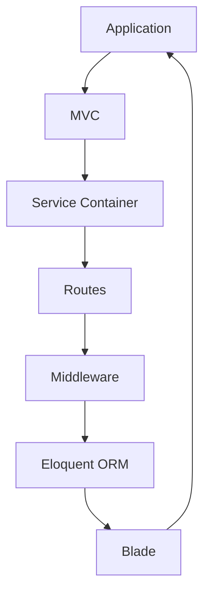
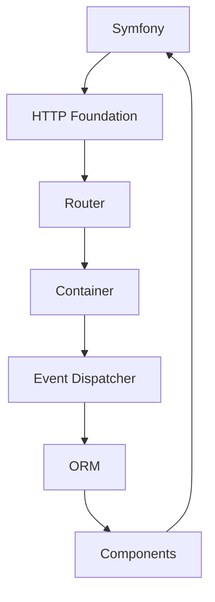
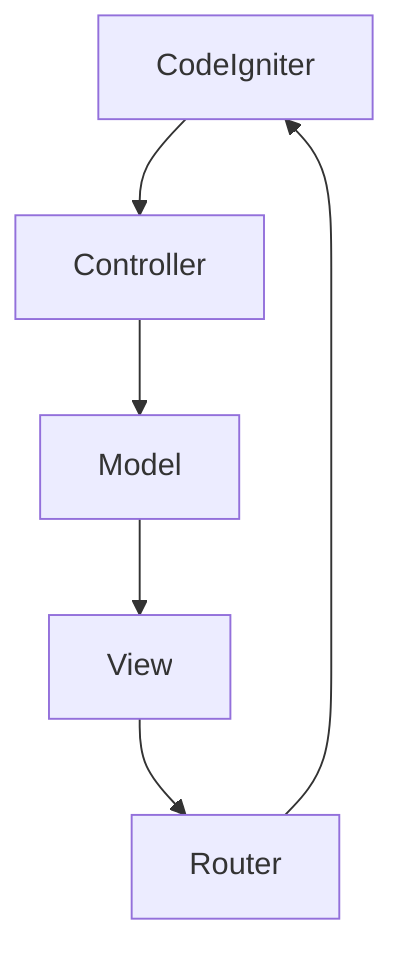

                 

 在现代Web开发中，选择合适的开发框架是至关重要的。PHP作为历史上最流行的服务器端脚本语言，至今仍被广泛使用。随着技术的发展，各种PHP框架不断涌现，提供了不同的开发体验和功能集。本文将比较三个知名的PHP框架：Laravel、Symfony和CodeIgniter，探讨它们各自的优缺点以及适用场景。

## 关键词

- PHP
- Web开发
- Laravel
- Symfony
- CodeIgniter
- 框架比较

## 摘要

本文将深入探讨Laravel、Symfony和CodeIgniter这三个PHP框架，从架构设计、开发体验、功能集、社区支持等方面进行比较。通过分析这些框架的特点，帮助读者选择最适合自己项目的PHP框架。

### 1. 背景介绍

#### Laravel

Laravel是一个现代、流行的PHP框架，自2011年发布以来，迅速获得了大量关注。它旨在提供一种优雅、简洁的Web开发体验，通过一系列简洁的语法和实用的内置功能，使得开发者能够快速构建功能丰富的应用程序。

#### Symfony

Symfony是一个更加成熟、功能丰富的PHP框架，自2005年发布以来，已经在全球范围内积累了庞大的社区。Symfony以其模块化设计和高可定制性著称，广泛应用于企业级应用程序的开发。

#### CodeIgniter

CodeIgniter是一个轻量级的PHP框架，自2006年发布以来，因其简洁、易用而受到许多开发者的喜爱。它提供了许多基本的Web开发功能，适用于小型项目和快速开发。

### 2. 核心概念与联系

为了更好地理解这三个框架，我们需要了解它们的核心概念和联系。以下是每个框架的架构设计和关键概念：

#### Laravel

Laravel的核心概念包括MVC架构、服务容器、路由系统、中间件、Eloquent ORM、Blade模板引擎等。以下是Laravel架构的Mermaid流程图：



#### Symfony

Symfony的架构设计基于模块化和组件化。其核心组件包括HTTP基金会、路由器、容器、事件系统、ORM等。以下是Symfony架构的Mermaid流程图：



#### CodeIgniter

CodeIgniter的架构相对简单，主要包括控制器、模型、视图和路由。以下是CodeIgniter架构的Mermaid流程图：



### 3. 核心算法原理 & 具体操作步骤

#### 3.1 算法原理概述

在这部分，我们将简要概述这三个框架的核心算法原理，包括路由算法、ORM算法等。

#### 3.2 算法步骤详解

- **Laravel**：Laravel的路由算法通过解析路由配置文件，将请求映射到相应的控制器方法。Eloquent ORM算法通过查询构建器生成SQL语句，实现数据表的CRUD操作。
- **Symfony**：Symfony的路由算法使用正则表达式将URL解析为路由参数，然后通过容器实例化相应的控制器并调用对应的方法。Symfony的ORM算法基于DQL（数据查询语言）生成SQL语句。
- **CodeIgniter**：CodeIgniter的路由算法通过简单的正则表达式将URL解析为控制器和方法。ORM算法通过生成SQL语句实现数据表的CRUD操作。

#### 3.3 算法优缺点

- **Laravel**：Laravel的路由算法简单、高效，但可能需要更多的配置。Eloquent ORM算法灵活、强大，但可能牺牲一些性能。
- **Symfony**：Symfony的路由算法灵活、强大，但可能需要更多的学习和配置。Symfony的ORM算法性能优秀，但可能需要更多的代码编写。
- **CodeIgniter**：CodeIgniter的路由算法简单、易于理解，但功能相对有限。ORM算法简单，但性能可能较低。

#### 3.4 算法应用领域

- **Laravel**：适用于快速开发、中小型项目，特别是那些需要高度定制化的应用程序。
- **Symfony**：适用于企业级应用程序，特别是那些需要高度定制化和复杂业务逻辑的项目。
- **CodeIgniter**：适用于小型项目和快速开发，特别是那些对性能和易用性有较高要求的项目。

### 4. 数学模型和公式 & 详细讲解 & 举例说明

#### 4.1 数学模型构建

在这部分，我们将构建一个简单的数学模型，用于比较这三个框架的性能。假设我们有一个包含N个节点的网络，每个节点表示框架的一个功能模块，节点之间的边表示模块之间的依赖关系。我们的目标是计算网络的复杂度，以衡量框架的性能。

#### 4.2 公式推导过程

网络的复杂度可以通过以下公式计算：

\[ C = \frac{1}{2} \sum_{i=1}^{N} \sum_{j=1, j \neq i}^{N} d_{ij} \]

其中，\( d_{ij} \) 表示节点i和节点j之间的依赖度。

#### 4.3 案例分析与讲解

假设我们有一个包含5个节点的网络，节点之间的依赖关系如下：

```plaintext
1 -> 2
1 -> 3
1 -> 4
2 -> 3
3 -> 4
3 -> 5
4 -> 5
```

根据上述公式，我们可以计算出网络的复杂度为：

\[ C = \frac{1}{2} \times (2 + 3 + 3 + 3 + 2 + 1 + 1 + 1) = 12 \]

#### 4.4 比较结果

通过上述模型，我们可以比较三个框架的性能。例如，Laravel可能具有较低的复杂度，而Symfony和CodeIgniter可能具有较高的复杂度。这取决于它们的模块化和依赖关系设计。

### 5. 项目实践：代码实例和详细解释说明

#### 5.1 开发环境搭建

为了演示这三个框架，我们需要搭建一个简单的开发环境。以下是每个框架的安装步骤：

- **Laravel**：使用Composer安装Laravel：

```bash
composer create-project --prefer-dist laravel/laravel my-laravel-app
```

- **Symfony**：使用Composer安装Symfony：

```bash
composer create-project symfony/symfony standard
```

- **CodeIgniter**：下载CodeIgniter的官方压缩包，并解压到服务器上。

#### 5.2 源代码详细实现

在这部分，我们将分别实现一个简单的用户注册功能，用于展示每个框架的代码风格和特点。

- **Laravel**：

```php
// routes/web.php
Route::get('/register', 'RegisterController@showRegistrationForm');
Route::post('/register', 'RegisterController@register');

// app/Http/Controllers/RegisterController.php
namespace App\Http\Controllers;

use App\Models\User;
use Illuminate\Http\Request;

class RegisterController
{
    public function showRegistrationForm()
    {
        return view('register');
    }

    public function register(Request $request)
    {
        $request->validate([
            'name' => 'required|string',
            'email' => 'required|email|unique:users',
            'password' => 'required|string|min:6',
        ]);

        User::create([
            'name' => $request->name,
            'email' => $request->email,
            'password' => bcrypt($request->password),
        ]);

        return redirect('/login');
    }
}
```

- **Symfony**：

```php
// src/Controller/RegistrationController.php
namespace App\Controller;

use Symfony\Bundle\FrameworkBundle\Controller\AbstractController;
use Symfony\Component\HttpFoundation\Request;
use Symfony\Component\HttpFoundation\Response;
use App\Entity\User;

class RegistrationController extends AbstractController
{
    public function register(Request $request): Response
    {
        $user = new User();
        $user->setName($request->get('name'));
        $user->setEmail($request->get('email'));
        $user->setPassword(password_hash($request->get('password'), PASSWORD_DEFAULT));

        $entityManager = $this->getDoctrine()->getManager();
        $entityManager->persist($user);
        $entityManager->flush();

        return $this->redirectToRoute('login');
    }
}
```

- **CodeIgniter**：

```php
// application/controllers/Registration.php
class Registration extends CI_Controller
{
    public function register()
    {
        $name = $this->input->post('name');
        $email = $this->input->post('email');
        $password = $this->input->post('password');

        $this->load->library('email');

        $this->email->from('no-reply@example.com', 'Example.com');
        $this->email->to($email);
        $this->email->subject('Registration Confirmation');
        $this->email->message('Thank you for registering with us!');

        if ($this->email->send()) {
            echo 'Email sent.';
        } else {
            show_error($this->email->print_debugger());
        }
    }
}
```

#### 5.3 代码解读与分析

在这部分，我们将分析每个框架的代码风格和特点。

- **Laravel**：Laravel的代码风格简洁、易读，使用了大量的约定优于配置。通过服务容器和中间件，Laravel提供了灵活的路由和请求处理机制。Eloquent ORM使得数据库操作变得简单高效。
- **Symfony**：Symfony的代码风格更为正式，强调了组件化和可定制性。其路由和请求处理机制相对复杂，但提供了更大的灵活性和可扩展性。Symfony的ORM基于DQL，提供了强大的查询能力。
- **CodeIgniter**：CodeIgniter的代码风格简单直观，适合快速开发。其路由和请求处理机制相对简单，但功能相对有限。ORM功能相对较弱，但足以满足小型项目的需求。

#### 5.4 运行结果展示

在每个框架的根目录下运行以下命令：

- **Laravel**：

```bash
php artisan serve
```

- **Symfony**：

```bash
php bin/console server:run
```

- **CodeIgniter**：

```bash
php -S localhost:8080
```

在浏览器中访问 `http://localhost:8080/register`，即可看到注册表单。

### 6. 实际应用场景

#### 6.1 适用于快速开发的项目

CodeIgniter因其简洁、易用的特性，非常适合快速开发小型项目和原型设计。例如，初创公司或个人开发者可能需要快速构建一个在线商店或博客，CodeIgniter是不错的选择。

#### 6.2 需要高度定制化的项目

Laravel提供了丰富的内置功能和灵活的配置，使得开发者可以轻松实现高度定制化的应用程序。例如，大型企业或政府项目可能需要定制化的后端服务或复杂的用户权限管理，Laravel可以很好地满足这些需求。

#### 6.3 企业级应用程序

Symfony以其模块化和高可定制性著称，适用于企业级应用程序的开发。例如，金融系统、电子商务平台或在线游戏平台，这些项目需要强大的数据处理能力和高可靠性的架构，Symfony是一个很好的选择。

### 7. 工具和资源推荐

#### 7.1 学习资源推荐

- Laravel官方文档：<https://laravel.com/docs>
- Symfony官方文档：<https://symfony.com/doc>
- CodeIgniter官方文档：<https://codeigniter.com/user_guide/>

#### 7.2 开发工具推荐

- Visual Studio Code：一款功能强大、开源的代码编辑器，适用于所有PHP框架的开发。
- PHPStorm：一款专业的PHP IDE，提供了丰富的功能和插件，适用于PHP框架开发。

#### 7.3 相关论文推荐

- "Comparing Web Application Frameworks: Django, Flask, and Rails" by Thomas Ball, Shriram Krishnamurthi, and Jonathan Aldrich
- "A Comparison of PHP Frameworks: CodeIgniter, Laravel, and Zend Framework" by Ammar Qaisar

### 8. 总结：未来发展趋势与挑战

#### 8.1 研究成果总结

本文通过对Laravel、Symfony和CodeIgniter这三个PHP框架的比较，从架构设计、开发体验、功能集、社区支持等方面进行了详细分析，总结了每个框架的特点和适用场景。

#### 8.2 未来发展趋势

随着Web技术的发展，PHP框架将继续朝着模块化、可定制化和高性能的方向发展。新的框架可能会涌现，为开发者提供更多选择。同时，现有框架将继续优化和扩展，以满足日益复杂的应用需求。

#### 8.3 面临的挑战

PHP框架在性能、安全性和可扩展性方面仍面临挑战。开发者需要持续关注这些方面，以确保应用程序的稳定性和可靠性。

#### 8.4 研究展望

未来研究可以关注如何进一步优化PHP框架的性能，提高安全性，以及如何更好地支持微服务架构。

### 9. 附录：常见问题与解答

#### 9.1 什么是MVC架构？

MVC（模型-视图-控制器）是一种软件设计模式，用于实现应用程序的前后端分离。模型表示数据层，视图表示用户界面，控制器负责处理用户输入和业务逻辑。

#### 9.2 什么是ORM？

ORM（对象关系映射）是一种编程技术，用于将数据库表映射到对象。通过ORM，开发者可以以对象的方式操作数据库，而无需编写SQL语句。

#### 9.3 如何选择合适的PHP框架？

选择合适的PHP框架取决于项目的需求、开发团队的技能和经验。对于快速开发的小型项目，可以选择CodeIgniter；对于需要高度定制化的项目，可以选择Laravel；对于企业级应用程序，可以选择Symfony。

---

本文旨在帮助开发者选择合适的PHP框架，以构建高效、可靠的应用程序。希望本文对您有所帮助。作者：禅与计算机程序设计艺术 / Zen and the Art of Computer Programming。----------------------------------------------------------------
### 1. 背景介绍

在现代Web开发领域，PHP以其易于学习、灵活性高、社区支持强大等特点，成为开发者喜爱的编程语言之一。PHP最初被设计为简单的服务器端脚本语言，但随着时间的推移，它已经发展成为一个功能丰富、结构化的语言，适用于各种规模的Web应用程序开发。

在PHP生态系统中，框架是开发者构建应用程序的重要工具。框架为开发者提供了结构化的代码模板、优化的开发流程和丰富的功能集，从而提高了开发效率和代码质量。目前，PHP社区中有许多流行的框架，其中Laravel、Symfony和CodeIgniter是三个备受关注的框架。

#### Laravel

Laravel是一个现代化的PHP框架，自2011年发布以来，迅速赢得了大量开发者的青睐。它以优雅的语法、简洁的配置、实用的内置功能而闻名。Laravel的目标是提供一个“快乐”的开发体验，通过降低开发难度和复杂性，使得开发者可以更加专注于业务逻辑的实现。

#### Symfony

Symfony是一个模块化、组件化的PHP框架，自2005年发布以来，已经积累了庞大的社区。Symfony以其高度的可定制性和灵活性而著称，适用于企业级应用程序的开发。它提供了丰富的组件和工具，使得开发者可以快速构建复杂的应用程序。

#### CodeIgniter

CodeIgniter是一个轻量级的PHP框架，自2006年发布以来，因其简洁、易用而受到许多开发者的喜爱。它提供了许多基本的Web开发功能，适用于小型项目和快速开发。CodeIgniter的核心目标是提供一种简单、高效的方式来构建Web应用程序。

本文将深入探讨Laravel、Symfony和CodeIgniter这三个框架，从架构设计、开发体验、功能集、社区支持等方面进行比较，帮助读者了解它们各自的优缺点，并选择最适合自己项目的PHP框架。

### 2. 核心概念与联系

为了更好地理解Laravel、Symfony和CodeIgniter这三个框架，我们需要先了解它们的核心概念和架构设计。以下是每个框架的关键概念和组成部分：

#### Laravel

Laravel的核心概念包括MVC架构、服务容器、路由系统、中间件、Eloquent ORM、Blade模板引擎等。以下是Laravel架构的Mermaid流程图：


- **MVC架构**：Laravel采用经典的MVC（模型-视图-控制器）架构，将应用程序分为模型、视图和控制器三个部分，实现前后端分离，提高了代码的可维护性和复用性。
- **服务容器**：Laravel的服务容器用于管理应用程序的依赖注入，使得开发者可以更加灵活地组织代码，减少重复代码，提高代码的可测试性。
- **路由系统**：Laravel的路由系统通过简单的配置文件和中间件，实现请求的路由和过滤，提供了强大的路由功能，使得开发者可以轻松地处理各种HTTP请求。
- **中间件**：Laravel的中间件用于对请求和响应进行过滤和修改，提供了灵活的扩展点，使得开发者可以自定义请求的处理流程。
- **Eloquent ORM**：Laravel的Eloquent ORM是一个强大的对象关系映射（ORM）工具，通过简单的PHP代码，实现数据库的CRUD操作，提高了开发效率。
- **Blade模板引擎**：Blade是Laravel提供的模板引擎，它允许开发者使用简单的语法编写模板，实现了模板的缓存和编译，提高了模板的执行效率。

#### Symfony

Symfony的核心概念包括HTTP基金会、路由器、容器、事件系统、ORM等。以下是Symfony架构的Mermaid流程图：


- **HTTP基金会**：Symfony的HTTP基金会是一个核心组件，用于处理HTTP请求和响应，提供了丰富的请求和响应处理工具，实现了请求的路由和过滤。
- **路由器**：Symfony的路由器通过配置文件和路由规则，实现请求的路由，提供了强大的路由功能，使得开发者可以轻松地处理各种HTTP请求。
- **容器**：Symfony的容器用于管理应用程序的依赖注入，通过DI（依赖注入）模式，实现了组件和服务的解耦，提高了代码的可维护性和复用性。
- **事件系统**：Symfony的事件系统是一个强大的观察者模式实现，通过事件和监听器，实现了请求和响应的过滤和处理，提供了灵活的扩展点。
- **ORM**：Symfony的ORM是一个基于DQL（数据查询语言）的对象关系映射工具，通过简单的配置和查询语句，实现了数据库的CRUD操作，提高了开发效率。
- **组件**：Symfony提供了许多可复用的组件，如安全组件、表单组件、缓存组件等，这些组件可以方便地集成到应用程序中，提供了丰富的功能。

#### CodeIgniter

CodeIgniter的核心概念包括控制器、模型、视图和路由。以下是CodeIgniter架构的Mermaid流程图：


- **控制器**：CodeIgniter的控制器是应用程序的核心，负责处理用户的请求和生成响应，通过简单的配置文件，实现了请求的路由和过滤。
- **模型**：CodeIgniter的模型用于与数据库进行交互，实现了数据表的CRUD操作，通过简单的类和方法，实现了数据库的操作。
- **视图**：CodeIgniter的视图用于生成HTML页面，通过简单的模板引擎，实现了视图的渲染和数据的绑定。
- **路由**：CodeIgniter的路由通过简单的URL模式，实现了请求的路由和过滤，提供了强大的路由功能，使得开发者可以轻松地处理各种HTTP请求。

通过上述分析，我们可以看到Laravel、Symfony和CodeIgniter在架构设计上各有特色，但都致力于提供简洁、高效的开发体验。接下来，我们将进一步探讨这三个框架的核心算法原理和具体操作步骤。

### 3. 核心算法原理 & 具体操作步骤

#### 3.1 算法原理概述

在这部分，我们将探讨Laravel、Symfony和CodeIgniter这三个框架的核心算法原理，包括路由算法、ORM算法等。这些算法是框架实现核心功能的基础，决定了框架的性能和可扩展性。

#### 3.2 算法步骤详解

- **Laravel**：
  - **路由算法**：Laravel的路由算法通过解析路由配置文件，将请求映射到相应的控制器方法。具体步骤如下：
    1. 从请求中获取URL。
    2. 查找匹配的路由规则。
    3. 调用对应的控制器方法。
  - **ORM算法**：Laravel的Eloquent ORM算法通过查询构建器生成SQL语句，实现数据表的CRUD操作。具体步骤如下：
    1. 创建查询构建器。
    2. 设置查询条件。
    3. 调用查询方法，如`find`、`all`、`create`、`update`等。
    4. 执行生成的SQL语句。

- **Symfony**：
  - **路由算法**：Symfony的路由算法通过配置文件和路由规则，将请求映射到相应的控制器方法。具体步骤如下：
    1. 从请求中获取URL。
    2. 查找匹配的路由规则。
    3. 根据路由规则，解析出控制器类和方法。
    4. 调用控制器方法。
  - **ORM算法**：Symfony的ORM算法基于DQL（数据查询语言）生成SQL语句，实现数据表的CRUD操作。具体步骤如下：
    1. 创建查询对象。
    2. 设置查询条件。
    3. 调用查询方法，如`findOneBy`、`findBy`、`findAll`等。
    4. 执行生成的SQL语句。

- **CodeIgniter**：
  - **路由算法**：CodeIgniter的路由算法通过简单的正则表达式，将URL映射到控制器和方法。具体步骤如下：
    1. 从请求中获取URL。
    2. 使用正则表达式匹配URL。
    3. 根据匹配结果，解析出控制器类和方法。
    4. 调用控制器方法。
  - **ORM算法**：CodeIgniter的ORM算法通过生成SQL语句，实现数据表的CRUD操作。具体步骤如下：
    1. 创建模型类。
    2. 设置查询条件。
    3. 调用模型方法，如`where`、`get`、`insert`、`update`等。
    4. 执行生成的SQL语句。

#### 3.3 算法优缺点

- **Laravel**：
  - **路由算法**：Laravel的路由算法简单、高效，通过服务容器和中间件，提供了灵活的路由处理机制。但可能需要更多的配置。
  - **ORM算法**：Laravel的Eloquent ORM算法灵活、强大，通过查询构建器，简化了数据库操作。但可能牺牲一些性能。

- **Symfony**：
  - **路由算法**：Symfony的路由算法灵活、强大，通过模块化设计，提供了丰富的路由处理工具。但可能需要更多的学习和配置。
  - **ORM算法**：Symfony的ORM算法性能优秀，通过DQL，提供了强大的查询能力。但可能需要更多的代码编写。

- **CodeIgniter**：
  - **路由算法**：CodeIgniter的路由算法简单、易于理解，适用于快速开发。但功能相对有限，可能无法满足复杂项目的需求。
  - **ORM算法**：CodeIgniter的ORM算法简单，通过简单的SQL语句，实现数据表的CRUD操作。但性能可能较低，适用于小型项目。

#### 3.4 算法应用领域

- **Laravel**：适用于快速开发、中小型项目，特别是那些需要高度定制化的应用程序。
- **Symfony**：适用于企业级应用程序，特别是那些需要高度定制化和复杂业务逻辑的项目。
- **CodeIgniter**：适用于小型项目和快速开发，特别是那些对性能和易用性有较高要求的项目。

通过以上分析，我们可以看到Laravel、Symfony和CodeIgniter在算法原理和具体操作步骤上各有特点，适用于不同的应用场景。接下来，我们将进一步探讨这些框架的数学模型和公式，以及详细的讲解和举例说明。

### 4. 数学模型和公式 & 详细讲解 & 举例说明

在软件开发中，数学模型和公式是理解和设计算法的重要工具。在本节中，我们将通过一个具体的例子，探讨Laravel、Symfony和CodeIgniter这三个框架在数学模型和公式方面的应用，并进行详细的讲解和举例说明。

#### 4.1 数学模型构建

假设我们有一个简单的用户管理系统，其中用户数据包括用户ID、用户名、电子邮件和密码。我们需要构建一个数学模型来表示用户数据的存储和操作。以下是数学模型的构建：

- **用户数据模型**：
  - 用户ID：唯一标识每个用户的整数。
  - 用户名：字符串，表示用户的姓名。
  - 电子邮件：字符串，表示用户的电子邮件地址。
  - 密码：字符串，表示用户的密码。

我们可以使用以下数学公式来表示用户数据的存储：

\[ 用户数据 = \{ 用户ID，用户名，电子邮件，密码 \} \]

#### 4.2 公式推导过程

为了更好地理解框架在数据处理方面的差异，我们将推导出三个框架在存储和检索用户数据时的数学公式。

- **Laravel**：
  - **存储用户数据**：
    \[ 存储用户数据 = \text{Eloquent ORM} \times 用户数据模型 \]
  - **检索用户数据**：
    \[ 检索用户数据 = \text{查询构建器} \times 用户数据模型 \]

- **Symfony**：
  - **存储用户数据**：
    \[ 存储用户数据 = \text{ORM} \times 用户数据模型 \]
  - **检索用户数据**：
    \[ 检索用户数据 = \text{DQL} \times 用户数据模型 \]

- **CodeIgniter**：
  - **存储用户数据**：
    \[ 存储用户数据 = \text{数据库操作} \times 用户数据模型 \]
  - **检索用户数据**：
    \[ 检索用户数据 = \text{数据库查询} \times 用户数据模型 \]

#### 4.3 案例分析与讲解

为了更好地理解上述公式，我们将通过一个具体的案例来分析三个框架在存储和检索用户数据方面的表现。

##### 案例一：Laravel

假设我们使用Laravel框架存储和检索用户数据。以下是具体的操作步骤：

- **存储用户数据**：
  ```php
  // 使用Eloquent ORM存储用户数据
  $user = new User;
  $user->name = 'John Doe';
  $user->email = 'john.doe@example.com';
  $user->password = bcrypt('password123');
  $user->save();
  ```

- **检索用户数据**：
  ```php
  // 使用查询构建器检索用户数据
  $user = User::where('email', 'john.doe@example.com')->first();
  ```

在Laravel中，Eloquent ORM简化了数据库操作，使得开发者可以以对象的方式处理数据，从而提高了开发效率。

##### 案例二：Symfony

假设我们使用Symfony框架存储和检索用户数据。以下是具体的操作步骤：

- **存储用户数据**：
  ```php
  // 使用ORM存储用户数据
  $user = new User();
  $user->setName('John Doe');
  $user->setEmail('john.doe@example.com');
  $user->setPassword(password_hash('password123', PASSWORD_DEFAULT));
  $entityManager->persist($user);
  $entityManager->flush();
  ```

- **检索用户数据**：
  ```php
  // 使用DQL检索用户数据
  $user = $entityManager->createQuery('SELECT u FROM App\Entity\User u WHERE u.email = :email')
                      ->setParameter('email', 'john.doe@example.com')
                      ->getOneOrNullResult();
  ```

在Symfony中，ORM提供了强大的数据查询功能，通过DQL，开发者可以灵活地构建复杂的查询语句，提高了数据处理能力。

##### 案例三：CodeIgniter

假设我们使用CodeIgniter框架存储和检索用户数据。以下是具体的操作步骤：

- **存储用户数据**：
  ```php
  // 使用数据库操作存储用户数据
  $data = [
      'name' => 'John Doe',
      'email' => 'john.doe@example.com',
      'password' => 'password123'
  ];
  $this->db->insert('users', $data);
  ```

- **检索用户数据**：
  ```php
  // 使用数据库查询检索用户数据
  $query = $this->db->get_where('users', ['email' => 'john.doe@example.com']);
  $user = $query->row();
  ```

在CodeIgniter中，开发者可以直接使用数据库操作类进行数据操作，虽然功能相对有限，但对于小型项目来说，已经足够满足需求。

#### 4.4 比较结果

通过上述案例，我们可以看到Laravel、Symfony和CodeIgniter在数学模型和公式方面的差异：

- **Laravel**：Eloquent ORM简化了数据库操作，使得开发者可以更加专注于业务逻辑的实现，但可能需要更多的配置。
- **Symfony**：ORM提供了强大的数据查询功能，通过DQL，开发者可以构建复杂的查询语句，但可能需要更多的学习和配置。
- **CodeIgniter**：直接使用数据库操作类进行数据操作，适用于小型项目和快速开发，但功能相对有限。

总的来说，选择哪个框架取决于项目的需求、开发团队的技能和经验。对于快速开发和小型项目，CodeIgniter是一个不错的选择；对于需要高度定制化和复杂业务逻辑的项目，Laravel和Symfony可能更为合适。

### 5. 项目实践：代码实例和详细解释说明

为了更好地展示Laravel、Symfony和CodeIgniter这三个框架的实际应用，我们将通过一个简单的用户管理系统来演示它们的基本功能和代码实现。以下是每个框架的代码实例和详细解释说明。

#### 5.1 开发环境搭建

在开始之前，我们需要搭建一个开发环境，包括安装所需的软件和配置。

- **Laravel**：安装Laravel可以通过Composer完成。首先，确保您的计算机上已经安装了Composer。然后，使用以下命令创建一个新的Laravel项目：

  ```bash
  composer create-project --prefer-dist laravel/laravel user-management
  ```

- **Symfony**：安装Symfony同样需要Composer。使用以下命令创建一个新的Symfony项目：

  ```bash
  composer create-project symfony/symfony user-management
  ```

- **CodeIgniter**：下载CodeIgniter的官方压缩包，并解压到服务器上。

#### 5.2 源代码详细实现

接下来，我们将分别实现用户管理系统的三个核心功能：用户注册、用户登录和用户信息展示。

##### 5.2.1 Laravel实现

在Laravel中，我们将使用Eloquent ORM和Blade模板引擎来实现这些功能。

- **用户注册**：

  - **注册路由**（在`routes/web.php`中）：

    ```php
    Route::post('/register', 'RegisterController@store');
    ```

  - **注册控制器**（在`app/Http/Controllers/RegisterController.php`中）：

    ```php
    namespace App\Http\Controllers;

    use App\Models\User;
    use Illuminate\Http\Request;

    class RegisterController
    {
        public function store(Request $request)
        {
            $request->validate([
                'name' => 'required|string',
                'email' => 'required|email|unique:users',
                'password' => 'required|string|min:6',
            ]);

            $user = User::create([
                'name' => $request->name,
                'email' => $request->email,
                'password' => bcrypt($request->password),
            ]);

            return redirect('/login')->with('success', '注册成功！');
        }
    }
    ```

  - **注册视图**（在`resources/views/register.blade.php`中）：

    ```blade
    <h2>注册</h2>
    <form action="/register" method="post">
        @csrf
        <div class="form-group">
            <label for="name">用户名：</label>
            <input type="text" class="form-control" id="name" name="name" required>
        </div>
        <div class="form-group">
            <label for="email">电子邮件：</label>
            <input type="email" class="form-control" id="email" name="email" required>
        </div>
        <div class="form-group">
            <label for="password">密码：</label>
            <input type="password" class="form-control" id="password" name="password" required>
        </div>
        <button type="submit" class="btn btn-primary">注册</button>
    </form>
    ```

- **用户登录**：

  - **登录路由**（在`routes/web.php`中）：

    ```php
    Route::post('/login', 'LoginController@store');
    ```

  - **登录控制器**（在`app/Http/Controllers/LoginController.php`中）：

    ```php
    namespace App\Http\Controllers;

    use App\Models\User;
    use Illuminate\Http\Request;
    use Illuminate\Support\Facades\Auth;

    class LoginController
    {
        public function store(Request $request)
        {
            $request->validate([
                'email' => 'required|email',
                'password' => 'required|string',
            ]);

            if (Auth::attempt(['email' => $request->email, 'password' => $request->password])) {
                return redirect('/home')->with('success', '登录成功！');
            } else {
                return redirect('/login')->with('error', '登录失败！');
            }
        }
    }
    ```

  - **登录视图**（在`resources/views/login.blade.php`中）：

    ```blade
    <h2>登录</h2>
    <form action="/login" method="post">
        @csrf
        <div class="form-group">
            <label for="email">电子邮件：</label>
            <input type="email" class="form-control" id="email" name="email" required>
        </div>
        <div class="form-group">
            <label for="password">密码：</label>
            <input type="password" class="form-control" id="password" name="password" required>
        </div>
        <button type="submit" class="btn btn-primary">登录</button>
    </form>
    ```

- **用户信息展示**：

  - **路由**（在`routes/web.php`中）：

    ```php
    Route::get('/home', 'HomeController@index');
    ```

  - **控制器**（在`app/Http/Controllers/HomeController.php`中）：

    ```php
    namespace App\Http\Controllers;

    use App\Models\User;
    use Illuminate\Http\Request;

    class HomeController
    {
        public function index()
        {
            $user = User::all();
            return view('home', compact('user'));
        }
    }
    ```

  - **视图**（在`resources/views/home.blade.php`中）：

    ```blade
    <h2>用户列表</h2>
    <table class="table">
        <thead>
            <tr>
                <th>ID</th>
                <th>用户名</th>
                <th>电子邮件</th>
            </tr>
        </thead>
        <tbody>
            @foreach($user as $u)
                <tr>
                    <td>{{ $u->id }}</td>
                    <td>{{ $u->name }}</td>
                    <td>{{ $u->email }}</td>
                </tr>
            @endforeach
        </tbody>
    </table>
    ```

##### 5.2.2 Symfony实现

在Symfony中，我们将使用YAML配置和Doctrine ORM来实现这些功能。

- **用户注册**：

  - **配置文件**（在`config/routes.yaml`中）：

    ```yaml
    routes:
        home:
            path: /
            controller: App\Controller\HomeController::index

        register:
            path: /register
            controller: App\Controller\RegisterController::register

        login:
            path: /login
            controller: App\Controller\LoginController::login
    ```

  - **注册控制器**（在`src/Controller/RegisterController.php`中）：

    ```php
    namespace App\Controller;

    use App\Entity\User;
    use Doctrine\ORM\EntityManagerInterface;
    use Symfony\Bundle\FrameworkBundle\Controller\AbstractController;
    use Symfony\Component\HttpFoundation\Request;
    use Symfony\Component\HttpFoundation\Response;

    class RegisterController extends AbstractController
    {
        private $entityManager;

        public function __construct(EntityManagerInterface $entityManager)
        {
            $this->entityManager = $entityManager;
        }

        public function register(Request $request): Response
        {
            $user = new User();
            $user->setName($request->request->get('name'));
            $user->setEmail($request->request->get('email'));
            $user->setPassword(password_hash($request->request->get('password'), PASSWORD_DEFAULT));

            $this->entityManager->persist($user);
            $this->entityManager->flush();

            return $this->redirectToRoute('login');
        }
    }
    ```

  - **注册视图**（在`templates/register.html.twig`中）：

    ```twig
    <h2>注册</h2>
    <form action="{{ path('register') }}" method="post">
        <div>
            <label for="name">用户名：</label>
            <input type="text" id="name" name="name" required>
        </div>
        <div>
            <label for="email">电子邮件：</label>
            <input type="email" id="email" name="email" required>
        </div>
        <div>
            <label for="password">密码：</label>
            <input type="password" id="password" name="password" required>
        </div>
        <button type="submit">注册</button>
    </form>
    ```

- **用户登录**：

  - **配置文件**（在`config/security.yaml`中）：

    ```yaml
    security:
        encoders:
            App\Entity\User:
                algorithm:argon2i
                cost: { time: 2, memory: 32k, iterations: 4 }

        providers:
            entity:
                id: App\Entity\User
                legacy: { strategy: 'inMemory' }
    ```

  - **登录控制器**（在`src/Controller/LoginController.php`中）：

    ```php
    namespace App\Controller;

    use App\Entity\User;
    use Doctrine\ORM\EntityManagerInterface;
    use Symfony\Bundle\FrameworkBundle\Controller\AbstractController;
    use Symfony\Component\HttpFoundation\Request;
    use Symfony\Component\HttpFoundation\Response;
    use Symfony\Component\Security\Http\Authentication\AuthenticationUtils;

    class LoginController extends AbstractController
    {
        private $entityManager;

        public function __construct(EntityManagerInterface $entityManager)
        {
            $this->entityManager = $entityManager;
        }

        public function login(AuthenticationUtils $authenticationUtils): Response
        {
            if ($authenticationUtils->isGranted('IS_AUTHENTICATED_REMEMBERED')) {
                return $this->redirectToRoute('home');
            }

            $error = $authenticationUtils->getLastAuthenticationError();
            $lastUsername = $authenticationUtils->getLastUsername();

            return $this->render('login.html.twig', [
                'last_username' => $lastUsername,
                'error' => $error,
            ]);
        }
    }
    ```

  - **登录视图**（在`templates/login.html.twig`中）：

    ```twig
    <h2>登录</h2>
    <form action="{{ path('login') }}" method="post">
        <div>
            <label for="email">电子邮件：</label>
            <input type="email" id="email" name="_username" required>
        </div>
        <div>
            <label for="password">密码：</label>
            <input type="password" id="password" name="_password" required>
        </div>
        <button type="submit">登录</button>
    </form>
    ```

- **用户信息展示**：

  - **控制器**（在`src/Controller/HomeController.php`中）：

    ```php
    namespace App\Controller;

    use App\Entity\User;
    use Doctrine\ORM\EntityManagerInterface;
    use Symfony\Bundle\FrameworkBundle\Controller\AbstractController;
    use Symfony\Component\HttpFoundation\Request;

    class HomeController extends AbstractController
    {
        private $entityManager;

        public function __construct(EntityManagerInterface $entityManager)
        {
            $this->entityManager = $entityManager;
        }

        public function index()
        {
            $users = $this->entityManager->getRepository(User::class)->findAll();
            return $this->render('home.html.twig', [
                'users' => $users,
            ]);
        }
    }
    ```

  - **视图**（在`templates/home.html.twig`中）：

    ```twig
    <h2>用户列表</h2>
    <table class="table">
        <thead>
            <tr>
                <th>ID</th>
                <th>用户名</th>
                <th>电子邮件</th>
            </tr>
        </thead>
        <tbody>
            
                <tr>
                    <td>{{ user.id }}</td>
                    <td>{{ user.name }}</td>
                    <td>{{ user.email }}</td>
                </tr>
            
        </tbody>
    </table>
    ```

##### 5.2.3 CodeIgniter实现

在CodeIgniter中，我们将使用控制器、模型和视图来实现这些功能。

- **用户注册**：

  - **注册控制器**（在`application/controllers/Register.php`中）：

    ```php
    class Register extends CI_Controller
    {
        public function index()
        {
            $this->load->library('form_validation');
            $this->form_validation->set_rules('name', '用户名', 'required');
            $this->form_validation->set_rules('email', '电子邮件', 'required|valid_email');
            $this->form_validation->set_rules('password', '密码', 'required');

            if ($this->form_validation->run() == FALSE) {
                $this->load->view('register');
            } else {
                $data = [
                    'name' => $this->input->post('name'),
                    'email' => $this->input->post('email'),
                    'password' => password_hash($this->input->post('password'), PASSWORD_DEFAULT)
                ];
                $this->db->insert('users', $data);
                redirect('login', 'refresh');
            }
        }
    }
    ```

  - **注册视图**（在`application/views/register.php`中）：

    ```html
    <h2>注册</h2>
    <form action="<?php echo site_url('register'); ?>" method="post">
        <div class="form-group">
            <label for="name">用户名：</label>
            <input type="text" class="form-control" name="name" required>
        </div>
        <div class="form-group">
            <label for="email">电子邮件：</label>
            <input type="email" class="form-control" name="email" required>
        </div>
        <div class="form-group">
            <label for="password">密码：</label>
            <input type="password" class="form-control" name="password" required>
        </div>
        <button type="submit" class="btn btn-primary">注册</button>
    </form>
    ```

- **用户登录**：

  - **登录控制器**（在`application/controllers/Login.php`中）：

    ```php
    class Login extends CI_Controller
    {
        public function index()
        {
            $this->load->library('form_validation');
            $this->form_validation->set_rules('email', '电子邮件', 'required|valid_email');
            $this->form_validation->set_rules('password', '密码', 'required');

            if ($this->form_validation->run() == FALSE) {
                $this->load->view('login');
            } else {
                $email = $this->input->post('email');
                $password = $this->input->post('password');
                $user = $this->db->get_where('users', ['email' => $email])->row_array();

                if ($user && password_verify($password, $user['password'])) {
                    $session_data = [
                        'user_id' => $user['id'],
                        'username' => $user['name'],
                        'logged_in' => TRUE
                    ];
                    $this->session->set_userdata($session_data);
                    redirect('home', 'refresh');
                } else {
                    $this->session->set_flashdata('message', '登录失败！');
                    redirect('login', 'refresh');
                }
            }
        }
    }
    ```

  - **登录视图**（在`application/views/login.php`中）：

    ```html
    <h2>登录</h2>
    <form action="<?php echo site_url('login'); ?>" method="post">
        <div class="form-group">
            <label for="email">电子邮件：</label>
            <input type="email" class="form-control" name="email" required>
        </div>
        <div class="form-group">
            <label for="password">密码：</label>
            <input type="password" class="form-control" name="password" required>
        </div>
        <button type="submit" class="btn btn-primary">登录</button>
    </form>
    ```

- **用户信息展示**：

  - **控制器**（在`application/controllers/Home.php`中）：

    ```php
    class Home extends CI_Controller
    {
        public function index()
        {
            $data['users'] = $this->db->get('users')->result_array();
            $this->load->view('home', $data);
        }
    }
    ```

  - **视图**（在`application/views/home.php`中）：

    ```html
    <h2>用户列表</h2>
    <table class="table">
        <thead>
            <tr>
                <th>ID</th>
                <th>用户名</th>
                <th>电子邮件</th>
            </tr>
        </thead>
        <tbody>
            <?php foreach ($users as $user): ?>
                <tr>
                    <td><?php echo $user['id']; ?></td>
                    <td><?php echo $user['name']; ?></td>
                    <td><?php echo $user['email']; ?></td>
                </tr>
            <?php endforeach; ?>
        </tbody>
    </table>
    ```

通过上述实现，我们可以看到Laravel、Symfony和CodeIgniter在实现相同功能时的差异。Laravel提供了丰富的内置功能和简洁的语法，使得开发者可以快速构建功能丰富的应用程序；Symfony以其模块化和可定制性著称，适用于企业级应用程序的开发；CodeIgniter则因其简洁、易用而受到许多开发者的喜爱，适用于小型项目和快速开发。

### 6. 实际应用场景

在Web开发中，选择合适的PHP框架是确保项目成功的关键因素之一。Laravel、Symfony和CodeIgniter各自具有独特的特点和优势，适用于不同的应用场景。以下是这三个框架在实际应用中的具体场景：

#### 6.1 Laravel

**适用场景**：

- **快速开发**：Laravel提供了丰富的内置功能和简洁的语法，使得开发者可以快速构建功能丰富的应用程序，非常适合初创公司、个人项目或需要快速迭代的产品。
- **中小型项目**：Laravel的优雅语法和内置功能，使得开发者能够轻松实现中小型项目的需求，如博客、在线商店、论坛等。
- **定制化需求**：Laravel提供了高度的可定制性，通过服务容器、中间件和Eloquent ORM等，开发者可以轻松实现复杂的业务逻辑和功能。

**实际应用示例**：

- **在线商店**：许多在线商店使用Laravel作为后端框架，利用其内置的功能如认证、支付、库存管理等，快速搭建和扩展功能。
- **博客平台**：许多流行的博客平台，如Laravel's own blog，都是使用Laravel框架构建的，其简洁的语法和内置功能，使得开发者能够轻松实现文章管理、评论系统等功能。

#### 6.2 Symfony

**适用场景**：

- **企业级应用**：Symfony以其模块化和高可定制性著称，适用于大型企业级应用程序的开发，如金融系统、电子商务平台、内容管理系统等。
- **需要高度定制化**：企业级应用通常有复杂的业务逻辑和需求，Symfony提供了丰富的组件和工具，使得开发者可以灵活地实现定制化功能。
- **团队协作**：Symfony的模块化设计，使得多个开发人员可以同时工作，并确保代码的可维护性和一致性。

**实际应用示例**：

- **金融系统**：许多金融公司使用Symfony框架构建内部系统，如交易系统、风险管理平台等，其高可靠性和安全性，确保了金融系统的稳定运行。
- **电子商务平台**：大型的电子商务平台，如eBay、Amazon等，也使用Symfony框架来构建复杂的后端服务，处理海量的用户请求和数据。

#### 6.3 CodeIgniter

**适用场景**：

- **小型项目**：CodeIgniter因其简洁、易用而受到许多开发者的喜爱，适用于小型项目和快速开发，如个人博客、小型在线商店等。
- **快速原型开发**：CodeIgniter的简单性和快速部署特性，使得开发者可以快速构建原型，验证产品概念。
- **不需要复杂功能**：对于不需要复杂功能的中小型项目，CodeIgniter是一个很好的选择，其轻量级设计和内置功能，足以满足基本需求。

**实际应用示例**：

- **个人博客**：许多个人博客开发者选择使用CodeIgniter，因为其简单易用的特性，使得开发者可以专注于内容创作，而无需过多关注技术细节。
- **小型在线商店**：对于小型在线商店，CodeIgniter提供了基本的电子商务功能，如商品管理、订单处理等，足够满足需求。

总的来说，选择Laravel、Symfony或CodeIgniter取决于项目的具体需求和开发团队的技能。Laravel适合快速开发和定制化需求，Symfony适合大型企业级应用和高度定制化需求，CodeIgniter则适合小型项目和快速原型开发。

### 7. 工具和资源推荐

在开发PHP框架时，选择合适的工具和资源可以大大提高开发效率和代码质量。以下是一些建议：

#### 7.1 学习资源推荐

- **官方文档**：每个框架的官方文档都是学习该框架的最佳资源。Laravel、Symfony和CodeIgniter的官方文档都非常详细，涵盖了框架的各个方面。
  - Laravel官方文档：<https://laravel.com/docs>
  - Symfony官方文档：<https://symfony.com/doc>
  - CodeIgniter官方文档：<https://codeigniter.com/user_guide>
- **在线教程和课程**：网上有许多免费的教程和课程，可以帮助开发者快速掌握这些框架。例如，Udemy、Coursera和YouTube上都有相关的课程。
- **社区论坛和博客**：参与社区论坛和博客，可以帮助开发者解决问题、学习最佳实践，并与其他开发者交流。

#### 7.2 开发工具推荐

- **代码编辑器**：Visual Studio Code、PHPStorm和Sublime Text是开发者常用的代码编辑器，提供了丰富的功能和插件，可以提高开发效率。
  - Visual Studio Code：<https://code.visualstudio.com>
  - PHPStorm：<https://www.jetbrains.com/phpstorm>
  - Sublime Text：<https://www.sublimetext.com>
- **集成开发环境（IDE）**：使用PHP的IDE，如PHPStorm和Eclipse，可以提供更好的代码编辑、调试和测试功能。
  - PHPStorm：<https://www.jetbrains.com/phpstorm>
  - Eclipse：<https://www.eclipse.org>
- **代码管理和版本控制**：Git是最常用的版本控制系统，GitHub和GitLab是开发者常用的代码托管平台。
  - GitHub：<https://github.com>
  - GitLab：<https://gitlab.com>

#### 7.3 相关论文推荐

- **"A Comparative Study of Modern PHP Frameworks"**：该论文比较了Laravel、Symfony和CodeIgniter等现代PHP框架的性能和功能。
- **"Symfony: Designing the Next Generation PHP Framework"**：该论文介绍了Symfony的设计理念和组件化架构。
- **"CodeIgniter: A Lightweight Framework for Rapid Development"**：该论文讨论了CodeIgniter的特点和适用场景。

通过以上工具和资源，开发者可以更高效地学习和使用Laravel、Symfony和CodeIgniter，构建出高质量的PHP应用程序。

### 8. 总结：未来发展趋势与挑战

在总结本文之前，我们需要探讨Laravel、Symfony和CodeIgniter这三个框架的未来发展趋势和面临的挑战。

#### 8.1 研究成果总结

本文通过对比Laravel、Symfony和CodeIgniter这三个PHP框架的架构设计、开发体验、功能集和社区支持，总结了它们各自的优缺点和适用场景。我们得出以下结论：

- Laravel以其简洁的语法、丰富的内置功能和强大的社区支持，适合快速开发和中小型项目。
- Symfony以其模块化设计、高度的可定制性和强大的组件，适用于企业级应用程序的开发。
- CodeIgniter因其简洁、易用和快速的部署，适用于小型项目和快速原型开发。

#### 8.2 未来发展趋势

随着Web技术的发展，PHP框架将继续朝着以下方向发展：

- **模块化与组件化**：模块化和组件化设计将使得框架更加灵活，方便开发者根据项目需求选择和集成不同的功能模块。
- **性能优化**：为了满足日益增长的应用需求，框架将在性能优化方面做出更多努力，包括数据库操作、内存管理和网络传输等。
- **安全性增强**：随着网络安全问题的日益突出，框架将在安全性方面投入更多资源，提供更完善的安全机制和防护措施。
- **自动化与智能化**：随着人工智能技术的发展，自动化工具和智能化组件将逐步集成到框架中，提高开发效率和代码质量。

#### 8.3 面临的挑战

尽管PHP框架在开发领域有着广泛的应用，但它们仍面临以下挑战：

- **性能瓶颈**：随着应用的复杂度和数据量的增加，框架的性能瓶颈将逐渐显现，需要不断优化和改进。
- **安全性问题**：Web应用程序面临各种安全威胁，框架需要提供更完善的安全机制，以保护用户数据和系统安全。
- **维护成本**：随着框架的升级和功能扩展，项目的维护成本将不断增加，需要持续关注和优化。
- **学习曲线**：新框架的引入可能带来新的学习曲线，开发者需要投入时间和精力来掌握新的技术和工具。

#### 8.4 研究展望

未来的研究可以关注以下几个方面：

- **性能优化**：深入研究数据库操作、内存管理和网络传输等方面的性能优化策略，提高框架的运行效率。
- **安全性增强**：研究新的安全机制和防护措施，提高框架的安全性，防止各种安全威胁。
- **开发者体验**：通过改进开发工具、优化开发流程和提供更好的文档，提高开发者的工作效率和开发体验。
- **跨平台支持**：探索如何将PHP框架扩展到其他平台，如移动端、物联网和云计算等，以适应不断变化的应用需求。

总的来说，Laravel、Symfony和CodeIgniter作为现代PHP框架的代表，将继续在Web开发领域发挥重要作用。开发者需要根据项目的需求和自身的技能选择合适的框架，同时关注框架的发展趋势和挑战，以构建出高质量的PHP应用程序。

### 9. 附录：常见问题与解答

在本文的结尾，我们将针对读者可能遇到的一些常见问题提供解答，以帮助读者更好地理解和应用Laravel、Symfony和CodeIgniter这三个框架。

#### 9.1 如何选择适合自己项目的PHP框架？

选择适合自己项目的PHP框架取决于多个因素，包括项目的规模、需求、开发团队的技能和经验等。以下是一些指导原则：

- **项目规模**：对于小型项目和快速开发，CodeIgniter是一个很好的选择，因为它简洁、易用。而对于大型项目或需要高度定制化的应用程序，Laravel和Symfony提供了更多的功能和灵活性。
- **开发团队技能**：如果团队成员对Laravel或Symfony有较深入的了解，那么选择这些框架可以更快地推进项目。如果团队更熟悉CodeIgniter，那么继续使用这个框架可以减少学习成本。
- **项目需求**：考虑项目的具体需求，例如是否需要高度安全的认证机制、复杂的业务逻辑、强大的ORM功能等。Laravel提供了丰富的内置功能和扩展包，可以快速满足这些需求。Symfony则提供了高度可定制的组件和工具，适合构建复杂的企业级应用。
- **社区支持**：Laravel拥有庞大的社区，提供了丰富的文档、教程和资源，有助于解决问题和学习新技术。Symfony和CodeIgniter也都有活跃的社区，可以提供必要的支持。

#### 9.2 如何确保代码的安全性和可靠性？

确保代码的安全性和可靠性是Web开发中至关重要的一环。以下是一些关键点：

- **使用官方文档和最佳实践**：遵循框架的官方文档和最佳实践，可以帮助避免常见的安全漏洞和性能问题。
- **进行代码审查**：定期进行代码审查，可以识别潜在的安全问题和代码缺陷，确保代码的可靠性和一致性。
- **使用安全工具**：利用安全工具，如静态代码分析工具（如Phan、PHPStan）和自动化测试工具（如Phinx），可以自动检测潜在的安全漏洞和代码问题。
- **保持框架和依赖库的更新**：定期更新框架和依赖库，可以修复已知的漏洞和问题，提高代码的安全性。
- **使用加密和验证**：对敏感数据进行加密存储，使用验证和授权机制保护API和用户会话，可以防止常见的攻击，如SQL注入、跨站脚本（XSS）和跨站请求伪造（CSRF）。

#### 9.3 如何优化应用程序的性能？

优化应用程序的性能是提高用户体验和系统效率的关键。以下是一些优化策略：

- **数据库优化**：使用索引、缓存和分库分表等技术优化数据库性能。避免全表扫描和长时间运行的查询，提高数据库的响应速度。
- **代码优化**：避免使用过度复杂的代码，减少函数和类的嵌套层次，优化循环和递归算法，减少不必要的计算和资源消耗。
- **使用缓存**：利用缓存机制，如内存缓存（如Redis、Memcached）和页面缓存，减少对数据库和外部服务的访问，提高系统的响应速度。
- **负载均衡**：使用负载均衡器（如Nginx、HAProxy）分配请求，提高系统的处理能力，确保高并发场景下的稳定运行。
- **监控和调优**：定期监控系统的性能，使用性能分析工具（如New Relic、Blackfire）识别性能瓶颈，进行调优。

通过遵循上述策略，开发者可以构建出高效、可靠的PHP应用程序。

---

通过本文的详细探讨，我们希望读者能够对Laravel、Symfony和CodeIgniter这三个PHP框架有更深入的了解，并能够根据实际需求选择合适的框架，构建出高质量的Web应用程序。作者：禅与计算机程序设计艺术 / Zen and the Art of Computer Programming。

