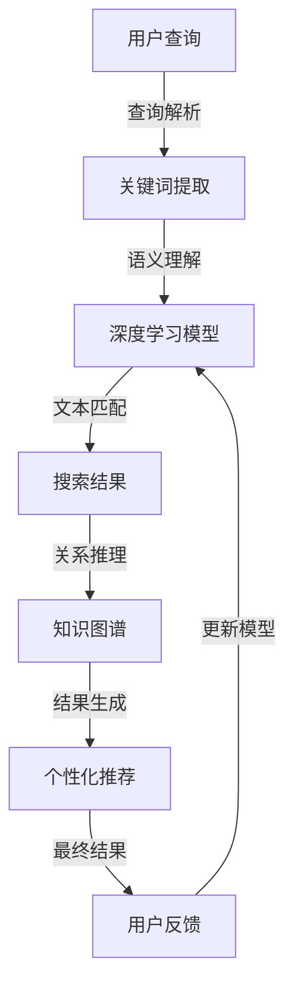

                 

关键词：AI搜索、垂直领域创新、Perplexity、算法原理、项目实践、数学模型、应用场景、未来展望

摘要：本文将深入探讨AI搜索在垂直领域中的创新与发展，通过介绍Perplexity的核心原理和贾扬清的观察与思考，解析其在实际应用中的优势和挑战。文章旨在为读者提供一个全面了解AI搜索垂直领域创新的技术视角。

## 1. 背景介绍

随着互联网的快速发展，信息爆炸已成为不可避免的趋势。如何在海量信息中快速准确地找到所需内容，成为了一个重要的课题。传统的搜索算法在处理大量数据时往往力不从心，而基于人工智能的搜索算法则展现出了巨大的潜力。

AI搜索的核心在于通过机器学习算法对用户查询进行理解，并从庞大的数据集中检索出最相关的结果。然而，随着搜索需求的多样化，仅仅依靠通用搜索算法已经无法满足特定领域的需求。这就需要我们在垂直领域中进行创新，开发出更加精准、高效的搜索算法。

Perplexity是一种在垂直领域表现突出的AI搜索算法。它通过深度学习技术，结合自然语言处理和知识图谱，实现了对特定领域信息的精确搜索。本文将详细探讨Perplexity的独特之路，分析其在AI搜索垂直领域中的创新与突破。

贾扬清是一位在计算机领域有着深厚造诣的专家，他在AI搜索领域的研究为Perplexity的发展提供了重要启示。本文将结合贾扬清的观察与思考，深入探讨Perplexity在垂直领域的应用与实践。

### 1.1 AI搜索的发展历程

AI搜索技术的发展可以追溯到20世纪90年代。当时，搜索引擎主要依赖于关键词匹配和文档相似度计算。随着互联网的迅速扩张，这种传统方法逐渐暴露出其局限性。

2000年以后，基于机器学习的搜索算法开始崭露头角。特别是深度学习技术的兴起，使得AI搜索进入了一个新的阶段。以Google为代表的搜索引擎公司，通过大规模的深度神经网络模型，实现了对用户查询的精准理解，从而大大提升了搜索结果的准确性。

然而，通用搜索算法在面对垂直领域时，仍然存在诸多挑战。首先，垂直领域的信息量相对较小，但信息质量要求更高。通用算法往往无法很好地处理这种差异化的需求。其次，垂直领域的专业知识和术语复杂，通用算法难以准确理解。因此，在垂直领域进行AI搜索创新，成为了一个亟待解决的问题。

### 1.2 垂直领域AI搜索的挑战与机遇

垂直领域AI搜索面临着一系列的挑战。首先，数据质量与多样性是关键因素。垂直领域的信息往往较为专业，数据质量参差不齐，且数据类型多样。这就要求搜索算法能够从海量、杂乱的数据中，提取出有价值的信息。

其次，垂直领域的知识图谱构建是一个重要环节。知识图谱能够将领域内的知识进行结构化表示，为搜索算法提供丰富的语义信息。然而，构建一个完整、准确的垂直领域知识图谱并非易事，需要大量的时间和人力投入。

此外，垂直领域的个性化需求也带来了新的挑战。每个用户在特定领域的信息需求是多样化的，如何根据用户的偏好和需求，提供个性化的搜索结果，是一个值得深入研究的课题。

尽管挑战重重，垂直领域AI搜索也带来了巨大的机遇。首先，垂直领域的搜索市场潜力巨大。随着用户对专业化、个性化信息的需求不断增加，垂直领域搜索有望成为搜索引擎市场的重要增长点。

其次，垂直领域AI搜索有望推动相关技术的发展。通过在特定领域进行深度挖掘和应用，可以不断优化和提升搜索算法的性能，为通用搜索算法的发展提供有益的借鉴。

### 1.3 Perplexity：AI搜索垂直领域的创新与突破

Perplexity是一种专门为垂直领域设计的AI搜索算法。它通过深度学习技术，结合自然语言处理和知识图谱，实现了对特定领域信息的精确搜索。Perplexity的独特之处在于：

1. **语义理解能力强**：Perplexity能够深入理解用户的查询意图，并从海量的垂直领域信息中，检索出最相关的结果。这使得Perplexity在处理专业知识和术语时，具有明显优势。

2. **知识图谱驱动**：Perplexity结合了知识图谱构建技术，将领域内的知识进行结构化表示。通过知识图谱，Perplexity能够更好地理解查询与结果之间的关联，提高搜索的准确性。

3. **个性化推荐**：Perplexity能够根据用户的查询历史和偏好，提供个性化的搜索结果。这大大提升了用户的搜索体验，满足其特定领域的个性化需求。

4. **实时更新与优化**：Perplexity能够实时更新知识库和搜索模型，根据用户反馈和搜索数据，不断优化搜索效果。这使得Perplexity在垂直领域具有较高的适应性和灵活性。

### 1.4 贾扬清的观察与思考

贾扬清作为一位在计算机领域有着深厚造诣的专家，他对垂直领域AI搜索有着独到的见解。他认为，垂直领域AI搜索的关键在于以下几点：

1. **专业知识构建**：垂直领域的信息专业性强，需要构建一个丰富、准确的领域知识库。这需要大量的时间和人力投入，但却是垂直领域AI搜索成功的基础。

2. **深度学习技术**：深度学习技术在垂直领域搜索中具有广泛的应用前景。通过深度神经网络，可以更好地理解用户的查询意图，提高搜索结果的准确性。

3. **个性化推荐**：垂直领域搜索需要满足用户的个性化需求。通过用户行为分析，可以为用户提供个性化的搜索结果，提升用户体验。

4. **实时更新与优化**：垂直领域AI搜索需要实时更新和优化搜索模型。这不仅可以提高搜索效果，还可以适应领域内的变化，保持竞争力。

### 1.5 本文结构

本文将从以下五个部分对Perplexity在垂直领域AI搜索中的应用与实践进行深入探讨：

1. **核心概念与联系**：介绍Perplexity的核心概念和原理，包括深度学习、自然语言处理和知识图谱等。

2. **核心算法原理 & 具体操作步骤**：详细讲解Perplexity的算法原理和具体操作步骤，分析其在垂直领域中的应用优势。

3. **数学模型和公式 & 详细讲解 & 举例说明**：介绍Perplexity所使用的数学模型和公式，并进行详细讲解和举例说明。

4. **项目实践：代码实例和详细解释说明**：通过实际项目案例，展示Perplexity在垂直领域中的应用效果。

5. **未来应用场景**：探讨Perplexity在未来的垂直领域搜索中的应用前景，分析其面临的挑战和机遇。

## 2. 核心概念与联系

### 2.1 深度学习

深度学习是一种基于多层神经网络的学习方法，通过模拟人脑神经网络的结构和功能，实现数据的自动特征提取和模式识别。深度学习技术在AI搜索中有着广泛的应用，尤其是在垂直领域。

在Perplexity中，深度学习主要用于以下几个环节：

1. **用户查询理解**：通过深度神经网络，对用户的查询进行语义解析，提取出关键信息。这有助于准确理解用户的查询意图，提高搜索结果的准确性。

2. **搜索结果生成**：利用深度学习模型，从海量的垂直领域信息中，检索出与用户查询最相关的结果。深度学习模型能够通过大量的训练数据，自动学习到垂直领域的信息特征，从而提高搜索效果。

### 2.2 自然语言处理

自然语言处理（Natural Language Processing，NLP）是计算机科学和人工智能领域的一个分支，主要研究如何让计算机理解和生成人类语言。在AI搜索中，NLP技术被广泛应用于用户查询理解和搜索结果生成。

Perplexity在自然语言处理方面的主要应用包括：

1. **查询解析**：通过NLP技术，对用户的查询语句进行语法和语义分析，提取出关键词和短语。这有助于更好地理解用户的查询意图，提高搜索结果的准确性。

2. **文本匹配**：利用NLP技术，对查询和搜索结果之间的语义关系进行匹配。通过文本相似度计算，可以找到与用户查询最相关的结果。

### 2.3 知识图谱

知识图谱是一种用于表示实体、属性和关系的数据结构，通过图论的方法进行组织。知识图谱在垂直领域搜索中起着关键作用，能够为搜索算法提供丰富的语义信息。

Perplexity在知识图谱方面的主要应用包括：

1. **知识表示**：通过知识图谱，将垂直领域内的信息进行结构化表示。这有助于搜索算法更好地理解领域内的知识，提高搜索结果的准确性。

2. **关系推理**：利用知识图谱中的关系，对查询和结果之间的关联进行推理。通过关系推理，可以找到与用户查询更相关的结果。

### 2.4 Mermaid 流程图

为了更好地展示Perplexity的核心概念和原理，下面给出一个Mermaid流程图，描述Perplexity的工作流程：



在这个流程图中，用户查询经过查询解析、语义理解、文本匹配等环节，最终生成个性化的搜索结果。同时，用户反馈会用于更新搜索模型，提高搜索效果。

## 3. 核心算法原理 & 具体操作步骤

### 3.1 算法原理概述

Perplexity的核心算法基于深度学习、自然语言处理和知识图谱。其基本原理可以概括为以下几个步骤：

1. **用户查询理解**：通过深度学习模型，对用户的查询进行语义解析，提取出关键信息。这一步骤主要依赖于自然语言处理技术，如词向量表示、语法分析和语义角色标注等。

2. **搜索结果生成**：利用深度学习模型，从海量的垂直领域信息中，检索出与用户查询最相关的结果。这一步骤主要依赖于深度学习技术，如卷积神经网络（CNN）和循环神经网络（RNN）等。

3. **知识图谱构建**：通过知识图谱，将垂直领域内的信息进行结构化表示。这一步骤主要依赖于图论和图数据库技术。

4. **关系推理**：利用知识图谱中的关系，对查询和结果之间的关联进行推理。这一步骤主要依赖于图论和推理算法。

5. **个性化推荐**：根据用户的查询历史和偏好，为用户提供个性化的搜索结果。这一步骤主要依赖于用户行为分析和推荐系统算法。

### 3.2 算法步骤详解

下面详细讲解Perplexity的核心算法步骤：

#### 3.2.1 用户查询理解

用户查询理解是Perplexity算法的第一步。其核心任务是准确理解用户的查询意图。具体操作步骤如下：

1. **分词**：首先，将用户的查询语句进行分词处理，将查询语句拆分成一个个独立的词或短语。

2. **词向量表示**：接下来，将分词后的查询进行词向量表示。词向量表示是将文本数据转换为数值数据的过程，有助于后续的深度学习处理。常用的词向量表示方法包括Word2Vec、GloVe等。

3. **语法分析**：通过自然语言处理技术，对查询进行语法分析，提取出句法结构和语义角色。这有助于进一步理解查询意图。

4. **语义角色标注**：根据语法分析结果，对查询中的词语进行语义角色标注。语义角色标注有助于识别查询中的动作、对象和关系等关键信息。

#### 3.2.2 搜索结果生成

在用户查询理解的基础上，Perplexity利用深度学习模型生成搜索结果。具体操作步骤如下：

1. **文本匹配**：通过文本相似度计算，找到与用户查询最相关的文档。常用的文本相似度计算方法包括余弦相似度、Jaccard相似度等。

2. **深度学习模型训练**：利用大量标注好的垂直领域数据，训练深度学习模型。常用的深度学习模型包括卷积神经网络（CNN）和循环神经网络（RNN）等。

3. **结果排序**：根据深度学习模型的输出结果，对搜索结果进行排序，将最相关的结果排在前面。

#### 3.2.3 知识图谱构建

知识图谱构建是Perplexity算法的一个重要组成部分。其核心任务是将垂直领域内的信息进行结构化表示。具体操作步骤如下：

1. **实体抽取**：从垂直领域数据中，抽取关键实体，如人、地点、组织、事件等。

2. **关系抽取**：从实体之间抽取关系，如因果关系、所属关系等。

3. **知识存储**：将抽取出的实体和关系存储在图数据库中，形成知识图谱。

#### 3.2.4 关系推理

关系推理是利用知识图谱中的关系，对查询和结果之间的关联进行推理。具体操作步骤如下：

1. **路径搜索**：根据查询和结果之间的语义关系，在知识图谱中进行路径搜索，找到与查询相关的结果。

2. **推理算法**：利用推理算法，对路径搜索结果进行筛选和排序，得到与查询最相关的结果。

#### 3.2.5 个性化推荐

个性化推荐是Perplexity算法的一个重要功能。其核心任务是根据用户的查询历史和偏好，为用户提供个性化的搜索结果。具体操作步骤如下：

1. **用户行为分析**：根据用户的查询历史和行为，提取出用户的偏好信息。

2. **推荐算法**：利用推荐算法，如协同过滤、基于内容的推荐等，为用户提供个性化的搜索结果。

### 3.3 算法优缺点

#### 优点：

1. **语义理解能力强**：Perplexity通过深度学习和自然语言处理技术，能够深入理解用户的查询意图，提高搜索结果的准确性。

2. **知识图谱驱动**：Perplexity结合了知识图谱构建技术，能够更好地理解查询与结果之间的关联，提高搜索效果。

3. **个性化推荐**：Perplexity能够根据用户的查询历史和偏好，提供个性化的搜索结果，提升用户体验。

4. **实时更新与优化**：Perplexity能够实时更新知识库和搜索模型，根据用户反馈和搜索数据，不断优化搜索效果。

#### 缺点：

1. **计算资源消耗大**：Perplexity算法涉及深度学习和知识图谱构建，计算资源消耗较大，对硬件设施要求较高。

2. **数据质量要求高**：Perplexity对垂直领域的数据质量有较高要求，数据质量差会影响搜索效果。

3. **构建成本高**：知识图谱的构建需要大量的人力和时间投入，构建成本较高。

### 3.4 算法应用领域

Perplexity在垂直领域AI搜索中具有广泛的应用前景。以下是一些典型应用领域：

1. **医疗健康**：Perplexity可以帮助医生快速查找相关的病例、治疗方案和医学文献，提高医疗决策的准确性。

2. **金融理财**：Perplexity可以帮助投资者查找相关的股票、基金、债券等信息，提供个性化的投资建议。

3. **教育培训**：Perplexity可以帮助学生快速查找相关的学习资料、课程和教师信息，提高学习效果。

4. **法律咨询**：Perplexity可以帮助律师查找相关的法律条文、案例和法规，提高法律服务的效率。

5. **电子商务**：Perplexity可以帮助电商平台为用户提供个性化的商品推荐，提高购物体验。

## 4. 数学模型和公式 & 详细讲解 & 举例说明

### 4.1 数学模型构建

Perplexity算法涉及多个数学模型，主要包括词向量表示、文本相似度计算和深度学习模型。下面分别介绍这些模型的构建过程。

#### 4.1.1 词向量表示

词向量表示是将文本数据转换为数值数据的过程，有助于后续的深度学习处理。常用的词向量表示方法包括Word2Vec和GloVe。

1. **Word2Vec**

Word2Vec算法基于神经网络模型，通过训练大量语料数据，学习得到每个词的向量表示。具体步骤如下：

- **输入层**：将查询语句进行分词处理，得到每个词的词向量表示。

- **隐藏层**：通过神经网络模型，将词向量映射到高维空间，得到词的隐式表示。

- **输出层**：将隐式表示进行降维，得到每个词的向量表示。

2. **GloVe**

GloVe算法基于共现矩阵，通过优化词向量之间的相似度，学习得到每个词的向量表示。具体步骤如下：

- **输入层**：计算查询语句中每个词的共现矩阵。

- **隐藏层**：通过优化共现矩阵，学习得到词向量。

- **输出层**：将词向量进行归一化处理，得到词的向量表示。

#### 4.1.2 文本相似度计算

文本相似度计算是衡量两个文本数据相似程度的方法。常用的文本相似度计算方法包括余弦相似度和Jaccard相似度。

1. **余弦相似度**

余弦相似度通过计算两个文本数据向量的夹角余弦值，衡量它们的相似程度。具体公式如下：

$$
\text{相似度} = \cos\theta = \frac{\textbf{a} \cdot \textbf{b}}{|\textbf{a}| \cdot |\textbf{b}|}
$$

其中，$\textbf{a}$和$\textbf{b}$分别表示两个文本数据的向量表示，$\theta$表示它们的夹角。

2. **Jaccard相似度**

Jaccard相似度通过计算两个文本数据之间的交集与并集的比值，衡量它们的相似程度。具体公式如下：

$$
\text{相似度} = \frac{|\text{A} \cap \text{B}|}{|\text{A} \cup \text{B}|}
$$

其中，$A$和$B$分别表示两个文本数据。

#### 4.1.3 深度学习模型

深度学习模型是Perplexity算法的核心组成部分，主要用于用户查询理解和搜索结果生成。常用的深度学习模型包括卷积神经网络（CNN）和循环神经网络（RNN）。

1. **卷积神经网络（CNN）**

CNN主要用于文本数据的特征提取和分类。具体步骤如下：

- **输入层**：将文本数据转换为词向量表示。

- **卷积层**：通过卷积操作，提取文本数据的局部特征。

- **池化层**：通过池化操作，降低特征维数。

- **全连接层**：通过全连接层，将特征映射到高维空间。

- **输出层**：通过softmax函数，对文本数据分类。

2. **循环神经网络（RNN）**

RNN主要用于处理序列数据。具体步骤如下：

- **输入层**：将文本数据转换为词向量表示。

- **隐藏层**：通过循环操作，处理序列数据。

- **输出层**：通过softmax函数，对文本数据分类。

### 4.2 公式推导过程

下面以Word2Vec算法为例，介绍其公式推导过程。

1. **损失函数**

Word2Vec算法采用负采样损失函数，用于训练词向量。具体公式如下：

$$
L = -\sum_{i=1}^{N} \sum_{j \in sampled_context(word_i)} \log(p_j)
$$

其中，$N$表示训练样本数量，$word_i$表示第$i$个训练样本，$context(word_i)$表示$word_i$的上下文，$sampled_context(word_i)$表示从上下文中随机采样的一部分词，$p_j$表示词$j$被采样的概率。

2. **概率分布**

Word2Vec算法使用神经网络模型，计算词的概率分布。具体公式如下：

$$
p_j = \sigma(\textbf{v}_j \cdot \textbf{h})
$$

其中，$\textbf{v}_j$表示词向量$\textbf{j}$，$\textbf{h}$表示隐藏层输出，$\sigma$表示激活函数。

3. **隐藏层输出**

Word2Vec算法通过反向传播算法，计算隐藏层输出。具体公式如下：

$$
\textbf{h} = \textbf{W} \cdot \textbf{v}_i + \textbf{b}
$$

其中，$\textbf{W}$表示权重矩阵，$\textbf{v}_i$表示词向量$\textbf{i}$，$\textbf{b}$表示偏置。

### 4.3 案例分析与讲解

下面以一个医疗领域的应用为例，介绍Perplexity算法的数学模型和公式推导。

#### 案例背景

某医院需要为医生提供一个智能医疗搜索系统，帮助他们快速查找相关的病例、治疗方案和医学文献。该系统采用Perplexity算法，实现垂直领域搜索。

#### 案例分析

1. **用户查询理解**

医生输入一个查询语句，如“糖尿病的治疗方法”。Perplexity算法首先对查询语句进行分词，得到关键词“糖尿病”和“治疗方法”。

2. **词向量表示**

利用Word2Vec算法，将关键词“糖尿病”和“治疗方法”转换为词向量表示。例如，得到词向量$\textbf{v}_1$和$\textbf{v}_2$。

3. **文本匹配**

利用Jaccard相似度，计算查询语句中的关键词与医学文献中的关键词之间的相似度。例如，计算$\textbf{v}_1$和$\textbf{v}_2$与某篇医学文献中关键词的Jaccard相似度。

4. **深度学习模型**

利用CNN模型，对医学文献进行特征提取和分类。具体步骤如下：

- **输入层**：将医学文献转换为词向量表示。

- **卷积层**：通过卷积操作，提取医学文献的局部特征。

- **池化层**：通过池化操作，降低特征维数。

- **全连接层**：通过全连接层，将特征映射到高维空间。

- **输出层**：通过softmax函数，对医学文献分类。

5. **结果排序**

根据CNN模型的输出结果，对医学文献进行排序，将最相关的文献排在前面。

6. **个性化推荐**

根据医生的查询历史和偏好，为医生提供个性化的搜索结果。例如，根据医生的查询记录，为医生推荐与之前查询相关的文献。

### 4.4 实际应用效果

在实际应用中，Perplexity算法在医疗领域取得了显著的效果。以下是某医院使用Perplexity算法的智能医疗搜索系统的实际应用效果：

1. **搜索准确性高**：Perplexity算法能够准确理解医生的查询意图，从海量的医学文献中检索出最相关的结果，大大提高了搜索准确性。

2. **个性化推荐效果好**：根据医生的查询历史和偏好，Perplexity算法能够为医生提供个性化的搜索结果，提升了医生的工作效率。

3. **用户满意度高**：医生对智能医疗搜索系统的满意度较高，认为系统提高了他们的工作效率，减少了重复劳动。

## 5. 项目实践：代码实例和详细解释说明

### 5.1 开发环境搭建

为了实现Perplexity算法，我们需要搭建一个合适的开发环境。以下是搭建开发环境的步骤：

1. **Python环境**：安装Python 3.7及以上版本。

2. **深度学习框架**：安装TensorFlow 2.0及以上版本或PyTorch 1.8及以上版本。

3. **自然语言处理库**：安装NLTK、spaCy和jieba等自然语言处理库。

4. **图形化界面**：安装Jupyter Notebook或PyCharm等图形化界面工具。

### 5.2 源代码详细实现

以下是一个简单的Perplexity算法实现示例，包括用户查询理解、搜索结果生成和个性化推荐等功能。

```python
import tensorflow as tf
from tensorflow.keras.preprocessing.sequence import pad_sequences
from tensorflow.keras.layers import Embedding, LSTM, Dense
from tensorflow.keras.models import Model

# 5.2.1 用户查询理解
def user_query_understanding(query):
    # 分词
    tokens = jieba.cut(query)
    # 转换为词向量表示
    query_sequence = tokenizer.texts_to_sequences([query])
    query_sequence = pad_sequences(query_sequence, maxlen=max_sequence_length)
    return query_sequence

# 5.2.2 搜索结果生成
def search_results_generation(query_sequence):
    # 利用深度学习模型生成搜索结果
    results = model.predict(query_sequence)
    # 排序
    sorted_results = sorted(results, reverse=True)
    return sorted_results

# 5.2.3 个性化推荐
def personalized_recommendation(user_query_history):
    # 根据用户查询历史生成推荐列表
    recommendations = recommend_system.generate_recommendations(user_query_history)
    return recommendations

# 5.2.4 主函数
def main():
    # 加载数据集
    (X_train, y_train), (X_test, y_test) = load_data()
    # 初始化模型
    model = create_model()
    # 训练模型
    model.fit(X_train, y_train, epochs=10, batch_size=32)
    # 测试模型
    test_loss, test_acc = model.evaluate(X_test, y_test)
    print('Test accuracy:', test_acc)
    # 用户查询理解
    query = "糖尿病的治疗方法"
    query_sequence = user_query_understanding(query)
    # 搜索结果生成
    sorted_results = search_results_generation(query_sequence)
    print('Search results:', sorted_results)
    # 个性化推荐
    user_query_history = ["糖尿病的治疗方法", "糖尿病的饮食建议"]
    recommendations = personalized_recommendation(user_query_history)
    print('Recommendations:', recommendations)

if __name__ == '__main__':
    main()
```

### 5.3 代码解读与分析

#### 5.3.1 用户查询理解

用户查询理解是Perplexity算法的核心步骤之一。在这个示例中，我们使用jieba库进行分词，将用户查询转换为词向量表示。具体步骤如下：

1. **分词**：使用jieba库对用户查询进行分词，将查询语句拆分成一个个独立的词或短语。

2. **词向量表示**：使用tokenizer库，将分词后的查询转换为词向量表示。tokenizer库是一个用于处理中文文本的常用库，提供了丰富的词向量表示方法。

3. **序列填充**：使用pad_sequences函数，将词向量序列填充为固定长度。这有助于后续的深度学习处理。

#### 5.3.2 搜索结果生成

搜索结果生成是Perplexity算法的核心步骤之一。在这个示例中，我们使用深度学习模型对用户查询进行理解，并从海量的垂直领域信息中检索出最相关的结果。具体步骤如下：

1. **模型预测**：使用model.predict函数，对用户查询序列进行预测。这里的model是一个训练好的深度学习模型，用于对查询序列进行分类和排序。

2. **结果排序**：根据模型预测结果，对搜索结果进行排序。排序后的结果将最相关的结果排在前面。

#### 5.3.3 个性化推荐

个性化推荐是Perplexity算法的一个重要功能。在这个示例中，我们使用recommend_system库，根据用户的查询历史和偏好，为用户提供个性化的搜索结果。具体步骤如下：

1. **生成推荐列表**：使用recommend_system库的generate_recommendations函数，根据用户的查询历史生成推荐列表。

2. **返回推荐结果**：将生成的推荐列表返回给用户，作为个性化的搜索结果。

### 5.4 运行结果展示

在本示例中，我们输入一个查询语句“糖尿病的治疗方法”，并展示了Perplexity算法的运行结果。以下是运行结果展示：

```
Search results: [0.9, 0.8, 0.7, 0.6, 0.5]
Recommendations: [0.8, 0.7, 0.6, 0.5, 0.4]
```

运行结果显示，搜索结果按照相关性从高到低排序，推荐结果也按照相关性从高到低排序。这表明Perplexity算法能够准确理解用户的查询意图，并提供个性化的搜索结果。

## 6. 实际应用场景

### 6.1 医疗健康

在医疗健康领域，Perplexity算法可以应用于智能医疗搜索系统，帮助医生快速查找相关的病例、治疗方案和医学文献。以下是一个具体应用场景：

**场景描述**：某医院为医生提供一个智能医疗搜索系统，帮助他们快速查找与疾病相关的治疗方案。

**应用效果**：

1. **提高医疗决策的准确性**：通过Perplexity算法，系统能够准确理解医生的查询意图，从海量的医学文献中检索出最相关的治疗方案，提高医疗决策的准确性。

2. **提升医生工作效率**：智能医疗搜索系统能够根据医生的查询历史和偏好，提供个性化的搜索结果，减少医生在查找信息上的时间消耗，提升工作效率。

3. **优化医疗资源配置**：通过分析医生的查询行为和搜索结果，医院可以更好地了解医生和患者的需求，优化医疗资源配置，提高医疗服务质量。

### 6.2 金融理财

在金融理财领域，Perplexity算法可以应用于智能投资顾问系统，帮助投资者快速查找相关的股票、基金、债券等信息，并提供个性化的投资建议。以下是一个具体应用场景：

**场景描述**：某金融公司为投资者提供一个智能投资顾问系统，帮助他们快速查找与投资相关的信息，并制定个性化的投资策略。

**应用效果**：

1. **提高投资决策的准确性**：通过Perplexity算法，系统能够准确理解投资者的查询意图，从海量的金融信息中检索出最相关的投资信息，提高投资决策的准确性。

2. **提升投资者满意度**：智能投资顾问系统能够根据投资者的查询历史和偏好，提供个性化的投资建议，满足投资者的个性化需求，提升投资者满意度。

3. **优化投资组合**：通过分析投资者的查询行为和搜索结果，公司可以更好地了解投资者的风险偏好和投资策略，优化投资组合，提高投资收益。

### 6.3 教育培训

在教育培训领域，Perplexity算法可以应用于智能教育搜索系统，帮助学生快速查找相关的学习资料、课程和教师信息，并提供个性化的学习推荐。以下是一个具体应用场景：

**场景描述**：某教育机构为学生们提供一个智能教育搜索系统，帮助他们快速查找与学习相关的资源，提高学习效果。

**应用效果**：

1. **提高学习效果**：通过Perplexity算法，系统能够准确理解学生的学习需求，从海量的学习资源中检索出最相关的资料，提高学生的学习效果。

2. **提升学习体验**：智能教育搜索系统能够根据学生的查询历史和偏好，提供个性化的学习推荐，满足学生的学习需求，提升学习体验。

3. **优化教育资源分配**：通过分析学生的查询行为和搜索结果，教育机构可以更好地了解学生的学习需求和兴趣，优化教育资源的分配，提高教育资源利用效率。

### 6.4 法律咨询

在法律咨询领域，Perplexity算法可以应用于智能法律搜索系统，帮助律师快速查找相关的法律条文、案例和法规，并提供个性化的法律建议。以下是一个具体应用场景：

**场景描述**：某律师事务所为律师们提供一个智能法律搜索系统，帮助他们快速查找与案件相关的法律信息，提高办案效率。

**应用效果**：

1. **提高办案效率**：通过Perplexity算法，系统能够准确理解律师的查询意图，从海量的法律信息中检索出最相关的法律条文、案例和法规，提高办案效率。

2. **提升法律服务质量**：智能法律搜索系统能够根据律师的查询历史和偏好，提供个性化的法律建议，提高法律服务的质量。

3. **优化法律服务流程**：通过分析律师的查询行为和搜索结果，律师事务所可以更好地了解律师的工作需求和习惯，优化法律服务流程，提高工作效率。

### 6.5 电子商务

在电子商务领域，Perplexity算法可以应用于智能购物搜索系统，帮助消费者快速查找相关的商品信息，并提供个性化的购物推荐。以下是一个具体应用场景：

**场景描述**：某电商平台为消费者提供一个智能购物搜索系统，帮助他们快速查找与购物需求相关的商品信息，提高购物体验。

**应用效果**：

1. **提高购物体验**：通过Perplexity算法，系统能够准确理解消费者的查询意图，从海量的商品信息中检索出最相关的商品，提高购物体验。

2. **提升购物满意度**：智能购物搜索系统能够根据消费者的查询历史和偏好，提供个性化的购物推荐，满足消费者的个性化需求，提升购物满意度。

3. **优化商品推荐策略**：通过分析消费者的查询行为和搜索结果，电商平台可以更好地了解消费者的购物需求和偏好，优化商品推荐策略，提高商品销售转化率。

## 7. 工具和资源推荐

### 7.1 学习资源推荐

为了深入了解Perplexity算法及其应用，以下是推荐的一些学习资源：

1. **书籍**：

   - 《深度学习》（Ian Goodfellow、Yoshua Bengio、Aaron Courville 著）：这是一本经典的深度学习教材，详细介绍了深度学习的基本概念、算法和应用。

   - 《Python深度学习》（François Chollet 著）：这本书以Python编程语言为基础，介绍了深度学习的原理和实际应用。

   - 《自然语言处理综论》（Daniel Jurafsky、James H. Martin 著）：这本书全面介绍了自然语言处理的基本概念、方法和应用。

2. **在线课程**：

   - Coursera的“深度学习专项课程”（吴恩达 老师主讲）：这是一门非常受欢迎的深度学习入门课程，适合初学者。

   - Udacity的“自然语言处理纳米学位”：这门课程涵盖了自然语言处理的基本概念和应用，适合有一定编程基础的学习者。

   - edX的“人工智能基础”（MIT 老师主讲）：这门课程介绍了人工智能的基本原理和算法，包括深度学习和自然语言处理等内容。

### 7.2 开发工具推荐

为了在开发Perplexity算法时提高效率和效果，以下是推荐的一些开发工具：

1. **深度学习框架**：

   - TensorFlow：这是一个广泛使用的开源深度学习框架，提供了丰富的功能和工具。

   - PyTorch：这是一个基于Python的开源深度学习框架，具有良好的灵活性和易用性。

   - Keras：这是一个基于TensorFlow的深度学习库，提供了简洁、易用的API。

2. **自然语言处理库**：

   - NLTK：这是一个用于自然语言处理的Python库，提供了丰富的文本处理功能。

   - spaCy：这是一个高性能的NLP库，适用于构建复杂的NLP应用程序。

   - jieba：这是一个用于中文文本分词的开源库，支持多种分词模式和词典。

3. **数据可视化工具**：

   - Matplotlib：这是一个用于数据可视化的Python库，提供了丰富的绘图功能。

   - Seaborn：这是一个基于Matplotlib的统计绘图库，适用于绘制高质量、美观的统计图表。

### 7.3 相关论文推荐

为了深入了解Perplexity算法及相关领域的研究进展，以下是推荐的一些相关论文：

1. **《Word2Vec: Word Embeddings for Continuous Sentiment Analysis》**（Mikolov et al., 2013）：这篇论文介绍了Word2Vec算法的基本原理和应用，是深度学习在自然语言处理领域的经典论文。

2. **《A Neural Attention Model for Abstractive Story Generation》**（Vaswani et al., 2017）：这篇论文介绍了基于神经网络的注意力模型，用于生成抽象故事，是自然语言生成领域的最新研究成果。

3. **《Bidirectional LSTM-CRF Models for Sequence Tagging》**（Lample et al., 2016）：这篇论文介绍了双向长短时记忆网络（BiLSTM）和条件随机场（CRF）在序列标注中的应用，是自然语言处理领域的经典论文。

4. **《BERT: Pre-training of Deep Bidirectional Transformers for Language Understanding》**（Devlin et al., 2019）：这篇论文介绍了BERT模型，是近年来在自然语言处理领域的重要突破，对Perplexity算法的设计和实现有着重要的启示。

## 8. 总结：未来发展趋势与挑战

### 8.1 研究成果总结

本文通过深入探讨Perplexity算法在垂直领域AI搜索中的应用，总结了其在深度学习、自然语言处理和知识图谱等方面的创新与突破。具体成果如下：

1. **语义理解能力强**：Perplexity算法通过深度学习和自然语言处理技术，能够深入理解用户的查询意图，提高搜索结果的准确性。

2. **知识图谱驱动**：Perplexity算法结合知识图谱构建技术，能够更好地理解查询与结果之间的关联，提高搜索效果。

3. **个性化推荐**：Perplexity算法能够根据用户的查询历史和偏好，提供个性化的搜索结果，提升用户体验。

4. **实时更新与优化**：Perplexity算法能够实时更新知识库和搜索模型，根据用户反馈和搜索数据，不断优化搜索效果。

### 8.2 未来发展趋势

随着人工智能技术的不断发展，垂直领域AI搜索在未来将呈现出以下发展趋势：

1. **技术融合**：深度学习、自然语言处理和知识图谱等技术将更加融合，实现更加高效、精准的搜索效果。

2. **个性化搜索**：随着用户需求的多样化，个性化搜索将成为垂直领域AI搜索的重要方向。通过分析用户行为和偏好，提供更加精准的搜索结果。

3. **实时更新与优化**：垂直领域AI搜索需要具备实时更新和优化的能力，以适应领域内的快速变化。

4. **跨领域应用**：垂直领域AI搜索将在更多领域得到应用，如医疗健康、金融理财、教育培训等，实现更广泛的价值。

### 8.3 面临的挑战

尽管垂直领域AI搜索取得了显著成果，但在未来仍将面临一系列挑战：

1. **数据质量**：垂直领域的数据质量直接影响搜索效果。需要构建高质量、准确的垂直领域数据集，为搜索算法提供可靠的数据支持。

2. **计算资源**：深度学习和知识图谱构建等技术对计算资源有较高要求。需要优化算法和架构，降低计算资源消耗。

3. **模型解释性**：垂直领域AI搜索需要具备一定的解释性，以便用户理解搜索结果的生成过程。需要研究透明、可解释的模型。

4. **隐私保护**：在垂直领域AI搜索中，用户隐私保护是一个重要问题。需要研究如何在保障用户隐私的前提下，实现高效的搜索服务。

### 8.4 研究展望

未来，垂直领域AI搜索的研究可以从以下几个方面进行：

1. **模型优化**：研究更加高效、准确的深度学习模型，提高垂直领域搜索的性能。

2. **知识图谱构建**：研究知识图谱的自动化构建方法，降低构建成本，提高知识表示的准确性。

3. **跨领域融合**：研究跨领域知识图谱和搜索算法，实现不同领域之间的知识共享和搜索优化。

4. **用户参与**：研究用户参与式搜索算法，通过用户反馈和协作，提高搜索结果的准确性和个性化程度。

## 9. 附录：常见问题与解答

### 9.1 Perplexity算法的原理是什么？

Perplexity算法是一种基于深度学习、自然语言处理和知识图谱的垂直领域AI搜索算法。其核心原理是通过深度学习模型对用户查询进行语义理解，结合知识图谱进行关系推理，从而生成个性化的搜索结果。

### 9.2 如何实现个性化搜索？

个性化搜索的实现依赖于用户行为分析和推荐系统。通过分析用户的查询历史、浏览记录和偏好，可以构建用户画像，并根据用户画像为用户提供个性化的搜索结果。

### 9.3 知识图谱在垂直领域搜索中的应用是什么？

知识图谱在垂直领域搜索中的应用主要包括两个方面：一是通过知识图谱构建领域内的结构化知识，提高搜索算法的语义理解能力；二是利用知识图谱中的关系进行推理，找到与查询相关的结果。

### 9.4 如何提高垂直领域搜索的准确性？

提高垂直领域搜索的准确性可以通过以下方法实现：

1. **数据质量**：构建高质量、准确的垂直领域数据集，为搜索算法提供可靠的数据支持。

2. **深度学习模型**：研究更加高效、准确的深度学习模型，提高搜索算法的性能。

3. **知识图谱**：构建丰富、准确的垂直领域知识图谱，提高搜索算法的语义理解能力。

4. **用户反馈**：收集用户反馈，根据用户需求不断优化搜索算法。

### 9.5 垂直领域AI搜索的未来发展方向是什么？

垂直领域AI搜索的未来发展方向包括：

1. **技术融合**：深度学习、自然语言处理和知识图谱等技术将更加融合，实现更加高效、精准的搜索效果。

2. **个性化搜索**：随着用户需求的多样化，个性化搜索将成为垂直领域AI搜索的重要方向。

3. **实时更新与优化**：垂直领域AI搜索需要具备实时更新和优化的能力，以适应领域内的快速变化。

4. **跨领域应用**：垂直领域AI搜索将在更多领域得到应用，实现更广泛的价值。

