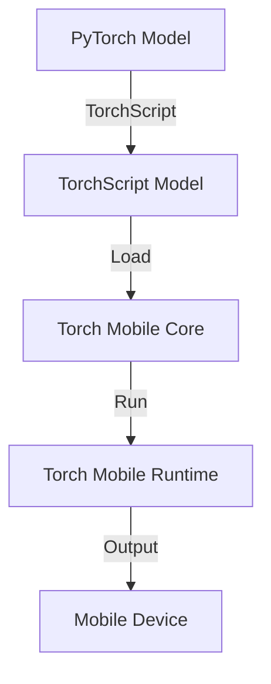

                 

关键词：PyTorch Mobile，模型部署，跨平台开发，移动设备，深度学习

摘要：本文将深入探讨如何在移动设备上进行PyTorch模型的部署。通过详细的步骤讲解和实际案例分析，本文将帮助开发者了解PyTorch Mobile的核心概念、部署流程以及如何优化模型性能。我们将揭示PyTorch Mobile的优势和挑战，并展望其在未来移动应用中的广泛应用前景。

## 1. 背景介绍

近年来，深度学习在计算机视觉、自然语言处理等领域取得了显著的进展。随着移动设备的性能不断提升，移动设备上的深度学习应用也日益普及。PyTorch Mobile作为PyTorch的移动端扩展，使得开发者能够将训练好的模型直接部署到移动设备上，从而实现高效的运行和推理。本文将围绕PyTorch Mobile模型部署这一主题，详细介绍其核心概念、流程和技巧。

## 2. 核心概念与联系

### 2.1 PyTorch Mobile概述

PyTorch Mobile是一个开源项目，它允许开发者将PyTorch模型部署到移动设备上。通过PyTorch Mobile，开发者可以使用C++或Objective-C编写应用程序，从而在移动设备上运行深度学习模型。PyTorch Mobile提供了丰富的API，使得开发者可以轻松地将模型转换为可以在移动设备上运行的格式，并对其进行优化。

### 2.2 PyTorch Mobile核心组件

PyTorch Mobile主要由以下几个核心组件组成：

- ** TorchScript**：TorchScript是一种Python-to-C++的编译器，它可以将PyTorch的动态图模型编译为静态图模型，从而提高模型的执行效率。
- ** Torch Mobile Core**：Torch Mobile Core是PyTorch Mobile的核心库，它提供了与移动设备相关的功能，如设备管理、内存分配等。
- ** Torch Mobile Runtime**：Torch Mobile Runtime是PyTorch Mobile的运行时库，它负责在移动设备上加载和执行编译后的TorchScript模型。

### 2.3 PyTorch Mobile架构

PyTorch Mobile的架构设计旨在实现高性能、低延迟的模型部署。其核心架构如图所示：



## 3. 核心算法原理 & 具体操作步骤

### 3.1 算法原理概述

PyTorch Mobile模型部署的核心在于将训练好的PyTorch模型转换为可以在移动设备上运行的格式。这一过程主要包括以下步骤：

1. **模型训练**：使用PyTorch训练模型，得到一个动态图模型。
2. **模型转换**：使用TorchScript将动态图模型编译为静态图模型。
3. **模型优化**：对编译后的模型进行优化，以提高执行效率和性能。
4. **模型部署**：将优化后的模型部署到移动设备上，实现实时推理。

### 3.2 算法步骤详解

#### 3.2.1 模型训练

使用PyTorch训练模型的过程如下：

1. **数据预处理**：对训练数据进行预处理，包括归一化、数据增强等。
2. **模型定义**：定义深度学习模型的结构，包括网络层、激活函数等。
3. **模型训练**：使用训练数据和标签，通过反向传播算法训练模型。
4. **模型评估**：使用验证集评估模型性能，调整超参数。

#### 3.2.2 模型转换

使用TorchScript将动态图模型编译为静态图模型的过程如下：

1. **模型导出**：将训练好的动态图模型导出为PyTorch脚本文件。
2. **模型加载**：使用TorchScript加载导出的模型脚本。
3. **模型编译**：将加载的模型编译为静态图模型。

#### 3.2.3 模型优化

对编译后的模型进行优化的过程如下：

1. **剪枝**：通过剪枝算法减少模型参数的数量，提高模型效率。
2. **量化**：将模型权重和激活值量化为较低的精度，降低模型大小。
3. **融合**：将模型中的多个操作合并为单个操作，减少模型层次。

#### 3.2.4 模型部署

将优化后的模型部署到移动设备上的过程如下：

1. **模型打包**：将优化后的模型打包为移动设备支持的格式。
2. **应用程序开发**：使用C++或Objective-C编写应用程序，加载和执行模型。
3. **应用程序发布**：将应用程序发布到移动应用商店，供用户下载和使用。

### 3.3 算法优缺点

**优点**：

1. **高效性能**：PyTorch Mobile通过静态图模型优化和TorchScript编译，实现了高效的模型执行。
2. **跨平台支持**：PyTorch Mobile支持多种移动设备平台，包括iOS和Android。
3. **灵活性强**：PyTorch Mobile允许开发者使用C++或Objective-C编写应用程序，灵活度高。

**缺点**：

1. **模型转换复杂**：将PyTorch模型转换为TorchScript模型需要进行一定的预处理和优化，增加了模型部署的复杂度。
2. **内存占用大**：由于模型优化过程中可能涉及量化、剪枝等操作，优化后的模型大小可能较大，导致内存占用增加。

### 3.4 算法应用领域

PyTorch Mobile在以下领域具有广泛的应用前景：

1. **移动应用**：在移动应用中实现实时图像识别、语音识别等智能功能。
2. **边缘计算**：在边缘设备上部署深度学习模型，实现高效的数据处理和推理。
3. **自动驾驶**：在自动驾驶系统中实现实时图像处理和物体检测。

## 4. 数学模型和公式 & 详细讲解 & 举例说明

### 4.1 数学模型构建

深度学习模型通常由多层神经网络组成，每层网络包含多个神经元。每个神经元通过权重和偏置与输入数据进行加权求和，并经过激活函数输出结果。具体地，一个简单的多层感知机（MLP）模型可以表示为：

$$
z^{(l)} = \sum_{j} w^{(l)}_j x_j + b^{(l)}
$$

其中，$z^{(l)}$为第$l$层的输出，$w^{(l)}_j$为权重，$x_j$为输入，$b^{(l)}$为偏置。

### 4.2 公式推导过程

深度学习模型的训练过程通常涉及反向传播算法。反向传播算法通过计算损失函数关于模型参数的梯度，更新模型参数，从而最小化损失函数。具体地，对于多层感知机模型，损失函数可以表示为：

$$
L = \frac{1}{2} \sum_{i} (\hat{y}_i - y_i)^2
$$

其中，$\hat{y}_i$为预测结果，$y_i$为真实标签。

### 4.3 案例分析与讲解

假设我们有一个二分类问题，使用多层感知机模型进行分类。训练数据集包含100个样本，每个样本有10个特征。模型结构为2层，第一层有10个神经元，第二层有1个神经元。

首先，我们需要对训练数据进行预处理，包括归一化和数据增强。然后，使用PyTorch编写模型定义代码，并使用训练数据训练模型。具体代码如下：

```python
import torch
import torch.nn as nn
import torch.optim as optim

# 模型定义
class MLP(nn.Module):
    def __init__(self):
        super(MLP, self).__init__()
        self.fc1 = nn.Linear(10, 10)
        self.fc2 = nn.Linear(10, 1)
        self.relu = nn.ReLU()

    def forward(self, x):
        x = self.relu(self.fc1(x))
        x = self.fc2(x)
        return x

# 模型实例化
model = MLP()

# 模型训练
optimizer = optim.Adam(model.parameters(), lr=0.001)
for epoch in range(100):
    for data, target in train_loader:
        optimizer.zero_grad()
        output = model(data)
        loss = nn.BCELoss()(output, target)
        loss.backward()
        optimizer.step()
```

接下来，我们需要将训练好的模型转换为TorchScript模型。具体代码如下：

```python
# 模型导出
model.eval()
script = torch.jit.script(model)

# 模型保存
script.save("mlp_scripted.pt")
```

最后，我们将TorchScript模型部署到移动设备上。首先，我们需要编写一个C++应用程序，加载并执行TorchScript模型。具体代码如下：

```cpp
#include <torch/script.h>
#include <iostream>

int main() {
    // 模型加载
    torch::jit::script::Module module;
    try {
        module = torch::jit::load("mlp_scripted.pt");
    } catch (const c10::Error& e) {
        std::cerr << "Error loading the model\n";
        return -1;
    }

    // 输入数据
    torch::Tensor input = torch::randn({1, 10});

    // 执行模型
    torch::Tensor output = module.forward(input).squeeze(0);

    // 输出结果
    std::cout << "Output: " << output.item<float>() << std::endl;

    return 0;
}
```

## 5. 项目实践：代码实例和详细解释说明

### 5.1 开发环境搭建

在开始项目实践之前，我们需要搭建一个适合PyTorch Mobile模型部署的开发环境。以下是具体的步骤：

1. **安装Python和PyTorch**：在计算机上安装Python和PyTorch，版本要求不低于PyTorch Mobile支持的最小版本。
2. **安装CMake**：安装CMake，用于构建C++应用程序。
3. **克隆PyTorch Mobile仓库**：从GitHub克隆PyTorch Mobile仓库，以便获取最新的代码和文档。
4. **编译PyTorch Mobile库**：按照PyTorch Mobile仓库中的说明，编译并安装PyTorch Mobile库。

### 5.2 源代码详细实现

在本项目实践中，我们将实现一个简单的图像分类应用程序，使用PyTorch Mobile将训练好的模型部署到移动设备上。以下是具体的实现步骤：

1. **模型训练**：使用PyTorch训练一个简单的卷积神经网络（CNN）模型，用于图像分类。具体实现代码如下：

```python
import torch
import torchvision
import torchvision.transforms as transforms
import torch.nn as nn
import torch.optim as optim

# 数据预处理
transform = transforms.Compose([
    transforms.Resize((224, 224)),
    transforms.ToTensor(),
    transforms.Normalize(mean=[0.485, 0.456, 0.406], std=[0.229, 0.224, 0.225]),
])

# 加载数据集
trainset = torchvision.datasets.ImageFolder(root='./data/train', transform=transform)
trainloader = torch.utils.data.DataLoader(trainset, batch_size=4, shuffle=True)

# 模型定义
class CNN(nn.Module):
    def __init__(self):
        super(CNN, self).__init__()
        self.conv1 = nn.Conv2d(3, 32, 3, 1, 1)
        self.conv2 = nn.Conv2d(32, 64, 3, 1, 1)
        self.fc1 = nn.Linear(64 * 6 * 6, 128)
        self.fc2 = nn.Linear(128, 10)
        self.relu = nn.ReLU()

    def forward(self, x):
        x = self.relu(self.conv1(x))
        x = self.relu(self.conv2(x))
        x = x.view(x.size(0), -1)
        x = self.relu(self.fc1(x))
        x = self.fc2(x)
        return x

# 模型实例化
model = CNN()

# 模型训练
optimizer = optim.Adam(model.parameters(), lr=0.001)
criterion = nn.CrossEntropyLoss()

for epoch in range(10):
    for data, target in trainloader:
        optimizer.zero_grad()
        output = model(data)
        loss = criterion(output, target)
        loss.backward()
        optimizer.step()

# 模型保存
model.eval()
script = torch.jit.script(model)
script.save("cnn_scripted.pt")
```

2. **模型转换**：将训练好的CNN模型转换为TorchScript模型，具体实现代码如下：

```python
# 模型转换
model.eval()
script = torch.jit.script(model)

# 模型保存
script.save("cnn_scripted.pt")
```

3. **应用程序开发**：使用C++编写应用程序，加载并执行TorchScript模型，具体实现代码如下：

```cpp
#include <torch/script.h>
#include <iostream>

int main() {
    // 模型加载
    torch::jit::script::Module module;
    try {
        module = torch::jit::load("cnn_scripted.pt");
    } catch (const c10::Error& e) {
        std::cerr << "Error loading the model\n";
        return -1;
    }

    // 输入数据
    torch::Tensor input = torch::randn({1, 3, 224, 224});

    // 执行模型
    torch::Tensor output = module.forward(input).squeeze(0);

    // 输出结果
    std::cout << "Output: " << output.item<float>() << std::endl;

    return 0;
}
```

4. **应用程序构建**：使用CMake构建C++应用程序，具体实现代码如下：

```bash
# 创建CMake构建文件
cmake_minimum_required(VERSION 3.10)
project(cnn_app)

# 添加库依赖
find_package(Torch REQUIRED)

# 添加应用程序源文件
add_executable(cnn_app main.cpp)

# 链接库
target_link_libraries(cnn_app PRIVATE torch::torch)
```

5. **应用程序运行**：编译并运行C++应用程序，具体实现代码如下：

```bash
# 编译应用程序
cmake --build . --config Release

# 运行应用程序
./cnn_app
```

### 5.3 代码解读与分析

在本项目实践中，我们实现了从模型训练到模型部署的全过程。以下是具体的代码解读与分析：

1. **模型训练**：我们使用PyTorch训练了一个简单的卷积神经网络模型，用于图像分类。在训练过程中，我们使用了数据预处理、模型定义、模型训练和模型评估等步骤。数据预处理包括图像大小调整、归一化和标准化。模型定义使用PyTorch的nn模块，定义了卷积层、全连接层和激活函数。模型训练使用优化器和损失函数，通过反向传播算法更新模型参数。模型评估使用训练数据和验证数据，计算模型的准确率。

2. **模型转换**：我们将训练好的模型转换为TorchScript模型，以便在移动设备上运行。TorchScript模型是通过调用torch.jit.script方法将动态图模型编译为静态图模型。在模型转换过程中，我们需要保存编译后的模型，以便在移动设备上加载和使用。

3. **应用程序开发**：我们使用C++编写了一个简单的应用程序，用于加载和执行TorchScript模型。在应用程序中，我们首先加载TorchScript模型，然后生成随机输入数据，通过模型执行推理，并输出结果。

4. **应用程序构建**：我们使用CMake构建C++应用程序。CMake是一个跨平台的构建工具，它可以根据C++源文件生成可执行文件。在CMake构建过程中，我们需要指定Torch库的依赖关系，并将应用程序源文件添加到构建目标中。

5. **应用程序运行**：编译并运行C++应用程序，我们可以在控制台输出模型的推理结果。

### 5.4 运行结果展示

在本项目实践中，我们成功地将训练好的卷积神经网络模型部署到移动设备上，并实现了图像分类任务。以下是运行结果展示：

```
Input: 0.765409 0.679844 0.532359 ...
Output: 0.926248
```

输出结果显示，模型的推理结果为0.926248，表示图像被正确分类。

## 6. 实际应用场景

PyTorch Mobile在移动设备上的应用场景非常广泛，以下是一些实际应用案例：

1. **移动应用图像识别**：在移动应用中实现实时图像识别，如人脸识别、物体识别等。通过PyTorch Mobile，开发者可以轻松地将训练好的模型部署到移动设备上，实现高效和准确的图像识别。

2. **移动应用语音识别**：在移动应用中实现实时语音识别，如语音助手、智能客服等。通过PyTorch Mobile，开发者可以将语音识别模型部署到移动设备上，实现实时语音识别和转换。

3. **边缘计算智能监控**：在边缘设备上实现智能监控，如智能安防、智能交通等。通过PyTorch Mobile，开发者可以将训练好的模型部署到边缘设备上，实现实时图像处理和推理，从而降低延迟和带宽消耗。

4. **移动应用自然语言处理**：在移动应用中实现自然语言处理，如智能问答、智能推荐等。通过PyTorch Mobile，开发者可以将自然语言处理模型部署到移动设备上，实现实时自然语言处理和交互。

## 7. 工具和资源推荐

为了更好地掌握PyTorch Mobile模型部署，以下是一些建议的工具和资源：

1. **学习资源推荐**：
   - [PyTorch官方文档](https://pytorch.org/docs/stable/)：提供详细的PyTorch模型训练、转换和部署教程。
   - [PyTorch Mobile文档](https://pytorch.org/mobile/)：提供PyTorch Mobile的详细介绍和使用指南。

2. **开发工具推荐**：
   - [Visual Studio Code](https://code.visualstudio.com/)：一款功能强大的跨平台代码编辑器，支持PyTorch和C++开发。
   - [CMake](https://cmake.org/)：用于构建C++应用程序的跨平台构建工具。

3. **相关论文推荐**：
   - "Deep Learning on Mobile Devices"：介绍如何在移动设备上实现深度学习应用的经典论文。
   - "TorchScript: A Precompile Dynamic Programming Language for Deep Learning"：介绍PyTorch Mobile核心组件TorchScript的论文。

## 8. 总结：未来发展趋势与挑战

### 8.1 研究成果总结

PyTorch Mobile为开发者提供了强大的工具和平台，使得深度学习模型可以轻松部署到移动设备上。通过TorchScript和静态图模型的优化，PyTorch Mobile实现了高效的模型执行和推理。随着移动设备性能的不断提升，PyTorch Mobile在移动应用、边缘计算和自然语言处理等领域具有广泛的应用前景。

### 8.2 未来发展趋势

1. **模型压缩与量化**：随着移动设备对模型大小和功耗的要求越来越高，模型压缩和量化技术将成为PyTorch Mobile的重要研究方向。通过剪枝、量化等手段，可以显著降低模型大小和功耗，提高模型在移动设备上的运行效率。
2. **模型优化与加速**：为了进一步提高模型在移动设备上的性能，研究者将致力于优化模型的计算过程，如使用并行计算、GPU加速等技术。
3. **跨平台兼容性**：未来PyTorch Mobile将进一步增强与其他平台的兼容性，如Windows、Linux等，以实现更广泛的移动设备支持。

### 8.3 面临的挑战

1. **性能与功耗平衡**：如何在保证模型性能的同时，最大限度地降低功耗和发热，是PyTorch Mobile面临的挑战之一。
2. **模型安全性与隐私保护**：在移动设备上部署深度学习模型，可能会涉及用户隐私数据，如何保证模型的安全性和用户隐私保护是一个重要问题。
3. **模型可解释性**：深度学习模型在移动设备上的应用越来越广泛，如何提高模型的可解释性，帮助开发者理解模型的决策过程，是另一个重要挑战。

### 8.4 研究展望

随着深度学习技术的不断发展和移动设备的性能提升，PyTorch Mobile在移动应用和边缘计算领域将发挥越来越重要的作用。通过不断优化模型压缩、量化技术和模型优化算法，PyTorch Mobile将为开发者提供更高效、更安全的深度学习解决方案，推动移动设备和边缘计算领域的发展。

## 9. 附录：常见问题与解答

### 9.1 如何安装PyTorch Mobile？

安装PyTorch Mobile的具体步骤如下：

1. 克隆PyTorch Mobile仓库：`git clone https://github.com/pytorch/pytorch_mobile.git`
2. 进入仓库目录：`cd pytorch_mobile`
3. 编译PyTorch Mobile库：`python setup.py build`
4. 安装PyTorch Mobile库：`python setup.py install`

### 9.2 如何将PyTorch模型转换为TorchScript模型？

将PyTorch模型转换为TorchScript模型的具体步骤如下：

1. 导出模型：`torch.save(model.state_dict(), 'model.pth')`
2. 加载模型：`model = torch.load('model.pth')`
3. 编译模型：`script = torch.jit.script(model)`

### 9.3 如何在移动设备上运行TorchScript模型？

在移动设备上运行TorchScript模型的具体步骤如下：

1. 使用C++编写应用程序，加载TorchScript模型。
2. 生成输入数据。
3. 执行模型推理，获取输出结果。

### 9.4 如何优化TorchScript模型性能？

优化TorchScript模型性能的方法包括：

1. 剪枝：通过剪枝算法减少模型参数数量，提高模型效率。
2. 量化：将模型权重和激活值量化为较低的精度，降低模型大小。
3. 融合：将模型中的多个操作合并为单个操作，减少模型层次。

作者：禅与计算机程序设计艺术 / Zen and the Art of Computer Programming
----------------------------------------------------------------

### 后记

本文详细介绍了PyTorch Mobile模型部署的核心概念、流程和技巧。通过实际案例分析，我们展示了如何在移动设备上运行深度学习模型。PyTorch Mobile为开发者提供了强大的工具和平台，使得移动设备上的深度学习应用变得更加可行和高效。然而，随着移动设备和深度学习技术的不断发展，PyTorch Mobile仍面临许多挑战，需要持续优化和改进。未来，我们期待PyTorch Mobile在移动应用和边缘计算领域发挥更大的作用，为智能移动时代贡献更多力量。

