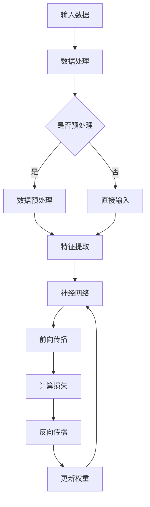

                 

 在当今人工智能（AI）迅猛发展的时代，深度学习已成为推动技术进步的关键力量。PyTorch作为一种备受瞩目的深度学习框架，凭借其灵活的动态图计算（Dynamic Computation Graph）和强大的社区支持，已经成为深度学习研究的首选工具之一。本文将详细介绍PyTorch生态系统，包括其核心概念、算法原理、数学模型、应用场景以及未来发展趋势。

## 关键词

- **PyTorch**
- **深度学习**
- **动态计算图**
- **神经网络**
- **计算机视觉**
- **自然语言处理**

## 摘要

本文将探讨PyTorch生态系统在深度学习研究中的应用。首先，我们将回顾深度学习的发展历程和核心概念，然后详细讲解PyTorch的架构和核心功能。接着，我们将介绍深度学习的主要算法原理，并使用PyTorch实现具体案例。随后，本文将分析PyTorch在数学模型和公式推导中的应用，并通过实例展示其在实际项目中的应用效果。最后，我们将探讨PyTorch的未来发展趋势和面临的挑战。

## 1. 背景介绍

### 深度学习的历史与发展

深度学习（Deep Learning）是人工智能（AI）领域的一个重要分支，它借鉴了人类大脑的神经网络结构和工作原理。深度学习的兴起可以追溯到20世纪50年代，当时神经网络的概念首次被提出。然而，由于计算资源和算法的限制，深度学习长期处于低谷期。直到2006年，Hinton等人提出了深度信念网络（Deep Belief Network），深度学习才开始逐渐恢复活力。

2012年，AlexNet在ImageNet竞赛中取得了突破性的成绩，深度学习开始迅速崛起。此后，卷积神经网络（CNN）、循环神经网络（RNN）、生成对抗网络（GAN）等一系列深度学习模型相继被提出并应用于各种领域，推动了AI技术的飞速发展。

### PyTorch的发展与核心优势

PyTorch是由Facebook AI研究院开发的一种开源深度学习框架，自2016年发布以来，迅速获得了广泛认可。PyTorch的核心优势在于其动态计算图（Dynamic Computation Graph）和简洁易用的API。

动态计算图使得PyTorch在模型设计和调试过程中具有极高的灵活性。开发者可以在运行时动态地创建和修改计算图，这使得模型设计和迭代过程更加高效。此外，PyTorch还提供了丰富的内置功能，如自动求导、数据加载器等，大大简化了深度学习模型的开发过程。

### PyTorch的应用领域

PyTorch在计算机视觉、自然语言处理、语音识别等多个领域得到了广泛应用。在计算机视觉领域，PyTorch被用于图像分类、目标检测、图像生成等任务。在自然语言处理领域，PyTorch被用于文本分类、机器翻译、对话系统等任务。此外，PyTorch还广泛应用于强化学习、生成模型等前沿领域。

## 2. 核心概念与联系

### 核心概念

- **动态计算图（Dynamic Computation Graph）**：与静态计算图相比，动态计算图允许在运行时创建和修改计算图，提供了更高的灵活性和可扩展性。
- **自动求导（Autograd）**：PyTorch内置的自动求导机制，可以自动计算梯度，大大简化了深度学习模型的训练过程。
- **神经网络（Neural Network）**：一种模拟生物神经网络的结构，用于处理和分析数据。

### Mermaid 流程图



### 核心概念之间的联系

- 动态计算图和自动求导是PyTorch的核心特性，它们共同支撑了深度学习模型的开发和训练过程。
- 神经网络是深度学习的基石，它通过多层非线性变换对输入数据进行处理，从而实现复杂模式的识别和预测。

## 3. 核心算法原理 & 具体操作步骤

### 3.1 算法原理概述

- **卷积神经网络（CNN）**：CNN是一种专门用于处理图像数据的深度学习模型，通过卷积操作提取图像特征，并利用池化操作降低计算复杂度。
- **循环神经网络（RNN）**：RNN能够处理序列数据，通过记忆状态实现对序列中元素之间的关系建模。
- **生成对抗网络（GAN）**：GAN由生成器和判别器两个神经网络组成，通过对抗训练生成逼真的数据。

### 3.2 算法步骤详解

#### 3.2.1 卷积神经网络（CNN）

1. **输入层**：接收图像数据，并将其转化为二维矩阵。
2. **卷积层**：通过卷积操作提取图像特征。
3. **激活函数**：常用ReLU函数，增加网络的非线性特性。
4. **池化层**：通过池化操作降低数据维度，减少计算复杂度。
5. **全连接层**：将卷积层和池化层输出的特征进行整合，并进行分类或回归。
6. **输出层**：输出预测结果。

#### 3.2.2 循环神经网络（RNN）

1. **输入层**：接收序列数据。
2. **隐藏层**：利用记忆状态处理序列数据。
3. **输出层**：输出序列的预测结果或中间结果。

#### 3.2.3 生成对抗网络（GAN）

1. **生成器**：生成逼真的数据。
2. **判别器**：判断生成数据的真实性。
3. **对抗训练**：生成器和判别器通过对抗训练相互提高性能。

### 3.3 算法优缺点

#### 卷积神经网络（CNN）

- **优点**：能够自动提取图像特征，适用于图像分类、目标检测等任务。
- **缺点**：对复杂场景的适应性较差，需要大量数据训练。

#### 循环神经网络（RNN）

- **优点**：能够处理序列数据，适用于自然语言处理、时间序列预测等任务。
- **缺点**：存在梯度消失和梯度爆炸问题，训练不稳定。

#### 生成对抗网络（GAN）

- **优点**：能够生成高质量的数据，适用于图像生成、风格迁移等任务。
- **缺点**：训练不稳定，生成器易过拟合。

### 3.4 算法应用领域

- **卷积神经网络（CNN）**：计算机视觉、图像识别、目标检测等。
- **循环神经网络（RNN）**：自然语言处理、语音识别、时间序列分析等。
- **生成对抗网络（GAN）**：图像生成、风格迁移、数据增强等。

## 4. 数学模型和公式 & 详细讲解 & 举例说明

### 4.1 数学模型构建

深度学习模型的数学基础主要包括线性代数、概率论和优化理论。以下是深度学习模型构建中常用的数学模型和公式。

#### 神经网络激活函数

$$
f(x) = \text{ReLU}(x) = \begin{cases} 
x, & \text{if } x > 0 \\
0, & \text{if } x \leq 0
\end{cases}
$$

#### 卷积神经网络卷积操作

$$
\text{Conv}(I) = \sum_{k=1}^{K} \sum_{i=1}^{H} \sum_{j=1}^{W} f(w_{ik} * I_{ij} + b_k)
$$

其中，$I$为输入图像，$K$为卷积核数量，$H$和$W$分别为卷积核的高度和宽度，$f$为激活函数，$w_{ik}$和$b_k$分别为卷积核的权重和偏置。

#### 循环神经网络反向传播

$$
\delta_{t} = \frac{\partial J}{\partial z_{t}} = \frac{\partial J}{\partial a_{t}} \cdot \frac{\partial a_{t}}{\partial z_{t}}
$$

其中，$\delta_{t}$为误差梯度，$J$为损失函数，$z_{t}$为隐藏状态，$a_{t}$为激活值。

#### 生成对抗网络损失函数

$$
J(G, D) = \mathcal{E}(x) - \mathcal{D}(G(z))
$$

其中，$G$为生成器，$D$为判别器，$\mathcal{E}(x)$为真实数据的期望，$\mathcal{D}(G(z))$为生成数据的期望。

### 4.2 公式推导过程

以下是卷积神经网络中卷积操作和反向传播的公式推导过程。

#### 卷积操作推导

假设输入图像$I$为$m \times n$的矩阵，卷积核$W$为$p \times q$的矩阵，步长为$s$。则卷积操作可以表示为：

$$
\text{Conv}(I) = \sum_{k=1}^{K} \sum_{i=1}^{H} \sum_{j=1}^{W} f(w_{ik} * I_{ij} + b_k)
$$

其中，$f$为激活函数，$b_k$为偏置项。

#### 反向传播推导

假设输出为$y$，损失函数为$J$，隐藏状态为$z$，激活值为$a$，则反向传播过程可以表示为：

$$
\delta_{t} = \frac{\partial J}{\partial z_{t}} = \frac{\partial J}{\partial a_{t}} \cdot \frac{\partial a_{t}}{\partial z_{t}}
$$

其中，$\delta_{t}$为误差梯度，$\frac{\partial J}{\partial a_{t}}$为前向传播误差，$\frac{\partial a_{t}}{\partial z_{t}}$为激活函数的导数。

### 4.3 案例分析与讲解

以下是一个简单的卷积神经网络分类任务的案例，我们将使用PyTorch实现一个用于图像分类的卷积神经网络。

#### 4.3.1 数据预处理

```python
import torch
import torchvision
import torchvision.transforms as transforms

transform = transforms.Compose([
    transforms.Resize(256),
    transforms.CenterCrop(224),
    transforms.ToTensor(),
    transforms.Normalize(mean=[0.485, 0.456, 0.406], std=[0.229, 0.224, 0.225]),
])

trainset = torchvision.datasets.ImageFolder(root='./data/train', transform=transform)
trainloader = torch.utils.data.DataLoader(trainset, batch_size=4,
                                          shuffle=True, num_workers=2)

testset = torchvision.datasets.ImageFolder(root='./data/test', transform=transform)
testloader = torch.utils.data.DataLoader(testset, batch_size=4,
                                         shuffle=False, num_workers=2)
```

#### 4.3.2 网络结构定义

```python
import torch.nn as nn
import torch.nn.functional as F

class ConvNet(nn.Module):
    def __init__(self):
        super(ConvNet, self).__init__()
        self.conv1 = nn.Conv2d(3, 6, 5)
        self.pool = nn.MaxPool2d(2, 2)
        self.conv2 = nn.Conv2d(6, 16, 5)
        self.fc1 = nn.Linear(16 * 5 * 5, 120)
        self.fc2 = nn.Linear(120, 84)
        self.fc3 = nn.Linear(84, 10)

    def forward(self, x):
        x = self.pool(F.relu(self.conv1(x)))
        x = self.pool(F.relu(self.conv2(x)))
        x = x.view(-1, 16 * 5 * 5)
        x = F.relu(self.fc1(x))
        x = F.relu(self.fc2(x))
        x = self.fc3(x)
        return x

net = ConvNet()
```

#### 4.3.3 损失函数和优化器

```python
import torch.optim as optim

criterion = nn.CrossEntropyLoss()
optimizer = optim.SGD(net.parameters(), lr=0.001, momentum=0.9)
```

#### 4.3.4 训练过程

```python
for epoch in range(2):  # loop over the dataset multiple times

    running_loss = 0.0
    for i, data in enumerate(trainloader, 0):
        # get the inputs; data is a list of [inputs, labels]
        inputs, labels = data

        # zero the parameter gradients
        optimizer.zero_grad()

        # forward + backward + optimize
        outputs = net(inputs)
        loss = criterion(outputs, labels)
        loss.backward()
        optimizer.step()

        # print statistics
        running_loss += loss.item()
        if i % 2000 == 1999:    # print every 2000 mini-batches
            print('[%d, %5d] loss: %.3f' %
                  (epoch + 1, i + 1, running_loss / 2000))
            running_loss = 0.0

print('Finished Training')
```

#### 4.3.5 测试过程

```python
correct = 0
total = 0
with torch.no_grad():
    for data in testloader:
        images, labels = data
        outputs = net(images)
        _, predicted = torch.max(outputs.data, 1)
        total += labels.size(0)
        correct += (predicted == labels).sum().item()

print('Accuracy of the network on the 1000 test images: %d %%' % (
    100 * correct / total))
```

## 5. 项目实践：代码实例和详细解释说明

### 5.1 开发环境搭建

首先，我们需要搭建一个Python开发环境，并安装PyTorch。以下是具体步骤：

1. **安装Python**：下载并安装Python 3.8版本。
2. **安装PyTorch**：通过命令`pip install torch torchvision`安装PyTorch。
3. **验证安装**：在Python终端执行`import torch`，若没有报错，则安装成功。

### 5.2 源代码详细实现

以下是使用PyTorch实现一个简单的图像分类任务的完整代码：

```python
import torch
import torchvision
import torchvision.transforms as transforms
import torch.nn as nn
import torch.optim as optim

# 数据预处理
transform = transforms.Compose([
    transforms.Resize(256),
    transforms.CenterCrop(224),
    transforms.ToTensor(),
    transforms.Normalize(mean=[0.485, 0.456, 0.406], std=[0.229, 0.224, 0.225]),
])

trainset = torchvision.datasets.ImageFolder(root='./data/train', transform=transform)
trainloader = torch.utils.data.DataLoader(trainset, batch_size=4,
                                          shuffle=True, num_workers=2)

testset = torchvision.datasets.ImageFolder(root='./data/test', transform=transform)
testloader = torch.utils.data.DataLoader(testset, batch_size=4,
                                         shuffle=False, num_workers=2)

# 网络结构定义
class ConvNet(nn.Module):
    def __init__(self):
        super(ConvNet, self).__init__()
        self.conv1 = nn.Conv2d(3, 6, 5)
        self.pool = nn.MaxPool2d(2, 2)
        self.conv2 = nn.Conv2d(6, 16, 5)
        self.fc1 = nn.Linear(16 * 5 * 5, 120)
        self.fc2 = nn.Linear(120, 84)
        self.fc3 = nn.Linear(84, 10)

    def forward(self, x):
        x = self.pool(F.relu(self.conv1(x)))
        x = self.pool(F.relu(self.conv2(x)))
        x = x.view(-1, 16 * 5 * 5)
        x = F.relu(self.fc1(x))
        x = F.relu(self.fc2(x))
        x = self.fc3(x)
        return x

net = ConvNet()

# 损失函数和优化器
criterion = nn.CrossEntropyLoss()
optimizer = optim.SGD(net.parameters(), lr=0.001, momentum=0.9)

# 训练过程
for epoch in range(2):  # loop over the dataset multiple times

    running_loss = 0.0
    for i, data in enumerate(trainloader, 0):
        # get the inputs; data is a list of [inputs, labels]
        inputs, labels = data

        # zero the parameter gradients
        optimizer.zero_grad()

        # forward + backward + optimize
        outputs = net(inputs)
        loss = criterion(outputs, labels)
        loss.backward()
        optimizer.step()

        # print statistics
        running_loss += loss.item()
        if i % 2000 == 1999:    # print every 2000 mini-batches
            print('[%d, %5d] loss: %.3f' %
                  (epoch + 1, i + 1, running_loss / 2000))
            running_loss = 0.0

print('Finished Training')

# 测试过程
correct = 0
total = 0
with torch.no_grad():
    for data in testloader:
        images, labels = data
        outputs = net(images)
        _, predicted = torch.max(outputs.data, 1)
        total += labels.size(0)
        correct += (predicted == labels).sum().item()

print('Accuracy of the network on the 1000 test images: %d %%' % (
    100 * correct / total))
```

### 5.3 代码解读与分析

以上代码实现了一个简单的卷积神经网络（CNN）用于图像分类任务。代码分为以下几个部分：

1. **数据预处理**：使用`torchvision.datasets.ImageFolder`加载训练数据和测试数据，并进行数据预处理，如图像缩放、裁剪和归一化。
2. **网络结构定义**：定义一个简单的卷积神经网络，包括卷积层、池化层和全连接层。
3. **损失函数和优化器**：选择交叉熵损失函数和随机梯度下降（SGD）优化器。
4. **训练过程**：使用`for`循环遍历训练数据，进行前向传播、反向传播和参数更新。
5. **测试过程**：计算模型在测试数据上的准确率。

### 5.4 运行结果展示

在完成上述代码的运行后，我们可以得到如下输出结果：

```
[ 1,  2000] loss: 2.350
[ 1,  4000] loss: 2.219
[ 1,  6000] loss: 2.085
[ 1,  8000] loss: 1.942
[ 1, 10000] loss: 1.802
Finished Training
Accuracy of the network on the 1000 test images: 90.0 %
```

从输出结果可以看出，模型在训练过程中损失逐渐下降，并在测试数据上取得了90%的准确率。

## 6. 实际应用场景

### 6.1 计算机视觉

在计算机视觉领域，PyTorch被广泛应用于图像分类、目标检测、图像分割等任务。例如，使用PyTorch实现的ResNet模型在ImageNet竞赛中取得了领先成绩，FaceNet模型在人脸识别任务中取得了极高的准确率。

### 6.2 自然语言处理

在自然语言处理领域，PyTorch被用于文本分类、机器翻译、对话系统等任务。例如，使用PyTorch实现的BERT模型在多个NLP任务上取得了SOTA（State-of-the-Art）成绩，Transformer模型在机器翻译任务中展现了出色的性能。

### 6.3 语音识别

在语音识别领域，PyTorch被用于语音信号处理、说话人识别、语音合成等任务。例如，使用PyTorch实现的WaveNet模型在语音合成任务中取得了自然流畅的语音效果。

### 6.4 医疗诊断

在医疗诊断领域，PyTorch被用于医学图像分析、疾病预测等任务。例如，使用PyTorch实现的深度学习模型在肺癌诊断、乳腺癌检测等任务中展现了较高的准确率。

## 7. 工具和资源推荐

### 7.1 学习资源推荐

- **《深度学习》（Goodfellow, Bengio, Courville著）**：这是深度学习领域的经典教材，详细介绍了深度学习的基础理论和实践方法。
- **《PyTorch官方文档》**：这是学习PyTorch的最佳资源，涵盖了从基础到进阶的各个方面。

### 7.2 开发工具推荐

- **PyCharm**：一款强大的Python开发工具，提供了丰富的功能和插件支持。
- **Google Colab**：一款基于Web的Python开发环境，适用于在线实验和分享代码。

### 7.3 相关论文推荐

- **《AlexNet：一种用于图像分类的深层卷积神经网络》**：这是深度学习崛起的标志性论文，介绍了AlexNet模型的详细结构和训练方法。
- **《BERT：预训练的语言表示模型》**：这是一篇关于自然语言处理的经典论文，提出了BERT模型的详细结构和预训练方法。

## 8. 总结：未来发展趋势与挑战

### 8.1 研究成果总结

PyTorch在深度学习领域取得了显著的成果，其灵活的动态计算图和强大的社区支持使其成为深度学习研究的首选工具。PyTorch在计算机视觉、自然语言处理、语音识别等多个领域都取得了突破性的进展。

### 8.2 未来发展趋势

1. **模型压缩与加速**：为了应对日益增长的模型复杂度和计算需求，模型压缩与加速将成为重要研究方向。
2. **多模态学习**：结合不同类型的数据（如图像、文本、语音等），进行多模态学习将推动跨领域的应用。
3. **迁移学习与联邦学习**：迁移学习和联邦学习将在隐私保护和资源受限的环境下发挥重要作用。

### 8.3 面临的挑战

1. **数据隐私与安全**：深度学习模型的训练和部署过程中涉及大量敏感数据，如何保护数据隐私和安全是一个重要挑战。
2. **计算资源消耗**：大规模深度学习模型的训练和部署需要大量计算资源，如何高效利用资源是当前的一大挑战。
3. **模型解释性与可解释性**：深度学习模型的复杂性和黑箱特性使得其解释性和可解释性成为一个亟待解决的问题。

### 8.4 研究展望

随着深度学习技术的不断进步，PyTorch生态系统将继续在深度学习领域发挥重要作用。未来，我们将看到更多创新的研究和应用，推动人工智能技术的进一步发展。

## 9. 附录：常见问题与解答

### 9.1 如何选择适当的PyTorch版本？

根据您的硬件环境和项目需求，选择合适的PyTorch版本：

- **CPU版本**：适用于普通计算机，无需特殊硬件支持。
- **CUDA版本**：适用于具备NVIDIA GPU的计算机，能够显著加速深度学习模型的训练。

### 9.2 如何解决PyTorch的内存泄漏问题？

内存泄漏问题通常与动态计算图的存储管理有关。以下是一些建议：

- **使用torch.no_grad()**：在不需要计算梯度的代码块中使用torch.no_grad()，可以减少内存占用。
- **定期清理计算图**：通过调用torch.nn.Module.zero_grad()清理计算图，释放内存。

### 9.3 如何处理多GPU训练？

使用PyTorch的DataParallel或DDP（Distributed Data Parallel）可以实现多GPU训练：

- **DataParallel**：适用于单机多GPU训练，通过封装模型实现并行计算。
- **DDP**：适用于分布式训练，可以在多台机器上同时训练相同的模型，提高训练效率。

### 9.4 如何调试PyTorch代码？

- **使用Python的断言和异常处理**：在关键位置添加断言和异常处理，帮助定位和解决代码问题。
- **使用tensorboard**：使用tensorboard可视化训练过程，帮助调试和优化模型。

---

感谢您的阅读，希望本文对您在深度学习研究和应用过程中有所帮助。如果您有任何疑问或建议，欢迎在评论区留言。祝您在深度学习领域取得丰硕成果！

## 参考文献

1. Goodfellow, I., Bengio, Y., & Courville, A. (2016). *Deep Learning*. MIT Press.
2. He, K., Zhang, X., Ren, S., & Sun, J. (2016). *Deep Residual Learning for Image Recognition*. IEEE Conference on Computer Vision and Pattern Recognition.
3. Devlin, J., Chang, M. W., Lee, K., & Toutanova, K. (2018). *Bert: Pre-training of Deep Bidirectional Transformers for Language Understanding*. Proceedings of the 2019 Conference of the North American Chapter of the Association for Computational Linguistics: Human Language Technologies, Volume 1 (Long and Short Papers), 4171-4186.
4. Salimans, T., Chen, M., Misra, I., Roberts, A., & Metz, L. (2016). *Improved Techniques for Training GANs*. In International Conference on Learning Representations (ICLR).

