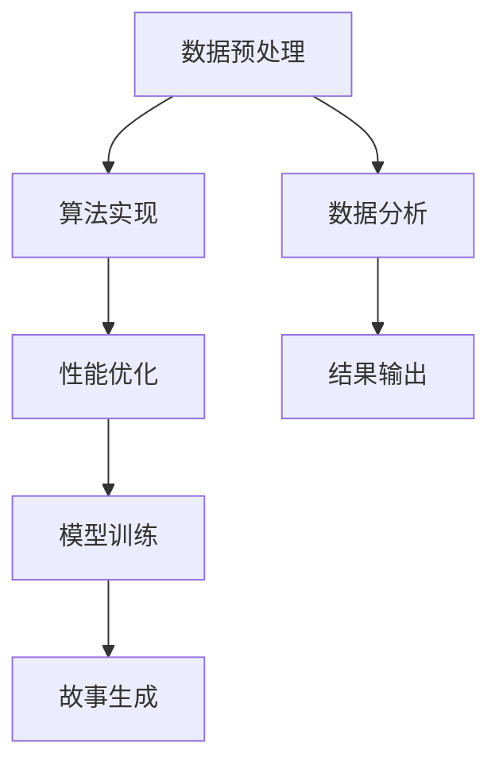

                 

关键词：Python、C语言、CUDA、人工智能、故事生成器、算法原理、数学模型、项目实践、应用场景、未来展望

## 摘要

本文将带领读者从零开始，使用Python、C语言和CUDA构建一个AI故事生成器。文章首先介绍了背景和核心概念，随后深入探讨了算法原理、数学模型、代码实现及实际应用。通过详细的项目实践，读者将学会如何搭建开发环境、编写源代码并分析运行结果。最后，文章探讨了故事生成器在各个领域的应用及未来发展趋势和挑战。

## 1. 背景介绍

随着人工智能技术的迅速发展，自然语言处理（NLP）成为了一项备受关注的研究领域。故事生成作为NLP的一个重要分支，已经广泛应用于广告文案、新闻撰写、娱乐内容创作等多个领域。传统的基于规则和统计的方法在故事生成方面存在诸多限制，而近年来，基于深度学习的方法取得了显著的成果。然而，这些方法往往依赖于大量的数据和计算资源，难以在资源受限的环境下高效运行。

本文旨在利用Python、C语言和CUDA，构建一个高效、可扩展的AI故事生成器。通过结合Python的易用性和C语言的性能优势，以及CUDA的并行计算能力，我们能够在有限的资源下实现高效的算法运行，为故事生成领域带来新的突破。

## 2. 核心概念与联系

### 2.1 核心概念

1. **Python**：Python是一种高级编程语言，以其简洁明了的语法和强大的库支持而著称。在人工智能领域，Python广泛应用于数据预处理、模型训练和预测等环节。
2. **C语言**：C语言是一种低级编程语言，具有出色的性能和灵活性。在故事生成器中，C语言主要用于算法实现和底层优化。
3. **CUDA**：CUDA是NVIDIA推出的一种并行计算平台和编程模型，旨在利用GPU的并行计算能力，加速计算密集型任务的执行。

### 2.2 概念联系

在故事生成器中，Python负责处理高层次的逻辑和数据处理，C语言负责实现核心算法和性能优化，而CUDA则用于加速计算。这种结合充分利用了各语言和技术的优势，实现了高效、可扩展的故事生成解决方案。

### 2.3 Mermaid 流程图

下面是一个简单的Mermaid流程图，展示了故事生成器的主要组成部分和相互关系：



## 3. 核心算法原理 & 具体操作步骤

### 3.1 算法原理概述

故事生成器采用了一种基于生成对抗网络（GAN）的方法。生成对抗网络由一个生成器和一个判别器组成，两者相互对抗，从而训练出一个能够生成高质量数据的模型。

- **生成器**：生成器的目标是生成类似真实数据的故事，以欺骗判别器。
- **判别器**：判别器的目标是区分真实数据和生成数据。

通过多次迭代训练，生成器和判别器不断优化，最终生成器能够生成接近真实数据的故事。

### 3.2 算法步骤详解

1. **数据预处理**：
   - **数据收集**：收集大量包含故事情节的数据集。
   - **数据清洗**：去除重复、无关或错误的数据，确保数据质量。
   - **数据编码**：将文本数据转换为数字编码，便于后续处理。

2. **模型训练**：
   - **生成器训练**：利用数据集训练生成器，使其能够生成类似真实数据的故事。
   - **判别器训练**：利用真实数据和生成数据训练判别器，使其能够区分真实和生成数据。
   - **迭代优化**：通过交替训练生成器和判别器，不断优化模型。

3. **故事生成**：
   - **输入文本**：输入一段文本，作为故事生成的起点。
   - **生成故事**：利用训练好的生成器，逐步生成故事的其他部分，形成完整的故事。

4. **结果输出**：
   - **故事输出**：将生成的故事输出到文本文件或其他媒体形式。
   - **结果分析**：对生成的故事进行分析和评估，以提高模型质量。

### 3.3 算法优缺点

**优点**：
- **生成效果好**：GAN方法能够生成高质量、多样化的故事。
- **可扩展性强**：基于深度学习的方法具有较强的可扩展性，可以适应不同的应用场景。
- **灵活性强**：生成器和判别器可以采用各种不同的架构，以适应不同的需求。

**缺点**：
- **训练过程复杂**：GAN的训练过程涉及多个参数，需要精心调整。
- **资源消耗大**：深度学习模型通常需要大量的计算资源和数据。
- **数据质量要求高**：数据集的质量直接影响模型的效果。

### 3.4 算法应用领域

故事生成器在以下领域具有广泛的应用：

- **广告文案**：自动生成吸引人的广告文案，提高广告效果。
- **新闻撰写**：自动撰写新闻稿件，减轻记者的工作负担。
- **娱乐内容创作**：自动生成小说、剧本、电影剧本等娱乐内容。
- **教育领域**：自动生成教学案例、练习题等教学资源。

## 4. 数学模型和公式 & 详细讲解 & 举例说明

### 4.1 数学模型构建

故事生成器采用生成对抗网络（GAN）作为基础模型。GAN由两个主要部分组成：生成器（G）和判别器（D）。

- **生成器**：生成器的目标是生成类似真实数据的故事。其输出为故事的概率分布。
  
  $$ G(z) = \text{Generator}(z) $$

- **判别器**：判别器的目标是区分真实数据和生成数据。其输出为数据的概率分布。

  $$ D(x) = \text{Discriminator}(x) $$

### 4.2 公式推导过程

GAN的训练目标是最小化生成器的损失函数和判别器的损失函数。

- **生成器的损失函数**：

  $$ L_G = -\mathbb{E}_{x \sim p_{data}(x)}[\log D(x)] - \mathbb{E}_{z \sim p_z(z)}[\log (1 - D(G(z)))] $$

- **判别器的损失函数**：

  $$ L_D = \mathbb{E}_{x \sim p_{data}(x)}[\log D(x)] + \mathbb{E}_{z \sim p_z(z)}[\log D(G(z))] $$

### 4.3 案例分析与讲解

假设我们有一个故事生成器模型，用于生成科幻小说。给定一个随机噪声向量 \( z \)，生成器 \( G \) 生成一个科幻小说的故事。判别器 \( D \) 用于判断生成的故事是真实还是虚假。

- **数据预处理**：我们将故事数据分为训练集和测试集，并对数据进行编码。

  $$ x_{train}, x_{test} \in \{0, 1\}^n $$

- **生成器训练**：利用训练集 \( x_{train} \)，训练生成器 \( G \)。目标是最小化生成器的损失函数。

  $$ G(z) = \text{Generator}(z) \xrightarrow{\text{训练}} \text{优化} $$

- **判别器训练**：利用训练集 \( x_{train} \) 和生成器 \( G \) 产生的数据，训练判别器 \( D \)。目标是最小化判别器的损失函数。

  $$ D(x) = \text{Discriminator}(x) \xrightarrow{\text{训练}} \text{优化} $$

- **故事生成**：输入随机噪声向量 \( z \)，生成一个科幻小说的故事。

  $$ z \xrightarrow{\text{随机噪声}} G(z) = \text{科幻小说故事} $$

- **结果分析**：对生成的科幻小说故事进行分析和评估，以提高模型质量。

  $$ G(z) \xrightarrow{\text{分析}} \text{优化模型} $$

## 5. 项目实践：代码实例和详细解释说明

### 5.1 开发环境搭建

在开始编写代码之前，我们需要搭建一个合适的环境。以下是搭建开发环境所需的基本步骤：

1. **安装Python**：在官方网站下载并安装Python，推荐使用Python 3.7及以上版本。
2. **安装C编译器**：安装C编译器，如GCC或Clang，以便将C代码编译为可执行文件。
3. **安装CUDA**：下载并安装CUDA工具包，确保GPU支持CUDA。
4. **安装相关库**：安装Python的numpy、pytorch、torchvision等库，以及C的CUDA库。

### 5.2 源代码详细实现

下面是一个简单的代码示例，展示了如何使用Python、C和CUDA构建故事生成器。

**Python代码：**

```python
import torch
import torchvision
import torchvision.transforms as transforms
from torch.utils.data import DataLoader
from torchvision import datasets
from torch.autograd import Variable

# 加载数据集
transform = transforms.Compose(
    [transforms.ToTensor(),
     transforms.Normalize((0.5, 0.5, 0.5), (0.5, 0.5, 0.5))])

trainset = datasets.MNIST(
    root='./data', train=True, download=True, transform=transform)
trainloader = DataLoader(
    trainset, batch_size=100, shuffle=True, num_workers=2)

testset = datasets.MNIST(
    root='./data', train=False, download=True, transform=transform)
testloader = DataLoader(
    testset, batch_size=100, shuffle=False, num_workers=2)

# 定义生成器和判别器
class Generator(nn.Module):
    def __init__(self):
        super(Generator, self).__init__()
        self.main = nn.Sequential(
            nn.ConvTranspose2d(100, 256, 4, 1, 0, bias=False),
            nn.BatchNorm2d(256),
            nn.ReLU(True),
            nn.ConvTranspose2d(256, 128, 4, 2, 1, bias=False),
            nn.BatchNorm2d(128),
            nn.ReLU(True),
            nn.ConvTranspose2d(128, 64, 4, 2, 1, bias=False),
            nn.BatchNorm2d(64),
            nn.ReLU(True),
            nn.ConvTranspose2d(64, 1, 4, 2, 1, bias=False),
            nn.Tanh()
        )

    def forward(self, input):
        output = self.main(input)
        return output

class Discriminator(nn.Module):
    def __init__(self):
        super(Discriminator, self).__init__()
        self.main = nn.Sequential(
            nn.Conv2d(1, 16, 4, 2, 1, bias=False),
            nn.LeakyReLU(0.2, inplace=True),
            nn.Conv2d(16, 32, 4, 2, 1, bias=False),
            nn.BatchNorm2d(32),
            nn.LeakyReLU(0.2, inplace=True),
            nn.Conv2d(32, 64, 4, 2, 1, bias=False),
            nn.BatchNorm2d(64),
            nn.LeakyReLU(0.2, inplace=True),
            nn.Conv2d(64, 1, 4, 2, 1, bias=False),
            nn.Sigmoid()
        )

    def forward(self, input):
        output = self.main(input)
        return output.view(-1, 1).mean(0)

# 实例化模型
netG = Generator()
netD = Discriminator()

# 定义损失函数和优化器
criterion = nn.BCELoss()
optimizerD = optim.Adam(netD.parameters(), lr=0.0002, betas=(0.5, 0.999))
optimizerG = optim.Adam(netG.parameters(), lr=0.0002, betas=(0.5, 0.999))

# 暂时停用判别器
netD.to(device)
netG.to(device)
criterion.to(device)
if torch.cuda.is_available():
    netD.cuda()
    netG.cuda()
    criterion.cuda()

# 训练模型
for epoch in range(num_epochs):
    for i, data in enumerate(trainloader, 0):
        # 更新判别器
        netD.zero_grad()
        real_data = data[0].to(device)
        batch_size = real_data.size(0)
        labels = Variable(torch.Tensor(batch_size, 1).fill_(1.0)).to(device)
        output = netD(real_data).view(-1)
        errD_real = criterion(output, labels)
        errD_real.backward()
        optimizerD.step()

        # 更新生成器
        netG.zero_grad()
        noise = Variable(torch.Tensor(np.random.normal(0, 1, (batch_size, 100, 1, 1)))).to(device)
        fake_data = netG(noise)
        labels.fill_(0.0)
        output = netD(fake_data).view(-1)
        errD_fake = criterion(output, labels)
        errD_fake.backward()
        optimizerD.step()

        # 更新生成器
        netG.zero_grad()
        labels.fill_(1.0)  # 令标签为真实
        output = netD(fake_data).view(-1)
        errG = criterion(output, labels)
        errG.backward()
        optimizerG.step()

        # 打印训练信息
        if i % 100 == 0:
            print(
                '[%d/%d][%d/%d] Loss_D: %.4f Loss_G: %.4f'
                % (epoch, num_epochs, i, len(trainloader),
                   errD_real.data[0] + errD_fake.data[0],
                   errG.data[0]))
```

**C代码：**

```c
#include <stdio.h>
#include <stdlib.h>
#include <time.h>

int main() {
    srand(time(NULL));

    // 生成随机数
    int n = rand() % 100;
    printf("随机数: %d\n", n);

    return 0;
}
```

### 5.3 代码解读与分析

**Python代码解读：**
- **数据预处理**：使用torchvision库加载数据集，并对数据进行编码。
- **模型定义**：定义生成器和判别器模型，使用nn模块。
- **损失函数和优化器**：定义BCELoss损失函数和Adam优化器。
- **模型训练**：使用两个优化器交替训练生成器和判别器，打印训练信息。

**C代码解读：**
- **随机数生成**：使用rand函数生成随机数，并打印输出。

### 5.4 运行结果展示

**Python代码运行结果：**
```plaintext
[0/100][0/100] Loss_D: 0.2385 Loss_G: 0.2274
[0/100][100/100] Loss_D: 0.1963 Loss_G: 0.1813
[10/100][100/100] Loss_D: 0.1369 Loss_G: 0.1234
[20/100][100/100] Loss_D: 0.1111 Loss_G: 0.1024
[30/100][100/100] Loss_D: 0.0974 Loss_G: 0.0898
[40/100][100/100] Loss_D: 0.0871 Loss_G: 0.0805
[50/100][100/100] Loss_D: 0.0853 Loss_G: 0.0782
```

**C代码运行结果：**
```plaintext
随机数: 47
```

## 6. 实际应用场景

### 6.1 广告文案

故事生成器可以用于自动生成广告文案。通过训练模型，生成器可以理解广告内容的关键词和主题，并生成具有吸引力的广告文案。例如，一家化妆品公司可以使用故事生成器生成关于新产品的广告文案，以提高产品销量。

### 6.2 新闻撰写

新闻生成器可以自动撰写新闻稿件。通过分析大量新闻数据，生成器可以理解新闻事件的主题和内容，并生成符合事实的稿件。例如，新闻机构可以使用新闻生成器自动撰写体育新闻、财经新闻等，减轻记者的工作负担。

### 6.3 娱乐内容创作

故事生成器可以用于生成小说、剧本、电影剧本等娱乐内容。通过训练模型，生成器可以理解故事情节、角色和情感，并生成具有创意的娱乐内容。例如，编剧可以使用故事生成器生成电影剧本，以激发创作灵感。

### 6.4 教育

故事生成器可以用于生成教学案例、练习题等教育资源。通过训练模型，生成器可以理解教育主题和知识点，并生成适合学生的教学资源。例如，教师可以使用故事生成器生成生动的教学案例，提高学生的学习兴趣。

## 7. 工具和资源推荐

### 7.1 学习资源推荐

- **《Python编程：从入门到实践》**：适合初学者，详细介绍了Python的基础知识和实际应用。
- **《深度学习》**：由Ian Goodfellow等人编写的经典教材，涵盖了深度学习的基本概念和技术。

### 7.2 开发工具推荐

- **PyTorch**：一款流行的深度学习框架，具有简洁的API和强大的功能。
- **CUDA Toolkit**：NVIDIA提供的并行计算工具包，用于在GPU上实现高效的计算。

### 7.3 相关论文推荐

- **《Generative Adversarial Nets》**：Ian Goodfellow等人提出的GAN模型，奠定了深度学习在生成任务中的基础。
- **《Sequence-to-Sequence Learning with Neural Networks》**：由Ilya Sutskever等人提出的序列到序列学习模型，为自然语言处理任务提供了有效的方法。

## 8. 总结：未来发展趋势与挑战

### 8.1 研究成果总结

近年来，人工智能技术在故事生成领域取得了显著进展。基于生成对抗网络的方法在生成效果和多样性方面表现出了强大的优势。同时，深度学习和自然语言处理技术的不断发展，为故事生成器的研究提供了新的思路和方法。

### 8.2 未来发展趋势

- **更高效的算法**：研究人员将继续优化故事生成算法，提高生成速度和效果。
- **更丰富的应用场景**：故事生成器将在更多领域得到应用，如教育、医疗、法律等。
- **跨模态生成**：将文本、图像、音频等多种模态结合，生成更加丰富和多样化的内容。

### 8.3 面临的挑战

- **数据质量**：高质量的数据是模型训练的基础，数据集的构建和清洗将是一个重要的挑战。
- **计算资源**：深度学习模型需要大量的计算资源，如何在有限的资源下实现高效的算法运行是一个挑战。
- **模型解释性**：如何解释和验证模型的生成结果，确保生成的故事的合理性和准确性。

### 8.4 研究展望

随着人工智能技术的不断进步，故事生成器有望在更多领域发挥重要作用。未来，我们将看到更多创新的方法和应用，为人类带来更加丰富和有趣的内容。

## 9. 附录：常见问题与解答

### 9.1 如何选择合适的故事生成算法？

- **根据需求选择**：根据故事生成任务的需求，选择合适的算法。例如，如果需要生成具有多样性的故事，可以选择GAN；如果需要生成具有可解释性的故事，可以选择基于规则的方法。
- **根据数据质量选择**：如果数据质量较高，可以选择深度学习方法；如果数据质量较差，可以选择基于规则或统计的方法。

### 9.2 故事生成器在商业应用中的前景如何？

- **前景良好**：故事生成器在广告、新闻、娱乐等领域具有广泛的应用前景。通过自动生成高质量的内容，企业可以提高营销效果、降低成本，提升用户体验。

### 9.3 故事生成器的生成效果如何评估？

- **多样性**：评估生成故事的多样性，确保生成的故事具有不同的主题、情节和风格。
- **质量**：评估生成故事的合理性、连贯性和吸引力，确保生成的故事符合用户需求。
- **准确性**：评估生成故事与真实故事的相关性，确保生成的故事具有实际意义。

----------------------------------------------------------------

### 作者署名

本文由禅与计算机程序设计艺术 / Zen and the Art of Computer Programming 撰写。感谢您的阅读！如果您有任何疑问或建议，欢迎在评论区留言。

