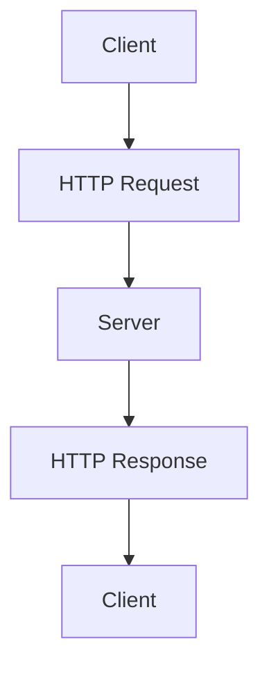

                 

关键词：RESTful API、Web服务、可扩展性、API设计、Web架构

> 摘要：本文旨在探讨RESTful API设计的原则和实践，帮助开发者构建出高效、可扩展的Web服务。通过深入分析REST架构风格的基本概念、设计原则以及常见的设计模式，本文将为读者提供一套系统的RESTful API设计方法论。

## 1. 背景介绍

在当今数字化时代，API（应用程序编程接口）已成为软件开发中不可或缺的一部分。Web服务作为一种通过互联网进行数据交换和功能调用的方式，已经在各个行业中得到广泛应用。而RESTful API，作为基于HTTP协议的一种架构风格，因其简洁性、可扩展性和易于实现的特点，成为开发分布式系统和服务的主要选择。

RESTful API设计的重要性在于，它不仅影响系统的性能和可维护性，还直接关系到用户体验和业务流程的效率。一个良好的API设计能够提高系统的互操作性，促进不同系统和模块之间的协同工作，从而实现资源的有效管理和利用。

本文将围绕RESTful API设计的核心概念、设计原则、常见模式、算法原理、数学模型、项目实践、实际应用场景等方面展开讨论，帮助读者深入理解RESTful API的设计理念和实践方法。

## 2. 核心概念与联系

### 2.1 REST架构风格

REST（Representational State Transfer）是一种设计风格，用于构建分布式超媒体系统。它由 Roy Fielding 在他的博士论文中提出，并迅速成为构建Web服务的标准架构风格。REST的核心概念包括以下几方面：

- **统一接口**：REST通过统一接口来简化系统的复杂性。这个接口包括一组标准化的操作，如GET、POST、PUT、DELETE等。
- **无状态性**：REST要求服务器不保留客户端的状态信息，每次请求都是独立的，这有助于提高系统的可伸缩性和可靠性。
- **客户端-服务器架构**：客户端负责用户交互，服务器负责数据存储和处理。这种分离有助于分工合作，提高开发效率和系统的扩展性。
- **分层系统**：REST通过多层系统结构来隐藏底层复杂性，各层之间通过标准协议进行通信。
- **可缓存性**：REST允许对请求和响应进行缓存，以提高系统的性能和响应速度。

### 2.2 HTTP协议

HTTP（HyperText Transfer Protocol）是Web服务中广泛使用的协议，它定义了客户端和服务器之间的通信规则。HTTP的核心特点包括：

- **无状态性**：每个HTTP请求都是独立的，不依赖于之前的请求或响应。
- **请求-响应模型**：客户端发送请求，服务器返回响应，每个请求都包含方法（如GET、POST等）、URL（统一资源定位符）和协议版本等信息。
- **状态码**：HTTP通过状态码（如200成功、404未找到等）来表示请求的结果。
- **内容类型**：HTTP通过内容类型（如application/json、text/plain等）来指示响应的内容格式。

### 2.3 Mermaid流程图

为了更好地理解RESTful API的设计，我们使用Mermaid流程图来展示核心概念和架构。以下是一个简单的Mermaid流程图示例：



在这个流程图中，客户端（Client）向服务器（Server）发送HTTP请求（HTTPRequest），服务器处理请求后返回HTTP响应（HTTPResponse），最终客户端接收到响应并处理。

## 3. 核心算法原理 & 具体操作步骤

### 3.1 算法原理概述

RESTful API的设计遵循一系列原则，包括资源导向、统一接口、无状态性、客户端-服务器架构和可缓存性。这些原则共同构成了RESTful API的核心算法原理。

- **资源导向**：资源是RESTful API的核心概念。每个资源都通过一个唯一的URL标识，并通过HTTP操作（GET、POST、PUT、DELETE等）进行操作。
- **统一接口**：REST通过统一接口简化系统的复杂性，HTTP提供了这种接口的实现方式。
- **无状态性**：服务器不保留客户端的状态信息，每次请求都是独立的，这有助于系统的扩展性和可靠性。
- **客户端-服务器架构**：客户端负责用户交互，服务器负责数据存储和处理，这种分离有助于分工合作，提高开发效率和系统的扩展性。
- **可缓存性**：通过合理地设计和使用缓存机制，可以提高系统的性能和响应速度。

### 3.2 算法步骤详解

RESTful API的设计步骤可以概括为以下几步：

1. **资源定义**：首先需要明确系统的资源，并为每个资源分配唯一的URL。
2. **HTTP操作映射**：将资源对应的操作映射到HTTP方法，如GET用于查询资源、POST用于创建资源、PUT用于更新资源、DELETE用于删除资源。
3. **接口设计**：设计RESTful API的接口，包括URL结构、HTTP方法、请求和响应的格式等。
4. **数据转换**：在服务器端，将请求和响应的数据进行格式转换，如将JSON转换为对象或数据库记录。
5. **状态管理**：实现无状态性，通过会话管理、令牌验证等方式管理客户端的状态。
6. **安全性**：确保API的安全性，采用HTTPS、认证、授权等机制保护数据和接口。
7. **性能优化**：通过缓存、负载均衡、压缩等方式优化API的性能。

### 3.3 算法优缺点

RESTful API的优点包括：

- **易于实现**：基于标准的HTTP协议，易于理解和实现。
- **可扩展性**：通过统一接口和无状态性，系统可以方便地扩展和升级。
- **互操作性**：RESTful API易于与其他系统和模块进行集成，提高系统的互操作性。
- **性能优化**：通过缓存和压缩等技术，可以显著提高系统的性能。

RESTful API的缺点包括：

- **安全性**：由于HTTP协议本身的不安全性，RESTful API需要采用额外的安全措施来保护数据。
- **性能限制**：HTTP请求和响应的通信开销较大，对高性能系统可能存在一定限制。
- **数据完整性**：由于HTTP请求和响应的不确定性，数据完整性需要通过其他机制（如事务处理、数据校验等）来保障。

### 3.4 算法应用领域

RESTful API在以下领域得到了广泛应用：

- **Web应用**：RESTful API是Web应用的主要通信方式，用于实现前后端分离、微服务架构等。
- **移动应用**：RESTful API常用于移动应用的数据接口，支持iOS和Android等平台。
- **物联网**：RESTful API在物联网系统中用于设备控制和数据采集。
- **云服务**：云服务提供商通过RESTful API提供各种服务和资源，如Amazon Web Services、Google Cloud等。

## 4. 数学模型和公式 & 详细讲解 & 举例说明

### 4.1 数学模型构建

在RESTful API设计中，可以使用一些数学模型来描述资源和操作的抽象关系。以下是一个简单的数学模型示例：

$$
R = \{r_1, r_2, ..., r_n\}
$$

其中，$R$ 表示资源集合，$r_i$ 表示第$i$个资源。

每个资源$r_i$可以定义为一组属性和操作：

$$
r_i = \{A_i, O_i\}
$$

其中，$A_i$ 表示资源$r_i$的属性集合，$O_i$ 表示资源$r_i$的操作集合。

### 4.2 公式推导过程

为了推导RESTful API中的资源关系，我们可以使用集合论和函数的概念。假设有两个资源集合$R_1$和$R_2$，它们之间的关系可以用以下公式表示：

$$
R_1 \cap R_2 = R_{\text{common}}
$$

表示$R_1$和$R_2$的交集，即两个集合中共同拥有的资源。

此外，我们可以使用函数的概念来描述资源之间的关联关系。假设资源$r_i$和$r_j$之间存在一种关联关系，可以用以下公式表示：

$$
r_i \rightarrow r_j
$$

表示资源$r_i$与资源$r_j$之间存在一种映射关系。

### 4.3 案例分析与讲解

以下是一个简单的RESTful API设计案例，用于描述用户和订单之间的关系。

**案例**：设计一个电商平台的RESTful API，包含用户（User）和订单（Order）两个资源。

- **资源定义**：

  $$ 
  R = \{r_{user}, r_{order}\} 
  $$

  - **用户（User）**：

    $$
    r_{user} = \{A_{user}, O_{user}\}
    $$

    其中，$A_{user} = \{id, name, email, password\}$，$O_{user} = \{register, login, update\}$。

  - **订单（Order）**：

    $$
    r_{order} = \{A_{order}, O_{order}\}
    $$

    其中，$A_{order} = \{id, user_id, total_price, status\}$，$O_{order} = \{create, update, delete\}$。

- **资源关系**：

  用户（User）与订单（Order）之间存在一种一对一的关联关系，可以用以下公式表示：

  $$
  r_{user} \rightarrow r_{order}
  $$

  具体来说，每个用户可以创建多个订单，但每个订单只能属于一个用户。

- **API接口设计**：

  - **用户接口**：

    $$
    \text{URL}: /users
    $$
    
    - **订单接口**：

      $$
      \text{URL}: /orders
      $$

    - **用户与订单的关联接口**：

      $$
      \text{URL}: /users/{user_id}/orders
      $$

    在这个接口中，可以通过用户ID（user\_id）查询用户的所有订单。

通过这个案例，我们可以看到RESTful API设计如何使用数学模型和公式来描述资源和操作之间的关系，从而实现系统的逻辑抽象和接口设计。

## 5. 项目实践：代码实例和详细解释说明

### 5.1 开发环境搭建

为了演示RESTful API的设计和实现，我们将使用Python语言和Flask框架来搭建一个简单的RESTful API开发环境。

**安装Python**：

首先，确保您的系统中已安装Python 3.7及以上版本。可以通过以下命令安装：

```bash
sudo apt-get install python3.7
```

**安装Flask**：

接着，安装Flask框架，可以使用pip命令：

```bash
pip3 install Flask
```

### 5.2 源代码详细实现

以下是一个简单的Flask应用，用于实现一个RESTful API，包含用户（User）和订单（Order）两个资源。

```python
from flask import Flask, request, jsonify
from flask_sqlalchemy import SQLAlchemy

app = Flask(__name__)
app.config['SQLALCHEMY_DATABASE_URI'] = 'sqlite:///app.db'
db = SQLAlchemy(app)

# 定义用户模型
class User(db.Model):
    id = db.Column(db.Integer, primary_key=True)
    name = db.Column(db.String(50))
    email = db.Column(db.String(120), unique=True)
    password = db.Column(db.String(120))

# 定义订单模型
class Order(db.Model):
    id = db.Column(db.Integer, primary_key=True)
    user_id = db.Column(db.Integer, db.ForeignKey('user.id'))
    total_price = db.Column(db.Float)
    status = db.Column(db.String(50))

# 用户接口
@app.route('/users', methods=['GET', 'POST'])
def users():
    if request.method == 'GET':
        users = User.query.all()
        return jsonify([user.serialize() for user in users])
    elif request.method == 'POST':
        user_data = request.get_json()
        new_user = User(name=user_data['name'], email=user_data['email'], password=user_data['password'])
        db.session.add(new_user)
        db.session.commit()
        return jsonify(new_user.serialize()), 201

# 订单接口
@app.route('/orders', methods=['GET', 'POST'])
def orders():
    if request.method == 'GET':
        orders = Order.query.all()
        return jsonify([order.serialize() for order in orders])
    elif request.method == 'POST':
        order_data = request.get_json()
        new_order = Order(user_id=order_data['user_id'], total_price=order_data['total_price'], status=order_data['status'])
        db.session.add(new_order)
        db.session.commit()
        return jsonify(new_order.serialize()), 201

# 用户与订单的关联接口
@app.route('/users/<int:user_id>/orders', methods=['GET'])
def user_orders(user_id):
    orders = Order.query.filter_by(user_id=user_id).all()
    return jsonify([order.serialize() for order in orders])

# 模型序列化函数
def serialize_user(user):
    return {
        'id': user.id,
        'name': user.name,
        'email': user.email
    }

def serialize_order(order):
    return {
        'id': order.id,
        'user_id': order.user_id,
        'total_price': order.total_price,
        'status': order.status
    }

if __name__ == '__main__':
    db.create_all()
    app.run(debug=True)
```

### 5.3 代码解读与分析

上述代码演示了一个简单的RESTful API，其中包含用户（User）和订单（Order）两个模型，以及相关的接口实现。

- **用户模型（User）**：定义了用户的基本属性，如ID、姓名、电子邮件和密码。
- **订单模型（Order）**：定义了订单的基本属性，如ID、用户ID、总价和状态。
- **用户接口（/users）**：提供用户列表查询和用户创建接口。
- **订单接口（/orders）**：提供订单列表查询和订单创建接口。
- **用户与订单的关联接口（/users/<user_id>/orders）**：提供根据用户ID查询用户订单的接口。
- **模型序列化函数**：将数据库模型转换为JSON格式，便于在API中传输。

### 5.4 运行结果展示

**启动应用**：

```bash
python app.py
```

**创建用户**：

```bash
curl -X POST -H "Content-Type: application/json" -d '{"name": "Alice", "email": "alice@example.com", "password": "password123"}' http://localhost:5000/users
```

响应结果：

```json
{
  "id": 1,
  "name": "Alice",
  "email": "alice@example.com"
}
```

**创建订单**：

```bash
curl -X POST -H "Content-Type: application/json" -d '{"user_id": 1, "total_price": 100.0, "status": "pending"}' http://localhost:5000/orders
```

响应结果：

```json
{
  "id": 1,
  "user_id": 1,
  "total_price": 100.0,
  "status": "pending"
}
```

**查询用户订单**：

```bash
curl -X GET http://localhost:5000/users/1/orders
```

响应结果：

```json
[
  {
    "id": 1,
    "user_id": 1,
    "total_price": 100.0,
    "status": "pending"
  }
]
```

通过这个简单的案例，我们可以看到如何使用Flask框架实现RESTful API，并通过HTTP请求和响应进行数据交换。这个案例展示了RESTful API设计的基本原理和实践方法，为开发者提供了一个实用的参考。

## 6. 实际应用场景

### 6.1 在Web应用中的应用

RESTful API在Web应用开发中得到了广泛应用。例如，在电商系统中，RESTful API用于处理商品查询、购物车管理、订单处理等业务逻辑。开发者可以通过定义不同的资源（如商品、订单、用户等）和对应的HTTP操作（GET、POST、PUT、DELETE等），实现前后端的数据交互。

### 6.2 在移动应用中的应用

随着移动应用的发展，RESTful API也成为了移动应用开发中的重要组成部分。移动应用通常需要从服务器获取数据或向服务器发送请求，RESTful API提供了简单、高效的接口实现方式。例如，在移动新闻应用中，可以通过RESTful API获取新闻列表、文章内容等数据，同时通过POST请求提交用户评论。

### 6.3 在物联网中的应用

在物联网（IoT）领域，RESTful API用于设备控制和数据采集。设备通过HTTP请求向服务器发送数据，服务器对数据进行分析和处理，并返回相应的响应。例如，智能家居系统中的智能灯泡可以通过HTTP POST请求向服务器发送亮度数据，服务器接收到数据后，根据用户设置调整灯泡的亮度。

### 6.4 在云计算中的应用

在云计算服务中，RESTful API用于提供各种服务和资源的管理。例如，Amazon Web Services（AWS）提供了丰富的RESTful API，用户可以通过这些API创建、删除、查询和管理AWS云资源，如虚拟机、存储桶、数据库等。这种设计方式使得开发者可以方便地集成和使用AWS云服务。

## 7. 工具和资源推荐

### 7.1 学习资源推荐

1. **《RESTful Web API设计》（Restful Web API Design Patterns and Best Practices）**：本书详细介绍了RESTful API的设计原则和最佳实践，适合初学者和有经验的开发者。
2. **Flask官方文档**：Flask是Python中最流行的Web框架之一，其官方文档提供了丰富的API设计和实现教程，是学习RESTful API的好资源。
3. **REST API设计指南**：GitHub上的一些开源项目，如“RESTful API Design”和“REST API Design Guide”，提供了详细的API设计指南和模板。

### 7.2 开发工具推荐

1. **Postman**：Postman是一款强大的API调试工具，支持HTTP请求的构建、测试和文档生成，是开发RESTful API的必备工具。
2. **Swagger**：Swagger是一个用于生成API文档的工具，可以自动生成Markdown、HTML和OpenAPI文档，方便开发者和管理者理解和使用API。
3. **Docker**：Docker是一种轻量级容器技术，可以帮助开发者快速搭建开发环境，隔离不同的API服务，提高开发和部署的效率。

### 7.3 相关论文推荐

1. **《REST: A Protocol for Building Web Services》**：这是Roy Fielding发表的原始论文，详细阐述了REST架构风格的基本概念和设计原则。
2. **《RESTful Web Services: Principles, Patterns, and Practices》**：这本书由Leonard Richardson和Sam Ruby合著，是关于RESTful Web服务的经典教材。
3. **《APIs: A Field Guide》**：这本书由Steve Sanderson和Jim Webber合著，介绍了API设计、实现和管理的方法和最佳实践。

## 8. 总结：未来发展趋势与挑战

### 8.1 研究成果总结

近年来，RESTful API设计在理论和实践中取得了显著成果。研究者提出了多种API设计模式和方法，如资源导向设计、状态管理策略、安全性增强等。同时，开发工具和框架的不断演进，如Flask、Django、Spring Boot等，也为开发者提供了更多便捷的实现方式。这些研究成果为RESTful API的设计和实现提供了有力的支持。

### 8.2 未来发展趋势

1. **API设计规范化**：随着API使用场景的多样化，API设计的规范化将成为重要趋势。标准化组织将制定更加详细和严格的API设计规范，提高API的可维护性和互操作性。
2. **自动化API生成**：自动化工具和框架将越来越多地应用于API生成，通过代码生成器、API设计器等工具，实现快速构建高质量的API。
3. **API安全性和性能优化**：随着API应用范围的扩大，API的安全性和性能优化将得到更多关注。开发者将采用更先进的安全技术和性能优化策略，确保API的稳定性和可靠性。
4. **跨平台集成**：RESTful API将在更多平台上得到应用，如物联网、移动应用和云计算等。开发者将需要面对不同平台的特性和需求，实现更加灵活和适应性的API设计。

### 8.3 面临的挑战

1. **安全性**：随着API的广泛使用，安全性问题日益突出。开发者需要应对各种安全威胁，如SQL注入、跨站脚本攻击等，确保API的安全性。
2. **性能优化**：随着数据量和访问量的增加，API的性能成为关键挑战。开发者需要采用高效的算法、缓存策略和负载均衡技术，提高API的响应速度和稳定性。
3. **API版本管理**：随着系统的迭代和升级，API版本管理成为一个难题。开发者需要制定合理的API版本管理策略，确保新旧版本的兼容性和互操作性。

### 8.4 研究展望

未来，RESTful API设计将继续在理论和方法层面进行深入研究。研究者将探讨更加灵活和适应性的设计模式，以应对不同应用场景的需求。同时，开发工具和框架的不断发展，将推动API设计的实践进程。开发者需要持续关注这些趋势和挑战，不断提高API设计水平和系统质量。

## 9. 附录：常见问题与解答

### 9.1 如何确保RESTful API的安全性？

确保RESTful API的安全性需要采取多种措施，包括：

- **使用HTTPS**：通过HTTPS加密通信，防止数据在传输过程中被窃取或篡改。
- **身份验证和授权**：使用OAuth 2.0、JWT（JSON Web Tokens）等机制进行身份验证和授权，确保只有授权用户可以访问API。
- **输入验证**：对用户输入进行严格验证，防止SQL注入、跨站脚本攻击等安全漏洞。
- **使用安全头部**：添加安全相关的HTTP头部，如`Content-Security-Policy`、`X-Content-Type-Options`等。

### 9.2 如何优化RESTful API的性能？

优化RESTful API的性能可以从以下几个方面入手：

- **缓存**：使用缓存技术减少数据库查询次数，提高响应速度。
- **负载均衡**：使用负载均衡器将请求分配到多个服务器，提高系统的处理能力。
- **数据库优化**：优化数据库查询，使用索引、分库分表等策略，提高查询性能。
- **压缩**：对HTTP请求和响应进行压缩，减少传输数据量，提高传输速度。

### 9.3 RESTful API和SOAP有哪些区别？

RESTful API和SOAP是两种不同的Web服务架构风格：

- **协议不同**：RESTful API基于HTTP协议，SOAP基于XML协议。
- **风格不同**：RESTful API采用资源导向、无状态性、统一接口等风格，SOAP采用面向服务的风格。
- **灵活性和扩展性**：RESTful API更加灵活和可扩展，SOAP具有更强的功能和严格的规范。
- **性能和可维护性**：RESTful API在性能和可维护性方面通常优于SOAP。

选择RESTful API或SOAP取决于具体的应用场景和需求。RESTful API适合简单的、轻量级的、易于扩展的应用，而SOAP适合复杂的、高安全性的、需要严格规范的应用。

### 9.4 如何进行API版本管理？

进行API版本管理的关键是确保新旧版本之间的兼容性和互操作性。以下是一些常见的API版本管理策略：

- **URL版本管理**：通过在URL中包含版本号，如`/api/v1/`，区分不同版本的API。
- **参数版本管理**：在请求参数中包含版本号，如`version=1`。
- **响应头版本管理**：在响应头部中包含版本号，如`X-API-Version: 1`。
- **文档和注释**：在API文档和代码注释中明确不同版本的差异和注意事项。
- **迁移策略**：制定详细的API迁移策略，确保新旧版本之间的平滑过渡。

通过上述策略，可以有效地管理API的版本，提高系统的可维护性和可扩展性。

