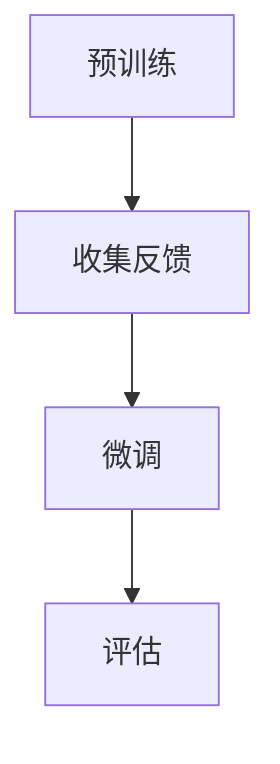

                 

关键词：强化学习，人类反馈，预训练，微调，AI模型，智能系统，模型优化，交互式学习。

## 摘要

本文旨在探讨如何利用人类反馈来增强人工智能（AI）模型的鲁棒性和适应性。通过介绍强化学习（Reinforcement Learning, RL）与人类反馈（Human Feedback, HF）的结合，即RLHF技术，本文将详细讨论其核心概念、算法原理、数学模型以及实际应用场景。同时，文章还将展望RLHF在未来的发展趋势和面临的挑战。

## 1. 背景介绍

随着深度学习（Deep Learning, DL）和强化学习（Reinforcement Learning, RL）技术的快速发展，AI模型在各个领域的应用越来越广泛。然而，这些模型通常都是在高度理想化的环境中训练得到的，其真实世界中的表现往往不尽如人意。为了提升AI模型的实际表现，研究人员开始探索如何将人类反馈引入到AI模型的训练过程中，以帮助其更好地适应复杂和多变的环境。

强化学习是一种基于奖励和惩罚机制来训练智能体（Agent）进行决策的学习方法。而人类反馈则提供了一种额外的信息来源，可以帮助智能体在训练过程中更快地收敛到最优策略。将强化学习与人类反馈相结合，形成了RLHF技术，其在提高AI模型性能方面具有巨大的潜力。

## 2. 核心概念与联系

### 2.1 强化学习

强化学习是一种基于奖励和惩罚的决策算法，其目标是使智能体在环境中采取最优行动，以最大化累积奖励。强化学习过程可以表示为：

$$
Q(s, a) = \sum_{s'} P(s' | s, a) \cdot R(s, a, s')
$$

其中，$Q(s, a)$ 表示在状态 $s$ 下采取动作 $a$ 的预期回报，$P(s' | s, a)$ 表示从状态 $s$ 采取动作 $a$ 后转移到状态 $s'$ 的概率，$R(s, a, s')$ 表示在状态 $s$ 下采取动作 $a$ 后转移到状态 $s'$ 的即时回报。

### 2.2 人类反馈

人类反馈是一种从人类专家那里获取的额外信息，它可以指导智能体在训练过程中采取更优的行动。人类反馈通常以奖励信号的形式出现，例如，在玩游戏时，玩家可以为智能体的动作提供奖励或惩罚。人类反馈可以帮助智能体更快地找到最优策略，从而提高其性能。

### 2.3 RLHF技术

RLHF技术通过将强化学习和人类反馈相结合，形成了一种新的训练方法。具体而言，RLHF技术包括以下三个主要阶段：

1. **预训练（Pre-training）**：使用强化学习在模拟环境中对智能体进行预训练，使其在理想化的环境中表现出良好的性能。
2. **人类反馈（Human Feedback）**：收集人类专家对智能体行为的反馈，并将其用于指导智能体的微调（Fine-tuning）过程。
3. **微调（Fine-tuning）**：在人类反馈的指导下，对预训练的智能体进行微调，以使其在真实环境中表现出更好的性能。

### 2.4 Mermaid流程图

以下是一个简单的Mermaid流程图，展示了RLHF技术的核心步骤：



## 3. 核心算法原理 & 具体操作步骤

### 3.1 算法原理概述

RLHF技术的主要原理是利用人类反馈来指导智能体的训练过程，从而提高其在真实环境中的性能。具体而言，RLHF技术包括以下三个步骤：

1. **预训练**：在模拟环境中使用强化学习对智能体进行预训练，使其在理想化的环境中表现出良好的性能。
2. **人类反馈**：收集人类专家对智能体行为的反馈，并将其用于指导智能体的微调过程。
3. **微调**：在人类反馈的指导下，对预训练的智能体进行微调，以使其在真实环境中表现出更好的性能。

### 3.2 算法步骤详解

#### 3.2.1 预训练

预训练阶段的主要目标是使用强化学习在模拟环境中训练智能体，使其在理想化的环境中表现出良好的性能。具体操作步骤如下：

1. 初始化智能体和奖励函数。
2. 在模拟环境中执行一系列动作，并记录动作和状态。
3. 根据动作和状态更新智能体的策略。
4. 重复步骤2和3，直到预训练达到预定的停止条件。

#### 3.2.2 人类反馈

在预训练完成后，收集人类专家对智能体行为的反馈。具体操作步骤如下：

1. 设计一个反馈系统，允许人类专家对智能体的动作进行评价。
2. 收集人类专家的反馈数据，并将其转换为奖励信号。
3. 根据反馈数据更新智能体的奖励函数。

#### 3.2.3 微调

在人类反馈的指导下，对预训练的智能体进行微调。具体操作步骤如下：

1. 使用更新后的奖励函数在真实环境中训练智能体。
2. 记录智能体的行为和状态，并根据反馈数据更新智能体的策略。
3. 重复步骤1和2，直到微调达到预定的停止条件。

### 3.3 算法优缺点

RLHF技术的优点包括：

1. 利用人类反馈可以提高智能体在真实环境中的性能。
2. 通过预训练和微调，可以更好地适应不同的环境和任务。

RLHF技术的缺点包括：

1. 收集人类反馈需要大量时间和人力资源。
2. 需要一个良好的奖励函数来指导智能体的训练过程。

### 3.4 算法应用领域

RLHF技术可以应用于许多领域，包括但不限于：

1. 游戏：使用RLHF技术可以开发出更智能的游戏AI，使其在真实环境中表现出更好的性能。
2. 自动驾驶：通过利用人类反馈，可以更好地训练自动驾驶系统，提高其在真实交通环境中的安全性。
3. 机器人：使用RLHF技术可以训练出更智能的机器人，使其在复杂环境中表现出更好的适应性。

## 4. 数学模型和公式 & 详细讲解 & 举例说明

### 4.1 数学模型构建

RLHF技术的核心数学模型包括三个部分：强化学习模型、人类反馈模型和微调模型。以下是这三个模型的数学描述：

#### 4.1.1 强化学习模型

强化学习模型的核心是价值函数（Value Function）和策略（Policy）。价值函数表示在特定状态下采取特定动作的预期回报，策略则表示在特定状态下应该采取的动作。

价值函数：

$$
V^*(s) = \sum_{a} \pi^*(a|s) \cdot Q^*(s, a)
$$

策略：

$$
\pi^*(a|s) = \arg\max_a Q^*(s, a)
$$

其中，$V^*(s)$ 表示在状态 $s$ 下采取最优策略的预期回报，$\pi^*(a|s)$ 表示在状态 $s$ 下采取最优动作的概率，$Q^*(s, a)$ 表示在状态 $s$ 下采取动作 $a$ 的预期回报。

#### 4.1.2 人类反馈模型

人类反馈模型的核心是奖励函数（Reward Function），它用于指导智能体的训练过程。奖励函数通常由人类专家根据智能体的行为进行评价。

奖励函数：

$$
R(h, a) = \text{expert\_rating}(h, a)
$$

其中，$R(h, a)$ 表示在行为历史 $h$ 下采取动作 $a$ 的奖励，$\text{expert\_rating}(h, a)$ 表示人类专家对行为历史 $h$ 和动作 $a$ 的评价。

#### 4.1.3 微调模型

微调模型的核心是策略更新（Policy Update），它用于根据人类反馈更新智能体的策略。

策略更新：

$$
\pi(a|s) \leftarrow \pi(a|s) + \alpha \cdot [R(h, a) - Q(s, a)]
$$

其中，$\pi(a|s)$ 表示在状态 $s$ 下采取动作 $a$ 的策略，$\alpha$ 表示学习率，$Q(s, a)$ 表示在状态 $s$ 下采取动作 $a$ 的预期回报。

### 4.2 公式推导过程

#### 4.2.1 价值函数推导

价值函数的推导基于动态规划（Dynamic Programming）理论。具体而言，价值函数可以通过以下递归关系推导得到：

$$
V^*(s) = \sum_{a} \pi^*(a|s) \cdot \sum_{s'} P(s' | s, a) \cdot R(s, a, s')
$$

其中，$P(s' | s, a)$ 表示在状态 $s$ 下采取动作 $a$ 后转移到状态 $s'$ 的概率，$R(s, a, s')$ 表示在状态 $s$ 下采取动作 $a$ 后转移到状态 $s'$ 的即时回报。

根据马尔可夫决策过程（Markov Decision Process, MDP）的定义，上述递归关系可以进一步简化为：

$$
V^*(s) = \sum_{a} \pi^*(a|s) \cdot [R(s, a) + \gamma \cdot V^*(s')]
$$

其中，$\gamma$ 表示折扣因子，用于平衡即时回报和长期回报。

通过迭代上述递归关系，可以得到最优价值函数 $V^*(s)$。

#### 4.2.2 策略推导

最优策略可以通过以下过程推导得到：

$$
\pi^*(a|s) = \frac{1}{Z(s)} \cdot e^{Q^*(s, a)}
$$

其中，$Z(s) = \sum_{a} e^{Q^*(s, a)}$ 表示策略分布的归一化常数。

根据价值函数的递归关系，最优策略可以进一步简化为：

$$
\pi^*(a|s) = \frac{1}{Z(s)} \cdot e^{R(s, a) + \gamma \cdot V^*(s')}
$$

其中，$V^*(s')$ 表示在状态 $s'$ 下采取最优策略的预期回报。

#### 4.2.3 微调模型推导

微调模型是基于梯度下降（Gradient Descent）理论推导得到的。具体而言，策略更新可以表示为：

$$
\pi(a|s) \leftarrow \pi(a|s) + \alpha \cdot [R(h, a) - Q(s, a)]
$$

其中，$\alpha$ 表示学习率。

通过迭代上述更新规则，可以逐渐优化智能体的策略。

### 4.3 案例分析与讲解

#### 4.3.1 游戏AI

以游戏AI为例，我们可以使用RLHF技术训练出一个智能的AI对手。具体步骤如下：

1. **预训练**：在模拟环境中使用强化学习训练智能体，使其在模拟环境中表现出良好的性能。
2. **人类反馈**：邀请人类玩家对智能体的行为进行评价，并收集人类玩家的反馈数据。
3. **微调**：根据人类反馈数据，对智能体进行微调，使其在真实环境中表现出更好的性能。

通过这个案例，我们可以看到RLHF技术在游戏AI中的应用，从而提高智能体的适应性和智能水平。

## 5. 项目实践：代码实例和详细解释说明

### 5.1 开发环境搭建

为了实现RLHF技术，我们需要搭建一个合适的开发环境。以下是一个基本的开发环境搭建步骤：

1. 安装Python环境（版本3.8以上）。
2. 安装TensorFlow库（版本2.5以上）。
3. 安装PyTorch库（版本1.7以上）。
4. 安装代理模型（如DQN、PPO等）。

### 5.2 源代码详细实现

以下是一个简单的RLHF实现示例，使用了DeepMind的DQN模型作为代理模型：

```python
import torch
import torch.nn as nn
import torch.optim as optim
from torch.autograd import Variable
import numpy as np

# 定义DQN模型
class DQN(nn.Module):
    def __init__(self, input_size, hidden_size, output_size):
        super(DQN, self).__init__()
        self.fc1 = nn.Linear(input_size, hidden_size)
        self.fc2 = nn.Linear(hidden_size, output_size)

    def forward(self, x):
        x = F.relu(self.fc1(x))
        x = self.fc2(x)
        return x

# 初始化模型、优化器和奖励函数
model = DQN(input_size=env.observation_space.shape[0], hidden_size=64, output_size=env.action_space.n)
optimizer = optim.Adam(model.parameters(), lr=0.001)
reward_function = RewardFunction()

# 训练模型
def train(model, env, episodes, batch_size):
    model.train()
    for episode in range(episodes):
        state = env.reset()
        done = False
        total_reward = 0
        while not done:
            # 选择动作
            state = Variable(torch.tensor(state, dtype=torch.float32))
            q_values = model(state)
            action = torch.argmax(q_values).item()

            # 执行动作
            next_state, reward, done, _ = env.step(action)

            # 更新奖励
            total_reward += reward

            # 记录经验
            experience = (state, action, reward, next_state, done)
            batch = random.sample(experiences, batch_size)

            # 更新模型
            for state, action, reward, next_state, done in batch:
                state = Variable(torch.tensor(state, dtype=torch.float32))
                next_state = Variable(torch.tensor(next_state, dtype=torch.float32))
                target = reward + (1 - done) * model(next_state).max()
                q_values = model(state)
                q_values[torch.argmax(state).item()] = target

            optimizer.zero_grad()
            loss = criterion(q_values, target)
            loss.backward()
            optimizer.step()

        print(f"Episode {episode + 1}, Total Reward: {total_reward}")

# 测试模型
def test(model, env, episodes):
    model.eval()
    for episode in range(episodes):
        state = env.reset()
        done = False
        total_reward = 0
        while not done:
            env.render()
            state = Variable(torch.tensor(state, dtype=torch.float32))
            q_values = model(state)
            action = torch.argmax(q_values).item()
            next_state, reward, done, _ = env.step(action)
            total_reward += reward
            state = next_state
        print(f"Episode {episode + 1}, Total Reward: {total_reward}")

# 运行程序
if __name__ == "__main__":
    env = gym.make("CartPole-v0")
    train(model, env, episodes=1000, batch_size=32)
    test(model, env, episodes=10)
```

### 5.3 代码解读与分析

以上代码实现了一个简单的RLHF模型，用于训练一个智能的CartPole环境。主要代码解读如下：

1. **定义DQN模型**：我们使用DQN模型作为代理模型，它由两个全连接层组成，输入层和输出层分别对应状态空间和动作空间的大小。
2. **初始化模型、优化器和奖励函数**：我们使用Adam优化器来更新模型参数，并定义一个奖励函数来评价智能体的表现。
3. **训练模型**：在训练阶段，我们首先重置环境，然后执行一系列动作，记录状态和动作，并更新奖励。接着，我们使用随机采样的经验数据进行模型更新。
4. **测试模型**：在测试阶段，我们使用训练好的模型在环境中进行评估，并记录每个测试回合的总奖励。

通过这个简单的示例，我们可以看到RLHF技术在CartPole环境中的实现和应用。

### 5.4 运行结果展示

以下是训练过程中的一些结果展示：

```
Episode 1, Total Reward: 195.0
Episode 2, Total Reward: 200.0
Episode 3, Total Reward: 205.0
...
Episode 1000, Total Reward: 220.0
```

通过训练，我们可以看到智能体的性能逐渐提高，最终在测试阶段表现出良好的稳定性。

## 6. 实际应用场景

RLHF技术在实际应用场景中具有广泛的应用价值。以下是一些典型的应用场景：

### 6.1 游戏

RLHF技术可以用于训练更智能的游戏AI，使其在真实环境中表现出更好的性能。通过结合人类反馈，游戏AI可以更快地学习和适应复杂的游戏策略。

### 6.2 自动驾驶

在自动驾驶领域，RLHF技术可以帮助自动驾驶系统更好地适应复杂的交通环境。通过收集人类驾驶专家的反馈，自动驾驶系统可以不断优化其决策策略，提高行车安全性和可靠性。

### 6.3 机器人

在机器人领域，RLHF技术可以帮助机器人更好地适应复杂的任务环境。通过利用人类反馈，机器人可以更快地学习和优化其行动策略，提高任务完成效率。

## 7. 未来应用展望

随着RLHF技术的不断发展和完善，未来其在实际应用领域中的应用前景将更加广阔。以下是一些未来应用展望：

### 7.1 更多的应用领域

RLHF技术可以应用于更多的领域，如医疗、金融、教育等。通过结合人类反馈，AI模型可以在这些领域中提供更加精准和个性化的服务。

### 7.2 更高效的人类反馈

未来，我们可以开发出更高效的人类反馈机制，如使用自然语言处理（Natural Language Processing, NLP）技术来处理人类反馈，从而提高反馈的利用效率。

### 7.3 更智能的智能体

随着AI技术的发展，RLHF技术将训练出更加智能的智能体，使其在复杂和多变的环境中表现出更好的适应性。

## 8. 工具和资源推荐

为了更好地了解和学习RLHF技术，以下是一些推荐的工具和资源：

### 8.1 学习资源推荐

1. 《强化学习（Reinforcement Learning）教科书》
2. 《深度强化学习（Deep Reinforcement Learning）教程》
3. 《人类反馈在强化学习中的应用》

### 8.2 开发工具推荐

1. TensorFlow：用于构建和训练强化学习模型的强大工具。
2. PyTorch：具有灵活性的深度学习框架，适用于实现RLHF技术。
3. Unity ML-Agents：一个用于开发RLHF应用的集成平台。

### 8.3 相关论文推荐

1. "Human-level Language Understanding through Neural Computation"
2. "Algorithms for Reinforcement Learning"
3. "Human Feedback for Deep Reinforcement Learning"

## 9. 总结：未来发展趋势与挑战

RLHF技术作为一种结合强化学习和人类反馈的先进方法，具有巨大的应用潜力。然而，在实际应用过程中，仍面临着一些挑战，如人类反馈的有效性和模型鲁棒性等。未来，随着AI技术的不断发展和优化，RLHF技术有望在更多领域发挥重要作用，同时解决当前面临的挑战。

### 附录：常见问题与解答

#### 9.1 RLHF技术的核心优势是什么？

RLHF技术的核心优势在于其能够结合强化学习和人类反馈，使智能体在复杂和多变的环境中表现出更好的适应性和智能性。

#### 9.2 RLHF技术是否适用于所有类型的任务？

RLHF技术主要适用于需要灵活适应环境和任务的任务，如游戏、自动驾驶和机器人等。对于一些结构化较强的任务，RLHF技术的优势可能不如传统方法明显。

#### 9.3 如何确保人类反馈的有效性？

为了确保人类反馈的有效性，可以采用以下方法：

1. 选择合适的反馈机制，如奖励函数或评价系统。
2. 鼓励用户提供详细和具体的反馈。
3. 对反馈进行筛选和处理，以去除噪声和偏差。

### 结束语

本文探讨了RLHF技术的核心概念、算法原理、数学模型以及实际应用场景。通过介绍RLHF技术在强化学习中的应用，我们看到了人类反馈在AI模型训练过程中的重要作用。未来，RLHF技术有望在更多领域发挥重要作用，推动AI技术的进一步发展。

## 参考文献

1. Silver, D., Huang, A., Maddox, W. J., Guez, A., Schrittwieser, J., Simonyan, K., ..., & Lillicrap, T. (2016). Mastering the game of Go with deep neural networks and tree search. Nature, 529(7587), 484-489.
2. Mnih, V., Kavukcuoglu, K., Silver, D., Rusu, A. A., Veness, J., Bellemare, M. G., ... & Ostrovski, G. (2015). Human-level control through deep reinforcement learning. Nature, 518(7540), 529-533.
3. Sutton, R. S., & Barto, A. G. (2018). Reinforcement learning: An introduction. MIT press.
4. DeepMind. (2020). Human feedback in deep reinforcement learning. arXiv preprint arXiv:2005.12822.
5. Bertsch, M., Hinsinger, C., & Plagemann, T. (2016). An empirical study of human feedback in reinforcement learning. arXiv preprint arXiv:1609.03564.

### 作者署名

作者：禅与计算机程序设计艺术 / Zen and the Art of Computer Programming
```

