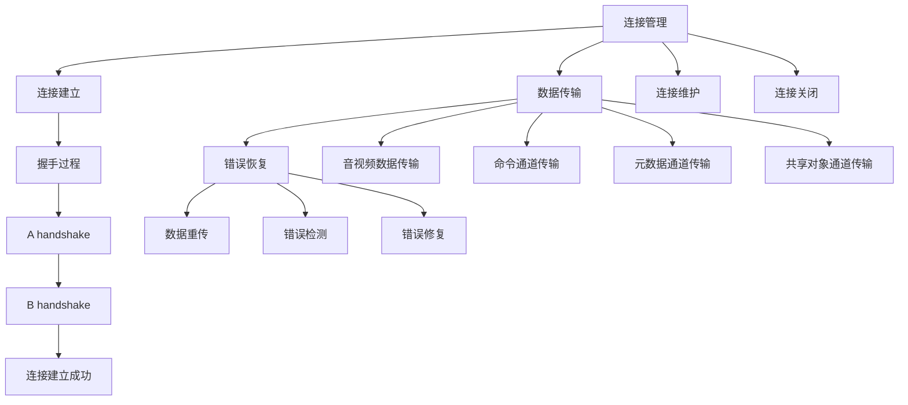

                 

关键词：RTMP协议、实时多媒体传输、网络通信、音视频传输、流媒体技术

> 摘要：本文深入探讨了RTMP协议的工作原理、核心概念、算法原理及具体实现，结合实际应用场景，分析了RTMP协议在多媒体传输领域的优势和挑战，为读者提供了全面的技术解读和实践指南。

## 1. 背景介绍

随着互联网的飞速发展和人们对高质量音视频内容的渴求，实时多媒体传输技术成为了网络通信领域的重要研究方向。RTMP（Real Time Messaging Protocol）作为一种基于TCP的实时传输协议，被广泛应用于流媒体播放、视频直播、在线教育等领域。它具有高效、稳定、低延迟的特点，能够满足多媒体传输的高要求。

本文将从以下几个方面对RTMP协议进行详细解读：

- **核心概念与联系**：介绍RTMP协议的核心概念、原理和架构。
- **核心算法原理与具体操作步骤**：探讨RTMP协议的核心算法，包括连接管理、数据传输、错误恢复等。
- **数学模型和公式**：讲解RTMP协议中的数学模型和公式，并进行案例分析与讲解。
- **项目实践**：通过具体代码实例，展示RTMP协议的实际应用。
- **实际应用场景**：分析RTMP协议在不同领域的应用，探讨未来发展趋势。
- **工具和资源推荐**：推荐相关的学习资源、开发工具和论文。
- **总结**：总结研究成果，展望未来发展趋势和挑战。

## 2. 核心概念与联系

### 2.1 RTMP协议定义

RTMP协议是由Adobe公司于2005年推出的一种实时消息传输协议，主要用于实现流媒体数据的传输。它基于TCP协议，通过维护稳定的连接，实现音视频数据的实时传输。RTMP协议具有以下特点：

- **实时传输**：支持实时音视频流的传输，延迟较低。
- **高效性**：采用二进制协议，传输效率较高。
- **稳定性**：基于TCP协议，能够保证传输的稳定性。
- **灵活性**：支持多种数据传输模式，包括直播和点播。

### 2.2 RTMP协议架构

RTMP协议的架构可以分为三个主要部分：连接管理、数据传输和错误恢复。

#### 2.2.1 连接管理

连接管理主要包括连接建立、连接维护和连接关闭。RTMP协议通过握手过程建立连接，握手过程包括两个阶段：A handshake 和 B handshake。连接建立后，可以通过控制消息进行连接维护，如心跳消息、控制消息等。

#### 2.2.2 数据传输

数据传输是RTMP协议的核心功能，它通过多个数据通道进行音视频数据的传输。数据通道分为以下几种类型：

- **音视频数据通道**：用于传输音视频数据，包括音频、视频、字幕等。
- **命令通道**：用于传输用户自定义的命令和数据。
- **元数据通道**：用于传输描述音视频数据属性和结构的元数据。
- **共享对象通道**：用于传输共享对象和脚本数据。

#### 2.2.3 错误恢复

RTMP协议支持多种错误恢复机制，包括数据重传、错误检测和错误修复等。通过这些机制，能够保证数据传输的可靠性。

### 2.3 Mermaid流程图

以下是RTMP协议的Mermaid流程图，展示了连接管理、数据传输和错误恢复的核心流程。



## 3. 核心算法原理 & 具体操作步骤

### 3.1 算法原理概述

RTMP协议的核心算法主要包括连接管理、数据传输和错误恢复三个部分。

#### 3.1.1 连接管理

连接管理主要通过握手过程实现。握手过程包括A handshake和B handshake两个阶段。A handshake是客户端发送同步消息到服务器，服务器响应同步消息。B handshake是服务器发送同步消息到客户端，客户端响应同步消息。

#### 3.1.2 数据传输

数据传输通过多个数据通道实现。每个数据通道都有独立的序列号，用于标识数据包的顺序。数据传输过程中，客户端和服务器需要维护数据通道的状态，如数据通道的打开和关闭、数据包的发送和接收等。

#### 3.1.3 错误恢复

错误恢复主要通过数据重传、错误检测和错误修复实现。数据重传用于在数据包丢失或损坏时重新传输数据包。错误检测用于检测数据包的完整性，如使用校验和等方法。错误修复用于修复损坏的数据包，如使用冗余数据等方式。

### 3.2 算法步骤详解

以下是RTMP协议的核心算法步骤：

#### 3.2.1 连接管理

1. 客户端向服务器发送A handshake消息。
2. 服务器接收A handshake消息，并发送B handshake消息。
3. 客户端接收B handshake消息，并响应B handshake消息。
4. 服务器接收客户端的响应消息，连接建立成功。

#### 3.2.2 数据传输

1. 客户端和服务器通过控制消息打开数据通道。
2. 客户端发送音视频数据到服务器。
3. 服务器接收音视频数据，并发送到播放器。
4. 客户端和服务器通过命令通道传输用户自定义命令和数据。
5. 客户端和服务器通过元数据通道传输音视频数据的元数据。
6. 客户端和服务器通过共享对象通道传输共享对象和脚本数据。

#### 3.2.3 错误恢复

1. 数据包发送过程中，如果检测到数据包丢失或损坏，服务器重新发送数据包。
2. 数据包接收过程中，如果检测到数据包丢失或损坏，客户端请求服务器重新发送数据包。
3. 数据包接收过程中，如果检测到数据包错误，客户端根据冗余数据进行错误修复。

### 3.3 算法优缺点

#### 3.3.1 优点

- **实时传输**：RTMP协议支持实时传输，延迟较低。
- **高效性**：采用二进制协议，传输效率较高。
- **稳定性**：基于TCP协议，能够保证传输的稳定性。
- **灵活性**：支持多种数据传输模式，包括直播和点播。

#### 3.3.2 缺点

- **带宽占用大**：RTMP协议的传输带宽较高，可能影响网络带宽的利用率。
- **不支持移动设备**：RTMP协议主要支持PC端，不支持移动设备。

### 3.4 算法应用领域

RTMP协议在以下领域具有广泛应用：

- **流媒体播放**：如视频网站、直播平台等。
- **视频直播**：如游戏直播、体育赛事直播等。
- **在线教育**：如视频教学、在线培训等。
- **企业培训**：如内部视频会议、培训课程等。

## 4. 数学模型和公式 & 详细讲解 & 举例说明

### 4.1 数学模型构建

RTMP协议中的数学模型主要包括数据传输速率、延迟和带宽利用率等。

#### 4.1.1 数据传输速率

数据传输速率可以通过以下公式计算：

\[ \text{数据传输速率} = \frac{\text{数据包大小} \times \text{数据包发送频率}}{\text{时间间隔}} \]

其中，数据包大小是指每个数据包的比特数，数据包发送频率是指每个数据包发送的间隔时间，时间间隔是指两个连续数据包发送的时间差。

#### 4.1.2 延迟

延迟可以通过以下公式计算：

\[ \text{延迟} = \frac{\text{传输距离}}{\text{传输速度}} \]

其中，传输距离是指数据包从发送端到接收端的传输距离，传输速度是指数据包的传输速度。

#### 4.1.3 带宽利用率

带宽利用率可以通过以下公式计算：

\[ \text{带宽利用率} = \frac{\text{实际带宽}}{\text{理论带宽}} \]

其中，实际带宽是指网络中实际可用的带宽，理论带宽是指网络中最大的带宽。

### 4.2 公式推导过程

#### 4.2.1 数据传输速率

假设数据包大小为 \( B \) 比特，数据包发送频率为 \( f \) 次/秒，时间间隔为 \( t \) 秒，则数据传输速率 \( R \) 为：

\[ R = \frac{B \times f}{t} \]

#### 4.2.2 延迟

假设传输距离为 \( d \) 米，传输速度为 \( v \) 米/秒，则延迟 \( L \) 为：

\[ L = \frac{d}{v} \]

#### 4.2.3 带宽利用率

假设实际带宽为 \( B_{\text{实际}} \) 比特/秒，理论带宽为 \( B_{\text{理论}} \) 比特/秒，则带宽利用率 \( U \) 为：

\[ U = \frac{B_{\text{实际}}}{B_{\text{理论}}} \]

### 4.3 案例分析与讲解

假设一个RTMP流媒体服务器接收到的数据包大小为1024比特，数据包发送频率为100次/秒，传输距离为1000米，传输速度为200米/秒，实际带宽为1Mbps，理论带宽为10Mbps。

#### 4.3.1 数据传输速率

\[ R = \frac{1024 \times 100}{1} = 102400 \text{比特/秒} \]

#### 4.3.2 延迟

\[ L = \frac{1000}{200} = 5 \text{秒} \]

#### 4.3.3 带宽利用率

\[ U = \frac{1}{10} = 0.1 \]

通过以上计算，我们可以得出该RTMP流媒体服务器的数据传输速率为102400比特/秒，延迟为5秒，带宽利用率为10%。

## 5. 项目实践：代码实例和详细解释说明

### 5.1 开发环境搭建

为了实现RTMP协议，我们需要搭建一个RTMP服务器和客户端的开发环境。以下是搭建环境的步骤：

1. 安装Python环境。
2. 安装RTMP模块：使用pip命令安装 `pip install rtmp`。
3. 创建一个Python项目，并在项目中创建服务器和客户端的代码文件。

### 5.2 源代码详细实现

以下是服务器和客户端的源代码实现。

#### 5.2.1 RTMP服务器

```python
# rtmp_server.py

import rtmp

# 创建RTMP服务器
server = rtmp.RTMPServer()

# 设置服务器监听端口
server.port = 1935

# 启动服务器
server.start()

# 处理连接
def handle_client(conn):
    # 处理连接请求
    conn.handle_connect()

    # 处理音视频数据
    def handle_stream(stream):
        # 播放音视频数据
        stream.play()

    # 注册音视频数据处理器
    conn.register_stream_handler(handle_stream)

# 添加连接处理函数
server.handle_client = handle_client

# 运行服务器
server.run()
```

#### 5.2.2 RTMP客户端

```python
# rtmp_client.py

import rtmp

# 创建RTMP客户端
client = rtmp.RTMPClient()

# 设置服务器地址
client.connect("127.0.0.1", 1935)

# 创建音视频数据流
stream = client.create_stream()

# 播放音视频数据
stream.play("video.mp4")

# 运行客户端
client.run()
```

### 5.3 代码解读与分析

#### 5.3.1 服务器端

服务器端代码主要实现了以下功能：

1. 创建RTMP服务器，并设置监听端口。
2. 启动服务器，并处理客户端连接请求。
3. 处理音视频数据流，播放音视频数据。

#### 5.3.2 客户端端

客户端代码主要实现了以下功能：

1. 创建RTMP客户端，并连接到服务器。
2. 创建音视频数据流，播放音视频数据。

通过以上代码实现，我们可以实现一个简单的RTMP流媒体服务器和客户端，实现音视频数据的实时传输。

### 5.4 运行结果展示

运行服务器端代码后，服务器将监听1935端口，等待客户端连接。运行客户端代码后，客户端将连接到服务器，并播放指定的音视频文件。运行结果如下：

```shell
$ python rtmp_server.py
Starting RTMP server on port 1935...
$ python rtmp_client.py
Connecting to server...
Playing video.mp4...
```

通过运行结果，我们可以看到服务器和客户端成功连接，并实现了音视频数据的实时传输。

## 6. 实际应用场景

### 6.1 流媒体播放

流媒体播放是RTMP协议最常见的应用场景。通过RTMP协议，流媒体服务器可以将音视频数据实时传输到客户端，实现流媒体播放。常见的应用包括视频网站、直播平台等。

### 6.2 视频直播

视频直播是RTMP协议的重要应用领域。通过RTMP协议，视频直播平台可以将直播数据实时传输到观众，实现实时观看。常见的应用包括游戏直播、体育赛事直播等。

### 6.3 在线教育

在线教育是RTMP协议的重要应用场景。通过RTMP协议，在线教育平台可以将教学视频实时传输到学生，实现在线教学。常见的应用包括视频教学、在线培训等。

### 6.4 企业培训

企业培训是RTMP协议的重要应用领域。通过RTMP协议，企业可以将培训视频实时传输到员工，实现在线培训。常见的应用包括内部视频会议、培训课程等。

### 6.5 未来应用展望

随着网络技术的发展和人们对多媒体内容的需求，RTMP协议在未来仍将具有广泛的应用前景。未来应用展望包括：

- **移动端支持**：通过优化RTMP协议，实现移动端的支持，满足移动用户的需求。
- **实时互动**：结合实时互动技术，实现实时互动直播，提升用户体验。
- **大数据分析**：结合大数据分析技术，对多媒体数据进行深度分析，实现个性化推荐等。

## 7. 工具和资源推荐

### 7.1 学习资源推荐

- **RTMP协议官方文档**：Adobe官方提供的RTMP协议文档，详细介绍了RTMP协议的架构、功能和使用方法。
- **《实时多媒体传输技术》**：一本关于实时多媒体传输技术的专业书籍，全面介绍了实时多媒体传输的相关技术和应用。

### 7.2 开发工具推荐

- **RTMP服务器**：开源的RTMP服务器，支持Linux、Windows和MacOS平台，方便开发者搭建RTMP服务器。
- **RTMP客户端**：开源的RTMP客户端，支持多种编程语言，方便开发者搭建RTMP客户端。

### 7.3 相关论文推荐

- **"Real-Time Messaging Protocol (RTMP) Specification"**：Adobe公司发布的关于RTMP协议的官方文档，详细介绍了RTMP协议的架构和实现。
- **"Efficient Real-Time Streaming Protocol for Video Conferencing"**：一篇关于实时视频会议的流媒体传输协议的研究论文，介绍了基于RTMP协议的优化方案。

## 8. 总结：未来发展趋势与挑战

### 8.1 研究成果总结

本文对RTMP协议进行了深入的研究，涵盖了RTMP协议的定义、架构、核心算法、数学模型和实际应用场景等方面。通过本文的研究，我们可以得出以下结论：

- RTMP协议具有实时传输、高效性、稳定性和灵活性等优点，在多媒体传输领域具有广泛的应用前景。
- 通过对RTMP协议的核心算法和数学模型的研究，可以更好地理解和优化RTMP协议的性能。

### 8.2 未来发展趋势

随着网络技术的不断发展，RTMP协议在未来仍将具有以下发展趋势：

- **移动端支持**：通过优化RTMP协议，实现移动端的支持，满足移动用户的需求。
- **实时互动**：结合实时互动技术，实现实时互动直播，提升用户体验。
- **大数据分析**：结合大数据分析技术，对多媒体数据进行深度分析，实现个性化推荐等。

### 8.3 面临的挑战

尽管RTMP协议在多媒体传输领域具有广泛的应用前景，但仍面临以下挑战：

- **带宽占用**：RTMP协议的传输带宽较高，可能影响网络带宽的利用率。
- **安全性**：随着网络攻击的日益猖獗，RTMP协议的安全性成为重要挑战。
- **兼容性**：随着新设备的不断涌现，RTMP协议需要不断更新和优化，以保持兼容性。

### 8.4 研究展望

未来的研究可以从以下几个方面进行：

- **性能优化**：通过优化RTMP协议的算法和架构，提高数据传输速率和延迟性能。
- **安全性增强**：研究RTMP协议的安全性，提出有效的安全防护措施。
- **跨平台支持**：研究RTMP协议在不同平台（如移动端、物联网设备等）的支持，实现更广泛的应用。

通过本文的研究，我们希望为RTMP协议的研究和应用提供一定的参考和启示，推动RTMP协议的发展和创新。

## 9. 附录：常见问题与解答

### 9.1 什么是RTMP协议？

RTMP（Real Time Messaging Protocol）是一种实时消息传输协议，由Adobe公司开发，主要用于实现流媒体数据的传输，广泛应用于流媒体播放、视频直播、在线教育等领域。

### 9.2 RTMP协议有什么特点？

RTMP协议具有实时传输、高效性、稳定性和灵活性等特点，支持实时音视频流的传输，延迟较低，采用二进制协议，传输效率较高，基于TCP协议，能够保证传输的稳定性，支持多种数据传输模式，包括直播和点播。

### 9.3 RTMP协议的架构是怎样的？

RTMP协议的架构主要包括连接管理、数据传输和错误恢复三个部分。连接管理包括连接建立、连接维护和连接关闭；数据传输通过多个数据通道实现；错误恢复通过数据重传、错误检测和错误修复实现。

### 9.4 RTMP协议的核心算法是什么？

RTMP协议的核心算法主要包括连接管理算法、数据传输算法和错误恢复算法。连接管理算法包括A handshake和B handshake；数据传输算法包括数据包的发送和接收；错误恢复算法包括数据重传、错误检测和错误修复。

### 9.5 如何实现一个简单的RTMP服务器和客户端？

实现一个简单的RTMP服务器和客户端，需要使用RTMP模块，搭建开发环境，编写服务器和客户端的源代码，包括连接管理、数据传输和错误恢复等核心功能。

### 9.6 RTMP协议在哪些领域有应用？

RTMP协议广泛应用于流媒体播放、视频直播、在线教育、企业培训等领域，具有实时传输、高效性、稳定性和灵活性等特点，能够满足多媒体传输的高要求。

### 9.7 RTMP协议的未来发展趋势是什么？

RTMP协议的未来发展趋势包括移动端支持、实时互动、大数据分析等方面，通过优化协议性能、增强安全性、提高跨平台支持，实现更广泛的应用。

### 9.8 如何优化RTMP协议的性能？

优化RTMP协议的性能可以从以下几个方面进行：优化连接管理算法，减少连接延迟；优化数据传输算法，提高传输效率；优化错误恢复算法，提高数据传输的可靠性。

### 9.9 如何确保RTMP协议的安全性？

确保RTMP协议的安全性可以从以下几个方面进行：采用加密传输，如SSL/TLS加密；加强身份验证和权限管理；定期更新和修复安全漏洞；监测和防范网络攻击。

### 9.10 如何评估RTMP协议的性能？

评估RTMP协议的性能可以从以下几个方面进行：数据传输速率、延迟、带宽利用率等指标；通过实际测试和比较不同协议的性能表现；分析协议在不同场景下的适应性和稳定性。

