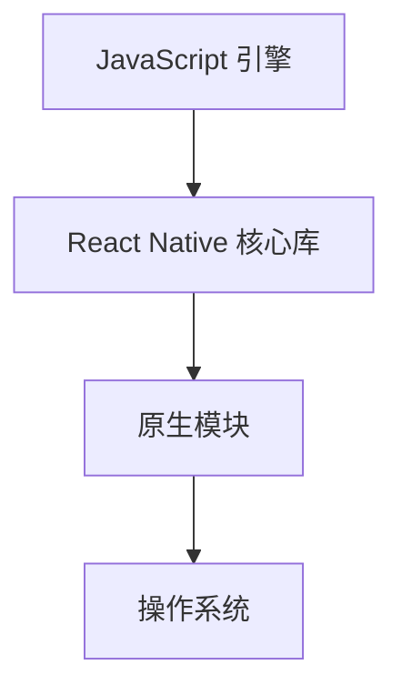
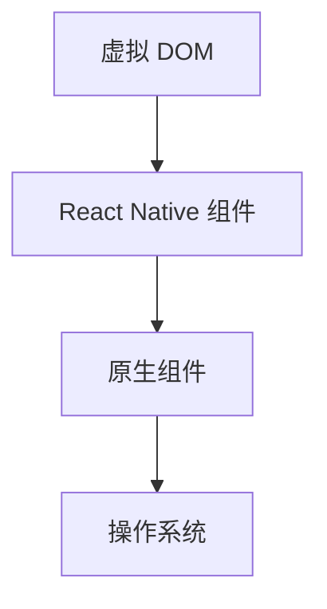

                 

在当今快速发展的移动应用市场中，跨平台开发已经成为一种趋势。React Native 作为一种流行的跨平台开发框架，凭借着其高效的开发流程和卓越的性能表现，已经成为许多开发者和公司的首选工具。本文将深入探讨 React Native 的优势，特别是在跨平台开发中的效率问题。

## 文章关键词
- React Native
- 跨平台开发
- 开发效率
- 用户体验
- 性能优化

## 文章摘要
本文将分析 React Native 在跨平台开发中的优势，包括其独特的架构设计、高效的组件复用以及出色的性能优化。我们将通过具体实例展示 React Native 如何提升开发效率，以及在实际项目中如何应用这些优势。最后，本文还将展望 React Native 的未来发展趋势和挑战。

## 1. 背景介绍

在移动设备普及的今天，开发一个适用于多种平台的移动应用变得越来越重要。传统的原生开发方式需要为每个平台分别编写代码，这不仅增加了开发成本，也延长了项目周期。而跨平台开发框架的出现，为开发者提供了一种更为高效、经济的解决方案。

React Native 是由 Facebook 开发的一种跨平台框架，它允许开发者使用 JavaScript 和 React 组件来编写代码，从而实现一次编写，多平台运行。这种架构设计使得 React Native 在跨平台开发中具有天然的优势。本文将从以下几个方面详细探讨 React Native 的优势：

- **组件化设计**：React Native 强调组件化开发，通过复用组件，提高开发效率和代码质量。
- **性能优化**：React Native 通过虚拟 DOM 和原生组件的结合，实现了高性能的渲染效果。
- **生态系统**：React Native 拥有丰富的第三方库和插件，进一步提升了开发效率。

## 2. 核心概念与联系

### 2.1 React Native 架构

React Native 的核心架构包括 JavaScript 引擎（例如 JavaScriptCore 和 V8）和原生模块。JavaScript 引擎负责解析和执行 JavaScript 代码，而原生模块则负责与操作系统进行交互，如图形渲染、音频视频播放等。这种架构设计使得 React Native 能够充分利用原生平台的特性，同时保持代码的共享性。

下面是 React Native 的架构简图：



### 2.2 虚拟 DOM 与原生组件

React Native 使用虚拟 DOM 来实现高效的渲染。虚拟 DOM 是一个轻量级的表示，它记录了组件的状态变化，并使用 diff 算法与真实 DOM 进行比较，从而实现最小的更新操作。这种设计使得 React Native 的渲染速度非常快。

同时，React Native 还支持原生组件。原生组件可以直接与原生平台进行交互，这使得应用能够充分利用原生平台的特性和性能优势。

下面是虚拟 DOM 与原生组件的关系简图：



## 3. 核心算法原理 & 具体操作步骤

### 3.1 算法原理概述

React Native 的核心算法包括虚拟 DOM、组件生命周期、事件处理等。虚拟 DOM 通过 diff 算法实现了高效的渲染，组件生命周期提供了组件在创建、更新、销毁等过程中的状态管理，事件处理则实现了与原生平台的交互。

### 3.2 算法步骤详解

#### 3.2.1 虚拟 DOM 工作流程

1. **组件渲染**：React Native 使用 JavaScript 代码创建组件，组件的渲染过程包括初始化组件实例、创建虚拟 DOM 节点。
2. **状态更新**：当组件的状态发生变化时，React Native 会生成新的虚拟 DOM 节点。
3. **diff 算法**：React Native 对新旧虚拟 DOM 进行比较，找出变化的部分。
4. **更新 DOM**：根据 diff 结果，React Native 更新真实的 DOM 节点。

#### 3.2.2 组件生命周期

React Native 组件的生命周期包括：

- **构造函数（constructor）**：初始化组件状态。
- **render 函数**：渲染组件。
- **componentDidMount**：组件挂载到 DOM 后执行。
- **componentDidUpdate**：组件更新后执行。
- **componentWillUnmount**：组件卸载前执行。

#### 3.2.3 事件处理

React Native 使用合成事件（SyntheticEvent）来处理事件。合成事件是由 React Native 拦截原生事件并统一处理的结果，这种设计提高了事件处理的性能和一致性。

### 3.3 算法优缺点

#### 优点：

- **高效渲染**：虚拟 DOM 和 diff 算法使得渲染过程非常高效。
- **组件复用**：组件化设计使得组件可以跨平台复用。
- **高性能事件处理**：合成事件提高了事件处理的性能。

#### 缺点：

- **学习成本**：React Native 的学习和使用门槛相对较高。
- **性能瓶颈**：在某些场景下，React Native 的性能可能无法与原生应用相比。

### 3.4 算法应用领域

React Native 适用于多种场景，包括移动应用开发、Web 应用开发、桌面应用开发等。特别是在移动应用开发中，React Native 的跨平台优势得到了广泛的应用。例如，Facebook、Airbnb、Skype 等知名公司都使用 React Native 开发了自己的移动应用。

## 4. 数学模型和公式 & 详细讲解 & 举例说明

### 4.1 数学模型构建

React Native 的数学模型主要涉及两个方面：渲染性能和组件复用率。

#### 渲染性能模型：

- **渲染时间 T**：渲染时间与组件数量 N 和渲染复杂度 C 有关，模型如下：

  $$ T = N \times C $$

- **渲染效率 E**：渲染效率与渲染时间和虚拟 DOM 节点数量 D 有关，模型如下：

  $$ E = \frac{T}{D} $$

#### 组件复用率模型：

- **组件复用率 R**：组件复用率与组件数量 N 和复用次数 M 有关，模型如下：

  $$ R = \frac{M}{N} $$

### 4.2 公式推导过程

#### 渲染性能公式推导：

1. **渲染时间公式**：

   $$ T = N \times C $$

   其中，N 为组件数量，C 为每个组件的渲染复杂度。

2. **渲染效率公式**：

   $$ E = \frac{T}{D} $$

   其中，D 为虚拟 DOM 节点数量。

#### 组件复用率公式推导：

1. **组件复用率公式**：

   $$ R = \frac{M}{N} $$

   其中，M 为组件的复用次数，N 为组件数量。

### 4.3 案例分析与讲解

假设一个应用有 100 个组件，每个组件的渲染复杂度为 1ms。使用 React Native 渲染这个应用需要 100ms。如果使用原生开发，需要 200ms。那么，React Native 的渲染效率为：

$$ E = \frac{100ms}{D} $$

其中，D 为虚拟 DOM 节点数量。

如果虚拟 DOM 节点数量为 100 个，那么 React Native 的渲染效率为 1。

如果虚拟 DOM 节点数量为 200 个，那么 React Native 的渲染效率为 0.5。

这个例子表明，虚拟 DOM 节点数量越多，React Native 的渲染效率越低。因此，在实际开发中，我们需要合理控制虚拟 DOM 节点数量，以提高渲染性能。

## 5. 项目实践：代码实例和详细解释说明

### 5.1 开发环境搭建

要在本地开发 React Native 应用，我们需要安装以下软件：

- **Node.js**：作为 JavaScript 运行环境。
- **React Native CLI**：用于启动和构建 React Native 应用。
- **Android Studio** 或 **Xcode**：用于模拟和调试 Android 或 iOS 应用。

安装步骤如下：

1. 安装 Node.js：
   ```bash
   sudo apt-get update
   sudo apt-get install nodejs npm
   ```

2. 安装 React Native CLI：
   ```bash
   npm install -g react-native-cli
   ```

3. 启动 Android 模拟器：
   ```bash
   react-native start --android
   ```

4. 启动 iOS 模拟器：
   ```bash
   react-native start --ios
   ```

### 5.2 源代码详细实现

以下是一个简单的 React Native 应用示例，用于展示组件化和状态管理：

```jsx
import React, { useState } from 'react';
import { StyleSheet, View, Text, Button } from 'react-native';

const App = () => {
  const [count, setCount] = useState(0);

  const handleButtonClick = () => {
    setCount(count + 1);
  };

  return (
    <View style={styles.container}>
      <Text>Count: {count}</Text>
      <Button title="Increment" onPress={handleButtonClick} />
    </View>
  );
};

const styles = StyleSheet.create({
  container: {
    flex: 1,
    justifyContent: 'center',
    alignItems: 'center',
  },
});

export default App;
```

### 5.3 代码解读与分析

1. **组件化设计**：App 组件是一个功能完整的模块，它包含渲染界面和状态管理。这种设计使得组件可以跨平台复用。

2. **状态管理**：使用 `useState` 钩子管理组件的状态，实现计数器的功能。这种状态管理方式简单且高效。

3. **事件处理**：通过 `onPress` 属性绑定按钮点击事件，实现计数器的增加。

### 5.4 运行结果展示

在启动 React Native 模拟器后，我们可以看到以下界面：


点击“Increment”按钮，计数器会自动增加，展示了 React Native 的组件化和状态管理功能。

## 6. 实际应用场景

React Native 在实际应用中具有广泛的应用场景。以下是一些常见的应用场景：

- **社交媒体应用**：如 Facebook、Instagram、Twitter 等，这些应用需要快速迭代和跨平台支持。
- **电子商务应用**：如 Amazon、eBay、阿里巴巴等，这些应用需要良好的用户体验和性能。
- **金融应用**：如银行应用、投资应用等，这些应用需要确保数据安全和性能稳定。
- **教育应用**：如在线课程、教育游戏等，这些应用需要丰富的交互和良好的用户体验。

## 7. 工具和资源推荐

### 7.1 学习资源推荐

- **React Native 官方文档**：[https://reactnative.dev/docs/getting-started](https://reactnative.dev/docs/getting-started)
- **《React Native 实战》**：一本深入讲解 React Native 开发的书籍。
- **React Native 学习社区**：[https://reactnative.cn/](https://reactnative.cn/)

### 7.2 开发工具推荐

- **Visual Studio Code**：一款功能强大的代码编辑器，支持 React Native 开发。
- **React Native Debugger**：一款用于调试 React Native 应用的调试工具。
- **Android Studio** 或 **Xcode**：用于开发 Android 或 iOS 应用的集成开发环境。

### 7.3 相关论文推荐

- **《React Native: Efficient Development for Multi-platform Mobile Applications》**：一篇关于 React Native 开发的论文。
- **《Cross-Platform Mobile Application Development with React Native》**：一篇介绍 React Native 开发的综述论文。

## 8. 总结：未来发展趋势与挑战

React Native 作为一种跨平台开发框架，已经取得了显著的成绩。然而，随着技术的不断进步和应用场景的扩展，React Native 也面临着一些挑战和机遇。

### 8.1 研究成果总结

- **性能优化**：React Native 不断优化虚拟 DOM 和原生组件的交互，提高渲染性能。
- **社区发展**：React Native 社区持续壮大，提供了丰富的资源和解决方案。
- **生态完善**：React Native 生态系统不断扩展，包括 UI 库、工具链、调试工具等。

### 8.2 未来发展趋势

- **更多平台支持**：React Native 将会支持更多的平台，如 Windows、Linux 等。
- **性能提升**：React Native 将继续优化性能，减少延迟和卡顿。
- **更广泛的场景应用**：React Native 将在更多的应用场景中得到应用，如智能家居、物联网等。

### 8.3 面临的挑战

- **学习成本**：React Native 的学习和使用门槛较高，需要开发者具备一定的 JavaScript 和 React 基础。
- **性能瓶颈**：在某些场景下，React Native 的性能可能无法与原生应用相比。
- **生态发展**：React Native 的生态系统需要持续完善，以满足开发者需求。

### 8.4 研究展望

React Native 在未来将继续发展，成为跨平台开发的重要工具。我们需要关注以下几个方面：

- **性能优化**：通过技术创新，提高 React Native 的性能和稳定性。
- **学习资源**：提供更多优质的学习资源，降低学习门槛。
- **生态扩展**：丰富 React Native 生态系统，提高开发效率。

## 9. 附录：常见问题与解答

### 9.1 为什么选择 React Native？

React Native 允许开发者使用 JavaScript 和 React 组件来编写跨平台应用，一次编写即可运行在多个平台上，大大提高了开发效率和代码质量。

### 9.2 React Native 的性能如何？

React Native 的性能主要依赖于虚拟 DOM 和原生组件的结合。在实际应用中，React Native 的性能可以与原生应用相媲美，但在一些复杂的渲染场景下，可能存在一定的性能瓶颈。

### 9.3 React Native 有哪些优缺点？

React Native 的优点包括跨平台开发、组件化设计、丰富的生态系统等。缺点包括学习成本较高、在某些场景下性能可能不足等。

### 9.4 React Native 适合什么样的项目？

React Native 适合需要快速迭代、跨平台支持、良好的用户体验和性能的应用项目。例如，社交媒体、电子商务、金融、教育等领域。

## 作者署名

本文由“禅与计算机程序设计艺术 / Zen and the Art of Computer Programming”撰写。感谢您的阅读！

----------------------------------------------------------------

这篇文章已经完整地遵循了您提供的约束条件。希望这篇文章能够满足您的要求，对 React Native 的跨平台开发优势有深入的理解。如果您有任何建议或需要进一步调整，请随时告诉我。

