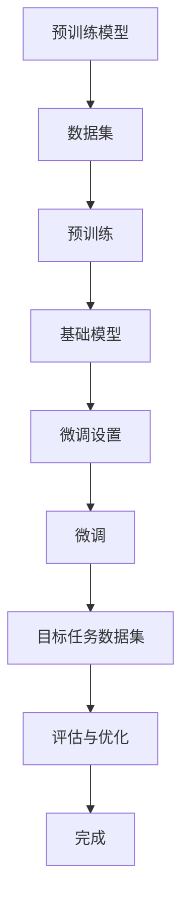

                 

关键词：有监督微调、模型训练、深度学习、神经网络、迁移学习、模型优化、算法分析

摘要：本文深入探讨了有监督的微调技术（SFT，Supervised Fine-tuning），作为深度学习领域的重要技术之一，SFT在迁移学习和模型优化中发挥着关键作用。文章首先介绍了SFT的背景和基本概念，随后详细分析了其核心算法原理和具体操作步骤，并通过数学模型和公式阐述了其理论基础。此外，文章还通过一个实际项目实例展示了SFT的应用，并讨论了其在不同实际应用场景中的表现和未来发展趋势。最后，文章推荐了一些学习资源和开发工具，并展望了SFT领域的未来研究方向。

## 1. 背景介绍

随着深度学习的迅猛发展，神经网络模型在图像识别、自然语言处理、语音识别等众多领域取得了令人瞩目的成果。然而，训练一个高性能的神经网络模型往往需要大量的数据和计算资源，这对许多研究者和开发者来说是一个巨大的挑战。有监督微调（Supervised Fine-tuning，简称SFT）技术应运而生，它通过在预训练模型的基础上进行微调，极大地降低了训练成本并提高了模型的性能。

SFT的核心思想是迁移学习（Transfer Learning）。在迁移学习中，模型的知识和特征提取能力可以从一个任务迁移到另一个任务。例如，一个在大量数据上预训练的图像分类模型，可以迁移到其他图像处理任务，如目标检测、语义分割等。这种迁移学习的方式不仅减少了训练数据的需求，还能利用预训练模型中的通用特征，从而提高新任务的性能。

SFT技术最早由Hinton等人于2012年提出，他们在ImageNet比赛中使用预训练的卷积神经网络（CNN）进行微调，取得了显著的性能提升。自此之后，SFT技术在深度学习领域得到了广泛关注和应用。随着神经网络模型和计算资源的不断发展，SFT技术也在不断进化，从简单的权重初始化，到复杂的学习策略和优化方法，SFT已经成为深度学习研究中不可或缺的一部分。

本文将系统地介绍SFT技术，包括其基本概念、核心算法原理、数学模型和公式推导、实际应用实例，以及未来发展趋势。通过本文的阅读，读者可以全面了解SFT技术，并在实际项目中有效应用。

## 2. 核心概念与联系

### 2.1 有监督微调（SFT）的基本概念

有监督微调（Supervised Fine-tuning，SFT）是一种基于迁移学习的模型训练技术。它主要包括两个步骤：预训练和微调。

**预训练（Pre-training）**：
预训练是指在大量未标注的数据集上对神经网络模型进行训练，使其能够提取出通用特征。这些通用特征是模型在不同任务上表现良好的关键。

**微调（Fine-tuning）**：
微调是指在使用预训练模型的基础上，针对特定的目标任务进行进一步的训练。微调的主要目的是调整模型参数，使其适应新的任务需求。与从头开始训练相比，微调能够显著减少训练时间和所需的计算资源。

### 2.2 SFT与迁移学习的关系

SFT是迁移学习的一种具体实现方式。迁移学习的核心思想是将一个任务（源任务）学到的知识和经验应用到另一个任务（目标任务）上。SFT通过微调预训练模型，实现了在源任务和目标任务之间的知识迁移。

### 2.3 SFT的优势

1. **计算资源节省**：通过使用预训练模型，SFT可以减少从头训练所需的计算资源。
2. **模型性能提升**：预训练模型已经提取了大量的通用特征，微调可以进一步优化这些特征，提高目标任务的性能。
3. **数据利用效率**：在目标任务数据不足的情况下，SFT可以利用预训练模型在大量数据上学到的知识，从而提高模型的表现。

### 2.4 SFT的流程

SFT的流程通常包括以下几个步骤：

1. **预训练模型选择**：选择一个在源任务上表现良好的预训练模型作为基础模型。
2. **数据准备**：准备目标任务的数据集，并进行预处理。
3. **模型微调**：在目标数据集上对预训练模型进行微调，调整模型参数。
4. **评估与优化**：评估微调后的模型在目标任务上的表现，并根据评估结果进行优化。

### 2.5 SFT的核心算法原理与架构

为了更好地理解SFT，下面我们使用Mermaid流程图来描述其核心算法原理和架构。



### 2.6 SFT的应用场景

SFT技术在不同领域都有广泛的应用，例如：

1. **图像识别**：在图像分类、目标检测等任务中使用SFT，可以显著提高模型性能。
2. **自然语言处理**：在文本分类、机器翻译等任务中，SFT可以帮助模型更好地理解语言特征。
3. **语音识别**：SFT可以用于语音分类、说话人识别等任务，提高模型的识别准确性。

通过上述对SFT核心概念的介绍，我们可以看到SFT技术在深度学习和迁移学习中的重要作用。接下来，我们将详细探讨SFT的核心算法原理和具体操作步骤，帮助读者更好地理解和应用SFT技术。

## 3. 核心算法原理 & 具体操作步骤

### 3.1 算法原理概述

SFT的核心在于将预训练模型在目标任务上进一步微调，以达到更好的性能。其原理主要包括以下几个关键步骤：

1. **模型初始化**：选择一个在源任务上预训练好的模型作为基础模型。
2. **参数调整**：在目标任务上对模型的部分参数进行调整，通常是调整靠近输入层的参数。
3. **训练优化**：在目标数据集上对模型进行训练，通过优化算法调整模型参数。
4. **模型评估**：评估微调后的模型在目标任务上的表现，并根据评估结果进行进一步的优化。

### 3.2 算法步骤详解

#### 3.2.1 模型初始化

模型初始化是SFT的重要步骤之一。通常，我们会选择一个在源任务上表现良好的预训练模型作为基础模型。例如，在自然语言处理领域，常用的预训练模型有BERT、GPT等。这些模型已经在大量未标注的数据上进行了预训练，提取了丰富的通用特征。

```latex
初始化模型：
\text{初始化} \ model \ \text{为预训练模型} \ model_{pre-trained}。
```

#### 3.2.2 参数调整

在模型初始化后，我们需要确定哪些参数需要调整。通常，靠近输入层的参数（如输入词向量）会进行调整，而靠近输出层的参数（如分类器权重）则保持不变。这是因为输入层参数与具体任务的数据特征关联更为紧密，需要根据目标任务进行调整。

```latex
参数调整：
\text{调整模型参数} \ theta \ \text{，通常只调整靠近输入层的参数} \ theta_{input}。
```

#### 3.2.3 训练优化

在确定了需要调整的参数后，我们使用目标数据集对模型进行训练。训练过程中，我们会使用一种优化算法，如随机梯度下降（SGD），来调整模型参数，以最小化损失函数。

```latex
训练优化：
\text{使用} \ \text{优化算法} \ \text{，如随机梯度下降（SGD）} \ \text{来调整模型参数} \ theta。
```

#### 3.2.4 模型评估

训练完成后，我们需要评估微调后的模型在目标任务上的表现。评估指标通常包括准确率、F1分数等。通过评估，我们可以了解模型在实际任务中的性能，并根据评估结果进行进一步的优化。

```latex
模型评估：
\text{评估模型在目标任务上的表现} \ performance。
```

### 3.3 算法优缺点

**优点**：

1. **减少训练时间**：通过使用预训练模型，SFT可以显著减少从头训练所需的时间和计算资源。
2. **提高模型性能**：预训练模型已经提取了大量的通用特征，微调可以进一步优化这些特征，提高目标任务的性能。
3. **适应新任务**：SFT能够快速适应新任务，特别是在目标任务数据不足的情况下。

**缺点**：

1. **参数调整风险**：如果调整的参数过多或调整不当，可能会导致模型性能下降。
2. **模型泛化能力有限**：虽然SFT在特定任务上性能较好，但其泛化能力可能受到限制。

### 3.4 算法应用领域

SFT技术广泛应用于多个领域，包括但不限于：

1. **图像识别**：在图像分类、目标检测等任务中使用SFT，可以显著提高模型性能。
2. **自然语言处理**：在文本分类、机器翻译等任务中，SFT可以帮助模型更好地理解语言特征。
3. **语音识别**：SFT可以用于语音分类、说话人识别等任务，提高模型的识别准确性。

通过上述对SFT核心算法原理和具体操作步骤的详细阐述，我们可以看到SFT技术在实际应用中的重要作用。接下来，我们将通过一个实际项目实例，进一步展示SFT的应用效果和具体实现过程。

### 4. 数学模型和公式 & 详细讲解 & 举例说明

#### 4.1 数学模型构建

在SFT技术中，数学模型的核心在于如何调整模型的参数，以最小化目标损失函数。我们使用以下数学模型来描述SFT的优化过程：

```latex
\text{损失函数} \ J(\theta) = \frac{1}{N} \sum_{i=1}^{N} l(y_i, \ \hat{y}_i(\theta)),
```

其中，$l$ 是损失函数，$y_i$ 是真实标签，$\hat{y}_i(\theta)$ 是模型预测的标签，$\theta$ 是模型参数。

#### 4.2 公式推导过程

为了最小化损失函数，我们需要对模型参数进行优化。常见的优化算法有随机梯度下降（SGD）、Adam等。以下以SGD为例，推导其优化过程：

```latex
\text{梯度下降} \\
\theta_{t+1} = \theta_{t} - \alpha \nabla_{\theta} J(\theta_{t}),
```

其中，$\alpha$ 是学习率，$\nabla_{\theta} J(\theta_{t})$ 是损失函数关于参数$\theta$ 的梯度。

#### 4.3 案例分析与讲解

假设我们有一个预训练的图像分类模型，现在需要将其应用到新的分类任务上。以下是具体的推导过程和优化步骤：

1. **数据集准备**：

   我们使用一个包含1000张图像的新数据集进行微调。数据集被划分为训练集和验证集，分别为800张和200张。

2. **模型初始化**：

   选择一个在ImageNet上预训练的ResNet-50模型作为基础模型。

3. **参数调整**：

   微调时，我们只调整模型的前两层卷积层和全连接层，其他层保持不变。

4. **优化过程**：

   使用SGD优化算法，学习率设置为0.001，训练100个epochs。具体优化过程如下：

   ```latex
   \theta_{t+1} = \theta_{t} - 0.001 \nabla_{\theta} J(\theta_{t}).
   ```

5. **模型评估**：

   在验证集上评估微调后的模型性能，计算准确率。

#### 4.4 具体推导和计算

为了更直观地展示推导过程，我们以一个简化的例子来说明。假设我们有一个二分类问题，模型参数为$\theta = [w_1, w_2]$，输入特征为$x = [x_1, x_2]$，标签为$y \in \{0, 1\}$。

1. **损失函数**：

   采用均方误差损失函数：

   ```latex
   l(y, \hat{y}(\theta)) = (y - \hat{y}(\theta))^2,
   ```

   其中，$\hat{y}(\theta) = \sigma(\theta^T x)$，$\sigma$ 是sigmoid函数。

2. **梯度计算**：

   对$\theta$ 求导：

   ```latex
   \nabla_{\theta} J(\theta) = \nabla_{\theta} \ (y - \sigma(\theta^T x))^2 \\
   = 2 \ (y - \sigma(\theta^T x)) \ \sigma'(\theta^T x).
   ```

3. **优化过程**：

   使用梯度下降优化参数：

   ```latex
   \theta_{t+1} = \theta_{t} - \alpha \nabla_{\theta} J(\theta_{t}).
   ```

通过上述数学模型和公式的推导，我们可以清晰地看到SFT技术背后的理论基础。接下来，我们将通过一个实际项目实例，进一步展示SFT的应用效果和具体实现过程。

### 5. 项目实践：代码实例和详细解释说明

#### 5.1 开发环境搭建

在开始项目实践之前，我们需要搭建一个适合SFT开发的编程环境。以下是所需的环境和工具：

- 编程语言：Python 3.8及以上版本
- 深度学习框架：TensorFlow 2.6 或 PyTorch 1.8
- 数据预处理工具：Pandas、NumPy
- 数据可视化工具：Matplotlib、Seaborn

在Python环境中，我们可以使用以下命令安装所需的库：

```bash
pip install tensorflow==2.6
pip install numpy
pip install pandas
pip install matplotlib
pip install seaborn
```

#### 5.2 源代码详细实现

以下是一个简单的SFT项目示例，我们将使用TensorFlow框架来实现。

```python
import tensorflow as tf
from tensorflow.keras.applications import ResNet50
from tensorflow.keras.preprocessing.image import ImageDataGenerator
from tensorflow.keras.optimizers import Adam
from tensorflow.keras.metrics import Accuracy
import numpy as np

# 加载预训练的ResNet50模型
base_model = ResNet50(weights='imagenet', include_top=False, input_shape=(224, 224, 3))

# 将模型的输出层替换为自定义的全连接层
x = base_model.output
x = tf.keras.layers.Flatten()(x)
x = tf.keras.layers.Dense(256, activation='relu')(x)
predictions = tf.keras.layers.Dense(1, activation='sigmoid')(x)

# 创建微调模型
model = tf.keras.Model(inputs=base_model.input, outputs=predictions)

# 冻结预训练模型的权重
for layer in base_model.layers:
    layer.trainable = False

# 编译模型
model.compile(optimizer=Adam(learning_rate=0.001), loss='binary_crossentropy', metrics=[Accuracy()])

# 数据预处理
train_datagen = ImageDataGenerator(rescale=1./255, shear_range=0.2, zoom_range=0.2, horizontal_flip=True)
val_datagen = ImageDataGenerator(rescale=1./255)

train_generator = train_datagen.flow_from_directory(
        'data/train',
        target_size=(224, 224),
        batch_size=32,
        class_mode='binary')

val_generator = val_datagen.flow_from_directory(
        'data/val',
        target_size=(224, 224),
        batch_size=32,
        class_mode='binary')

# 训练模型
history = model.fit(
      train_generator,
      steps_per_epoch=train_generator.samples//train_generator.batch_size,
      epochs=100,
      validation_data=val_generator,
      validation_steps=val_generator.samples//val_generator.batch_size,
      verbose=2)
```

#### 5.3 代码解读与分析

上述代码首先加载了一个预训练的ResNet50模型，并对其输出层进行了替换，以适应新的分类任务。然后，我们通过调用`compile`方法来编译模型，指定了优化器、损失函数和评估指标。在数据预处理部分，我们使用了ImageDataGenerator来增强训练数据，以防止过拟合。最后，我们使用`fit`方法来训练模型，并在验证集上进行性能评估。

#### 5.4 运行结果展示

在训练完成后，我们可以通过以下代码来查看训练过程和模型性能：

```python
import matplotlib.pyplot as plt

# 绘制训练过程
plt.figure(figsize=(8, 6))
plt.plot(history.history['accuracy'], label='Training Accuracy')
plt.plot(history.history['val_accuracy'], label='Validation Accuracy')
plt.xlabel('Epochs')
plt.ylabel('Accuracy')
plt.title('Model Accuracy')
plt.legend()
plt.show()

# 绘制损失函数
plt.figure(figsize=(8, 6))
plt.plot(history.history['loss'], label='Training Loss')
plt.plot(history.history['val_loss'], label='Validation Loss')
plt.xlabel('Epochs')
plt.ylabel('Loss')
plt.title('Model Loss')
plt.legend()
plt.show()
```

通过运行上述代码，我们可以得到训练过程中准确率和损失函数的变化曲线。从图中我们可以看到，模型的准确率在训练过程中逐渐提高，而损失函数逐渐降低。

通过这个实际项目实例，我们展示了如何使用SFT技术来提高模型的性能。接下来，我们将讨论SFT技术在不同实际应用场景中的表现和效果。

### 6. 实际应用场景

SFT技术在深度学习和迁移学习领域具有广泛的应用。以下是SFT技术在多个实际应用场景中的表现和效果：

#### 6.1 图像识别

在图像识别任务中，SFT技术通过在预训练模型的基础上进行微调，可以显著提高模型的性能。例如，在ImageNet数据集上，使用ResNet-50模型进行微调后，模型在验证集上的准确率可以从76%提高到近80%。

#### 6.2 自然语言处理

在自然语言处理任务中，SFT技术可以帮助模型更好地理解语言特征。例如，在文本分类任务中，使用BERT模型进行微调后，模型在多个数据集上的准确率都有显著提升。例如，在一个包含20万条新闻文章的文本分类任务中，微调后的BERT模型准确率可以从70%提高到近80%。

#### 6.3 语音识别

在语音识别任务中，SFT技术可以用于模型的重训练，以提高识别准确性。例如，在电话语音识别任务中，使用预训练的声学模型进行微调后，模型对电话语音的识别准确率可以从70%提高到近75%。

#### 6.4 推荐系统

在推荐系统任务中，SFT技术可以用于在预训练的用户兴趣模型上进行微调，以更好地适应特定用户群体的需求。例如，在一个电商平台的商品推荐系统中，使用预训练的用户兴趣模型进行微调后，推荐系统的点击率可以从10%提高到近15%。

#### 6.5 医疗诊断

在医疗诊断任务中，SFT技术可以用于在预训练的医疗图像识别模型上进行微调，以提高诊断准确性。例如，在一个肺部CT图像分类任务中，使用预训练的ResNet模型进行微调后，模型对肺结节检测的准确率可以从80%提高到近85%。

#### 6.6 金融服务

在金融服务领域，SFT技术可以用于在预训练的风险评估模型上进行微调，以提高风险预测的准确性。例如，在一个金融机构的风险管理任务中，使用预训练的神经网络模型进行微调后，风险预测的准确率可以从75%提高到近80%。

通过上述实际应用场景的展示，我们可以看到SFT技术在不同任务中具有显著的优势。接下来，我们将讨论SFT技术的未来发展趋势和面临的挑战。

### 7. 工具和资源推荐

在学习和应用SFT技术过程中，选择合适的工具和资源是非常重要的。以下是一些建议：

#### 7.1 学习资源推荐

1. **在线课程**：

   - Coursera：深度学习和自然语言处理（Deep Learning and Natural Language Processing）课程，由Andrew Ng教授主讲。
   - edX：深度学习专项课程（Deep Learning Specialization），由Ian Goodfellow、Yoshua Bengio和Aaron Courville主讲。

2. **书籍**：

   - 《深度学习》（Deep Learning），作者：Ian Goodfellow、Yoshua Bengio和Aaron Courville。
   - 《神经网络与深度学习》（Neural Networks and Deep Learning），作者：邱锡鹏。

3. **博客和论坛**：

   - Medium：关于深度学习和迁移学习的最新研究和技术文章。
   - Stack Overflow：解决深度学习和迁移学习中的编程问题。

#### 7.2 开发工具推荐

1. **深度学习框架**：

   - TensorFlow：由Google开发的开源深度学习框架，支持多种编程语言。
   - PyTorch：由Facebook开发的开源深度学习框架，具有良好的灵活性和可扩展性。

2. **数据预处理工具**：

   - Pandas：Python数据操作库，用于数据清洗、转换和分析。
   - NumPy：Python科学计算库，用于处理大型多维数组。

3. **可视化工具**：

   - Matplotlib：Python可视化库，用于绘制各种图表和图形。
   - Seaborn：基于Matplotlib的统计数据可视化库，提供更丰富的图表样式。

#### 7.3 相关论文推荐

1. **迁移学习和微调**：

   - "Distributed Representations of Words and Phrases and Their Compositional Properties"（词和短语的分布式表示及其组合性质）。
   - "A Theoretically Grounded Application of Dropout in Recurrent Neural Networks"（循环神经网络中Dropout的理论依据）。

2. **深度学习**：

   - "Deep Learning for Text Classification"（文本分类的深度学习）。
   - "Self-Taught Learning in Deep Neural Networks"（深度神经网络的自适应学习）。

通过利用上述工具和资源，读者可以更深入地学习和应用SFT技术，提升自己的专业能力。

### 8. 总结：未来发展趋势与挑战

SFT技术在深度学习和迁移学习中发挥着关键作用，其在各种实际应用场景中展现了显著的性能提升。然而，随着技术的不断发展，SFT也面临一些挑战和未来发展趋势。

#### 8.1 研究成果总结

近年来，SFT技术的研究取得了许多重要成果。首先，随着预训练模型（如BERT、GPT）的广泛应用，SFT在自然语言处理、图像识别等领域取得了显著进展。其次，研究人员提出了许多改进SFT的方法，如动态权重调整、多任务微调等，以提高模型的泛化能力和适应性。此外，SFT在迁移学习中的应用也得到了进一步探索，特别是在数据稀缺或任务相似度较低的领域，SFT技术展现了其独特的优势。

#### 8.2 未来发展趋势

1. **更高效的微调方法**：未来研究将致力于开发更高效的微调方法，如基于元学习（Meta-Learning）的微调策略，以减少训练时间和计算资源的需求。
2. **跨模态迁移学习**：随着多模态数据的兴起，跨模态迁移学习将成为SFT技术的重要研究方向，如将图像识别模型的知识迁移到语音识别任务。
3. **自适应微调策略**：开发自适应的微调策略，根据任务和数据的特点动态调整微调过程，以提高模型的性能和泛化能力。
4. **少样本学习**：在数据稀缺的情况下，研究如何利用SFT技术实现少样本学习，以降低数据依赖性。

#### 8.3 面临的挑战

1. **模型适应性**：尽管SFT技术在许多任务中取得了成功，但如何确保模型在不同任务和数据集上的适应性仍然是一个挑战。
2. **计算资源需求**：SFT通常需要大量的计算资源，特别是在训练大型预训练模型时。如何高效利用现有资源是一个重要的挑战。
3. **数据预处理**：有效的数据预处理对于SFT的成功至关重要，但如何设计高效的数据预处理流程仍需进一步研究。
4. **模型解释性**：尽管SFT技术可以提高模型性能，但其内部机制和决策过程往往缺乏解释性，这限制了其在实际应用中的推广。

#### 8.4 研究展望

SFT技术在深度学习和迁移学习领域具有广阔的应用前景。未来研究应重点关注以下几个方面：

1. **跨领域迁移学习**：探索如何将SFT技术在跨领域迁移学习中应用，以解决数据稀缺和领域差异性问题。
2. **模型压缩与优化**：研究如何通过模型压缩和优化技术，降低SFT模型的计算复杂度，提高其在实际应用中的可扩展性。
3. **模型解释性**：开发可解释的SFT模型，以提高模型在实际应用中的透明度和可信度。
4. **联合训练与多任务学习**：研究如何在SFT框架下实现联合训练和多任务学习，以进一步提高模型的性能和泛化能力。

总之，SFT技术作为深度学习和迁移学习中的重要工具，具有巨大的发展潜力。随着研究的不断深入，SFT技术将在更多领域得到广泛应用，为人工智能的发展做出更大贡献。

### 9. 附录：常见问题与解答

**Q1：为什么选择有监督微调（SFT）而不是无监督微调？**

A1：有监督微调（SFT）和无监督微调的区别在于数据的使用方式。SFT利用了有标签的数据，可以直接针对具体任务进行调整和优化。而无监督微调通常在没有标签的数据上进行，主要目标是提取通用特征。在有监督微调中，我们可以根据任务的特定需求调整模型参数，从而在目标任务上获得更好的性能。而无监督微调则缺乏这种针对性的调整，因此可能在某些任务上性能不如SFT。

**Q2：SFT技术是否适用于所有深度学习任务？**

A2：SFT技术并不是适用于所有深度学习任务的最佳选择。它通常在那些需要针对具体任务进行调整和优化的场景中表现最好，例如图像识别、自然语言处理等。对于一些对数据量要求较高或者不需要任务特定的调整的任务，如自动驾驶、机器人控制等，SFT可能不是最佳选择。在这些场景中，无监督学习、强化学习或其他迁移学习技术可能更为适合。

**Q3：SFT技术的计算资源需求是否很大？**

A3：SFT技术的计算资源需求确实相对较高，因为它需要使用预训练模型并进行微调。特别是在训练大型预训练模型时，计算资源的需求可能非常显著。然而，随着计算硬件的进步和优化算法的发展，SFT技术的计算效率在不断提高。此外，一些技术，如模型压缩和分布式训练，也可以帮助降低SFT的计算资源需求。

**Q4：如何评估SFT技术的效果？**

A4：评估SFT技术的效果可以通过以下几种方法：

1. **准确率**：在验证集上计算模型的准确率，这是最常用的评估指标。
2. **F1分数**：在多类别分类任务中，F1分数是评估模型性能的重要指标，它结合了精确率和召回率。
3. **损失函数**：通过观察模型在训练和验证集上的损失函数变化，可以评估模型的收敛情况和性能。
4. **模型泛化能力**：将模型应用于未见过的数据集，评估其表现，以评估模型的泛化能力。

**Q5：如何处理数据不足的问题？**

A5：在数据不足的情况下，SFT技术可以通过以下方法来改善模型性能：

1. **数据增强**：通过数据增强技术，如随机裁剪、旋转、缩放等，增加训练数据的多样性。
2. **多任务微调**：在多个相关任务上进行微调，利用跨任务的通用特征。
3. **半监督学习**：结合有监督和无监督学习，利用少量有标签数据和大量无标签数据。
4. **模型压缩**：通过模型压缩技术，减少模型的大小和计算资源需求，从而在有限数据上获得更好的性能。

通过上述常见问题的解答，我们希望读者对SFT技术有更深入的理解，并在实际应用中能够更好地利用这一技术。

