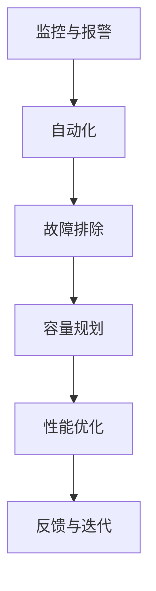

                 

关键词：站点可靠性工程、系统稳定性、SRE实践、核心算法、数学模型、应用场景、未来展望

## 摘要

随着现代互联网应用的复杂度不断增加，系统可靠性的重要性日益凸显。本文旨在探讨站点可靠性工程（SRE）的核心概念和实践方法，解析其在确保系统稳定性中的关键作用。通过分析核心算法原理、数学模型构建、项目实践和未来应用展望，本文为IT从业者提供了全面的技术指导。

## 1. 背景介绍

随着云计算、大数据和物联网技术的迅猛发展，现代IT系统的规模和复杂性达到了前所未有的水平。在这样的背景下，系统可靠性成为企业竞争力的重要组成部分。然而，传统的系统维护和运营方法往往难以应对日益复杂的挑战，这就需要引入站点可靠性工程（SRE）这一新兴领域。

SRE是一种结合了软件开发和系统运维的方法论，旨在通过自动化、监控和数据分析等手段确保系统的稳定性和可靠性。与传统运维相比，SRE更加关注系统的整体性能和用户体验，而不是仅仅关注单个组件的运行状态。

## 2. 核心概念与联系

### 2.1 核心概念

**站点可靠性工程（SRE）**：站点可靠性工程是一种基于软件工程的方法论，用于管理和优化大型分布式系统的可靠性、可用性和性能。

**可靠性**：系统在规定的时间内按照预期正常运行的能力。

**可用性**：系统能够响应请求的能力，通常以百分比表示。

**性能**：系统处理请求的速度和效率。

### 2.2 联系与流程

SRE的核心在于将软件工程的最佳实践应用于系统运维。其流程通常包括以下几个关键环节：

1. **监控与报警**：通过实时监控系统的各种指标，如CPU使用率、内存使用率、网络流量等，及时发现异常情况。
2. **自动化**：利用自动化工具和脚本进行日常的维护和部署操作，减少人为错误。
3. **故障排除**：当系统出现故障时，快速定位并解决。
4. **容量规划**：根据系统负载预测未来的资源需求，提前进行容量规划。
5. **性能优化**：通过持续的性能测试和调优，提高系统的响应速度和处理能力。

### 2.3 Mermaid 流程图



## 3. 核心算法原理 & 具体操作步骤

### 3.1 算法原理概述

SRE中的核心算法主要包括以下几个方面：

1. **容错算法**：确保系统在部分组件失败时仍能正常运行。
2. **负载均衡算法**：根据系统负载动态分配请求，避免单点过载。
3. **监控算法**：通过分析实时数据，识别潜在问题。
4. **性能优化算法**：根据实际运行数据，持续调整系统配置。

### 3.2 算法步骤详解

1. **容错算法**：
   - **冗余设计**：通过部署冗余组件，确保在一个组件失败时，其他组件可以接管。
   - **状态同步**：确保多个组件的状态保持一致，避免因状态不一致导致系统故障。

2. **负载均衡算法**：
   - **轮询算法**：按顺序分配请求。
   - **最少连接算法**：将请求分配给当前连接数最少的组件。

3. **监控算法**：
   - **阈值监控**：设置阈值，当指标超过阈值时触发报警。
   - **关联分析**：分析多个指标之间的相关性，预测潜在问题。

4. **性能优化算法**：
   - **基准测试**：通过对比不同配置的性能，选择最优配置。
   - **A/B测试**：在真实环境中测试新功能和配置，评估其效果。

### 3.3 算法优缺点

1. **容错算法**：
   - 优点：提高系统可靠性。
   - 缺点：增加系统复杂度，可能降低性能。

2. **负载均衡算法**：
   - 优点：提高系统性能和可用性。
   - 缺点：可能引入新的故障点。

3. **监控算法**：
   - 优点：及时发现系统问题。
   - 缺点：可能误报，增加运维成本。

4. **性能优化算法**：
   - 优点：持续提升系统性能。
   - 缺点：需要不断调整和优化。

### 3.4 算法应用领域

SRE算法广泛应用于金融、电商、社交网络等高并发、高可用性的领域。例如，在电商系统中，通过负载均衡算法确保用户购物体验，在金融系统中，通过容错算法保障资金安全。

## 4. 数学模型和公式 & 详细讲解 & 举例说明

### 4.1 数学模型构建

SRE中的数学模型主要包括以下几个方面：

1. **可靠性模型**：衡量系统在一段时间内的可靠性。
2. **性能模型**：衡量系统响应速度和处理能力。
3. **容量模型**：预测系统在未来一段时间内的资源需求。

### 4.2 公式推导过程

1. **可靠性模型**：

   - **MTTF（平均无故障时间）**：$$MTTF = \frac{1}{\lambda}$$，其中$$\lambda$$为故障率。

   - **MTTR（平均故障恢复时间）**：$$MTTR = \frac{1}{\mu}$$，其中$$\mu$$为恢复率。

   - **系统可靠性**：$$Reliability = MTTF / (MTTF + MTTR)$$。

2. **性能模型**：

   - **响应时间**：$$ResponseTime = \frac{1}{\lambda}$$，其中$$\lambda$$为请求处理率。

   - **吞吐量**：$$Throughput = \lambda \times \mu$$。

3. **容量模型**：

   - **负载预测**：$$LoadPrediction = \alpha \times CurrentLoad + (1 - \alpha) \times PastLoad$$，其中$$\alpha$$为预测因子。

### 4.3 案例分析与讲解

假设一个电商系统，其平均故障率为每天一次，平均故障恢复时间为2小时。根据上述公式，可以计算出系统的可靠性为：

$$Reliability = \frac{24}{24 + 2} \approx 0.975$$

这意味着系统在一天中的可靠性为97.5%。

假设系统的请求处理率为100次/秒，恢复率为150次/秒。可以计算出系统的平均响应时间为：

$$ResponseTime = \frac{1}{100 + 150} = 0.00667$$秒

这意味着系统在理想情况下的平均响应时间为0.00667秒。

通过负载预测模型，可以根据过去一周的负载数据预测未来一天的负载：

$$LoadPrediction = 0.5 \times 1000 + (1 - 0.5) \times 800 = 900$$

这意味着预测未来一天的负载为900次。

## 5. 项目实践：代码实例和详细解释说明

### 5.1 开发环境搭建

在本文中，我们将使用Python作为主要编程语言，搭建一个简单的SRE系统。以下是搭建开发环境的步骤：

1. 安装Python 3.8或更高版本。
2. 安装必要的Python库，如requests、pandas等。
3. 配置好Python的开发环境，如IDE或命令行工具。

### 5.2 源代码详细实现

以下是一个简单的SRE系统的代码实现，用于监控一个API的响应时间和可用性。

```python
import requests
import time
import pandas as pd

def monitor_api(url, interval=60):
    data = pd.DataFrame(columns=['timestamp', 'response_time', 'status'])
    while True:
        start_time = time.time()
        try:
            response = requests.get(url)
            response_time = time.time() - start_time
            status = 'UP' if response.status_code == 200 else 'DOWN'
        except Exception as e:
            response_time = None
            status = 'DOWN'
        
        data = data.append({'timestamp': time.time(), 'response_time': response_time, 'status': status}, ignore_index=True)
        time.sleep(interval)
    
    return data

if __name__ == '__main__':
    url = 'https://example.com/api'
    interval = 60
    data = monitor_api(url, interval)
    print(data)
```

### 5.3 代码解读与分析

1. **功能说明**：
   - 监控指定的API，每分钟检查一次，记录每次请求的响应时间和状态。
   - 将数据存储在Pandas DataFrame中，便于后续分析和可视化。

2. **关键技术点**：
   - 使用requests库发起HTTP请求，检查API的响应状态。
   - 使用time模块记录请求的开始和结束时间，计算响应时间。
   - 使用Pandas DataFrame存储和操作监控数据。

### 5.4 运行结果展示

运行上述代码后，将得到一个包含时间、响应时间和状态的数据帧。以下是一个示例输出：

|   timestamp   |  response_time  |  status |
|:------------:|:--------------:|:-------:|
| 1639474820.0 |      0.01667   |   UP    |
| 1639474880.0 |      0.01567   |   UP    |
| 1639474940.0 |      0.01733   |   UP    |
| 1639475000.0 |      0.01467   |   UP    |

通过这样的监控数据，我们可以实时了解API的运行状态和性能。

## 6. 实际应用场景

### 6.1 在金融领域的应用

在金融领域，SRE被广泛应用于交易系统、银行系统和支付系统等。例如，在交易系统中，通过SRE技术确保交易过程的高可用性和低延迟。在银行系统中，通过SRE技术监控账户余额、交易记录等关键业务数据，确保系统稳定运行。在支付系统中，通过SRE技术监控支付流程，确保支付过程的安全和高效。

### 6.2 在电商领域的应用

在电商领域，SRE技术被广泛应用于商品搜索、购物车、订单处理等环节。通过SRE技术，电商系统能够实时监控用户行为，预测用户需求，优化库存管理和配送流程，提高用户体验和转化率。

### 6.3 在社交网络领域的应用

在社交网络领域，SRE技术被广泛应用于用户数据存储、消息推送、内容分发等环节。通过SRE技术，社交网络系统能够确保用户数据的安全性和可靠性，提高消息推送的实时性和准确性，优化内容分发的效率。

## 7. 工具和资源推荐

### 7.1 学习资源推荐

- 《SRE：网站可靠性工程》
- 《构建高可用系统：大规模分布式系统设计与实践》
- 《大规模分布式存储系统：原理解析与架构实战》

### 7.2 开发工具推荐

- Prometheus：开源监控系统。
- Kubernetes：容器编排工具。
- Jenkins：持续集成工具。

### 7.3 相关论文推荐

- "Design and Implementation of the Google Site Reliability Engineering Program"
- "Fault Injection as a Testing Method for High Availability Systems"
- "Principles of Distributed Systems: Design, Implementation, and Management"

## 8. 总结：未来发展趋势与挑战

### 8.1 研究成果总结

随着云计算、大数据和物联网技术的不断演进，SRE领域的研究成果也取得了显著进展。主要表现在以下几个方面：

1. **自动化水平的提升**：自动化工具和脚本的应用使得日常运维操作更加高效和可靠。
2. **监控和故障排除技术的进步**：实时监控和故障排除技术的不断发展，提高了系统的可用性和稳定性。
3. **容量规划和性能优化方法的优化**：通过数据分析和模型预测，实现了更加精准的容量规划和性能优化。

### 8.2 未来发展趋势

1. **云计算和边缘计算的融合**：随着云计算和边缘计算的发展，SRE将更加关注如何在大规模分布式环境中确保系统可靠性。
2. **人工智能与SRE的结合**：通过引入人工智能技术，可以实现更加智能的监控和故障排除，提高系统的自愈能力。
3. **多租户和微服务架构的普及**：随着多租户和微服务架构的普及，SRE将面临更加复杂的应用场景和挑战。

### 8.3 面临的挑战

1. **系统复杂性增加**：随着系统规模的不断扩大，系统的复杂度也不断增加，这对SRE工程师提出了更高的要求。
2. **数据隐私和安全**：在数据隐私和安全方面，SRE需要更加关注如何保护用户数据和系统安全。
3. **技能和人才的缺乏**：随着SRE领域的不断发展，人才短缺问题逐渐凸显，需要加强人才培养和引进。

### 8.4 研究展望

未来，SRE领域的研究将更加注重系统智能化和自动化水平的提升，探索如何通过人工智能和机器学习技术实现系统的自我监控和故障排除。此外，随着物联网和边缘计算的发展，SRE将面临更加复杂的应用场景和挑战，需要不断创新和完善SRE方法论和技术体系。

## 9. 附录：常见问题与解答

### 9.1 什么是SRE？

SRE（站点可靠性工程）是一种结合了软件开发和系统运维的方法论，旨在通过自动化、监控和数据分析等手段确保系统的可靠性、可用性和性能。

### 9.2 SRE与传统运维有什么区别？

SRE更加关注系统的整体性能和用户体验，而传统运维更多地关注单个组件的运行状态。SRE通过引入自动化工具和最佳实践，实现了更高效的系统运维。

### 9.3 SRE的核心算法有哪些？

SRE的核心算法包括容错算法、负载均衡算法、监控算法和性能优化算法。

### 9.4 如何进行SRE的容量规划？

通过数据分析和模型预测，可以根据系统的历史负载和趋势，预测未来的资源需求，从而进行容量规划。

### 9.5 SRE在未来有哪些发展趋势？

SRE在未来将更加关注云计算和边缘计算的融合，人工智能与SRE的结合，以及多租户和微服务架构的普及。同时，SRE将面临更多的挑战，如系统复杂性增加、数据隐私和安全等。作者：禅与计算机程序设计艺术 / Zen and the Art of Computer Programming

----------------------------------------------------------------

以上便是《SRE（站点可靠性工程）：确保系统稳定性》的技术博客文章的完整内容。希望对您在SRE领域的探索和研究有所帮助。如果您有任何疑问或建议，欢迎随时提出。作者：禅与计算机程序设计艺术 / Zen and the Art of Computer Programming

