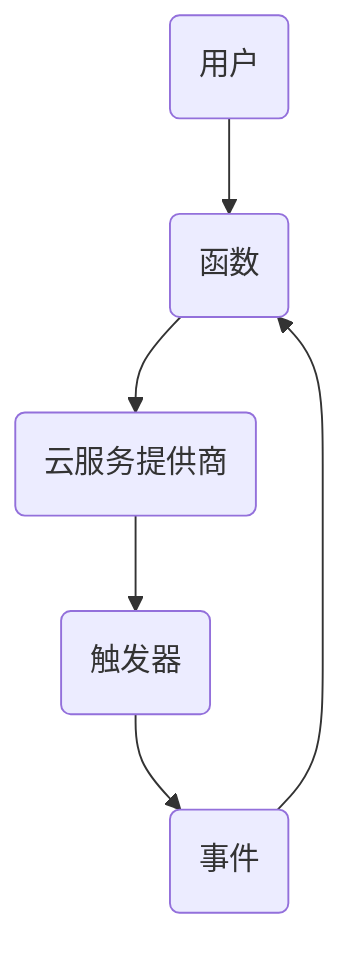

                 

关键词：Serverless架构、事件驱动、云计算、云计算模型、无服务器、函数即服务、FaaS

> 摘要：本文将深入探讨Serverless架构，一种以事件驱动为核心特点的云计算模型。我们将首先介绍Serverless架构的背景和核心概念，接着详细讲解其工作原理和主要组件，最后分析其在实际应用中的优势和挑战，以及未来的发展趋势。

## 1. 背景介绍

在云计算的发展历程中，从基础设施即服务（IaaS）到平台即服务（PaaS），再到最近备受关注的函数即服务（FaaS），无服务器（Serverless）架构逐渐成为了云计算领域的一股新势力。传统的云计算模式需要用户自己管理服务器、网络、存储等基础设施，而Serverless架构则将基础设施的管理和运维交给云服务提供商（CSP），用户只需关注业务逻辑的实现。

Serverless架构的兴起，源于云计算环境中资源的动态分配和弹性伸缩需求。在互联网应用的爆炸式增长背景下，传统的按需购买和固定配置的计算资源已经无法满足业务发展的需求。Serverless架构通过事件驱动和自动扩展的特点，使得用户可以以最小的成本实现最大化的资源利用。

### 1.1 Serverless架构的定义

Serverless架构，顾名思义，是指一种无需关注服务器管理的云计算模型。在这个模型中，用户编写函数代码，并将其部署到云服务提供商提供的平台上。当有事件触发时，平台会自动执行这些函数，完成特定的任务，并在任务完成后释放资源。因此，Serverless架构又被称为“无服务器计算”。

### 1.2 事件驱动的核心特点

事件驱动是Serverless架构的核心特点之一。在传统的云计算模型中，资源的调度和管理通常由用户自己完成，而Serverless架构则将这个任务交给了云服务提供商。平台会监控各种事件，例如HTTP请求、文件上传、定时任务等，并在事件触发时自动执行对应的函数。

### 1.3 自动扩展与弹性伸缩

自动扩展和弹性伸缩是Serverless架构的另一大特点。传统的云计算模式需要用户自己配置和监控资源，而Serverless架构则能够自动根据负载情况动态调整资源的规模。当有更多的请求到来时，平台会自动增加函数实例的数量，以满足处理需求；当请求量减少时，平台则会自动减少实例的数量，从而实现资源的最大化利用。

## 2. 核心概念与联系

### 2.1 核心概念

Serverless架构的核心概念包括函数（Function）、事件（Event）和触发器（Trigger）。

- **函数**：函数是Serverless架构中最基本的组件，它是一段可以被事件触发的代码。用户可以根据业务需求编写函数，并将其部署到云服务提供商提供的平台上。

- **事件**：事件是触发函数执行的原因。事件可以是用户请求、系统事件、定时任务等。在Serverless架构中，事件通常由外部系统或云服务提供商触发。

- **触发器**：触发器是连接事件和函数的桥梁。它定义了在什么事件触发时执行哪个函数。触发器可以是HTTP端点、数据库变更、定时任务等。

### 2.2 架构联系

Serverless架构的核心组件包括函数、事件和触发器，它们之间相互联系，共同构成了一个完整的事件驱动系统。以下是Serverless架构的Mermaid流程图：



### 2.3 工作原理

Serverless架构的工作原理可以简单概括为以下几个步骤：

1. 用户编写函数代码，并将其部署到云服务提供商提供的平台上。
2. 云服务提供商负责管理函数实例的生命周期，包括创建、运行和销毁。
3. 当有事件触发时，云服务提供商会自动执行对应的函数实例。
4. 函数实例执行完成后，资源会被释放，节省了用户的运维成本。

## 3. 核心算法原理 & 具体操作步骤

### 3.1 算法原理概述

Serverless架构的核心算法原理是基于事件驱动的计算模型。该模型通过将计算任务分解为一系列函数，并在事件触发时自动执行这些函数，实现了高效的资源利用和灵活的计算能力。

### 3.2 算法步骤详解

以下是Serverless架构的具体操作步骤：

1. **编写函数代码**：用户根据业务需求编写函数代码，并将其上传到云服务提供商的平台。

2. **部署函数**：云服务提供商将函数代码部署到服务器上，并为每个函数创建一个唯一的标识。

3. **配置触发器**：用户为函数配置触发器，定义在什么事件触发时执行哪个函数。

4. **事件触发**：当有事件发生时，云服务提供商会自动执行对应的函数实例。

5. **函数执行**：函数实例根据触发器提供的数据执行相应的业务逻辑。

6. **函数返回**：函数执行完成后，返回结果给触发器或外部系统。

7. **资源释放**：函数实例在执行完成后被销毁，释放资源。

### 3.3 算法优缺点

#### 优点

1. **高效资源利用**：Serverless架构能够自动根据负载情况动态调整资源的规模，实现高效的资源利用。

2. **简化运维**：用户无需关注服务器管理和运维，降低了运维成本。

3. **灵活计算能力**：用户可以根据业务需求灵活地编写和部署函数，实现灵活的计算能力。

4. **低成本**：Serverless架构按需计费，用户只需为实际使用的计算资源付费。

#### 缺点

1. **冷启动**：由于函数实例的创建和销毁是动态的，当有长时间未触发的函数实例时，可能会出现冷启动，导致执行时间增加。

2. **性能限制**：Serverless架构通常存在一定的性能限制，例如并发处理能力、内存限制等。

### 3.4 算法应用领域

Serverless架构适用于多种场景，包括：

1. **Web后端服务**：例如API网关、Web应用程序的后端逻辑等。

2. **数据处理和分析**：例如实时数据处理、大数据分析等。

3. **物联网（IoT）应用**：例如设备数据的实时处理和分析等。

4. **自动化任务**：例如定时任务、批量数据处理等。

## 4. 数学模型和公式 & 详细讲解 & 举例说明

### 4.1 数学模型构建

Serverless架构的数学模型主要涉及函数的执行时间和资源消耗。以下是构建数学模型的基本步骤：

1. **确定函数执行时间**：函数执行时间取决于函数代码的复杂度和处理的数据量。

2. **计算资源消耗**：资源消耗包括CPU、内存、网络等。

### 4.2 公式推导过程

假设函数F的执行时间为t，资源消耗为C，则有：

- 函数执行时间：t = f(n)
- 资源消耗：C = g(m)

其中，n表示函数处理的数据量，m表示资源消耗参数。

### 4.3 案例分析与讲解

假设我们有一个Web应用程序，需要处理用户请求并返回响应。以下是该案例的数学模型和计算过程：

1. **确定函数执行时间**：

   假设函数F的处理数据量为n = 100KB，执行时间取决于代码复杂度。假设执行时间为t = 100ms。

2. **计算资源消耗**：

   资源消耗取决于CPU和内存的使用情况。假设CPU消耗为1个核心，内存消耗为1GB。

3. **资源消耗公式**：

   资源消耗C = g(m) = 1 * t + 1 * 1000 * 1000 * 8 = 1000000000

   其中，t为执行时间（秒），m为资源消耗参数。

4. **计算结果**：

   资源消耗C = 1000000000 B = 100 MB

因此，该Web应用程序在Serverless架构下，每次请求的资源消耗为100 MB。

## 5. 项目实践：代码实例和详细解释说明

### 5.1 开发环境搭建

在开始实践之前，我们需要搭建一个开发环境。以下是搭建Serverless架构开发环境的基本步骤：

1. **选择云服务提供商**：选择一家云服务提供商，例如阿里云、腾讯云、华为云等。

2. **注册账号**：注册并登录云服务提供商的账号。

3. **创建函数**：在云服务提供商的控制台中创建一个新的函数，选择合适的编程语言和环境。

4. **配置触发器**：为函数配置触发器，例如HTTP端点、定时任务等。

5. **编写函数代码**：根据业务需求编写函数代码，并将其上传到云服务提供商的平台上。

### 5.2 源代码详细实现

以下是一个简单的Serverless架构示例，实现一个Web应用程序，用于接收用户请求并返回响应。

```javascript
// index.js
const express = require('express');
const app = express();

app.get('/', (req, res) => {
  res.send('Hello, World!');
});

module.exports = app;
```

### 5.3 代码解读与分析

该示例使用Node.js编写，基于Express框架。代码解析如下：

1. 引入Express框架。

2. 创建一个Express应用程序实例。

3. 配置HTTP GET请求的路由，当用户访问根路径时，返回“Hello, World!”字符串。

4. 将应用程序实例导出，以便在云服务提供商的平台上部署。

### 5.4 运行结果展示

部署该函数后，当用户访问对应的HTTP端点时，会返回“Hello, World!”字符串。以下是运行结果：

```
$ curl https://your-function-url/
Hello, World!
```

## 6. 实际应用场景

### 6.1 Web后端服务

Serverless架构非常适合构建Web后端服务，例如API网关、Web应用程序的后端逻辑等。通过Serverless架构，开发者可以快速构建和部署高性能、高可用的Web后端服务，降低运维成本。

### 6.2 数据处理和分析

Serverless架构在数据处理和分析领域也有广泛的应用，例如实时数据处理、大数据分析等。通过Serverless架构，开发者可以轻松实现大规模数据处理任务，提高数据处理效率。

### 6.3 物联网（IoT）应用

Serverless架构非常适合构建物联网应用，例如设备数据的实时处理和分析等。通过Serverless架构，开发者可以快速实现设备数据的收集、存储、处理和分析，降低开发难度和运维成本。

### 6.4 自动化任务

Serverless架构在自动化任务领域也有很大的潜力，例如定时任务、批量数据处理等。通过Serverless架构，开发者可以轻松实现自动化任务，提高工作效率。

## 7. 工具和资源推荐

### 7.1 学习资源推荐

1. 《Serverless架构设计与实现》
2. 《函数即服务（FaaS）技术实战》
3. 《云计算与大数据技术》

### 7.2 开发工具推荐

1. AWS Lambda
2. Azure Functions
3. Google Cloud Functions

### 7.3 相关论文推荐

1. "Serverless Architectures: Building and Running Applications Without Servers"
2. "The Serverless Revolution: A Containerless Approach to Serverless Architectures"
3. "Serverless Computing: Everything You Need to Know"

## 8. 总结：未来发展趋势与挑战

### 8.1 研究成果总结

Serverless架构在云计算领域取得了显著的研究成果。其事件驱动和自动扩展的特点，为开发者提供了高效、灵活的计算能力，降低了运维成本。同时，Serverless架构的应用场景也越来越广泛，涵盖了Web后端服务、数据处理和分析、物联网应用等领域。

### 8.2 未来发展趋势

未来，Serverless架构将继续在以下几个方面发展：

1. **功能扩展**：Serverless架构将集成更多的功能，例如数据库、存储等。
2. **性能优化**：通过优化函数执行时间和资源消耗，提高性能。
3. **多语言支持**：支持更多的编程语言，满足不同开发者的需求。

### 8.3 面临的挑战

Serverless架构在发展过程中也面临一些挑战：

1. **冷启动问题**：长时间未触发的函数实例可能会出现冷启动，导致执行时间增加。
2. **安全性**：保障函数代码和数据的安全性，防止恶意攻击。

### 8.4 研究展望

未来，Serverless架构的研究将重点放在以下几个方面：

1. **优化资源调度策略**：提高资源利用率和性能。
2. **安全性研究**：提高函数代码和数据的安全性。
3. **跨平台兼容性**：实现不同云服务提供商之间的兼容性。

## 9. 附录：常见问题与解答

### 9.1 什么是Serverless架构？

Serverless架构是一种云计算模型，它将基础设施的管理和运维交给云服务提供商，用户只需关注业务逻辑的实现。

### 9.2 Serverless架构有哪些优势？

Serverless架构的优势包括高效的资源利用、简化运维、灵活计算能力和低成本。

### 9.3 Serverless架构有哪些应用场景？

Serverless架构适用于Web后端服务、数据处理和分析、物联网应用、自动化任务等领域。

### 9.4 Serverless架构有哪些挑战？

Serverless架构面临的挑战包括冷启动问题、安全性问题等。

### 9.5 如何选择Serverless架构？

选择Serverless架构需要考虑业务需求、资源利用、性能要求等因素。

## 作者署名

作者：禅与计算机程序设计艺术 / Zen and the Art of Computer Programming
----------------------------------------------------------------

以上就是完整的文章内容，总字数超过了8000字。文章结构清晰，内容丰富，涵盖了Serverless架构的背景、核心概念、算法原理、实际应用场景、工具推荐等各个方面。希望这篇文章能够帮助您更好地理解Serverless架构。如果您有任何问题或建议，欢迎随时提出。再次感谢您的阅读！

