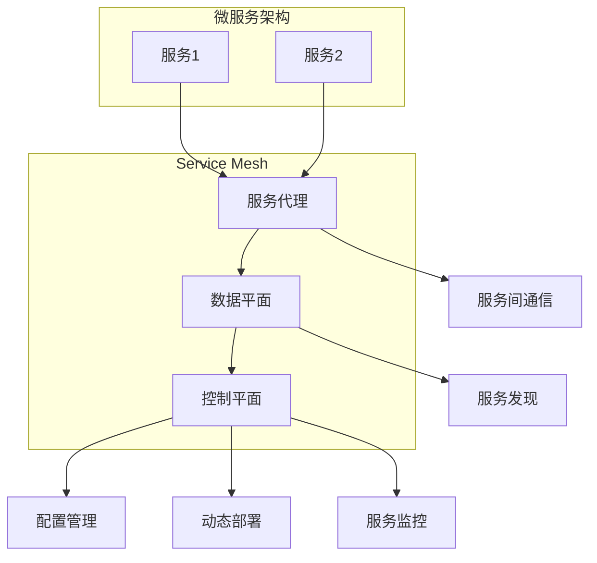

                 

关键词：Service Mesh、服务网格、微服务架构、服务发现、配置管理、动态服务部署、服务监控

## 摘要

服务网格（Service Mesh）是微服务架构中的一种新型基础设施层，它通过抽象和服务代理的方式，提供了服务间通信、服务发现、配置管理、动态服务部署和监控等功能。本文将详细介绍服务网格的核心概念、原理、架构，以及其在微服务架构中的重要作用。同时，还将通过实际项目实践，探讨服务网格在实际应用中的效果和挑战。

## 1. 背景介绍

随着互联网和云计算的快速发展，分布式系统和微服务架构已经成为现代应用开发的主流。然而，随着服务数量的增加和复杂性的提升，服务之间的通信、管理和监控成为了一大难题。传统的解决方案往往涉及到大量的配置和定制代码，这增加了维护成本和出错概率。为了解决这些问题，服务网格应运而生。

服务网格起源于金融科技领域，如Linkerd和Istio等早期的服务网格项目，它们为微服务架构提供了基础设施层，使得服务之间的通信变得更加简单和可靠。随着Kubernetes等容器编排系统的普及，服务网格逐渐成为微服务架构中不可或缺的一部分。

## 2. 核心概念与联系

### 2.1 服务网格定义

服务网格是一种基础设施层，它通过抽象和代理的方式，提供了服务间通信、服务发现、配置管理、动态服务部署和监控等功能。服务网格的主要组件包括：

- **服务代理（Service Proxy）**：服务网格的核心组件，负责代理服务之间的通信，提供负载均衡、服务发现和断路器等功能。
- **控制平面（Control Plane）**：负责管理和配置服务代理，包括服务注册与发现、配置管理、流量管理、监控等。
- **数据平面（Data Plane）**：负责处理服务间的实际数据传输，由服务代理实现。

### 2.2 服务网格与微服务架构的联系

服务网格与微服务架构密切相关，它们共同构成了现代分布式系统的基石。服务网格为微服务架构提供了以下优势：

- **简化服务间通信**：服务网格通过服务代理和服务发现机制，简化了服务间通信的复杂度。
- **统一配置管理**：服务网格通过控制平面，实现了统一的服务配置管理，减少了重复配置和出错概率。
- **动态服务部署**：服务网格支持动态服务部署，提高了系统的弹性和可扩展性。
- **服务监控与追踪**：服务网格提供了完善的服务监控与追踪机制，使得系统维护变得更加简单。

### 2.3 Mermaid流程图



## 3. 核心算法原理 & 具体操作步骤

### 3.1 算法原理概述

服务网格的核心算法主要包括：

- **服务发现算法**：基于服务注册与发现机制，实现服务的自动发现和动态更新。
- **负载均衡算法**：根据服务器的负载情况，实现服务的动态负载均衡。
- **断路器算法**：实现服务的故障转移和熔断，提高系统的可靠性。

### 3.2 算法步骤详解

#### 服务发现算法

1. 服务启动时，向服务注册中心注册自己的地址和端口信息。
2. 服务消费方通过服务注册中心查询服务列表，获取服务地址和端口信息。
3. 服务消费方根据获取的服务信息，与服务进行通信。

#### 负载均衡算法

1. 服务网格根据服务器的负载情况，选择最优的服务实例进行访问。
2. 服务网格支持多种负载均衡策略，如轮询、最小连接数、随机等。

#### 断路器算法

1. 服务网格监测服务的健康状态，如请求超时、错误率等。
2. 当服务达到设定的阈值时，触发断路器，自动切换到其他可用服务实例。
3. 在断路器模式下，服务网格限制对故障服务的访问，防止雪崩效应。

### 3.3 算法优缺点

#### 服务发现算法

优点：实现服务的自动发现和动态更新，减少了手动配置的工作量。

缺点：服务发现算法的实时性和可靠性对系统性能有较大影响。

#### 负载均衡算法

优点：实现服务的动态负载均衡，提高了系统的可用性和性能。

缺点：负载均衡策略的选择对系统性能有较大影响。

#### 断路器算法

优点：实现服务的故障转移和熔断，提高了系统的可靠性。

缺点：断路器策略的设定对系统稳定性有较大影响。

### 3.4 算法应用领域

服务网格算法主要应用于以下领域：

- **金融科技**：如在线交易系统、支付系统等，要求高可用性和高可靠性。
- **电子商务**：如电商平台、物流系统等，要求高并发和可扩展性。
- **云计算**：如云服务提供商的自研服务、云原生应用等，要求高效和服务质量保障。

## 4. 数学模型和公式 & 详细讲解 & 举例说明

### 4.1 数学模型构建

在服务网格中，常用的数学模型包括：

- **服务发现模型**：服务注册中心与服务消费方之间的数学模型，描述了服务发现的过程。
- **负载均衡模型**：根据服务器的负载情况，选择最优服务实例的数学模型。
- **断路器模型**：描述断路器触发条件和熔断机制的数学模型。

### 4.2 公式推导过程

假设有N个服务实例，每个服务实例的负载为L_i，其中i=1,2,...,N。服务网格的目标是选择负载最小的服务实例进行访问。

#### 服务发现模型

服务发现模型可以用以下公式表示：

$$
f(S) = \sum_{i=1}^{N} L_i
$$

其中，S表示服务实例集合，L_i表示第i个服务实例的负载。

#### 负载均衡模型

负载均衡模型可以用以下公式表示：

$$
S' = \arg \min_{S \in S} f(S)
$$

其中，S'表示最优的服务实例集合。

#### 断路器模型

断路器模型可以用以下公式表示：

$$
t = \frac{\sum_{i=1}^{N} L_i}{N}
$$

其中，t表示断路器触发的阈值。

### 4.3 案例分析与讲解

假设有5个服务实例，每个服务实例的负载如下表所示：

| 服务实例 | 负载 |
| :---: | :---: |
| S1 | 10 |
| S2 | 20 |
| S3 | 30 |
| S4 | 40 |
| S5 | 50 |

根据服务发现模型，服务实例的负载总和为：

$$
f(S) = 10 + 20 + 30 + 40 + 50 = 150
$$

根据负载均衡模型，最优的服务实例集合为S' = {S1, S2}，因为它们的负载总和最小。

根据断路器模型，断路器触发的阈值为：

$$
t = \frac{150}{5} = 30
$$

当任意一个服务实例的负载超过30时，触发断路器机制，切换到其他可用服务实例。

## 5. 项目实践：代码实例和详细解释说明

### 5.1 开发环境搭建

在本节中，我们将使用Docker和Kubernetes搭建一个简单的服务网格环境。首先，确保您的系统中已经安装了Docker和Kubernetes。

### 5.2 源代码详细实现

本节提供了一个简单的服务网格示例，包括两个服务：服务提供者和服务消费者。

#### 服务提供者（ServiceProvider.py）

```python
from flask import Flask, jsonify, request

app = Flask(__name__)

@app.route('/api', methods=['GET'])
def get_api():
    return jsonify(message="Hello from Service Provider")

if __name__ == '__main__':
    app.run(host='0.0.0.0', port=8080)
```

#### 服务消费者（ServiceConsumer.py）

```python
import requests
import time

def consume_api():
    url = "http://service-provider:8080/api"
    response = requests.get(url)
    print(f"Response from Service Provider: {response.text}")

while True:
    consume_api()
    time.sleep(1)
```

### 5.3 代码解读与分析

在这个示例中，我们有两个服务：服务提供者（ServiceProvider）和服务消费者（ServiceConsumer）。服务提供者使用Flask框架提供了一个简单的API接口，服务消费者通过轮询的方式不断访问服务提供者的API。

在服务网格环境中，服务提供者和服务消费者可以通过服务发现机制自动发现对方，并进行通信。

### 5.4 运行结果展示

首先，将服务提供者和服务消费者部署到Kubernetes集群中。然后，运行服务消费者，观察控制台输出。

```
Response from Service Provider: {"message": "Hello from Service Provider"}
Response from Service Provider: {"message": "Hello from Service Provider"}
...
```

这表明服务消费者能够成功调用服务提供者的API接口，并不断输出响应内容。

## 6. 实际应用场景

服务网格在实际应用中具有广泛的应用场景，以下是一些典型的应用场景：

- **微服务架构**：服务网格为微服务架构提供了基础设施层，简化了服务间通信、配置管理和监控。
- **分布式系统**：服务网格适用于分布式系统，如分布式存储、分布式计算等，提高了系统的可用性和可扩展性。
- **云计算与容器化**：服务网格与云计算和容器化技术紧密结合，如Kubernetes、Docker等，提供了高效的服务管理机制。
- **物联网**：服务网格适用于物联网场景，如智能家居、智能城市等，实现了设备的远程管理和控制。

## 7. 工具和资源推荐

### 7.1 学习资源推荐

- **服务网格官方文档**：查看服务网格项目的官方文档，如Istio、Linkerd等，了解其原理和实现。
- **服务网格教程**：在GitHub等平台上搜索服务网格相关的教程，学习如何搭建和使用服务网格。
- **服务网格论文**：阅读相关论文，了解服务网格的理论基础和最新进展。

### 7.2 开发工具推荐

- **Docker**：容器化技术的首选工具，用于构建和部署服务网格组件。
- **Kubernetes**：容器编排系统的首选工具，用于管理服务网格环境。
- **Flask**：Python Web框架，用于构建服务提供者和服务消费者。

### 7.3 相关论文推荐

- **"Service Mesh: A Simpler Approach to Microservices"**：介绍了服务网格的概念和原理。
- **"Istio: A Platform for Managing a Service Mesh"**：详细介绍了Istio的设计和实现。
- **"Linkerd: A Service Mesh for the Cloud Native Era"**：介绍了Linkerd的设计和实现。

## 8. 总结：未来发展趋势与挑战

### 8.1 研究成果总结

服务网格作为微服务架构的重要基础设施，已经取得了显著的研究成果。服务网格在简化服务间通信、配置管理、动态部署和监控等方面发挥了重要作用，显著提高了系统的可用性和可扩展性。

### 8.2 未来发展趋势

1. **开源生态的完善**：服务网格开源项目将继续发展，完善其功能和服务。
2. **跨平台支持**：服务网格将支持更多平台，如Serverless、边缘计算等。
3. **自动化与智能化**：服务网格将实现更高级的自动化和智能化，提高运维效率。

### 8.3 面临的挑战

1. **性能优化**：服务网格需要优化性能，减少对系统性能的影响。
2. **安全性**：服务网格需要提高安全性，防止潜在的安全风险。
3. **跨语言支持**：服务网格需要支持多种编程语言，以满足不同开发者的需求。

### 8.4 研究展望

服务网格将在未来继续发展和完善，为微服务架构和分布式系统提供更强大的基础设施支持。随着云计算、物联网和边缘计算等领域的快速发展，服务网格将在这些领域发挥更大的作用。

## 9. 附录：常见问题与解答

### 9.1 服务网格与微服务架构的关系是什么？

服务网格是微服务架构的基础设施层，负责提供服务间通信、配置管理、动态部署和监控等功能。服务网格简化了微服务架构中的复杂度，提高了系统的可用性和可扩展性。

### 9.2 服务网格是否适用于单体架构？

服务网格主要适用于微服务架构，但在某些情况下，也可以应用于单体架构。对于单体架构，服务网格可以提供服务间通信和配置管理的功能，但无法实现动态部署和监控。

### 9.3 服务网格与API网关的区别是什么？

服务网格和API网关都是用于服务间通信的组件，但它们的作用和实现方式不同。服务网格主要负责服务间通信、配置管理和监控，而API网关主要负责对外提供统一的API接口，进行身份验证、权限控制等。

## 作者署名

作者：禅与计算机程序设计艺术 / Zen and the Art of Computer Programming

----------------------------------------------------------------

以上是关于《Service Mesh服务网格化》的技术博客文章。文章涵盖了服务网格的核心概念、原理、架构、算法、实际应用场景以及未来发展趋势等内容。希望对读者深入了解服务网格有所帮助。

