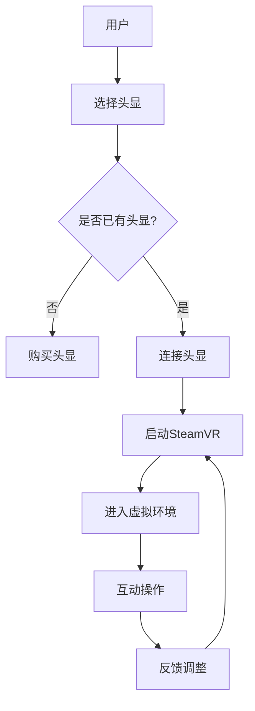

                 

关键词：SteamVR，虚拟现实，Valve，平台，体验，技术分析，发展趋势

> 摘要：本文深入探讨了Valve的虚拟现实平台SteamVR的各个方面，包括其背景介绍、核心概念、算法原理、数学模型、项目实践、应用场景、未来展望、工具和资源推荐以及面临的挑战和展望。

## 1. 背景介绍

虚拟现实（VR）技术的发展日益成熟，给各行各业带来了新的可能性和变革。Valve公司，作为虚拟现实技术的领军企业之一，推出了SteamVR平台，为用户提供了一个全面而强大的虚拟现实体验。SteamVR不仅是一款软件平台，更是一个生态系统，涵盖了硬件、软件和内容开发等多个层面。

Valve成立于1996年，总部位于美国华盛顿州，是一家以游戏开发和虚拟现实技术为核心的公司。其知名的游戏作品有《半条命》（Half-Life）系列、《传送门》（Portal）系列等，这些游戏在全球范围内都取得了巨大的成功。除了游戏，Valve还致力于VR硬件的开发，如Valve Index VR头显，为SteamVR平台的体验提供了坚实的硬件支持。

SteamVR作为Valve的虚拟现实平台，自2016年首次发布以来，已经经过了多次迭代和优化。它不仅支持多种VR应用，还提供了丰富的开发工具和API，使得开发者能够轻松创建和发布VR内容。SteamVR的目标是提供最接近现实生活的虚拟现实体验，让用户能够在虚拟世界中自由探索和互动。

## 2. 核心概念与联系

### 2.1 核心概念

SteamVR平台的核心概念包括以下几个关键点：

1. **VR头显与跟踪系统**：SteamVR支持多种VR头显，如Valve Index、Oculus Rift、HTC Vive等，并提供精确的头部和手部跟踪系统，确保用户在虚拟世界中的位置和动作能够得到实时响应。

2. **空间定位**：SteamVR利用激光传感器和摄像头实现室内空间定位，用户可以在虚拟世界中自由移动和探索。

3. **交互方式**：SteamVR提供了多种交互方式，包括手势识别、语音控制、触觉反馈等，增强了用户与虚拟世界的互动性。

4. **内容生态系统**：SteamVR拥有庞大的VR内容生态系统，包括游戏、应用、工具等多种类型，为用户提供了丰富的选择。

### 2.2 Mermaid 流程图



## 3. 核心算法原理 & 具体操作步骤

### 3.1 算法原理概述

SteamVR的核心算法主要涉及以下几个方面：

1. **空间定位算法**：利用激光传感器和摄像头实现室内空间的三维建模和定位。

2. **动作捕捉算法**：通过跟踪用户的头部和手部动作，实时更新虚拟世界中的位置和姿态。

3. **图像渲染算法**：根据用户的视角和位置动态渲染虚拟场景，提供流畅的视觉体验。

4. **声音处理算法**：通过头戴式耳机提供空间声音效果，增强沉浸感。

### 3.2 算法步骤详解

1. **空间定位步骤**：
   - 启动SteamVR，连接激光传感器和摄像头。
   - 传感器扫描室内空间，建立三维地图。
   - 用户进入虚拟环境，系统根据地图实时更新用户位置。

2. **动作捕捉步骤**：
   - 使用动作捕捉设备跟踪用户头部和手部动作。
   - 将捕捉到的动作数据转换为虚拟世界中的位置和姿态。

3. **图像渲染步骤**：
   - 根据用户视角计算渲染视图。
   - 实时渲染虚拟场景，确保画面流畅。

4. **声音处理步骤**：
   - 使用头戴式耳机捕捉用户声音。
   - 通过声音处理算法实现空间声音效果。

### 3.3 算法优缺点

**优点**：
- 高度精准的空间定位和动作捕捉，提供真实的虚拟体验。
- 丰富的交互方式和内容，满足不同用户的需求。
- 强大的开发工具和API，支持开发者创作和发布VR内容。

**缺点**：
- 高昂的硬件成本，对部分用户来说可能难以承受。
- 软件和硬件的兼容性问题，可能影响用户体验。

### 3.4 算法应用领域

SteamVR的算法在多个领域有广泛应用：

- 游戏开发：提供丰富的虚拟场景和互动方式，增强游戏体验。
- 教育培训：模拟真实环境，提供沉浸式的学习体验。
- 医疗康复：通过虚拟现实技术进行康复训练，提高治疗效果。
- 设计艺术：利用虚拟现实技术进行创意设计和艺术创作。

## 4. 数学模型和公式 & 详细讲解 & 举例说明

### 4.1 数学模型构建

SteamVR的数学模型主要包括空间定位模型、动作捕捉模型和图像渲染模型。以下分别进行讲解：

#### 4.1.1 空间定位模型

空间定位模型采用激光扫描和摄像头识别相结合的方法，其基本公式为：

$$
X = \frac{d_1 \cdot a_1 + d_2 \cdot a_2}{d_1 + d_2}
$$

其中，$X$ 表示用户的位置，$d_1$ 和 $d_2$ 分别为激光传感器和摄像头的距离，$a_1$ 和 $a_2$ 分别为激光传感器和摄像头的角度。

#### 4.1.2 动作捕捉模型

动作捕捉模型通过跟踪用户的手部和头部动作，将捕捉到的数据转换为虚拟世界中的位置和姿态。其基本公式为：

$$
P = A \cdot \theta
$$

其中，$P$ 表示虚拟世界中的位置和姿态，$A$ 表示动作捕捉矩阵，$\theta$ 表示用户的手部和头部动作。

#### 4.1.3 图像渲染模型

图像渲染模型根据用户视角动态渲染虚拟场景，其基本公式为：

$$
I = R \cdot V
$$

其中，$I$ 表示渲染后的图像，$R$ 表示渲染矩阵，$V$ 表示用户视角。

### 4.2 公式推导过程

以空间定位模型为例，推导过程如下：

1. **激光传感器定位**：
   - 假设激光传感器位于点$(0, 0, 0)$，发射激光到室内空间。
   - 激光传感器与室内空间某点的距离为$d_1$。
   - 激光传感器发射激光的角度为$a_1$。

2. **摄像头定位**：
   - 假设摄像头位于点$(x, y, z)$，捕捉室内空间某点的位置。
   - 摄像头与室内空间某点的距离为$d_2$。
   - 摄像头捕捉室内空间某点的角度为$a_2$。

3. **空间定位**：
   - 根据三角函数，激光传感器和摄像头捕捉到的室内空间某点的位置分别为：
   $$ P_1 = (d_1 \cdot \sin(a_1), d_1 \cdot \cos(a_1), 0) $$
   $$ P_2 = (d_2 \cdot \sin(a_2), d_2 \cdot \cos(a_2), 0) $$
   - 由于室内空间是三维的，需要将两个二维点合并为一个三维点：
   $$ X = \frac{d_1 \cdot a_1 + d_2 \cdot a_2}{d_1 + d_2} $$
   $$ Y = \frac{d_1 \cdot b_1 + d_2 \cdot b_2}{d_1 + d_2} $$
   $$ Z = \frac{d_1 \cdot c_1 + d_2 \cdot c_2}{d_1 + d_2} $$

### 4.3 案例分析与讲解

以用户在客厅中通过SteamVR体验虚拟游戏为例，分析空间定位、动作捕捉和图像渲染的过程。

1. **空间定位**：
   - 用户在客厅中站立，距离墙角约2米，距离沙发约3米。
   - 激光传感器和摄像头捕捉到用户的位置，计算得到用户在客厅中的三维坐标。
   - 系统根据坐标信息实时更新用户在虚拟环境中的位置。

2. **动作捕捉**：
   - 用户戴上VR头显，系统通过动作捕捉设备跟踪用户的头部动作。
   - 用户转动头部，系统实时捕捉并更新虚拟环境中的视角。

3. **图像渲染**：
   - 根据用户视角，系统计算并渲染客厅中的虚拟场景。
   - 渲染后的图像通过VR头显显示在用户眼前，提供沉浸式的游戏体验。

## 5. 项目实践：代码实例和详细解释说明

### 5.1 开发环境搭建

在开始SteamVR项目开发之前，需要搭建合适的开发环境。以下是一个简单的开发环境搭建步骤：

1. **安装SteamVR**：从SteamVR官方网站下载并安装SteamVR。
2. **配置硬件**：连接VR头显、手柄、激光传感器和摄像头，确保它们与计算机正常连接。
3. **安装开发工具**：安装Unity或Unreal Engine等游戏引擎，并导入SteamVR插件。
4. **配置代码编辑器**：安装Visual Studio或Visual Studio Code等代码编辑器，并配置C#或C++等编程环境。

### 5.2 源代码详细实现

以下是一个简单的SteamVR项目源代码示例，用于实现用户在虚拟环境中的移动和旋转。

```csharp
using UnityEngine;
using Valve.VR;

public class VRController : MonoBehaviour
{
    public SteamVR_Behaviour Behaviour;
    public Transform CameraTransform;

    void Update()
    {
        if (Behaviour.TrackingValid)
        {
            // 用户移动
            float moveSpeed = 10.0f;
            float moveX = Input.GetAxis("Horizontal");
            float moveZ = Input.GetAxis("Vertical");
            CameraTransform.position += new Vector3(moveX, 0, moveZ) * moveSpeed * Time.deltaTime;

            // 用户旋转
            float rotateSpeed = 100.0f;
            float rotateX = Input.GetAxis("Mouse X");
            float rotateY = Input.GetAxis("Mouse Y");
            CameraTransform.Rotate(new Vector3(0, rotateX * rotateSpeed * Time.deltaTime, 0));
            CameraTransform.Rotate(new Vector3(rotateY * rotateSpeed * Time.deltaTime, 0, 0), Space.Self);
        }
    }
}
```

### 5.3 代码解读与分析

1. **使用SteamVR插件**：代码首先导入SteamVR插件，以便使用VR相关的功能。
2. **更新用户位置**：在Update函数中，通过检查Behaviour.TrackingValid判断用户位置是否有效。如果有效，根据用户的输入更新CameraTransform的位置和旋转。
3. **实现用户移动**：通过Input.GetAxis获取用户的移动输入，计算并更新CameraTransform的位置。
4. **实现用户旋转**：通过Input.GetAxis获取用户的旋转输入，计算并更新CameraTransform的旋转。

### 5.4 运行结果展示

在Unity或Unreal Engine中运行该代码，用户可以通过键盘和鼠标在虚拟环境中进行移动和旋转。当用户在VR头显中观察时，会感到自己在虚拟环境中自由移动和探索。

## 6. 实际应用场景

SteamVR平台在多个领域具有广泛的应用，以下是一些典型的应用场景：

### 6.1 游戏开发

SteamVR平台为游戏开发者提供了丰富的工具和资源，支持开发各种类型的VR游戏，如动作游戏、探险游戏、社交游戏等。通过SteamVR，玩家可以在虚拟世界中体验更加真实和沉浸的游戏体验。

### 6.2 教育培训

SteamVR平台在教育领域的应用也越来越广泛。通过虚拟现实技术，学生可以模拟真实场景进行学习，如医学解剖、化学实验、历史场景还原等，从而提高学习效果和兴趣。

### 6.3 医疗康复

虚拟现实技术在医疗康复领域具有巨大的潜力。SteamVR平台可以用于康复训练，帮助患者进行物理康复和认知康复，如运动训练、心理治疗等，提高康复效果。

### 6.4 设计艺术

设计师可以利用SteamVR平台进行虚拟现实设计，如建筑设计、工业设计、艺术设计等。通过虚拟现实技术，设计师可以更加直观地展示设计方案，并与客户进行实时互动。

## 7. 工具和资源推荐

为了更好地开发和使用SteamVR平台，以下是一些建议的工具和资源：

### 7.1 学习资源推荐

- 《Virtual Reality Programming Guide》：一本全面的VR编程指南，适合初学者和专业人士。
- 《SteamVR Developer Guide》：Valve官方发布的SteamVR开发指南，包含详细的API和使用方法。
- 《Introduction to Virtual Reality》：介绍VR技术和应用的入门书籍。

### 7.2 开发工具推荐

- Unity：一款功能强大的游戏引擎，支持VR应用开发。
- Unreal Engine：一款先进的游戏引擎，提供高质量的VR渲染效果。
- SteamVR Unity Plugin：一个适用于Unity的SteamVR插件，方便开发者进行VR开发。

### 7.3 相关论文推荐

- “Spatial Localization in Virtual Reality using 3D Point Clouds”：一篇关于VR空间定位的论文，介绍了利用3D点云进行空间定位的方法。
- “A Survey of Virtual Reality Interaction Techniques”：一篇关于VR交互技术的综述，总结了各种VR交互方式的特点和应用。
- “Audio in Virtual Reality”：一篇关于VR音频处理的论文，介绍了实现空间音频效果的方法和技巧。

## 8. 总结：未来发展趋势与挑战

### 8.1 研究成果总结

近年来，虚拟现实技术取得了显著的进展，从硬件设备到软件平台，再到应用领域，都取得了丰硕的成果。SteamVR作为Valve的虚拟现实平台，为用户提供了一个全面而强大的VR体验，成为VR技术发展的一个重要推动力量。

### 8.2 未来发展趋势

随着技术的不断进步，虚拟现实技术在未来有望在更多领域得到应用，如虚拟旅游、虚拟购物、虚拟办公等。同时，随着硬件成本的降低和用户体验的不断提升，VR技术将逐渐走向大众市场，成为人们日常生活中不可或缺的一部分。

### 8.3 面临的挑战

尽管虚拟现实技术发展迅速，但仍然面临着一些挑战，如硬件成本高、软件兼容性差、内容匮乏等。此外，随着虚拟现实技术的普及，隐私保护和安全风险也成为不容忽视的问题。

### 8.4 研究展望

未来，虚拟现实技术将在人工智能、云计算、5G等新兴技术的推动下取得更大的突破。同时，随着研究的深入和技术的不断迭代，VR技术在更多领域的应用也将得到进一步拓展。

## 9. 附录：常见问题与解答

### 9.1 问题1：如何安装SteamVR？

解答：您可以从SteamVR官方网站下载安装程序，并按照安装向导完成安装。在安装过程中，请确保您的计算机满足系统要求，并连接VR头显、手柄、激光传感器和摄像头等硬件设备。

### 9.2 问题2：如何开发VR应用？

解答：您可以使用Unity或Unreal Engine等游戏引擎进行VR应用开发。首先，安装游戏引擎并导入SteamVR插件。然后，根据您的需求编写代码，实现用户交互、场景渲染等功能。最后，运行和测试您的VR应用，并进行必要的调整和优化。

### 9.3 问题3：VR游戏玩久了会有副作用吗？

解答：长时间玩VR游戏可能会导致视觉疲劳、头晕和恶心等不适症状。因此，建议您在玩VR游戏时保持适当的休息时间，避免长时间连续玩游戏。此外，合理调整VR设置，如降低帧率和减少图形渲染质量，也有助于减轻不适症状。

----------------------------------------------------------------
作者：禅与计算机程序设计艺术 / Zen and the Art of Computer Programming

通过这篇文章，我们详细探讨了SteamVR平台的技术原理、应用场景、开发实践以及未来发展。希望这篇文章能够为对虚拟现实技术感兴趣的读者提供有价值的参考和指导。在未来的发展中，虚拟现实技术将继续推动各行业的变革和创新，带来更多可能性。让我们一起期待虚拟现实技术的未来！

