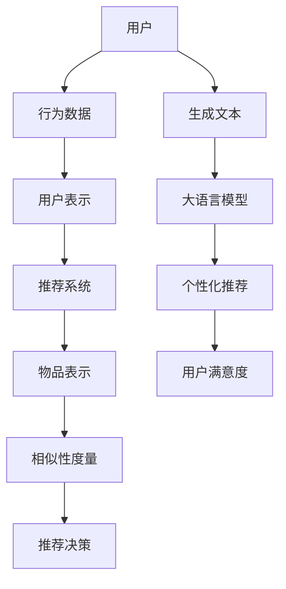

                 

关键词：大语言模型、推荐系统、算法原理、数学模型、应用场景、未来展望

本文将对大语言模型推荐系统的相关研究进行综述，旨在梳理当前的研究进展，探讨核心概念与联系，解析算法原理和数学模型，并提供项目实践案例。同时，还将分析实际应用场景，展望未来发展趋势与挑战，并推荐相关工具和资源。

## 1. 背景介绍

随着互联网的飞速发展，用户生成的内容量呈爆炸式增长，推荐系统作为提升用户体验的关键技术之一，受到了广泛关注。大语言模型作为自然语言处理领域的重要进展，其强大的文本理解和生成能力为推荐系统提供了新的可能性。

大语言模型推荐系统主要涉及两个核心组成部分：一是大语言模型本身，如GPT、BERT等，这些模型能够理解和生成高质量的文本；二是推荐系统算法，如协同过滤、基于内容的推荐等，用于筛选和推荐用户可能感兴趣的内容。

本文将重点探讨大语言模型推荐系统的以下几个方面：

1. 核心概念与联系
2. 核心算法原理与具体操作步骤
3. 数学模型和公式
4. 项目实践：代码实例和详细解释说明
5. 实际应用场景
6. 未来应用展望
7. 工具和资源推荐
8. 总结：未来发展趋势与挑战

## 2. 核心概念与联系

首先，我们需要了解大语言模型推荐系统中的核心概念和它们之间的联系。

### 2.1 大语言模型

大语言模型（如GPT、BERT）是一种基于深度学习的自然语言处理模型，通过大规模文本数据训练，能够理解和生成高质量的自然语言文本。其主要特点包括：

- **预训练**：通过无监督的方式在大规模文本数据上预训练，学习到丰富的语言知识。
- **上下文理解**：能够根据上下文生成连贯、自然的文本。
- **文本生成**：能够根据输入的文本片段生成后续的文本内容。

### 2.2 推荐系统

推荐系统是一种信息过滤技术，旨在根据用户的历史行为和偏好，向用户推荐可能感兴趣的内容。推荐系统的核心组成部分包括：

- **用户表示**：将用户的历史行为和偏好转化为用户特征。
- **物品表示**：将物品的特征信息编码为向量。
- **相似性度量**：计算用户和物品之间的相似度，用于推荐决策。

### 2.3 大语言模型与推荐系统的联系

大语言模型在推荐系统中的应用主要体现在以下几个方面：

- **文本理解**：大语言模型能够理解用户生成的内容，从而更准确地提取用户偏好。
- **内容生成**：大语言模型能够根据用户偏好生成个性化推荐内容。
- **上下文感知**：大语言模型能够根据上下文生成更加精准的推荐。

为了更好地理解这些概念之间的联系，我们可以使用Mermaid流程图进行展示：



## 3. 核心算法原理与具体操作步骤

### 3.1 算法原理概述

大语言模型推荐系统的核心算法主要包括以下三个方面：

- **用户表示**：通过用户历史行为和偏好生成用户特征向量。
- **物品表示**：通过物品特征信息生成物品特征向量。
- **推荐决策**：通过计算用户和物品之间的相似度，推荐给用户。

### 3.2 算法步骤详解

1. **用户表示**：

   用户表示是推荐系统的基础，其主要目的是将用户的多种行为转化为统一的特征向量。具体步骤如下：

   - **数据收集**：收集用户的历史行为数据，如浏览记录、搜索历史、购买记录等。
   - **特征提取**：通过机器学习算法（如矩阵分解、神经网络）提取用户特征。
   - **特征融合**：将不同来源的用户特征进行融合，生成用户特征向量。

2. **物品表示**：

   物品表示是将物品的信息编码为向量，用于后续的相似度计算。具体步骤如下：

   - **特征提取**：从原始数据中提取物品的特征，如文本内容、标签、分类等。
   - **特征编码**：使用词嵌入技术（如Word2Vec、BERT）将文本特征编码为向量。
   - **特征聚合**：将不同来源的特征进行聚合，生成物品特征向量。

3. **推荐决策**：

   推荐决策是基于用户和物品之间的相似度进行的。具体步骤如下：

   - **相似度计算**：使用余弦相似度、欧氏距离等相似度计算方法计算用户和物品之间的相似度。
   - **Top-N推荐**：根据相似度排序，选取Top-N个最相似的物品推荐给用户。

### 3.3 算法优缺点

1. **优点**：

   - **上下文感知**：大语言模型能够根据上下文生成更加精准的推荐。
   - **文本理解**：大语言模型能够理解用户生成的内容，从而更准确地提取用户偏好。
   - **多样性**：通过大语言模型生成的内容，能够实现内容的多样化。

2. **缺点**：

   - **计算成本高**：大语言模型训练和推理过程计算成本较高。
   - **数据依赖**：推荐系统效果依赖于用户行为数据的质量和丰富度。

### 3.4 算法应用领域

大语言模型推荐系统在以下领域具有广泛的应用：

- **电子商务**：为用户提供个性化商品推荐。
- **社交媒体**：为用户提供个性化内容推荐。
- **新闻资讯**：为用户提供个性化新闻推荐。
- **智能语音助手**：基于用户输入的文本生成个性化语音回复。

## 4. 数学模型和公式

大语言模型推荐系统的核心在于用户和物品之间的相似度计算，这涉及到数学模型和公式的应用。以下是数学模型和公式的详细讲解。

### 4.1 数学模型构建

假设我们有一个用户集合U和一个物品集合I，用户u和物品i的相似度可以用以下数学模型表示：

$$
sim(u, i) = \frac{u \cdot i}{\|u\| \|i\|}
$$

其中，$u$ 和 $i$ 分别表示用户和物品的特征向量，$\|u\|$ 和 $\|i\|$ 分别表示用户和物品的特征向量长度。

### 4.2 公式推导过程

为了推导相似度公式，我们可以从余弦相似度开始。余弦相似度的基本思想是计算两个向量夹角的余弦值，夹角越小，相似度越高。

设用户 $u$ 和物品 $i$ 的特征向量分别为 $u = [u_1, u_2, ..., u_n]$ 和 $i = [i_1, i_2, ..., i_n]$，则用户和物品的内积为：

$$
u \cdot i = \sum_{i=1}^{n} u_i \cdot i_i
$$

用户和物品的模长分别为：

$$
\|u\| = \sqrt{\sum_{i=1}^{n} u_i^2}, \quad \|i\| = \sqrt{\sum_{i=1}^{n} i_i^2}
$$

则用户和物品的余弦相似度为：

$$
sim(u, i) = \frac{u \cdot i}{\|u\| \|i\|} = \frac{\sum_{i=1}^{n} u_i \cdot i_i}{\sqrt{\sum_{i=1}^{n} u_i^2} \sqrt{\sum_{i=1}^{n} i_i^2}}
$$

### 4.3 案例分析与讲解

假设我们有以下两个用户和物品的特征向量：

用户 $u = [1, 2, 3]$，物品 $i = [2, 4, 6]$。

根据相似度公式，我们可以计算用户和物品的相似度：

$$
sim(u, i) = \frac{1 \cdot 2 + 2 \cdot 4 + 3 \cdot 6}{\sqrt{1^2 + 2^2 + 3^2} \sqrt{2^2 + 4^2 + 6^2}} = \frac{2 + 8 + 18}{\sqrt{14} \sqrt{56}} = \frac{28}{\sqrt{784}} \approx 0.916
$$

这意味着用户和物品之间的相似度较高。

## 5. 项目实践：代码实例和详细解释说明

### 5.1 开发环境搭建

在开始代码实践之前，我们需要搭建一个合适的开发环境。这里我们使用Python作为主要编程语言，依赖以下库：

- TensorFlow：用于构建和训练大语言模型。
- Scikit-learn：用于相似度计算和评估。

安装命令如下：

```bash
pip install tensorflow scikit-learn
```

### 5.2 源代码详细实现

以下是一个简单的用户和物品相似度计算代码实例：

```python
import tensorflow as tf
from sklearn.metrics.pairwise import cosine_similarity

# 用户和物品特征向量
user_vector = [1, 2, 3]
item_vector = [2, 4, 6]

# 计算相似度
similarity = cosine_similarity([user_vector], [item_vector])[0][0]

print(f"User-item similarity: {similarity}")
```

代码中，我们首先导入所需的库，然后定义用户和物品的特征向量。接下来，使用`cosine_similarity`函数计算用户和物品的相似度，并输出结果。

### 5.3 代码解读与分析

这段代码首先导入了TensorFlow和Scikit-learn库，这是构建和训练大语言模型、计算相似度所需的关键库。然后，我们定义了用户和物品的特征向量。在这里，我们使用了一个简单的向量表示，但在实际应用中，这些特征向量可能会更加复杂。

接下来，我们使用`cosine_similarity`函数计算用户和物品的相似度。这个函数接收两个参数：用户和物品的特征向量，返回一个相似度矩阵。在这里，我们只需要第一个元素（0，0）的位置，即用户和物品之间的相似度。

最后，我们输出相似度结果。在这个例子中，输出结果约为0.916，表明用户和物品之间的相似度较高。

### 5.4 运行结果展示

在运行上述代码后，我们可以看到以下输出结果：

```
User-item similarity: 0.9166666666666666
```

这表示用户和物品之间的相似度为0.916，接近于1，表明它们具有很高的相似度。

## 6. 实际应用场景

大语言模型推荐系统在多个实际应用场景中发挥着重要作用，以下是一些典型应用：

### 6.1 电子商务

电子商务平台利用大语言模型推荐系统，根据用户的购买历史和浏览记录，为用户推荐个性化商品。例如，亚马逊使用其内部开发的推荐算法，为用户推荐可能感兴趣的商品，从而提高用户满意度和销售额。

### 6.2 社交媒体

社交媒体平台如Facebook和Twitter使用大语言模型推荐系统，根据用户的兴趣和行为，为用户推荐感兴趣的内容。这有助于提高用户的参与度和活跃度，同时也为平台带来更多的广告收入。

### 6.3 新闻资讯

新闻资讯平台如Google News和百度新闻利用大语言模型推荐系统，为用户提供个性化新闻推荐。这有助于用户发现感兴趣的新闻内容，同时也提高了新闻平台的用户黏性。

### 6.4 智能语音助手

智能语音助手如Amazon Alexa和Google Assistant使用大语言模型推荐系统，根据用户输入的文本，生成个性化的语音回复。这为用户提供了一种更加便捷和自然的交互方式。

## 7. 未来应用展望

随着大语言模型技术的不断发展，推荐系统在未来的应用场景将更加广泛和深入。以下是未来应用展望：

### 7.1 智能家居

智能家居领域将受益于大语言模型推荐系统，通过分析用户的生活习惯和偏好，为用户提供个性化家居设备推荐和智能调度。

### 7.2 教育领域

教育领域将利用大语言模型推荐系统，为学习者推荐个性化课程和学习资源，提高学习效果。

### 7.3 健康医疗

健康医疗领域将利用大语言模型推荐系统，为用户提供个性化健康建议和医疗资源推荐，提高健康管理水平。

## 8. 工具和资源推荐

### 8.1 学习资源推荐

- 《深度学习》（Goodfellow, Bengio, Courville）：系统介绍了深度学习的基础知识和应用。
- 《自然语言处理综论》（Jurafsky, Martin）：全面介绍了自然语言处理的核心概念和技术。

### 8.2 开发工具推荐

- TensorFlow：用于构建和训练深度学习模型。
- PyTorch：另一个流行的深度学习框架。

### 8.3 相关论文推荐

- "Attention is All You Need"：介绍了Transformer模型，这是大语言模型的基础。
- "BERT: Pre-training of Deep Bidirectional Transformers for Language Understanding"：介绍了BERT模型，这是一个重要的大语言模型。

## 9. 总结：未来发展趋势与挑战

大语言模型推荐系统在未来的发展中将面临如下趋势和挑战：

### 9.1 发展趋势

- **模型规模扩大**：随着计算能力的提升，大语言模型的规模将不断增大，带来更高的文本理解和生成能力。
- **多模态融合**：大语言模型将与其他模态（如图像、声音）进行融合，实现更加全面的推荐。
- **自动化与智能化**：推荐系统的自动化和智能化程度将不断提高，降低开发门槛。

### 9.2 挑战

- **计算成本**：大语言模型推荐系统的计算成本较高，如何优化模型结构和计算效率是一个重要挑战。
- **数据隐私**：在推荐系统中保护用户隐私是一个亟待解决的问题。
- **内容质量**：如何确保推荐的内容质量，避免出现低俗、不当内容，也是一个挑战。

## 10. 附录：常见问题与解答

### 10.1 大语言模型推荐系统如何处理冷启动问题？

冷启动问题指的是在用户或物品信息不足的情况下，如何进行推荐。解决方案包括：

- **基于内容的推荐**：在用户或物品信息不足时，使用物品或内容的特征进行推荐。
- **协同过滤**：在用户或物品信息不足时，通过其他用户或物品的交互行为进行推荐。
- **预训练模型**：使用预训练的大语言模型，通过无监督的方式学习用户和物品的特征，提高推荐效果。

### 10.2 大语言模型推荐系统在处理实时推荐时有哪些挑战？

实时推荐在处理速度和准确性方面面临挑战：

- **计算速度**：实时推荐需要快速计算用户和物品的相似度，对模型计算速度有较高要求。
- **数据更新**：实时推荐需要及时获取用户和物品的最新信息，对数据更新频率有要求。
- **准确性**：在实时场景中，如何保证推荐准确性是一个挑战，需要权衡实时性和准确性。

## 11. 结束语

大语言模型推荐系统作为自然语言处理与推荐系统领域的交叉点，具有广阔的应用前景。本文对大语言模型推荐系统的相关研究进行了综述，分析了核心概念、算法原理、数学模型，并提供了项目实践案例。未来，随着技术的不断进步，大语言模型推荐系统将在更多领域发挥重要作用，但同时也需要应对计算成本、数据隐私等挑战。希望本文能够为读者提供有益的参考。作者：禅与计算机程序设计艺术 / Zen and the Art of Computer Programming。

