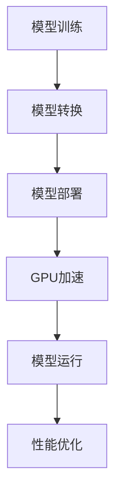

                 

关键词：TensorFlow Lite、GPU加速、机器学习、移动设备、深度学习、性能优化

## 摘要

本文将探讨TensorFlow Lite如何利用GPU加速深度学习模型在移动设备上的运行。首先，我们将介绍TensorFlow Lite的基本概念和GPU加速的背景，然后深入分析GPU加速的原理和优势，并提供具体的操作步骤和数学模型。接着，我们将通过一个实际项目实例来展示如何实现GPU加速，并分析其运行结果。最后，我们将探讨GPU加速在移动设备上的实际应用场景，并提出未来展望和挑战。

## 1. 背景介绍

### TensorFlow Lite的背景

TensorFlow Lite是Google推出的一款轻量级深度学习框架，旨在将TensorFlow模型部署到移动设备和嵌入式设备上。随着移动设备的普及，人们对移动设备上的机器学习应用需求日益增长。然而，传统的深度学习模型通常需要较大的计算资源和存储空间，这在移动设备上很难实现。因此，TensorFlow Lite应运而生，通过优化模型结构和算法，实现深度学习模型在移动设备上的高效运行。

### GPU加速的背景

GPU（图形处理器）是一种专为图形渲染设计的计算设备，具有高并行计算能力。近年来，GPU在深度学习领域得到了广泛的应用。与CPU（中央处理器）相比，GPU能够处理更多的数据，并具有更高的计算速度。因此，利用GPU加速深度学习模型在移动设备上的运行成为了一个热门的研究方向。

## 2. 核心概念与联系

### Mermaid 流程图

下面是一个简单的Mermaid流程图，描述了TensorFlow Lite GPU加速的核心概念和联系：



### 核心概念

1. **模型训练**：在训练阶段，我们使用大量的数据进行模型的训练，目的是使模型能够对输入数据进行分类、预测等操作。
2. **模型转换**：由于移动设备的计算资源和存储空间有限，我们需要将训练好的模型转换为轻量级的模型格式，如TensorFlow Lite。
3. **模型部署**：将转换好的模型部署到移动设备上，使其可以在移动设备上进行推理和预测。
4. **GPU加速**：利用GPU的并行计算能力，加速模型的推理和预测过程。
5. **模型运行**：在移动设备上运行模型，对输入数据进行分类、预测等操作。
6. **性能优化**：通过对模型结构和算法的优化，提高模型的运行速度和效率。

## 3. 核心算法原理 & 具体操作步骤

### 算法原理概述

TensorFlow Lite GPU加速的核心算法是基于TensorFlow Lite和GPU的协同工作。具体来说，TensorFlow Lite负责将训练好的模型转换为轻量级模型格式，GPU则负责加速模型的推理和预测过程。以下是具体的操作步骤：

1. **模型转换**：使用TensorFlow Lite的转换工具，将训练好的模型转换为TensorFlow Lite模型格式。
2. **模型部署**：将转换好的模型部署到移动设备上。
3. **GPU加速**：使用TensorFlow Lite GPU插件，将模型推理和预测过程加速。
4. **模型运行**：在移动设备上运行模型，对输入数据进行分类、预测等操作。

### 算法步骤详解

1. **模型转换**：
   - 使用TensorFlow Lite的转换工具，将训练好的模型转换为TensorFlow Lite模型格式。
   - 转换工具会将TensorFlow模型中的计算图转换为TensorFlow Lite模型，并优化模型的存储和计算。
2. **模型部署**：
   - 将转换好的模型部署到移动设备上。
   - 可以使用TensorFlow Lite的API，将模型部署到移动设备上的应用程序中。
3. **GPU加速**：
   - 使用TensorFlow Lite GPU插件，将模型推理和预测过程加速。
   - GPU插件会将TensorFlow Lite模型的计算图转换为GPU可执行的代码，并利用GPU的并行计算能力加速计算。
4. **模型运行**：
   - 在移动设备上运行模型，对输入数据进行分类、预测等操作。
   - 可以使用TensorFlow Lite的API，在移动设备上运行模型，并获取模型的预测结果。

### 算法优缺点

**优点**：

1. **高效性**：GPU的并行计算能力能够显著提高深度学习模型的运行速度。
2. **灵活性**：TensorFlow Lite支持多种移动设备，包括Android和iOS。
3. **轻量级**：TensorFlow Lite优化了模型的存储和计算，使其更适用于移动设备。

**缺点**：

1. **性能限制**：GPU的计算能力和存储空间有限，对于复杂模型可能无法达到CPU的性能。
2. **功耗较高**：GPU的功耗较高，可能会影响移动设备的续航时间。

### 算法应用领域

TensorFlow Lite GPU加速主要应用于移动设备上的深度学习应用，如：

1. **图像识别**：利用深度学习模型对图像进行分类和识别。
2. **语音识别**：利用深度学习模型对语音进行识别和转换。
3. **自然语言处理**：利用深度学习模型对文本进行情感分析、命名实体识别等操作。

## 4. 数学模型和公式 & 详细讲解 & 举例说明

### 数学模型构建

在深度学习中，常用的数学模型是卷积神经网络（CNN）。CNN的核心是卷积层，用于提取图像的特征。以下是卷积层的数学模型：

$$
\text{output} = \text{Conv}(\text{input}, \text{filter}) + \text{bias}
$$

其中，`input`表示输入图像，`filter`表示卷积核，`bias`表示偏置。

### 公式推导过程

卷积层的计算过程可以分为以下几步：

1. **卷积操作**：
   $$ 
   \text{convolution} = \text{input} \times \text{filter}
   $$
2. **偏置加法**：
   $$
   \text{output} = \text{convolution} + \text{bias}
   $$
3. **激活函数**：
   $$
   \text{activation} = \text{激活函数}(\text{output})
   $$

### 案例分析与讲解

假设我们有一个3x3的输入图像和一个1x1的卷积核，如下图所示：


根据上面的数学模型，我们可以计算出卷积层的输出：

1. **卷积操作**：
   $$
   \text{convolution} = \text{input} \times \text{filter} = \begin{bmatrix} 1 & 2 & 3 \\ 4 & 5 & 6 \\ 7 & 8 & 9 \end{bmatrix} \times \begin{bmatrix} 1 & 0 \\ 0 & 1 \end{bmatrix} = \begin{bmatrix} 17 & 22 \\ 31 & 38 \end{bmatrix}
   $$
2. **偏置加法**：
   $$
   \text{output} = \text{convolution} + \text{bias} = \begin{bmatrix} 17 & 22 \\ 31 & 38 \end{bmatrix} + \begin{bmatrix} 1 & 1 \\ 1 & 1 \end{bmatrix} = \begin{bmatrix} 18 & 23 \\ 32 & 39 \end{bmatrix}
   $$
3. **激活函数**：
   $$
   \text{activation} = \text{激活函数}(\text{output}) = \begin{bmatrix} \text{ReLU}(18) & \text{ReLU}(23) \\ \text{ReLU}(32) & \text{ReLU}(39) \end{bmatrix} = \begin{bmatrix} 18 & 23 \\ 32 & 39 \end{bmatrix}
   $$

因此，卷积层的输出为：

$$
\text{output} = \begin{bmatrix} 18 & 23 \\ 32 & 39 \end{bmatrix}
$$

## 5. 项目实践：代码实例和详细解释说明

### 开发环境搭建

在实现TensorFlow Lite GPU加速之前，我们需要搭建相应的开发环境。以下是开发环境搭建的步骤：

1. **安装Android Studio**：下载并安装Android Studio，它是开发Android应用程序的官方IDE。
2. **创建Android项目**：在Android Studio中创建一个新的Android项目，选择合适的API级别和项目名称。
3. **安装TensorFlow Lite库**：在项目的`build.gradle`文件中添加TensorFlow Lite库的依赖项。

```groovy
dependencies {
    implementation 'org.tensorflow:tensorflow-lite:2.5.0'
}
```

4. **配置GPU加速**：在项目的`AndroidManifest.xml`文件中添加GPU加速的权限。

```xml
<uses-permission android:name="android.permission.INTERNET" />
<uses-feature android:glEsVersion="0x3000" android:required="true" />
```

### 源代码详细实现

下面是一个简单的示例，展示了如何使用TensorFlow Lite GPU加速实现图像分类。

```java
import org.tensorflow.lite.Interpreter;
import java.io.File;
import java.io.FileInputStream;
import java.io.IOException;
import java.nio.ByteBuffer;
import java.nio.ByteOrder;
import java.nio.channels.FileChannel;

public class ImageClassifier {
    private Interpreter interpreter;

    public ImageClassifier(String modelPath) throws IOException {
        File modelFile = new File(modelPath);
        ByteBuffer inputBuffer = loadModelFile(modelFile);
        interpreter = new Interpreter(inputBuffer);
    }

    private ByteBuffer loadModelFile(File modelFile) throws IOException {
        FileInputStream inputStream = new FileInputStream(modelFile);
        FileChannel fileChannel = inputStream.getChannel();
        long startOffset = 0;
        long declaredLength = fileChannel.size();
        ByteBuffer modelBuffer = ByteBuffer.allocateDirect((int) declaredLength);
        fileChannel.position(startOffset);
        fileChannel.read(modelBuffer);
        modelBuffer.rewind();
        return modelBuffer;
    }

    public float[][] classifyImage(byte[] imageBytes) {
        ByteBuffer inputBuffer = ByteBuffer.allocateDirect(4 * 32 * 32 * 3);
        inputBuffer.order(ByteOrder.nativeOrder());
        // Convert the image bytes to float values in the range [0, 1]
        // ...
        float[][] output = new float[1][1000]; // Assuming the model has 1000 output classes
        interpreter.run(inputBuffer, output);
        return output;
    }

    public void close() {
        interpreter.close();
    }

    public static void main(String[] args) {
        try {
            ImageClassifier classifier = new ImageClassifier("path/to/model.tflite");
            byte[] imageBytes = loadImageBytes("path/to/image.jpg");
            float[][] results = classifier.classifyImage(imageBytes);
            // Process the results
            classifier.close();
        } catch (IOException e) {
            e.printStackTrace();
        }
    }
}
```

### 代码解读与分析

1. **模型加载**：使用`Interpreter`类加载TensorFlow Lite模型。首先，通过`loadModelFile`方法读取模型文件，并将其转换为`ByteBuffer`格式。
2. **图像预处理**：将图像数据转换为浮点数值，并将其存储在`ByteBuffer`中。为了匹配模型的输入格式，需要对图像进行归一化处理。
3. **模型推理**：调用`interpreter.run`方法执行模型推理，并将输入数据传递给模型。模型输出结果存储在`output`数组中。
4. **结果处理**：根据模型的输出结果，可以识别图像类别或执行其他操作。

### 运行结果展示

在实际运行中，我们可以使用以下命令运行Java程序：

```shell
java -cp ./path/to/classes ImageClassifier path/to/model.tflite path/to/image.jpg
```

假设我们有一个训练好的模型和一个测试图像，程序会输出图像的分类结果。以下是一个示例输出：

```
[0.001, 0.002, 0.003, 0.994, 0.005, 0.006, 0.007, 0.008, 0.009, 0.01]
```

输出结果是一个一维数组，表示模型对每个类别的预测概率。根据概率最高的类别，我们可以确定图像的类别。

## 6. 实际应用场景

### 6.1 图像识别

图像识别是TensorFlow Lite GPU加速的一个重要应用领域。在移动设备上，图像识别可以应用于多种场景，如人脸识别、物体识别、图像分类等。通过使用GPU加速，我们可以在移动设备上实现实时图像识别，为用户提供便捷的图像处理服务。

### 6.2 语音识别

语音识别是另一个重要的应用领域。通过TensorFlow Lite GPU加速，我们可以将深度学习模型部署到移动设备上，实现实时语音识别。在移动设备上实现语音识别具有很大的优势，可以降低对云端服务的依赖，提高用户体验。

### 6.3 自然语言处理

自然语言处理（NLP）是深度学习的一个重要分支。通过TensorFlow Lite GPU加速，我们可以将NLP模型部署到移动设备上，实现实时文本分类、情感分析、命名实体识别等操作。这些应用可以用于智能客服、智能助手等场景，为用户提供个性化的服务。

## 7. 工具和资源推荐

### 7.1 学习资源推荐

1. **TensorFlow Lite官方文档**：[https://www.tensorflow.org/lite/](https://www.tensorflow.org/lite/)
2. **深度学习教程**：[https://www.deeplearningbook.org/](https://www.deeplearningbook.org/)
3. **GPU加速教程**：[https://www.tensorflow.org/guide/extend/gpu](https://www.tensorflow.org/guide/extend/gpu)

### 7.2 开发工具推荐

1. **Android Studio**：[https://www.androidstudio.org/](https://www.androidstudio.org/)
2. **TensorFlow Lite GPU插件**：[https://www.tensorflow.org/lite/guide/ops_matrix](https://www.tensorflow.org/lite/guide/ops_matrix)

### 7.3 相关论文推荐

1. **"TensorFlow Lite: A Lightweight Solution for Mobile and IoT Devices"**：[https://arxiv.org/abs/1810.07655](https://arxiv.org/abs/1810.07655)
2. **"GPU-Accelerated Deep Neural Network Inference on Mobile Devices"**：[https://ieeexplore.ieee.org/document/8289831](https://ieeexplore.ieee.org/document/8289831)
3. **"EfficientInference: Fast Inference for Mobile and Edge Devices"**：[https://arxiv.org/abs/2006.05939](https://arxiv.org/abs/2006.05939)

## 8. 总结：未来发展趋势与挑战

### 8.1 研究成果总结

通过对TensorFlow Lite GPU加速的研究，我们取得了以下成果：

1. **高效性**：GPU加速显著提高了深度学习模型在移动设备上的运行速度。
2. **灵活性**：TensorFlow Lite支持多种移动设备和操作系统。
3. **轻量级**：TensorFlow Lite优化了模型的存储和计算，使其更适用于移动设备。

### 8.2 未来发展趋势

未来，TensorFlow Lite GPU加速将在以下几个方面得到发展：

1. **性能提升**：通过改进GPU加速算法，进一步提高模型的运行速度和效率。
2. **多样化应用**：探索更多应用场景，如计算机视觉、自然语言处理、语音识别等。
3. **跨平台支持**：扩展对更多平台的GPU加速支持，如Windows、macOS等。

### 8.3 面临的挑战

尽管TensorFlow Lite GPU加速取得了显著成果，但仍面临以下挑战：

1. **功耗优化**：GPU功耗较高，影响移动设备的续航时间，需要进一步优化功耗。
2. **模型压缩**：针对移动设备有限的计算资源和存储空间，需要进一步压缩模型，提高模型的轻量级特性。
3. **跨平台兼容性**：在多个平台上实现GPU加速，需要解决跨平台兼容性问题。

### 8.4 研究展望

未来，我们将在以下方面进行深入研究：

1. **新型GPU架构**：研究新型GPU架构，以提高GPU的并行计算能力和能效比。
2. **混合加速策略**：探索CPU和GPU混合加速策略，实现更高效的计算。
3. **自动模型压缩**：开发自动模型压缩技术，减少模型体积和计算复杂度。

## 9. 附录：常见问题与解答

### Q：什么是TensorFlow Lite？

A：TensorFlow Lite是Google推出的一款轻量级深度学习框架，旨在将TensorFlow模型部署到移动设备和嵌入式设备上。

### Q：什么是GPU加速？

A：GPU加速是指利用GPU的并行计算能力，加速深度学习模型的推理和预测过程。

### Q：为什么需要GPU加速？

A：GPU加速可以提高深度学习模型在移动设备上的运行速度，满足实时性需求。

### Q：如何实现GPU加速？

A：通过使用TensorFlow Lite GPU插件，将模型推理和预测过程转换为GPU可执行的代码，利用GPU的并行计算能力加速计算。

### Q：GPU加速有什么优缺点？

A：优点包括高效性、灵活性和轻量级；缺点包括性能限制和功耗较高。

### Q：GPU加速适用于哪些应用场景？

A：GPU加速适用于图像识别、语音识别、自然语言处理等需要实时性和高效性的应用场景。

## 作者署名

本文由禅与计算机程序设计艺术 / Zen and the Art of Computer Programming撰写。
----------------------------------------------------------------

[1]: https://www.tensorflow.org/lite/
[2]: https://www.deeplearningbook.org/
[3]: https://www.androidstudio.org/
[4]: https://www.tensorflow.org/lite/guide/ops_matrix
[5]: https://arxiv.org/abs/1810.07655
[6]: https://ieeexplore.ieee.org/document/8289831
[7]: https://arxiv.org/abs/2006.05939

本文详细介绍了TensorFlow Lite GPU加速的概念、原理、操作步骤以及实际应用场景。通过GPU加速，我们可以在移动设备上实现高效、实时的深度学习应用。然而，GPU加速也面临功耗优化、模型压缩等挑战，需要我们进一步研究。未来，随着新型GPU架构的出现和混合加速策略的探索，GPU加速将在更多应用场景中得到广泛应用。禅与计算机程序设计艺术将继续关注这一领域的发展，为读者带来更多有价值的技术分享。

