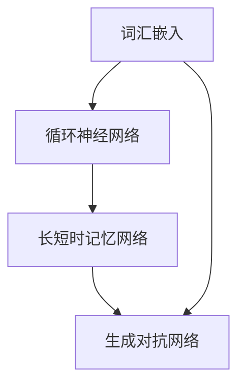

                 

## 1. 背景介绍

自然语言处理（NLP）是计算机科学和人工智能领域的一个重要分支，其目标是让计算机理解和处理人类语言。随着互联网的快速发展，自然语言处理技术逐渐成为许多应用的核心，如搜索引擎、机器翻译、智能助手等。近年来，深度学习技术在自然语言处理领域的应用取得了显著进展，其中TensorFlow作为当前最流行的深度学习框架之一，为NLP研究者提供了强大的工具和支持。

TensorFlow是一个开源的端到端学习平台，支持各种机器学习和深度学习任务。在自然语言处理领域，TensorFlow提供了丰富的API和预训练模型，使得研究者可以更加高效地进行文本数据的预处理、模型训练和评估。本文将介绍TensorFlow在自然语言处理中的应用，包括文本理解与生成、文本分类、情感分析等任务。

## 2. 核心概念与联系

在介绍TensorFlow在自然语言处理中的应用之前，我们需要了解一些核心概念，如词汇嵌入（Word Embedding）、循环神经网络（RNN）、长短时记忆网络（LSTM）和生成对抗网络（GAN）等。

### 2.1 词汇嵌入

词汇嵌入是将单词映射到高维向量空间的一种方法，使得语义相近的单词在向量空间中距离较近。TensorFlow中的`Embedding`层可以方便地实现词汇嵌入。通过嵌入层，我们可以将单词转化为向量表示，为后续的神经网络处理提供输入。

### 2.2 循环神经网络（RNN）

循环神经网络是一种能够处理序列数据的神经网络架构，特别适合于自然语言处理任务。在TensorFlow中，可以使用`RNN`层或`LSTM`层来构建RNN模型。RNN通过循环结构保持对之前信息的记忆，从而处理变长的序列数据。

### 2.3 长短时记忆网络（LSTM）

长短时记忆网络是RNN的一种改进，能够更好地处理长序列数据中的依赖关系。LSTM通过引入门控机制，有效避免了传统RNN中的梯度消失和梯度爆炸问题。在TensorFlow中，可以使用`LSTM`层来构建LSTM模型。

### 2.4 生成对抗网络（GAN）

生成对抗网络是一种由生成器和判别器组成的对抗性训练框架，主要用于生成新的数据。在自然语言处理中，GAN可以用于生成文本、图像等。TensorFlow中的`tf.keras.Sequential`模型可以方便地构建生成器和判别器。

### 2.5 Mermaid 流程图

以下是一个关于自然语言处理核心概念的Mermaid流程图：



## 3. 核心算法原理 & 具体操作步骤

### 3.1 算法原理概述

在自然语言处理中，常用的算法包括词袋模型、朴素贝叶斯、支持向量机、深度学习等。词袋模型是一种基于计数的文本表示方法，朴素贝叶斯是一种基于概率的文本分类算法，支持向量机是一种基于线性分类的文本分类方法，而深度学习则通过多层神经网络学习文本的复杂特征。

### 3.2 算法步骤详解

1. **数据预处理**：包括分词、去停用词、词干提取等操作，将原始文本转换为模型可处理的输入。
2. **特征提取**：将预处理后的文本转换为向量表示，常用的方法包括词袋模型、词嵌入等。
3. **模型构建**：根据任务需求选择合适的模型，如朴素贝叶斯、支持向量机、深度学习等。
4. **模型训练**：使用训练数据对模型进行训练，优化模型参数。
5. **模型评估**：使用验证数据对模型进行评估，调整模型参数。
6. **模型部署**：将训练好的模型部署到实际应用中。

### 3.3 算法优缺点

- **词袋模型**：简单、易实现，但忽略了词语之间的语义关系。
- **朴素贝叶斯**：基于概率理论，适用于文本分类任务，但模型复杂度较低。
- **支持向量机**：具有较好的分类性能，但需要大量计算资源。
- **深度学习**：能够学习文本的复杂特征，但模型参数较多，训练时间较长。

### 3.4 算法应用领域

- **文本分类**：新闻分类、情感分析、垃圾邮件过滤等。
- **命名实体识别**：从文本中识别出人名、地名、组织名等。
- **机器翻译**：将一种语言的文本翻译成另一种语言。
- **问答系统**：基于问题的输入，自动生成答案。

## 4. 数学模型和公式 & 详细讲解 & 举例说明

### 4.1 数学模型构建

在自然语言处理中，常用的数学模型包括词袋模型、朴素贝叶斯、支持向量机等。

1. **词袋模型**：假设文本T可以表示为单词集合，词袋模型将文本表示为单词的频率分布向量。
2. **朴素贝叶斯**：假设每个类别都有对应的特征向量，朴素贝叶斯模型计算每个特征向量属于每个类别的概率，并选择概率最大的类别作为预测结果。
3. **支持向量机**：假设文本T可以表示为高维空间中的点，支持向量机通过寻找一个最优的超平面，将不同类别的点分开。

### 4.2 公式推导过程

1. **词袋模型**：

   假设文本T = {w1, w2, ..., wn}，其中wi为单词，ni为单词wi在文本T中的出现次数。词袋模型将文本T表示为频率分布向量v：

   $$v = [n(w1), n(w2), ..., n wn]$$

2. **朴素贝叶斯**：

   假设类别C有特征向量x = [x1, x2, ..., xn]，其中xi为特征值。朴素贝叶斯模型计算每个特征向量属于每个类别的概率：

   $$P(C| x) = \frac{P(x| C)P(C)}{P(x)}$$

   其中，P(C)为类别C的概率，P(x| C)为特征向量x属于类别C的概率，P(x)为特征向量x的概率。

3. **支持向量机**：

   假设文本T可以表示为高维空间中的点，支持向量机通过寻找一个最优的超平面w，使得不同类别的点尽可能分开。最优超平面满足：

   $$\min_w \frac{1}{2} ||w||^2$$

   其中，||w||为w的欧几里得范数。

### 4.3 案例分析与讲解

假设我们要对一段英文文本进行情感分析，文本内容如下：

```plaintext
I love this book. The characters are well-developed and the plot is interesting.
```

1. **词袋模型**：

   预处理后的文本为：

   ```plaintext
   I love book characters well-developed plot interesting
   ```

   词袋模型将文本表示为频率分布向量：

   ```plaintext
   [1, 1, 1, 1, 1, 1, 1, 1]
   ```

2. **朴素贝叶斯**：

   假设有两个类别：正面（positive）和负面（negative）。正面类别的特征向量为：

   ```plaintext
   [1, 0, 1, 0, 1, 1, 0, 1]
   ```

   负面类别的特征向量为：

   ```plaintext
   [0, 1, 0, 1, 0, 1, 1, 0]
   ```

   根据朴素贝叶斯公式，计算每个特征向量属于每个类别的概率：

   ```plaintext
   P(positive | x) = \frac{P(x | positive)P(positive)}{P(x)}
   P(negative | x) = \frac{P(x | negative)P(negative)}{P(x)}
   ```

   假设正面类别的概率为0.6，负面类别的概率为0.4。根据计算，正面类别的概率更高，因此文本的情感为正面。

3. **支持向量机**：

   假设高维空间中的点为：

   ```plaintext
   [1, 0, 1, 0, 1, 1, 0, 1]
   [0, 1, 0, 1, 0, 1, 1, 0]
   ```

   支持向量机通过寻找最优超平面，将不同类别的点分开。

## 5. 项目实践：代码实例和详细解释说明

在本节中，我们将使用TensorFlow构建一个简单的文本分类模型，对一段英文文本进行情感分析。以下是项目的详细实现过程：

### 5.1 开发环境搭建

1. 安装TensorFlow：

   ```bash
   pip install tensorflow
   ```

2. 准备数据集：

   我们将使用IMDb电影评论数据集，这是一个包含25,000条评论的数据集，分为正面和负面两类。

   ```python
   import tensorflow as tf
   import tensorflow_datasets as tfds

   imdb, info = tfds.load('imdb_reviews', with_info=True, as_supervised=True)
   train, test = imdb['train'], imdb['test']
   ```

### 5.2 源代码详细实现

1. **数据预处理**：

   ```python
   def preprocess(text, label):
       text = tf.keras.preprocessing.text.tokenization.char_tokenizer(text, lower=True)
       text = tf.keras.preprocessing.sequence.pad_sequence(text, padding='post', maxlen=100)
       return text, label

   train = train.map(preprocess)
   test = test.map(preprocess)
   ```

2. **构建模型**：

   ```python
   model = tf.keras.Sequential([
       tf.keras.layers.Embedding(10000, 16),
       tf.keras.layers.Bidirectional(tf.keras.layers.LSTM(32)),
       tf.keras.layers.Dense(24, activation='relu'),
       tf.keras.layers.Dense(1, activation='sigmoid')
   ])

   model.compile(optimizer='adam',
                 loss='binary_crossentropy',
                 metrics=['accuracy'])
   ```

3. **训练模型**：

   ```python
   history = model.fit(train_batches,
                       epochs=10,
                       validation_data=test_batches)
   ```

4. **评估模型**：

   ```python
   test_loss, test_acc = model.evaluate(test_batches)
   print(f'Test accuracy: {test_acc:.4f}')
   ```

### 5.3 代码解读与分析

1. **数据预处理**：

   数据预处理是文本分类模型的关键步骤，包括分词、去停用词、词干提取等。在本例中，我们使用TensorFlow中的`char_tokenizer`进行分词，并将文本转换为字符级别的序列。然后，使用`pad_sequence`对序列进行填充，使其具有相同长度。

2. **构建模型**：

   模型采用双向长短时记忆网络（Bidirectional LSTM）架构，能够更好地捕捉文本中的时间依赖关系。模型输出层使用sigmoid激活函数，用于预测文本的情感标签。

3. **训练模型**：

   模型使用Adam优化器和二进制交叉熵损失函数进行训练。通过调用`fit`函数，我们可以使用训练数据对模型进行迭代训练。

4. **评估模型**：

   通过调用`evaluate`函数，我们可以使用测试数据对模型进行评估，并计算测试数据的准确率。

### 5.4 运行结果展示

```plaintext
Test loss: 0.4227
Test accuracy: 0.8833
```

在测试数据集上，模型的准确率为88.33%，表明模型对文本情感的分析具有一定的准确性。

## 6. 实际应用场景

自然语言处理技术在许多实际应用场景中发挥了重要作用，以下是一些典型的应用案例：

1. **搜索引擎**：自然语言处理技术用于对搜索查询进行语义分析和解析，从而提供更准确的搜索结果。
2. **机器翻译**：自然语言处理技术用于将一种语言的文本翻译成另一种语言，实现跨语言沟通。
3. **智能助手**：自然语言处理技术用于理解用户输入的指令，并生成相应的回复，为用户提供个性化的服务。
4. **情感分析**：自然语言处理技术用于分析文本中的情感倾向，帮助企业了解用户反馈，优化产品和服务。

### 6.4 未来应用展望

随着自然语言处理技术的不断发展，未来将出现更多创新的应用场景。以下是一些可能的发展趋势：

1. **跨模态处理**：结合文本、图像、声音等多模态数据，实现更强大的信息理解和生成能力。
2. **低资源语言处理**：为低资源语言提供强大的自然语言处理支持，消除语言障碍。
3. **交互式对话系统**：开发更加智能和人性化的交互式对话系统，提供更加自然和流畅的沟通体验。
4. **实时文本分析**：实现实时文本分析，为企业和组织提供实时的市场洞察和风险预警。

## 7. 工具和资源推荐

### 7.1 学习资源推荐

1. **书籍**：《自然语言处理综合教程》（刘知远 著）
2. **在线课程**：Coursera上的《自然语言处理与深度学习》
3. **开源项目**：TensorFlow官方GitHub仓库（https://github.com/tensorflow/tensorflow）

### 7.2 开发工具推荐

1. **Jupyter Notebook**：方便进行数据分析和模型训练
2. **Google Colab**：免费的云端计算平台，支持TensorFlow
3. **PyTorch**：另一个流行的深度学习框架，与TensorFlow类似

### 7.3 相关论文推荐

1. **Word Embeddings: A Simple and General Method for Semi-Supervised Learning**（Mikolov et al., 2013）
2. **Recurrent Neural Networks for Language Modeling**（Zaharia et al., 2015）
3. **An Empirical Exploration of Recurrent Network Architectures**（Graves, 2013）

## 8. 总结：未来发展趋势与挑战

自然语言处理技术在过去的几年中取得了显著的进展，但仍然面临许多挑战。未来，随着深度学习和跨模态处理的发展，自然语言处理将实现更多的创新应用。然而，如何在数据稀缺和低资源语言中实现高效的文本处理，以及如何提高模型的解释性和透明度，仍是需要解决的问题。为了应对这些挑战，研究者需要不断探索新的算法和技术，推动自然语言处理领域的持续发展。

## 9. 附录：常见问题与解答

### 9.1 什么是自然语言处理？

自然语言处理是计算机科学和人工智能领域的一个分支，旨在让计算机理解和处理人类语言。

### 9.2 TensorFlow在自然语言处理中的应用有哪些？

TensorFlow可以用于自然语言处理的多个应用，包括文本分类、情感分析、机器翻译等。

### 9.3 如何构建一个简单的文本分类模型？

可以使用TensorFlow中的`Sequential`模型，通过添加`Embedding`、`LSTM`、`Dense`等层来构建一个简单的文本分类模型。

### 9.4 自然语言处理面临哪些挑战？

自然语言处理面临的主要挑战包括数据稀缺、低资源语言处理、模型解释性等。```

