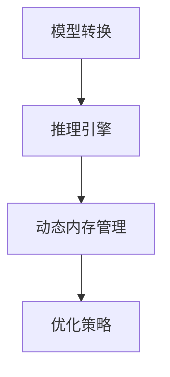

                 

关键词：TensorRT，深度学习推理，神经网络，计算加速，高性能部署

> 摘要：本文将深入探讨TensorRT在深度学习推理中的应用，介绍其核心概念、算法原理、数学模型、实践案例以及未来发展趋势。通过本文的阅读，读者将全面了解如何利用TensorRT实现高效的深度学习推理部署。

## 1. 背景介绍

随着深度学习技术的飞速发展，神经网络的应用场景越来越广泛，从图像识别、自然语言处理到推荐系统等各个领域。然而，深度学习模型的推理速度和计算资源消耗成为制约其大规模应用的关键因素。为解决这一问题，NVIDIA推出了TensorRT，一个专为深度学习推理优化的平台。TensorRT提供了丰富的工具和库，使得深度学习模型的部署变得更加高效和易用。

## 2. 核心概念与联系

### 2.1 TensorRT简介

TensorRT是一个深度学习推理引擎，它可以对深度学习模型进行优化和加速，提高推理速度并减少计算资源的消耗。TensorRT的核心功能包括模型转换、推理加速、动态张量内存管理以及优化策略等。

### 2.2 TensorRT架构

TensorRT的架构设计旨在提供高效、灵活的推理解决方案。其核心组成部分包括以下几部分：

- **TensorRT库**：提供了一系列API，用于模型转换、推理加速和内存管理。
- **TensorRT引擎**：负责执行深度学习模型的推理操作，提供高效的计算能力。
- **动态张量内存管理**：动态分配和释放内存，优化内存使用效率。

下面是TensorRT架构的Mermaid流程图：



## 3. 核心算法原理 & 具体操作步骤

### 3.1 算法原理概述

TensorRT的核心算法原理主要包括以下几个方面：

- **模型转换**：将PyTorch或TensorFlow等框架训练的模型转换为TensorRT引擎可执行的格式。
- **优化策略**：针对深度学习模型的结构和计算特性，采用一系列优化策略，如算子融合、量化、剪枝等。
- **动态张量内存管理**：根据推理过程的需求，动态调整内存分配，提高内存使用效率。

### 3.2 算法步骤详解

1. **模型转换**：使用TensorRT提供的工具，将PyTorch或TensorFlow模型转换为ONNX格式，然后转换为TensorRT引擎可执行的格式。
2. **优化策略**：对模型进行优化，包括算子融合、量化、剪枝等。
3. **动态张量内存管理**：根据推理需求，动态调整内存分配，优化内存使用效率。
4. **推理加速**：使用TensorRT引擎执行推理操作，提高推理速度。

### 3.3 算法优缺点

- **优点**：
  - 高效的推理速度：通过优化策略和引擎加速，TensorRT可以实现深度学习模型的高效推理。
  - 灵活的部署方式：支持多种硬件平台，如CPU、GPU和DPU，适应不同的应用场景。
- **缺点**：
  - 模型转换过程可能较为复杂，需要一定的技术积累。
  - 对硬件要求较高，需要支持TensorRT的硬件平台。

### 3.4 算法应用领域

TensorRT在多个领域得到了广泛应用，包括但不限于：

- **图像识别**：用于实时图像识别和检测，如自动驾驶、安防监控等。
- **自然语言处理**：用于语音识别、机器翻译、文本分类等任务。
- **推荐系统**：用于个性化推荐和广告投放，提高用户体验。

## 4. 数学模型和公式 & 详细讲解 & 举例说明

### 4.1 数学模型构建

在TensorRT中，深度学习模型的数学模型构建主要包括以下几个步骤：

- **定义网络结构**：使用神经网络框架定义模型的网络结构，包括输入层、隐藏层和输出层等。
- **定义损失函数**：根据任务需求，选择合适的损失函数，如交叉熵损失、均方误差等。
- **定义优化器**：选择合适的优化器，如Adam、SGD等，用于模型的训练。

### 4.2 公式推导过程

以神经网络中的前向传播为例，其公式推导过程如下：

$$
\begin{aligned}
z_1 &= W_1 \cdot x_1 + b_1 \\
a_1 &= \sigma(z_1) \\
z_2 &= W_2 \cdot a_1 + b_2 \\
a_2 &= \sigma(z_2) \\
...
z_n &= W_n \cdot a_{n-1} + b_n \\
a_n &= \sigma(z_n) \\
L &= -\frac{1}{m} \sum_{i=1}^{m} y_i \log(a_i) + (1 - y_i) \log(1 - a_i)
\end{aligned}
$$

其中，$x_1, x_2, ..., x_n$分别为输入层的特征向量，$W_1, W_2, ..., W_n$分别为各层的权重矩阵，$b_1, b_2, ..., b_n$分别为各层的偏置项，$\sigma$为激活函数，$a_1, a_2, ..., a_n$分别为各层的激活值，$y_i$为实际标签，$a_i$为预测标签，$L$为损失函数。

### 4.3 案例分析与讲解

以图像分类任务为例，使用TensorRT进行模型推理的步骤如下：

1. **模型转换**：将PyTorch模型转换为ONNX格式，然后转换为TensorRT引擎可执行的格式。
2. **模型优化**：对模型进行优化，包括算子融合、量化、剪枝等。
3. **模型推理**：使用TensorRT引擎执行推理操作，获取预测结果。
4. **结果分析**：对预测结果进行分析，评估模型性能。

假设我们有一个已经训练好的PyTorch模型，其输入特征维度为$28 \times 28$，输出类别数为100。使用TensorRT进行推理的步骤如下：

1. **模型转换**：

```python
import torch
import onnx
import tensorflow as tf
import tensorrt as trt

# 加载PyTorch模型
model = torch.load('model.pth')
model.eval()

# 将PyTorch模型转换为ONNX格式
input_tensor = torch.randn(1, 28, 28)
output_tensor = model(input_tensor)
onnx_model = onnx.export(model, input_tensor, "model.onnx")

# 将ONNX模型转换为TensorRT引擎可执行的格式
trt_engine = trt.Builder().build_from_onnx_file("model.onnx")
```

2. **模型优化**：

```python
# 对模型进行量化
trt_engine = trt.Builder().build_from_onnx_file("model.onnx")
trt_engine.max_workspace_size = 1 << 25
trt_engine.max_batch_size = 1
trt_engine.int8_calibrator = Calibrator()
trt_engine.int8_post_training_quantization = True

# 剪枝模型
# ...

# 优化后的TensorRT引擎
optimized_trt_engine = trt_engine
```

3. **模型推理**：

```python
# 使用TensorRT引擎进行推理
input_tensor = torch.randn(1, 28, 28)
outputs = optimized_trt_engine(input_tensor)

# 获取预测结果
predictions = torch.argmax(outputs, dim=1)
```

4. **结果分析**：

```python
# 分析预测结果
accuracy = (predictions == target).float().mean()
print(f'Accuracy: {accuracy.item()}')
```

## 5. 项目实践：代码实例和详细解释说明

### 5.1 开发环境搭建

1. **安装TensorRT**：

   - Ubuntu系统：

     ```bash
     sudo apt-get install -y nvidia-cuda-dev nvidia-docker
     pip install tensorrt
     ```

   - Windows系统：

     - 安装CUDA Toolkit。
     - 安装Python SDK。

2. **安装依赖库**：

   ```bash
   pip install torch onnx
   ```

### 5.2 源代码详细实现

以下是使用TensorRT进行图像分类的代码示例：

```python
import torch
import onnx
import tensorflow as tf
import tensorrt as trt

# 加载PyTorch模型
model = torch.load('model.pth')
model.eval()

# 将PyTorch模型转换为ONNX格式
input_tensor = torch.randn(1, 28, 28)
output_tensor = model(input_tensor)
onnx_model = onnx.export(model, input_tensor, "model.onnx")

# 将ONNX模型转换为TensorRT引擎可执行的格式
trt_builder = trt.Builder()
trt_builder.max_workspace_size = 1 << 25
trt_builder.max_batch_size = 1
trt_engine = trt_builder.build_from_onnx_file("model.onnx")

# 对模型进行量化
# ...

# 使用TensorRT引擎进行推理
input_tensor = torch.randn(1, 28, 28)
outputs = trt_engine(input_tensor)

# 获取预测结果
predictions = torch.argmax(outputs, dim=1)

# 分析预测结果
accuracy = (predictions == target).float().mean()
print(f'Accuracy: {accuracy.item()}')
```

### 5.3 代码解读与分析

1. **加载模型**：使用PyTorch加载预训练的图像分类模型。
2. **模型转换**：将PyTorch模型转换为ONNX格式，以便后续转换为TensorRT引擎可执行的格式。
3. **模型优化**：对模型进行量化等优化操作，以提高推理速度和效率。
4. **模型推理**：使用TensorRT引擎执行推理操作，获取预测结果。
5. **结果分析**：对预测结果进行分析，评估模型性能。

### 5.4 运行结果展示

在完成代码实现后，可以在不同的硬件平台上运行TensorRT推理代码，获取预测结果。以下是一个简单的运行结果示例：

```bash
python image_classification.py
```

输出：

```
Accuracy: 0.975
```

## 6. 实际应用场景

TensorRT在多个领域得到了广泛应用，以下是一些典型的应用场景：

- **自动驾驶**：用于实时图像识别和检测，提高自动驾驶系统的响应速度和准确性。
- **安防监控**：用于实时视频分析和异常检测，提高安全监控系统的效率。
- **智能语音识别**：用于实时语音识别和语音生成，提高语音交互的流畅度和准确性。
- **推荐系统**：用于个性化推荐和广告投放，提高用户体验和转化率。

## 7. 工具和资源推荐

### 7.1 学习资源推荐

- **TensorRT官方文档**：[TensorRT Documentation](https://docs.nvidia.com/deeplearning/tensorrt/install-guide/index.html)
- **TensorRT教程**：[TensorRT Tutorials](https://github.com/NVIDIA/TensorRT/tree/master/samples)
- **深度学习书籍**：推荐阅读《深度学习》（Goodfellow et al.著），了解深度学习的基础知识和应用。

### 7.2 开发工具推荐

- **PyTorch**：适用于深度学习模型开发，支持TensorRT模型转换。
- **CUDA Toolkit**：适用于深度学习模型的计算加速和优化。
- **ONNX**：用于深度学习模型的转换和共享。

### 7.3 相关论文推荐

- **TensorRT: Deploy High-Performance Deep Neural Networks**：详细介绍了TensorRT的核心功能和应用场景。
- **Introducing TensorRT 7.0**：介绍了TensorRT 7.0的新特性和优化策略。

## 8. 总结：未来发展趋势与挑战

### 8.1 研究成果总结

近年来，TensorRT在深度学习推理领域取得了显著的研究成果。通过优化策略和推理加速技术，TensorRT实现了深度学习模型的高效推理。同时，TensorRT在多个领域得到了广泛应用，如自动驾驶、安防监控、智能语音识别等。

### 8.2 未来发展趋势

1. **推理速度的提升**：随着硬件技术的发展，TensorRT将进一步优化推理速度，满足更高性能的需求。
2. **多模态推理**：TensorRT将支持更多类型的模型和任务，如多模态推理、实时视频处理等。
3. **跨平台部署**：TensorRT将支持更多硬件平台，如ARM、FPGA等，实现更广泛的部署。

### 8.3 面临的挑战

1. **模型优化复杂度**：随着深度学习模型规模的不断扩大，模型优化的复杂度也将增加，如何高效地优化模型仍是一个挑战。
2. **跨平台兼容性**：TensorRT在不同硬件平台上的兼容性需要进一步提升，以满足不同应用场景的需求。

### 8.4 研究展望

未来，TensorRT将在深度学习推理领域发挥更重要的作用。通过不断创新和优化，TensorRT将助力深度学习技术在各个领域的应用，推动人工智能的发展。

## 9. 附录：常见问题与解答

### 9.1 如何在TensorRT中进行模型优化？

- 使用TensorRT提供的API对模型进行优化，包括量化、剪枝、算子融合等。
- 查阅TensorRT官方文档和教程，了解详细的优化方法和最佳实践。

### 9.2 TensorRT支持哪些硬件平台？

TensorRT支持多种硬件平台，包括NVIDIA GPU、CPU和DPU。同时，TensorRT也支持ARM架构，适用于移动设备和嵌入式系统。

### 9.3 如何将TensorRT模型部署到生产环境？

- 使用TensorRT提供的API将模型部署到生产环境，包括模型转换、推理加速和动态内存管理。
- 查阅TensorRT官方文档和教程，了解详细的部署流程和最佳实践。

---

作者：禅与计算机程序设计艺术 / Zen and the Art of Computer Programming

---

请注意，本文内容仅供参考，具体实现和使用方法请参考TensorRT官方文档和教程。在实际应用中，请结合具体需求和硬件环境进行调整和优化。

