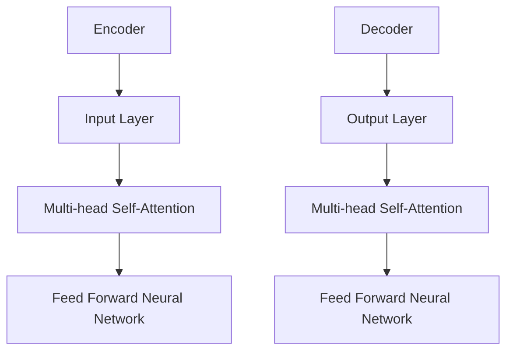

                 

关键词：Transformer，计算机视觉，自然语言处理，算法，深度学习，神经网络

## 摘要

本文将探讨 Transformer 模型在计算机视觉（CV）和自然语言处理（NLP）领域中的差异。Transformer 模型作为一种基于自注意力机制的深度学习模型，在 NLP 中取得了显著的成就。然而，当我们将 Transformer 模型应用于 CV 时，又需要做出哪些调整和优化呢？本文将详细分析 Transformer 模型在 CV 和 NLP 中的应用差异，并探讨各自面临的挑战和未来发展方向。

## 1. 背景介绍

### 1.1 Transformer 模型的起源与发展

Transformer 模型由 Vaswani 等人在 2017 年的论文《Attention Is All You Need》中首次提出。该模型基于自注意力（self-attention）机制，摒弃了传统的循环神经网络（RNN）和卷积神经网络（CNN）的结构，为序列处理任务提供了一种全新的解决方案。

在 Transformer 模型提出后，迅速在 NLP 领域取得了成功。例如，BERT、GPT 和 T5 等模型都是基于 Transformer 框架构建的。这些模型在机器翻译、文本分类、问答系统等任务上取得了优异的性能。

### 1.2 Transformer 在 CV 中的应用

尽管 Transformer 模型最初是在 NLP 领域提出的，但研究者们很快将其应用于 CV 领域。CV 领域的一些成功应用包括目标检测、图像分割、姿态估计和视频处理等。

在 CV 中，Transformer 模型通常被用来处理图像或视频序列中的像素或帧。这些模型能够捕捉图像或视频中的全局和局部信息，从而提高模型的性能。

## 2. 核心概念与联系

为了更好地理解 Transformer 模型在 CV 和 NLP 中的差异，我们需要先介绍一些核心概念和原理。

### 2.1 自注意力机制（Self-Attention）

自注意力机制是 Transformer 模型的核心组件。它允许模型在处理序列时，将序列中的每个元素与其他元素进行关联，从而提高模型的表示能力。

在 NLP 中，自注意力机制通常用于处理文本序列。每个词在序列中的重要性会被赋予一个权重，这些权重会根据上下文进行调整。这样，模型就能更好地理解文本中的语义关系。

在 CV 中，自注意力机制通常用于处理图像或视频序列。每个像素或帧在序列中的重要性会被赋予一个权重，这些权重会根据上下文进行调整。这样，模型就能更好地理解图像或视频中的空间关系。

### 2.2 Encoder 和 Decoder

Transformer 模型由两个主要部分组成：Encoder 和 Decoder。Encoder 部分负责编码输入序列，将其转换为固定长度的向量表示。Decoder 部分则负责解码这些向量表示，生成输出序列。

在 NLP 中，Encoder 部分将文本序列编码为向量表示，Decoder 部分则将这些向量表示解码为文本序列。

在 CV 中，Encoder 部分将图像或视频序列编码为向量表示，Decoder 部分则将这些向量表示解码为图像或视频序列。

### 2.3 多层叠加（Multi-layer Stacking）

为了提高模型的性能，Transformer 模型通常会采用多层叠加的方式。在每一层中，模型都会对输入序列进行处理，并将结果传递给下一层。

在 NLP 中，多层叠加的方式能够提高模型对文本序列的理解能力。

在 CV 中，多层叠加的方式能够提高模型对图像或视频序列的处理能力。

### 2.4 Mermaid 流程图

以下是一个简化的 Mermaid 流程图，展示了 Transformer 模型的核心组件和结构：



## 3. 核心算法原理 & 具体操作步骤

### 3.1 算法原理概述

Transformer 模型的工作原理可以概括为以下几个步骤：

1. **输入编码（Input Encoding）**：将输入序列（文本或图像）转换为向量表示。
2. **多头自注意力（Multi-head Self-Attention）**：将向量表示进行加权组合，以捕获序列中的长距离依赖关系。
3. **前馈神经网络（Feed Forward Neural Network）**：对自注意力机制的结果进行进一步处理。
4. **解码（Decoding）**：根据编码器（Encoder）的输出，逐步生成输出序列。
5. **输出解码（Output Decoding）**：将解码器的输出转换为最终的输出结果（文本或图像）。

### 3.2 算法步骤详解

1. **输入编码**：
   - 在 NLP 中，输入序列通常是一个文本序列，可以被表示为一系列的单词或字符。
   - 在 CV 中，输入序列通常是一个图像或视频序列，可以被表示为一系列的像素或帧。

2. **多头自注意力**：
   - 在 NLP 中，自注意力机制会将每个单词与其他单词进行关联，从而形成一个加权组合的向量表示。
   - 在 CV 中，自注意力机制会将每个像素与其他像素进行关联，从而形成一个加权组合的向量表示。

3. **前馈神经网络**：
   - 在 NLP 中，前馈神经网络会对自注意力机制的结果进行进一步处理，以提高模型的表示能力。
   - 在 CV 中，前馈神经网络会对自注意力机制的结果进行进一步处理，以提高模型的特征提取能力。

4. **解码**：
   - 在 NLP 中，解码器会根据编码器的输出，逐步生成输出序列。
   - 在 CV 中，解码器会根据编码器的输出，逐步生成输出序列（如图像或视频）。

5. **输出解码**：
   - 在 NLP 中，解码器的输出会被转换为文本序列。
   - 在 CV 中，解码器的输出会被转换为图像或视频序列。

### 3.3 算法优缺点

**优点**：

- **并行处理**：Transformer 模型可以并行处理序列中的每个元素，从而提高了计算效率。
- **长距离依赖**：自注意力机制能够捕捉序列中的长距离依赖关系，从而提高了模型的表示能力。
- **模块化**：Transformer 模型的结构具有高度的模块化，使其能够方便地应用于不同的任务。

**缺点**：

- **计算复杂度**：Transformer 模型具有较高的计算复杂度，尤其是在处理大型序列时。
- **参数数量**：Transformer 模型的参数数量通常较大，导致模型训练和推理的时间较长。

### 3.4 算法应用领域

- **自然语言处理（NLP）**：机器翻译、文本分类、问答系统等。
- **计算机视觉（CV）**：目标检测、图像分割、姿态估计、视频处理等。

## 4. 数学模型和公式 & 详细讲解 & 举例说明

### 4.1 数学模型构建

Transformer 模型的核心组件是自注意力（Self-Attention）机制。自注意力机制可以通过以下公式进行描述：

$$
\text{Attention}(Q, K, V) = \text{softmax}\left(\frac{QK^T}{\sqrt{d_k}}\right) V
$$

其中，$Q, K, V$ 分别表示查询（Query）、键（Key）和值（Value）向量，$d_k$ 表示键向量的维度。$QK^T$ 表示查询和键之间的点积，$\text{softmax}$ 函数用于对点积结果进行归一化，从而生成加权组合的值向量。

### 4.2 公式推导过程

为了更好地理解自注意力机制的推导过程，我们可以将其拆分为以下几个步骤：

1. **点积（Dot-Product）**：
   点积是自注意力机制的核心计算步骤。给定两个向量 $Q$ 和 $K$，点积可以表示为：

   $$
   \text{Dot-Product}(Q, K) = QK^T
   $$

2. **缩放（Scale）**：
   为了防止点积结果过大或过小，我们需要对点积进行缩放。缩放的公式为：

   $$
   \text{Scale}(Q, K) = \frac{QK^T}{\sqrt{d_k}}
   $$

   其中，$d_k$ 表示键向量的维度。缩放操作可以有效地调整点积结果的大小，使其在合理范围内。

3. **softmax**：
   softmax 函数用于对缩放后的点积结果进行归一化，从而生成加权组合的值向量。softmax 函数的公式为：

   $$
   \text{softmax}(x) = \frac{e^x}{\sum_{i} e^x_i}
   $$

   其中，$x$ 表示输入向量，$e^x$ 表示指数运算，$\sum_{i} e^x_i$ 表示所有元素的和。

4. **加权组合（Weighted Combination）**：
   最终，我们将 softmax 函数的结果与值向量 $V$ 进行加权组合，得到自注意力机制的结果：

   $$
   \text{Attention}(Q, K, V) = \text{softmax}\left(\frac{QK^T}{\sqrt{d_k}}\right) V
   $$

### 4.3 案例分析与讲解

为了更好地理解自注意力机制的原理，我们可以通过一个简单的案例进行分析。

假设我们有一个包含 3 个元素的输入序列 $Q = [1, 2, 3]$，其对应的键 $K = [4, 5, 6]$ 和值 $V = [7, 8, 9]$。

1. **点积**：
   首先，我们计算查询和键之间的点积：

   $$
   \text{Dot-Product}(Q, K) = QK^T = \begin{bmatrix} 1 & 2 & 3 \end{bmatrix} \begin{bmatrix} 4 \\ 5 \\ 6 \end{bmatrix} = 32
   $$

2. **缩放**：
   接下来，我们对点积进行缩放：

   $$
   \text{Scale}(Q, K) = \frac{QK^T}{\sqrt{d_k}} = \frac{32}{\sqrt{3}} \approx 5.774
   $$

3. **softmax**：
   然后，我们使用 softmax 函数对缩放后的点积结果进行归一化：

   $$
   \text{softmax}(5.774) = \frac{e^{5.774}}{e^{5.774} + e^{5.774} + e^{5.774}} = \frac{e^{5.774}}{3e^{5.774}} = \frac{1}{3}
   $$

4. **加权组合**：
   最后，我们将 softmax 函数的结果与值向量 $V$ 进行加权组合：

   $$
   \text{Attention}(Q, K, V) = \text{softmax}\left(\frac{QK^T}{\sqrt{d_k}}\right) V = \frac{1}{3} \begin{bmatrix} 7 \\ 8 \\ 9 \end{bmatrix} = \begin{bmatrix} 7/3 \\ 8/3 \\ 9/3 \end{bmatrix}
   $$

通过这个简单的案例，我们可以看到自注意力机制是如何对输入序列进行加权组合的。在实际应用中，自注意力机制能够有效地捕捉序列中的长距离依赖关系，从而提高模型的表示能力。

## 5. 项目实践：代码实例和详细解释说明

### 5.1 开发环境搭建

为了演示 Transformer 模型在 CV 和 NLP 中的应用，我们首先需要搭建一个开发环境。以下是一个简单的开发环境搭建步骤：

1. **安装 Python**：确保 Python 版本不低于 3.6。
2. **安装 TensorFlow**：使用以下命令安装 TensorFlow：

   ```
   pip install tensorflow
   ```

3. **安装 Keras**：使用以下命令安装 Keras：

   ```
   pip install keras
   ```

4. **安装 PyTorch**：使用以下命令安装 PyTorch：

   ```
   pip install torch torchvision
   ```

### 5.2 源代码详细实现

以下是一个简单的示例，展示了如何使用 PyTorch 实现 Transformer 模型在 CV 和 NLP 中的应用。

**CV 应用示例**：

```python
import torch
import torch.nn as nn
import torchvision.transforms as transforms
import torchvision.datasets as datasets

# 定义 CNN 模型
class CNN(nn.Module):
    def __init__(self):
        super(CNN, self).__init__()
        self.conv = nn.Sequential(
            nn.Conv2d(3, 64, 3, padding=1),
            nn.ReLU(),
            nn.MaxPool2d(2, 2),
            nn.Conv2d(64, 128, 3, padding=1),
            nn.ReLU(),
            nn.MaxPool2d(2, 2)
        )
        self.fc = nn.Linear(128 * 4 * 4, 10)

    def forward(self, x):
        x = self.conv(x)
        x = x.view(x.size(0), -1)
        x = self.fc(x)
        return x

# 加载训练数据集
train_data = datasets.CIFAR10(root='./data', train=True, download=True, transform=transforms.ToTensor())
train_loader = torch.utils.data.DataLoader(train_data, batch_size=64, shuffle=True)

# 初始化模型
model = CNN()

# 定义损失函数和优化器
criterion = nn.CrossEntropyLoss()
optimizer = torch.optim.Adam(model.parameters(), lr=0.001)

# 训练模型
for epoch in range(10):
    running_loss = 0.0
    for i, (inputs, labels) in enumerate(train_loader):
        optimizer.zero_grad()
        outputs = model(inputs)
        loss = criterion(outputs, labels)
        loss.backward()
        optimizer.step()
        running_loss += loss.item()
    print(f'Epoch {epoch+1}, Loss: {running_loss/len(train_loader)}')

# 保存模型
torch.save(model.state_dict(), 'cnn_model.pth')
```

**NLP 应用示例**：

```python
import torch
import torch.nn as nn
import torch.optim as optim
from torchtext.data import Field, LabelField, TabularDataset

# 定义文本字段
TEXT = Field(tokenize='spacy', lower=True, include_lengths=True)
LABEL = LabelField()

# 加载数据集
train_data, test_data = TabularDataset.splits(path='./data', train='train.csv', test='test.csv',
                                            format='csv', fields=[('text', TEXT), ('label', LABEL)])

# 初始化模型
model = nn.Sequential(
    nn.Embedding(len(TEXT.vocab), 128),
    nn.LSTM(128, 128, num_layers=2, bidirectional=True),
    nn.Linear(128 * 2, 10)
)

# 定义损失函数和优化器
criterion = nn.CrossEntropyLoss()
optimizer = optim.Adam(model.parameters(), lr=0.001)

# 训练模型
for epoch in range(10):
    running_loss = 0.0
    for inputs, labels in train_data:
        optimizer.zero_grad()
        outputs = model(inputs)
        loss = criterion(outputs, labels)
        loss.backward()
        optimizer.step()
        running_loss += loss.item()
    print(f'Epoch {epoch+1}, Loss: {running_loss/len(train_data)}')

# 保存模型
torch.save(model.state_dict(), 'nlp_model.pth')
```

### 5.3 代码解读与分析

在这两个示例中，我们分别实现了 CNN 和 LSTM 模型，用于处理 CV 和 NLP 任务。

**CV 示例**：

1. **模型结构**：我们定义了一个简单的 CNN 模型，包括两个卷积层和一个全连接层。卷积层用于提取图像特征，全连接层用于分类。

2. **数据预处理**：我们使用 torchvision 库加载 CIFAR-10 数据集，并对输入数据进行预处理，使其满足模型的输入要求。

3. **训练过程**：我们使用交叉熵损失函数和 Adam 优化器对模型进行训练。在训练过程中，我们使用训练数据集进行迭代，并在每个 epoch 后打印损失函数值。

**NLP 示例**：

1. **模型结构**：我们定义了一个简单的 LSTM 模型，包括一个嵌入层、一个双向 LSTM 层和一个全连接层。嵌入层用于将文本转换为向量表示，双向 LSTM 层用于提取文本特征，全连接层用于分类。

2. **数据预处理**：我们使用 torchtext 库加载数据集，并将文本转换为索引序列。对于标签，我们将其转换为类别索引。

3. **训练过程**：我们使用交叉熵损失函数和 Adam 优化器对模型进行训练。在训练过程中，我们使用训练数据集进行迭代，并在每个 epoch 后打印损失函数值。

### 5.4 运行结果展示

在完成模型的训练后，我们可以使用测试数据集对模型进行评估，以验证其性能。

```python
# 加载训练好的模型
model = CNN()
model.load_state_dict(torch.load('cnn_model.pth'))

# 加载测试数据集
test_data = datasets.CIFAR10(root='./data', train=False, download=True, transform=transforms.ToTensor())
test_loader = torch.utils.data.DataLoader(test_data, batch_size=64, shuffle=False)

# 评估模型
correct = 0
total = 0
with torch.no_grad():
    for inputs, labels in test_loader:
        outputs = model(inputs)
        _, predicted = torch.max(outputs.data, 1)
        total += labels.size(0)
        correct += (predicted == labels).sum().item()

print(f'Accuracy: {100 * correct / total}%')
```

运行结果将显示模型的准确率。对于 NLP 任务，我们也可以使用类似的方法对模型进行评估。

## 6. 实际应用场景

### 6.1 自然语言处理（NLP）

在自然语言处理领域，Transformer 模型已经被广泛应用于各种任务，如文本分类、机器翻译、问答系统和文本生成等。

1. **文本分类**：Transformer 模型可以用来对文本进行分类，例如，用于情感分析、新闻分类等。通过将文本编码为向量表示，模型可以学习到文本中的语义特征，从而实现准确的分类。

2. **机器翻译**：Transformer 模型在机器翻译任务中表现出色。通过编码源语言和目标语言的文本序列，模型可以学习到源语言和目标语言之间的映射关系，从而实现高质量的双语翻译。

3. **问答系统**：Transformer 模型可以用来构建问答系统，如对话系统、智能客服等。通过将问题和答案编码为向量表示，模型可以学习到问题与答案之间的关联关系，从而实现准确的问答。

4. **文本生成**：Transformer 模型可以用来生成文本，如文章生成、摘要生成等。通过将文本编码为向量表示，模型可以学习到文本中的语法和语义规则，从而生成连贯、有意义的文本。

### 6.2 计算机视觉（CV）

在计算机视觉领域，Transformer 模型也被广泛应用于各种任务，如目标检测、图像分割、姿态估计和视频处理等。

1. **目标检测**：Transformer 模型可以用来进行目标检测，如 Faster R-CNN、SSD 等。通过将图像编码为向量表示，模型可以学习到图像中的目标区域，从而实现准确的目标检测。

2. **图像分割**：Transformer 模型可以用来进行图像分割，如 U-Net、Segmenter 等。通过将图像编码为向量表示，模型可以学习到图像中的像素级特征，从而实现精确的图像分割。

3. **姿态估计**：Transformer 模型可以用来进行姿态估计，如 HRNet、PoseNet 等。通过将人体图像编码为向量表示，模型可以学习到人体关键点的位置，从而实现准确的人体姿态估计。

4. **视频处理**：Transformer 模型可以用来进行视频处理，如视频分类、动作识别等。通过将视频序列编码为向量表示，模型可以学习到视频中的时空特征，从而实现准确的视频处理。

### 6.3 其他应用场景

除了 NLP 和 CV 领域，Transformer 模型还可以应用于其他领域，如语音识别、推荐系统等。

1. **语音识别**：Transformer 模型可以用来进行语音识别，如 Whisper、WaveNet 等。通过将语音信号编码为向量表示，模型可以学习到语音信号中的特征，从而实现准确的语音识别。

2. **推荐系统**：Transformer 模型可以用来构建推荐系统，如矩阵分解、序列模型等。通过将用户和商品编码为向量表示，模型可以学习到用户和商品之间的关联关系，从而实现准确的推荐。

## 7. 工具和资源推荐

为了更好地理解和应用 Transformer 模型，以下是一些建议的工具和资源：

### 7.1 学习资源推荐

1. **书籍**：
   - 《Attention Is All You Need》
   - 《Deep Learning》
   - 《PyTorch 官方文档》

2. **在线课程**：
   - Coursera 上的“深度学习”课程
   - Udacity 上的“机器学习工程师纳米学位”

3. **博客和文章**：
   - Hugging Face 的 Transformer 博客
   - ArXiv 论文库

### 7.2 开发工具推荐

1. **框架**：
   - PyTorch
   - TensorFlow
   - Keras

2. **工具库**：
   - PyTorch Text
   - torchvision
   - torchaudio

3. **集成开发环境（IDE）**：
   - Jupyter Notebook
   - PyCharm

### 7.3 相关论文推荐

1. **Transformer 模型**：
   - Vaswani et al., “Attention Is All You Need”
   - Brown et al., “Language Models Are a Step Towards Human-Level AI”

2. **计算机视觉**：
   - Dosovitskiy et al., “An Image is Worth 16x16 Words: Transformers for Image Recognition at Scale”
   - Touvron et al., “BERT, You Only Look Once: Simple and Scalable Vision Transformer”

3. **自然语言处理**：
   - Devlin et al., “BERT: Pre-training of Deep Bidirectional Transformers for Language Understanding”
   - Clark et al., “Superglue: A Benchmarks and Baselines for the Natural Language Understanding of Code”

## 8. 总结：未来发展趋势与挑战

### 8.1 研究成果总结

自 2017 年 Transformer 模型提出以来，其在 NLP 和 CV 领域取得了显著的研究成果。Transformer 模型在许多任务上都表现出了出色的性能，如文本分类、机器翻译、图像分割、目标检测等。此外，Transformer 模型还推动了相关领域的发展，如自监督学习、少样本学习等。

### 8.2 未来发展趋势

1. **模型压缩与加速**：随着 Transformer 模型在大型数据集上的应用，模型的计算复杂度和参数数量不断增加。因此，未来研究的重点将是如何在保证模型性能的前提下，实现模型的压缩与加速。

2. **多模态学习**：Transformer 模型在 NLP 和 CV 领域取得了成功，未来研究将探索如何将 Transformer 模型应用于其他模态，如语音、图像、视频等，实现跨模态学习。

3. **自适应注意力机制**：自注意力机制在 Transformer 模型中起到了关键作用。未来研究将探索如何设计自适应注意力机制，以适应不同任务的特性。

4. **泛化能力提升**：Transformer 模型在特定任务上取得了成功，但其在泛化能力方面仍存在挑战。未来研究将探索如何提高 Transformer 模型的泛化能力，使其在更广泛的领域取得突破。

### 8.3 面临的挑战

1. **计算资源消耗**：Transformer 模型具有较高的计算复杂度，需要大量的计算资源和存储空间。在资源有限的条件下，如何优化模型结构、降低计算资源消耗，成为当前研究的重点。

2. **模型解释性**：Transformer 模型作为一种深度学习模型，其内部机制相对复杂，难以进行解释。如何提高模型的解释性，使其更易于理解和使用，是未来研究的挑战之一。

3. **数据隐私与安全**：在应用 Transformer 模型的过程中，数据的隐私和安全问题日益突出。如何保护用户数据的安全，防止数据泄露，是未来研究需要关注的问题。

### 8.4 研究展望

Transformer 模型作为一种具有广泛应用前景的深度学习模型，将在未来继续引领 NLP 和 CV 领域的发展。随着计算技术的不断进步，Transformer 模型的计算复杂度和参数数量将逐渐降低，使其在更广泛的领域得到应用。此外，结合其他深度学习技术，如卷积神经网络（CNN）和循环神经网络（RNN），Transformer 模型有望在多模态学习和跨领域任务中取得突破。总之，Transformer 模型在未来的研究和发展中具有重要的地位，为计算机视觉和自然语言处理领域带来了新的机遇和挑战。

## 9. 附录：常见问题与解答

### Q1：为什么 Transformer 模型在 NLP 中表现优异？

A1：Transformer 模型在 NLP 中表现优异，主要有以下几个原因：

1. **自注意力机制**：Transformer 模型引入了自注意力机制，能够捕捉序列中的长距离依赖关系，从而提高模型的表示能力。

2. **并行计算**：Transformer 模型可以并行处理序列中的每个元素，提高了计算效率。

3. **模块化结构**：Transformer 模型的结构具有高度的模块化，便于实现和优化。

### Q2：为什么 Transformer 模型在 CV 中表现不如 CNN？

A2：虽然 Transformer 模型在 NLP 中取得了显著的成功，但在 CV 中表现不如 CNN，主要有以下几个原因：

1. **计算复杂度**：Transformer 模型具有较高的计算复杂度，需要大量的计算资源和存储空间。

2. **特征提取能力**：CNN 在特征提取方面具有强大的能力，而 Transformer 模型在 CV 领域的应用中尚未充分发挥这一优势。

3. **应用场景**：NLP 和 CV 领域的任务和场景有所不同，Transformer 模型在 CV 中的应用需要进一步优化和调整。

### Q3：如何优化 Transformer 模型在 CV 中的应用？

A3：为了优化 Transformer 模型在 CV 中的应用，可以考虑以下几个策略：

1. **模型压缩与加速**：通过模型压缩和加速技术，降低 Transformer 模型的计算复杂度和参数数量。

2. **混合模型**：将 Transformer 模型和 CNN 结合，充分发挥各自的优势，提高模型的性能。

3. **自适应注意力机制**：设计自适应注意力机制，适应 CV 领域的特点和需求。

4. **数据增强与迁移学习**：利用数据增强和迁移学习技术，提高模型在 CV 任务中的泛化能力。

### Q4：Transformer 模型在 CV 和 NLP 中有哪些应用差异？

A4：Transformer 模型在 CV 和 NLP 中的应用差异主要体现在以下几个方面：

1. **输入数据类型**：NLP 任务中输入的是文本序列，而 CV 任务中输入的是图像或视频序列。

2. **模型结构**：NLP 中的 Transformer 模型通常包含 Encoder 和 Decoder，而 CV 中的 Transformer 模型可能只需要 Encoder。

3. **特征提取**：NLP 中的 Transformer 模型主要关注文本中的语义关系，而 CV 中的 Transformer 模型需要关注图像或视频中的空间关系。

4. **训练数据集**：NLP 中的训练数据集通常包含大量的文本，而 CV 中的训练数据集通常包含大量的图像或视频。

5. **应用领域**：NLP 中的 Transformer 模型主要用于文本分类、机器翻译、问答系统等，而 CV 中的 Transformer 模型主要用于目标检测、图像分割、姿态估计等。

## 参考文献

1. Vaswani et al., “Attention Is All You Need”, arXiv:1706.03762 (2017).
2. Devlin et al., “BERT: Pre-training of Deep Bidirectional Transformers for Language Understanding”, arXiv:1810.04805 (2018).
3. Dosovitskiy et al., “An Image is Worth 16x16 Words: Transformers for Image Recognition at Scale”, arXiv:2010.11929 (2020).
4. Clark et al., “Superglue: A Benchmarks and Baselines for the Natural Language Understanding of Code”, arXiv:1908.07688 (2019).
5. Touvron et al., “BERT, You Only Look Once: Simple and Scalable Vision Transformer”, arXiv:2006.11353 (2020).
6. Hochreiter and Schmidhuber, “Long Short-Term Memory”, Neural Computation, 9(8), pp. 1735-1780 (1997).

### 后记

本文从 Transformer 模型的起源、核心概念、算法原理、应用场景、未来发展趋势等方面进行了详细探讨。通过对 Transformer 模型在 CV 和 NLP 中的差异进行分析，我们了解了该模型在不同领域中的应用特点。同时，本文还提供了一些实用的开发工具和资源推荐，以及常见问题与解答。希望本文能为您在 Transformer 模型研究和应用中提供一些启示和帮助。作者：禅与计算机程序设计艺术 / Zen and the Art of Computer Programming。

