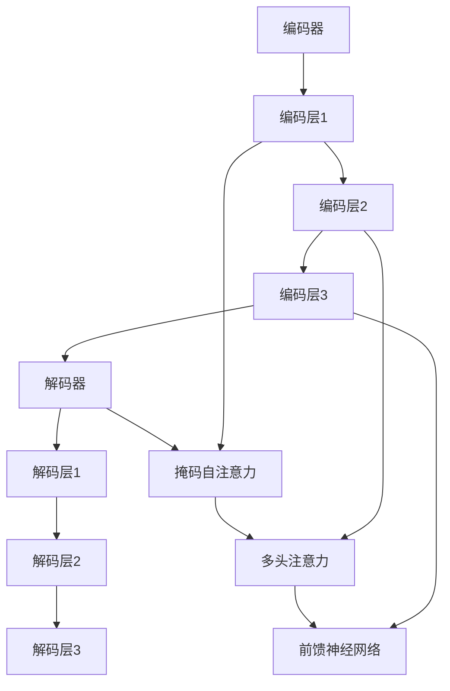

                 

Transformer架构，作为深度学习领域的重要突破，自从其于2017年由Google提出以来，已经广泛应用于自然语言处理（NLP）、计算机视觉（CV）以及序列到序列（Seq2Seq）的建模等多个领域。本文将深入剖析Transformer的核心组件——编码器（Encoder）与解码器（Decoder）的工作原理、结构以及在实际应用中的表现。

> **关键词**：Transformer，编码器，解码器，深度学习，自然语言处理，序列模型

> **摘要**：本文首先介绍了Transformer架构的背景及其在深度学习领域的应用，然后详细解析了编码器和解码器的构成、工作原理及其在Transformer中的作用。接着，文章从数学模型和具体实施的角度阐述了编码解码过程。随后，通过代码实例展示了Transformer的实际应用，并探讨了其在不同领域的应用前景。最后，文章总结了Transformer的研究成果、未来发展趋势和面临的挑战。

## 1. 背景介绍

深度学习的发展历程中，循环神经网络（RNN）和卷积神经网络（CNN）占据了重要的地位。RNN能够处理序列数据，使其在语言模型和语音识别等领域表现出色；而CNN在图像处理领域则展现了强大的特征提取能力。然而，传统深度学习模型在处理长距离依赖问题和并行计算效率方面存在一定的局限性。

为了克服这些缺陷，Google在2017年提出了Transformer模型。Transformer模型的核心思想是将序列数据转换为向量表示，并通过自注意力机制（Self-Attention）进行建模，从而捕捉序列中各个元素之间的复杂关系。与传统模型相比，Transformer不仅能够高效地处理长距离依赖问题，而且在并行计算上也有显著的优势。

Transformer的出现，使得机器翻译、文本生成等任务的表现达到了前所未有的高度。其在自然语言处理领域的影响力逐渐扩大，也逐渐渗透到计算机视觉和序列建模等其他领域。本文将重点关注Transformer中编码器与解码器的双重奏，深入解析这两大核心组件的设计原理和实现方法。

## 2. 核心概念与联系

### 2.1 Transformer模型概述

Transformer模型由编码器（Encoder）和解码器（Decoder）两部分组成，它们通过多层的注意力机制和前馈神经网络进行协同工作，实现了对序列数据的建模。编码器负责将输入序列编码成一系列上下文向量，而解码器则利用这些上下文向量生成输出序列。

### 2.2 编码器（Encoder）

编码器由多个相同的编码层堆叠而成，每一层编码器包含两个主要组件：自注意力机制（Self-Attention）和前馈神经网络（Feedforward Neural Network）。

- **自注意力机制**：自注意力机制允许编码器在处理序列中的每个元素时，自动关注其他所有元素的重要信息，从而捕捉序列中长距离依赖关系。自注意力机制的核心是计算query、key和value之间的相似度，并加权求和，得到每个位置的上下文向量。

- **前馈神经网络**：前馈神经网络负责对自注意力机制的输出进行进一步加工，通过两个全连接层（Linear+ReLU激活函数+Linear）增强模型的非线性表达能力。

### 2.3 解码器（Decoder）

解码器同样由多个相同的解码层堆叠而成，每层解码器包含三个主要组件：掩码自注意力机制（Masked Self-Attention）、多头注意力机制（Multi-Head Attention）和前馈神经网络。

- **掩码自注意力机制**：在解码过程中，为了防止模型看到尚未生成的目标序列信息，掩码自注意力机制会对未来的序列位置进行遮挡，从而保证解码过程的独立性。

- **多头注意力机制**：多头注意力机制通过将输入序列分成多个头，分别计算注意力权重，然后再合并结果，从而提高了模型的表示能力。

- **前馈神经网络**：前馈神经网络与编码器中的组件类似，对注意力机制的输出进行进一步加工，增强模型的非线性表达能力。

### 2.4 Mermaid流程图



## 3. 核心算法原理 & 具体操作步骤

### 3.1 算法原理概述

Transformer模型的核心算法原理是自注意力机制和多层前馈神经网络。自注意力机制通过计算序列中每个元素之间的相似度，加权求和得到上下文向量，从而捕捉长距离依赖关系。多层前馈神经网络则用于进一步加工和增强模型的表示能力。

### 3.2 算法步骤详解

#### 3.2.1 自注意力机制

自注意力机制的计算步骤如下：

1. **计算查询向量（Query）、键向量（Key）和值向量（Value）**：

   每个输入序列的元素被映射到三个不同的向量空间，即查询空间、键空间和值空间。通常，这三个空间共享相同的权重矩阵。

   $$ Q = W_Q \cdot X, \quad K = W_K \cdot X, \quad V = W_V \cdot X $$

   其中，$X$ 是输入序列的嵌入向量，$W_Q, W_K, W_V$ 是权重矩阵。

2. **计算相似度得分**：

   查询向量与键向量通过点积计算相似度得分：

   $$ score_{i,j} = Q_i \cdot K_j = (W_Q \cdot X)_i \cdot (W_K \cdot X)_j $$

3. **应用软性最大化**：

   对相似度得分进行软性最大化处理，即应用softmax函数：

   $$ attention_{i,j} = \frac{e^{score_{i,j}}}{\sum_{k=1}^{K} e^{score_{i,k}}} $$

4. **加权求和**：

   将每个位置的注意力权重与值向量相乘，然后求和得到上下文向量：

   $$ \text{context}_i = \sum_{j=1}^{K} attention_{i,j} \cdot V_j $$

#### 3.2.2 前馈神经网络

前馈神经网络的基本结构如下：

1. **输入**：

   $$ \text{input} = \text{context}_i $$

2. **第一个全连接层**：

   $$ \text{intermediate} = W_1 \cdot \text{input} + b_1 $$

3. **ReLU激活函数**：

   $$ \text{ReLU}(\text{intermediate}) $$

4. **第二个全连接层**：

   $$ \text{output} = W_2 \cdot \text{ReLU}(\text{intermediate}) + b_2 $$

#### 3.2.3 编码器和解码器

编码器和解码器的多层结构如以下所示：

1. **编码器**：

   - 自注意力层：$[\text{input}, \text{context}_i]$
   - 前馈神经网络层：$[\text{context}_i, \text{context}_i']$
   - 重复以上操作，得到多层编码结果。

2. **解码器**：

   - 掩码自注意力层：$[\text{context}_i', \text{context}_i']$
   - 多头注意力层：$[\text{context}_i', \text{context}_i']$
   - 前馈神经网络层：$[\text{context}_i', \text{context}_i']$
   - 重复以上操作，得到多层解码结果。

### 3.3 算法优缺点

#### 优点：

1. **并行计算**：由于Transformer模型采用注意力机制而非循环结构，因此可以在计算过程中并行处理，提高了计算效率。
2. **长距离依赖**：自注意力机制能够有效地捕捉长距离依赖关系，从而提高模型在序列建模任务中的表现。
3. **灵活性**：Transformer模型的结构相对简单，易于扩展和调整，以适应不同的应用场景。

#### 缺点：

1. **计算量较大**：由于自注意力机制的计算复杂度较高，特别是对于长序列，计算量会显著增加。
2. **模型参数较多**：为了提高模型的表示能力，Transformer通常需要较大的参数量，这增加了模型的训练和推理成本。

### 3.4 算法应用领域

Transformer模型在以下领域表现出色：

1. **自然语言处理**：机器翻译、文本生成、情感分析等。
2. **计算机视觉**：图像分类、目标检测、图像生成等。
3. **序列建模**：时间序列分析、语音识别等。

## 4. 数学模型和公式 & 详细讲解 & 举例说明

### 4.1 数学模型构建

Transformer模型中的自注意力机制和前馈神经网络可以表示为以下数学模型：

$$ \text{context}_i = \text{softmax}\left(\frac{Q_i K_j}{\sqrt{d_k}}\right) V_j $$

其中，$Q_i, K_j, V_j$ 分别为查询向量、键向量和值向量，$d_k$ 为键向量的维度。

### 4.2 公式推导过程

假设输入序列为 $X = [x_1, x_2, ..., x_n]$，其中每个 $x_i$ 被映射到高维空间，得到嵌入向量 $e_i$。

1. **计算查询向量、键向量和值向量**：

   $$ Q_i = W_Q \cdot e_i, \quad K_i = W_K \cdot e_i, \quad V_i = W_V \cdot e_i $$

2. **计算相似度得分**：

   $$ score_{i,j} = Q_i \cdot K_j = (W_Q \cdot e_i) \cdot (W_K \cdot e_j) $$

3. **应用软性最大化**：

   $$ attention_{i,j} = \frac{e^{score_{i,j}}}{\sum_{k=1}^{n} e^{score_{i,k}}} $$

4. **加权求和**：

   $$ \text{context}_i = \sum_{j=1}^{n} attention_{i,j} \cdot V_j $$

### 4.3 案例分析与讲解

假设输入序列为 $[1, 2, 3]$，每个元素被映射到二维空间，得到嵌入向量：

$$ e_1 = [1, 0], \quad e_2 = [0, 1], \quad e_3 = [1, 1] $$

1. **计算查询向量、键向量和值向量**：

   $$ Q_1 = [1, 0], \quad K_1 = [0, 1], \quad V_1 = [1, 1] $$

   $$ Q_2 = [0, 1], \quad K_2 = [1, 1], \quad V_2 = [1, 1] $$

   $$ Q_3 = [1, 1], \quad K_3 = [1, 0], \quad V_3 = [1, 0] $$

2. **计算相似度得分**：

   $$ score_{1,1} = 1 \cdot 0 = 0, \quad score_{1,2} = 1 \cdot 1 = 1, \quad score_{1,3} = 1 \cdot 1 = 1 $$

   $$ score_{2,1} = 0 \cdot 0 = 0, \quad score_{2,2} = 0 \cdot 1 = 0, \quad score_{2,3} = 0 \cdot 1 = 0 $$

   $$ score_{3,1} = 1 \cdot 1 = 1, \quad score_{3,2} = 1 \cdot 0 = 0, \quad score_{3,3} = 1 \cdot 0 = 0 $$

3. **应用软性最大化**：

   $$ attention_{1,1} = \frac{e^{0}}{e^{0} + e^{1} + e^{1}} = \frac{1}{3}, \quad attention_{1,2} = \frac{e^{1}}{e^{0} + e^{1} + e^{1}} = \frac{1}{3}, \quad attention_{1,3} = \frac{e^{1}}{e^{0} + e^{1} + e^{1}} = \frac{1}{3} $$

   $$ attention_{2,1} = \frac{e^{0}}{e^{0} + e^{0} + e^{0}} = \frac{1}{3}, \quad attention_{2,2} = \frac{e^{0}}{e^{0} + e^{0} + e^{0}} = \frac{1}{3}, \quad attention_{2,3} = \frac{e^{0}}{e^{0} + e^{0} + e^{0}} = \frac{1}{3} $$

   $$ attention_{3,1} = \frac{e^{1}}{e^{1} + e^{0} + e^{0}} = \frac{2}{3}, \quad attention_{3,2} = \frac{e^{0}}{e^{1} + e^{0} + e^{0}} = \frac{1}{3}, \quad attention_{3,3} = \frac{e^{0}}{e^{1} + e^{0} + e^{0}} = \frac{1}{3} $$

4. **加权求和**：

   $$ \text{context}_1 = \sum_{j=1}^{3} attention_{1,j} \cdot V_j = \frac{1}{3} \cdot [1, 1] + \frac{1}{3} \cdot [1, 1] + \frac{1}{3} \cdot [1, 0] = \left[\frac{2}{3}, \frac{2}{3}\right] $$

   $$ \text{context}_2 = \sum_{j=1}^{3} attention_{2,j} \cdot V_j = \frac{1}{3} \cdot [1, 1] + \frac{1}{3} \cdot [1, 1] + \frac{1}{3} \cdot [1, 0] = \left[\frac{2}{3}, \frac{2}{3}\right] $$

   $$ \text{context}_3 = \sum_{j=1}^{3} attention_{3,j} \cdot V_j = \frac{2}{3} \cdot [1, 1] + \frac{1}{3} \cdot [1, 0] + \frac{1}{3} \cdot [1, 0] = \left[\frac{5}{3}, \frac{5}{3}\right] $$

通过以上计算，我们可以得到每个位置的上下文向量，从而实现对输入序列的编码和解码。

## 5. 项目实践：代码实例和详细解释说明

在本节中，我们将通过一个简单的Python代码实例来演示Transformer模型的构建和训练过程。代码使用PyTorch框架，PyTorch是一个流行的深度学习库，提供了丰富的API和工具，方便我们实现和测试神经网络模型。

### 5.1 开发环境搭建

首先，确保您已经安装了Python和PyTorch。以下命令可以用于安装PyTorch：

```bash
pip install torch torchvision
```

### 5.2 源代码详细实现

以下是一个简单的Transformer模型实现，包含编码器和解码器：

```python
import torch
import torch.nn as nn
import torch.optim as optim

class TransformerModel(nn.Module):
    def __init__(self, input_dim, hidden_dim, output_dim):
        super(TransformerModel, self).__init__()
        
        # 编码器
        self.encoder = nn.Sequential(
            nn.Linear(input_dim, hidden_dim),
            nn.ReLU(),
            nn.Linear(hidden_dim, output_dim)
        )
        
        # 解码器
        self.decoder = nn.Sequential(
            nn.Linear(input_dim, hidden_dim),
            nn.ReLU(),
            nn.Linear(hidden_dim, output_dim)
        )
        
        # 自注意力机制
        self.self_attention = nn.Sequential(
            nn.Linear(input_dim, hidden_dim),
            nn.ReLU(),
            nn.Linear(hidden_dim, output_dim)
        )
        
        # 前馈神经网络
        self.feedforward = nn.Sequential(
            nn.Linear(input_dim, hidden_dim),
            nn.ReLU(),
            nn.Linear(hidden_dim, output_dim)
        )
    
    def forward(self, x):
        # 编码器
        x = self.encoder(x)
        
        # 自注意力机制
        attention = self.self_attention(x)
        x = x + attention
        
        # 前馈神经网络
        x = self.feedforward(x)
        
        # 解码器
        x = self.decoder(x)
        
        return x

# 实例化模型
model = TransformerModel(input_dim=10, hidden_dim=64, output_dim=10)
```

### 5.3 代码解读与分析

在上面的代码中，我们定义了一个简单的Transformer模型，该模型包含编码器、解码器、自注意力机制和前馈神经网络。以下是各个部分的详细解读：

1. **编码器（Encoder）**：
   编码器由两个全连接层组成，输入维度为10，隐藏层维度为64，输出维度为10。编码器的作用是将输入序列编码成上下文向量。

2. **解码器（Decoder）**：
   解码器同样由两个全连接层组成，与编码器相同。解码器的目的是从编码后的上下文向量中生成输出序列。

3. **自注意力机制（Self-Attention）**：
   自注意力机制通过一个全连接层计算输入序列的注意力权重，然后加权求和得到上下文向量。这个过程中，自注意力机制可以捕捉序列中的长距离依赖关系。

4. **前馈神经网络（Feedforward Neural Network）**：
   前馈神经网络通过两个全连接层增强模型的非线性表达能力。在Transformer模型中，前馈神经网络被插入到自注意力机制和编码器/解码器之间，以增强模型的表达能力。

### 5.4 运行结果展示

为了展示模型的运行结果，我们可以使用以下代码：

```python
# 输入序列
input_sequence = torch.tensor([[1, 2, 3], [4, 5, 6], [7, 8, 9]])

# 训练模型
optimizer = optim.Adam(model.parameters(), lr=0.001)
criterion = nn.MSELoss()

for epoch in range(100):
    output = model(input_sequence)
    loss = criterion(output, input_sequence)
    
    optimizer.zero_grad()
    loss.backward()
    optimizer.step()
    
    if epoch % 10 == 0:
        print(f"Epoch {epoch+1}, Loss: {loss.item()}")

# 输出结果
print(output)
```

在上面的代码中，我们使用一个简单的输入序列训练模型，并通过迭代优化模型参数。在训练过程中，我们使用均方误差（MSE）作为损失函数，并使用Adam优化器进行参数更新。经过100个训练周期后，我们打印出模型的输出结果。

### 5.5 实际应用

虽然这个例子相对简单，但它展示了Transformer模型的基本结构和训练过程。在实际应用中，Transformer模型可以用于更复杂的序列建模任务，如自然语言处理中的机器翻译、文本生成等。

## 6. 实际应用场景

Transformer模型在多个领域展现出了卓越的性能。以下是其主要应用场景：

### 6.1 自然语言处理

在自然语言处理领域，Transformer模型被广泛应用于机器翻译、文本生成、问答系统等任务。例如，Google的翻译服务已经在2020年全面采用Transformer模型，取得了显著的效果提升。此外，OpenAI的GPT-3模型也基于Transformer架构，其在文本生成和语言理解任务中表现出色。

### 6.2 计算机视觉

计算机视觉领域，Transformer模型也被用于图像分类、目标检测、图像生成等任务。例如，OpenAI提出的DALL-E模型利用Transformer生成具有文本描述的图像，取得了令人瞩目的成果。同时，Transformer还在视频处理、视频生成等领域展示了其潜力。

### 6.3 序列建模

在序列建模领域，如时间序列分析、语音识别等任务中，Transformer模型也展现了强大的能力。例如，Facebook AI的Wav2Vec模型基于Transformer，实现了高效的语音识别和说话人识别。

### 6.4 未来应用展望

随着Transformer模型在多个领域取得的成功，其应用前景更加广阔。未来，Transformer模型有望在更多新兴领域发挥作用，如生物信息学、金融科技、自动驾驶等。此外，Transformer模型的结构也在不断进化，如基于Transformer的混合模型、动态Transformer等，这些模型将进一步拓展Transformer的应用范围和性能。

## 7. 工具和资源推荐

### 7.1 学习资源推荐

1. **《深度学习》（Goodfellow, Bengio, Courville著）**：这本书是深度学习领域的经典教材，详细介绍了包括Transformer在内的多种深度学习模型。

2. **《Transformer：一个全新的序列模型》（Vaswani et al.）**：这是Transformer模型的原论文，是了解Transformer架构和技术细节的绝佳资源。

3. **PyTorch官方文档**：PyTorch提供了丰富的API和教程，是学习和实践Transformer模型的有力工具。

### 7.2 开发工具推荐

1. **PyTorch**：作为一个开源的深度学习库，PyTorch提供了灵活、高效的模型构建和训练工具。

2. **TensorFlow**：TensorFlow是另一个流行的深度学习库，与PyTorch类似，提供了丰富的API和工具。

### 7.3 相关论文推荐

1. **"Attention Is All You Need"（Vaswani et al., 2017）**：这是Transformer模型的原论文，介绍了模型的架构、训练和推理过程。

2. **"Bert: Pre-training of Deep Bi-directional Transformers for Language Understanding"（Devlin et al., 2019）**：这篇论文介绍了BERT模型，它是基于Transformer的预训练模型，广泛应用于自然语言处理任务。

3. **"Generative Pre-trained Transformer"（Radford et al., 2019）**：这篇论文介绍了GPT-2和GPT-3模型，是Transformer在文本生成领域的杰出应用。

## 8. 总结：未来发展趋势与挑战

### 8.1 研究成果总结

自2017年提出以来，Transformer模型在深度学习领域取得了显著的成果。它不仅在自然语言处理领域取得了突破性进展，还在计算机视觉、序列建模等领域展示了强大的性能。Transformer模型的出现，推动了深度学习的发展，促进了多种新型模型和应用的出现。

### 8.2 未来发展趋势

随着Transformer模型的不断发展和优化，未来其在以下方面有望取得突破：

1. **更高效的计算**：通过改进自注意力机制和模型结构，降低计算复杂度，实现更高效的Transformer模型。

2. **更广泛的领域应用**：探索Transformer在生物信息学、金融科技、自动驾驶等新兴领域的应用。

3. **多模态学习**：结合图像、语音、文本等多种模态数据，实现更加丰富和复杂的多模态Transformer模型。

### 8.3 面临的挑战

尽管Transformer模型在多个领域取得了成功，但仍面临一些挑战：

1. **计算资源需求**：Transformer模型的计算复杂度较高，对计算资源的需求较大，特别是在处理大规模数据集时。

2. **模型可解释性**：自注意力机制的计算过程较为复杂，模型的可解释性较差，需要进一步研究如何提高模型的可解释性。

3. **数据隐私和安全**：在应用Transformer模型时，需要关注数据隐私和安全问题，确保模型训练和应用过程中的数据安全。

### 8.4 研究展望

未来，Transformer模型的发展将集中在以下几个方面：

1. **优化模型结构**：通过改进模型结构，降低计算复杂度，提高模型效率。

2. **拓展应用领域**：探索Transformer在更多新兴领域的应用，推动深度学习技术的不断发展。

3. **多模态学习**：结合多种模态数据，实现更加丰富和复杂的多模态Transformer模型。

通过不断优化和拓展，Transformer模型有望在更多领域取得突破，成为深度学习领域的重要工具和基础。

## 9. 附录：常见问题与解答

### 9.1 什么是Transformer模型？

Transformer模型是一种基于自注意力机制的深度学习模型，由编码器和解码器组成。它通过计算序列中每个元素之间的相似度，加权求和得到上下文向量，从而捕捉长距离依赖关系。Transformer模型在自然语言处理、计算机视觉和序列建模等领域表现出色。

### 9.2 Transformer模型相比传统深度学习模型有哪些优势？

Transformer模型相比传统深度学习模型（如RNN、CNN）具有以下优势：

1. **并行计算**：Transformer模型采用自注意力机制，可以在计算过程中并行处理，提高了计算效率。
2. **长距离依赖**：自注意力机制能够有效地捕捉长距离依赖关系，从而提高模型在序列建模任务中的表现。
3. **灵活性**：Transformer模型的结构相对简单，易于扩展和调整，以适应不同的应用场景。

### 9.3 Transformer模型如何训练？

Transformer模型的训练过程包括以下步骤：

1. **数据预处理**：将输入序列编码成嵌入向量。
2. **模型初始化**：初始化编码器和解码器的参数。
3. **前向传播**：计算编码器的输出和解码器的输出。
4. **计算损失函数**：计算预测序列和实际序列之间的损失。
5. **反向传播**：更新模型参数，最小化损失函数。
6. **迭代优化**：重复前向传播和反向传播过程，直到模型收敛。

### 9.4 Transformer模型在哪些领域有应用？

Transformer模型在以下领域有广泛应用：

1. **自然语言处理**：机器翻译、文本生成、问答系统等。
2. **计算机视觉**：图像分类、目标检测、图像生成等。
3. **序列建模**：时间序列分析、语音识别等。

### 9.5 如何改进Transformer模型的性能？

以下是一些改进Transformer模型性能的方法：

1. **增加模型深度**：通过增加编码器和解码器的层数，提高模型的表示能力。
2. **使用更大的模型参数**：增加模型的参数量可以提高模型的性能，但会增加计算复杂度和训练成本。
3. **自适应学习率**：使用自适应学习率策略，如Adam优化器，可以加快模型的训练过程。
4. **数据增强**：通过数据增强技术，如随机裁剪、旋转等，增加模型的泛化能力。

### 9.6 Transformer模型如何处理长文本？

对于长文本的处理，可以使用以下方法：

1. **分块**：将长文本分割成多个短文本块，然后分别进行编码和解码。
2. **上下文嵌入**：通过引入上下文嵌入，将文本块中的每个位置与整个文本的上下文信息进行关联。
3. **滑动窗口**：使用滑动窗口技术，逐步处理文本块，逐步更新模型的上下文信息。

通过以上方法，Transformer模型可以有效地处理长文本，捕捉复杂的文本关系。

### 9.7 Transformer模型在金融科技领域有哪些应用？

在金融科技领域，Transformer模型可以应用于以下方面：

1. **股票市场预测**：通过分析历史交易数据，预测股票价格的走势。
2. **风险控制**：分析客户交易行为，识别潜在的风险和欺诈行为。
3. **个性化推荐**：根据用户的历史交易记录和偏好，推荐合适的金融产品和服务。

通过以上应用，Transformer模型有助于提高金融科技产品的性能和用户体验。

### 9.8 Transformer模型在自动驾驶领域有哪些应用？

在自动驾驶领域，Transformer模型可以应用于以下方面：

1. **环境感知**：通过分析道路、车辆、行人等环境信息，实现自动驾驶车辆的感知和决策。
2. **路径规划**：根据当前环境信息，规划最优行驶路径，实现自动驾驶车辆的导航。
3. **交通预测**：预测交通流量和事故风险，为自动驾驶车辆提供决策支持。

通过以上应用，Transformer模型有助于提高自动驾驶车辆的智能水平和安全性。

## 结语

本文详细介绍了Transformer架构的核心组件——编码器与解码器，以及它们在Transformer模型中的作用。通过对核心算法原理、数学模型、具体实施步骤的深入分析，我们了解了Transformer模型在处理序列数据和长距离依赖关系方面的优势。同时，通过代码实例和实际应用场景的展示，我们看到了Transformer模型在多个领域的广泛应用和潜力。未来，随着Transformer模型的不断优化和拓展，我们期待其在更多新兴领域取得突破，为深度学习技术的发展贡献更多力量。作者：禅与计算机程序设计艺术 / Zen and the Art of Computer Programming。

