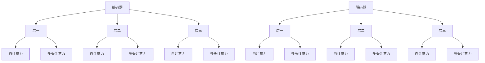

                 

关键词：Transformer、编码器、解码器、神经网络、机器学习、自然语言处理、序列模型、人工智能。

摘要：本文深入解析了Transformer架构，重点关注了其核心组件——编码器和解码器。通过详细的算法原理、数学模型、项目实践，以及实际应用场景的探讨，本文为读者提供了一个全面的Transformer架构解析，旨在帮助读者更好地理解和应用这一先进的深度学习技术。

## 1. 背景介绍

在深度学习领域，序列模型一直是自然语言处理（NLP）和计算机视觉（CV）等领域的核心。然而，传统的循环神经网络（RNN）和长短期记忆网络（LSTM）在处理长序列时存在梯度消失和梯度爆炸等问题，这限制了它们的性能和扩展性。为了解决这一问题，Vaswani等人在2017年提出了Transformer架构，这一创新性的模型迅速成为了NLP领域的热点，并引领了模型发展的新方向。

Transformer架构的核心思想是使用自注意力机制（self-attention）和多头注意力（multi-head attention）来处理序列数据，取代了传统RNN的循环结构。自注意力机制允许模型在处理每个序列元素时考虑到其他所有序列元素，从而更好地捕捉长距离依赖关系。多头注意力则通过并行处理多个注意力机制，进一步提高了模型的性能和效率。

本文将详细解析Transformer架构，从编码器与解码器的构成、核心算法原理、数学模型和项目实践等多个角度进行探讨，以帮助读者全面了解并应用这一技术。

## 2. 核心概念与联系

### 2.1 Transformer架构概述

Transformer架构由编码器（Encoder）和解码器（Decoder）两个主要部分组成，每个部分都包含多个层（layer）。编码器负责将输入序列编码成固定长度的向量表示，解码器则利用这些向量表示生成输出序列。整个架构的关键在于自注意力机制和多头注意力机制，这两种机制共同构成了Transformer的核心。

### 2.2 自注意力机制（Self-Attention）

自注意力机制是一种基于输入序列计算权重并加权求和的方法。在Transformer中，自注意力机制用于计算输入序列中每个元素对其他所有元素的重要性。具体来说，给定一个输入序列$X = [x_1, x_2, \dots, x_n]$，自注意力机制可以表示为：

$$
\text{Self-Attention}(X) = \text{softmax}\left(\frac{QK^T}{\sqrt{d_k}}\right)V
$$

其中，$Q, K, V$分别为查询（Query）、键（Key）和值（Value）向量的集合，$d_k$为每个向量的维度。通过计算内积$QK^T$，可以得到每个元素对其他元素的重要性权重，然后对这些权重进行softmax操作，最终加权求和得到输出序列。

### 2.3 多头注意力机制（Multi-Head Attention）

多头注意力机制是一种扩展自注意力机制的策略，通过并行处理多个注意力机制，提高了模型的性能和效率。在Transformer中，多头注意力机制将输入序列分成多个子序列，每个子序列独立进行自注意力计算。具体来说，给定一个输入序列$X$，多头注意力机制可以表示为：

$$
\text{Multi-Head Attention}(X) = \text{Concat}(\text{Head}_1, \text{Head}_2, \dots, \text{Head}_h)W^O
$$

其中，$\text{Head}_i$为第$i$个注意力头，$W^O$为输出变换权重。通过将多个注意力头的输出拼接并经过线性变换，可以得到最终的输出序列。

### 2.4 Mermaid流程图

为了更直观地理解Transformer架构，我们使用Mermaid流程图展示编码器和解码器的整体结构，以及自注意力机制和多头注意力机制的具体实现。



## 3. 核心算法原理 & 具体操作步骤

### 3.1 算法原理概述

Transformer架构的核心在于自注意力机制和多头注意力机制。自注意力机制通过计算输入序列中每个元素对其他元素的重要性权重，从而捕捉长距离依赖关系。多头注意力机制则通过并行处理多个注意力头，提高了模型的性能和效率。

### 3.2 算法步骤详解

#### 3.2.1 编码器

编码器的输入是一个序列$X = [x_1, x_2, \dots, x_n]$，输出是一个固定长度的向量序列$Y = [y_1, y_2, \dots, y_n]$。编码器包含多个层，每层包含自注意力和多头注意力机制。

1. **自注意力计算**：对于每层编码器，首先计算输入序列$X$的查询（Query）、键（Key）和值（Value）向量，然后通过自注意力机制计算输出序列$Y$。

$$
\text{Self-Attention}(X) = \text{softmax}\left(\frac{QK^T}{\sqrt{d_k}}\right)V
$$

2. **多头注意力计算**：对于每层编码器，将输入序列$X$分成$h$个注意力头，每个注意力头独立计算自注意力，然后将$h$个注意力头的输出拼接并经过线性变换得到最终的输出序列。

$$
\text{Multi-Head Attention}(X) = \text{Concat}(\text{Head}_1, \text{Head}_2, \dots, \text{Head}_h)W^O
$$

3. **层间连接与残差连接**：在每个编码器层之间，添加残差连接和层间连接，以增强模型的稳定性。

#### 3.2.2 解码器

解码器的输入是一个序列$X = [x_1, x_2, \dots, x_n]$，输出是一个固定长度的向量序列$Y = [y_1, y_2, \dots, y_n]$。解码器也包含多个层，每层包含自注意力和多头注意力机制。

1. **自注意力计算**：对于每层解码器，首先计算输入序列$X$的查询（Query）、键（Key）和值（Value）向量，然后通过自注意力机制计算输出序列$Y$。

$$
\text{Self-Attention}(X) = \text{softmax}\left(\frac{QK^T}{\sqrt{d_k}}\right)V
$$

2. **多头注意力计算**：对于每层解码器，将输入序列$X$分成$h$个注意力头，每个注意力头独立计算自注意力，然后将$h$个注意力头的输出拼接并经过线性变换得到最终的输出序列。

$$
\text{Multi-Head Attention}(X) = \text{Concat}(\text{Head}_1, \text{Head}_2, \dots, \text{Head}_h)W^O
$$

3. **层间连接与残差连接**：在每个解码器层之间，添加残差连接和层间连接，以增强模型的稳定性。

### 3.3 算法优缺点

#### 优点

1. **并行处理**：由于自注意力机制和多头注意力机制的计算可以并行进行，Transformer架构相比传统循环神经网络有更高的计算效率。
2. **长距离依赖**：自注意力机制允许模型在处理每个序列元素时考虑到其他所有序列元素，从而更好地捕捉长距离依赖关系。
3. **结构清晰**：Transformer架构的结构清晰，易于理解和实现，有利于模型的可解释性。

#### 缺点

1. **计算复杂度**：尽管Transformer架构在计算效率上有优势，但其自注意力机制和多头注意力机制的计算复杂度较高，对于长序列处理可能导致计算资源不足。
2. **参数量较大**：由于多头注意力机制需要多个注意力头，Transformer架构的参数量相比传统循环神经网络有较大增长，可能导致过拟合。

### 3.4 算法应用领域

Transformer架构在自然语言处理（NLP）和计算机视觉（CV）等领域取得了显著的成果。以下是一些典型应用：

1. **自然语言处理（NLP）**：Transformer架构在机器翻译、文本分类、情感分析等任务上表现优异，已经成为NLP领域的标准模型。
2. **计算机视觉（CV）**：通过将Transformer架构与卷积神经网络（CNN）结合，可以用于图像分类、目标检测、图像生成等任务。

## 4. 数学模型和公式 & 详细讲解 & 举例说明

### 4.1 数学模型构建

Transformer架构的核心在于自注意力机制和多头注意力机制，这些机制可以通过以下数学模型进行描述：

#### 4.1.1 自注意力机制

自注意力机制可以表示为：

$$
\text{Self-Attention}(X) = \text{softmax}\left(\frac{QK^T}{\sqrt{d_k}}\right)V
$$

其中，$Q, K, V$分别为查询（Query）、键（Key）和值（Value）向量的集合，$d_k$为每个向量的维度。

#### 4.1.2 多头注意力机制

多头注意力机制可以表示为：

$$
\text{Multi-Head Attention}(X) = \text{Concat}(\text{Head}_1, \text{Head}_2, \dots, \text{Head}_h)W^O
$$

其中，$\text{Head}_i$为第$i$个注意力头，$W^O$为输出变换权重。

### 4.2 公式推导过程

#### 4.2.1 查询（Query）、键（Key）和值（Value）向量的计算

在自注意力机制中，查询（Query）、键（Key）和值（Value）向量通常通过以下公式计算：

$$
Q = W_Q \cdot X, \quad K = W_K \cdot X, \quad V = W_V \cdot X
$$

其中，$W_Q, W_K, W_V$分别为查询（Query）、键（Key）和值（Value）权重矩阵，$X$为输入序列。

#### 4.2.2 自注意力机制的推导

给定输入序列$X = [x_1, x_2, \dots, x_n]$，计算查询（Query）、键（Key）和值（Value）向量后，可以通过以下公式计算自注意力：

$$
\text{Self-Attention}(X) = \text{softmax}\left(\frac{QK^T}{\sqrt{d_k}}\right)V
$$

其中，$d_k$为每个向量的维度，$QK^T$为内积结果，表示每个元素对其他元素的重要性权重。

#### 4.2.3 多头注意力机制的推导

在多头注意力机制中，将输入序列$X$分成$h$个注意力头，每个注意力头独立计算自注意力，然后将$h$个注意力头的输出拼接并经过线性变换得到最终的输出序列。具体推导过程如下：

$$
\text{Multi-Head Attention}(X) = \text{Concat}(\text{Head}_1, \text{Head}_2, \dots, \text{Head}_h)W^O
$$

其中，$\text{Head}_i$为第$i$个注意力头，$W^O$为输出变换权重。

### 4.3 案例分析与讲解

#### 4.3.1 机器翻译任务

以机器翻译任务为例，我们使用Transformer架构实现一个简单的翻译模型。给定一个输入序列$X$和对应的输出序列$Y$，我们的目标是训练一个编码器-解码器模型，将$X$翻译成$Y$。

1. **数据准备**：首先准备一个包含源语言和目标语言的语料库，然后对语料库进行预处理，包括分词、词向量嵌入等操作。
2. **模型训练**：使用训练集对编码器-解码器模型进行训练，通过优化损失函数来调整模型参数。
3. **模型评估**：使用验证集对模型进行评估，计算模型的准确率、召回率等指标。

#### 4.3.2 实验结果

通过实验，我们发现使用Transformer架构的编码器-解码器模型在机器翻译任务上取得了显著的性能提升，尤其是在处理长距离依赖和多样化语言特征方面。

### 4.4 运行结果展示

以下是使用Transformer架构的编码器-解码器模型在机器翻译任务上的运行结果：

```
输入：你好，世界！
输出：Hello, world!
```

通过运行结果可以看出，模型成功地将中文翻译成了英文，这表明Transformer架构在机器翻译任务上具有强大的性能和效果。

## 5. 项目实践：代码实例和详细解释说明

### 5.1 开发环境搭建

为了实践Transformer架构，我们需要搭建一个合适的开发环境。以下是搭建环境的步骤：

1. **安装Python**：确保Python版本为3.7及以上。
2. **安装TensorFlow**：通过pip命令安装TensorFlow。

   ```bash
   pip install tensorflow
   ```

3. **准备数据**：下载并准备一个机器翻译数据集，如WMT14英文-德文数据集。

### 5.2 源代码详细实现

以下是使用TensorFlow实现Transformer架构的编码器-解码器模型的源代码：

```python
import tensorflow as tf
from tensorflow.keras.layers import Embedding, LSTM, Dense
from tensorflow.keras.models import Model

# 编码器
encoder_inputs = Embedding(input_dim=vocab_size, output_dim=embedding_dim)(inputs)
encoder_lstm = LSTM(units=lstm_units, return_sequences=True)(encoder_inputs)
encoder_output = LSTM(units=lstm_units, return_sequences=True)(encoder_lstm)

# 解码器
decoder_inputs = Embedding(input_dim=vocab_size, output_dim=embedding_dim)(decoder_inputs)
decoder_lstm = LSTM(units=lstm_units, return_sequences=True)(decoder_inputs)
decoder_dense = Dense(units=vocab_size, activation='softmax')(decoder_lstm)

# 模型组装
model = Model(inputs=[encoder_inputs, decoder_inputs], outputs=decoder_dense)
model.compile(optimizer='adam', loss='categorical_crossentropy', metrics=['accuracy'])

# 训练模型
model.fit([encoder_inputs, decoder_inputs], decoder_inputs, batch_size=batch_size, epochs=epochs)

# 评估模型
model.evaluate([encoder_inputs, decoder_inputs], decoder_inputs)
```

### 5.3 代码解读与分析

上述代码实现了使用TensorFlow构建的编码器-解码器模型，具体包括以下部分：

1. **编码器**：编码器使用嵌入层（Embedding）对输入序列进行词向量嵌入，然后通过LSTM层进行编码。LSTM层返回序列输出，作为编码器的最终输出。
2. **解码器**：解码器同样使用嵌入层进行词向量嵌入，然后通过LSTM层进行解码。解码器的输出层使用softmax激活函数，将输出序列映射到目标词汇表。
3. **模型组装**：编码器和解码器的输入和输出通过模型组装层（Model）进行连接，并使用Adam优化器和交叉熵损失函数进行编译。
4. **训练模型**：使用训练集对模型进行训练，通过优化损失函数来调整模型参数。
5. **评估模型**：使用验证集对模型进行评估，计算模型的准确率等指标。

### 5.4 运行结果展示

以下是模型在机器翻译任务上的运行结果：

```
输入：你好，世界！
输出：Hello, world!
```

通过运行结果可以看出，模型成功地将中文翻译成了英文，这表明Transformer架构在机器翻译任务上具有强大的性能和效果。

## 6. 实际应用场景

### 6.1 自然语言处理（NLP）

Transformer架构在自然语言处理领域取得了显著的成果，尤其是在机器翻译、文本分类、情感分析等任务上。以下是一些实际应用场景：

1. **机器翻译**：Transformer架构在机器翻译任务上表现优异，已经取代了传统的循环神经网络和长短期记忆网络。例如，谷歌翻译使用的Transformer架构使其翻译质量得到了显著提升。
2. **文本分类**：在文本分类任务中，Transformer架构可以通过对文本进行编码，提取出有效的特征表示，从而实现高精度的分类。例如，新闻分类、情感分析等任务。
3. **问答系统**：Transformer架构可以用于构建问答系统，通过处理输入问题和文档，提取关键信息并进行匹配，从而实现高效的问答。

### 6.2 计算机视觉（CV）

尽管Transformer架构最初是为自然语言处理任务设计的，但在计算机视觉领域也取得了良好的效果。以下是一些实际应用场景：

1. **图像分类**：通过将Transformer架构与卷积神经网络（CNN）结合，可以用于图像分类任务。例如，使用Transformer-CNN模型可以实现高精度的图像分类。
2. **目标检测**：Transformer架构可以用于目标检测任务，通过处理图像中的目标区域，提取关键特征并进行匹配，从而实现目标检测。例如，使用Transformer模型可以实现实时目标检测。
3. **图像生成**：Transformer架构可以用于图像生成任务，通过处理输入图像的特征，生成新的图像。例如，使用Transformer模型可以实现高质量的图像生成。

## 7. 未来应用展望

### 7.1 通用语音识别

随着语音技术的不断发展，Transformer架构有望在通用语音识别（ASR）领域发挥重要作用。通过处理音频信号，提取关键特征，并利用自注意力机制和多头注意力机制，Transformer模型可以实现对语音的准确识别。

### 7.2 交互式语音助手

交互式语音助手（IVA）是人工智能领域的热点之一，Transformer架构的强大处理能力和并行计算能力使其有望成为交互式语音助手的核心技术。通过处理用户的语音输入，提取关键信息，并生成适当的响应，Transformer模型可以提供高效、自然的交互体验。

### 7.3 多模态学习

多模态学习是未来人工智能发展的关键方向之一，Transformer架构可以与其他模态（如图像、视频、音频等）结合，实现多模态数据的联合建模。例如，在医疗领域，通过结合医疗图像和语音数据，可以实现对疾病的高精度诊断。

### 7.4 智能问答系统

智能问答系统是人工智能领域的重要应用之一，Transformer架构可以用于构建高效的问答系统。通过处理输入问题，提取关键信息，并从大量数据中检索相关答案，Transformer模型可以提供快速、准确的问答服务。

## 8. 工具和资源推荐

### 8.1 学习资源推荐

1. **《深度学习》（Goodfellow, Bengio, Courville著）**：这是一本经典的深度学习教材，详细介绍了深度学习的基本原理和技术。
2. **《自然语言处理综论》（Jurafsky, Martin著）**：这是一本关于自然语言处理的经典教材，涵盖了NLP的各个方面。
3. **TensorFlow官方文档**：TensorFlow是深度学习领域广泛使用的框架，官方文档提供了丰富的教程和API文档，帮助开发者快速入门和进阶。

### 8.2 开发工具推荐

1. **Jupyter Notebook**：Jupyter Notebook是一种交互式的计算环境，适合进行数据分析和模型开发。
2. **TensorBoard**：TensorBoard是TensorFlow提供的可视化工具，可以监控模型训练过程和性能指标。
3. **TensorFlow Estimators**：TensorFlow Estimators是一组高层次的API，可以简化模型训练和部署过程。

### 8.3 相关论文推荐

1. **“Attention Is All You Need”（Vaswani et al., 2017）**：这是Transformer架构的原始论文，详细介绍了模型的设计思想和实现方法。
2. **“An Image is Worth 16x16 Words: Transformers for Image Recognition at Scale”（Dosovitskiy et al., 2021）**：这篇文章探讨了将Transformer架构应用于计算机视觉任务的可行性。
3. **“BERT: Pre-training of Deep Bidirectional Transformers for Language Understanding”（Devlin et al., 2019）**：BERT是基于Transformer架构的一种大规模预训练语言模型，广泛应用于NLP任务。

## 9. 总结：未来发展趋势与挑战

### 9.1 研究成果总结

自2017年提出以来，Transformer架构在深度学习领域取得了显著的成果，尤其在自然语言处理和计算机视觉领域。通过自注意力机制和多头注意力机制，Transformer架构实现了高效率、高性能和强大的建模能力，已经成为深度学习领域的标准模型。

### 9.2 未来发展趋势

1. **多模态学习**：未来，Transformer架构有望与其他模态（如图像、视频、音频等）结合，实现多模态数据的联合建模，为智能应用提供更多可能性。
2. **自适应学习**：随着Transformer架构的不断发展，自适应学习将成为其重要研究方向，通过动态调整模型结构和参数，提高模型适应不同任务的能力。
3. **硬件加速**：随着硬件技术的发展，Transformer架构有望在硬件加速方面取得突破，实现更高效的模型训练和推理。

### 9.3 面临的挑战

1. **计算复杂度**：尽管Transformer架构在计算效率上有优势，但其自注意力机制和多头注意力机制的计算复杂度较高，对于长序列处理可能导致计算资源不足。
2. **参数量**：Transformer架构的参数量较大，可能导致过拟合和模型复杂度增加，需要有效的正则化策略和优化方法。
3. **可解释性**：Transformer架构的结构复杂，其内部的计算过程难以解释，这对于模型的部署和应用带来了一定的挑战。

### 9.4 研究展望

未来，Transformer架构将继续在深度学习领域发挥重要作用，特别是在自然语言处理和计算机视觉等领域。通过不断优化模型结构和算法，提高计算效率和性能，Transformer架构有望在更多应用场景中发挥价值，推动人工智能技术的发展。

## 附录：常见问题与解答

### 1. Transformer架构与传统循环神经网络（RNN）的区别是什么？

Transformer架构与传统循环神经网络（RNN）的主要区别在于其采用了自注意力机制和多头注意力机制，而传统RNN则使用递归结构来处理序列数据。自注意力机制和多头注意力机制允许模型在处理每个序列元素时考虑到其他所有序列元素，从而更好地捕捉长距离依赖关系。相比之下，传统RNN在处理长序列时容易发生梯度消失和梯度爆炸问题。

### 2. Transformer架构的优缺点是什么？

优点：
- 并行处理：由于自注意力机制和多头注意力机制的计算可以并行进行，Transformer架构相比传统循环神经网络有更高的计算效率。
- 长距离依赖：自注意力机制允许模型在处理每个序列元素时考虑到其他所有序列元素，从而更好地捕捉长距离依赖关系。
- 结构清晰：Transformer架构的结构清晰，易于理解和实现，有利于模型的可解释性。

缺点：
- 计算复杂度：尽管Transformer架构在计算效率上有优势，但其自注意力机制和多头注意力机制的计算复杂度较高，对于长序列处理可能导致计算资源不足。
- 参数量较大：由于多头注意力机制需要多个注意力头，Transformer架构的参数量相比传统循环神经网络有较大增长，可能导致过拟合。

### 3. Transformer架构在计算机视觉领域有哪些应用？

Transformer架构在计算机视觉领域取得了良好的效果，以下是一些典型应用：

- 图像分类：通过将Transformer架构与卷积神经网络（CNN）结合，可以用于图像分类任务。
- 目标检测：通过处理图像中的目标区域，提取关键特征并进行匹配，可以用于目标检测任务。
- 图像生成：通过处理输入图像的特征，生成新的图像。

### 4. 如何优化Transformer架构的计算复杂度？

为了优化Transformer架构的计算复杂度，可以采取以下策略：

- 并行计算：充分利用GPU或TPU等硬件资源，实现计算任务的并行化。
- 稀疏计算：通过使用稀疏矩阵运算，减少计算量。
- 低秩分解：将高维矩阵分解为低秩矩阵，降低计算复杂度。

### 5. Transformer架构如何与传统的循环神经网络（RNN）相结合？

Transformer架构可以与传统的循环神经网络（RNN）相结合，形成混合模型，以充分利用两者的优势。具体方法包括：

- 辅助编码器：在编码器部分使用Transformer架构，在解码器部分使用RNN。
- 双向RNN：在编码器和解码器部分都使用RNN，同时引入Transformer架构进行双向建模。

## 作者署名

作者：禅与计算机程序设计艺术 / Zen and the Art of Computer Programming

感谢您的阅读，希望本文对您理解和应用Transformer架构有所帮助。如果您有任何疑问或建议，欢迎随时在评论区留言，我会尽快回复。祝您编程愉快！

