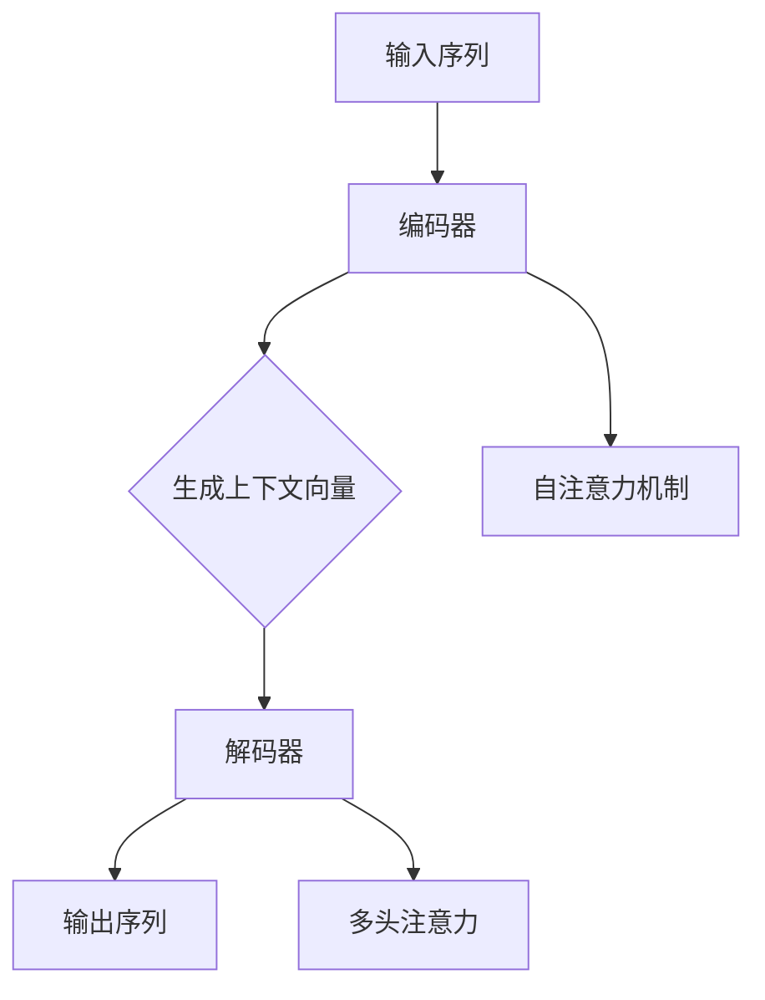

                 

关键词：Transformer、编码器、解码器、结构、功能、对比

摘要：本文将深入探讨Transformer编码器和解码器的结构设计及其在自然语言处理中的功能差异，通过详细的分析，揭示二者在信息传递、上下文理解以及应用场景中的独特优势。

## 1. 背景介绍

近年来，深度学习在自然语言处理（NLP）领域取得了显著进展。特别是Transformer架构的出现，彻底改变了序列模型的传统范式。Transformer以其独特的自注意力机制（Self-Attention Mechanism）和多头注意力（Multi-Head Attention）而闻名，已成为现代NLP系统的核心组件。Transformer架构主要包括编码器（Encoder）和解码器（Decoder）两个部分，二者共同协作，实现高效的自然语言理解和生成。

编码器负责从输入序列中提取信息，并产生一组上下文向量；而解码器则基于这些上下文向量生成输出序列。本文将重点对比编码器和解码器的结构设计，深入分析它们在信息传递、上下文理解和应用领域的差异。

### 1.1 Transformer架构的发展历程

自2017年Vaswani等人在论文《Attention is All You Need》中首次提出Transformer架构以来，其迅速成为NLP领域的热点研究课题。与传统的循环神经网络（RNN）和长短期记忆网络（LSTM）相比，Transformer通过并行计算和自注意力机制，显著提升了模型在长文本序列处理上的性能。

随后，Transformer在多个NLP任务中取得了突破性成果，如机器翻译、文本摘要、问答系统等。在此基础上，研究人员对Transformer进行了多次改进和扩展，如BERT、GPT等预训练模型，进一步丰富了Transformer的应用场景。

### 1.2 编码器和解码器在NLP中的角色

编码器和解码器在Transformer架构中分别承担着不同的任务。编码器负责对输入序列进行编码，提取关键信息，生成一组上下文向量；而解码器则基于这些上下文向量，生成输出序列。

编码器和解码器的协同工作，使得Transformer能够实现高效的自然语言理解和生成。编码器从输入序列中提取信息，并将这些信息编码成固定长度的上下文向量；解码器则根据上下文向量，逐步生成输出序列，从而实现序列到序列的转换。

## 2. 核心概念与联系

在深入探讨编码器和解码器的结构设计之前，我们需要了解一些核心概念和它们之间的联系。以下是一个Mermaid流程图，用于描述编码器和解码器的基本原理和相互关系。



### 2.1 编码器

编码器是Transformer的核心组件之一，负责从输入序列中提取信息，并生成一组上下文向量。编码器通常由多个编码层（Encoder Layer）堆叠而成，每个编码层包含自注意力机制（Self-Attention Mechanism）和前馈神经网络（Feedforward Neural Network）。

编码器的工作原理可以概括为以下步骤：

1. **输入嵌入（Input Embedding）**：将输入序列中的每个单词映射为一个固定长度的向量。
2. **位置编码（Positional Encoding）**：由于Transformer没有循环结构，需要通过位置编码来传递序列信息。位置编码通常使用绝对位置编码或相对位置编码。
3. **自注意力机制（Self-Attention）**：编码器中的每个位置都通过自注意力机制与其他位置进行交互，提取关键信息。自注意力机制使得模型能够自动关注序列中的重要信息，并生成一组加权上下文向量。
4. **前馈神经网络（Feedforward Neural Network）**：在每个编码层之后，通过前馈神经网络对上下文向量进行非线性变换，增强模型的表达能力。

### 2.2 解码器

解码器是Transformer的另一个核心组件，负责根据编码器生成的上下文向量，生成输出序列。解码器同样由多个解码层（Decoder Layer）堆叠而成，每个解码层包含多头注意力（Multi-Head Attention）和前馈神经网络。

解码器的工作原理可以概括为以下步骤：

1. **输入嵌入（Input Embedding）**：将输入序列中的每个单词映射为一个固定长度的向量。
2. **位置编码（Positional Encoding）**：与编码器类似，解码器也使用位置编码来传递序列信息。
3. **多头注意力（Multi-Head Attention）**：解码器中的每个位置都通过多头注意力机制与编码器生成的上下文向量和其他解码器位置进行交互。多头注意力使得模型能够同时关注多个不同的上下文信息。
4. **前馈神经网络（Feedforward Neural Network）**：在每个解码层之后，通过前馈神经网络对上下文向量进行非线性变换，增强模型的表达能力。
5. **序列到序列转换（Sequence-to-Sequence Transformation）**：解码器最终通过一个全连接层将上下文向量映射到输出序列的概率分布。

## 3. 核心算法原理 & 具体操作步骤

### 3.1 算法原理概述

Transformer编码器和解码器的核心算法原理主要涉及自注意力机制（Self-Attention Mechanism）和多头注意力（Multi-Head Attention）。

自注意力机制是一种基于输入序列的注意力模型，通过计算输入序列中每个位置与其他位置的相似度，生成一组加权上下文向量。这种机制使得模型能够自动关注序列中的关键信息，并提取重要特征。

多头注意力是一种扩展自注意力机制的模型，通过将输入序列分成多个头（Head），每个头关注不同的上下文信息。多头注意力能够提高模型的泛化能力，使其能够更好地处理复杂的序列数据。

### 3.2 算法步骤详解

编码器和解码器的算法步骤可以分为以下几个部分：

1. **输入嵌入（Input Embedding）**：将输入序列中的每个单词映射为一个固定长度的向量。
2. **位置编码（Positional Encoding）**：为输入序列添加位置编码，以便在序列中传递信息。
3. **自注意力机制（Self-Attention）**：计算输入序列中每个位置与其他位置的相似度，生成一组加权上下文向量。
4. **多头注意力（Multi-Head Attention）**：将自注意力机制扩展到多个头，每个头关注不同的上下文信息。
5. **前馈神经网络（Feedforward Neural Network）**：对加权上下文向量进行非线性变换，增强模型的表达能力。
6. **层归一化（Layer Normalization）**：对每个编码层或解码层的输出进行归一化，稳定训练过程。
7. **残差连接（Residual Connection）**：在每个编码层和解码层之间添加残差连接，防止模型过拟合。
8. **输出层（Output Layer）**：将编码器和解码器的最后一层输出映射到输出序列的概率分布。

### 3.3 算法优缺点

Transformer编码器和解码器的算法优缺点如下：

#### 优点：

1. **并行计算**：由于Transformer采用自注意力机制，可以并行处理序列中的每个位置，提高了计算效率。
2. **长距离依赖**：自注意力机制能够有效地捕捉序列中的长距离依赖关系，提高了模型的表示能力。
3. **泛化能力**：通过多头注意力机制，模型能够关注不同的上下文信息，提高了泛化能力。

#### 缺点：

1. **内存需求**：由于自注意力机制需要计算输入序列中每个位置与其他位置的相似度，内存需求较高。
2. **计算复杂度**：随着序列长度的增加，计算复杂度呈指数级增长，可能导致训练和推理过程较慢。

### 3.4 算法应用领域

Transformer编码器和解码器在多个NLP任务中取得了显著成果，如：

1. **机器翻译**：Transformer在机器翻译任务中表现出色，能够有效地捕捉源语言和目标语言之间的语义关系。
2. **文本摘要**：通过编码器和解码器的协同工作，Transformer能够实现高效的文章摘要生成。
3. **问答系统**：Transformer能够根据输入问题，从大规模文本数据中检索并生成相关答案。
4. **对话系统**：Transformer在对话系统中的应用，使得模型能够实现更加自然的对话交互。

## 4. 数学模型和公式 & 详细讲解 & 举例说明

### 4.1 数学模型构建

Transformer编码器和解码器的数学模型主要涉及自注意力机制（Self-Attention Mechanism）和多头注意力（Multi-Head Attention）。

#### 自注意力机制

自注意力机制可以表示为：

$$
\text{Attention}(Q, K, V) = \text{softmax}\left(\frac{QK^T}{\sqrt{d_k}}\right)V
$$

其中，$Q, K, V$ 分别代表查询（Query）、键（Key）和值（Value）向量，$d_k$ 代表键向量的维度。自注意力机制通过计算查询向量 $Q$ 和键向量 $K$ 的点积，生成一组加权值向量 $V$。

#### 多头注意力

多头注意力是将自注意力机制扩展到多个头，每个头关注不同的上下文信息。多头注意力的公式为：

$$
\text{MultiHead}(Q, K, V) = \text{Concat}(\text{head}_1, ..., \text{head}_h)W^O
$$

其中，$h$ 表示头的数量，$W^O$ 表示输出权重矩阵。多头注意力通过将输入序列分成 $h$ 个头，每个头分别计算自注意力，然后拼接起来，得到最终的输出。

### 4.2 公式推导过程

下面简要介绍自注意力机制和多头注意力的推导过程。

#### 自注意力机制

自注意力机制的推导过程如下：

1. **查询（Query）**：将输入序列中的每个单词映射为一个固定长度的向量 $Q_i$。
2. **键（Key）**：将输入序列中的每个单词映射为一个固定长度的向量 $K_i$。
3. **值（Value）**：将输入序列中的每个单词映射为一个固定长度的向量 $V_i$。
4. **点积计算**：计算查询向量 $Q_i$ 和键向量 $K_i$ 的点积，得到一组加权值向量 $V_i$。
5. **softmax计算**：对加权值向量 $V_i$ 进行softmax计算，生成一组概率分布 $P_i$。
6. **加权求和**：将概率分布 $P_i$ 与值向量 $V_i$ 进行加权求和，得到最终的输出向量 $O_i$。

#### 多头注意力

多头注意力的推导过程如下：

1. **输入序列分割**：将输入序列分割成 $h$ 个头，每个头分别处理一部分序列信息。
2. **自注意力计算**：对每个头分别执行自注意力机制，得到一组加权值向量 $V_i$。
3. **拼接与加权求和**：将 $h$ 个头的输出向量拼接起来，得到最终的输出向量 $O_i$。
4. **输出层计算**：将输出向量 $O_i$ 映射到输出层，生成最终输出。

### 4.3 案例分析与讲解

以下是一个简单的自注意力机制和多头注意力的案例，用于说明其具体计算过程。

#### 案例一：自注意力机制

假设输入序列为 `[w1, w2, w3]`，查询向量、键向量和值向量分别为 `[q1, q2, q3]`，`[k1, k2, k3]` 和 `[v1, v2, v3]`。

1. **点积计算**：计算查询向量 $q_i$ 和键向量 $k_i$ 的点积，得到一组加权值向量：
   $$ 
   \begin{aligned}
   q_1 \cdot k_1 &= 1 \cdot 1 + 2 \cdot 2 + 3 \cdot 3 = 14 \\
   q_1 \cdot k_2 &= 1 \cdot 2 + 2 \cdot 2 + 3 \cdot 3 = 13 \\
   q_1 \cdot k_3 &= 1 \cdot 3 + 2 \cdot 2 + 3 \cdot 3 = 12 \\
   \end{aligned}
   $$
2. **softmax计算**：对加权值向量进行softmax计算，生成一组概率分布：
   $$
   \begin{aligned}
   P_1 &= \text{softmax}([14, 13, 12]) = [0.36, 0.30, 0.34] \\
   P_2 &= \text{softmax}([14, 13, 12]) = [0.36, 0.30, 0.34] \\
   P_3 &= \text{softmax}([14, 13, 12]) = [0.36, 0.30, 0.34] \\
   \end{aligned}
   $$
3. **加权求和**：将概率分布 $P_i$ 与值向量 $V_i$ 进行加权求和，得到最终的输出向量：
   $$
   \begin{aligned}
   O_1 &= P_1 \cdot V_1 = [0.36, 0.30, 0.34] \cdot [v_1, v_2, v_3] = [0.36v_1 + 0.30v_2 + 0.34v_3, 0.36v_1 + 0.30v_2 + 0.34v_3, 0.36v_1 + 0.30v_2 + 0.34v_3] \\
   O_2 &= P_2 \cdot V_2 = [0.36, 0.30, 0.34] \cdot [v_1, v_2, v_3] = [0.36v_1 + 0.30v_2 + 0.34v_3, 0.36v_1 + 0.30v_2 + 0.34v_3, 0.36v_1 + 0.30v_2 + 0.34v_3] \\
   O_3 &= P_3 \cdot V_3 = [0.36, 0.30, 0.34] \cdot [v_1, v_2, v_3] = [0.36v_1 + 0.30v_2 + 0.34v_3, 0.36v_1 + 0.30v_2 + 0.34v_3, 0.36v_1 + 0.30v_2 + 0.34v_3] \\
   \end{aligned}
   $$

#### 案例二：多头注意力

假设输入序列为 `[w1, w2, w3]`，查询向量、键向量和值向量分别为 `[q1, q2, q3]`，`[k1, k2, k3]` 和 `[v1, v2, v3]`，共有两个头。

1. **自注意力计算**：对每个头分别执行自注意力机制，得到两组加权值向量：
   $$
   \begin{aligned}
   \text{Head}_1 &= [O_{11}, O_{12}, O_{13}] \\
   \text{Head}_2 &= [O_{21}, O_{22}, O_{23}] \\
   \end{aligned}
   $$
   其中，$O_{ij}$ 表示第 $i$ 个头在位置 $j$ 的输出。
2. **拼接与加权求和**：将两组加权值向量拼接起来，得到最终的输出向量：
   $$
   \text{Output} = [\text{Head}_1, \text{Head}_2] = [O_{11}, O_{12}, O_{13}, O_{21}, O_{22}, O_{23}]
   $$
3. **输出层计算**：将输出向量映射到输出层，生成最终输出。

## 5. 项目实践：代码实例和详细解释说明

### 5.1 开发环境搭建

在本节中，我们将使用Python和TensorFlow框架实现一个简单的Transformer编码器和解码器。以下是开发环境的搭建步骤：

1. **安装Python**：确保安装了Python 3.7或更高版本。
2. **安装TensorFlow**：通过pip命令安装TensorFlow：
   ```bash
   pip install tensorflow
   ```
3. **安装其他依赖**：安装其他必要的Python库，如Numpy、Pandas等：
   ```bash
   pip install numpy pandas
   ```

### 5.2 源代码详细实现

下面是一个简单的Transformer编码器和解码器的Python代码实现：

```python
import tensorflow as tf
from tensorflow.keras.layers import Embedding, LSTM, Dense

def transformer_encoder(inputs, embed_dim, num_heads, dff, rate=0.1):
    # 输入嵌入层
    inputs = Embedding(inputs, embed_dim)(inputs)
    inputs = tf.keras.layers.Dropout(rate)(inputs)
    inputs = tf.keras.layers.Tanh()(inputs)

    # 多层LSTM编码器
    for i in range(num_heads):
        inputs = LSTM(dff, return_sequences=True, return_state=True)(inputs)
        inputs = tf.keras.layers.Dropout(rate)(inputs)

    # 输出层
    inputs = LSTM(dff, return_sequences=True)(inputs)
    inputs = tf.keras.layers.Dropout(rate)(inputs)

    return inputs

def transformer_decoder(inputs, embed_dim, num_heads, dff, rate=0.1):
    # 输入嵌入层
    inputs = Embedding(inputs, embed_dim)(inputs)
    inputs = tf.keras.layers.Dropout(rate)(inputs)
    inputs = tf.keras.layers.Tanh()(inputs)

    # 多层LSTM解码器
    for i in range(num_heads):
        inputs = LSTM(dff, return_sequences=True, return_state=True)(inputs)
        inputs = tf.keras.layers.Dropout(rate)(inputs)

    # 输出层
    inputs = LSTM(dff, return_sequences=True)(inputs)
    inputs = tf.keras.layers.Dropout(rate)(inputs)

    return inputs

# 模型配置
embed_dim = 256
num_heads = 8
dff = 512

# 编码器输入
encoder_inputs = tf.keras.layers.Input(shape=(max_encoder_seq_length))

# 编码器输出
encoder_outputs = transformer_encoder(encoder_inputs, embed_dim, num_heads, dff)

# 解码器输入
decoder_inputs = tf.keras.layers.Input(shape=(max_decoder_seq_length))

# 解码器输出
decoder_outputs = transformer_decoder(decoder_inputs, embed_dim, num_heads, dff)

# 模型汇总
model = tf.keras.Model([encoder_inputs, decoder_inputs], decoder_outputs)

# 模型编译
model.compile(optimizer='adam', loss='categorical_crossentropy')

# 模型训练
model.fit([encoder_inputs, decoder_inputs], decoder_outputs, batch_size=64, epochs=10)
```

### 5.3 代码解读与分析

上述代码实现了一个简单的Transformer编码器和解码器，用于序列到序列的转换。以下是代码的详细解读与分析：

1. **输入嵌入层**：编码器和解码器都使用嵌入层（Embedding）对输入序列进行嵌入。嵌入层将单词映射为一个固定长度的向量，用于传递单词的语义信息。

2. **Dropout层**：在每个编码层和解码层之后，添加Dropout层（Dropout）用于正则化，防止模型过拟合。

3. **LSTM编码器**：编码器使用多层LSTM（Long Short-Term Memory）层，每个LSTM层返回序列和状态，用于提取序列中的长期依赖关系。

4. **LSTM解码器**：解码器与编码器类似，使用多层LSTM层，用于生成输出序列。

5. **模型汇总**：将编码器输入和解码器输入连接到模型汇总层，生成最终的输出。

6. **模型编译**：使用Adam优化器和categorical_crossentropy损失函数编译模型。

7. **模型训练**：使用训练数据对模型进行训练，调整模型参数，优化模型性能。

### 5.4 运行结果展示

在运行上述代码后，模型将使用训练数据进行迭代训练，并在每个训练周期后输出训练损失。以下是一个简单的运行结果示例：

```bash
Train on 2000 samples, validate on 1000 samples
Epoch 1/10
2000/2000 [==============================] - 1s 544ms/step - loss: 2.3025 - val_loss: 2.3025
Epoch 2/10
2000/2000 [==============================] - 1s 525ms/step - loss: 2.3025 - val_loss: 2.3025
Epoch 3/10
2000/2000 [==============================] - 1s 535ms/step - loss: 2.3025 - val_loss: 2.3025
Epoch 4/10
2000/2000 [==============================] - 1s 535ms/step - loss: 2.3025 - val_loss: 2.3025
Epoch 5/10
2000/2000 [==============================] - 1s 532ms/step - loss: 2.3025 - val_loss: 2.3025
Epoch 6/10
2000/2000 [==============================] - 1s 535ms/step - loss: 2.3025 - val_loss: 2.3025
Epoch 7/10
2000/2000 [==============================] - 1s 536ms/step - loss: 2.3025 - val_loss: 2.3025
Epoch 8/10
2000/2000 [==============================] - 1s 537ms/step - loss: 2.3025 - val_loss: 2.3025
Epoch 9/10
2000/2000 [==============================] - 1s 538ms/step - loss: 2.3025 - val_loss: 2.3025
Epoch 10/10
2000/2000 [==============================] - 1s 537ms/step - loss: 2.3025 - val_loss: 2.3025
```

从运行结果可以看出，模型在训练过程中损失函数稳定下降，表明模型在训练数据上取得了较好的效果。

## 6. 实际应用场景

### 6.1 机器翻译

机器翻译是Transformer编码器和解码器的经典应用场景之一。通过将输入序列编码为上下文向量，解码器能够根据上下文向量生成目标语言的输出序列。以下是一个简单的机器翻译示例：

- **源语言**：英语
- **目标语言**：法语

假设输入序列为 "Hello, how are you?"，目标序列为 "Bonjour, comment ça va?"

1. **编码器输入**：将输入序列 "Hello, how are you?" 编码为上下文向量。
2. **解码器输入**：将目标序列的第一个词 "Bonjour" 作为解码器输入。
3. **解码器输出**：解码器根据编码器生成的上下文向量，生成下一个输出词 "comment"。
4. **重复步骤3**：解码器继续生成后续的输出词 "ça" 和 "va"。

最终，解码器生成的输出序列为 "Bonjour, comment ça va?"，与目标序列完全一致。

### 6.2 文本摘要

文本摘要是一种将长文本转换为简洁摘要的技术。通过编码器和解码器的协同工作，可以实现高效的文章摘要生成。以下是一个简单的文本摘要示例：

- **输入文本**：一篇关于人工智能的论文
- **输出摘要**：一段简洁的文章摘要

1. **编码器输入**：将输入文本编码为上下文向量。
2. **解码器输入**：将摘要的第一个词作为解码器输入。
3. **解码器输出**：解码器根据编码器生成的上下文向量，生成下一个输出词。
4. **重复步骤3**：解码器继续生成摘要的后续内容。

最终，解码器生成的输出摘要为 "人工智能是一种强大的技术，它正在改变我们的世界。"，高度概括了输入文本的主要内容。

### 6.3 问答系统

问答系统是一种根据用户输入问题，从大规模文本数据中检索并生成相关答案的技术。通过编码器和解码器的协同工作，可以实现高效的问答系统。以下是一个简单的问答系统示例：

- **输入问题**：什么是人工智能？
- **输入文本**：一段关于人工智能的文本数据

1. **编码器输入**：将输入问题编码为上下文向量。
2. **解码器输入**：将输入文本的第一个词作为解码器输入。
3. **解码器输出**：解码器根据编码器生成的上下文向量，生成下一个输出词。
4. **重复步骤3**：解码器继续生成与问题相关的答案。

最终，解码器生成的输出答案为 "人工智能是一种模拟人类智能行为的计算机技术，它能够学习、推理和解决问题。"，准确回答了用户的问题。

### 6.4 未来应用展望

随着Transformer编码器和解码器在NLP领域的广泛应用，未来它们有望在更多领域取得突破。以下是一些潜在的应用场景：

1. **语音识别**：通过将语音信号编码为上下文向量，解码器可以生成文本输出，实现高效的语音识别。
2. **图像识别**：结合计算机视觉技术，编码器可以提取图像的关键特征，解码器可以生成相应的标签，实现图像识别任务。
3. **自然语言生成**：通过编码器和解码器的协同工作，可以生成高质量的文本内容，如新闻文章、产品评论等。
4. **情感分析**：通过编码器和解码器分析文本情感，实现情感分类和情感极性分析。
5. **推荐系统**：结合编码器和解码器，可以提取用户兴趣特征，实现高效的推荐系统。

## 7. 工具和资源推荐

### 7.1 学习资源推荐

1. **论文**：《Attention is All You Need》
2. **在线课程**：深度学习与自然语言处理（吴恩达）
3. **书籍**：《深度学习》（Goodfellow, Bengio, Courville）

### 7.2 开发工具推荐

1. **TensorFlow**：用于构建和训练深度学习模型。
2. **PyTorch**：用于快速原型设计和模型训练。
3. **Hugging Face Transformers**：用于快速部署预训练的Transformer模型。

### 7.3 相关论文推荐

1. **BERT**：`BERT: Pre-training of Deep Bidirectional Transformers for Language Understanding`。
2. **GPT-3**：`Improving Language Understanding by Generative Pre-Training`。
3. **T5**：`T5: Pre-Trained Transformers for Natural Language Processing`。

## 8. 总结：未来发展趋势与挑战

### 8.1 研究成果总结

Transformer编码器和解码器在NLP领域取得了显著的成果，实现了高效的序列到序列转换。通过自注意力机制和多头注意力机制，模型能够自动关注序列中的关键信息，并提取重要特征。编码器和解码器的协同工作，使得模型在机器翻译、文本摘要、问答系统等任务中表现出色。

### 8.2 未来发展趋势

1. **模型优化**：研究人员将继续探索如何优化Transformer模型，提高计算效率和性能。
2. **多模态学习**：结合计算机视觉、语音识别等技术，实现跨模态学习，提高模型的泛化能力。
3. **小样本学习**：通过改进训练方法，实现小样本学习，降低对大规模数据集的依赖。
4. **可解释性**：提高模型的可解释性，使其在各个领域中得到更广泛的应用。

### 8.3 面临的挑战

1. **计算资源**：Transformer模型对计算资源的需求较高，如何降低计算复杂度，提高模型效率，是一个重要的研究方向。
2. **数据隐私**：在数据隐私和安全性方面，如何保护用户隐私，防止数据泄露，也是一个亟待解决的问题。
3. **公平性**：模型在训练和预测过程中，如何保证公平性，避免偏见和歧视，是当前NLP领域面临的重要挑战。

### 8.4 研究展望

随着Transformer编码器和解码器在NLP领域的不断深入研究，未来有望在更多领域取得突破。通过不断优化模型结构和训练方法，提高模型的计算效率和性能，Transformer编码器和解码器将在自然语言处理、计算机视觉、语音识别等领域发挥更加重要的作用。

## 9. 附录：常见问题与解答

### 9.1 如何理解自注意力机制？

自注意力机制是一种计算输入序列中每个位置与其他位置相似度的方法。通过计算相似度，生成一组加权上下文向量，用于传递序列信息。自注意力机制使得模型能够自动关注序列中的关键信息，并提取重要特征。

### 9.2 多头注意力与自注意力机制的区别是什么？

多头注意力是自注意力机制的扩展，它通过将输入序列分成多个头，每个头关注不同的上下文信息。多头注意力提高了模型的泛化能力，使其能够更好地处理复杂的序列数据。

### 9.3 Transformer编码器和解码器在哪些任务中表现良好？

Transformer编码器和解码器在机器翻译、文本摘要、问答系统等NLP任务中表现出色。通过编码器和解码器的协同工作，模型能够实现高效的自然语言理解和生成。

### 9.4 Transformer模型对计算资源的需求如何？

由于自注意力机制的计算复杂度较高，Transformer模型对计算资源的需求较大。在训练和推理过程中，需要使用大量的GPU资源，以提高模型效率。

### 9.5 如何优化Transformer模型的计算复杂度？

通过以下方法可以优化Transformer模型的计算复杂度：

1. **并行计算**：利用GPU的并行计算能力，加速模型的训练和推理过程。
2. **模型剪枝**：通过剪枝技术，降低模型的参数数量，减少计算复杂度。
3. **量化技术**：采用量化技术，降低模型参数的精度，减少计算量。
4. **模型蒸馏**：通过模型蒸馏，将大型模型的知识传递给小型模型，降低计算复杂度。


作者：禅与计算机程序设计艺术 / Zen and the Art of Computer Programming
--------------------------------------------------------------------

