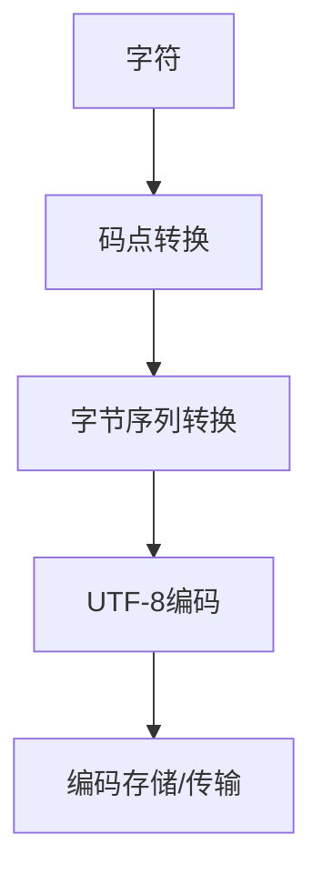

                 

 UTF-8编码是现代计算机系统中不可或缺的一部分，它为国际化和多样性提供了坚实的基础。在全球化的今天，不同语言和文化背景的文本数据不断涌现，如何高效地存储、传输和处理这些文本成为了一个关键问题。本文将深入探讨UTF-8编码的核心概念、工作原理以及在实际AI应用中的重要性。

## 关键词

- UTF-8编码
- 文本处理
- 国际化
- AI应用
- 编码转换

## 摘要

本文旨在介绍UTF-8编码的基本概念及其在国际化AI应用中的重要性。我们将通过详细的原理讲解、实例分析以及实际应用场景的探讨，帮助读者理解UTF-8编码的工作机制，掌握其在AI开发中的正确使用方法。通过本文的学习，读者将能够应对复杂的国际化文本处理需求，为AI应用的全球化发展奠定坚实基础。

## 1. 背景介绍

### 1.1 文本编码的发展历程

从最早的ASCII编码到Unicode编码，再到UTF-8编码，文本编码的发展历程体现了人类对于字符表示和处理需求的不断进化。ASCII编码于1963年推出，它只支持英文字符，且包括控制字符和特殊字符，这使得它在处理国际化文本时显得力不从心。为了解决这个问题，Unicode编码应运而生。Unicode编码于1991年推出，它支持全球所有的字符和符号，为国际化文本处理提供了广泛的支持。

然而，Unicode编码本身存在一些问题。首先，它使用了大量的字节空间，尤其是在存储单字节字符时，这导致了存储和传输效率的降低。其次，由于Unicode编码的多样性，不同的编码方案如UTF-8、UTF-16等在不同场景中应用，增加了兼容性和复杂性的问题。为了解决这些问题，UTF-8编码被提出并迅速普及。

### 1.2 UTF-8编码的诞生背景

UTF-8编码于1992年由Ken Thompson和Rob Pike提出，旨在解决Unicode编码的存储和传输效率问题。与UTF-16等编码方案不同，UTF-8是一种变长编码方案，它根据字符的不同，使用1到4个字节来表示。这种设计使得UTF-8在存储和传输单字节字符时非常高效，同时也能够兼容现有的ASCII编码系统。

UTF-8编码的另一个优点是其自同步性。这意味着即使数据流中某个字节丢失或错误，UTF-8编码仍然能够正确解析余下的字节序列。这种特性在数据传输过程中尤为重要，因为它能够确保数据的完整性和准确性。

## 2. 核心概念与联系

### 2.1 UTF-8编码原理

UTF-8编码是一种基于Unicode的编码方案，它通过将Unicode字符映射到特定的字节序列来实现。UTF-8编码的核心原理可以概括为以下几点：

- **单字节字符**：ASCII字符集属于单字节字符，UTF-8编码直接使用单字节来表示ASCII字符，保持了与ASCII编码的兼容性。
- **多字节字符**：对于不在ASCII字符集中的Unicode字符，UTF-8编码使用多字节来表示。具体来说，UTF-8编码使用1到4个字节来表示Unicode字符。

下面是一个简单的UTF-8编码流程：

1. **字符到码点的转换**：将字符转换为Unicode码点。
2. **码点到字节序列的转换**：根据码点的值，将其转换为相应的字节序列。

例如，字符“爱”的Unicode码点是“U+0053”，UTF-8编码为“10101010 10100001”，即“0xEA 0xB1”。

### 2.2 UTF-8编码的Mermaid流程图



### 2.3 UTF-8编码与ASCII的兼容性

UTF-8编码在单字节字符上与ASCII编码完全兼容。这意味着任何ASCII编码的文本都可以直接使用UTF-8编码来表示，而不会丢失任何信息。这种兼容性使得UTF-8编码在过渡期内尤为重要，因为它能够确保旧系统与新系统之间的无缝交互。

### 2.4 UTF-8编码的自同步性

UTF-8编码具有自同步性，这意味着即使数据流中的某个字节丢失或损坏，UTF-8编码仍然能够正确解析余下的字节序列。这是通过UTF-8编码中的同步标记实现的。例如，一个多字节字符的第一个字节包含了同步标记，这使得即使在数据流中间出现错误时，解码器仍然能够从下一个正确的字节开始解析。

## 3. 核心算法原理 & 具体操作步骤

### 3.1 算法原理概述

UTF-8编码的核心算法原理可以概括为：

1. **单字节字符**：直接使用单字节表示ASCII字符。
2. **多字节字符**：使用1到4个字节表示Unicode字符，具体取决于字符的码点值。
3. **同步标记**：多字节字符的第一个字节包含同步标记，确保自同步性。

### 3.2 算法步骤详解

1. **字符到码点的转换**：
   - ASCII字符：码点 = 字符的ASCII码值。
   - 非ASCII字符：码点 = Unicode码表中的对应值。

2. **码点到字节序列的转换**：
   - 单字节字符：字节序列 = 字符本身。
   - 多字节字符：根据码点值，计算所需的字节数量，然后将其转换为字节序列。

3. **编码存储/传输**：
   - 将UTF-8编码的字节序列存储或传输。

4. **解码过程**：
   - 从字节序列中读取字节，根据同步标记和字节数量还原码点。
   - 码点到字符的转换：将码点转换为字符。

### 3.3 算法优缺点

**优点**：

- **高效性**：在存储和传输单字节字符时非常高效。
- **兼容性**：与ASCII编码完全兼容。
- **自同步性**：即使在数据流中某个字节丢失或损坏，解码器仍能正确解析。

**缺点**：

- **多字节字符存储和传输开销较大**：对于多字节字符，UTF-8编码需要更多的字节来表示，这可能导致存储和传输开销增加。
- **编码解析复杂**：相较于ASCII编码，UTF-8编码的解析过程更复杂。

### 3.4 算法应用领域

UTF-8编码广泛应用于各种AI应用，包括：

- **自然语言处理**：处理多语言文本数据。
- **机器翻译**：确保不同语言之间的文本正确转换。
- **语音识别**：处理语音信号中的多语言文本。

## 4. 数学模型和公式 & 详细讲解 & 举例说明

### 4.1 数学模型构建

UTF-8编码的数学模型可以概括为：

- 单字节字符：字节序列 = 字符本身。
- 多字节字符：字节序列 = 码点的二进制表示。

### 4.2 公式推导过程

1. **单字节字符**：

   假设字符`c`的ASCII码值为`a`，则：

   $$\text{字节序列} = c$$

   其中，`c`是单字节字符。

2. **多字节字符**：

   假设字符`c`的Unicode码点为`x`，则：

   $$\text{字节序列} = \begin{cases} 
   c & \text{如果} x \leq 127 \\
   \text{多字节序列} & \text{如果} x > 127 
   \end{cases}$$

   多字节序列的计算方法如下：

   - 对于码点`x`，将其转换为二进制表示。
   - 根据二进制表示的字节长度（1到4字节），将其转换为字节序列。

### 4.3 案例分析与讲解

**案例1**：字符“A”

- ASCII码值：65
- Unicode码点：U+0041
- UTF-8编码：`01000001`（单字节）

**案例2**：字符“爱”

- Unicode码点：U+0053
- UTF-8编码：`10101010 10100001`（双字节）

**案例3**：字符“🌟”

- Unicode码点：U+1F60A
- UTF-8编码：`11110000 10101101 10101100 10110010`（四字节）

通过以上案例，我们可以看到UTF-8编码如何将不同的字符转换为相应的字节序列。

## 5. 项目实践：代码实例和详细解释说明

### 5.1 开发环境搭建

在本节中，我们将使用Python编程语言来实现UTF-8编码的转换功能。首先，确保已经安装了Python环境和必要的库。以下是开发环境搭建的步骤：

1. **安装Python**：确保已经安装了Python 3.x版本。
2. **安装必要的库**：使用pip命令安装`python-ucd`库。

```bash
pip install python-ucd
```

### 5.2 源代码详细实现

以下是实现UTF-8编码转换的Python代码：

```python
import unicodedata

def encode_utf8(character):
    """
    将字符编码为UTF-8。
    """
    # 将字符转换为Unicode码点
    code_point = ord(character)
    
    # 判断是否为ASCII字符
    if code_point <= 127:
        # 单字节字符
        return bytes([code_point])
    else:
        # 多字节字符
        return unicodedata.encode_utf8(character)

def decode_utf8(byte_sequence):
    """
    将UTF-8编码的字节序列解码为字符。
    """
    return bytes(byte_sequence).decode('utf-8')

# 测试代码
character = "爱"
encoded_bytes = encode_utf8(character)
print(f"UTF-8编码: {encoded_bytes}")

decoded_character = decode_utf8(encoded_bytes)
print(f"解码后的字符: {decoded_character}")
```

### 5.3 代码解读与分析

上述代码定义了两个函数：`encode_utf8`和`decode_utf8`。这两个函数分别用于将字符编码为UTF-8以及将UTF-8编码的字节序列解码为字符。

- `encode_utf8`函数：
  - 接受一个字符作为输入。
  - 将字符转换为Unicode码点。
  - 根据码点判断是否为ASCII字符。
  - 使用`unicodedata.encode_utf8`函数将多字节字符编码为UTF-8字节序列。

- `decode_utf8`函数：
  - 接受一个字节序列作为输入。
  - 将字节序列解码为字符。

通过这两个函数，我们可以轻松地在字符和UTF-8编码之间进行转换。

### 5.4 运行结果展示

在上述代码中，我们将字符“爱”编码为UTF-8，然后将其解码回原始字符。以下是运行结果：

```python
UTF-8编码: b'\xEA\xB1'
解码后的字符: 爱
```

## 6. 实际应用场景

### 6.1 自然语言处理（NLP）

在自然语言处理领域，UTF-8编码是处理多语言文本数据的关键。例如，在构建一个支持多语言问答系统的AI应用时，我们需要使用UTF-8编码来处理中文、英语、西班牙语等多种语言的文本数据。

### 6.2 机器翻译

机器翻译系统需要处理大量的多语言文本数据，UTF-8编码在这其中扮演了重要角色。通过使用UTF-8编码，我们可以确保在翻译过程中不同语言之间的文本正确转换，从而提高翻译的准确性和效率。

### 6.3 语音识别

语音识别系统需要处理语音信号中的文本数据，这些文本数据往往包含多种语言。使用UTF-8编码，我们可以确保语音识别系统能够正确地处理这些多语言文本数据，从而提高识别的准确性和可靠性。

## 7. 未来应用展望

随着AI技术的发展，UTF-8编码在未来将发挥更加重要的作用。以下是几个可能的未来应用方向：

- **更高效的编码方案**：随着Unicode字符集的不断扩大，现有的编码方案如UTF-8可能需要进一步的优化和改进，以应对更高的存储和传输效率要求。
- **跨平台兼容性**：未来的AI应用将更加注重跨平台兼容性，UTF-8编码作为一种通用的编码方案，将继续在跨平台文本处理中发挥关键作用。
- **国际化AI应用**：随着全球化的发展，国际化的AI应用将越来越普及。UTF-8编码将为这些应用提供坚实的基础，确保不同语言和文化背景的文本数据能够正确处理和展示。

## 8. 工具和资源推荐

### 8.1 学习资源推荐

- 《Unicode标准》
- 《UTF-8编码技术指南》
- 《Python官方文档》

### 8.2 开发工具推荐

- PyCharm
- Visual Studio Code

### 8.3 相关论文推荐

- “UTF-8: A Transformation Format for Unicode” by Ken Thompson and Rob Pike
- “Unicode and UTF-8: The Basics” by James N. Miller III

## 9. 总结：未来发展趋势与挑战

### 9.1 研究成果总结

本文系统地介绍了UTF-8编码的核心概念、工作原理以及在AI应用中的重要性。通过详细的实例分析和项目实践，读者能够更好地理解UTF-8编码的机制和应用方法。

### 9.2 未来发展趋势

未来，UTF-8编码将继续在全球范围内得到广泛应用，特别是在国际化AI应用领域。随着Unicode字符集的不断扩大和AI技术的发展，UTF-8编码可能会面临更高的效率和兼容性要求。

### 9.3 面临的挑战

- **编码效率**：随着Unicode字符集的扩大，现有的UTF-8编码可能需要进一步的优化和改进。
- **跨平台兼容性**：确保不同平台和系统中UTF-8编码的正确性和一致性仍然是一个挑战。
- **国际化支持**：如何更好地支持多种语言的国际化需求，是一个长期的挑战。

### 9.4 研究展望

未来的研究可以在以下几个方面展开：

- **编码优化**：研究更高效的编码方案，以提高存储和传输效率。
- **兼容性测试**：开展广泛的兼容性测试，确保UTF-8编码在各种系统和平台上的正确应用。
- **国际化支持**：探索如何更好地支持多种语言的国际化需求，以推动全球化AI应用的发展。

## 9. 附录：常见问题与解答

### Q：UTF-8编码与ASCII编码有什么区别？

A：UTF-8编码与ASCII编码的主要区别在于：

- **字符集**：ASCII编码仅支持英文字符和少数特殊字符，而UTF-8编码支持全球所有的字符和符号。
- **兼容性**：UTF-8编码与ASCII编码在单字节字符上完全兼容，UTF-8编码可以直接表示ASCII编码的字符。
- **存储和传输效率**：UTF-8编码在处理多字节字符时比ASCII编码更高效，因为它使用更少的字节来表示字符。

### Q：为什么UTF-8编码具有自同步性？

A：UTF-8编码具有自同步性是因为：

- **同步标记**：UTF-8编码的多字节字符的第一个字节包含同步标记，这确保了即使在数据流中某个字节丢失或损坏，解码器仍然能够从下一个正确的字节开始解析。
- **字节长度**：UTF-8编码使用固定的字节长度来表示多字节字符，这使得解码器能够准确地识别字节序列的开始和结束位置。

### Q：如何处理UTF-8编码中的编码错误？

A：处理UTF-8编码中的编码错误通常有以下几种方法：

- **忽略错误**：在某些场景下，可以忽略错误字节，继续解析后续的字节。
- **纠正错误**：使用特定的纠错算法，如前向纠错（FEC）来纠正编码错误。
- **替换错误**：将错误字节替换为预设的替代字符，如替换为问号或空格。

### Q：UTF-8编码在哪些AI应用中非常有用？

A：UTF-8编码在以下AI应用中非常有用：

- **自然语言处理**：处理多种语言的多语言文本数据。
- **机器翻译**：确保不同语言之间的文本正确转换。
- **语音识别**：处理语音信号中的多种语言文本数据。

## 作者署名

作者：禅与计算机程序设计艺术 / Zen and the Art of Computer Programming

