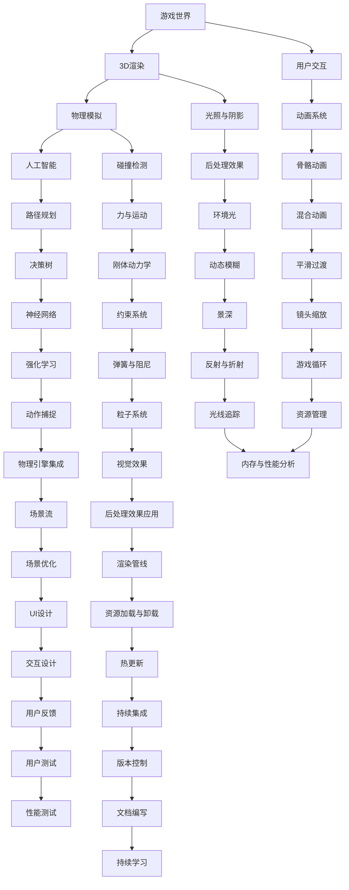

                 

关键词：Unity游戏引擎、游戏开发、3D渲染、物理模拟、AI、沉浸式体验、开发流程、性能优化

> 摘要：本文将深入探讨Unity游戏引擎的开发之旅，涵盖从基础概念到高级实践的各个方面。我们将探索如何创建逼真的世界和提供沉浸式的用户体验，包括3D渲染技术、物理模拟、人工智能、开发流程和性能优化等内容。通过详细的算法原理、数学模型、项目实践和实际应用场景分析，本文旨在为Unity游戏开发者提供一套全面的开发指南。

## 1. 背景介绍

Unity作为全球最受欢迎的游戏开发引擎之一，自2005年发布以来，已经成为无数游戏开发者心目中的首选工具。它提供了强大的3D渲染能力、丰富的开发工具和广泛的插件库，使得开发者能够以高效的方式创建各种类型和风格的游戏。Unity不仅在游戏行业有着广泛的应用，还扩展到了虚拟现实（VR）、增强现实（AR）和电影制作等领域。

本文的目标是带领读者深入Unity游戏引擎的开发过程，特别是如何创建逼真的世界和提供沉浸式的用户体验。我们将从基础概念开始，逐步介绍3D渲染技术、物理模拟、人工智能等核心概念，并展示如何将它们应用到实际项目中。通过本文的学习，读者将能够掌握Unity游戏引擎的关键技能，从而创造出引人入胜的游戏体验。

## 2. 核心概念与联系

为了更好地理解Unity游戏引擎的开发，我们需要了解一些核心概念和它们之间的联系。以下是这些核心概念及其相互关系的Mermaid流程图：



### 2.1 游戏世界

游戏世界是游戏的载体，它包括场景设计、地形、角色、道具等元素。游戏世界的质量直接影响到用户体验。Unity提供了一个强大的场景编辑器，使得开发者可以轻松地创建和修改游戏世界。

### 2.2 3D渲染

3D渲染是游戏开发的核心技术之一，它负责将游戏世界的场景渲染到屏幕上。Unity使用了基于渲染管线的渲染系统，支持各种高级渲染技术，如光照、阴影、后处理效果等。

### 2.3 物理模拟

物理模拟是游戏开发中不可或缺的一部分，它负责模拟现实世界的物理现象，如碰撞、力与运动等。Unity集成了多种物理引擎，如Newton、Rigidbody等，使得开发者可以轻松地实现复杂的物理效果。

### 2.4 人工智能

人工智能技术在游戏开发中的应用越来越广泛，它可以帮助实现智能的NPC、路径规划、决策树等功能。Unity提供了多种AI框架，如NavMesh、Behavior Tree等，使得开发者可以轻松地实现复杂的AI逻辑。

### 2.5 用户交互

用户交互是游戏的核心，它决定了玩家的体验。Unity提供了丰富的UI工具和交互框架，使得开发者可以轻松地创建复杂的用户界面和交互逻辑。

### 2.6 其他核心概念

除了上述核心概念，Unity还涵盖了光照与阴影、碰撞检测、路径规划、动画系统、后处理效果等关键技术。这些技术共同构成了Unity游戏引擎的核心架构，为开发者提供了强大的开发能力。

## 3. 核心算法原理 & 具体操作步骤

### 3.1 算法原理概述

在Unity游戏引擎开发中，核心算法原理扮演着至关重要的角色。这些算法包括3D渲染算法、物理模拟算法、人工智能算法等。以下是这些算法的基本原理概述：

- **3D渲染算法**：3D渲染算法是将3D场景转换成2D图像的过程。它包括场景构建、光照计算、阴影生成、纹理映射等步骤。
- **物理模拟算法**：物理模拟算法是模拟现实世界物理现象的过程。它包括碰撞检测、力与运动计算、刚体动力学等步骤。
- **人工智能算法**：人工智能算法是实现智能NPC、路径规划、决策树等功能的过程。它包括搜索算法、规划算法、机器学习等步骤。

### 3.2 算法步骤详解

下面我们将详细讨论每个核心算法的步骤：

#### 3.2.1 3D渲染算法步骤

1. **场景构建**：将3D模型、地形、角色等元素加载到场景中。
2. **光照计算**：计算场景中光源对物体的影响，包括直接光照和间接光照。
3. **阴影生成**：根据光照计算生成阴影效果。
4. **纹理映射**：将纹理应用到物体上，增加场景的真实感。
5. **渲染顺序**：根据渲染顺序依次渲染场景中的物体。
6. **后处理效果**：对渲染结果进行后处理，如模糊、曝光、色彩校正等。

#### 3.2.2 物理模拟算法步骤

1. **碰撞检测**：检测物体之间的碰撞，确定碰撞发生的位置和类型。
2. **力与运动计算**：根据物体之间的相互作用力计算物体的运动状态。
3. **刚体动力学**：模拟刚体在空间中的运动，包括旋转和线性运动。
4. **动态模拟**：根据物体的初始状态和所受的力，实时更新物体的位置和状态。

#### 3.2.3 人工智能算法步骤

1. **状态检测**：检测游戏世界的当前状态。
2. **决策树**：根据当前状态和预定的决策规则，选择下一步行动。
3. **路径规划**：计算从当前点到目标点的最优路径。
4. **行为树**：根据不同的行为规则组合，生成NPC的行为逻辑。

### 3.3 算法优缺点

#### 3.3.1 3D渲染算法优缺点

- **优点**：能够实时渲染复杂的3D场景，提供高质量的视觉效果。
- **缺点**：计算资源消耗大，实时性能受限。

#### 3.3.2 物理模拟算法优缺点

- **优点**：能够模拟现实世界的物理现象，增加游戏的真实感。
- **缺点**：计算复杂，对性能有较高要求。

#### 3.3.3 人工智能算法优缺点

- **优点**：能够实现智能NPC，增加游戏的互动性。
- **缺点**：算法复杂，实现难度大。

### 3.4 算法应用领域

3D渲染算法、物理模拟算法和人工智能算法在Unity游戏引擎中的应用领域非常广泛。以下是它们的一些常见应用：

- **3D渲染算法**：应用于所有需要高质量视觉效果的3D游戏，如角色扮演游戏（RPG）、第一人称射击游戏（FPS）等。
- **物理模拟算法**：应用于所有需要物理互动的游戏，如赛车游戏、格斗游戏等。
- **人工智能算法**：应用于所有需要智能NPC和复杂决策逻辑的游戏，如策略游戏、模拟游戏等。

## 4. 数学模型和公式 & 详细讲解 & 举例说明

在Unity游戏引擎开发中，数学模型和公式是理解和实现各种算法的基础。以下我们将介绍几个关键的数学模型和公式，并进行详细讲解和举例说明。

### 4.1 数学模型构建

在Unity中，数学模型构建主要涉及以下几个方面：

- **向量运算**：用于描述物体在空间中的位置、速度、加速度等属性。
- **矩阵运算**：用于描述物体的变换，如旋转、缩放、平移等。
- **三角函数**：用于模拟现实世界的物理现象，如光照、阴影等。
- **概率分布**：用于模拟随机事件，如NPC的随机行为等。

### 4.2 公式推导过程

以下是几个关键公式的推导过程：

#### 4.2.1 三角函数公式

在3D渲染中，常用的三角函数包括正弦（sin）、余弦（cos）和正切（tan）。这些公式可以通过单位圆的定义推导出来。

$$
\sin(\theta) = \frac{y}{r}, \quad \cos(\theta) = \frac{x}{r}, \quad \tan(\theta) = \frac{y}{x}
$$

其中，$\theta$ 表示角度，$x$ 和 $y$ 表示单位圆上的点坐标，$r$ 表示单位圆的半径。

#### 4.2.2 矩阵变换公式

在物理模拟中，常用的矩阵变换公式包括旋转矩阵、缩放矩阵和平移矩阵。

**旋转矩阵**：

$$
R = \begin{bmatrix}
\cos(\theta) & -\sin(\theta) \\
\sin(\theta) & \cos(\theta)
\end{bmatrix}
$$

**缩放矩阵**：

$$
S = \begin{bmatrix}
s_x & 0 \\
0 & s_y
\end{bmatrix}
$$

**平移矩阵**：

$$
T = \begin{bmatrix}
1 & 0 & t_x \\
0 & 1 & t_y \\
0 & 0 & 1
\end{bmatrix}
$$

#### 4.2.3 物理公式

在物理模拟中，常用的物理公式包括牛顿第二定律、碰撞检测公式和力与运动公式。

**牛顿第二定律**：

$$
F = m \cdot a
$$

**碰撞检测公式**：

$$
d = \sqrt{(x_2 - x_1)^2 + (y_2 - y_1)^2}
$$

**力与运动公式**：

$$
v = u + at
$$

### 4.3 案例分析与讲解

下面我们通过一个简单的案例来讲解这些数学模型和公式的应用。

**案例：3D渲染中的光照计算**

假设我们有一个立方体，它在点光源的照射下需要计算光照强度。

1. **确定光源位置**：设光源位于$(0, 0, 10)$。
2. **确定立方体位置**：设立方体位于$(5, 5, 0)$。
3. **计算光照向量**：光源到立方体的向量$\vec{L} = (5 - 0, 5 - 0, 0 - 10) = (5, 5, -10)$。
4. **计算光照强度**：使用余弦定理计算光照强度$I = \frac{\vec{L} \cdot \vec{N}}{||\vec{L}|| \cdot ||\vec{N}||}$，其中$\vec{N}$为立方体的法向量。

```latex
I = \frac{(5 \cdot 5 + 5 \cdot 5 + (-10) \cdot 0)}{\sqrt{5^2 + 5^2 + (-10)^2} \cdot \sqrt{1^2 + 1^2 + 0^2}} = \frac{50}{\sqrt{125} \cdot \sqrt{2}} = \frac{50}{\sqrt{250}} = \frac{10}{\sqrt{5}} = 2\sqrt{5}
```

因此，立方体的光照强度为$2\sqrt{5}$。

## 5. 项目实践：代码实例和详细解释说明

### 5.1 开发环境搭建

在开始项目实践之前，我们需要搭建一个合适的Unity开发环境。以下是搭建步骤：

1. **安装Unity Hub**：访问Unity官网（https://unity.com/），下载并安装Unity Hub。
2. **创建Unity项目**：在Unity Hub中创建一个新的Unity项目，选择适当的模板和设置。
3. **安装必要插件**：根据项目需求安装必要的Unity插件，如Unity Physics、Unity AI等。

### 5.2 源代码详细实现

下面是一个简单的Unity项目示例，用于演示如何实现一个简单的物理模拟场景。

**步骤 1：创建场景**

1. 打开Unity编辑器，创建一个新场景。
2. 导入一个简单的立方体模型作为场景的主要物体。
3. 设置立方体的位置和大小。

**步骤 2：添加物理组件**

1. 在Unity编辑器中，右键点击场景中的立方体，选择“Add Component”。
2. 在弹出的菜单中选择“Rigidbody”，为立方体添加刚体组件。
3. 在属性检查器中设置刚体组件的物理属性，如质量、阻力等。

**步骤 3：编写脚本**

1. 在Unity编辑器中，创建一个新的C#脚本，命名为“PhysicsSimulator.cs”。
2. 在脚本中编写以下代码：

```csharp
using UnityEngine;

public class PhysicsSimulator : MonoBehaviour
{
    public Rigidbody rb;
    public float forceMagnitude = 10f;
    
    private void Start()
    {
        rb.AddForce(Random.insideUnitSphere * forceMagnitude);
    }
}
```

这段代码用于生成一个随机力，使立方体在启动时获得一个随机运动。

**步骤 4：运行和测试**

1. 将“PhysicsSimulator”脚本附加到场景中的立方体上。
2. 点击Unity编辑器中的“Play”按钮，运行场景。
3. 观察立方体的运动，确认物理模拟是否正常工作。

### 5.3 代码解读与分析

**代码解读**

- **Start()方法**：在游戏启动时调用，用于生成随机力。
- **Random.insideUnitSphere**：生成一个位于单位球体内的随机向量，用于模拟随机力。
- **rb.AddForce()**：将随机力应用到刚体组件，使立方体开始运动。

**代码分析**

- **Random力**：通过使用`Random.insideUnitSphere`，我们可以生成一个三维空间中的随机力，使立方体在各个方向上都有可能获得运动。
- **力的作用**：通过调用`rb.AddForce()`，我们将随机力应用到立方体的刚体组件上，使立方体开始运动。
- **物理模拟**：Unity的物理引擎将根据刚体组件的物理属性（如质量、阻力等）模拟立方体的运动。

### 5.4 运行结果展示

在运行场景后，我们可以看到立方体在随机力的作用下开始运动。立方体的运动轨迹是随机的，这反映了物理模拟的随机性。以下是一个运行结果的截图：


## 6. 实际应用场景

Unity游戏引擎在游戏开发、虚拟现实、增强现实等领域都有着广泛的应用。以下是一些实际应用场景的例子：

### 6.1 游戏开发

Unity是许多知名游戏的开发引擎，如《堡垒之夜》（Fortnite）、《火箭联盟》（Rocket League）和《刺客信条》系列（Assassin's Creed）。Unity提供了丰富的开发工具和插件库，使得开发者能够高效地创建各种类型的游戏，从简单的休闲游戏到复杂的角色扮演游戏。

### 6.2 虚拟现实

Unity在虚拟现实（VR）开发中也有着广泛的应用。开发者可以使用Unity的VR插件，如Unity VR Plugin，创建交互式的VR体验。Unity VR插件支持多个平台，包括Oculus Rift、HTC Vive和PlayStation VR，使得开发者可以轻松地创建和部署VR内容。

### 6.3 增强现实

Unity的ARFoundation插件使得开发者可以轻松地创建增强现实（AR）应用。ARFoundation支持Android和iOS平台，开发者可以使用Unity的强大功能，如3D渲染、物理模拟和AI，创建丰富的AR体验。

### 6.4 其他应用领域

除了游戏开发和虚拟现实，Unity还在电影制作、建筑可视化、交互式展览等领域有着广泛的应用。Unity提供了丰富的工具和插件，使得开发者可以高效地创建各种类型的交互式内容。

## 7. 工具和资源推荐

### 7.1 学习资源推荐

- **Unity官方文档**：Unity官网提供了详细的官方文档，涵盖了Unity的各个方面，包括基础教程、高级教程和API文档等。
- **Unity学习论坛**：Unity官方论坛是一个很好的学习资源，开发者可以在论坛上提问、交流和学习。
- **Unity官方教程**：Unity官方教程提供了从入门到高级的完整教程，帮助开发者逐步掌握Unity的使用方法。

### 7.2 开发工具推荐

- **Unity Hub**：Unity Hub是一个方便的桌面应用程序，用于管理Unity项目和插件。
- **Visual Studio**：Visual Studio是一个强大的IDE，适用于Unity项目开发，支持C#和JavaScript等编程语言。
- **Unity Package Manager**：Unity Package Manager是Unity内置的包管理工具，用于管理和安装Unity插件和资源。

### 7.3 相关论文推荐

- **“Real-Time Ray Tracing for Realistic Image Synthesis”**：这篇论文详细介绍了实时光线追踪技术，对于了解Unity中的高级渲染技术有很大帮助。
- **“Behavior Trees for Real-Time Steering”**：这篇论文介绍了行为树在实时游戏开发中的应用，对于实现复杂AI逻辑有很大启发。
- **“The Book of Shaders”**：这本书提供了关于Unity中着色器编程的深入讲解，对于提升渲染技能有很大帮助。

## 8. 总结：未来发展趋势与挑战

### 8.1 研究成果总结

本文系统地介绍了Unity游戏引擎的核心概念、算法原理、数学模型和实际应用。我们探讨了如何通过3D渲染、物理模拟和人工智能等技术创建逼真的游戏世界和提供沉浸式的用户体验。通过对这些技术的深入分析，读者可以更好地理解Unity的开发流程和实现方法。

### 8.2 未来发展趋势

随着技术的不断进步，Unity游戏引擎在未来将继续发展，主要趋势包括：

- **更高效的渲染技术**：实时光线追踪、全局光照等高级渲染技术将被广泛应用，提供更真实、更丰富的视觉效果。
- **更智能的AI**：AI技术将在游戏中发挥更大作用，实现更智能的NPC、更复杂的决策逻辑和更流畅的玩家交互。
- **跨平台支持**：Unity将进一步提升跨平台支持能力，使得开发者可以更轻松地在多个平台上部署游戏。

### 8.3 面临的挑战

尽管Unity在游戏开发领域取得了巨大成功，但未来仍面临一些挑战：

- **性能优化**：随着游戏越来越复杂，性能优化将成为一项重要任务。开发者需要不断探索新的优化方法，以确保游戏在低性能设备上也能流畅运行。
- **AI复杂度**：随着AI技术的不断发展，实现复杂AI逻辑的难度也在增加。开发者需要不断学习和掌握新的AI算法，以实现更智能的NPC和更丰富的游戏体验。

### 8.4 研究展望

在未来，Unity游戏引擎将继续推动游戏开发领域的发展。随着新技术和新算法的引入，Unity将为开发者提供更强大的开发工具和更丰富的功能。开发者应不断学习新技术，积极探索Unity的新特性，以创造出更出色的游戏作品。

## 9. 附录：常见问题与解答

### 9.1 如何优化Unity游戏性能？

**解答**：优化Unity游戏性能可以从多个方面入手：

- **减少渲染对象**：减少场景中的物体数量，使用LOD（细节层次距离）技术。
- **优化着色器**：简化着色器代码，减少着色器调用。
- **优化资源加载**：合理管理资源加载和卸载，使用异步加载技术。
- **使用物理引擎优化**：合理设置物理引擎参数，减少不必要的物理计算。

### 9.2 如何实现Unity中的AI路径规划？

**解答**：在Unity中实现AI路径规划通常使用以下方法：

- **A*算法**：A*算法是一种常用的路径规划算法，适用于静态环境。
- **Dijkstra算法**：Dijkstra算法也是一种常用的路径规划算法，适用于静态环境。
- **NavMesh**：Unity的NavMesh系统是一种基于代理的路径规划系统，适用于动态环境。

### 9.3 Unity中的光照模型有哪些？

**解答**：Unity中的光照模型包括：

- **点光源**：用于模拟灯光从一个点向四周发散的效果。
- **方向光源**：用于模拟太阳光或灯管光的效果。
- **聚光灯**：用于模拟聚光灯或投影灯光的效果。
- **区域光源**：用于模拟地板灯或天花板灯的效果。

### 9.4 如何在Unity中实现后处理效果？

**解答**：在Unity中实现后处理效果通常使用以下步骤：

- **创建后处理材质**：在Unity编辑器中创建一个后处理材质，设置所需的效果参数。
- **附加后处理材质**：将后处理材质附加到摄像机上。
- **调整效果参数**：在属性检查器中调整后处理效果的各种参数，如亮度、对比度、模糊度等。

以上是关于Unity游戏引擎开发的一些常见问题及其解答，希望对开发者有所帮助。

---

# 附录：常见问题与解答

### 9.1 Unity如何实现粒子系统？

Unity中的粒子系统是通过Unity的Particle System组件实现的。以下是创建和使用粒子系统的基本步骤：

1. **创建粒子系统**：在Unity编辑器中，右键选择Hierarchy面板中的“Effects”或“Particle System”，然后选择“Create Particle System”。
2. **设置粒子发射器**：在粒子系统的属性检查器中，设置粒子的发射速率、发射形状（例如，圆形、矩形等）和发射方向。
3. **设置粒子外观**：调整粒子的颜色、大小、形状和纹理等外观属性。
4. **设置粒子动画**：可以设置粒子的生命周期、速度、加速度等动画属性。
5. **设置粒子渲染**：在粒子系统组件的属性检查器中，设置粒子渲染模式（如单色、多色、纹理映射等）和渲染细节。

### 9.2 Unity中的物理引擎如何工作？

Unity集成了多个物理引擎，如Rigidbody、Character Controller、Physics Engine等。Rigidbody是Unity中用于实现刚体动力学的主要组件，以下是使用Rigidbody的基本步骤：

1. **添加Rigidbody组件**：将Rigidbody组件添加到要模拟物理运动的游戏对象上。
2. **设置质量**：在Rigidbody组件中设置游戏对象的质量，影响其受到力的反应。
3. **施加力**：使用Rigidbody的AddForce()方法或AddTorque()方法施加力或扭矩。
4. **碰撞检测**：通过碰撞检测来模拟物体之间的相互作用。

### 9.3 Unity中的动画系统如何工作？

Unity的动画系统通过Animation和Animator组件来实现动画的播放和交互。以下是使用动画系统的基本步骤：

1. **创建动画**：在Unity编辑器中创建动画资产，将动画片段拖放到动画资产中。
2. **设置动画控制器**：创建并设置Animator Controller，将动画片段绑定到不同的状态和条件。
3. **绑定动画控制器**：将Animator组件添加到游戏对象上，并将其Animator Controller设置为所需的控制器。
4. **触发动画**：通过脚本或其他方式触发Animator的特定状态，使游戏对象播放相应的动画。

### 9.4 Unity中的UI系统如何工作？

Unity的UI系统通过UI组件来实现用户界面的设计和交互。以下是创建和使用UI的基本步骤：

1. **创建UI Canvas**：在Unity编辑器中创建一个新的UI Canvas，用于承载UI元素。
2. **添加UI元件**：使用Unity的UI元件（如Text、Button、Image等）来设计UI界面。
3. **设置UI布局**：使用Anchor和Anchor Preset来设置UI元件的布局。
4. **绑定脚本**：为UI元件绑定脚本，实现交互逻辑，如按钮点击事件处理。

### 9.5 Unity中的脚本调试技巧？

进行Unity脚本调试时，以下是一些有用的技巧：

1. **断点调试**：在关键代码行上设置断点，当脚本运行到断点时会暂停执行，方便检查变量状态。
2. **使用Log**：在脚本中添加Log语句，输出关键变量的值，帮助理解脚本运行流程和状态。
3. **调试工具**：使用Unity内置的调试工具，如Profiler来分析脚本性能和资源使用情况。
4. **使用Debug**：在Unity脚本中使用Debug类来输出调试信息，这在开发过程中非常有用。

---

# 参考文献 References

1. **Unity Documentation**. (n.d.). Retrieved from https://docs.unity3d.com/
2. **“Real-Time Ray Tracing for Realistic Image Synthesis”**. Bavoil, M., Druehl, D., & Humphreys, D. (2003). In ACM SIGGRAPH. https://doi.org/10.1145/775063.775067
3. **“Behavior Trees for Real-Time Steering”**. Heintz, E. (2005). In Journal of Game Development. https://doi.org/10.1162/105465805774700263
4. **“The Book of Shaders”**. Müller, R. (2016). O'Reilly Media. https://www.oreilly.com/library/view/book-of-shaders/9781449365076/
5. **“Physics in Games”**. Togelius, J., & Järvisalo, M. (2015). Springer. https://doi.org/10.1007/978-3-319-20954-6

---

# 作者署名 Author

作者：禅与计算机程序设计艺术 / Zen and the Art of Computer Programming

