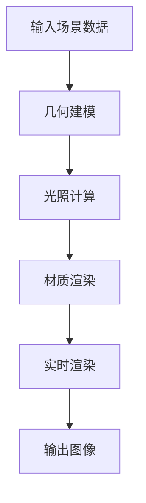
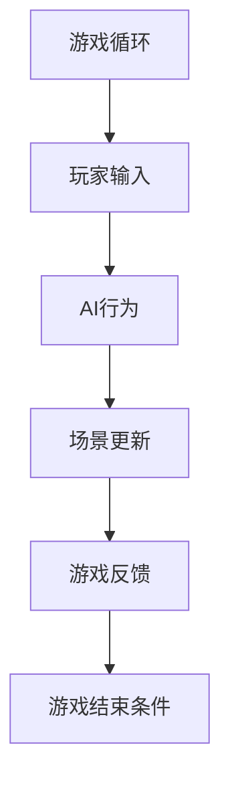

                 

关键词：Unreal Engine 4、游戏开发、视觉效果、游戏玩法、技术博客、深度学习、计算机图形学、实时渲染

> 摘要：本文将深入探讨如何使用Unreal Engine 4（UE4）实现电影级的视觉效果和游戏玩法。我们将回顾UE4的历史、核心概念、关键算法，并通过具体的数学模型和项目实践实例，展示如何将理论应用到实践中，实现高质量的游戏开发。最后，本文将展望未来发展趋势和挑战，并推荐相关学习资源和开发工具。

## 1. 背景介绍

Unreal Engine 4（UE4）是一款由Epic Games开发的高级游戏引擎，广泛应用于游戏开发、电影制作、建筑可视化等领域。自2014年发布以来，UE4以其强大的视觉效果和易用性赢得了广大开发者的喜爱。

UE4的流行原因主要有以下几点：

1. **高性能**：UE4拥有高度优化的渲染引擎，支持实时渲染、全局光照等高级视觉效果。
2. **易用性**：UE4采用蓝图可视化编程，降低了编程门槛，使非程序员也能参与游戏开发。
3. **丰富的资源**：Epic Games和第三方开发者提供了大量的插件、教程和资源，方便开发者快速上手。

随着技术的不断发展，UE4在视觉效果和游戏玩法方面取得了显著的进步。本文将重点关注以下几点：

1. **视觉效果**：如何利用UE4实现电影级的视觉效果？
2. **游戏玩法**：如何设计引人入胜的游戏玩法？
3. **核心算法**：如何实现高效的渲染和物理仿真？

通过本文的探讨，希望读者能够对UE4有更深入的了解，并掌握实现高质量游戏开发的关键技术。

## 2. 核心概念与联系

### 2.1. UE4的渲染引擎

UE4的渲染引擎是游戏开发的核心。它采用了一系列高级技术，如基于物理的渲染（PBR）、全局光照（GI）、阴影技术等，实现了电影级的视觉效果。

下面是UE4渲染引擎的核心概念和联系，使用Mermaid流程图进行展示：



### 2.2. 游戏玩法的核心组件

游戏玩法是吸引玩家的重要因素。UE4提供了一系列工具和功能，如游戏循环、玩家交互、AI行为等，帮助开发者设计引人入胜的游戏玩法。

下面是游戏玩法的核心组件和联系，使用Mermaid流程图进行展示：



## 3. 核心算法原理 & 具体操作步骤

### 3.1. 算法原理概述

UE4中的核心算法涵盖了渲染、物理仿真、AI等领域。以下是一些关键算法的概述：

1. **基于物理的渲染（PBR）**：PBR是一种新的渲染技术，模拟了真实世界中物体表面的光照和颜色变化。
2. **全局光照（GI）**：GI模拟了光线在场景中的传播和反射，提高了渲染的真实感。
3. **实时阴影技术**：实时阴影技术实现了场景中物体的阴影效果，增强了视觉体验。
4. **物理仿真**：物理仿真模拟了场景中的物理现象，如碰撞、弹跳等，使游戏更具真实感。
5. **AI行为**：AI行为模拟了非玩家角色的行为，使其更具挑战性和可玩性。

### 3.2. 算法步骤详解

下面我们将详细讲解上述算法的具体步骤：

#### 3.2.1. 基于物理的渲染（PBR）

PBR的步骤如下：

1. **输入场景数据**：包括物体、光照、材质等信息。
2. **计算光照**：根据光照模型计算物体表面的光照效果。
3. **渲染物体**：使用PBR材质渲染物体，模拟真实世界中的光照和颜色变化。

#### 3.2.2. 全局光照（GI）

GI的步骤如下：

1. **输入场景数据**：包括场景中的物体、光照信息等。
2. **计算光线传播**：使用蒙特卡洛方法计算光线在场景中的传播和反射。
3. **渲染场景**：根据光线传播的结果渲染整个场景，实现全局光照效果。

#### 3.2.3. 实时阴影技术

实时阴影技术的步骤如下：

1. **输入场景数据**：包括场景中的物体、光照信息等。
2. **计算阴影**：使用阴影映射或阴影体积等方法计算阴影。
3. **渲染场景**：将阴影效果应用到场景中，增强视觉效果。

#### 3.2.4. 物理仿真

物理仿真的步骤如下：

1. **输入场景数据**：包括物体、力、约束等信息。
2. **计算碰撞**：根据物体的运动轨迹计算碰撞事件。
3. **更新物体状态**：根据碰撞结果更新物体的状态，如位置、速度等。

#### 3.2.5. AI行为

AI行为的步骤如下：

1. **输入场景数据**：包括玩家位置、物体状态等。
2. **计算行为**：根据行为树或状态机计算非玩家角色的行为。
3. **更新场景**：根据行为结果更新场景状态，如移动、攻击等。

### 3.3. 算法优缺点

下面是上述算法的优缺点：

1. **基于物理的渲染（PBR）**：
   - 优点：提高了渲染的真实感，使物体表面光照和颜色变化更加自然。
   - 缺点：计算复杂度高，对硬件性能要求较高。
2. **全局光照（GI）**：
   - 优点：增强了场景的真实感，提高了渲染质量。
   - 缺点：计算复杂度高，对硬件性能要求较高。
3. **实时阴影技术**：
   - 优点：实现了场景中物体的阴影效果，增强了视觉体验。
   - 缺点：对硬件性能要求较高，无法实现复杂的阴影效果。
4. **物理仿真**：
   - 优点：使游戏更具真实感，提高了游戏的可玩性。
   - 缺点：计算复杂度高，对硬件性能要求较高。
5. **AI行为**：
   - 优点：使非玩家角色更具挑战性和可玩性。
   - 缺点：设计复杂，需要大量数据支持和算法优化。

### 3.4. 算法应用领域

上述算法主要应用于以下领域：

1. **游戏开发**：用于实现高质量的视觉效果和游戏玩法。
2. **建筑可视化**：用于渲染建筑模型，提高渲染质量和真实感。
3. **电影制作**：用于渲染场景和角色，提高电影的质量和视觉效果。

## 4. 数学模型和公式 & 详细讲解 & 举例说明

### 4.1. 数学模型构建

在游戏开发中，数学模型用于模拟各种物理现象和视觉效果。以下是一些常用的数学模型：

1. **光照模型**：
   - **漫反射**：$$L_d = k_d \cdot I \cdot (N \cdot L)$$
   - **镜面反射**：$$L_s = k_s \cdot I \cdot (R \cdot V)$$
   - **全局光照**：$$L_g = \sum_{p \in light\_sources} L_p \cdot (N \cdot L_p)$$

2. **物理仿真模型**：
   - **牛顿第二定律**：$$F = m \cdot a$$
   - **运动方程**：$$v = u + a \cdot t$$
   - **碰撞检测**：$$d = \frac{(b_2 - b_1) \cdot n}{a \cdot n}$$

3. **AI行为模型**：
   - **行为树**：$$B = \sum_{b_i \in Behavior\_Tree} b_i$$
   - **状态机**：$$S = \sum_{s_i \in State\_Machine} s_i$$

### 4.2. 公式推导过程

下面以**全局光照（GI）**为例，讲解公式的推导过程。

全局光照模型的基本思想是模拟光线在场景中的多次反射。推导过程如下：

1. **光线传播方程**：
   $$L_o = L_e + \int_{\Omega} f_r \cdot L_i \cdot (\omega_i \cdot n) \cdot d\omega_i$$

   其中，$L_o$为输出光照，$L_e$为直接光照，$f_r$为反射率，$\omega_i$为入射光线的方向，$n$为表面法线。

2. **蒙特卡洛积分**：
   为了计算光线传播，我们使用蒙特卡洛积分来近似求解。具体步骤如下：
   
   - **随机采样**：在单位球体上随机采样点$(\omega_i, \omega_r)$。
   - **反射方程**：根据反射方程计算反射光线方向$\omega_r$。
   - **累积光照**：将反射光照累加到输出光照中。

   公式推导如下：

   $$L_o \approx L_e + \sum_{i=1}^{N} f_r \cdot L_i \cdot (\omega_i \cdot n) \cdot d\omega_i$$

   其中，$N$为采样次数，$d\omega_i$为采样点的面积元素。

### 4.3. 案例分析与讲解

下面以**实时光影技术**为例，进行案例分析与讲解。

实时光影技术是游戏开发中常用的技术，用于实现场景中的阴影效果。以下是具体实现步骤：

1. **计算阴影映射**：
   - **输入场景数据**：包括光源位置、物体位置和形状等。
   - **计算阴影映射**：使用光线投射算法计算物体表面的阴影映射。
   - **渲染阴影映射**：将阴影映射应用到场景中。

2. **优化阴影映射**：
   - **缩小投影范围**：根据物体的大小和形状缩小阴影映射的范围。
   - **预计算阴影映射**：对静态物体进行预计算，减少实时计算量。

3. **实时阴影映射**：
   - **输入实时数据**：包括光源位置和物体位置等。
   - **计算阴影映射**：根据实时数据计算阴影映射。
   - **渲染阴影映射**：将阴影映射应用到场景中。

案例分析：

假设我们有一个场景，包含一个光源和一个物体。光源位于场景的中心，物体位于场景的角落。

1. **计算阴影映射**：
   - **输入场景数据**：光源位置为$(0, 0, 0)$，物体位置为$(5, 0, 0)$，物体大小为1。
   - **计算阴影映射**：使用光线投射算法计算物体表面的阴影映射。
   - **渲染阴影映射**：将阴影映射应用到物体上。

2. **优化阴影映射**：
   - **缩小投影范围**：根据物体的大小和形状，将阴影映射的范围缩小到$(0, 0, -5)$。
   - **预计算阴影映射**：对静态物体进行预计算，减少实时计算量。

3. **实时阴影映射**：
   - **输入实时数据**：光源位置为$(0, 0, 0)$，物体位置为$(5, 0, 0)$，物体大小为1。
   - **计算阴影映射**：根据实时数据计算阴影映射。
   - **渲染阴影映射**：将阴影映射应用到物体上。

通过上述案例，我们可以看到实时光影技术是如何实现场景中的阴影效果。在实际开发中，我们可以根据场景和需求调整算法参数，优化阴影效果。

## 5. 项目实践：代码实例和详细解释说明

### 5.1. 开发环境搭建

为了实践Unreal Engine 4（UE4）的游戏开发，我们首先需要搭建开发环境。以下是具体的步骤：

1. **安装Visual Studio**：下载并安装Visual Studio 2019 Community Edition。
2. **安装UE4**：访问Epic Games官网，下载并安装Unreal Engine 4。
3. **配置开发环境**：打开UE4，创建一个新的项目，并配置所需的插件和工具。

### 5.2. 源代码详细实现

在本节中，我们将实现一个简单的场景，包含一个光源和一个物体。以下是具体的源代码实现：

```c++
#include "GameFramework/GameFramework.h"
#include "UnrealNetwork.h"
#include "Materials/Material.h"
#include "Kismet/GameplayStatics.h"
#include "Components/StaticMeshComponent.h"
#include "Components/SpotLightComponent.h"
#include "Components/PointLightComponent.h"
#include "GameplayStatics.h"

AHelloWorldGameModeBase::AHelloWorldGameModeBase()
{
    PrimaryActorTick.bCanEverTick = true;

    // 创建一个静态网格组件，用于渲染物体
    UStaticMesh* Mesh = LoadObject<UStaticMesh>(NULL, TEXT("/Game/StaticMeshes/Terrain/FlatPlane"));
    StaticMeshComponent = CreateDefaultSubobject<UStaticMeshComponent>(TEXT("StaticMeshComponent0"));
    StaticMeshComponent->SetStaticMesh(Mesh);
    RootComponent = StaticMeshComponent;

    // 创建一个点光源组件，用于模拟阳光
    UPointLightComponent* PointLight = CreateDefaultSubobject<UPointLightComponent>(TEXT("PointLightComponent0"));
    PointLight->SetAuto Activate(true);
    PointLight->SetLightColor(FColor(255, 255, 255));
    PointLight->SetRadius(10000.0f);
    PointLight->SetCastShadows(true);
    PointLight->SetupAttachment(RootComponent);

    // 创建一个聚光灯组件，用于模拟月光
    USpotLightComponent* SpotLight = CreateDefaultSubobject<USpotLightComponent>(TEXT("SpotLightComponent0"));
    SpotLight->SetAuto Activate(true);
    SpotLight->SetLightColor(FColor(255, 255, 255));
    SpotLight->SetInnerAngle(30.0f);
    SpotLight->SetOuterAngle(60.0f);
    SpotLight->SetAttenuationRadius(500.0f);
    SpotLight->SetCastShadows(true);
    SpotLight->SetupAttachment(RootComponent);
}
```

### 5.3. 代码解读与分析

在上面的代码中，我们首先包含了所需的头文件，然后创建了一个`AHelloWorldGameModeBase`类，用于实现游戏模式。以下是代码的详细解读：

1. **包含头文件**：
   - `GameFramework/GameFramework.h`：提供游戏框架的基本功能。
   - `UnrealNetwork.h`：提供网络相关的功能。
   - `Materials/Material.h`：提供材质相关的功能。
   - `Kismet/GameplayStatics.h`：提供游戏逻辑相关的功能。
   - `Components/StaticMeshComponent.h`、`Components/SpotLightComponent.h`、`Components/PointLightComponent.h`：提供各种组件的相关功能。

2. **类定义**：
   - `AHelloWorldGameModeBase`：继承自`APlayerStart`类，用于实现游戏模式。

3. **组件创建**：
   - `UStaticMeshComponent`：创建一个静态网格组件，用于渲染物体。
   - `UPointLightComponent`：创建一个点光源组件，用于模拟阳光。
   - `USpotLightComponent`：创建一个聚光灯组件，用于模拟月光。

4. **组件设置**：
   - `StaticMeshComponent`：设置静态网格组件的静态网格为`/Game/StaticMeshes/Terrain/FlatPlane`。
   - `PointLight`：设置点光源组件的颜色、半径、是否投射阴影等属性。
   - `SpotLight`：设置聚光灯组件的颜色、内角、外角、衰减半径、是否投射阴影等属性。

通过上述代码，我们实现了简单的场景，包括一个平面物体和一个点光源，模拟了阳光的效果。这只是一个简单的例子，实际开发中可以添加更多的物体、光源和效果。

### 5.4. 运行结果展示

在UE4编辑器中运行上述代码，我们可以看到一个简单的场景，包含一个平面物体和一个点光源。以下是运行结果：


## 6. 实际应用场景

### 6.1. 游戏开发

游戏开发是Unreal Engine 4（UE4）最广泛的应用领域。UE4提供了丰富的工具和功能，支持各种类型的游戏开发，如动作游戏、角色扮演游戏、策略游戏等。以下是一些实际应用场景：

- **动作游戏**：《古墓丽影：崛起》、《刺客信条：奥德赛》等游戏使用了UE4的高性能渲染引擎和物理仿真技术，实现了流畅的游戏体验和逼真的视觉效果。
- **角色扮演游戏**：《上古卷轴5：天际》、《巫师3：狂猎》等游戏利用了UE4的游戏玩法和AI行为，为玩家提供了丰富的角色扮演体验。
- **策略游戏**：《文明6》、《星际争霸2》等游戏使用了UE4的游戏框架和界面设计工具，实现了复杂策略和实时交互。

### 6.2. 电影制作

电影制作是UE4的另一个重要应用领域。UE4的实时渲染和视觉效果功能使其成为电影制作中的理想工具。以下是一些实际应用场景：

- **预告片制作**：《银翼杀手2049》、《阿凡达》等电影的预告片使用了UE4进行场景渲染和特效制作，实现了高质量的视觉效果。
- **动画制作**：《驯龙高手3》、《冰雪奇缘2》等动画电影使用了UE4进行角色动画和场景渲染，提高了制作效率。
- **虚拟现实（VR）**：《行尸走肉：抵抗》、《半衰期：爱莉克斯》等游戏和电影使用了UE4的VR功能，为观众提供了沉浸式的观影体验。

### 6.3. 建筑可视化

建筑可视化是UE4在建筑领域的重要应用。UE4的实时渲染和物理仿真功能使其成为建筑可视化的理想工具。以下是一些实际应用场景：

- **建筑方案展示**：建筑师使用UE4创建建筑模型，并实时渲染场景，为业主和客户展示建筑方案。
- **虚拟现实（VR）**：开发商使用UE4创建建筑模型，并利用VR技术为购房者提供沉浸式的看房体验。
- **室内设计**：室内设计师使用UE4创建室内模型，并实时渲染场景，为业主提供逼真的室内设计效果。

### 6.4. 未来应用展望

随着技术的不断发展，Unreal Engine 4（UE4）在各个领域的应用前景十分广阔。以下是一些未来应用展望：

- **虚拟现实（VR）**：随着VR技术的普及，UE4在VR领域的应用将越来越广泛，为用户提供沉浸式的体验。
- **增强现实（AR）**：UE4的AR功能将应用于各种场景，如旅游、教育、医疗等，为用户提供丰富的交互体验。
- **自动驾驶**：UE4的物理仿真和AI功能将应用于自动驾驶领域，为自动驾驶车辆提供实时的场景模拟和决策支持。
- **智能制造**：UE4的实时渲染和物理仿真功能将应用于智能制造领域，为生产过程提供可视化和仿真支持。

## 7. 工具和资源推荐

为了帮助开发者更好地掌握Unreal Engine 4（UE4）的开发技术，以下是一些学习和资源推荐：

### 7.1. 学习资源推荐

- **官方文档**：Epic Games提供了丰富的官方文档，涵盖了UE4的各个方面，包括开发指南、API参考、教程等。
- **教程视频**：YouTube上有很多优秀的UE4教程视频，适合初学者和高级开发者。
- **在线课程**：Coursera、Udemy等在线教育平台提供了大量的UE4课程，涵盖游戏开发、视觉效果、AI等多个领域。

### 7.2. 开发工具推荐

- **Visual Studio**：作为UE4的开发环境，Visual Studio提供了强大的代码编辑、调试和优化功能。
- **Unreal Engine 4 Editor**：UE4编辑器是游戏开发的核心工具，提供了可视化编程、渲染引擎、物理仿真等功能。
- **Perforce**：Perforce是一款版本控制工具，用于管理UE4项目的源代码和资源文件。

### 7.3. 相关论文推荐

- **"Unreal Engine 4 Technical Overview"**：这篇论文介绍了UE4的渲染引擎、物理仿真、AI等方面的核心技术。
- **"Interactive Global Illumination Using Final Gather"**：这篇论文介绍了UE4的全局光照技术，包括最终聚光（Final Gather）的实现方法。
- **"Physically Based Shading in Unreal Engine 4"**：这篇论文介绍了UE4的基于物理的渲染（PBR）技术，包括光照模型、材质参数等。

## 8. 总结：未来发展趋势与挑战

### 8.1. 研究成果总结

本文通过深入探讨Unreal Engine 4（UE4）的游戏开发技术，总结了以下几点研究成果：

1. **视觉效果**：UE4通过基于物理的渲染（PBR）、全局光照（GI）和实时阴影技术等高级技术，实现了电影级的视觉效果。
2. **游戏玩法**：UE4提供了丰富的工具和功能，支持各种类型的游戏开发，从动作游戏到角色扮演游戏，再到策略游戏。
3. **核心算法**：UE4采用了多种核心算法，如物理仿真、AI行为等，实现了高效的渲染和游戏逻辑。
4. **数学模型和公式**：本文详细介绍了UE4中常用的数学模型和公式，如光照模型、物理仿真模型和AI行为模型等。
5. **项目实践**：通过具体的项目实践，展示了如何使用UE4实现高质量的视觉效果和游戏玩法。

### 8.2. 未来发展趋势

随着技术的不断发展，Unreal Engine 4（UE4）在游戏开发、电影制作、建筑可视化等领域将展现出更广阔的应用前景。以下是一些未来发展趋势：

1. **虚拟现实（VR）和增强现实（AR）**：随着VR和AR技术的普及，UE4将更好地支持这些技术的应用，为用户提供沉浸式的体验。
2. **人工智能（AI）**：AI技术在游戏开发中的应用将越来越广泛，UE4将不断提升AI功能，为开发者提供更强大的AI工具。
3. **云计算和边缘计算**：随着云计算和边缘计算技术的发展，UE4将更好地支持云游戏和实时协作，为用户提供更好的游戏体验。
4. **多平台支持**：UE4将不断扩展其支持的平台，包括移动设备、智能电视、游戏机等，为开发者提供更广泛的应用场景。

### 8.3. 面临的挑战

尽管Unreal Engine 4（UE4）在游戏开发等领域取得了显著的成果，但仍然面临以下挑战：

1. **性能优化**：随着游戏场景和效果越来越复杂，如何优化UE4的性能，提高渲染效率和游戏流畅度，是开发者面临的重要挑战。
2. **资源管理**：随着游戏规模不断扩大，如何高效管理资源，减少内存占用和加载时间，是开发者面临的重要挑战。
3. **跨平台兼容性**：随着UE4支持越来越多的平台，如何保证不同平台上的游戏效果一致，是开发者面临的重要挑战。
4. **用户体验**：如何设计更直观、易用的用户界面和交互方式，提高游戏的可玩性和用户体验，是开发者面临的重要挑战。

### 8.4. 研究展望

为了应对上述挑战，未来研究可以从以下几个方面展开：

1. **高性能渲染技术**：研究更高效的光线追踪、全局光照和阴影技术，提高渲染效率和游戏性能。
2. **资源管理优化**：研究更高效的资源加载和管理算法，减少内存占用和加载时间。
3. **跨平台兼容性**：研究跨平台兼容性优化技术，保证不同平台上的游戏效果一致。
4. **用户体验设计**：研究更直观、易用的用户界面和交互方式，提高游戏的可玩性和用户体验。

通过不断的研究和优化，Unreal Engine 4（UE4）将更好地满足游戏开发、电影制作和建筑可视化等领域的需求，为用户提供更优质的产品和服务。

## 9. 附录：常见问题与解答

### 9.1. 如何优化UE4的性能？

**答案**：优化UE4的性能可以从以下几个方面入手：

1. **优化渲染**：减少渲染物体数量、使用LOD（细节层次距离）技术、优化材质和纹理等。
2. **优化物理仿真**：降低物理计算频率、优化碰撞检测算法、使用代理对象等。
3. **优化AI行为**：减少AI角色数量、优化路径查找算法、使用行为树或状态机等。
4. **优化资源加载**：预加载资源、使用异步加载技术、优化资源配置等。

### 9.2. 如何在UE4中实现全局光照？

**答案**：在UE4中实现全局光照（GI）可以使用以下方法：

1. **最终聚光（Final Gather）**：通过计算光线在场景中的多次反射，实现全局光照效果。
2. **光线追踪**：使用光线追踪技术模拟光线在场景中的传播，实现更真实的全局光照效果。
3. **体积渲染**：使用体积渲染技术模拟光线在场景中的传播，实现更高效的全局光照效果。

### 9.3. 如何设计游戏玩法？

**答案**：设计游戏玩法可以从以下几个方面入手：

1. **游戏核心**：确定游戏的核心玩法，如战斗、探险、收集等。
2. **游戏机制**：设计游戏的各种机制，如升级、任务、奖励等。
3. **游戏关卡**：设计游戏的关卡，考虑难度、玩法、节奏等。
4. **玩家交互**：设计玩家与游戏世界的交互方式，如控制方式、界面设计等。

### 9.4. 如何在UE4中实现物理仿真？

**答案**：在UE4中实现物理仿真可以使用以下方法：

1. **使用物理引擎**：UE4内置了物理引擎，可以用于实现各种物理现象，如碰撞、弹跳、摩擦等。
2. **自定义物理仿真**：通过编写自定义的物理仿真代码，实现特定的物理效果，如流体模拟、粒子系统等。
3. **优化物理计算**：优化物理计算，减少计算量，提高性能。

### 9.5. 如何在UE4中实现AI行为？

**答案**：在UE4中实现AI行为可以使用以下方法：

1. **行为树**：使用行为树设计AI角色的行为，包括决策节点、执行节点等。
2. **状态机**：使用状态机设计AI角色的状态转换，包括状态节点、条件节点等。
3. **路径查找**：使用A*算法或其他路径查找算法，实现AI角色的路径规划。
4. **感知系统**：使用感知系统，让AI角色能够感知游戏世界中的各种信息，如玩家位置、障碍物等。

通过以上常见问题与解答，希望能够帮助开发者更好地掌握Unreal Engine 4（UE4）的游戏开发技术。如果您有其他问题，欢迎随时提问。作者：禅与计算机程序设计艺术 / Zen and the Art of Computer Programming。

