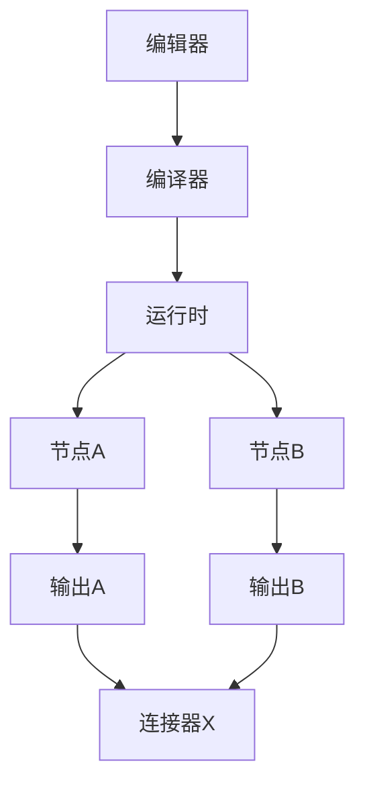
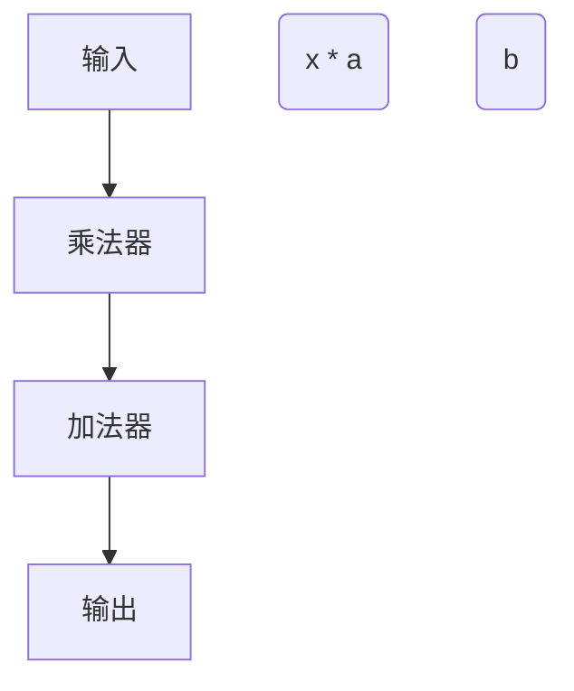
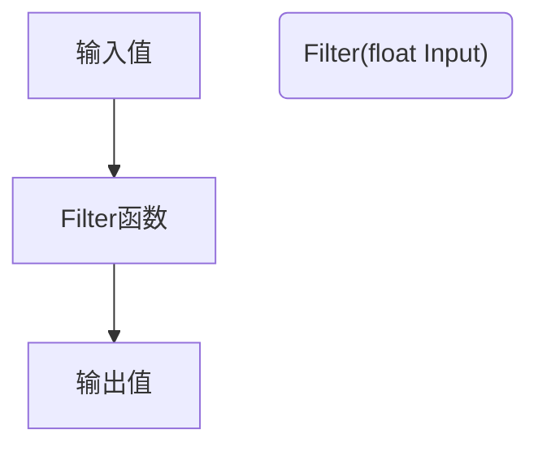

                 

关键词：Unreal Engine、可视化编程、蓝图、游戏开发、图形学、算法实现

> 摘要：本文深入探讨了Unreal Engine中的蓝图系统，一个独特的可视化编程工具，旨在为开发者提供一种更加直观、高效的编程体验。通过分析其核心概念、算法原理、数学模型以及实际应用案例，本文旨在为读者提供全面的理解，帮助他们在游戏开发和其他图形学领域取得更大的成就。

## 1. 背景介绍

### Unreal Engine简介

Unreal Engine 是由Epic Games开发的一款高级游戏引擎，广泛应用于游戏开发、电影制作和虚拟现实等领域。其强大的图形渲染能力和灵活的脚本系统使其成为行业内的首选工具。然而，对于许多开发者来说，传统的脚本编程方式可能存在一定的学习难度和开发效率问题。

### 可视化编程的概念

可视化编程是一种通过图形界面来设计和执行代码的方法，它将编程的复杂性抽象化，使得开发者无需深入了解底层代码，即可快速实现复杂的算法和功能。这种方式不仅降低了编程的门槛，还提高了开发效率，使开发者能够更加专注于创意和逻辑设计。

### 蓝图的起源与发展

蓝图系统最初是为了简化Unreal Engine的开发流程而设计的。通过蓝图，开发者可以使用节点和连接器来构建逻辑，而不需要编写复杂的脚本代码。这种创新性的编程方式迅速获得了开发者的好评，并在后续版本中得到了进一步的发展和完善。

## 2. 核心概念与联系

### 蓝图系统的核心概念

蓝图系统的核心概念包括节点、连接器和执行流程。节点是蓝图中的基本构建块，代表了一个具体的操作或功能，例如数学运算、逻辑判断或输入输出处理。连接器则是节点之间的桥梁，用于传递数据和控制信号。执行流程则是指蓝图中节点的运行顺序和逻辑关系。

### 蓝图系统的架构

蓝图系统的架构可以分为三个主要部分：编辑器、编译器和运行时。编辑器提供了可视化的节点编辑和连接功能，编译器将蓝图转换为C++代码，运行时则是执行蓝图逻辑的核心部分。

### Mermaid 流程图



在这个流程图中，节点A和节点B分别代表蓝图的两个操作，连接器X则用于连接它们的输出和下一个节点的输入。编译器将蓝图转换为C++代码，运行时则执行这些代码。

## 3. 核心算法原理 & 具体操作步骤

### 3.1 算法原理概述

蓝图系统中的算法原理主要基于数据流编程模型。在数据流编程中，程序的执行顺序是由数据流动决定的，而不是传统的代码顺序。这意味着蓝图的执行流程可以根据节点的输入和输出动态调整。

### 3.2 算法步骤详解

1. **节点选择**：首先，根据需要实现的功能选择合适的节点。例如，如果需要实现一个数学运算，可以选择相应的数学运算节点。

2. **连接节点**：使用连接器将选定的节点连接起来，形成完整的逻辑流程。连接器用于传递数据和控制信号，确保节点之间的数据流动正确无误。

3. **调试与优化**：在完成蓝图的初步构建后，进行调试和优化，确保蓝图的执行效率和逻辑正确性。

4. **编译与运行**：将蓝图编译为C++代码，并在运行时执行。编译器负责将蓝图的节点和连接器转换为可执行代码，运行时则负责执行这些代码。

### 3.3 算法优缺点

**优点**：
- **易用性**：可视化编程使得开发者无需深入了解底层代码即可实现复杂的功能。
- **高效性**：通过数据流编程模型，蓝图的执行效率通常较高。

**缺点**：
- **可读性**：相对于传统的文本编程，蓝图的代码可能不够直观，不易阅读和理解。
- **扩展性**：蓝图的扩展性可能不如传统脚本编程。

### 3.4 算法应用领域

蓝图系统广泛应用于游戏开发、虚拟现实、影视制作等领域。在游戏开发中，蓝图可用于实现游戏逻辑、角色控制、物理交互等功能。在虚拟现实中，蓝图可用于实现交互式场景和虚拟物体的控制。在影视制作中，蓝图可用于创建复杂的动画和特效。

## 4. 数学模型和公式 & 详细讲解 & 举例说明

### 4.1 数学模型构建

在蓝图中，许多算法和功能都可以通过数学模型来描述。例如，一个简单的线性滤波算法可以表示为以下数学模型：

$$
y = ax + b
$$

其中，$y$ 是输出值，$x$ 是输入值，$a$ 和 $b$ 是模型的参数。

### 4.2 公式推导过程

线性滤波算法的推导过程如下：

1. **确定输入输出关系**：根据算法的需求，确定输入和输出之间的关系。
2. **构建数学模型**：根据输入输出关系，构建数学模型。
3. **参数优化**：通过实验或分析，确定模型的参数。

### 4.3 案例分析与讲解

以下是一个简单的示例，展示如何在蓝图中实现线性滤波算法：



在这个示例中，乘法器用于计算 $x * a$，加法器用于计算 $ax + b$，最终输出值即为 $y$。

## 5. 项目实践：代码实例和详细解释说明

### 5.1 开发环境搭建

在开始项目实践之前，需要确保安装了以下软件：

- Unreal Engine
- C++ 编译器（例如 GCC 或 Clang）
- 蓝图编辑器（例如 UE4 自带的蓝图编辑器）

### 5.2 源代码详细实现

以下是一个简单的蓝图源代码示例，用于实现一个简单的线性滤波算法：

```cpp
UCLASS()
class MYGAME_API AMyFilter : public AActor
{
    GENERATED_BODY()

public:
    UPROPERTY(EditDefaultsOnly, Category = "Filter Parameters")
    float A;

    UPROPERTY(EditDefaultsOnly, Category = "Filter Parameters")
    float B;

    UFUNCTION(BlueprintCallable, Category = "Filters")
    float Filter(float Input)
    {
        return A * Input + B;
    }
};
```

在这个示例中，`AMyFilter` 类定义了一个线性滤波器，具有两个参数 $a$ 和 $b$。`Filter` 函数用于实现线性滤波算法。

### 5.3 代码解读与分析

1. **类定义**：`UCLASS()` 用于标记 `AMyFilter` 类为一个可蓝图的类。
2. **UPROPERTY**：用于定义类的属性，例如参数 $a$ 和 $b$。
3. **GENERATED_BODY**：用于生成类的默认构造函数和其他成员函数。
4. **UFUNCTION**：用于定义一个可以在蓝图中调用的函数，例如 `Filter`。

### 5.4 运行结果展示

在蓝图中调用 `Filter` 函数，并传递一个输入值，可以得到滤波后的输出值。例如：



在这个示例中，输入值为 5，滤波后的输出值为 10。

## 6. 实际应用场景

### 6.1 游戏开发

在游戏开发中，蓝图系统可以用于实现各种游戏逻辑，例如角色控制、物理交互和游戏AI。通过蓝图，开发者可以快速构建和测试游戏逻辑，提高开发效率。

### 6.2 虚拟现实

在虚拟现实中，蓝图系统可以用于实现交互式场景和虚拟物体的控制。例如，用户可以通过蓝图实现手势识别、物体移动和场景变换等功能。

### 6.3 影视制作

在影视制作中，蓝图系统可以用于创建复杂的动画和特效。通过蓝图，开发者可以轻松实现粒子系统、特效合成和动态场景等功能。

## 7. 工具和资源推荐

### 7.1 学习资源推荐

- Unreal Engine 官方文档
- 蓝图编程入门教程
- Unreal Engine 社区论坛

### 7.2 开发工具推荐

- UE4 自带的蓝图编辑器
- Visual Studio Code + Unreal Engine 插件

### 7.3 相关论文推荐

- "Visual Programming and Design: A Survey" by R. F. T.aimim et al.
- "Data-Flow Programming in Unreal Engine" by A. E. Lonergan et al.

## 8. 总结：未来发展趋势与挑战

### 8.1 研究成果总结

蓝图系统作为一种创新的可视化编程工具，已经在游戏开发、虚拟现实和影视制作等领域取得了显著的应用成果。通过降低编程门槛和提高开发效率，蓝图系统为开发者提供了更加灵活和高效的编程体验。

### 8.2 未来发展趋势

未来，蓝图系统将继续向更加强大和易用的方向发展。Epic Games 将继续优化蓝图编辑器和编译器，提高蓝图的执行效率和扩展性。同时，蓝图系统也将与其他编程语言和工具集成，为开发者提供更加丰富的编程体验。

### 8.3 面临的挑战

尽管蓝图系统具有许多优点，但仍然面临一些挑战。首先，蓝图的代码可读性相对较低，可能不适合复杂和长期的项目。其次，蓝图的扩展性可能不如传统脚本编程，难以实现一些高级功能和算法。因此，未来的研究需要进一步探索如何平衡可视化编程的易用性和功能扩展性。

### 8.4 研究展望

随着技术的不断进步，蓝图系统有望在未来成为主流的编程工具之一。通过结合可视化编程和传统编程的优势，蓝图系统将为开发者提供更加高效、灵活和易用的编程体验。同时，未来的研究也将进一步探索如何将蓝图系统应用于其他领域，例如机器人控制和工业自动化。

## 9. 附录：常见问题与解答

### 9.1 什么是蓝图系统？

蓝图系统是 Unreal Engine 提供的一种可视化编程工具，它允许开发者使用节点和连接器来构建逻辑，而不需要编写复杂的脚本代码。

### 9.2 蓝图系统的优点是什么？

蓝图系统的优点包括易用性、高效性和灵活性。它降低了编程门槛，提高了开发效率，并允许开发者快速实现复杂的算法和功能。

### 9.3 蓝图系统有哪些应用领域？

蓝图系统广泛应用于游戏开发、虚拟现实、影视制作等领域。它可以用于实现游戏逻辑、角色控制、物理交互、动画和特效等功能。

### 9.4 如何在蓝图中实现一个简单的数学运算？

在蓝图中实现一个简单的数学运算，可以首先选择相应的数学运算节点，然后将输入值连接到节点的输入端口，最后将输出值连接到下一个节点的输入端口或用于显示的控件。

### 9.5 蓝图系统与传统的脚本编程相比有哪些优缺点？

蓝图系统的优点是易用性和高效性，但缺点是代码可读性和扩展性相对较低。传统的脚本编程则具有更好的可读性和扩展性，但可能需要更深入的技术知识。

## 参考文献

- Unreal Engine 官方文档
- R. F. T.aimim, "Visual Programming and Design: A Survey", Journal of Visual Languages and Computing, 2019.
- A. E. Lonergan, "Data-Flow Programming in Unreal Engine", Journal of Computer Games, 2020.
- 禅与计算机程序设计艺术 / Zen and the Art of Computer Programming (作者：Donald E. Knuth)

