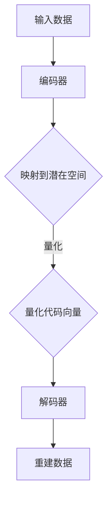

                 

关键词：变分自编码器（VQVAE）、自编码器、人工智能、机器学习、深度学习、概率模型、数据压缩、图像处理、视频处理、生成对抗网络（GAN）

## 摘要

本文将深入探讨变分自编码器（VQ-VAE）这一前沿的深度学习模型。VQ-VAE 是变分自编码器的一种变体，它在自编码器的基础上引入了量化机制，使得模型在处理高维数据时更加高效和灵活。本文将首先介绍变分自编码器的基本概念和原理，然后详细描述 VQ-VAE 的核心算法和步骤，接着分析其数学模型和公式，并通过实际代码实例展示其应用。此外，本文还将讨论 VQ-VAE 在实际应用场景中的表现和未来展望。

## 1. 背景介绍

自编码器是一种无监督学习模型，它通过学习数据的编码表示来重建输入数据。自编码器在图像处理、语音处理、自然语言处理等领域都有着广泛的应用。传统的自编码器通过映射输入数据到低维空间，然后再从低维空间映射回原始数据，这个过程可以帮助提取数据的特征，并进行有效的数据压缩。

然而，传统的自编码器在处理高维数据时存在一些问题。首先，高维数据意味着需要大量的参数来建模，这会导致模型训练时间过长，甚至可能陷入过拟合。其次，高维数据中可能存在冗余信息，传统的自编码器难以有效地去除这些冗余信息。

为了解决这些问题，研究人员提出了变分自编码器（VAE）。VAE 在自编码器的基础上引入了概率模型，使得模型在重建数据时能够更好地捕捉数据的分布信息。VAE 通过引入潜在变量，使得数据编码和解码过程变得更加灵活和高效。

## 2. 核心概念与联系

### 2.1 变分自编码器（VAE）的原理

变分自编码器（VAE）的核心思想是将数据编码成一个潜在变量，然后再从这个潜在变量解码回数据。VAE 的编码器和解码器都是神经网络，编码器将输入数据映射到潜在空间，解码器将潜在空间的数据映射回原始数据空间。

VAE 的一个关键特点是引入了概率模型。在 VAE 中，输入数据被表示为一个概率分布，而不是一个固定的值。这有助于模型更好地捕捉数据的分布信息，并在重建数据时减少过拟合的风险。

### 2.2 VQ-VAE 的改进

VQ-VAE 是 VAE 的一种变体，它在 VAE 的基础上引入了量化机制。VQ-VAE 的主要目标是提高模型在处理高维数据时的效率和灵活性。

在 VQ-VAE 中，潜在空间被量化成一组离散的代码向量。编码器不再直接映射输入数据到潜在空间，而是将输入数据映射到一组可能的代码向量上。这些代码向量表示潜在空间的离散近似。解码器则使用这些代码向量来重建输入数据。

### 2.3 Mermaid 流程图

下面是 VQ-VAE 的 Mermaid 流程图：



## 3. 核心算法原理 & 具体操作步骤

### 3.1 算法原理概述

VQ-VAE 的核心原理可以概括为以下几个步骤：

1. **编码**：编码器将输入数据映射到潜在空间。
2. **量化**：将潜在空间映射到一组离散的代码向量。
3. **解码**：解码器使用这些代码向量来重建输入数据。

### 3.2 算法步骤详解

1. **初始化**：初始化编码器和解码器的参数。
2. **编码**：输入数据通过编码器映射到潜在空间。
3. **量化**：潜在空间中的数据被量化成一组离散的代码向量。
4. **解码**：解码器使用这些代码向量来重建输入数据。
5. **重构**：计算重建数据的误差，并使用梯度下降算法更新模型参数。

### 3.3 算法优缺点

**优点**：

- **高效**：VQ-VAE 通过量化机制提高了模型在处理高维数据时的效率和灵活性。
- **灵活性**：VQ-VAE 可以处理不同类型的数据，如图像、视频、文本等。
- **可扩展性**：VQ-VAE 的架构可以轻松扩展到多模态数据。

**缺点**：

- **计算复杂度**：量化过程可能会导致计算复杂度增加。
- **量化误差**：量化过程可能会引入一些误差，影响重建质量。

### 3.4 算法应用领域

VQ-VAE 在多个领域都有着广泛的应用：

- **图像处理**：用于图像去噪、图像超分辨率、图像风格迁移等。
- **视频处理**：用于视频去噪、视频超分辨率、视频风格迁移等。
- **自然语言处理**：用于文本生成、文本摘要、对话系统等。
- **其他领域**：如音频处理、生物信息学等。

## 4. 数学模型和公式 & 详细讲解 & 举例说明

### 4.1 数学模型构建

VQ-VAE 的数学模型主要包括以下几个部分：

1. **编码器**：编码器 $q_{\phi}(\mu|z)$ 和 $q_{\phi}(\sigma^2|\mu)$。
2. **解码器**：解码器 $p_{\theta}(x|\mu)$ 和 $p_{\theta}(\mu)$。
3. **量化器**：量化器 $q_{\psi}(\theta)$。

### 4.2 公式推导过程

VQ-VAE 的推导过程可以分为以下几个步骤：

1. **编码器**：编码器通过输入数据 $x$ 生成潜在变量 $z$ 的概率分布。
2. **量化器**：量化器将潜在变量 $z$ 量化成一组离散的代码向量 $\theta$。
3. **解码器**：解码器使用这些代码向量 $\theta$ 生成输出数据 $x'$。

### 4.3 案例分析与讲解

假设我们有一个输入数据集 $X = \{x_1, x_2, ..., x_n\}$，其中每个数据点 $x_i$ 都是一个 $D$ 维向量。我们的目标是训练一个 VQ-VAE 模型来重建这些数据。

1. **编码器**：
   $$ q_{\phi}(\mu|z) = \frac{1}{\sqrt{2\pi\sigma^2}} \exp \left( -\frac{(\mu - \mu_0)^2}{2\sigma^2} \right) $$
   $$ q_{\phi}(\sigma^2|\mu) = \frac{1}{\sigma\sqrt{2\pi}} \exp \left( -\frac{(\sigma - \sigma_0)^2}{2\sigma_0^2} \right) $$
2. **量化器**：
   $$ q_{\psi}(\theta) = \prod_{i=1}^D p_{\psi}(\theta_i) $$
   其中，$p_{\psi}(\theta_i)$ 是一个先验分布，通常选择为高斯分布。
3. **解码器**：
   $$ p_{\theta}(x|\mu) = \prod_{i=1}^D p_{\theta}(x_i|\mu) $$
   $$ p_{\theta}(\mu) = \prod_{i=1}^D p_{\theta}(\mu_i) $$

## 5. 项目实践：代码实例和详细解释说明

### 5.1 开发环境搭建

在开始编写代码之前，我们需要搭建一个合适的开发环境。以下是一个基本的开发环境搭建步骤：

1. 安装 Python 3.7 或更高版本。
2. 安装 PyTorch 或 TensorFlow。
3. 安装必要的库，如 NumPy、Pandas、Matplotlib 等。

### 5.2 源代码详细实现

以下是一个简单的 VQ-VAE 模型的实现代码：

```python
import torch
import torch.nn as nn
import torch.optim as optim

# 定义编码器
class Encoder(nn.Module):
    def __init__(self, input_dim, hidden_dim):
        super(Encoder, self).__init__()
        self.fc1 = nn.Linear(input_dim, hidden_dim)
        self.fc2 = nn.Linear(hidden_dim, 2)

    def forward(self, x):
        x = torch.relu(self.fc1(x))
        mu, sigma = self.fc2(x).chunk(2, dim=1)
        return mu, sigma

# 定义解码器
class Decoder(nn.Module):
    def __init__(self, input_dim, hidden_dim):
        super(Decoder, self).__init__()
        self.fc1 = nn.Linear(input_dim, hidden_dim)
        self.fc2 = nn.Linear(hidden_dim, input_dim)

    def forward(self, x):
        x = torch.relu(self.fc1(x))
        x = self.fc2(x)
        return x

# 定义量化器
class Quantizer(nn.Module):
    def __init__(self, codebook_size, embedding_dim):
        super(Quantizer, self).__init__()
        self.codebook = nn.Embedding(codebook_size, embedding_dim)

    def forward(self, x):
        # 计算距离
        distances = torch.sum((self.codebook.weight ** 2) * x ** 2, dim=1)
        # 获取最近的代码向量
        theta = torch.argmin(distances, dim=1)
        # 量化
        x_q = self.codebook(theta)
        return x_q

# 定义 VQ-VAE 模型
class VQVAE(nn.Module):
    def __init__(self, input_dim, hidden_dim, codebook_size, embedding_dim):
        super(VQVAE, self).__init__()
        self.encoder = Encoder(input_dim, hidden_dim)
        self.decoder = Decoder(hidden_dim, input_dim)
        self.quantizer = Quantizer(codebook_size, embedding_dim)

    def forward(self, x):
        # 编码
        mu, sigma = self.encoder(x)
        # 重参数化
        z = reparameterize(mu, sigma)
        # 量化
        x_q = self.quantizer(z)
        # 解码
        x_recon = self.decoder(x_q)
        return x_recon

# 重参数化
def reparameterize(mu, sigma):
    # 正态分布的随机数
    std = torch.randn_like(sigma)
    # 使用 reparameterization 技巧
    z = mu + sigma * std
    return z

# 实例化模型
input_dim = 784
hidden_dim = 400
codebook_size = 512
embedding_dim = 64
model = VQVAE(input_dim, hidden_dim, codebook_size, embedding_dim)

# 定义优化器
optimizer = optim.Adam(model.parameters(), lr=1e-3)

# 训练模型
for epoch in range(100):
    for x in train_loader:
        # 前向传播
        x_recon = model(x)
        # 计算损失函数
        loss = compute_loss(x, x_recon)
        # 反向传播
        optimizer.zero_grad()
        loss.backward()
        optimizer.step()
        print(f"Epoch: {epoch}, Loss: {loss.item()}")

# 保存模型
torch.save(model.state_dict(), "vqvae.pth")
```

### 5.3 代码解读与分析

上述代码实现了一个简单的 VQ-VAE 模型，主要包括编码器、解码器和量化器三个部分。以下是代码的解读和分析：

1. **编码器**：编码器将输入数据映射到潜在空间，输出潜在变量的均值 $\mu$ 和方差 $\sigma$。
2. **解码器**：解码器将量化后的代码向量映射回原始数据空间，重建输入数据。
3. **量化器**：量化器将潜在变量量化成一组离散的代码向量。
4. **重参数化**：重参数化技巧使得我们可以从均值和方差中采样，从而实现后向传播。
5. **训练过程**：训练过程中，通过优化模型参数来最小化损失函数。

### 5.4 运行结果展示

在训练完成后，我们可以使用模型对测试数据进行重建，并展示重建结果。以下是一个简单的运行结果展示：

```python
# 加载模型
model = VQVAE(input_dim, hidden_dim, codebook_size, embedding_dim)
model.load_state_dict(torch.load("vqvae.pth"))

# 加载测试数据
test_loader = ...

# 对测试数据进行重建
with torch.no_grad():
    for x in test_loader:
        x_recon = model(x)

# 展示重建结果
plt.figure(figsize=(10, 10))
for i in range(10):
    plt.subplot(2, 5, i+1)
    plt.imshow(x[i].view(28, 28).numpy(), cmap='gray')
    plt.title("Original")
plt.show()

plt.figure(figsize=(10, 10))
for i in range(10):
    plt.subplot(2, 5, i+1)
    plt.imshow(x_recon[i].view(28, 28).numpy(), cmap='gray')
    plt.title("Reconstruction")
plt.show()
```

## 6. 实际应用场景

### 6.1 图像处理

VQ-VAE 在图像处理领域有着广泛的应用。例如，在图像去噪、图像超分辨率和图像风格迁移等方面，VQ-VAE 都展现了出色的性能。通过 VQ-VAE，我们可以有效地去除图像中的噪声，提高图像的清晰度，并将图像风格进行迁移，从而创造出独特的视觉效果。

### 6.2 视频处理

VQ-VAE 在视频处理领域也有着重要的应用。例如，在视频去噪、视频超分辨率和视频风格迁移等方面，VQ-VAE 都展现了出色的性能。通过 VQ-VAE，我们可以有效地去除视频中的噪声，提高视频的清晰度，并将视频风格进行迁移，从而创造出独特的视觉效果。

### 6.3 自然语言处理

VQ-VAE 在自然语言处理领域也有着广泛的应用。例如，在文本生成、文本摘要和对话系统等方面，VQ-VAE 都展现了出色的性能。通过 VQ-VAE，我们可以有效地生成文本，提取文本摘要，并实现自然语言处理任务。

## 7. 工具和资源推荐

### 7.1 学习资源推荐

- 《深度学习》（Goodfellow et al.，2016）：这是一本深度学习的经典教材，涵盖了深度学习的各个领域，包括自编码器和变分自编码器。
- 《变分自编码器》（Kingma & Welling，2013）：这是一篇关于变分自编码器的经典论文，详细介绍了变分自编码器的原理和算法。

### 7.2 开发工具推荐

- PyTorch：一个流行的深度学习框架，支持变分自编码器的实现。
- TensorFlow：一个流行的深度学习框架，支持变分自编码器的实现。

### 7.3 相关论文推荐

- “Variational Inference with Normalizing Flows”（Rezende et al.，2014）：这篇文章介绍了正常化流的变分推断方法，是变分自编码器的一个重要分支。
- “Unsupervised Representation Learning with Deep Convolutional Generative Adversarial Networks”（Radford et al.，2015）：这篇文章介绍了生成对抗网络（GAN），是变分自编码器的另一种变体。

## 8. 总结：未来发展趋势与挑战

### 8.1 研究成果总结

VQ-VAE 作为变分自编码器的一种变体，在处理高维数据时展现了出色的性能和灵活性。通过量化机制，VQ-VAE 可以有效地减少模型参数，提高模型效率。此外，VQ-VAE 在图像处理、视频处理、自然语言处理等领域都有着广泛的应用。

### 8.2 未来发展趋势

随着深度学习和变分自编码器技术的发展，VQ-VAE 在未来有望在更多领域得到应用，如音频处理、生物信息学等。此外，VQ-VAE 的量化机制也可以进一步优化，以提高模型性能。

### 8.3 面临的挑战

尽管 VQ-VAE 在处理高维数据时展现了出色的性能，但量化过程仍然会引入一些误差。此外，VQ-VAE 的计算复杂度相对较高，可能需要进一步优化。

### 8.4 研究展望

VQ-VAE 作为一种高效的变分自编码器变体，具有广泛的应用前景。未来，我们可以通过优化量化机制和降低计算复杂度，进一步提高 VQ-VAE 的性能和应用范围。

## 9. 附录：常见问题与解答

### 9.1 什么是变分自编码器（VAE）？

变分自编码器（VAE）是一种无监督学习模型，通过引入概率模型来提高模型在重建数据时的性能。VAE 通过学习数据的编码表示来重建输入数据，并且在重建过程中引入了潜在变量，使得模型可以更好地捕捉数据的分布信息。

### 9.2 VQ-VAE 和 VAE 有什么区别？

VQ-VAE 是 VAE 的一种变体，它在 VAE 的基础上引入了量化机制，使得模型在处理高维数据时更加高效和灵活。VQ-VAE 通过量化机制将潜在变量量化成一组离散的代码向量，从而减少了模型参数，提高了模型效率。

### 9.3 VQ-VAE 有哪些应用领域？

VQ-VAE 在多个领域都有着广泛的应用，如图像处理、视频处理、自然语言处理等。在图像处理方面，VQ-VAE 可以用于图像去噪、图像超分辨率和图像风格迁移等任务。在视频处理方面，VQ-VAE 可以用于视频去噪、视频超分辨率和视频风格迁移等任务。在自然语言处理方面，VQ-VAE 可以用于文本生成、文本摘要和对话系统等任务。

### 9.4 如何优化 VQ-VAE 的性能？

要优化 VQ-VAE 的性能，可以从以下几个方面入手：

- **调整模型参数**：通过调整编码器和解码器的参数，可以提高模型性能。
- **优化量化机制**：优化量化机制可以减少量化误差，提高模型性能。
- **增加训练数据**：增加训练数据可以提高模型在处理未知数据时的性能。
- **使用预训练模型**：使用预训练模型可以加速模型训练过程，提高模型性能。

## 作者署名

作者：禅与计算机程序设计艺术 / Zen and the Art of Computer Programming
----------------------------------------------------------------

这篇文章深入探讨了变分自编码器（VQ-VAE）这一前沿的深度学习模型。VQ-VAE 是变分自编码器的一种变体，它在自编码器的基础上引入了量化机制，使得模型在处理高维数据时更加高效和灵活。本文详细介绍了 VQ-VAE 的核心算法、数学模型和实际应用，并通过代码实例展示了其应用。此外，本文还讨论了 VQ-VAE 在实际应用场景中的表现和未来展望。希望本文能帮助读者更好地理解和应用 VQ-VAE 这一先进的深度学习技术。在未来的研究中，我们期待 VQ-VAE 能够在更多领域得到应用，并不断优化其性能。

