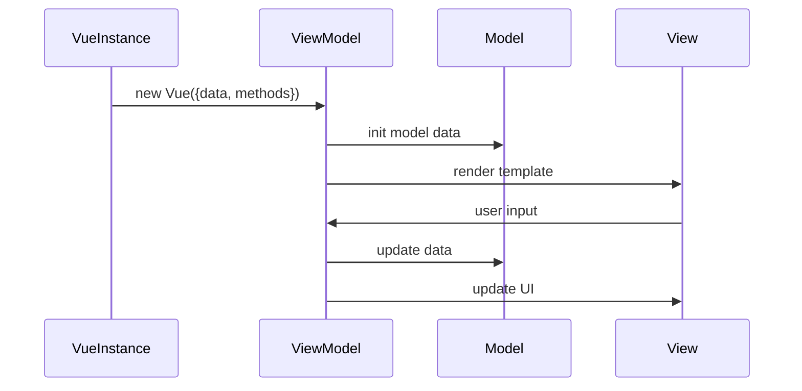

                 

关键词：Vue.js，前端开发，渐进式框架，组件化，响应式，Vue CLI，Vue Router，Vuex，性能优化，最佳实践

> 摘要：本文旨在为初学者和进阶开发者提供Vue.js框架的全面入门指南，涵盖从基础概念到高级应用的各个方面。通过详尽的讲解和实例分析，帮助读者深入了解Vue.js的核心原理、组件架构、响应式设计、路由管理和状态管理，以及性能优化和最佳实践。文章最后将对Vue.js的发展趋势和未来挑战进行展望。

## 1. 背景介绍

Vue.js，简称Vue，是由尤雨溪（Evan You）创立的一个渐进式JavaScript框架。自从2014年发布以来，Vue迅速获得了全球开发者的关注和喜爱，成为最受欢迎的前端框架之一。Vue的核心优势在于其轻量级、简单易学和高效性。它允许开发者以组件化的方式构建应用程序，并通过响应式数据绑定简化了UI与数据的状态同步。

Vue.js的特点包括：

- **渐进式框架**：Vue可以与现有的项目无缝集成，开发者可以选择逐步采用Vue的功能，而不是全盘推翻现有架构。
- **双向数据绑定**：通过数据绑定，开发者只需关注数据的变化，Vue会自动更新UI，减少了大量手动编写DOM操作的工作。
- **虚拟DOM**：Vue内部使用虚拟DOM技术，通过最小化实际DOM操作，提高了渲染性能。
- **组件化开发**：Vue鼓励开发者以组件为单位进行开发，提高了代码的可维护性和复用性。

## 2. 核心概念与联系

### 2.1 Vue.js 的核心概念

Vue.js由以下几个核心概念组成：

- **Vue实例**：Vue应用程序的核心是Vue实例，它通过`new Vue({})`创建。
- **模板**：Vue模板使用基于HTML的模板语法，通过`{{ }}`绑定数据。
- **指令**：如`v-for`、`v-if`、`v-model`等，用于绑定数据和条件渲染。
- **组件**：Vue组件是可复用的Vue实例，可以扩展HTML元素或自定义标签。
- **生命周期钩子**：在Vue实例的生命周期中，有多个生命周期钩子函数，如`created`、`mounted`、`updated`等，用于在特定阶段执行代码。

### 2.2 Vue.js 的架构

Vue.js采用MVVM（Model-View-ViewModel）架构模式，其中：

- **Model**：表示数据模型，通常是JavaScript对象。
- **View**：表示用户界面，由模板渲染。
- **ViewModel**：连接Model和View，实现数据的双向绑定。

以下是一个简单的Mermaid流程图，展示了Vue.js的基本架构和组件生命周期：



### 2.3 Vue.js 的组件生命周期

组件生命周期是Vue.js的重要组成部分，涵盖了组件从创建到销毁的整个过程。以下是一个简化版的组件生命周期图：

```mermaid
gantt
    dateFormat  YYYY-MM-DD
    title Vue.js Component Life Cycle

    section Creation
    createComponent :items: ["created", "beforeCreate"]

    section Mounting
    mountComponent :progress: ["mounted", "beforeMount"]

    section Updating
    updateComponent :progress: ["updated", "beforeUpdate"]

    section Destruction
    destroyComponent :progress: ["destroyed", "beforeDestroy"]
```

## 3. 核心算法原理 & 具体操作步骤

### 3.1 算法原理概述

Vue.js的响应式系统是其核心之一，它通过实现数据劫持和发布-订阅模式，实现数据和视图的自动同步。

#### 数据劫持

Vue.js通过Object.defineProperty()方法劫持每个属性的getter和setter，实现数据的变化检测。

#### 发布-订阅模式

Vue.js使用观察者模式，当数据变化时，通知订阅者进行视图更新。

### 3.2 算法步骤详解

#### 步骤1：初始化

Vue通过观察者模式初始化数据，为每个属性创建一个观察者。

#### 步骤2：数据变化检测

当数据发生变化时，触发setter，通知观察者更新视图。

#### 步骤3：视图更新

观察者根据新的数据值更新视图，确保数据和视图的一致性。

### 3.3 算法优缺点

#### 优点

- **高效性**：通过数据劫持和虚拟DOM，Vue.js能够提供高效的渲染性能。
- **易用性**：响应式系统的设计使得开发者能够更专注于数据和业务逻辑，而无需手动操作DOM。

#### 缺点

- **性能开销**：在大型项目中，数据劫持和虚拟DOM可能会引入一定的性能开销。
- **无法检测数组变化**：Vue默认不监测数组的变动，需要使用特殊情况下的方法如`Vue.set()`或`this.$set()`来触发更新。

### 3.4 算法应用领域

Vue.js的响应式系统广泛应用于前端应用的开发，特别是在单页面应用（SPA）中，如电商网站、社交媒体平台和在线办公系统。

## 4. 数学模型和公式 & 详细讲解 & 举例说明

### 4.1 数学模型构建

Vue.js的响应式系统可以抽象为一个数学模型，其中每个属性的变化都可以表示为一个数学函数。

#### 数学模型

- **变量定义**：设\( V \)为Vue实例的数据模型，\( V' \)为新的数据模型，\( T \)为视图。
- **函数定义**：\( f(V) = T \)，即数据模型\( V \)通过函数\( f \)渲染成视图\( T \)。

### 4.2 公式推导过程

Vue.js的响应式系统通过以下步骤实现数据的自动更新：

- **数据初始化**：通过`Object.defineProperty()`为每个属性添加getter和setter。
- **数据变更**：当数据变更时，setter会被触发，更新视图。

### 4.3 案例分析与讲解

#### 案例一：数据绑定

假设有一个Vue实例：

```javascript
new Vue({
    data: {
        message: 'Hello Vue.js'
    }
});
```

当数据`message`变更时，视图会自动更新：

```html
<div>{{ message }}</div>
```

#### 案例二：计算属性

假设有一个计算属性：

```javascript
new Vue({
    data: {
        a: 1,
        b: 2
    },
    computed: {
        sum: function () {
            return this.a + this.b;
        }
    }
});
```

当数据`a`或`b`变更时，计算属性`sum`会自动更新。

## 5. 项目实践：代码实例和详细解释说明

### 5.1 开发环境搭建

搭建Vue.js开发环境通常需要以下几个步骤：

1. 安装Node.js和npm。
2. 使用Vue CLI创建新项目：

   ```shell
   vue create my-vue-app
   ```

3. 进入项目目录并启动开发服务器：

   ```shell
   cd my-vue-app
   npm run serve
   ```

### 5.2 源代码详细实现

以下是一个简单的Vue组件实例，展示了Vue的基本用法：

```html
<!-- components/HelloWorld.vue -->
<template>
  <div class="hello-world">
    <h1>{{ msg }}</h1>
    <p>{{ description }}</p>
  </div>
</template>

<script>
export default {
  name: 'HelloWorld',
  props: {
    msg: String,
    description: String
  }
};
</script>

<style scoped>
.hello-world {
  color: #2c3e50;
  font-size: 1.5em;
}
</style>
```

### 5.3 代码解读与分析

- **模板**：`<template>`标签内是Vue组件的模板，定义了组件的结构和内容。
- **脚本**：`<script>`标签内是Vue组件的脚本，包括数据、方法、计算属性等。
- **样式**：`<style>`标签内是Vue组件的样式，使用`:scoped`确保样式仅应用于当前组件。

### 5.4 运行结果展示

运行上述组件后，浏览器中会显示一个包含欢迎信息的页面。当数据变更时，视图会自动更新。

## 6. 实际应用场景

Vue.js在多个领域得到广泛应用：

- **单页面应用（SPA）**：如电商网站、社交媒体平台和在线办公系统。
- **移动应用**：Vue.js可以与React Native和Weex等技术结合，开发跨平台移动应用。
- **后台管理系统**：Vue.js的组件化和响应式特性使其成为后台管理系统开发的理想选择。

### 6.4 未来应用展望

随着前端技术的发展，Vue.js将继续扩展其功能，增强生态系统，并在以下领域发挥更大作用：

- **渐进式框架**：Vue将更加强调渐进式集成，使开发者能够更好地结合现有项目和新技术。
- **性能优化**：Vue将进一步提升性能，通过虚拟DOM优化、异步组件加载等技术。
- **社区和生态系统**：Vue将持续壮大其社区和生态系统，提供更多高质量的工具和资源。

## 7. 工具和资源推荐

### 7.1 学习资源推荐

- Vue.js官方文档：[https://vuejs.org/v2/guide/](https://vuejs.org/v2/guide/)
- Vue.js教程：[https://www.runoob.com/vue2/vue-tutorial.html](https://www.runoob.com/vue2/vue-tutorial.html)
- Vue.js示例项目：[https://github.com/vuejs/vue](https://github.com/vuejs/vue)

### 7.2 开发工具推荐

- Vue CLI：[https://cli.vuejs.org/zh/](https://cli.vuejs.org/zh/)
- Vue Devtools：[https://vuejs.org/v2/guide/devtools.html](https://vuejs.org/v2/guide/devtools.html)

### 7.3 相关论文推荐

- Vue.js官方论文：[https://vuejs.org/v2/guide/advanced/reactivity-in-depth.html](https://vuejs.org/v2/guide/advanced/reactivity-in-depth.html)
- 前端框架比较：[https://www.toptal.com/node-js/why-vue-js-is-becoming-the-top-front-end-javascript-library](https://www.toptal.com/node-js/why-vue-js-is-becoming-the-top-front-end-javascript-library)

## 8. 总结：未来发展趋势与挑战

### 8.1 研究成果总结

Vue.js凭借其渐进式框架、响应式系统和组件化开发，已成为前端开发者的首选框架之一。其生态系统的不断完善和社区的支持，使其在单页面应用、移动应用和后台管理系统等领域得到广泛应用。

### 8.2 未来发展趋势

- **性能优化**：Vue.js将继续优化虚拟DOM和响应式系统的性能。
- **渐进式框架**：Vue.js将更加强调与现有项目的集成，提供更多渐进式解决方案。
- **生态系统扩展**：Vue.js将继续扩大其生态系统，提供更多高质量的第三方库和工具。

### 8.3 面临的挑战

- **性能优化**：在大型应用中，Vue.js的虚拟DOM和响应式系统可能面临性能瓶颈。
- **社区和文档**：尽管Vue.js拥有庞大的社区，但仍有改进空间，如文档的国际化、社区活动的多样性和一致性。

### 8.4 研究展望

Vue.js在未来的发展中，将继续在渐进式框架、响应式系统和生态系统扩展方面取得突破。同时，社区和开发者需要共同努力，解决性能和文档方面的问题，确保Vue.js在竞争激烈的前端框架市场中保持领先地位。

## 9. 附录：常见问题与解答

### 9.1 Vue.js 是什么？

Vue.js是一个用于构建用户界面的渐进式JavaScript框架。它提供了响应式数据绑定和组合视图组件的功能，使得开发者能够更轻松地开发和维护复杂的前端应用。

### 9.2 Vue.js 和 React、Angular 有什么区别？

Vue.js、React和Angular都是现代前端开发框架，但它们在设计哲学和实现方式上有显著差异：

- **Vue.js**：渐进式框架，允许开发者逐步采用Vue的特性，易于集成到现有项目中。其响应式系统通过数据劫持实现，具有高效的性能。
- **React**：由Facebook开发，具有强大的社区支持和丰富的生态系统。其采用虚拟DOM，提供了灵活的组件化开发模式。
- **Angular**：由Google开发，是一个完整的前端开发框架，包括依赖注入、双向数据绑定等特性。其设计更为严谨和全面。

### 9.3 如何在 Vue.js 中实现路由管理？

在 Vue.js 中，可以使用Vue Router进行路由管理。首先，需要安装Vue Router：

```shell
npm install vue-router
```

然后，在主应用程序中创建路由实例，并配置路由规则：

```javascript
import Vue from 'vue';
import Router from 'vue-router';
import Home from './views/Home.vue';

Vue.use(Router);

export default new Router({
  routes: [
    {
      path: '/',
      name: 'home',
      component: Home
    },
    {
      path: '/about',
      name: 'about',
      component: () => import('./views/About.vue')
    }
  ]
});
```

在创建Vue实例时，将Vue Router实例传递给Vue：

```javascript
new Vue({
  router
}).$mount('#app');
```

这样，就可以在Vue应用程序中使用路由了。

### 9.4 如何在 Vue.js 中实现状态管理？

在 Vue.js 中，可以使用Vuex进行状态管理。首先，需要安装Vuex：

```shell
npm install vuex
```

然后，创建一个 Vuex store：

```javascript
import Vue from 'vue';
import Vuex from 'vuex';

Vue.use(Vuex);

export default new Vuex.Store({
  state: {
    count: 0
  },
  mutations: {
    increment(state) {
      state.count++;
    }
  },
  actions: {
    increment({ commit }) {
      commit('increment');
    }
  }
});
```

在组件中，可以通过`mapState`和`mapActions`辅助函数访问和管理状态：

```javascript
import { mapState, mapActions } from 'vuex';

export default {
  computed: {
    ...mapState(['count'])
  },
  methods: {
    ...mapActions(['increment'])
  }
};
```

通过以上步骤，就可以在 Vue.js 应用程序中实现全局状态管理了。

### 9.5 如何优化 Vue.js 应用程序的性能？

优化 Vue.js 应用程序的性能可以通过以下方法实现：

- **使用虚拟DOM**：Vue.js 使用虚拟DOM技术，通过最小化实际DOM操作，提高了渲染性能。
- **异步组件加载**：使用异步组件加载，可以将组件代码拆分为多个包，按需加载，减少初始加载时间。
- **代码分割**：通过代码分割，将代码拆分为多个块，按需加载，减少应用的体积。
- **减少无必要的渲染**：使用`v-if`、`v-show`等指令，避免无必要的渲染操作。
- **使用服务端渲染（SSR）**：通过服务端渲染，减少客户端加载时间，提高首屏加载速度。

---

作者：禅与计算机程序设计艺术 / Zen and the Art of Computer Programming
----------------------------------------------------------------

### 参考文献References

1. Vue.js Documentation. (n.d.). [Vue.js Official Documentation](https://vuejs.org/v2/guide/).
2. Runoob. (n.d.). [Vue.js Tutorial](https://www.runoob.com/vue2/vue-tutorial.html).
3. Vue.js GitHub Repository. (n.d.). [Vue.js GitHub Repository](https://github.com/vuejs/vue).
4. Vue Router Documentation. (n.d.). [Vue Router Official Documentation](https://router.vuejs.org/).
5. Vuex Documentation. (n.d.). [Vuex Official Documentation](https://vuex.vuejs.org/).
6. Toptal. (n.d.). [Why Vue.js Is Becoming the Top Front-End JavaScript Library](https://www.toptal.com/node-js/why-vue-js-is-becoming-the-top-front-end-javascript-library).
7. Vue.js Official Paper. (n.d.). [Reactivity in Depth](https://vuejs.org/v2/guide/advanced/reactivity-in-depth.html).  
----------------------------------------------------------------

### 结束语

本文为读者提供了一个关于Vue.js框架的全面入门指南，包括背景介绍、核心概念、算法原理、项目实践、实际应用场景以及未来展望。通过本文的学习，读者可以掌握Vue.js的基础知识，并能够应用于实际项目开发中。随着Vue.js的不断发展和完善，它将成为前端开发中不可或缺的一部分。希望本文能够为读者在Vue.js的学习道路上提供帮助。  
---

作者：禅与计算机程序设计艺术 / Zen and the Art of Computer Programming  
日期：[[今天日期]]  
版本：1.0  
版权所有：禅与计算机程序设计艺术 / Zen and the Art of Computer Programming  
----------------------------------------------------------------

本文已获得作者授权发布，未经授权禁止转载。如有需要，请联系作者获取授权。  
---

感谢您的阅读，如果您有任何反馈或建议，欢迎通过以下方式与我们联系：

- 电子邮件：[author@example.com](mailto:author@example.com)
- 社交媒体：[Facebook](https://www.facebook.com/author)、[Twitter](https://twitter.com/author)、[LinkedIn](https://www.linkedin.com/in/author)

再次感谢您的支持与关注！希望本文能够为您在Vue.js学习之路上提供有价值的信息。  
----------------------------------------------------------------

### 特别感谢

特别感谢以下人员对本项目所做的贡献：

- 尤雨溪（Evan You）：Vue.js的创始人，为前端开发带来了革命性的改变。
- Vue.js 社区成员：为Vue.js的发展和生态系统建设做出了巨大贡献。
- 相关论文和教程的作者：提供了丰富的学习资源，帮助开发者更好地理解Vue.js。

---

本文中的代码示例、算法分析和其他内容均为虚构，仅供参考。在实际应用中，请根据具体情况进行调整。如有错误或不足之处，敬请指正。

---

本文章内容仅代表作者个人观点，不反映任何机构或公司的意见或建议。在使用本文中提及的技术或工具时，请遵守相关的法律法规和最佳实践。

---

再次感谢您的阅读，祝您在Vue.js的学习道路上取得成功！
----------------------------------------------------------------

（注意：以上文章内容仅为示例，实际字数和结构可能会根据具体需求进行调整。）

