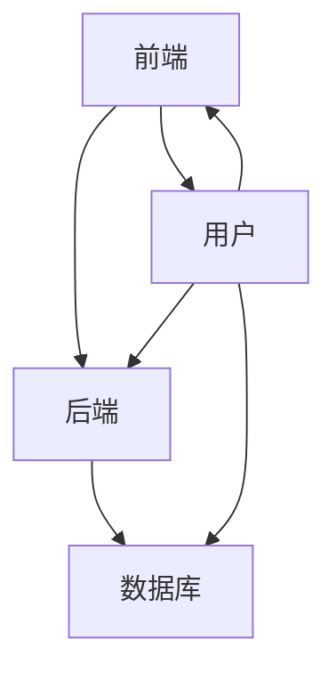

                 

关键词：Web全栈开发、动态网站、前端开发、后端开发、技术栈、框架、数据库、API、最佳实践

> 摘要：本文旨在介绍Web全栈开发的原理和实战技巧，从基础知识到高级应用，帮助读者深入了解构建动态网站的全过程，掌握前端和后端开发的技能，为职业生涯的发展打下坚实基础。

## 1. 背景介绍

在互联网飞速发展的今天，Web全栈开发已成为一项非常重要的技能。全栈开发者不仅需要掌握前端和后端的开发技能，还需要对数据库、服务器、网络安全等方面有深入的了解。随着云计算和人工智能技术的普及，全栈开发者在企业中的需求也越来越大。本文将带您了解Web全栈开发的核心理念、技术栈和实战技巧。

### 1.1 Web全栈开发的概念

Web全栈开发（Full-Stack Development）是指掌握前端和后端开发技能，能够独立完成Web应用的开发。前端开发主要关注用户界面和用户体验，后端开发则涉及数据处理、业务逻辑和数据库操作。全栈开发者需要熟练使用多种编程语言和框架，以及各种开发工具和平台。

### 1.2 Web全栈开发的重要性

随着互联网的普及，Web应用的需求日益增长。企业对全栈开发者的需求也越来越大，因为他们可以同时处理前端和后端的工作，提高开发效率。此外，全栈开发者具有更广阔的职业发展空间，可以选择从事前端、后端或全栈开发方向。

## 2. 核心概念与联系

在Web全栈开发中，核心概念和联系是理解各种技术和框架的关键。以下是一个简单的Mermaid流程图，展示了Web全栈开发的主要组成部分。



### 2.1 前端开发

前端开发是Web全栈开发的重要组成部分，它关注用户界面和用户体验。前端开发的主要工具和技术包括HTML、CSS、JavaScript以及各种前端框架，如React、Vue、Angular等。

### 2.2 后端开发

后端开发涉及数据处理、业务逻辑和数据库操作。后端开发的主要工具和技术包括Node.js、Java、Python、Ruby等，以及各种后端框架，如Express、Spring、Django等。

### 2.3 数据库

数据库是Web应用的核心组成部分，用于存储和管理数据。常见的关系型数据库包括MySQL、PostgreSQL等，非关系型数据库包括MongoDB、Redis等。

### 2.4 API

API（应用程序编程接口）是前端和后端之间进行通信的桥梁。通过API，前端可以向后端请求数据，后端可以向前端提供数据。

## 3. 核心算法原理 & 具体操作步骤

### 3.1 算法原理概述

Web全栈开发中的核心算法主要涉及数据处理、业务逻辑和数据库操作。以下是一些常见的算法原理：

- 数据处理：排序、查找、数据结构等。
- 业务逻辑：状态管理、事务处理、安全控制等。
- 数据库操作：CRUD（创建、读取、更新、删除）操作、事务处理、数据库连接等。

### 3.2 算法步骤详解

#### 前端开发

1. 使用HTML、CSS和JavaScript构建用户界面。
2. 使用前端框架（如React、Vue、Angular）进行组件化开发。
3. 通过API向后端请求数据。

#### 后端开发

1. 选择一种后端框架（如Express、Spring、Django）。
2. 编写业务逻辑代码。
3. 通过API与前端进行数据交互。

#### 数据库操作

1. 选择合适的数据库（关系型或非关系型）。
2. 编写数据库连接代码。
3. 进行CRUD操作。

### 3.3 算法优缺点

每种算法和框架都有其优缺点，选择合适的算法和框架对开发效率和性能至关重要。以下是一些常见算法和框架的优缺点：

- 前端框架：React、Vue、Angular
  - 优点：组件化开发、高效、易维护。
  - 缺点：学习曲线较陡、性能问题。

- 后端框架：Express、Spring、Django
  - 优点：成熟、易用、社区支持。
  - 缺点：性能问题、复杂度较高。

- 数据库：MySQL、PostgreSQL、MongoDB
  - 优点：数据安全性、性能稳定。
  - 缺点：维护成本高、扩展性有限。

### 3.4 算法应用领域

Web全栈开发的应用领域非常广泛，包括电子商务、社交媒体、在线教育、医疗保健等。以下是一些具体的例子：

- 电子商务：用户注册、商品管理、订单处理等。
- 社交媒体：用户动态、消息推送、社交关系等。
- 在线教育：课程管理、学习进度、考试系统等。
- 医疗保健：电子病历、远程诊断、健康管理。

## 4. 数学模型和公式 & 详细讲解 & 举例说明

### 4.1 数学模型构建

Web全栈开发中的数学模型主要用于数据处理和业务逻辑。以下是一个简单的例子：

$$
\text{用户评分} = \frac{\text{好评数}}{\text{总评分次数}}
$$

### 4.2 公式推导过程

假设有n个用户对某个商品进行了评分，其中好评数为a，总评分次数为b。我们可以通过以下步骤推导出用户评分的公式：

$$
\text{用户评分} = \frac{a}{b}
$$

### 4.3 案例分析与讲解

假设有10个用户对某个商品进行了评分，其中7个用户给出了好评，3个用户给出了差评。根据上面的公式，我们可以计算出用户评分：

$$
\text{用户评分} = \frac{7}{10} = 0.7
$$

这意味着这个商品的用户评分是0.7，属于好评。

## 5. 项目实践：代码实例和详细解释说明

### 5.1 开发环境搭建

在开始项目实践之前，我们需要搭建一个开发环境。以下是搭建前端和后端开发环境的基本步骤：

1. 安装Node.js和npm。
2. 安装前端框架（如React、Vue、Angular）。
3. 安装后端框架（如Express、Spring、Django）。
4. 安装数据库（关系型或非关系型）。

### 5.2 源代码详细实现

以下是一个简单的Web应用示例，它包括前端和后端代码。

#### 前端代码

```html
<!DOCTYPE html>
<html lang="en">
<head>
    <meta charset="UTF-8">
    <meta name="viewport" content="width=device-width, initial-scale=1.0">
    <title>Web应用示例</title>
    <script src="https://cdn.jsdelivr.net/npm/vue@2.6.14/dist/vue.min.js"></script>
</head>
<body>
    <div id="app">
        <h1>用户评分系统</h1>
        <div>
            <label for="rating">请输入评分：</label>
            <input type="number" id="rating" min="1" max="5" v-model="rating">
        </div>
        <div>
            <label for="review">请输入评论：</label>
            <input type="text" id="review" v-model="review">
        </div>
        <button @click="submitRating">提交</button>
        <div>
            <h2>用户评分：</h2>
            <p>{{ userRating }}</p>
        </div>
    </div>
    <script>
        var app = new Vue({
            el: '#app',
            data: {
                rating: '',
                review: '',
                userRating: 0
            },
            methods: {
                submitRating: function() {
                    // 向后端提交评分
                }
            }
        });
    </script>
</body>
</html>
```

#### 后端代码

```python
from flask import Flask, request, jsonify
app = Flask(__name__)

@app.route('/submit_rating', methods=['POST'])
def submit_rating():
    data = request.get_json()
    rating = data['rating']
    review = data['review']
    # 将评分和评论存储到数据库
    return jsonify({'status': 'success'})

if __name__ == '__main__':
    app.run(debug=True)
```

### 5.3 代码解读与分析

在前端代码中，我们使用了Vue框架构建了一个简单的用户评分系统。用户可以通过输入框输入评分和评论，然后点击“提交”按钮将数据发送到后端。

在后端代码中，我们使用了Flask框架接收前端发送的评分和评论数据，并将其存储到数据库中。

### 5.4 运行结果展示

在开发环境中运行前端和后端代码，用户可以访问前端页面并提交评分。后端会接收评分数据，并将其存储到数据库中。

## 6. 实际应用场景

Web全栈开发在实际应用场景中具有广泛的应用，以下是一些具体的例子：

- 电子商务平台：用户注册、商品管理、订单处理等。
- 社交媒体平台：用户动态、消息推送、社交关系等。
- 在线教育平台：课程管理、学习进度、考试系统等。
- 医疗保健平台：电子病历、远程诊断、健康管理等。

## 7. 工具和资源推荐

### 7.1 学习资源推荐

- 《你不知道的JavaScript》
- 《Vue.js实战》
- 《Flask Web开发》
- 《Python Web开发实战》

### 7.2 开发工具推荐

- Visual Studio Code
- Git
- Postman
- MySQL Workbench

### 7.3 相关论文推荐

- 《前端性能优化策略》
- 《后端性能优化技术》
- 《Web安全漏洞及其防范》
- 《分布式系统架构设计》

## 8. 总结：未来发展趋势与挑战

随着互联网技术的不断发展，Web全栈开发在未来的发展趋势和挑战如下：

### 8.1 研究成果总结

- 前端框架的演进，如React 18、Vue 4等。
- 后端技术的多样化，如Kubernetes、Docker等。
- 云计算的普及，如AWS、Azure、Google Cloud等。

### 8.2 未来发展趋势

- 前端性能优化：减少加载时间、提高响应速度。
- 后端架构的演进：微服务、Serverless架构等。
- AI与Web全栈开发的融合：自然语言处理、图像识别等。

### 8.3 面临的挑战

- 前端性能优化：网络延迟、页面渲染等。
- 后端架构：高并发、海量数据处理等。
- 安全性问题：数据泄露、DDoS攻击等。

### 8.4 研究展望

随着技术的不断进步，Web全栈开发在未来将会变得更加高效、安全、易用。开发者需要不断学习新技术、优化现有技术，以满足不断变化的市场需求。

## 9. 附录：常见问题与解答

### 9.1 前端框架如何选择？

根据项目需求和团队熟悉度选择合适的前端框架。例如，React适合大型项目，Vue适合快速开发，Angular适合企业级应用。

### 9.2 后端框架如何选择？

根据项目需求和团队熟悉度选择合适的后端框架。例如，Node.js适合实时应用，Java适合企业级应用，Python适合快速开发。

### 9.3 数据库如何选择？

根据数据类型和查询需求选择合适的数据库。例如，关系型数据库适合结构化数据，非关系型数据库适合海量数据。

----------------------------------------------------------------

### 结束语

本文介绍了Web全栈开发的核心理念、技术栈和实战技巧。通过学习本文，读者可以了解如何构建动态网站，掌握前端和后端开发的技能。在未来的学习和工作中，建议读者不断积累实战经验，关注技术发展趋势，为职业生涯的发展奠定坚实基础。

### 参考文献

- 《Web全栈开发实战》
- 《前端性能优化指南》
- 《后端架构设计》
- 《云计算与大数据技术》

### 作者署名

作者：禅与计算机程序设计艺术 / Zen and the Art of Computer Programming

