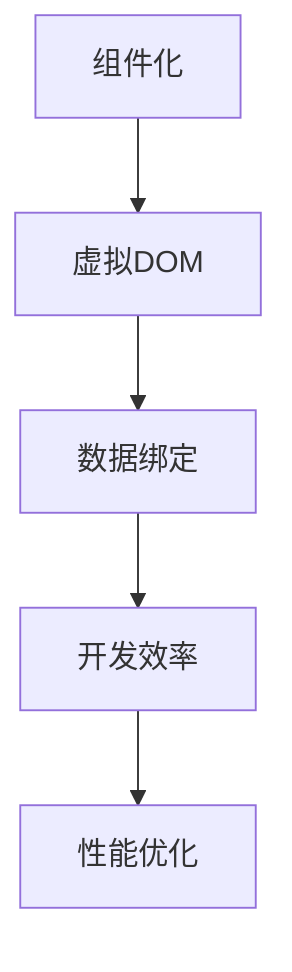
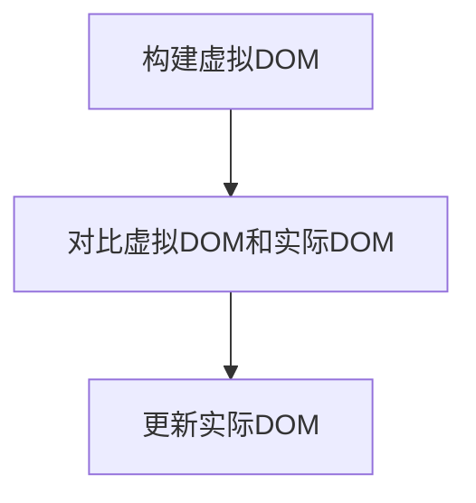

                 

关键词：Web前端框架，React，Vue，Angular，框架比较，选择指南，开发效率，性能优化

> 摘要：本文旨在为开发者提供关于Web前端框架选择的深入指南。我们将分析三大主流框架React、Vue和Angular的特点、优劣，帮助您根据项目需求做出明智的选择。

## 1. 背景介绍

随着互联网的快速发展，Web前端开发已经成为软件工程中不可或缺的一部分。前端框架的出现极大地提升了开发效率，减少了重复劳动，使得开发者能够专注于业务逻辑的实现。当前，市场上有多个知名的前端框架，如React、Vue和Angular，它们各具特色，广泛应用于不同类型的项目中。

本文将详细介绍这三大框架，并分析它们在功能、性能、开发效率等方面的特点，帮助您选择最适合您项目需求的前端框架。

## 2. 核心概念与联系

在前端开发中，框架的核心概念包括组件化、虚拟DOM、数据绑定等。以下是一个简单的Mermaid流程图，展示了这些概念之间的联系：



### 2.1 组件化

组件化是现代前端开发的核心思想，它将UI划分为可重用的组件，使得开发者可以独立开发、测试和部署组件，提高了代码的可维护性和可复用性。

### 2.2 虚拟DOM

虚拟DOM是一种在内存中构建的DOM结构，通过对比虚拟DOM与实际DOM的差异，实现对DOM的批量更新，从而提高页面渲染的效率。

### 2.3 数据绑定

数据绑定是一种将数据与UI自动同步的技术，它可以减少手动操作DOM的繁琐，提高开发效率。

### 2.4 开发效率

开发效率是框架选择的重要考虑因素，良好的框架应该提供便捷的API和工具，帮助开发者快速构建功能丰富的应用。

### 2.5 性能优化

性能优化是前端开发永恒的主题，一个优秀的框架应该具备良好的性能，以便在复杂的业务场景下保持流畅的用户体验。

## 3. 核心算法原理 & 具体操作步骤

### 3.1 算法原理概述

前端框架的核心算法包括虚拟DOM的构建、状态管理和渲染优化等。以下是一个简单的虚拟DOM构建算法的流程：



### 3.2 算法步骤详解

1. **构建虚拟DOM**：在组件渲染过程中，框架会根据组件的state和props构建一个虚拟DOM树。
2. **对比虚拟DOM和实际DOM**：框架会通过diff算法比较虚拟DOM和实际DOM的差异，找出需要更新的节点。
3. **更新实际DOM**：根据差异，框架会对实际DOM进行批量更新，从而实现高效的渲染。

### 3.3 算法优缺点

- **优点**：虚拟DOM通过批量更新减少了DOM操作次数，提高了页面渲染效率；diff算法优化了对比过程，降低了计算复杂度。
- **缺点**：虚拟DOM增加了内存占用，特别是在大型应用中；在某些极端情况下，diff算法可能导致不正确的更新。

### 3.4 算法应用领域

虚拟DOM算法广泛应用于单页面应用（SPA）、动态列表渲染和实时数据更新等场景。

## 4. 数学模型和公式 & 详细讲解 & 举例说明

### 4.1 数学模型构建

虚拟DOM的构建和更新过程可以用图论中的树形结构来描述。以下是一个简单的数学模型：

$$
\text{VirtualDOM} = (\text{Root}, \text{Children})
$$

其中，Root表示根节点，Children表示子节点。

### 4.2 公式推导过程

虚拟DOM的构建过程可以分为以下步骤：

1. **组件渲染**：根据组件的state和props构建虚拟DOM树。
2. **对比虚拟DOM和实际DOM**：使用diff算法找出需要更新的节点。
3. **更新实际DOM**：根据diff结果对实际DOM进行批量更新。

### 4.3 案例分析与讲解

假设有一个简单的组件，渲染一个包含两个子节点的列表。当state发生变化时，我们需要重新构建虚拟DOM并更新实际DOM。

```javascript
class List extends React.Component {
  state = {
    items: ['Apple', 'Banana', 'Cherry'],
  };

  render() {
    const { items } = this.state;
    return (
      <ul>
        {items.map((item, index) => (
          <li key={index}>{item}</li>
        ))}
      </ul>
    );
  }
}
```

当items数组发生变化时，React会重新构建虚拟DOM，并通过diff算法找出需要更新的节点。最终，实际DOM会被批量更新，实现高效的渲染。

## 5. 项目实践：代码实例和详细解释说明

### 5.1 开发环境搭建

在本节中，我们将以React框架为例，搭建一个简单的开发环境。

1. **安装Node.js**：确保您的系统中安装了Node.js和npm（Node Package Manager）。
2. **创建React项目**：使用create-react-app命令创建一个新的React项目。

```bash
npx create-react-app my-app
cd my-app
```

3. **启动开发服务器**：运行以下命令启动开发服务器。

```bash
npm start
```

### 5.2 源代码详细实现

在本节中，我们将实现一个简单的计数器组件，展示React的基本用法。

```jsx
import React, { useState } from 'react';

function Counter() {
  const [count, setCount] = useState(0);

  return (
    <div>
      <h1>Count: {count}</h1>
      <button onClick={() => setCount(count + 1)}>Increment</button>
    </div>
  );
}

export default Counter;
```

### 5.3 代码解读与分析

1. **引入React和useState**：首先引入React库和useState钩子函数。
2. **组件定义**：使用函数组件的方式定义Counter组件。
3. **状态管理**：使用useState钩子函数管理count状态，并返回当前状态值和更新状态的方法。
4. **渲染UI**：根据count状态渲染计数器和按钮。
5. **事件处理**：为按钮添加点击事件处理，更新count状态。

### 5.4 运行结果展示

运行开发服务器后，您将看到一个简单的计数器界面，点击按钮可以实时更新计数。


## 6. 实际应用场景

### 6.1 单页面应用（SPA）

单页面应用是目前前端开发的主流趋势，React、Vue和Angular都具备构建SPA的能力。以下是一些应用场景：

- **电子商务网站**：如Amazon、Etsy等，使用SPA提供流畅的用户体验。
- **社交媒体平台**：如Facebook、Instagram等，实时更新内容，提供动态交互。

### 6.2 动态列表渲染

动态列表渲染是前端开发中常见的场景，React、Vue和Angular都提供了解决方案：

- **商品列表**：在线购物平台中展示商品列表，实现过滤和排序功能。
- **任务管理**：如Trello、Asana等，实时更新任务状态和成员信息。

### 6.3 实时数据更新

实时数据更新在金融、在线教育和直播等场景中具有重要意义：

- **金融交易**：实时显示股票价格和交易信息。
- **在线教育**：实时互动，学生可以与教师或其他学生进行交流。
- **直播平台**：实时推送直播内容，观众可以实时评论和互动。

## 7. 工具和资源推荐

### 7.1 学习资源推荐

1. **官方文档**：每个框架都提供详细的官方文档，是学习框架的最佳资源。
2. **在线教程**：如MDN Web Docs、freeCodeCamp等，提供丰富的实战教程。
3. **社区和论坛**：如Stack Overflow、Reddit等，可以解答您在开发过程中遇到的问题。

### 7.2 开发工具推荐

1. **集成开发环境（IDE）**：如Visual Studio Code、WebStorm等，提供强大的代码编辑功能和调试工具。
2. **构建工具**：如Webpack、Parcel等，可以优化项目构建和打包过程。
3. **版本控制工具**：如Git、GitHub等，可以帮助团队协作和代码管理。

### 7.3 相关论文推荐

1. **React的虚拟DOM**：深入研究React的虚拟DOM机制，了解其内部工作原理。
2. **Vue的数据绑定**：了解Vue的数据绑定机制，掌握其实现原理。
3. **Angular的依赖注入**：了解Angular的依赖注入机制，提高代码的可维护性。

## 8. 总结：未来发展趋势与挑战

### 8.1 研究成果总结

近年来，前端框架的发展取得了显著的成果。React、Vue和Angular等框架在性能、开发效率和用户体验方面都有了很大的提升。未来，前端框架将继续向更高效、更灵活、更易用的方向发展。

### 8.2 未来发展趋势

1. **低代码开发**：随着技术的发展，低代码开发将成为前端开发的一个重要趋势。
2. **前端与后端融合**：前端框架将更紧密地与后端技术相结合，提供更完整的开发解决方案。
3. **跨平台开发**：前端框架将继续拓展跨平台开发的能力，满足移动端、桌面端和Web端的一体化需求。

### 8.3 面临的挑战

1. **性能优化**：随着应用复杂度的增加，前端性能优化将成为一项长期挑战。
2. **安全防护**：前端开发中面临的安全问题将越来越复杂，需要不断提高安全意识。
3. **开发者培训**：前端技术的快速发展要求开发者不断学习新技术，提高自身技能水平。

### 8.4 研究展望

未来，前端框架将继续在性能、开发效率和用户体验方面进行优化。同时，随着新技术的不断涌现，前端开发将迎来更多创新和变革。

## 9. 附录：常见问题与解答

### 9.1 React与Vue的区别

React和Vue都是当前最受欢迎的前端框架，它们的主要区别在于：

- **数据绑定**：React使用单向数据绑定，Vue使用双向数据绑定。
- **组件化**：React采用函数式组件，Vue采用类组件。
- **虚拟DOM**：React和Vue都采用虚拟DOM技术，但在实现细节上有所不同。

### 9.2 Angular的优势

Angular具有以下优势：

- **强类型检查**：Angular提供了强类型检查，提高了代码的可维护性。
- **依赖注入**：Angular的依赖注入机制使得组件之间的依赖关系更加清晰。
- **模块化**：Angular提供了强大的模块化机制，有助于组织和管理项目代码。

### 9.3 如何选择框架

选择框架时，可以从以下几个方面进行考虑：

- **项目需求**：根据项目的功能需求和开发周期选择合适的框架。
- **团队技能**：考虑团队成员对框架的熟悉程度和技能水平。
- **社区支持**：选择具有活跃社区和丰富资源的框架，以便在开发过程中得到帮助。

---

### 作者署名

本文由“禅与计算机程序设计艺术 / Zen and the Art of Computer Programming”撰写。

---

本文详细分析了React、Vue和Angular三大主流Web前端框架的特点、优劣和适用场景，为开发者提供了全面的选择指南。通过了解这些框架的核心概念、算法原理和实际应用场景，开发者可以根据项目需求做出明智的选择。在未来的前端开发中，随着技术的不断进步和应用的多样化，前端框架将继续发挥重要作用，为开发者带来更高的效率和更丰富的用户体验。同时，我们也需要关注前端开发面临的挑战，不断提升自身的技能水平，以应对未来发展的需求。

