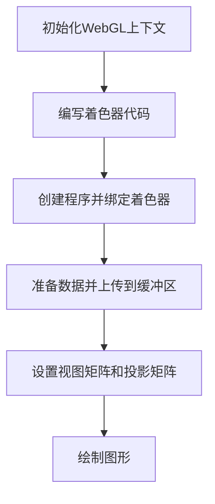

                 

关键词：WebGL, 3D图形渲染，浏览器技术，图形处理，计算机视觉，渲染引擎，Web开发

> 摘要：本文深入探讨了WebGL（Web Graphics Library）在浏览器中实现3D图形渲染的技术细节。通过阐述WebGL的核心概念、工作原理以及实际应用，本文旨在为开发者提供全面的技术指导和实践建议，帮助他们在Web项目中高效地实现3D图形效果。

## 1. 背景介绍

WebGL是一种基于OpenGL ES标准的网页图形API，它允许网页开发人员在不使用任何插件的情况下在浏览器中实现高性能的2D和3D图形渲染。随着Web技术的快速发展，WebGL已经成为Web开发中不可或缺的一部分。它不仅为游戏开发者提供了丰富的创作工具，还为设计师和前端开发者带来了实现复杂图形效果的可能。

WebGL的历史可以追溯到2009年，当时Google、Mozilla和Opera等浏览器制造商共同推出了WebGL草案。随着WebGL 1.0和WebGL 2.0标准的逐步完善，WebGL的功能和性能得到了显著提升。现如今，几乎所有主流浏览器都原生支持WebGL，使其成为实现复杂图形和视觉效果的首选技术之一。

## 2. 核心概念与联系

### 2.1 WebGL的核心概念

WebGL的核心概念包括：

- **着色器（Shaders）**：着色器是运行在GPU上的小程序，用于处理图形的渲染过程，包括顶点着色器（Vertex Shader）和片元着色器（Fragment Shader）。
- **缓冲区（ Buffers）**：缓冲区是存储图形数据的地方，包括顶点数据、纹理数据等。
- **程序（Program）**：程序是着色器的容器，它将顶点着色器、片元着色器和顶点属性配置在一起，用于执行图形渲染过程。
- **纹理（Textures）**：纹理是用于添加细节和纹理效果的图像数据。

### 2.2 WebGL的工作原理

WebGL的工作原理可以分为以下几个步骤：

1. **初始化WebGL上下文**：通过浏览器提供的API初始化WebGL上下文，包括创建画布元素和获取WebGL上下文对象。
2. **编写着色器代码**：根据需要编写的顶点着色器和片元着色器代码。
3. **创建程序并绑定着色器**：将着色器代码编译为GLSL（OpenGL Shading Language）程序，并链接它们到一个程序对象中。
4. **准备数据并上传到缓冲区**：将顶点数据、纹理数据等上传到缓冲区。
5. **设置视图矩阵和投影矩阵**：根据渲染场景设置视图矩阵和投影矩阵。
6. **绘制图形**：调用绘制函数（如`gl.drawArrays`或`gl.drawElements`）进行图形的绘制。

### 2.3 WebGL的架构

WebGL的架构可以概括为以下几个方面：

1. **图形栈**：包括视图栈、投影栈和模型视图栈等，用于存储图形变换的矩阵。
2. **缓冲区对象**：用于存储顶点数据、索引数据、纹理数据等。
3. **着色器程序**：包括顶点着色器、片元着色器和几何着色器等。
4. **纹理对象**：用于存储纹理图像数据。

以下是WebGL架构的Mermaid流程图：



## 3. 核心算法原理 & 具体操作步骤

### 3.1 算法原理概述

WebGL的核心算法原理主要包括图形变换、着色器编程和纹理映射。其中，图形变换是3D图形渲染的基础，它通过变换矩阵实现对顶点、相机和投影的变换；着色器编程则是实现个性化渲染效果的关键，它通过编写GLSL代码定义顶点着色器和片元着色器；纹理映射则用于在物体表面添加纹理效果，提高图形的真实感。

### 3.2 算法步骤详解

#### 3.2.1 图形变换

图形变换主要包括以下步骤：

1. **设置视图矩阵**：根据相机的位置和方向设置视图矩阵，将三维空间中的物体投影到二维屏幕上。
2. **设置投影矩阵**：根据投影方式（如正交投影或透视投影）设置投影矩阵，确定物体的投影范围和大小。
3. **设置模型视图矩阵**：将物体从世界坐标系变换到相机坐标系。

以下是图形变换的详细步骤：

```c
// 设置视图矩阵
mat4.viewMatrix = mat4.lookAt(
    cameraPosition,       // 相机位置
    cameraLookAt,         // 相机目标点
    cameraUp             // 相机向上方向
);

// 设置投影矩阵
mat4.projectionMatrix = mat4.perspective(
    fov,                 // 透视角度
    aspectRatio,         // 宽高比
    near,                // 近剪裁面
    far                 // 远剪裁面
);

// 设置模型视图矩阵
mat4.modelViewMatrix = mat4.multiply(
    mat4.modelMatrix,     // 物体变换矩阵
    mat4.viewMatrix       // 视图变换矩阵
);
```

#### 3.2.2 着色器编程

着色器编程主要包括以下步骤：

1. **编写顶点着色器**：定义顶点的属性，如位置、颜色等。
2. **编写片元着色器**：定义片元的属性，如颜色、纹理坐标等。
3. **链接着色器程序**：将顶点着色器和片元着色器编译并链接到程序对象中。

以下是着色器编程的详细步骤：

```glsl
// 顶点着色器
void main() {
    gl_Position = vec4(position, 1.0);
    gl_PointSize = size;
}

// 片元着色器
void main() {
    gl_FragColor = vec4(color, 1.0);
}

// 创建着色器程序
Shader shader = gl.createProgram();
gl.attachShader(shader, vertexShader);
gl.attachShader(shader, fragmentShader);
gl.linkProgram(shader);
```

#### 3.2.3 纹理映射

纹理映射主要包括以下步骤：

1. **加载纹理图像**：将纹理图像加载到纹理对象中。
2. **设置纹理属性**：根据需要设置纹理的滤波方式、环绕方式等属性。
3. **使用纹理**：在着色器中使用纹理坐标，将纹理应用到物体表面。

以下是纹理映射的详细步骤：

```glsl
// 加载纹理图像
Texture texture = gl.createTexture();
gl.bindTexture(gl.TEXTURE_2D, texture);
gl.texImage2D(
    gl.TEXTURE_2D,           // 目标纹理
    0,                      // 纹理层级
    gl.RGBA,                // 纹目标格式
    width,                  // 纹理宽度
    height,                 // 纹理高度
    0,                      // 纹理数据偏移量
    gl.RGBA,                // 纹目标数据格式
    gl.UNSIGNED_BYTE,       // 纹目标数据类型
    image                   // 纹图像数据
);

// 设置纹理属性
gl.texParameteri(gl.TEXTURE_2D, gl.TEXTURE_MIN_FILTER, gl.LINEAR);
gl.texParameteri(gl.TEXTURE_2D, gl.TEXTURE_MAG_FILTER, gl.LINEAR);
gl.texParameteri(gl.TEXTURE_2D, gl.TEXTURE_WRAP_S, gl.REPEAT);
gl.texParameteri(gl.TEXTURE_2D, gl.TEXTURE_WRAP_T, gl.REPEAT);

// 使用纹理
gl.activeTexture(gl.TEXTURE0);
gl.bindTexture(gl.TEXTURE_2D, texture);
```

### 3.3 算法优缺点

WebGL的优点包括：

- **高性能**：基于GPU计算，渲染性能优异。
- **跨平台**：支持几乎所有主流浏览器，无需安装插件。
- **灵活性**：支持自定义着色器和纹理，实现复杂渲染效果。

WebGL的缺点包括：

- **学习成本**：需要掌握GLSL语言和渲染流程，学习曲线较陡。
- **性能瓶颈**：在一些老旧浏览器或低端设备上，性能可能不理想。

### 3.4 算法应用领域

WebGL广泛应用于以下领域：

- **游戏开发**：实现高性能的3D游戏渲染。
- **虚拟现实**：构建沉浸式的虚拟现实体验。
- **计算机图形学**：进行图形渲染、处理和分析。
- **网站设计**：实现丰富的交互式图形效果。
- **科学可视化**：用于科学数据的可视化展示。

## 4. 数学模型和公式 & 详细讲解 & 举例说明

### 4.1 数学模型构建

在WebGL中，数学模型构建主要包括以下几个方面：

- **顶点表示**：使用三维向量表示顶点位置，如`vec3 position`。
- **变换矩阵**：使用矩阵表示变换，如视图矩阵、投影矩阵等。
- **着色器变量**：在着色器中定义变量，如顶点位置`gl_Position`、纹理坐标`gl_TexCoord`等。

以下是数学模型构建的详细步骤：

```glsl
// 顶点表示
attribute vec3 position;
varying vec3 v_Position;

uniform mat4 modelMatrix;
uniform mat4 viewMatrix;
uniform mat4 projectionMatrix;

void main() {
    gl_Position = projectionMatrix * viewMatrix * modelMatrix * vec4(position, 1.0);
    v_Position = position;
}
```

### 4.2 公式推导过程

在WebGL中，常用的公式包括视图矩阵、投影矩阵和变换矩阵的推导。以下是这些公式的推导过程：

#### 视图矩阵

视图矩阵的推导公式如下：

$$
\mathbf{V} = \mathbf{R}_{y}(\psi) \mathbf{R}_{x}(\phi) \mathbf{R}_{z}(\theta) \mathbf{I}
$$

其中，$\mathbf{R}_{y}(\psi)$、$\mathbf{R}_{x}(\phi)$和$\mathbf{R}_{z}(\theta)$分别为绕y轴、x轴和z轴旋转的旋转矩阵，$\mathbf{I}$为单位矩阵。

#### 投影矩阵

正交投影矩阵的推导公式如下：

$$
\mathbf{P}_{ortho} = \begin{bmatrix}
\frac{2}{right - left} & 0 & 0 & \frac{right + left}{right - left} \\
0 & \frac{2}{top - bottom} & 0 & \frac{top + bottom}{top - bottom} \\
0 & 0 & \frac{2}{far - near} & \frac{far + near}{far - near} \\
0 & 0 & 0 & 1
\end{bmatrix}
$$

其中，$left$、$right$、$bottom$和$top$分别为投影平面的左、右、下、上边界，$near$和$far$分别为近剪裁面和远剪裁面。

#### 变换矩阵

变换矩阵的推导公式如下：

$$
\mathbf{M} = \mathbf{R} \mathbf{T}
$$

其中，$\mathbf{R}$为旋转矩阵，$\mathbf{T}$为平移矩阵。

### 4.3 案例分析与讲解

#### 案例一：3D立方体渲染

以下是一个简单的3D立方体渲染案例，它展示了如何使用WebGL实现立方体的绘制：

```glsl
// 顶点着色器
attribute vec3 position;
uniform mat4 modelMatrix;
uniform mat4 viewMatrix;
uniform mat4 projectionMatrix;

void main() {
    gl_Position = projectionMatrix * viewMatrix * modelMatrix * vec4(position, 1.0);
}

// 片元着色器
void main() {
    gl_FragColor = vec4(1.0, 1.0, 1.0, 1.0);
}

// 渲染函数
function render() {
    gl.clear(gl.COLOR_BUFFER_BIT | gl.DEPTH_BUFFER_BIT);
    gl.useProgram(shaderProgram);

    // 设置变换矩阵
    mat4.perspective(
        projectionMatrix,
        45.0,
        canvas.width / canvas.height,
        0.1,
        100.0
    );

    mat4.lookAt(
        viewMatrix,
        [0, 0, 10],
        [0, 0, 0],
        [0, 1, 0]
    );

    // 绘制立方体
    gl.bindBuffer(gl.ARRAY_BUFFER, vertexBuffer);
    gl.vertexAttribPointer(shaderProgram.attributes.position, 3, gl.FLOAT, false, 0, 0);
    gl.enableVertexAttribArray(shaderProgram.attributes.position);

    gl.uniformMatrix4fv(shaderProgram.uniforms.modelMatrix, false, modelMatrix);
    gl.uniformMatrix4fv(shaderProgram.uniforms.viewMatrix, false, viewMatrix);
    gl.uniformMatrix4fv(shaderProgram.uniforms.projectionMatrix, false, projectionMatrix);

    gl.drawArrays(gl.TRIANGLES, 0, 36);
    requestAnimationFrame(render);
}
```

该案例中，我们首先定义了顶点着色器和片元着色器，然后使用`gl.bindBuffer`和`gl.vertexAttribPointer`设置顶点缓冲区，并使用`gl.uniformMatrix4fv`设置变换矩阵。最后，通过调用`gl.drawArrays`绘制立方体。

#### 案例二：纹理映射

以下是一个简单的纹理映射案例，它展示了如何使用WebGL在物体表面添加纹理效果：

```glsl
// 顶点着色器
attribute vec3 position;
attribute vec2 textureCoord;
uniform mat4 modelMatrix;
uniform mat4 viewMatrix;
uniform mat4 projectionMatrix;
uniform sampler2D texture;

varying vec2 v_TextureCoord;

void main() {
    gl_Position = projectionMatrix * viewMatrix * modelMatrix * vec4(position, 1.0);
    v_TextureCoord = textureCoord;
}

// 片元着色器
void main() {
    gl_FragColor = texture2D(texture, v_TextureCoord);
}

// 渲染函数
function render() {
    gl.clear(gl.COLOR_BUFFER_BIT | gl.DEPTH_BUFFER_BIT);
    gl.useProgram(shaderProgram);

    // 设置变换矩阵
    mat4.perspective(
        projectionMatrix,
        45.0,
        canvas.width / canvas.height,
        0.1,
        100.0
    );

    mat4.lookAt(
        viewMatrix,
        [0, 0, 10],
        [0, 0, 0],
        [0, 1, 0]
    );

    // 加载纹理图像
    texture = gl.createTexture();
    gl.bindTexture(gl.TEXTURE_2D, texture);
    gl.texImage2D(
        gl.TEXTURE_2D,
        0,
        gl.RGBA,
        image.width,
        image.height,
        0,
        gl.RGBA,
        gl.UNSIGNED_BYTE,
        image
    );

    // 绘制立方体
    gl.bindBuffer(gl.ARRAY_BUFFER, vertexBuffer);
    gl.vertexAttribPointer(shaderProgram.attributes.position, 3, gl.FLOAT, false, 0, 0);
    gl.enableVertexAttribArray(shaderProgram.attributes.position);

    gl.bindBuffer(gl.ARRAY_BUFFER, textureBuffer);
    gl.vertexAttribPointer(shaderProgram.attributes.textureCoord, 2, gl.FLOAT, false, 0, 0);
    gl.enableVertexAttribArray(shaderProgram.attributes.textureCoord);

    gl.activeTexture(gl.TEXTURE0);
    gl.bindTexture(gl.TEXTURE_2D, texture);

    gl.uniformMatrix4fv(shaderProgram.uniforms.modelMatrix, false, modelMatrix);
    gl.uniformMatrix4fv(shaderProgram.uniforms.viewMatrix, false, viewMatrix);
    gl.uniformMatrix4fv(shaderProgram.uniforms.projectionMatrix, false, projectionMatrix);
    gl.uniform1i(shaderProgram.uniforms.texture, 0);

    gl.drawArrays(gl.TRIANGLES, 0, 36);
    requestAnimationFrame(render);
}
```

该案例中，我们首先加载了一个纹理图像，然后设置纹理属性，并将纹理坐标传递给片元着色器。最后，通过调用`gl.drawArrays`绘制带有纹理的立方体。

## 5. 项目实践：代码实例和详细解释说明

### 5.1 开发环境搭建

要开始使用WebGL进行3D图形渲染，首先需要搭建一个开发环境。以下是一个基本的步骤：

#### 安装Node.js

确保您的系统中安装了Node.js，因为许多WebGL开发工具依赖于Node.js。

```bash
npm install -g node-gyp
```

#### 安装WebGL开发工具

安装以下WebGL开发工具和库：

```bash
npm install --save glslify three.js dat.GUI
```

这些工具和库将帮助您简化WebGL开发过程。

### 5.2 源代码详细实现

以下是一个简单的WebGL 3D图形渲染项目示例，我们将使用Three.js库来简化WebGL的开发过程。

#### HTML文件

```html
<!DOCTYPE html>
<html lang="en">
<head>
    <meta charset="UTF-8">
    <title>WebGL 3D Rendering Example</title>
    <style>
        body { margin: 0; }
        canvas { display: block; }
    </style>
</head>
<body>
    <script src="app.js"></script>
</body>
</html>
```

#### JavaScript文件（app.js）

```javascript
import * as THREE from 'three';
import Stats from 'three/examples/jsm/libs/stats.module.js';
import { GUI } from 'dat.GUI';

// 初始化场景
const scene = new THREE.Scene();
scene.background = new THREE.Color(0xAAAAAA);

// 设置相机
const camera = new THREE.PerspectiveCamera(75, window.innerWidth / window.innerHeight, 0.1, 1000);
camera.position.z = 5;

// 创建渲染器
const renderer = new THREE.WebGLRenderer({ antialias: true });
renderer.setSize(window.innerWidth, window.innerHeight);
document.body.appendChild(renderer.domElement);

// 创建统计信息
const stats = Stats();
document.body.appendChild(stats.dom);

// 创建控件
const controls = new THREE.OrbitControls(camera, renderer.domElement);
controls.target.set(0, 0, 0);
controls.update();

// 创建网格线
const gridHelper = new THREE.GridHelper(10, 10);
scene.add(gridHelper);

// 创建球体
const geometry = new THREE.SphereGeometry(0.5, 32, 32);
const material = new THREE.MeshBasicMaterial({ color: 0x00FF00 });
const sphere = new THREE.Mesh(geometry, material);
scene.add(sphere);

// 动画循环
function animate() {
    requestAnimationFrame(animate);

    sphere.rotation.x += 0.005;
    sphere.rotation.y += 0.005;

    controls.update();
    render();
    stats.update();
}

function render() {
    renderer.render(scene, camera);
}

animate();
```

### 5.3 代码解读与分析

这个示例项目中，我们首先导入了Three.js库以及相关的辅助库，然后创建了一个Three.js的场景（`THREE.Scene`）、相机（`THREE.PerspectiveCamera`）和渲染器（`THREE.WebGLRenderer`）。接下来，我们添加了一个网格辅助（`THREE.GridHelper`）和一个球体（`THREE.Mesh`），并将它们添加到场景中。

在动画循环函数`animate`中，我们更新了球体的旋转角度，使它能够随时间旋转。`render`函数负责绘制场景，而`stats.update`用于更新统计信息。

### 5.4 运行结果展示

运行这个项目后，您将在浏览器中看到一个绿色的球体，它可以沿着X轴和Y轴旋转。这展示了WebGL如何通过Three.js库简化3D图形渲染的过程。

## 6. 实际应用场景

WebGL在许多实际应用场景中发挥着重要作用。以下是一些典型的应用场景：

### 游戏开发

WebGL成为许多在线游戏的渲染引擎，如《Tetris》和《Minecraft》等。通过WebGL，开发者可以在浏览器中实现复杂的游戏图形效果，无需安装任何插件。

### 虚拟现实

WebGL在虚拟现实（VR）应用中也非常重要。通过WebGL，开发者可以创建沉浸式的VR体验，如虚拟博物馆和虚拟购物等。

### 设计和可视化

WebGL被广泛应用于设计和可视化领域，如建筑设计和3D打印模型。它使得设计师能够直接在浏览器中查看和编辑3D模型。

### 数据可视化

WebGL可以帮助开发者创建丰富的数据可视化图表，如3D饼图、3D柱状图等。这使得数据更加直观和易于理解。

## 7. 工具和资源推荐

### 学习资源推荐

1. **WebGL教程**：Three.js官方文档提供了丰富的WebGL教程，适合初学者入门。
2. **GLSL教程**：OpenGL官方文档提供了详细的GLSL教程，有助于掌握着色器编程。
3. **《WebGL编程指南》**：By Kouichi Matsuda和Rob Bateman，这是一本经典的WebGL学习书籍。

### 开发工具推荐

1. **Three.js**：这是一个流行的3D库，提供了许多WebGL开发的便捷功能。
2. **GLSL Studio**：一个在线GLSL着色器编辑器和测试器，方便开发者编写和调试着色器代码。

### 相关论文推荐

1. **"WebGL 2.0: Bringing More Performance and Features to the Web"**：本文介绍了WebGL 2.0的新功能和性能改进。
2. **"WebGL versus Other Rendering Technologies"**：本文对比了WebGL与其他渲染技术的优缺点。

## 8. 总结：未来发展趋势与挑战

### 研究成果总结

WebGL在过去几年中取得了显著进展，其性能和功能得到了显著提升。WebGL 2.0的发布带来了更多的图形功能和更高的性能，使得WebGL在游戏开发、虚拟现实和设计等领域得到了更广泛的应用。

### 未来发展趋势

1. **性能优化**：随着Web标准的发展，WebGL的性能将继续优化，使其在更多设备和平台上达到更好的表现。
2. **更丰富的功能**：WebGL将继续引入更多的图形功能，如更高级的阴影、光照和动画效果。
3. **更广泛的硬件支持**：随着硬件的发展，更多的设备和硬件将原生支持WebGL，使得WebGL的应用范围更加广泛。

### 面临的挑战

1. **学习成本**：尽管WebGL的功能丰富，但其学习成本较高，需要开发者掌握GLSL语言和渲染流程。
2. **跨浏览器兼容性**：虽然大多数主流浏览器支持WebGL，但仍有一些老旧浏览器或移动设备不支持，这限制了WebGL的应用范围。

### 研究展望

随着Web技术的不断进步，WebGL有望在未来成为实现复杂图形和交互式体验的首选技术。通过不断优化性能和引入更多功能，WebGL将在游戏开发、虚拟现实和设计等领域发挥更加重要的作用。

## 9. 附录：常见问题与解答

### 9.1 如何调试WebGL程序？

1. **使用浏览器开发者工具**：在浏览器中打开开发者工具，查看渲染过程中的错误信息。
2. **检查着色器代码**：确保着色器代码没有语法错误，并使用合适的GLSL版本。
3. **检查缓冲区数据**：确保缓冲区数据正确上传并绑定。

### 9.2 WebGL支持哪些图形功能？

WebGL支持以下图形功能：

1. **2D和3D渲染**：包括基本几何形状、线条和填充。
2. **纹理映射**：用于在物体表面添加纹理效果。
3. **光照和阴影**：包括平行光、点光源和聚光灯光照模式。
4. **材质和贴图**：用于自定义物体外观和纹理。
5. **动画和特效**：包括骨骼动画、粒子系统和特效渲染。

### 9.3 如何在WebGL中使用纹理？

1. **加载纹理图像**：使用`gl.texImage2D`函数加载纹理图像到纹理对象中。
2. **设置纹理属性**：使用`gl.texParameteri`函数设置纹理的滤波方式和环绕方式。
3. **在着色器中使用纹理**：在片元着色器中使用纹理坐标访问纹理图像。

----------------------------------------------------------------

> 作者：禅与计算机程序设计艺术 / Zen and the Art of Computer Programming

