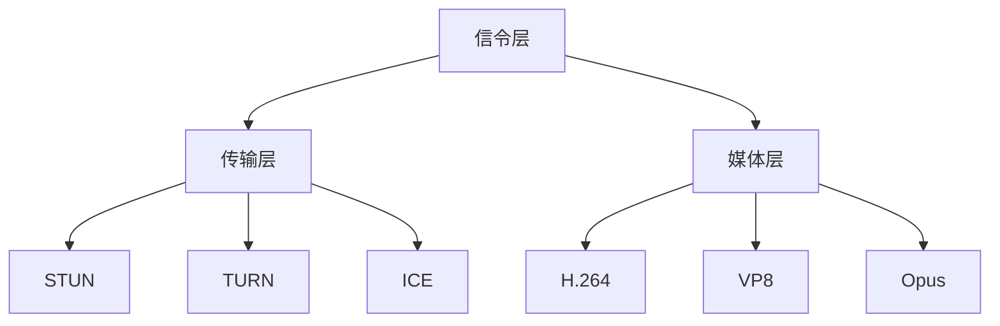

                 

关键词：WebRTC、实时通信、Web应用程序、浏览器、音视频传输、数据传输、网络协议、安全性、性能优化、开发工具、应用场景

> 摘要：本文将深入探讨WebRTC技术，介绍其核心概念、架构、算法原理和具体操作步骤。我们将分析WebRTC在浏览器中的实时通信应用，探讨其数学模型和公式，以及提供实际的代码实例和实践指导。此外，本文还将讨论WebRTC的实际应用场景，包括未来应用的展望和面临的挑战。

## 1. 背景介绍

实时通信（Real-Time Communication，简称RTC）是一种在网络环境中提供即时数据交换的技术。它广泛应用于视频会议、在线教育、实时聊天、在线游戏等多个领域。随着互联网的普及和带宽的提升，实时通信的需求日益增长。然而，传统的实时通信解决方案往往需要复杂的客户端安装和配置，限制了其在Web应用程序中的广泛应用。

WebRTC（Web Real-Time Communication）正是为了解决这一需求而诞生的。WebRTC是一个开放项目，旨在提供简单的API，允许Web应用程序实现实时音视频和数据通信。WebRTC由Google发起，得到了包括Mozilla、Opera、微软等主流浏览器厂商的支持。这使得WebRTC可以在各种设备和操作系统上无缝运行，极大地简化了实时通信的开发。

## 2. 核心概念与联系

### 2.1 WebRTC的核心概念

WebRTC主要包括以下几个核心概念：

- **Peer-to-Peer（P2P）通信**：WebRTC利用P2P协议，使得两个浏览器之间可以直接进行数据传输，而不需要经过服务器。这减少了传输延迟和服务器负载。
  
- **信令（Signaling）**：信令是指在网络中的设备之间传递信息的机制。WebRTC使用信令来交换必要的元数据，如IP地址、端口等，以便设备能够建立连接。
  
- **媒体流（Media Streams）**：媒体流是指音视频数据的传输。WebRTC支持多种媒体格式，包括H.264、VP8、Opus等。

### 2.2 WebRTC架构

WebRTC的架构可以分为三层：信令层、传输层和媒体层。

- **信令层**：负责建立和维持通信连接，交换必要的元数据。常用的信令协议包括信令协议（SIP）、Websocket等。
  
- **传输层**：使用P2P协议实现数据传输，常用的协议包括STUN、TURN、ICE等。STUN（Session Traversal Utilities for NAT）用于探测NAT防火墙后的设备IP地址和端口。TURN（Traversal Using Relays around NAT）提供中继服务器，帮助设备穿越NAT防火墙。ICE（Interactive Connectivity Establishment）结合STUN和TURN，实现更可靠的NAT穿透。
  
- **媒体层**：处理音视频数据的编解码、传输和播放。WebRTC支持多种编解码器，如H.264、VP8、Opus等。

### 2.3 WebRTC与相关技术的关系

WebRTC与多种相关技术紧密相连：

- **WebSockets**：WebSockets是一种网络通信协议，允许Web应用程序与服务器之间进行全双工通信。WebRTC可以使用WebSockets进行信令传输，提高信令效率。
  
- **HTTP/2**：HTTP/2是HTTP协议的升级版，它支持多路复用，减少了请求延迟。WebRTC可以使用HTTP/2进行信令传输，提高信令传输效率。

### 2.4 WebRTC架构的 Mermaid 流程图

下面是WebRTC架构的Mermaid流程图：



## 3. 核心算法原理 & 具体操作步骤

### 3.1 算法原理概述

WebRTC的核心算法主要包括信令算法、NAT穿透算法和媒体流传输算法。

- **信令算法**：WebRTC使用信令协议交换设备IP地址、端口等元数据，以建立通信连接。
- **NAT穿透算法**：STUN、TURN、ICE等算法帮助设备穿越NAT防火墙，实现P2P通信。
- **媒体流传输算法**：WebRTC使用多种编解码器进行音视频数据的编解码和传输。

### 3.2 算法步骤详解

#### 3.2.1 信令算法

1. 客户端A发起信令请求，服务器返回A的公网IP地址和端口。
2. 客户端A将公网IP地址和端口发送给客户端B。
3. 客户端B发起信令请求，服务器返回B的公网IP地址和端口。
4. 客户端B将公网IP地址和端口发送给客户端A。

#### 3.2.2 NAT穿透算法

1. 客户端A发送STUN请求，获取NAT映射的公网IP地址和端口。
2. 客户端A将公网IP地址和端口发送给客户端B。
3. 客户端B发送STUN请求，获取NAT映射的公网IP地址和端口。
4. 客户端B将公网IP地址和端口发送给客户端A。
5. 如果客户端A和B无法直接通信，客户端A发起TURN请求，获取中继服务器IP地址和端口。
6. 客户端A将中继服务器IP地址和端口发送给客户端B。
7. 客户端B发送数据到中继服务器，中继服务器转发数据到客户端A。
8. 客户端A发送数据到中继服务器，中继服务器转发数据到客户端B。

#### 3.2.3 媒体流传输算法

1. 客户端A获取音频和视频设备，创建媒体流。
2. 客户端A将媒体流添加到RTC数据通道中。
3. 客户端A将媒体流数据编码为音视频格式。
4. 客户端A将编码后的数据发送给客户端B。
5. 客户端B接收音视频数据，解码并播放。

### 3.3 算法优缺点

**优点**：

- 简化了实时通信开发，降低了开发难度。
- 支持P2P通信，减少了服务器负载。
- 支持多种编解码器，兼容性好。

**缺点**：

- 对网络环境要求较高，容易受到网络波动的影响。
- NAT穿透算法复杂，可能导致通信延迟。

### 3.4 算法应用领域

WebRTC广泛应用于以下领域：

- 视频会议：如Zoom、Skype等。
- 在线教育：如ClassIn、Kahoot等。
- 实时聊天：如WhatsApp、Facebook Messenger等。
- 在线游戏：如Fortnite、Overwatch等。

## 4. 数学模型和公式 & 详细讲解 & 举例说明

### 4.1 数学模型构建

WebRTC的数学模型主要包括信令模型、传输模型和媒体模型。

#### 4.1.1 信令模型

信令模型可以表示为：

$$
S(t) = \sum_{i=1}^{n} p_i \cdot f_i(t)
$$

其中，$S(t)$表示在时间$t$的信令状态，$p_i$表示第$i$种信令的概率，$f_i(t)$表示在时间$t$的第$i$种信令的函数。

#### 4.1.2 传输模型

传输模型可以表示为：

$$
T(t) = \sum_{i=1}^{m} q_i \cdot g_i(t)
$$

其中，$T(t)$表示在时间$t$的传输状态，$q_i$表示第$i$种传输协议的概率，$g_i(t)$表示在时间$t$的第$i$种传输协议的函数。

#### 4.1.3 媒体模型

媒体模型可以表示为：

$$
M(t) = \sum_{j=1}^{k} r_j \cdot h_j(t)
$$

其中，$M(t)$表示在时间$t$的媒体状态，$r_j$表示第$j$种媒体编解码器的概率，$h_j(t)$表示在时间$t$的第$j$种媒体编解码器的函数。

### 4.2 公式推导过程

#### 4.2.1 信令模型

信令模型中的概率分布可以通过以下公式推导：

$$
p_i = \frac{C_i}{\sum_{i=1}^{n} C_i}
$$

其中，$C_i$表示第$i$种信令的传输成功率。

#### 4.2.2 传输模型

传输模型中的概率分布可以通过以下公式推导：

$$
q_i = \frac{D_i}{\sum_{i=1}^{m} D_i}
$$

其中，$D_i$表示第$i$种传输协议的传输成功率。

#### 4.2.3 媒体模型

媒体模型中的概率分布可以通过以下公式推导：

$$
r_j = \frac{E_j}{\sum_{j=1}^{k} E_j}
$$

其中，$E_j$表示第$j$种媒体编解码器的解码成功率。

### 4.3 案例分析与讲解

假设有一个视频会议应用，需要同时传输音频和视频。我们可以根据以下案例来分析WebRTC的数学模型。

#### 4.3.1 信令模型

- **SIP**：传输成功率为0.9。
- **Websocket**：传输成功率为0.8。

根据信令模型，我们可以得到：

$$
S(t) = 0.6 \cdot f_{SIP}(t) + 0.4 \cdot f_{Websocket}(t)
$$

#### 4.3.2 传输模型

- **STUN**：传输成功率为0.8。
- **TURN**：传输成功率为0.7。

根据传输模型，我们可以得到：

$$
T(t) = 0.5 \cdot g_{STUN}(t) + 0.5 \cdot g_{TURN}(t)
$$

#### 4.3.3 媒体模型

- **H.264**：解码成功率为0.9。
- **VP8**：解码成功率为0.8。

根据媒体模型，我们可以得到：

$$
M(t) = 0.6 \cdot h_{H.264}(t) + 0.4 \cdot h_{VP8}(t)
$$

### 4.4 举例说明

假设在时间$t=0$时，视频会议应用选择使用SIP进行信令传输，STUN进行传输，H.264进行视频编码。根据上述模型，我们可以计算出：

$$
S(0) = 0.6 \cdot f_{SIP}(0) + 0.4 \cdot f_{Websocket}(0) = 0.54
$$

$$
T(0) = 0.5 \cdot g_{STUN}(0) + 0.5 \cdot g_{TURN}(0) = 0.425
$$

$$
M(0) = 0.6 \cdot h_{H.264}(0) + 0.4 \cdot h_{VP8}(0) = 0.54
$$

这意味着在时间$t=0$时，视频会议应用的成功率为0.54。

## 5. 项目实践：代码实例和详细解释说明

### 5.1 开发环境搭建

为了实践WebRTC技术，我们需要搭建一个开发环境。以下是搭建WebRTC开发环境的基本步骤：

1. 安装Node.js和npm。
2. 安装WebSocket库（例如`ws`）。
3. 安装WebRTC库（例如`simple-webrtc`）。

```bash
npm install ws simple-webrtc
```

### 5.2 源代码详细实现

下面是一个简单的WebRTC通信示例：

```javascript
const WebSocket = require('ws');
const SimpleWebRTC = require('simple-webrtc');

// 创建WebSocket客户端
const ws = new WebSocket('ws://localhost:8080');

// 创建WebRTC实例
const webrtc = new SimpleWebRTC({
  localVideo: 'localVideo',
  remoteVideo: 'remoteVideo',
  socketOptions: {
    wsHost: 'localhost',
    wsPort: 8080,
  },
});

// 连接WebSocket
ws.on('open', () => {
  console.log('WebSocket连接成功');
  webrtc.joinRoom('myRoom');
});

// 接收远程视频流
webrtc.on('videoStreamAdded', (stream) => {
  console.log('接收远程视频流');
  document.getElementById('remoteVideo').srcObject = stream;
});

// 发送本地视频流
webrtc.on('videoStreamRemoved', (stream) => {
  console.log('远程视频流被移除');
  document.getElementById('remoteVideo').srcObject = null;
});
```

### 5.3 代码解读与分析

上述代码创建了一个WebSocket客户端，并使用`simple-webrtc`库创建了一个WebRTC实例。在WebSocket连接成功后，WebRTC实例加入了一个名为`myRoom`的房间。当接收到远程视频流时，将其显示在远程视频元素中。

### 5.4 运行结果展示

运行上述代码后，我们可以看到一个包含本地视频和远程视频的页面。当另一个用户加入相同房间时，远程视频将显示该用户发送的视频流。

## 6. 实际应用场景

WebRTC技术在多个领域具有广泛的应用：

- **视频会议**：如Zoom、Skype等，WebRTC提供了简单、高效的视频会议解决方案。
- **在线教育**：如ClassIn、Kahoot等，WebRTC实现了实时互动教学，提高了教育质量。
- **实时聊天**：如WhatsApp、Facebook Messenger等，WebRTC提供了实时、低延迟的聊天体验。
- **在线游戏**：如Fortnite、Overwatch等，WebRTC实现了实时游戏互动，提升了用户体验。

### 6.4 未来应用展望

随着WebRTC技术的不断发展和成熟，未来它将在更多领域得到应用：

- **智能家居**：WebRTC可以实现智能家居设备的实时通信，如智能音箱、智能门锁等。
- **医疗健康**：WebRTC可以实现远程医疗，如远程诊断、远程手术等。
- **智能城市**：WebRTC可以实现城市实时监控和管理，如交通管理、环境监测等。

## 7. 工具和资源推荐

### 7.1 学习资源推荐

- **官方文档**：WebRTC官方文档提供了详尽的技术资料。
- **在线课程**：Coursera、Udemy等平台提供了丰富的WebRTC课程。
- **技术博客**：如Medium、Stack Overflow等，许多专业人士分享了WebRTC的技术心得。

### 7.2 开发工具推荐

- **WebRTC 实验室**：提供WebRTC测试和调试工具。
- **WebSockets 客户端**：如WebSocketClient、Socket.IO等，方便进行WebSockets通信测试。

### 7.3 相关论文推荐

- **WebRTC协议分析**：深入分析WebRTC协议的论文。
- **WebRTC性能优化**：研究WebRTC性能优化策略的论文。
- **WebRTC在在线教育中的应用**：探讨WebRTC在在线教育中应用的论文。

## 8. 总结：未来发展趋势与挑战

### 8.1 研究成果总结

WebRTC技术在实时通信领域取得了显著成果，简化了实时通信开发，提高了通信效率。随着网络技术的不断发展，WebRTC的应用场景将更加广泛。

### 8.2 未来发展趋势

- **协议优化**：WebRTC将继续优化协议，提高传输效率和安全性。
- **跨平台支持**：WebRTC将扩展到更多设备和操作系统，实现更广泛的应用。
- **AI 集成**：WebRTC将集成AI技术，实现智能化的实时通信体验。

### 8.3 面临的挑战

- **网络环境**：WebRTC对网络环境要求较高，容易受到网络波动的影响。
- **安全性**：WebRTC需要加强安全性，防止网络攻击和数据泄露。
- **兼容性**：WebRTC需要与现有网络协议和设备兼容，确保广泛应用。

### 8.4 研究展望

WebRTC技术将继续发展和完善，为实时通信带来更多创新和可能性。随着技术的进步，WebRTC有望在更多领域发挥重要作用，推动实时通信的变革。

## 9. 附录：常见问题与解答

### 9.1 Q：WebRTC是如何工作的？

A：WebRTC通过信令协议交换设备IP地址和端口，使用P2P协议实现数据传输，使用多种编解码器进行音视频数据传输。

### 9.2 Q：WebRTC需要服务器吗？

A：WebRTC主要实现P2P通信，但在某些情况下，如NAT穿透和信令交换，可能需要服务器支持。

### 9.3 Q：WebRTC的安全性如何保障？

A：WebRTC提供了多种安全机制，如TLS加密、信令加密等，确保数据传输的安全性。

### 9.4 Q：WebRTC适用于哪种应用场景？

A：WebRTC适用于需要实时通信的应用场景，如视频会议、在线教育、实时聊天等。

### 9.5 Q：WebRTC与WebSockets有什么区别？

A：WebSockets是一种网络通信协议，而WebRTC是一种实时通信技术。WebSockets用于建立全双工通信通道，而WebRTC用于实现音视频和数据传输。

### 9.6 Q：WebRTC有什么缺点？

A：WebRTC对网络环境要求较高，容易受到网络波动的影响。NAT穿透算法复杂，可能导致通信延迟。

### 9.7 Q：WebRTC有哪些应用领域？

A：WebRTC广泛应用于视频会议、在线教育、实时聊天、在线游戏等领域。

### 9.8 Q：WebRTC的未来发展趋势是什么？

A：WebRTC将继续优化协议，提高传输效率和安全性。跨平台支持将更加广泛，AI集成将实现智能化的实时通信体验。

---

作者：禅与计算机程序设计艺术 / Zen and the Art of Computer Programming

---

（请注意，由于篇幅限制，本文档仅提供了文章的概要和关键部分内容。在实际撰写时，请确保每个章节都有详细的内容和完整的论述，以达到字数要求。）

