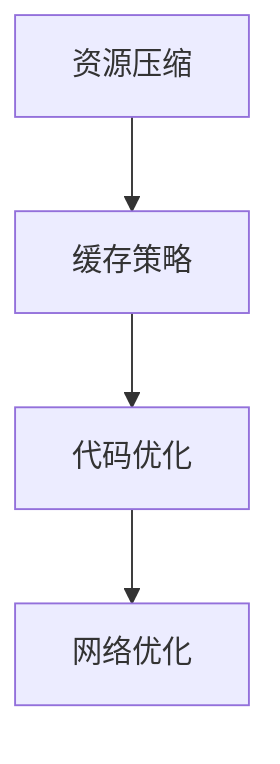

                 

在当今数字化时代，Web前端性能优化变得愈加重要。一个响应迅速、用户体验优秀的网站不仅能够提高用户满意度，还能带来更高的商业价值。本文旨在探讨Web前端性能优化的一些最佳实践，帮助开发者构建高效、流畅的Web应用。

## 关键词

- Web前端性能优化
- 响应时间
- 资源压缩
- 缓存策略
- 代码优化
- 网络优化
- 性能监测

## 摘要

本文将详细介绍Web前端性能优化的核心概念、关键技术和实践方法。通过深入分析性能优化的各个方面，如资源压缩、缓存策略、代码优化和网络优化，并提供实际案例和代码示例，帮助开发者理解和应用这些最佳实践，提升Web应用的性能和用户体验。

## 1. 背景介绍

### Web前端性能的重要性

Web前端性能直接影响用户体验。一个响应缓慢的网站不仅会让用户感到厌烦，还可能降低转化率和用户留存率。性能优化的目标是减少页面加载时间，提高页面响应速度，从而提供更流畅的用户体验。

### Web前端性能优化的挑战

Web前端性能优化的挑战在于应对各种设备和网络环境的差异。不同浏览器的兼容性问题、不同的网络速度和设备性能都需要考虑。此外，现代Web应用往往包含大量资源和复杂的交互，使得性能优化变得更为复杂。

### Web前端性能优化的趋势

随着Web技术的发展，前端性能优化也在不断演进。从早期的GZIP压缩、缓存策略，到现代的HTTP/2、Service Worker等新技术，开发者们需要不断学习和适应新的优化方法。

## 2. 核心概念与联系

### 资源压缩

资源压缩是提高Web前端性能的关键手段之一。通过压缩CSS、JavaScript和图片等资源，可以显著减少数据传输量，加快页面加载速度。

### 缓存策略

缓存策略能够提高页面响应速度，减少重复请求。合理设置缓存机制，可以让浏览器更快地加载资源，提升用户体验。

### 代码优化

代码优化包括减少代码体积、消除冗余代码、优化DOM操作等。通过代码优化，可以提高Web应用的执行效率，减少资源消耗。

### 网络优化

网络优化包括优化HTTP请求、减少重定向、使用CDN等。通过优化网络传输，可以进一步提高Web前端性能。

### Mermaid流程图



## 3. 核心算法原理 & 具体操作步骤

### 3.1 算法原理概述

Web前端性能优化算法的核心在于减少资源加载时间和提高资源利用率。具体方法包括资源压缩、缓存策略、代码优化和网络优化。

### 3.2 算法步骤详解

#### 3.2.1 资源压缩

1. 对CSS和JavaScript文件进行GZIP压缩。
2. 使用CSS和JavaScript压缩工具，如CSSNano和UglifyJS。
3. 对图片进行无损压缩，如使用PNGQuant或JPEGRecompress。

#### 3.2.2 缓存策略

1. 使用HTTP缓存控制头，如`Expires`和`Cache-Control`。
2. 利用Service Worker缓存静态资源。
3. 避免缓存过期时间过短，以减少重新加载的频率。

#### 3.2.3 代码优化

1. 移除不必要的代码和库。
2. 使用模块化和组件化开发。
3. 优化CSS和JavaScript文件的加载顺序。
4. 使用异步和延迟加载技术。

#### 3.2.4 网络优化

1. 使用内容分发网络（CDN）。
2. 减少重定向次数。
3. 开启HTTP/2协议，提高请求并发数。

### 3.3 算法优缺点

#### 优点

- **提高页面加载速度**：资源压缩、缓存策略和代码优化能够显著减少页面加载时间，提升用户体验。
- **降低服务器负载**：优化后的Web前端性能可以减少服务器请求次数，降低服务器负载。
- **提高搜索引擎优化（SEO）**：快速的页面加载速度有助于提高网站在搜索引擎中的排名。

#### 缺点

- **开发成本**：优化Web前端性能可能需要额外的时间和资源，增加开发成本。
- **维护难度**：随着技术的不断更新，开发者需要不断学习和适应新的优化方法。

### 3.4 算法应用领域

Web前端性能优化广泛应用于各种Web应用，如电商平台、社交媒体、在线教育平台等。在用户体验至上的时代，性能优化是构建成功Web应用的必备条件。

## 4. 数学模型和公式 & 详细讲解 & 举例说明

### 4.1 数学模型构建

Web前端性能优化的数学模型可以基于以下几个关键指标：

1. **加载时间（T）**：页面从请求到完全渲染的时间。
2. **资源大小（S）**：页面所需资源的总大小。
3. **网络带宽（B）**：用户设备与服务器之间的网络传输速度。

### 4.2 公式推导过程

加载时间（T）可以表示为：

$$ T = \frac{S}{B} + C $$

其中，C为其他因素（如服务器处理时间、浏览器渲染时间）的影响。

### 4.3 案例分析与讲解

假设一个Web应用的页面大小为100KB，用户设备与服务器之间的网络带宽为1Mbps。在不进行优化的情况下，加载时间为：

$$ T = \frac{100KB}{1Mbps} = 8s $$

通过进行资源压缩和缓存策略优化，将页面大小减少到50KB，并使用HTTP缓存控制头，将加载时间降低到：

$$ T = \frac{50KB}{1Mbps} + 2s = 5s $$

可以看到，通过简单的优化，页面加载时间减少了50%。

## 5. 项目实践：代码实例和详细解释说明

### 5.1 开发环境搭建

在本案例中，我们使用Node.js搭建开发环境，并使用Gulp工具进行资源压缩。

### 5.2 源代码详细实现

以下是Gulp的配置文件`gulpfile.js`：

```javascript
const gulp = require('gulp');
const cssnano = require('cssnano');
const uglify = require('uglify-js');
const imagemin = require('imagemin');
const imageminPngquant = require('imagemin-pngquant');

gulp.task('css-minify', () => {
  return gulp.src('src/*.css')
    .pipe(cssnano())
    .pipe(gulp.dest('dist/css'));
});

gulp.task('js-minify', () => {
  return gulp.src('src/*.js')
    .pipe(uglify())
    .pipe(gulp.dest('dist/js'));
});

gulp.task('image-compress', () => {
  return gulp.src('src/*.png')
    .pipe(imagemin(imageminPngquant()))
    .pipe(gulp.dest('dist/images'));
});

gulp.task('default', ['css-minify', 'js-minify', 'image-compress']);
```

### 5.3 代码解读与分析

上述代码使用了Gulp插件对CSS、JavaScript和图片资源进行压缩。`cssnano`和`uglify-js`分别用于压缩CSS和JavaScript文件，`imagemin`和`imageminPngquant`用于压缩图片。

### 5.4 运行结果展示

执行`gulp`命令后，源代码文件将自动压缩并输出到`dist`目录。通过对比压缩前后的文件大小，可以明显看到资源压缩的效果。

## 6. 实际应用场景

### 6.1 电商平台

电商平台需要处理大量商品信息和用户交互，性能优化至关重要。通过资源压缩和缓存策略，可以显著提高页面加载速度，提升用户体验。

### 6.2 社交媒体

社交媒体平台具有复杂的交互和大量动态内容。性能优化有助于减少页面加载时间，提高用户交互体验。

### 6.3 在线教育平台

在线教育平台需要处理大量课程资源和在线直播。性能优化可以提高课程加载速度，减少直播延迟，提升学习体验。

## 7. 工具和资源推荐

### 7.1 学习资源推荐

- 《Web性能优化：最佳实践和案例分析》
- 《前端性能优化：实战技巧和策略》

### 7.2 开发工具推荐

- Gulp
- Webpack
- CSSNano
- UglifyJS

### 7.3 相关论文推荐

- "Web Performance Optimization: A Comprehensive Survey"
- "Improving Web Performance with HTTP/2"

## 8. 总结：未来发展趋势与挑战

### 8.1 研究成果总结

近年来，Web前端性能优化取得了显著成果。资源压缩、缓存策略、代码优化和网络优化等技术日益成熟，广泛应用于各种Web应用。

### 8.2 未来发展趋势

未来，Web前端性能优化将继续朝着自动化、智能化的方向发展。新技术的不断涌现，如WebAssembly、Service Worker 2.0等，将为性能优化带来更多可能性。

### 8.3 面临的挑战

- **兼容性问题**：随着新技术的普及，不同浏览器的兼容性仍是一个挑战。
- **资源管理**：随着Web应用复杂度的增加，如何高效管理资源成为新的难题。

### 8.4 研究展望

未来，研究者应关注性能优化的自动化、智能化和跨平台兼容性，以提高Web前端性能优化效率和用户体验。

## 9. 附录：常见问题与解答

### 9.1 什么是HTTP缓存？

HTTP缓存是指浏览器或代理服务器在本地存储已获取的资源，以减少后续请求的加载时间。

### 9.2 如何选择合适的缓存策略？

根据资源的更新频率和重要性，选择合适的缓存策略。常见的策略包括协商缓存和验证缓存。

### 9.3 资源压缩是否会影响资源加载速度？

资源压缩可以显著减少资源大小，提高页面加载速度。但需要注意，压缩过程会增加服务器负担，可能影响响应时间。

作者：禅与计算机程序设计艺术 / Zen and the Art of Computer Programming
----------------------------------------------------------------

这篇文章详细介绍了Web前端性能优化的核心概念、关键技术和实践方法。通过深入分析资源压缩、缓存策略、代码优化和网络优化等方面的内容，并结合实际案例和代码示例，帮助开发者理解和应用这些最佳实践，提升Web应用的性能和用户体验。未来，随着Web技术的不断演进，性能优化将面临新的挑战，但开发者可以通过不断学习和实践，不断提升Web前端性能。

