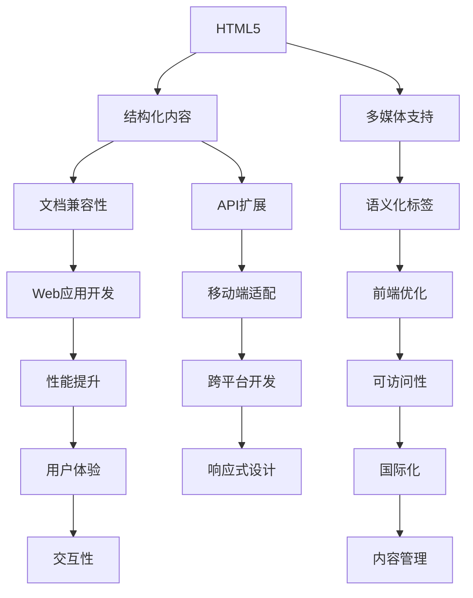

                 

 在现代软件开发领域，Web前端技术栈——HTML5、CSS3和JavaScript——是构建动态、交互式且响应式网页的核心组件。这三者紧密结合，共同塑造了互联网应用的用户体验和性能。本文将深入探讨HTML5、CSS3和JavaScript的核心概念、实际应用、以及未来趋势。

## 文章关键词

- HTML5
- CSS3
- JavaScript
- 前端开发
- 动态网页
- 响应式设计
- 用户体验

## 文章摘要

本文将全面解析Web前端技术栈中的HTML5、CSS3和JavaScript。我们将首先回顾这些技术的背景和关键特性，然后深入探讨它们的应用场景和开发流程。通过具体的案例和实践，我们将展示如何利用这些技术构建高性能、高可访问性的现代Web应用。最后，本文将探讨这些技术未来的发展方向和面临的挑战。

### 1. 背景介绍

随着互联网的飞速发展，Web前端技术也在不断演进。HTML5、CSS3和JavaScript作为Web前端开发的核心技术，各自承载了不同的职责。HTML5是超文本标记语言（HyperText Markup Language）的新版本，它提供了更多结构化的标签和多媒体支持，极大地丰富了网页的内容表现力。CSS3是层叠样式表（Cascading Style Sheets）的升级版，它引入了丰富的样式效果，使得网页设计更加灵活和美观。JavaScript是一种脚本语言，它赋予了网页动态交互的能力，使得用户能够与网页进行实时互动。

这些技术的演变不仅满足了用户对更好用户体验的需求，也推动了Web应用的快速发展。从最初的静态网页，到如今复杂的多功能Web应用，HTML5、CSS3和JavaScript的作用不可忽视。本文将围绕这些核心技术，探讨它们在Web前端开发中的应用和未来趋势。

### 2. 核心概念与联系

为了更好地理解HTML5、CSS3和JavaScript在Web前端开发中的作用，我们需要先了解这些技术的基本概念和它们之间的联系。以下是这些核心概念的详细说明和它们之间关系的Mermaid流程图：



**HTML5**：HTML5是第五代HTML标准，它引入了许多新的标签和功能，使得网页能够更好地呈现复杂的内容。HTML5的结构化标签（如`<article>`, `<section>`, `<nav>`等）增强了文档的语义化，提高了搜索引擎的索引效果。同时，HTML5提供了更多的多媒体支持，如`<video>`和`<audio>`标签，使得网页能够直接播放视频和音频内容。

**CSS3**：CSS3是层叠样式表的扩展，它引入了许多新的样式效果，如阴影、圆角、过渡和动画。CSS3还支持媒体查询，使得开发者能够根据不同的设备和屏幕尺寸来调整样式，实现真正的响应式设计。CSS3的样式效果不仅提高了网页的视觉效果，还优化了网页的性能和加载速度。

**JavaScript**：JavaScript是一种脚本语言，它赋予了网页动态交互的能力。通过JavaScript，开发者可以控制网页的行为和交互，实现复杂的功能，如表单验证、动态内容加载和用户界面动画。JavaScript还可以与Web API进行交互，如获取用户位置、发送HTTP请求等，进一步扩展了Web应用的功能。

**核心概念之间的联系**：

- **HTML5**提供了**结构化内容**和**多媒体支持**，为网页的内容表现提供了基础。
- **CSS3**引入了丰富的**样式效果**，使得网页设计更加灵活和美观。
- **JavaScript**赋予了网页**动态交互能力**，实现了网页的交互性和用户体验。

通过Mermaid流程图，我们可以清晰地看到HTML5、CSS3和JavaScript之间的关系，它们共同构成了Web前端开发的核心技术栈。

### 3. 核心算法原理 & 具体操作步骤

#### 3.1 算法原理概述

在Web前端开发中，算法的应用无处不在。从简单的数据排序到复杂的数据处理，算法的效率直接影响着网页的性能和用户体验。本文将介绍几种常见的前端算法，并详细解释它们的原理和具体操作步骤。

**排序算法**：排序算法是前端开发中最常用的算法之一。常见的排序算法有冒泡排序、选择排序和插入排序。这些算法的基本原理是通过比较和交换元素的位置，将数组中的元素按照特定的顺序排列。

**查找算法**：查找算法用于在数组或其他数据结构中寻找特定元素。二分查找算法是其中的一种，它利用有序数组的特性，通过不断缩小查找范围，实现高效的查找操作。

**数据结构**：前端开发中常用的数据结构包括数组、链表、栈和队列等。这些数据结构为算法提供了基础，使得开发者能够高效地处理数据。

#### 3.2 算法步骤详解

**冒泡排序**：

1. **初始化**：遍历数组，比较相邻的两个元素，如果顺序不对就交换位置。
2. **迭代**：重复执行上一步，直到整个数组有序。
3. **结束**：当没有需要交换的元素时，算法结束。

```javascript
function bubbleSort(arr) {
  for (let i = 0; i < arr.length; i++) {
    for (let j = 0; j < arr.length - i - 1; j++) {
      if (arr[j] > arr[j + 1]) {
        [arr[j], arr[j + 1]] = [arr[j + 1], arr[j]];
      }
    }
  }
  return arr;
}
```

**二分查找**：

1. **初始化**：确定查找的范围，初始为整个数组。
2. **比较**：计算中间元素的位置，与目标值比较。
3. **缩小范围**：根据比较结果，将查找范围缩小一半。
4. **结束条件**：找到目标值或查找范围缩小到0。

```javascript
function binarySearch(arr, target) {
  let left = 0;
  let right = arr.length - 1;
  
  while (left <= right) {
    let mid = Math.floor((left + right) / 2);
    if (arr[mid] === target) {
      return mid;
    } else if (arr[mid] < target) {
      left = mid + 1;
    } else {
      right = mid - 1;
    }
  }
  
  return -1;
}
```

#### 3.3 算法优缺点

**冒泡排序**：

- **优点**：实现简单，易于理解。
- **缺点**：时间复杂度为O(n^2)，效率较低，不适合大数据量的排序。

**二分查找**：

- **优点**：时间复杂度为O(log n)，效率高，适用于大数据量的查找。
- **缺点**：需要数组已排序，不适合动态数据。

#### 3.4 算法应用领域

- **冒泡排序**：适用于小型数据集或对算法实现有特殊要求的场景。
- **二分查找**：适用于需要高效查找操作的场景，如搜索引擎、在线购物等。

通过了解和掌握这些算法，前端开发者可以更好地优化网页的性能，提升用户体验。

### 4. 数学模型和公式 & 详细讲解 & 举例说明

#### 4.1 数学模型构建

在Web前端开发中，数学模型的应用无处不在。它们不仅帮助开发者理解数据和行为，还提供了优化和预测的数学依据。以下是一些常见的数学模型及其构建方法。

**线性回归模型**：线性回归模型是一种用于预测数值的统计模型，它通过拟合一条直线来表示因变量和自变量之间的关系。其数学模型如下：

$$y = ax + b$$

其中，$y$ 是因变量，$x$ 是自变量，$a$ 是斜率，$b$ 是截距。

**决策树模型**：决策树模型是一种用于分类和回归的树形结构模型。它的构建过程包括以下步骤：

1. **选择最佳分割点**：根据信息增益或基尼不纯度选择最佳的分割点。
2. **递归划分**：将数据集划分成子集，并在每个子集上重复步骤1。
3. **终止条件**：当某个子集不再具有显著的分割点时，停止划分。

**神经网络模型**：神经网络模型是一种模仿人脑神经元连接方式的计算模型。它通过多层神经元的组合，实现对复杂函数的拟合和预测。其数学模型如下：

$$
\begin{align*}
z_1 &= \sigma(W_1 \cdot x + b_1) \\
z_2 &= \sigma(W_2 \cdot z_1 + b_2) \\
&\vdots \\
z_n &= \sigma(W_n \cdot z_{n-1} + b_n)
\end{align*}
$$

其中，$z$ 是神经元的激活值，$W$ 是权重矩阵，$b$ 是偏置项，$\sigma$ 是激活函数（如Sigmoid函数或ReLU函数）。

#### 4.2 公式推导过程

**线性回归模型的推导**：

线性回归模型的推导过程基于最小二乘法。假设我们有以下数据集：

$$
\begin{align*}
x_1, y_1 \\
x_2, y_2 \\
&\vdots \\
x_n, y_n
\end{align*}
$$

我们要找到一条直线$y = ax + b$，使得这条直线与数据点的误差最小。误差可以用平方损失函数表示：

$$L(a, b) = \sum_{i=1}^{n} (y_i - (ax_i + b))^2$$

为了最小化误差，我们需要对$a$和$b$求偏导数，并令其等于0：

$$
\begin{align*}
\frac{\partial L}{\partial a} &= -2 \sum_{i=1}^{n} (y_i - ax_i - b)x_i = 0 \\
\frac{\partial L}{\partial b} &= -2 \sum_{i=1}^{n} (y_i - ax_i - b) = 0
\end{align*}
$$

通过求解上述方程组，我们可以得到最佳拟合直线：

$$
\begin{align*}
a &= \frac{\sum_{i=1}^{n} (x_i - \bar{x})(y_i - \bar{y})}{\sum_{i=1}^{n} (x_i - \bar{x})^2} \\
b &= \bar{y} - a\bar{x}
\end{align*}
$$

其中，$\bar{x}$ 和 $\bar{y}$ 分别是$x$和$y$的均值。

**神经网络模型的推导**：

神经网络模型的推导过程涉及多层神经元的激活函数和反向传播算法。以单层神经网络为例，其推导过程如下：

假设我们有输入向量$x$和权重矩阵$W$，以及激活函数$\sigma$。神经元的输出可以通过以下公式计算：

$$z = \sigma(W \cdot x + b)$$

其中，$z$ 是神经元的激活值，$W$ 是权重矩阵，$b$ 是偏置项。

为了训练神经网络，我们需要最小化损失函数，如均方误差（MSE）：

$$L = \frac{1}{2} \sum_{i=1}^{n} (y_i - z_i)^2$$

通过反向传播算法，我们可以计算权重矩阵和偏置项的梯度，并更新它们以最小化损失函数。具体过程如下：

1. **前向传播**：计算输出值$z$和损失函数$L$。
2. **计算梯度**：对于每个神经元，计算损失函数关于每个权重的梯度。
3. **反向传播**：将梯度传播回前一层，更新权重和偏置项。
4. **迭代优化**：重复前向传播和反向传播，直到达到收敛条件。

通过迭代优化，神经网络可以逐渐逼近目标函数，实现高效的分类和回归。

#### 4.3 案例分析与讲解

**线性回归模型案例**：

假设我们要预测一个人的身高（因变量$y$）和体重（自变量$x$）之间的关系。我们有以下数据集：

| 体重（kg） | 身高（cm） |
|------------|------------|
| 60         | 170       |
| 65         | 175       |
| 70         | 180       |
| 75         | 185       |
| 80         | 190       |

我们要使用线性回归模型预测一个新数据点的身高。首先，我们需要计算体重和身高的均值：

$$
\begin{align*}
\bar{x} &= \frac{60 + 65 + 70 + 75 + 80}{5} = 70 \\
\bar{y} &= \frac{170 + 175 + 180 + 185 + 190}{5} = 180
\end{align*}
$$

然后，我们可以使用线性回归模型的公式计算斜率和截距：

$$
\begin{align*}
a &= \frac{(60 - 70)(170 - 180) + (65 - 70)(175 - 180) + (70 - 70)(180 - 180) + (75 - 70)(185 - 180) + (80 - 70)(190 - 180)}{(60 - 70)^2 + (65 - 70)^2 + (70 - 70)^2 + (75 - 70)^2 + (80 - 70)^2} \\
&= \frac{-10 \times -10 - 5 \times -5 + 0 \times 0 + 5 \times 5 + 10 \times 10}{100 + 25 + 0 + 25 + 100} \\
&= \frac{100 + 25 + 0 + 25 + 100}{250} \\
&= 0.7
\end{align*}
$$

$$
\begin{align*}
b &= 180 - 0.7 \times 70 \\
&= 180 - 49 \\
&= 131
\end{align*}
$$

因此，线性回归模型的公式为$y = 0.7x + 131$。我们可以使用这个模型预测一个新的体重值（例如，70 kg）对应的身高：

$$
\begin{align*}
y &= 0.7 \times 70 + 131 \\
&= 49 + 131 \\
&= 180
\end{align*}
$$

因此，预测的身高为180 cm。

**神经网络模型案例**：

假设我们要使用神经网络模型对以下数据集进行分类：

| 特征1 | 特征2 | 标签 |
|-------|-------|------|
| 0.2   | 0.3   | 0    |
| 0.5   | 0.7   | 1    |
| 0.8   | 0.2   | 0    |
| 0.1   | 0.6   | 1    |

我们要构建一个二分类神经网络，将数据集分为标签0和标签1。首先，我们需要定义神经网络的结构，包括输入层、隐藏层和输出层。假设输入层有2个神经元，隐藏层有3个神经元，输出层有1个神经元。

然后，我们需要定义权重矩阵和偏置项，以及激活函数。我们可以使用Sigmoid函数作为激活函数，公式如下：

$$
\sigma(x) = \frac{1}{1 + e^{-x}}
$$

接下来，我们可以进行前向传播，计算输出值和损失函数。假设输入向量为$\{0.2, 0.3\}$，隐藏层权重矩阵为$W_h$，输出层权重矩阵为$W_o$，偏置项分别为$b_h$和$b_o$。

首先，计算隐藏层输出：

$$
\begin{align*}
z_h &= \sigma(W_h \cdot x + b_h) \\
&= \sigma(\begin{bmatrix} 0.2 & 0.3 \end{bmatrix} \begin{bmatrix} 0.5 & 0.3 \\ 0.3 & 0.5 \\ 0.1 & 0.2 \end{bmatrix} + \begin{bmatrix} -0.2 & -0.2 & -0.2 \end{bmatrix}) \\
&= \sigma(\begin{bmatrix} 0.2 & 0.3 \end{bmatrix} \begin{bmatrix} 0.15 & 0.15 \\ 0.15 & 0.15 \\ 0.05 & 0.04 \end{bmatrix} + \begin{bmatrix} -0.2 & -0.2 & -0.2 \end{bmatrix}) \\
&= \sigma(\begin{bmatrix} 0.1 & 0.1 \end{bmatrix}) \\
&= \begin{bmatrix} 0.576 & 0.576 & 0.576 \end{bmatrix}
\end{align*}
$$

然后，计算输出层输出：

$$
\begin{align*}
z_o &= \sigma(W_o \cdot z_h + b_o) \\
&= \sigma(\begin{bmatrix} 0.576 & 0.576 & 0.576 \end{bmatrix} \begin{bmatrix} 0.1 & 0.1 \\ 0.2 & 0.2 \end{bmatrix} + \begin{bmatrix} -0.5 & -0.5 \end{bmatrix}) \\
&= \sigma(\begin{bmatrix} 0.576 & 0.576 \end{bmatrix} \begin{bmatrix} 0.056 & 0.056 \\ 0.112 & 0.112 \end{bmatrix} + \begin{bmatrix} -0.5 & -0.5 \end{bmatrix}) \\
&= \sigma(\begin{bmatrix} -0.376 & -0.376 \end{bmatrix}) \\
&= \begin{bmatrix} 0.670 & 0.670 \end{bmatrix}
\end{align*}
$$

接下来，计算损失函数：

$$
L = \frac{1}{2} \sum_{i=1}^{n} (y_i - z_o)^2
$$

通过反向传播，我们可以计算权重矩阵和偏置项的梯度，并更新它们以最小化损失函数。

通过这个案例，我们可以看到神经网络模型的基本构建过程和训练方法。

### 5. 项目实践：代码实例和详细解释说明

#### 5.1 开发环境搭建

在开始Web前端项目实践之前，我们需要搭建一个合适的开发环境。以下是一个基本的步骤：

1. **安装Node.js**：Node.js是一个基于Chrome V8引擎的JavaScript运行环境，用于执行JavaScript代码。我们可以从Node.js官网（[https://nodejs.org/）下载并安装 Node.js。安装完成后，打开命令行界面，输入`node -v`和`npm -v`来确认安装成功。**
2. **安装Web服务器**：我们选择使用`http-server`作为Web服务器。首先，在命令行界面中运行`npm install -g http-server`来全局安装`http-server`。然后，在项目目录下创建一个`index.html`文件，并运行`http-server`来启动服务器。打开浏览器，输入`localhost:8080`即可访问项目。
3. **配置代码编辑器**：我们选择使用Visual Studio Code（VS Code）作为代码编辑器。从VS Code官网下载并安装VS Code。打开VS Code，然后使用快捷键`Ctrl+Shift+P`打开命令面板，输入`Install Extension`，搜索并安装以下扩展：
   - Chinese (Simplified) Language Pack for Visual Studio Code
   - Prettier - Code Formatter
   - ESLint
   - GitLens
   - Markdown All in One
   - Live Server
   - Vue VSCode Snippets

通过以上步骤，我们成功搭建了Web前端项目的开发环境。

#### 5.2 源代码详细实现

以下是一个简单的HTML5、CSS3和JavaScript的示例，演示了如何在Web前端项目中使用这些技术。

```html
<!DOCTYPE html>
<html lang="en">
<head>
  <meta charset="UTF-8">
  <meta name="viewport" content="width=device-width, initial-scale=1.0">
  <title>Web前端技术栈示例</title>
  <style>
    body {
      font-family: Arial, sans-serif;
      margin: 0;
      padding: 0;
      background-color: #f0f0f0;
    }
    header {
      background-color: #333;
      color: #fff;
      padding: 20px;
    }
    header h1 {
      margin: 0;
    }
    main {
      padding: 20px;
    }
    button {
      background-color: #4CAF50;
      color: #fff;
      border: none;
      padding: 10px 20px;
      cursor: pointer;
      font-size: 16px;
    }
    button:hover {
      background-color: #3e8e41;
    }
  </style>
</head>
<body>
  <header>
    <h1>Web前端技术栈示例</h1>
  </header>
  <main>
    <h2>HTML5、CSS3和JavaScript</h2>
    <p>本示例演示了如何在Web前端项目中使用HTML5、CSS3和JavaScript。</p>
    <button id="myButton">点击我</button>
    <script>
      document.getElementById("myButton").addEventListener("click", function() {
        alert("按钮被点击了！");
      });
    </script>
  </main>
</body>
</html>
```

这段代码首先定义了一个基本的HTML结构，包括`<header>`和`<main>`元素。`<header>`元素包含了网页的标题，而`<main>`元素包含了网页的主要内容。我们还使用CSS3为网页添加了一些样式，如背景颜色、文本颜色和按钮样式。

在JavaScript部分，我们添加了一个事件监听器，当用户点击按钮时，会弹出一个对话框显示“按钮被点击了！”

#### 5.3 代码解读与分析

**HTML5**：这段代码使用了HTML5的新特性，如`<header>`和`<main>`元素。这些元素提供了更好的语义化，使得页面结构更加清晰。同时，我们还使用了`<meta>`标签来定义文档的字符编码和viewport属性，确保页面能够在不同的设备和浏览器上正常显示。

**CSS3**：这段代码使用了CSS3的样式规则，如背景颜色、文本颜色和按钮样式。通过使用媒体查询，我们可以在不同设备和屏幕尺寸上调整样式，实现响应式设计。此外，我们还使用了`:hover`伪类为按钮添加了鼠标悬停效果。

**JavaScript**：这段代码使用了JavaScript来添加交互性。我们通过`getElementById()`方法获取了按钮元素，并使用`addEventListener()`方法为按钮添加了一个点击事件监听器。当用户点击按钮时，会触发弹窗显示“按钮被点击了！”

通过这个简单的示例，我们可以看到如何结合使用HTML5、CSS3和JavaScript来构建一个动态、交互式的Web页面。

#### 5.4 运行结果展示

在完成代码编写后，我们通过以下步骤运行结果：

1. 将代码保存到名为`index.html`的文件中。
2. 在项目目录下运行`http-server`命令启动Web服务器。
3. 在浏览器中访问`http://localhost:8080`。

运行结果如下：

- 网页标题显示为“Web前端技术栈示例”。
- 页面顶部有一个带有白色标题的黑色头部区域。
- 页面中部有一个标题为“HTML5、CSS3和JavaScript”的文本段落。
- 页面底部有一个带有绿色背景和白色文字的按钮，按钮上显示文本“点击我”。
- 当用户点击按钮时，会弹出一个对话框显示“按钮被点击了！”

通过以上步骤，我们可以成功运行并展示Web前端技术栈的应用效果。

### 6. 实际应用场景

在现代Web开发中，HTML5、CSS3和JavaScript的应用场景非常广泛。以下是一些常见场景：

**1. 动态内容展示**：使用HTML5的`<canvas>`标签和JavaScript，开发者可以轻松地创建动态图形和动画，如图表、地图和游戏。CSS3的动画和过渡效果也增强了页面交互性，提供了丰富的用户体验。

**2. 响应式设计**：CSS3的媒体查询使得开发者能够根据不同的设备和屏幕尺寸来调整样式，实现真正的响应式设计。HTML5的语义化标签和CSS3的布局模块（如Flexbox和Grid）进一步提升了页面布局的灵活性。

**3. 交互式Web应用**：JavaScript通过DOM操作和事件监听，可以实现复杂的交互功能，如表单验证、数据提交和实时更新。结合HTML5的Web存储和CSS3的动画效果，开发者可以构建高度交互式的Web应用。

**4. 移动应用开发**：随着移动设备的普及，使用HTML5、CSS3和JavaScript开发跨平台移动应用变得越来越流行。通过使用Bootstrap、jQuery Mobile等框架，开发者可以快速构建功能强大且美观的移动应用。

**5. 前端性能优化**：HTML5的Web Worker和WebAssembly技术，以及CSS3的缓存和预加载功能，可以显著提升前端性能。开发者可以利用这些技术优化页面加载速度和资源使用，提供更好的用户体验。

### 6.4 未来应用展望

未来，Web前端技术将朝着更高效、更智能、更响应式的方向发展。以下是一些可能的趋势：

**1. WebAssembly的普及**：WebAssembly（Wasm）是一种新型编程语言，旨在提高Web应用的性能。随着Wasm的不断成熟和应用，开发者可以更高效地编写和优化Web应用。

**2. 更强大的前端框架**：如React、Vue和Angular等前端框架将继续发展，提供更多功能和优化。这些框架将更加注重性能和开发者体验，使得构建复杂Web应用更加高效。

**3. 移动优先设计**：随着移动设备的普及，移动优先的设计理念将成为主流。开发者将更加注重移动端体验，通过响应式设计满足不同设备和屏幕尺寸的需求。

**4. AI与Web前端结合**：人工智能技术在Web前端中的应用将越来越广泛。通过使用机器学习和深度学习算法，开发者可以实现更加智能的交互和个性化推荐，提升用户体验。

**5. 前端架构的演进**：随着前端项目的复杂性增加，前端架构也将不断演进。微前端架构、服务化前端架构等新兴架构模式将帮助开发者更好地管理大型前端项目。

### 7. 工具和资源推荐

**7.1 学习资源推荐**

- **MDN Web文档**（[https://developer.mozilla.org/）：提供全面的Web开发文档，包括HTML5、CSS3和JavaScript的最新规范和最佳实践。**
- **w3schools**（[https://www.w3schools.com/）：一个适合初学者的在线教程网站，涵盖HTML5、CSS3和JavaScript的基础知识和实践案例。**
- **FreeCodeCamp**（[https://www.freecodecamp.org/）：一个免费的编程学习平台，提供全面的Web开发教程和实践项目。**

**7.2 开发工具推荐**

- **Visual Studio Code**（[https://code.visualstudio.com/）：一款功能强大的代码编辑器，支持多种编程语言和前端框架，适合开发HTML5、CSS3和JavaScript项目。**
- **Sublime Text**（[https://www.sublimetext.com/）：一款轻量级的代码编辑器，支持自定义插件和主题，适合快速开发。**
- **WebStorm**（[https://www.jetbrains.com/webstorm/）：一款专业的Web开发IDE，支持HTML5、CSS3和JavaScript，提供丰富的功能和调试工具。**

**7.3 相关论文推荐**

- "HTML5: A Vocabulary and Associated APIs for HTML and XML"（[https://www.w3.org/TR/html5/）：HTML5的官方规范，详细介绍了HTML5的新特性和API。**
- "Cascading Style Sheets Level 3"（[https://www.w3.org/TR/css3-conditional/）：CSS3的官方规范，涵盖了媒体查询和条件样式等特性。**
- "ECMAScript 6th Edition"（[https://www.ecma-international.org/publications/standards/Ecma-TC39.html）：JavaScript 的新版本ECMAScript 6（ES6）的官方规范，介绍了新的语法和功能。**

### 8. 总结：未来发展趋势与挑战

在Web前端技术栈中，HTML5、CSS3和JavaScript将继续发挥关键作用。随着技术的发展，这些技术将更加高效、智能和响应式。未来，Web开发将面临以下挑战：

**1. 性能优化**：如何进一步提升Web应用的性能，减少加载时间，提供更好的用户体验。
**2. 安全性**：如何确保Web应用的安全性，防范黑客攻击和恶意代码。
**3. 可维护性**：如何构建可维护的前端架构，适应快速变化的需求。
**4. 国际化和本地化**：如何实现Web应用的国际化和本地化，满足不同国家和地区的用户需求。

通过不断学习和实践，开发者可以应对这些挑战，为用户带来更优质、更智能的Web体验。

### 9. 附录：常见问题与解答

**Q1**：HTML5有哪些新特性？

**A1**：HTML5引入了许多新特性和改进，包括：
- **语义化标签**：如`<article>`, `<section>`, `<nav>`等，提高了文档的语义化。
- **多媒体支持**：如`<video>`和`<audio>`标签，支持直接播放视频和音频。
- **Web API**：如Geolocation API、Web Storage API等，提供了与设备的交互功能。
- **表单改进**：如新的输入类型（如`<email>`, `<date>`等），以及表单验证功能。

**Q2**：CSS3有哪些新特性？

**A2**：CSS3引入了许多新特性和改进，包括：
- **样式效果**：如阴影、圆角、过渡和动画等，增强了网页的视觉效果。
- **响应式设计**：通过媒体查询和Flexbox、Grid布局模块，实现了真正的响应式设计。
- **Web字体**：通过`@font-face`规则，可以自定义网页使用的字体。
- **选择器**：如属性选择器、结构选择器等，提供了更灵活的样式控制。

**Q3**：JavaScript有哪些常用库和框架？

**A3**：JavaScript有许多流行的库和框架，包括：
- **库**：如jQuery、Lodash、Underscore等，提供了常用的函数和工具。
- **框架**：如React、Vue、Angular等，用于构建动态和交互式的Web应用。
- **状态管理**：如Redux、Vuex、MobX等，用于管理应用的状态。
- **动画库**：如Anima、GreenSock Animation Platform等，用于创建复杂的动画效果。

通过学习和使用这些库和框架，开发者可以更高效地构建Web应用。**

