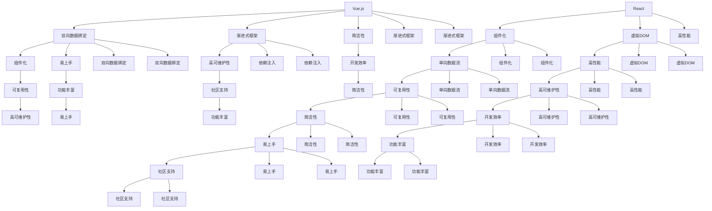

                 

关键词：Web前端，React，Vue，Angular，框架比较，性能，应用场景，开发者体验，技术选型。

摘要：本文将深入探讨React、Vue和Angular这三个主流Web前端框架的核心特点、优劣以及适用场景，为开发者提供技术选型时的参考。

## 1. 背景介绍

随着互联网技术的飞速发展，Web前端开发变得越来越复杂。为了提高开发效率和代码质量，开发者们开始采用各种前端框架。React、Vue和Angular是当前最为流行和广泛使用的三个框架，它们各自有着不同的设计理念、优缺点和适用场景。本文将对比这三个框架，帮助开发者了解它们的核心特点，以便在项目开发中进行合适的技术选型。

### 1.1 React

React是由Facebook于2013年推出的一个用于构建用户界面的JavaScript库。它采用虚拟DOM（Virtual DOM）技术，通过减少实际的DOM操作，实现了高效的渲染性能。React的组件化设计使得代码的可维护性和可复用性大大提高。

### 1.2 Vue

Vue.js是由尤雨溪（Evan You）于2014年创建的一个渐进式JavaScript框架。Vue的设计目标是为了让开发者能够以最简单的方式构建界面。它通过双向数据绑定和组件化设计，使得数据层和视图层能够紧密地结合在一起。

### 1.3 Angular

Angular是由Google开发的一个全功能的前端框架，最早版本于2010年发布。Angular采用了双向数据绑定和依赖注入等先进的设计模式，使得开发者能够更加容易地构建大型、复杂的应用程序。

## 2. 核心概念与联系

以下是一个描述React、Vue和Angular核心概念和联系的Mermaid流程图：



### 2.1 核心概念解析

- **组件化**：将UI拆分为独立的、可复用的组件，有助于代码的模块化和可维护性。
- **虚拟DOM**：通过虚拟DOM来表示实际的DOM结构，只有当虚拟DOM发生变化时，才会触发实际的DOM更新。
- **单向数据流**：数据从父组件流向子组件，使得状态管理更加简单和直观。
- **双向数据绑定**：当模型变更时，视图也会相应更新；反之亦然。
- **渐进式框架**：开发者可以选择是否使用框架的全部功能，以适应不同的项目需求。
- **依赖注入**：通过依赖注入来管理组件间的依赖关系，提高了代码的可测试性和可维护性。

## 3. 核心算法原理 & 具体操作步骤

### 3.1 算法原理概述

React、Vue和Angular都采用了虚拟DOM技术，以减少实际的DOM操作，从而提高渲染性能。虚拟DOM通过对实际DOM和虚拟DOM之间的映射关系进行维护，实现了高效的更新机制。

### 3.2 算法步骤详解

1. **构建虚拟DOM**：通过组件的渲染函数，构建出虚拟DOM结构。
2. **对比虚拟DOM**：在组件的状态或属性发生变化时，对比新的虚拟DOM和旧的虚拟DOM。
3. **更新实际DOM**：根据虚拟DOM的变化，对实际DOM进行更新。

### 3.3 算法优缺点

**优点**：
- **高性能**：通过减少实际的DOM操作，实现了高效的渲染性能。
- **可维护性**：组件化设计使得代码更加模块化和可维护。
- **开发效率**：虚拟DOM技术提高了开发效率。

**缺点**：
- **学习成本**：对于初学者来说，理解虚拟DOM的工作原理可能需要一定时间。
- **内存占用**：虚拟DOM结构需要占用一定的内存，对于大型应用来说，可能存在内存占用过高的问题。

### 3.4 算法应用领域

虚拟DOM技术主要应用于Web前端开发，特别是在构建大型、复杂的应用程序时，能够显著提高渲染性能和开发效率。

## 4. 数学模型和公式 & 详细讲解 & 举例说明

### 4.1 数学模型构建

虚拟DOM的数学模型主要包括两部分：实际DOM和虚拟DOM之间的映射关系，以及虚拟DOM之间的比较算法。

### 4.2 公式推导过程

假设我们有两个虚拟DOM节点A和B，它们分别对应实际DOM节点a和b。虚拟DOM节点A和B的属性和子节点可以通过以下公式表示：

$$
A = \{ \text{属性} : \text{值}, \text{子节点} : \text{子节点列表} \}
$$

$$
B = \{ \text{属性} : \text{值}, \text{子节点} : \text{子节点列表} \}
$$

### 4.3 案例分析与讲解

以下是一个简单的React组件，展示如何使用虚拟DOM技术进行渲染：

```javascript
class MyComponent extends React.Component {
  render() {
    return (
      <div>
        <h1>Hello, World!</h1>
        <p>Welcome to my website.</p>
      </div>
    );
  }
}
```

在上面的例子中，`<div>`元素对应虚拟DOM节点A，其中包含两个子节点：`<h1>`和`<p>`。当组件的状态或属性发生变化时，React会生成新的虚拟DOM节点B，并与旧的虚拟DOM节点A进行比较，然后根据比较结果更新实际DOM。

## 5. 项目实践：代码实例和详细解释说明

### 5.1 开发环境搭建

要开始使用React、Vue和Angular进行开发，首先需要安装Node.js环境。然后，可以通过以下命令分别安装三个框架：

```bash
npm install -g create-react-app
npm install -g @vue/cli
npm install -g @angular/cli
```

### 5.2 源代码详细实现

以下是一个简单的React组件示例：

```javascript
import React from 'react';

class MyComponent extends React.Component {
  render() {
    return (
      <div>
        <h1>Hello, React!</h1>
        <p>This is a simple React component.</p>
      </div>
    );
  }
}

export default MyComponent;
```

以下是一个简单的Vue组件示例：

```html
<template>
  <div>
    <h1>Hello, Vue!</h1>
    <p>This is a simple Vue component.</p>
  </div>
</template>

<script>
export default {
  name: 'MyComponent',
};
</script>
```

以下是一个简单的Angular组件示例：

```typescript
import { Component } from '@angular/core';

@Component({
  selector: 'my-component',
  template: `
    <div>
      <h1>Hello, Angular!</h1>
      <p>This is a simple Angular component.</p>
    </div>
  `
})
export class MyComponent {}
```

### 5.3 代码解读与分析

在上面的示例中，我们可以看到React、Vue和Angular都采用了组件化设计，使得代码的可维护性和可复用性大大提高。React和Vue使用JavaScript进行开发，Angular使用TypeScript进行开发。React和Vue的组件之间通过属性传递数据，Angular则通过双向数据绑定进行数据传递。

### 5.4 运行结果展示

通过使用上述命令，我们可以分别启动React、Vue和Angular的应用程序，并在浏览器中查看运行结果：

```bash
npx create-react-app my-app
cd my-app
npm start

npm install -g @vue/cli
vue create my-app
cd my-app
npm run serve

ng new my-app
cd my-app
ng serve
```

在浏览器中，我们可以看到三个框架分别构建的简单应用，它们都包含了标题和段落文本。

## 6. 实际应用场景

### 6.1 React

React适合构建复杂、动态的用户界面，特别是需要高交互性的应用。例如，社交媒体网站、在线购物平台、实时聊天应用等。

### 6.2 Vue

Vue适合构建渐进式、响应式的前端应用，特别适合在小型到中型的项目中使用。例如，博客系统、企业内部应用、小型电商平台等。

### 6.3 Angular

Angular适合构建大型、复杂的应用程序，特别是需要高安全性和高可靠性的应用。例如，金融应用、电子商务平台、企业级应用等。

### 6.4 未来应用展望

随着Web前端技术的不断发展，React、Vue和Angular都将继续演进和优化。未来的趋势可能包括：

- **更好的性能优化**：通过更高效的虚拟DOM算法和数据绑定机制，提高框架的性能。
- **更丰富的生态系统**：更多的第三方库和工具将支持这些框架，使得开发者能够更加高效地构建应用。
- **跨平台开发**：框架可能会扩展到移动端和桌面端，实现跨平台的开发体验。

## 7. 工具和资源推荐

### 7.1 学习资源推荐

- **React**：《React官方文档》（[https://reactjs.org/docs/getting-started.html](https://reactjs.org/docs/getting-started.html)）、《学习React》（[https://reactjs.org/tutorial/tutorial.html](https://reactjs.org/tutorial/tutorial.html)）
- **Vue**：《Vue官方文档》（[https://vuejs.org/v2/guide/](https://vuejs.org/v2/guide/)）、《Vue教程》（[https://vuejs.org/v2/guide/](https://vuejs.org/v2/guide/)）
- **Angular**：《Angular官方文档》（[https://angular.io/docs](https://angular.io/docs)）、《Angular入门教程》（[https://www.tutorialspoint.com/angularjs/index.htm](https://www.tutorialspoint.com/angularjs/index.htm)）

### 7.2 开发工具推荐

- **React**：Visual Studio Code、WebStorm
- **Vue**：Visual Studio Code、WebStorm、Vue VSCode 插件
- **Angular**：Visual Studio Code、WebStorm、Angular CLI

### 7.3 相关论文推荐

- **React**：《React：一个用于构建用户界面的JavaScript库》（[https://reactjs.org/docs/introducing-react.html](https://reactjs.org/docs/introducing-react.html)）
- **Vue**：《Vue.js：渐进式JavaScript框架》（[https://vuejs.org/v2/guide/](https://vuejs.org/v2/guide/)）
- **Angular**：《Angular：下一代Web应用框架》（[https://angular.io/docs](https://angular.io/docs)）

## 8. 总结：未来发展趋势与挑战

### 8.1 研究成果总结

React、Vue和Angular作为当前主流的前端框架，各自在性能、开发者体验、应用场景等方面有着明显的优势。通过对这三个框架的比较，我们可以更清晰地了解它们的核心特点，以便在项目开发中进行合适的技术选型。

### 8.2 未来发展趋势

随着Web前端技术的不断发展，React、Vue和Angular都将继续演进和优化。未来的趋势可能包括更好的性能优化、更丰富的生态系统、跨平台开发等。

### 8.3 面临的挑战

尽管React、Vue和Angular在当前都有着非常成熟的技术体系，但它们仍然面临一些挑战，如：

- **学习成本**：对于初学者来说，理解这些框架的工作原理可能需要一定时间。
- **性能优化**：对于大型、复杂的应用，如何优化虚拟DOM和数据绑定机制，提高性能仍然是一个挑战。

### 8.4 研究展望

未来的研究可以重点关注以下几个方面：

- **性能优化**：通过更高效的算法和数据结构，进一步提高框架的性能。
- **跨平台开发**：探索如何在移动端和桌面端实现跨平台的开发体验。
- **渐进式框架**：如何让开发者能够以更渐进的方式引入框架的功能，以适应不同的项目需求。

## 9. 附录：常见问题与解答

### 9.1 如何选择合适的框架？

选择框架时，需要考虑以下因素：

- **项目需求**：根据项目的复杂度、性能要求、交互性等选择合适的框架。
- **开发者技能**：选择开发者熟悉的框架，以提高开发效率。
- **社区支持**：选择社区活跃、文档完善的框架，以获得更好的技术支持。

### 9.2 如何优化虚拟DOM的性能？

以下是一些优化虚拟DOM性能的方法：

- **减少不必要的渲染**：通过条件渲染和shouldComponentUpdate等方法，减少不必要的渲染操作。
- **使用纯组件**：纯组件不会在状态变化时重新渲染，可以提高性能。
- **优化组件结构**：合理拆分组件，避免组件过重，以提高渲染性能。

---

作者：禅与计算机程序设计艺术 / Zen and the Art of Computer Programming

