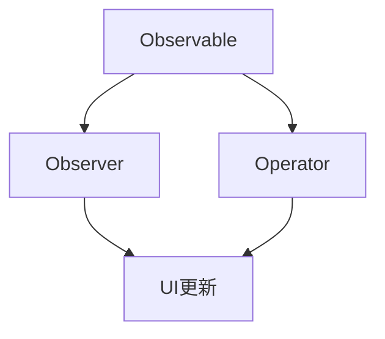

                 

关键词：iOS、响应式编程、RxSwift、异步编程、事件驱动、流处理、函数式编程

摘要：本文将深入探讨iOS平台上的响应式编程框架RxSwift。通过介绍响应式编程的基本概念和原理，我们将详细了解RxSwift的核心功能和用法。文章还将探讨实际开发中如何利用RxSwift实现高效的事件处理和异步编程。最后，我们将展望响应式编程在iOS开发中的未来发展趋势和潜在挑战。

## 1. 背景介绍

### 响应式编程的概念

响应式编程是一种编程范式，它强调数据和事件之间的关系。在传统的命令式编程中，程序按照预定的顺序执行，而响应式编程则通过事件驱动的方式，使得程序能够动态响应外部事件。这种编程范式在处理复杂、动态变化的数据流时显得尤为强大和灵活。

### iOS开发的挑战

随着iOS设备的广泛应用，移动应用开发变得日益重要。然而，iOS开发面临着诸多挑战：

- 异步编程的复杂性
- 数据流管理的复杂性
- UI更新与数据状态同步的挑战

### RxSwift的优势

RxSwift是一种在iOS平台上实现响应式编程的框架，它能够帮助我们解决上述挑战：

- 简化异步编程
- 管理复杂的数据流
- 实现高效的UI更新

## 2. 核心概念与联系

### 响应式编程原理

响应式编程的核心在于**观察者模式**，即当数据发生变化时，观察者会得到通知并做出相应的反应。在响应式编程中，数据被视为流，而操作则被视为函数。

### RxSwift架构

RxSwift基于观察者模式，提供了一套强大的API，用于处理异步事件和流。其核心组件包括：

- **Observable**：代表一个数据流，可以产生和发送数据。
- **Observer**：订阅数据流，接收和响应数据。
- **Operator**：对数据流进行操作，如过滤、变换、合并等。

### Mermaid流程图

下面是一个简单的Mermaid流程图，展示了响应式编程的基本流程：



### 关系与联系

- **Observable** 是数据流的源头，它通过事件触发数据的生产和发送。
- **Observer** 订阅数据流，接收事件并做出响应。
- **Operator** 对数据流进行操作，增加数据处理的能力。

## 3. 核心算法原理 & 具体操作步骤

### 3.1 算法原理概述

RxSwift的核心在于**事件驱动**和**函数式编程**。其基本原理包括：

- **事件驱动**：数据流以事件的形式产生，如数据的增加、删除、更新等。
- **函数式编程**：操作数据流时，使用纯函数和不可变数据，避免副作用和状态污染。

### 3.2 算法步骤详解

1. **创建Observable**：定义数据流的生产者，如网络请求、用户输入等。
2. **订阅Observer**：定义数据的消费者，即订阅数据流，接收并处理事件。
3. **应用Operator**：对数据流进行操作，如过滤、映射、合并等。
4. **UI更新**：根据处理后的数据更新UI。

### 3.3 算法优缺点

**优点**：

- 简化异步编程，提高代码可读性。
- 管理复杂的数据流，提高程序的可维护性。
- 支持函数式编程，避免副作用和状态污染。

**缺点**：

- 学习曲线较陡峭，需要一定的时间来熟悉和理解。
- 对性能有一定影响，尤其是在处理大量数据流时。

### 3.4 算法应用领域

- 异步数据请求和处理
- 实时数据流监控和可视化
- 数据分析和处理

## 4. 数学模型和公式 & 详细讲解 & 举例说明

### 4.1 数学模型构建

在响应式编程中，我们可以将数据流视为一个序列，每个事件都是一个序列元素。我们可以使用数学模型来描述这个序列和事件之间的关系。

- **序列**：一个无限长的数列，每个元素代表一个事件。
- **事件**：表示数据流中的一个具体的数据项。

### 4.2 公式推导过程

考虑一个简单的数据流，它包含一系列的事件。我们可以使用以下公式来描述这个数据流：

$$
S = \{e_1, e_2, e_3, ..., e_n\}
$$

其中，$e_i$ 表示第 $i$ 个事件。

### 4.3 案例分析与讲解

假设我们有一个简单的数据流，它包含三个事件：1、2、3。我们可以使用以下公式来表示这个数据流：

$$
S = \{1, 2, 3\}
$$

如果我们对数据流进行映射操作，将每个事件乘以2，我们可以得到以下新的数据流：

$$
S' = \{2 \cdot 1, 2 \cdot 2, 2 \cdot 3\} = \{2, 4, 6\}
$$

这是一个简单的例子，展示了如何使用数学模型来描述和操作数据流。

## 5. 项目实践：代码实例和详细解释说明

### 5.1 开发环境搭建

在开始之前，我们需要搭建一个支持RxSwift的开发环境。以下是搭建步骤：

1. 安装Xcode
2. 安装Swift语言支持
3. 通过CocoaPods安装RxSwift库

### 5.2 源代码详细实现

以下是一个简单的示例，展示了如何在iOS应用中使用RxSwift处理用户点击事件并更新UI：

```swift
import UIKit
import RxSwift
import RxCocoa

class ViewController: UIViewController {
    let disposeBag = DisposeBag()
    
    override func viewDidLoad() {
        super.viewDidLoad()
        
        // 创建一个按钮
        let button = UIButton(frame: CGRect(x: 100, y: 200, width: 100, height: 50))
        button.setTitle("点击", for: .normal)
        button.rx.tap
            .subscribe(onNext: {
                print("按钮被点击")
                // 更新UI
                self.view.backgroundColor = .random
            })
            .disposed(by: disposeBag)
        
        // 将按钮添加到视图
        self.view.addSubview(button)
    }
}

extension UIColor {
    static func random() -> UIColor {
        return UIColor(
            red: .random(),
            green: .random(),
            blue: .random(),
            alpha: 1.0
        )
    }
}
```

### 5.3 代码解读与分析

- 导入所需的库
- 创建一个按钮，并将其添加到视图
- 订阅按钮的点击事件
- 在点击事件中，打印一条消息并更新UI的颜色

### 5.4 运行结果展示

运行这个示例代码，可以看到一个按钮被添加到视图中。当用户点击按钮时，会打印一条消息，并且UI的颜色会随机变化。

## 6. 实际应用场景

### 6.1 实时数据监控

在实时数据监控中，响应式编程可以有效地处理大量的数据流，并对数据变化做出快速响应。例如，在一个金融应用中，我们可以使用RxSwift实时监控股票市场的变化，并在UI中即时更新股票信息。

### 6.2 网络请求处理

在处理网络请求时，响应式编程可以帮助我们简化异步编程，并确保数据的一致性。通过使用RxSwift，我们可以轻松地将多个网络请求合并成一个数据流，并在UI中统一处理响应和错误。

### 6.3 实时聊天应用

在实时聊天应用中，响应式编程可以处理大量的用户消息流，并确保消息的实时传递和更新。通过使用RxSwift，我们可以实现一个高效的聊天应用，提供流畅的用户体验。

## 7. 工具和资源推荐

### 7.1 学习资源推荐

- 《响应式编程实战》：一本深入浅出介绍响应式编程的书籍。
- 《RxSwift官方文档》：官方提供的文档，详细介绍了RxSwift的核心功能和用法。

### 7.2 开发工具推荐

- Xcode：苹果官方提供的集成开发环境，支持Swift编程。
- CocoaPods：一个流行的依赖管理工具，用于安装和管理第三方库。

### 7.3 相关论文推荐

- 《响应式编程：概念与实现》：一篇关于响应式编程的综述性论文，介绍了响应式编程的基本原理和实现。

## 8. 总结：未来发展趋势与挑战

### 8.1 研究成果总结

响应式编程在iOS开发中已经得到了广泛应用，它有效地解决了异步编程和数据流管理的复杂性。通过RxSwift等框架，开发者可以更轻松地实现高效的事件处理和UI更新。

### 8.2 未来发展趋势

随着移动设备的普及和应用的复杂性增加，响应式编程将在iOS开发中发挥更大的作用。未来，我们可能会看到更多的响应式编程框架和工具的出现，以满足开发者的需求。

### 8.3 面临的挑战

尽管响应式编程具有很多优势，但在实际应用中仍然面临一些挑战：

- 学习曲线较陡峭，需要一定的时间来熟悉和理解。
- 对性能有一定影响，尤其是在处理大量数据流时。
- 需要更完善的调试和支持工具。

### 8.4 研究展望

未来，响应式编程的研究方向可能包括：

- 提高性能和优化内存使用。
- 支持更多编程语言和平台。
- 提供更强大的调试和支持工具。

## 9. 附录：常见问题与解答

### Q: 什么是响应式编程？

A: 响应式编程是一种编程范式，它强调数据和事件之间的关系。在响应式编程中，数据和事件被视为流，程序通过响应事件来处理和更新数据。

### Q: 为什么选择使用RxSwift？

A: RxSwift是一种强大的响应式编程框架，它提供了一套丰富的API，用于处理异步事件和流。使用RxSwift可以简化异步编程，提高代码可读性，并支持函数式编程。

### Q: 如何处理错误和异常？

A: RxSwift提供了一些内置的错误处理机制，如`catchError`和`retry`操作符。此外，还可以使用自定义的错误处理逻辑来处理特定的错误情况。

## 作者署名

作者：禅与计算机程序设计艺术 / Zen and the Art of Computer Programming

----------------------------------------------------------------

以上就是关于iOS平台上的响应式编程框架RxSwift的全面介绍。希望这篇文章能够帮助您更好地理解和应用响应式编程，提升您的iOS开发技能。

