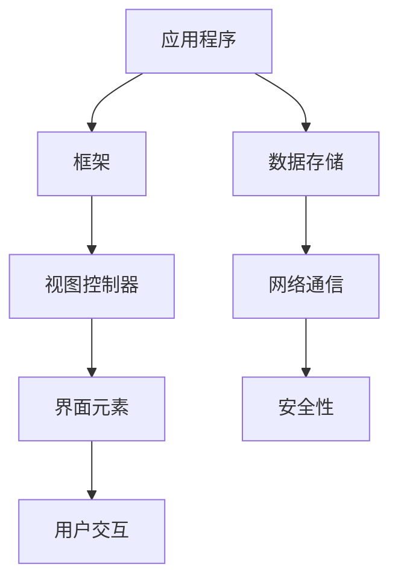

                 

 > **关键词**：iOS 开发，Swift 语言，Xcode，入门教程，框架结构，代码实例，实践应用，未来展望。

> **摘要**：本文旨在为初学者提供一个全面的iOS开发入门指南，重点介绍Swift编程语言和Xcode开发环境的使用。通过本文，读者将了解iOS开发的基本概念、工具选择、编程技巧以及实际应用场景。本文不仅适用于对iOS开发感兴趣的初学者，也为有经验的开发者提供了实用的参考。

## 1. 背景介绍

iOS开发作为一种移动应用开发，已经成为当今最具前景的技术领域之一。随着智能手机的普及，iOS应用市场持续繁荣，吸引了大量的开发者和企业投身其中。iOS平台以其出色的性能、稳定的操作系统和丰富的用户群体，成为了移动应用开发的理想选择。

Swift语言作为苹果公司推出的新一代编程语言，凭借其安全、快速和易用性，迅速成为iOS开发的首选语言。Swift不仅继承了Objective-C的许多优点，还引入了许多现代化的编程特性，使得iOS开发更加高效和便捷。

Xcode是苹果公司提供的集成开发环境（IDE），为Swift和Objective-C开发者提供了全面的开发工具和服务。Xcode集成了编译器、调试器、模拟器和代码编辑器等功能，为开发者提供了流畅的开发体验。

## 2. 核心概念与联系

在深入探讨iOS开发之前，我们首先需要了解一些核心概念和它们之间的联系。以下是一个简化的Mermaid流程图，用于描述这些概念之间的关系：



### 2.1 应用程序（Application）

应用程序是iOS开发的核心，它封装了所有的功能和资源。一个典型的iOS应用程序包括以下几个组成部分：

- **视图控制器（View Controllers）**：负责管理应用程序的用户界面和用户交互。
- **界面元素（UI Elements）**：如按钮、文本框、图片等，用于与用户进行交互。
- **数据存储（Data Persistence）**：用于保存应用程序状态和数据，如使用Core Data、NSUserDefaults等。
- **网络通信（Networking）**：通过RESTful API与其他应用程序或服务器进行通信。
- **安全性（Security）**：确保应用程序的安全性，如使用加密、身份验证等。

### 2.2 框架（Frameworks）

框架是iOS开发中的核心组成部分，它们为开发者提供了功能丰富的API和工具。以下是一些常用的iOS开发框架：

- **UIKit**：提供了一个用于构建用户界面的框架，包括各种界面元素和视图控制器。
- **Core Data**：提供了一个用于数据持久化的框架，支持对象图模型和高效的数据库操作。
- **AFNetworking**：用于网络通信的第三方库，支持RESTful API和异步请求。
- **MBProgressHUD**：用于显示进度提示和加载动画的库。

### 2.3 视图控制器（View Controllers）

视图控制器是管理用户界面的关键组件，它们负责响应用户的交互、更新界面以及处理用户输入。每个视图控制器都与一个`.xib`或`.storyboard`文件关联，用于定义用户界面。

### 2.4 界面元素（UI Elements）

界面元素是构建用户界面的基础，如文本框、按钮、标签和图像等。Swift和UIKit提供了一系列的UI组件，使得开发者可以轻松地创建美观且功能强大的用户界面。

### 2.5 用户交互（User Interaction）

用户交互是应用程序与用户之间的互动，包括触摸、滑动、点击等。通过监听和响应这些交互事件，应用程序可以响应用户的需求，提供更好的用户体验。

### 2.6 数据存储（Data Persistence）

数据存储是应用程序中不可或缺的一部分，它用于保存应用程序的状态和数据。Swift提供了多种数据存储方法，如Core Data、NSUserDefaults、SQLite等。

### 2.7 网络通信（Networking）

网络通信是现代移动应用的核心功能之一，它允许应用程序与服务器进行数据交换。Swift通过URLSession和第三方库（如AFNetworking）提供了强大的网络通信功能。

### 2.8 安全性（Security）

安全性是iOS开发中不可忽视的一环，它涉及数据加密、身份验证和网络安全等多个方面。Swift和iOS平台提供了多种安全特性，确保应用程序的数据安全。

## 3. 核心算法原理 & 具体操作步骤

### 3.1 算法原理概述

在iOS开发中，算法原理和编程技巧是构建高效应用程序的关键。以下是一些常用的算法原理和具体操作步骤：

- **排序算法**：如快速排序、归并排序和堆排序等，用于对数据进行排序。
- **查找算法**：如二分查找和哈希查找等，用于在数据结构中查找特定元素。
- **数据结构**：如数组、链表、树和图等，用于高效地存储和管理数据。
- **加密算法**：如AES、RSA等，用于保护数据的机密性。

### 3.2 算法步骤详解

以下是具体操作步骤的详解：

#### 3.2.1 快速排序（Quick Sort）

1. 选择一个基准元素作为分区点。
2. 将比基准元素小的元素移到分区点的左侧，比基准元素大的元素移到右侧。
3. 递归地对左右分区进行快速排序。

#### 3.2.2 二分查找（Binary Search）

1. 确定查找范围的中间元素。
2. 如果中间元素等于目标元素，则查找成功。
3. 如果目标元素小于中间元素，则在左侧子数组中继续查找。
4. 如果目标元素大于中间元素，则在右侧子数组中继续查找。
5. 重复步骤1-4，直到找到目标元素或查找范围缩小到空。

#### 3.2.3 数据结构操作

1. **数组**：用于存储固定数量的元素，支持快速随机访问。
2. **链表**：用于存储可变数量的元素，支持高效的插入和删除操作。
3. **树**：用于表示层次结构，支持高效的查找、插入和删除操作。
4. **图**：用于表示复杂的关系网络，支持多种算法操作。

### 3.3 算法优缺点

每种算法都有其优缺点，选择合适的算法取决于具体的应用场景。以下是一些常见算法的优缺点：

- **快速排序**：时间复杂度为O(n log n)，平均情况下性能较好，但最坏情况下性能较差。
- **二分查找**：时间复杂度为O(log n)，适用于有序数据结构，但需要额外的存储空间。
- **数据结构**：数组支持快速随机访问，但插入和删除操作较慢；链表支持高效的插入和删除操作，但访问速度较慢。

### 3.4 算法应用领域

算法在iOS开发中的应用广泛，以下是一些常见的应用领域：

- **用户界面**：用于处理用户输入、数据排序和界面更新等。
- **数据存储**：用于高效地存储和管理数据。
- **网络通信**：用于处理数据加密、网络优化和错误处理等。
- **安全性**：用于保护用户数据和隐私。

## 4. 数学模型和公式 & 详细讲解 & 举例说明

### 4.1 数学模型构建

在iOS开发中，数学模型和公式用于解决各种实际问题。以下是一个简单的数学模型示例：

设某应用程序的用户增长率为每天增加10%，初始用户数为1000人。要求计算第n天应用程序的用户数。

数学模型如下：

$$
用户数 = 初始用户数 \times (1 + 增长率)^n
$$

### 4.2 公式推导过程

为了推导上述数学模型，我们可以从用户增长的基本原理出发：

每天新增用户数 = 初始用户数 \* 增长率

第n天新增用户数 = 初始用户数 \* (1 + 增长率)^(n-1)

第n天用户总数 = 初始用户数 + 第n天新增用户数

$$
用户数 = 初始用户数 + 初始用户数 \times (1 + 增长率)^(n-1)
$$

$$
用户数 = 初始用户数 \times (1 + 增长率)^n
$$

### 4.3 案例分析与讲解

假设一个应用程序的初始用户数为1000人，每天用户增长率为10%。我们要求计算第30天的用户数。

根据数学模型：

$$
用户数 = 1000 \times (1 + 0.1)^{30}
$$

$$
用户数 = 1000 \times 1.1^{30}
$$

$$
用户数 ≈ 1000 \times 2.718281828459045
$$

$$
用户数 ≈ 2718人
$$

因此，第30天该应用程序的用户数为约2718人。

## 5. 项目实践：代码实例和详细解释说明

### 5.1 开发环境搭建

要在macOS上搭建iOS开发环境，首先需要安装Xcode和必要的开发工具。以下是具体的操作步骤：

1. 访问[苹果开发者网站](https://developer.apple.com/)，并登录您的Apple ID。
2. 点击“开发”部分，下载并安装Xcode。
3. 打开“终端”（Terminal），执行以下命令以安装必要工具：
   ```
   xcode-select --install
   ```
4. 安装完成后，再次打开“终端”，运行以下命令以更新Xcode命令行工具：
   ```
   xcode-select --switch /Applications/Xcode.app/Contents/Developer
   xcodebuild -version
   ```

### 5.2 源代码详细实现

以下是一个简单的iOS应用程序示例，用于显示一个带有按钮的界面。当用户点击按钮时，会显示一个提示对话框。

```swift
import UIKit

class ViewController: UIViewController {

    override func viewDidLoad() {
        super.viewDidLoad()
        let button = UIButton(type: .system)
        button.setTitle("点击我", for: .normal)
        button.frame = CGRect(x: 100, y: 200, width: 100, height: 50)
        button.addTarget(self, action: #selector(buttonTapped), for: .touchUpInside)
        view.addSubview(button)
    }

    @objc func buttonTapped() {
        let alert = UIAlertController(title: "提示", message: "按钮被点击了", preferredStyle: .alert)
        alert.addAction(UIAlertAction(title: "确定", style: .default, handler: nil))
        present(alert, animated: true, completion: nil)
    }
}
```

### 5.3 代码解读与分析

以上代码定义了一个简单的ViewController，用于展示一个带有按钮的界面。以下是代码的详细解读：

- **视图加载**：`viewDidLoad` 方法是视图控制器加载时调用的第一个方法。在该方法中，我们创建了一个按钮，并将其添加到视图中。
- **按钮事件监听**：`buttonTapped` 方法是一个监听按钮点击事件的方法。当用户点击按钮时，该方法会被调用，并显示一个带有提示信息的对话框。
- **UIAlertController**：这是一个用于显示提示对话框的类。在该示例中，我们创建了一个带有“确定”按钮的提示对话框，并在点击确定按钮后关闭对话框。

### 5.4 运行结果展示

在创建完项目并运行后，我们可以看到以下界面：


点击按钮后，将显示一个带有提示信息的对话框：


## 6. 实际应用场景

iOS开发在实际应用场景中具有广泛的应用，以下是一些常见的应用场景：

- **社交媒体应用**：如微信、微博等，用于用户之间的社交互动和信息分享。
- **电子商务应用**：如淘宝、京东等，用于在线购物和商品交易。
- **音乐播放器应用**：如网易云音乐、QQ音乐等，用于音乐播放和管理。
- **健身应用**：如Keep、MyFitnessPal等，用于用户健身数据和计划管理。
- **导航应用**：如百度地图、高德地图等，用于实时导航和路况查询。

### 6.4 未来应用展望

随着技术的不断进步，iOS开发在未来的应用前景将更加广阔。以下是一些可能的未来应用趋势：

- **人工智能与机器学习**：iOS应用将更加智能化，利用人工智能和机器学习技术提供个性化体验。
- **增强现实与虚拟现实**：AR/VR技术在iOS开发中的应用将日益普及，为用户提供沉浸式体验。
- **物联网（IoT）**：iOS应用将与其他智能设备（如智能家居、可穿戴设备等）进行无缝集成，实现智能化生活。
- **区块链技术**：iOS应用将利用区块链技术提供更安全、透明的数据交换和交易。

## 7. 工具和资源推荐

### 7.1 学习资源推荐

- **Swift官方文档**：[Swift.org](https://swift.org/)
- **SwiftUI官方文档**：[SwiftUI官网](https://swiftui.com/)
- **苹果开发者网站**：[developer.apple.com/ios/)
- **iOS开发者社区**：[iOSDevCampus](https://www.iosdevcampus.com/)

### 7.2 开发工具推荐

- **Xcode**：苹果官方提供的集成开发环境。
- **Swift Playgrounds**：用于学习Swift编程的交互式工具。
- **Alamofire**：用于网络请求的第三方库。
- **Core Data Modeler**：用于创建Core Data模型的图形界面工具。

### 7.3 相关论文推荐

- **"Swift: A Modern Programming Language for the Apple Ecosystem"**：介绍了Swift语言的设计和特性。
- **"The Swift Programming Language"**：Swift语言的官方教程。
- **"Xcode: Building Applications for iOS"**：介绍了Xcode的开发工具和开发流程。

## 8. 总结：未来发展趋势与挑战

### 8.1 研究成果总结

iOS开发作为一种先进的移动应用开发技术，已经取得了显著的研究成果。Swift语言以其安全、快速和易用性成为开发者首选，而Xcode开发环境则为开发者提供了强大的工具支持。此外，人工智能、增强现实和物联网等新兴技术的融入，使得iOS开发的应用前景更加广阔。

### 8.2 未来发展趋势

未来，iOS开发将继续向以下几个方向发展：

- **人工智能与机器学习**：iOS应用将更加智能化，利用人工智能和机器学习技术提供个性化体验。
- **增强现实与虚拟现实**：AR/VR技术在iOS开发中的应用将日益普及，为用户提供沉浸式体验。
- **物联网（IoT）**：iOS应用将与其他智能设备无缝集成，实现智能化生活。
- **区块链技术**：iOS应用将利用区块链技术提供更安全、透明的数据交换和交易。

### 8.3 面临的挑战

尽管iOS开发前景广阔，但仍面临一些挑战：

- **安全性**：随着应用复杂度的增加，安全性问题日益突出，开发者需要不断提高安全意识。
- **性能优化**：随着应用规模的扩大，性能优化成为开发者关注的重点，如何高效地处理大量数据和用户请求成为挑战。
- **跨平台兼容性**：如何在iOS和Android等不同平台之间实现代码复用和兼容性，是开发者需要解决的重要问题。

### 8.4 研究展望

未来，iOS开发领域将继续发展，研究者可以从以下几个方面进行探索：

- **语言进化**：不断改进Swift语言，提高其性能和易用性。
- **开发工具**：优化Xcode等开发工具，提高开发效率和用户体验。
- **应用创新**：探索新兴技术的应用场景，为用户提供更多创新的解决方案。
- **安全防护**：加强应用安全防护，保护用户隐私和数据安全。

## 9. 附录：常见问题与解答

### 9.1 Swift语言是什么？

Swift是一种由苹果公司开发的编程语言，用于iOS、macOS、watchOS和tvOS等平台的开发。它具有安全性、快速性和易用性等特点，成为开发者首选的语言之一。

### 9.2 Xcode是什么？

Xcode是苹果公司提供的集成开发环境（IDE），用于iOS、macOS、watchOS和tvOS等平台的开发。它集成了编译器、调试器、模拟器和代码编辑器等功能，为开发者提供了完整的开发工具和服务。

### 9.3 如何在iOS中实现网络通信？

在iOS中，网络通信通常使用URLSession和第三方库（如Alamofire）进行。URLSession提供了异步网络请求的功能，而Alamofire则提供了更简洁易用的API，使得网络通信更加高效。

### 9.4 如何保护用户数据安全？

在iOS中，可以使用多种方法保护用户数据安全，如使用HTTPS协议加密数据传输、使用Keychain存储敏感信息、使用数据加密库（如CryptoKit）对数据进行加密等。

---

作者：禅与计算机程序设计艺术 / Zen and the Art of Computer Programming
----------------------------------------------------------------


