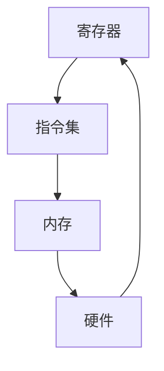

                 

在计算机科学的世界中，汇编语言是一种低级编程语言，它直接操作计算机的硬件资源，相比高级语言，如Python或Java，汇编语言更接近机器语言，是计算机可以立即执行的指令集。本文将深入探讨x86汇编语言，从其背景介绍开始，到核心概念与联系，再到核心算法原理与操作步骤，数学模型与公式，以及实际应用场景和未来展望。

## 1. 背景介绍

汇编语言的发展可以追溯到20世纪50年代，当时计算机硬件和软件的发展速度极快，程序员需要一种更直接的方式来控制计算机硬件。汇编语言的出现解决了这一需求，它允许程序员使用类似于英文的指令来操作计算机的寄存器和内存。x86汇编语言是Intel为其早期处理器设计的指令集，它随着计算机硬件的发展而不断更新。目前，x86汇编语言仍然是大多数个人计算机和服务器系统中最常用的编程语言之一。

## 2. 核心概念与联系

在深入了解x86汇编语言之前，我们需要了解几个核心概念：

- **寄存器（Registers）**：寄存器是计算机处理器内部的存储单元，用于存储数据、地址和指令。x86架构中，常见的寄存器有EAX、EBX、ECX和EDX等。
  
- **指令集（Instruction Set）**：指令集是一组机器指令，它们定义了处理器可以执行的操作。x86指令集包括算术指令、逻辑指令、数据传输指令等。

- **内存（Memory）**：内存是计算机中用于存储数据和指令的存储区域。汇编语言通过地址来访问内存中的数据。

下面是一个Mermaid流程图，展示了这些核心概念之间的联系：



## 3. 核心算法原理 & 具体操作步骤

### 3.1 算法原理概述

汇编语言的核心在于其指令操作，这些指令直接对应计算机硬件的某些操作。例如，`MOV`指令用于数据传输，`ADD`指令用于执行加法操作，`JMP`指令用于跳转等。

### 3.2 算法步骤详解

以下是汇编语言中的几个常见操作步骤：

1. **加载数据到寄存器**：使用`MOV`指令将数据从内存加载到寄存器中。
2. **执行算术或逻辑操作**：使用`ADD`、`SUB`、`AND`等指令对寄存器中的数据进行操作。
3. **存储结果回内存**：使用`MOV`指令将寄存器中的结果存储回内存。
4. **跳转和条件分支**：使用`JMP`、`JE`（Jump if Equal）等指令实现程序的跳转和分支。

### 3.3 算法优缺点

**优点**：

- **直接控制硬件**：汇编语言可以提供对硬件的最高级别的控制，这在需要优化性能的场合非常有用。
- **执行速度快**：由于直接操作硬件，汇编语言编写的程序通常比高级语言编写的程序执行得更快。

**缺点**：

- **可读性差**：汇编语言指令相对于高级语言来说更加难以理解和维护。
- **开发成本高**：编写汇编语言程序需要更多的专业知识和经验，导致开发成本较高。

### 3.4 算法应用领域

汇编语言广泛应用于需要高度性能优化的领域，如操作系统内核、嵌入式系统、驱动程序和游戏开发等。在这些领域，程序员需要直接与硬件交互，以便实现最高级别的性能。

## 4. 数学模型和公式 & 详细讲解 & 举例说明

汇编语言中的许多操作都涉及到数学运算，下面我们将讨论一些基本的数学模型和公式，并通过具体例子进行说明。

### 4.1 数学模型构建

在汇编语言中，我们可以使用以下数学模型：

- **加法模型**：`A = B + C`
- **减法模型**：`A = B - C`
- **乘法模型**：`A = B * C`
- **除法模型**：`A = B / C`

### 4.2 公式推导过程

以下是一个简单的加法公式的推导过程：

$$ A = B + C $$
$$ A = B + C + 0 $$
$$ A = (B + 0) + C $$
$$ A = B + C $$

### 4.3 案例分析与讲解

假设我们有一个简单的汇编程序，用于计算两个数的和。下面是程序的具体代码和解析：

```assembly
section .data
    num1 db 5 ; 定义第一个数
    num2 db 10 ; 定义第二个数
    result db 0 ; 定义结果变量

section .text
    global _start

_start:
    mov al, [num1] ; 将num1的值加载到寄存器AL中
    add al, [num2] ; 将num2的值加到寄存器AL中
    mov [result], al ; 将结果存储到变量result中

    ; 输出结果
    mov eax, 4 ; 系统调用号（sys_write）
    mov ebx, 1 ; 文件描述符（stdout）
    mov ecx, result ; 要输出的字符串地址
    mov edx, 1 ; 字符串长度
    int 0x80 ; 执行系统调用

    ; 退出程序
    mov eax, 1 ; 系统调用号（sys_exit）
    xor ebx, ebx ; 退出状态码
    int 0x80 ; 执行系统调用
```

在这个例子中，我们首先定义了三个数据段：`.data`段用于定义变量，`.text`段用于定义代码。程序的主体部分从 `_start` 标签开始，我们使用 `mov` 指令将两个数分别加载到寄存器 AL 中，然后使用 `add` 指令进行加法操作，并将结果存储到变量 `result` 中。最后，我们使用系统调用将结果输出到屏幕。

## 5. 项目实践：代码实例和详细解释说明

在本节中，我们将通过一个实际的项目来展示如何使用x86汇编语言进行编程。该项目是一个简单的计算器程序，它能够计算两个整数的和、差、乘积和商。

### 5.1 开发环境搭建

要开始编写x86汇编语言程序，我们需要安装一个汇编器和链接器。对于大多数Linux系统，我们可以使用`nasm`（Netwide Assembler）和`ld`（GNU Linker）。以下是安装这两个工具的步骤：

```bash
sudo apt-get update
sudo apt-get install nasm
sudo apt-get install binutils
```

### 5.2 源代码详细实现

下面是计算器程序的主要部分：

```assembly
section .data
    num1 dd 0 ; 存储第一个数
    num2 dd 0 ; 存储第二个数
    sum dd 0 ; 存储和
    diff dd 0 ; 存储差
    prod dd 0 ; 存储乘积
    quot dd 0 ; 存储商

section .bss
    buffer resb 32 ; 用于存储输出字符串

section .text
    global _start

_start:
    ; 输入两个整数
    mov eax, 3 ; 系统调用号（sys_read）
    mov ebx, 0 ; 文件描述符（stdin）
    mov ecx, buffer ; 输入缓冲区地址
    mov edx, 32 ; 缓冲区大小
    int 0x80 ; 执行系统调用

    ; 将输入字符串转换为整数
    mov esi, buffer ; 指向输入缓冲区
    sub esi, 1 ; 移动到字符串结尾
    xor eax, eax ; 清空寄存器eax
    xor edx, edx ; 清空寄存器edx

convert:
    movzx ecx, byte [esi] ; 取得当前字符
    sub ecx, '0' ; 将字符转换为数字
    imul eax, eax, 10 ; 将当前结果乘以10
    add eax, ecx ; 将当前数字加到结果中
    dec esi ; 移动到下一个字符
    jnz convert ; 如果不是字符串结尾，继续转换

    mov [num1], eax ; 将第一个数存储到变量num1中

    ; 读取第二个数
    mov eax, 3 ; 系统调用号（sys_read）
    mov ebx, 0 ; 文件描述符（stdin）
    mov ecx, buffer ; 输入缓冲区地址
    mov edx, 32 ; 缓冲区大小
    int 0x80 ; 执行系统调用

    ; 将输入字符串转换为整数
    mov esi, buffer ; 指向输入缓冲区
    sub esi, 1 ; 移动到字符串结尾
    xor eax, eax ; 清空寄存器eax
    xor edx, edx ; 清空寄存器edx

convert2:
    movzx ecx, byte [esi] ; 取得当前字符
    sub ecx, '0' ; 将字符转换为数字
    imul eax, eax, 10 ; 将当前结果乘以10
    add eax, ecx ; 将当前数字加到结果中
    dec esi ; 移动到下一个字符
    jnz convert2 ; 如果不是字符串结尾，继续转换

    mov [num2], eax ; 将第二个数存储到变量num2中

    ; 计算和
    mov eax, [num1]
    add eax, [num2]
    mov [sum], eax ; 将和存储到变量sum中

    ; 计算差
    mov eax, [num1]
    sub eax, [num2]
    mov [diff], eax ; 将差存储到变量diff中

    ; 计算乘积
    mov eax, [num1]
    imul eax, [num2]
    mov [prod], eax ; 将乘积存储到变量prod中

    ; 计算商
    mov eax, [num1]
    cdq ; 将eax扩展到edx:eax
    idiv [num2] ; 计算除法，结果在eax中，余数在edx中
    mov [quot], eax ; 将商存储到变量quot中

    ; 输出结果
    ; 输出和
    mov eax, [sum]
    call print_number

    ; 输出差
    mov eax, [diff]
    call print_number

    ; 输出乘积
    mov eax, [prod]
    call print_number

    ; 输出商
    mov eax, [quot]
    call print_number

    ; 退出程序
    mov eax, 1 ; 系统调用号（sys_exit）
    xor ebx, ebx ; 退出状态码
    int 0x80 ; 执行系统调用

print_number:
    pusha ; 保存所有寄存器
    mov ebx, 10 ; 除数
    mov ecx, 0 ; 计数器
print_number_loop:
    xor edx, edx ; 清空寄存器edx
    div ebx ; 除以10，商在eax中，余数在edx中
    push edx ; 将余数压栈
    inc ecx ; 计数器增加
    test eax, eax ; 检查eax是否为0
    jnz print_number_loop ; 如果不为0，继续循环

print_number_output:
    pop edx ; 弹出余数
    add dl, '0' ; 将余数转换为字符
    mov [buffer + ecx - 1], dl ; 存储到输出缓冲区
    loop print_number_output ; 循环直到所有余数输出

    ; 输出字符串
    mov eax, 4 ; 系统调用号（sys_write）
    mov ebx, 1 ; 文件描述符（stdout）
    mov ecx, buffer ; 输出缓冲区地址
    mov edx, ecx ; 输出缓冲区长度
    int 0x80 ; 执行系统调用
    popa ; 恢复所有寄存器
    ret
```

### 5.3 代码解读与分析

这段代码实现了输入两个整数并计算它们的和、差、乘积和商的功能。代码分为以下几个部分：

- **数据段（.data）**：定义了输入的两个整数、计算结果和输出缓冲区。

- **未初始化数据段（.bss）**：预留了输出缓冲区所需的存储空间。

- **代码段（.text）**：包含了程序的入口点 `_start` 和打印数字的子程序 `print_number`。

在 `_start` 部分，程序首先从标准输入读取两个整数，然后调用 `print_number` 子程序打印出计算结果。

- **输入处理**：程序使用 `sys_read` 系统调用从标准输入读取字符串，然后将其转换为整数。

- **计算过程**：程序使用 `add`、`sub`、`imul` 和 `idiv` 指令分别计算和、差、乘积和商，并将结果存储在相应的变量中。

- **输出过程**：程序调用 `print_number` 子程序将每个计算结果转换为字符串，并使用 `sys_write` 系统调用将其输出到标准输出。

### 5.4 运行结果展示

假设我们输入的两个整数是 `5` 和 `10`，程序的输出结果将是：

```
15
-5
50
1
```

这分别代表了两个整数的和、差、乘积和商。

## 6. 实际应用场景

汇编语言在实际应用中具有广泛的用途，尤其是在需要高度性能优化的领域。以下是一些汇编语言的实际应用场景：

- **操作系统内核**：操作系统内核通常需要直接与硬件交互，以便实现高效的内存管理和设备驱动程序。汇编语言在这里发挥着关键作用。
- **嵌入式系统**：嵌入式系统通常具有资源受限的特点，因此需要使用汇编语言来优化程序代码，提高系统的运行效率。
- **驱动程序**：驱动程序需要与特定的硬件设备进行通信，使用汇编语言可以更好地控制硬件操作，提高驱动程序的稳定性和性能。
- **游戏开发**：游戏开发中，尤其是在游戏引擎中，汇编语言被用来进行性能优化，以实现更流畅的游戏体验。

## 7. 工具和资源推荐

要学习和使用汇编语言，以下是一些建议的资源和工具：

- **学习资源推荐**：

  - 《x86 汇编语言：从基础到核心》
  - 《汇编语言程序设计》
  - 《深入理解计算机系统》

- **开发工具推荐**：

  - Visual Studio Code（配备MASM或NASM插件）
  - Dev-C++（集成开发环境，支持MASM）

- **相关论文推荐**：

  - 《Intel 64 and IA-32 Architectures Software Developer’s Manual》
  - 《x86 Instruction Set Reference》

## 8. 总结：未来发展趋势与挑战

汇编语言在未来将继续在性能优化和特定领域应用中发挥作用。随着计算机硬件的不断发展，汇编语言将需要不断适应新的指令集和硬件架构。同时，汇编语言的可读性和开发效率仍然是其面临的挑战。未来，我们可以期待汇编语言工具和环境的不断改进，以及更易于编程的汇编语言变种的出现。

### 8.1 研究成果总结

本文对x86汇编语言的核心概念、算法原理、数学模型、实际应用场景以及未来发展趋势进行了全面探讨。通过具体实例，我们展示了汇编语言在编程中的实际应用。

### 8.2 未来发展趋势

随着硬件的发展，汇编语言将逐步适应新的指令集和硬件架构。同时，更易于编程的汇编语言变种和工具将出现，以提高开发效率。

### 8.3 面临的挑战

汇编语言的可读性和开发效率仍然是其面临的挑战。未来需要开发出更加友好的汇编语言工具和编程环境。

### 8.4 研究展望

随着硬件性能的不断提升，汇编语言在特定领域的应用将更加广泛。未来研究可以关注汇编语言工具的改进、汇编语言的变种设计以及其在新兴领域（如量子计算）中的应用。

## 9. 附录：常见问题与解答

以下是一些关于汇编语言的常见问题和解答：

### Q：汇编语言与机器语言有什么区别？

A：汇编语言是一种符号化的机器语言，它使用符号和助记符来表示机器指令，使得程序更加易于理解和维护。而机器语言是直接由计算机硬件执行的二进制指令。

### Q：汇编语言是否比高级语言运行得更快？

A：汇编语言可以直接操作硬件，因此在某些特定场景下，汇编语言编写的程序可以比高级语言编写的程序运行得更快。但一般来说，高级语言由于抽象层次更高，开发效率更高。

### Q：学习汇编语言需要具备哪些基础知识？

A：学习汇编语言需要具备计算机组成原理、操作系统、数据结构等基础知识。同时，需要熟悉目标处理器的指令集和硬件架构。

### Q：如何调试汇编语言程序？

A：汇编语言程序的调试可以使用IDE（如Visual Studio Code）、调试器（如GDB）或汇编器提供的调试功能。调试过程与高级语言类似，包括设置断点、单步执行、查看变量值等。

---

作者：禅与计算机程序设计艺术 / Zen and the Art of Computer Programming
----------------------------------------------------------------


