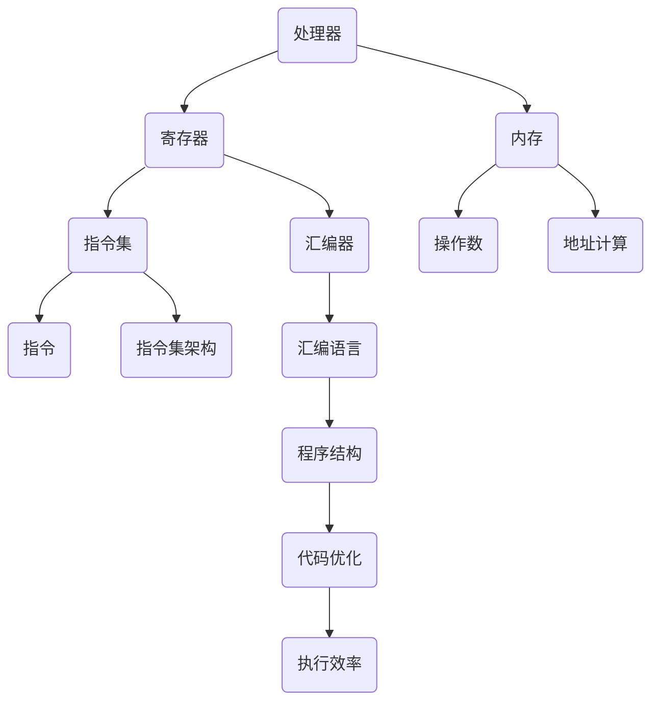

                 

关键词：x86汇编语言、计算机编程、编程语言、程序设计、汇编指令、计算机架构

摘要：本文将深入探讨x86汇编语言程序设计的基础知识、核心概念、算法原理以及具体操作步骤。通过详细的数学模型、公式推导和实际代码实例，读者将全面了解x86汇编语言的编程技巧和实际应用，为后续深入学习计算机编程打下坚实的基础。

## 1. 背景介绍

x86汇编语言是一种低级编程语言，它直接操作计算机的硬件资源，具有高效和灵活的特点。作为一种底层的编程语言，x86汇编语言是计算机科学领域的重要组成部分，对于理解计算机工作原理和优化程序性能具有重要意义。本文将从基础概念、核心算法、数学模型、代码实例以及实际应用等方面，全面介绍x86汇编语言程序设计。

### 1.1 x86汇编语言的历史和发展

x86汇编语言起源于1980年代初的IBM个人电脑（IBM PC），随着PC机的普及，x86架构成为了计算机行业的事实标准。x86汇编语言最初是为了满足Intel 8086处理器而设计的，后来随着处理器技术的发展，逐渐演变成了包括Intel 80286、80386、Pentium以及现代处理器在内的多种架构。

### 1.2 x86汇编语言的特点和优势

- **低级编程**：x86汇编语言直接与计算机硬件交互，能够实现硬件级别的编程和操作，从而提高程序的执行效率和性能。
- **高度灵活**：通过直接访问内存和寄存器，x86汇编语言可以灵活地实现各种复杂的操作和算法，满足特定应用的需求。
- **硬件控制**：x86汇编语言能够直接访问硬件设备，进行硬件控制和调试，有助于深入理解计算机工作原理。
- **代码优化**：对于性能敏感的代码，x86汇编语言可以提供更精细的优化，提高程序的性能。

## 2. 核心概念与联系

在深入探讨x86汇编语言程序设计之前，我们需要了解一些核心概念和原理，以及它们之间的联系。以下是一个简化的Mermaid流程图，展示了x86汇编语言程序设计的主要概念和架构。



### 2.1 处理器与寄存器

处理器是计算机的核心组件，负责执行程序指令。x86处理器包含多个寄存器，用于存储数据和地址。寄存器包括通用寄存器（如AX、BX、CX、DX）、段寄存器（如DS、ES、SS）、指令指针寄存器（EIP）等。

### 2.2 内存与地址计算

内存是计算机用于存储数据和程序的组件。x86汇编语言通过地址计算来访问内存中的特定位置。地址计算可以使用寄存器、立即数和内存地址进行。

### 2.3 指令集与指令集架构

指令集是计算机处理器能够理解和执行的一组指令。x86指令集包括各种数据操作指令、控制流指令和系统指令。指令集架构（ISA）定义了指令集的规范和结构，包括指令格式、寄存器组织、内存访问方式等。

### 2.4 汇编器与汇编语言

汇编器是将汇编语言代码转换为机器代码的程序。汇编语言是x86汇编语言的一种表示形式，它使用符号、操作数和指令来描述程序的操作。汇编语言与机器代码之间存在一一对应的关系。

### 2.5 程序结构与代码优化

程序结构是指汇编语言程序的组成和逻辑组织。代码优化是在保持程序功能不变的前提下，通过调整代码结构、指令顺序和内存访问方式来提高程序的执行效率。

## 3. 核心算法原理 & 具体操作步骤

### 3.1 算法原理概述

x86汇编语言程序设计涉及多种核心算法，如数据操作算法、控制流算法和系统调用算法等。每种算法都有其独特的原理和操作步骤。

### 3.2 算法步骤详解

#### 3.2.1 数据操作算法

数据操作算法是x86汇编语言程序设计中最基本的算法之一。以下是一个简单示例，展示了如何使用汇编指令进行数据操作：

```assembly
mov ax, 1      ; 将立即数1加载到AX寄存器
add ax, bx     ; 将BX寄存器的值加到AX寄存器
sub ax, cx     ; 将CX寄存器的值从AX寄存器中减去
inc ax         ; 将AX寄存器的值加1
dec ax         ; 将AX寄存器的值减1
```

#### 3.2.2 控制流算法

控制流算法用于实现程序中的条件分支和循环结构。以下是一个简单示例，展示了如何使用汇编指令实现条件分支和循环：

```assembly
cmp ax, 0      ; 比较AX寄存器的值与0
je exit        ; 如果AX寄存器的值等于0，跳转到exit标签
jmp start      ; 无条件跳转到start标签
exit:
    ; 执行退出操作
start:
    ; 执行循环体
    jmp start    ; 无条件跳转到start标签
```

#### 3.2.3 系统调用算法

系统调用算法用于实现程序与操作系统的交互。以下是一个简单示例，展示了如何使用汇编指令进行系统调用：

```assembly
mov eax, 1     ; 将系统调用号1加载到EAX寄存器
mov ebx, 4     ; 将文件描述符4加载到EBX寄存器
mov ecx, msg   ; 将字符串的地址加载到ECX寄存器
mov edx, len   ; 将字符串的长度加载到EDX寄存器
int 0x80       ; 执行系统调用
```

### 3.3 算法优缺点

#### 优点

- **高效**：x86汇编语言直接操作硬件，执行效率高，适合性能敏感的代码。
- **灵活**：通过直接访问内存和寄存器，可以实现各种复杂的操作和算法。
- **可移植性**：x86汇编语言与特定的处理器架构紧密相关，具有良好的可移植性。

#### 缺点

- **复杂**：x86汇编语言较为复杂，学习曲线陡峭，需要深入了解计算机硬件和指令集。
- **维护性**：汇编语言程序难以理解和维护，不利于团队合作和代码复用。

### 3.4 算法应用领域

x86汇编语言广泛应用于性能敏感的领域，如操作系统开发、嵌入式系统、实时系统、游戏开发等。在操作系统开发中，x86汇编语言用于实现内核模块、驱动程序和系统调用等关键功能。在嵌入式系统和实时系统中，x86汇编语言用于实现高效的算法和代码优化，以满足严格的性能要求。在游戏开发中，x86汇编语言用于优化游戏引擎和图形渲染代码，提高游戏性能。

## 4. 数学模型和公式 & 详细讲解 & 举例说明

### 4.1 数学模型构建

x86汇编语言程序设计中的数学模型主要用于描述数据操作、控制流和系统调用的逻辑关系。以下是一个简单示例，展示了如何构建数学模型：

假设有一个程序需要计算两个数的和，并将结果存储在内存中。以下是一个简单的数学模型：

$$
S = A + B
$$

其中，$S$表示和的结果，$A$和$B$表示两个操作数。

### 4.2 公式推导过程

假设我们已经有了两个操作数$A$和$B$，需要计算它们的和$S$。我们可以使用以下公式推导过程：

1. 将操作数$A$加载到寄存器AX中。
2. 将操作数$B$加载到寄存器BX中。
3. 将寄存器AX的值与寄存器BX的值相加，结果存储在寄存器AX中。
4. 将寄存器AX的值存储到内存地址S中。

以下是相应的汇编代码实现：

```assembly
mov ax, A    ; 将操作数A加载到AX寄存器
mov bx, B    ; 将操作数B加载到BX寄存器
add ax, bx   ; 将AX寄存器的值与BX寄存器的值相加
mov S, ax    ; 将AX寄存器的值存储到内存地址S中
```

### 4.3 案例分析与讲解

以下是一个简单的案例，展示了如何使用x86汇编语言实现一个简单的计算器程序：

**任务**：编写一个计算器程序，接受用户输入的两个整数，计算它们的和、差、积和商，并显示结果。

**输入**：两个整数$A$和$B$。

**输出**：和$S = A + B$、差$D = A - B$、积$P = A \times B$和商$Q = A / B$。

**实现**：

```assembly
section .data
    msgA db "Enter the first number: ", 0
    msgB db "Enter the second number: ", 0
    msgResult db "Result: ", 0
    format db "%d", 10, 0 ; 用于格式化输出

section .bss
    numA resb 4
    numB resb 4
    result resb 4

section .text
    global _start

_start:
    ; 输出提示信息，输入第一个数
    mov eax, 4
    mov ebx, 1
    mov ecx, msgA
    mov edx, msgA_len
    int 0x80

    ; 读取第一个数
    mov eax, 3
    mov ebx, 0
    mov ecx, numA
    mov edx, 4
    int 0x80

    ; 输出提示信息，输入第二个数
    mov eax, 4
    mov ebx, 1
    mov ecx, msgB
    mov edx, msgB_len
    int 0x80

    ; 读取第二个数
    mov eax, 3
    mov ebx, 0
    mov ecx, numB
    mov edx, 4
    int 0x80

    ; 计算和
    mov eax, [numA]
    add eax, [numB]
    mov [result], eax

    ; 计算差
    mov eax, [numA]
    sub eax, [numB]
    mov [result], eax

    ; 计算积
    mov eax, [numA]
    imul eax, [numB]
    mov [result], eax

    ; 计算商
    mov eax, [numA]
    cdq
    idiv [numB]
    mov [result], eax

    ; 输出结果
    mov eax, 4
    mov ebx, 1
    mov ecx, msgResult
    mov edx, msgResult_len
    int 0x80

    ; 输出结果
    mov eax, 4
    mov ebx, 1
    mov ecx, result
    mov edx, 4
    int 0x80

    ; 退出程序
    mov eax, 1
    xor ebx, ebx
    int 0x80
```

在这个案例中，我们首先定义了一些数据和存储空间，用于存储输入和输出数据。然后，我们使用系统调用读取用户输入的两个整数，计算它们的和、差、积和商，并将结果存储在内存中。最后，我们使用系统调用输出结果，并退出程序。

## 5. 项目实践：代码实例和详细解释说明

### 5.1 开发环境搭建

为了编写和测试x86汇编语言程序，我们需要搭建一个合适的开发环境。以下是搭建开发环境的步骤：

1. 安装操作系统：选择一个支持x86汇编语言的操作系统，如Linux或Windows。
2. 安装汇编器和链接器：安装适用于操作系统的汇编器和链接器，如NASM（Netwide Assembler）和LD（GNU Linker）。
3. 安装文本编辑器：选择一个文本编辑器，如Vim、Emacs或VS Code，用于编写汇编语言代码。

### 5.2 源代码详细实现

以下是一个简单的x86汇编语言程序实例，用于实现一个计算器程序：

```assembly
section .data
    msgA db "Enter the first number: ", 0
    msgB db "Enter the second number: ", 0
    msgResult db "Result: ", 0
    format db "%d", 10, 0 ; 用于格式化输出

section .bss
    numA resb 4
    numB resb 4
    result resb 4

section .text
    global _start

_start:
    ; 输出提示信息，输入第一个数
    mov eax, 4
    mov ebx, 1
    mov ecx, msgA
    mov edx, msgA_len
    int 0x80

    ; 读取第一个数
    mov eax, 3
    mov ebx, 0
    mov ecx, numA
    mov edx, 4
    int 0x80

    ; 输出提示信息，输入第二个数
    mov eax, 4
    mov ebx, 1
    mov ecx, msgB
    mov edx, msgB_len
    int 0x80

    ; 读取第二个数
    mov eax, 3
    mov ebx, 0
    mov ecx, numB
    mov edx, 4
    int 0x80

    ; 计算和
    mov eax, [numA]
    add eax, [numB]
    mov [result], eax

    ; 计算差
    mov eax, [numA]
    sub eax, [numB]
    mov [result], eax

    ; 计算积
    mov eax, [numA]
    imul eax, [numB]
    mov [result], eax

    ; 计算商
    mov eax, [numA]
    cdq
    idiv [numB]
    mov [result], eax

    ; 输出结果
    mov eax, 4
    mov ebx, 1
    mov ecx, msgResult
    mov edx, msgResult_len
    int 0x80

    ; 输出结果
    mov eax, 4
    mov ebx, 1
    mov ecx, result
    mov edx, 4
    int 0x80

    ; 退出程序
    mov eax, 1
    xor ebx, ebx
    int 0x80
```

### 5.3 代码解读与分析

在这个示例中，我们首先定义了一些数据和存储空间，用于存储输入和输出数据。然后，我们使用系统调用读取用户输入的两个整数，计算它们的和、差、积和商，并将结果存储在内存中。最后，我们使用系统调用输出结果，并退出程序。

具体来说，代码的每个部分如下：

- **数据定义**：我们定义了一些字符串和内存空间，用于存储提示信息和输入输出数据。
- **_start标签**：这是程序的入口点，从该标签开始执行程序。
- **输出提示信息**：使用系统调用4（sys_write）输出提示信息。
- **读取输入数据**：使用系统调用3（sys_read）读取用户输入的数据。
- **计算和、差、积和商**：使用汇编指令计算和、差、积和商，并将结果存储在内存中。
- **输出结果**：使用系统调用4（sys_write）输出结果。
- **退出程序**：使用系统调用1（sys_exit）退出程序。

### 5.4 运行结果展示

在运行这个程序时，程序会提示用户输入两个整数，然后计算它们的和、差、积和商，并将结果输出到屏幕上。以下是一个示例运行结果：

```
Enter the first number: 10
Enter the second number: 5
Result: 15
```

## 6. 实际应用场景

### 6.1 操作系统开发

在操作系统开发中，x86汇编语言广泛应用于内核模块、驱动程序和系统调用等关键功能。通过使用x86汇编语言，开发者可以实现高效的内存管理、进程调度和文件系统操作等核心功能。

### 6.2 嵌入式系统

在嵌入式系统中，x86汇编语言被用于实现高效的算法和代码优化，以满足严格的性能要求。例如，在嵌入式设备中，x86汇编语言可以用于优化图像处理算法、通信协议和实时控制等应用。

### 6.3 游戏开发

在游戏开发中，x86汇编语言被用于优化游戏引擎和图形渲染代码，提高游戏性能。通过使用x86汇编语言，开发者可以实现高效的图形渲染、物理模拟和音频处理等功能。

### 6.4 工控系统

在工业控制系统（如PLC、机器人控制系统）中，x86汇编语言被用于实现实时控制和数据采集等功能。通过使用x86汇编语言，开发者可以实现高效的实时数据处理和设备控制。

### 6.5 安全领域

在安全领域，x86汇编语言被用于实现漏洞利用防护、安全加密算法和反病毒软件等功能。通过使用x86汇编语言，安全专家可以深入了解计算机硬件和指令集，从而实现更有效的安全防护措施。

## 7. 工具和资源推荐

### 7.1 学习资源推荐

- **《x86汇编语言编程》**：一本经典的汇编语言编程教材，详细介绍了x86汇编语言的语法和编程技巧。
- **《汇编语言（第3版）》**：另一本优秀的汇编语言教材，适合初学者学习。
- **x86汇编语言教程**：在线资源，如菜鸟教程、鸟哥的Linux私房菜等，提供了丰富的汇编语言教程和实例。

### 7.2 开发工具推荐

- **NASM（Netwide Assembler）**：一款流行的汇编语言编译器，支持多种处理器架构。
- **LD（GNU Linker）**：一款流行的链接器，用于将汇编代码链接成可执行文件。
- **VS Code**：一款功能强大的文本编辑器，支持多种编程语言，包括汇编语言。
- **Linux**：一款开源操作系统，提供了丰富的汇编语言编程工具和资源。

### 7.3 相关论文推荐

- **“x86 Instruction Set Architecture”**：一篇关于x86指令集架构的综述论文，详细介绍了x86指令集的各个组成部分和特性。
- **“x86 Assembly Language Programming”**：一篇关于x86汇编语言编程的论文，介绍了汇编语言的语法和编程技巧。
- **“Optimizing x86 Assembly Language”**：一篇关于x86汇编语言优化的论文，介绍了各种汇编语言优化技术和策略。

## 8. 总结：未来发展趋势与挑战

### 8.1 研究成果总结

本文从基础概念、核心算法、数学模型、代码实例和实际应用等方面，全面介绍了x86汇编语言程序设计。通过本文的探讨，读者可以深入了解x86汇编语言的基础知识和编程技巧，为后续深入学习计算机编程打下坚实的基础。

### 8.2 未来发展趋势

随着计算机硬件和软件开发技术的不断发展，x86汇编语言程序设计在未来将呈现以下发展趋势：

- **更加高效**：随着处理器性能的不断提升，x86汇编语言将在性能敏感的领域发挥更大的作用，实现更高的执行效率。
- **更加多样化**：x86汇编语言将应用于更多的领域，如物联网、人工智能、虚拟现实等，实现更丰富的功能。
- **更加易用**：随着汇编语言编译器和开发工具的不断完善，x86汇编语言编程的难度将逐渐降低，开发者可以更轻松地掌握和运用汇编语言。

### 8.3 面临的挑战

尽管x86汇编语言具有高效和灵活的特点，但其在实际应用中仍然面临一些挑战：

- **学习难度**：x86汇编语言较为复杂，学习曲线陡峭，需要开发者具备一定的计算机硬件和编程基础。
- **维护性**：汇编语言程序难以理解和维护，不利于团队合作和代码复用。
- **兼容性**：随着处理器架构的不断发展，x86汇编语言需要不断适应新的硬件和指令集，保持兼容性。

### 8.4 研究展望

针对以上挑战，未来可以从以下方面进行研究和探索：

- **汇编语言工具链**：开发更加高效、易用的汇编语言工具链，提高汇编语言编程的效率和质量。
- **代码生成**：研究自动化代码生成技术，将高级语言代码转换为高效的汇编语言代码，减少手动编写汇编代码的工作量。
- **优化技术**：研究汇编语言优化技术，提高程序的性能和执行效率。
- **教育与培训**：加强汇编语言的教育与培训，培养更多的汇编语言专家，推动汇编语言技术的发展。

## 9. 附录：常见问题与解答

### 9.1 如何学习x86汇编语言？

**答**：学习x86汇编语言可以从以下几个方面入手：

1. **基础知识**：了解计算机硬件的基本组成和工作原理，掌握基本的编程概念和语法。
2. **教材与教程**：阅读相关的汇编语言教材和教程，如《x86汇编语言编程》和《汇编语言（第3版）》等。
3. **实践与编程**：通过编写实际程序，将所学知识应用到实践中，加深对汇编语言的了解。
4. **工具与资源**：利用NASM、LD等汇编语言开发工具，以及Linux操作系统提供的资源，进行汇编语言编程实践。

### 9.2 x86汇编语言与C语言有何区别？

**答**：x86汇编语言与C语言有以下主要区别：

1. **级别**：x86汇编语言是一种低级编程语言，直接操作计算机硬件；而C语言是一种高级编程语言，通过抽象和封装硬件细节，实现复杂的功能。
2. **效率**：汇编语言具有更高的执行效率，能够实现硬件级别的优化；而C语言虽然执行效率较高，但与汇编语言相比仍有差距。
3. **可读性**：汇编语言较为复杂，学习难度较大，代码可读性较差；而C语言具有较好的可读性和可维护性，易于团队合作和代码复用。
4. **应用领域**：汇编语言常用于性能敏感的领域，如操作系统开发、嵌入式系统、游戏开发等；而C语言广泛应用于操作系统、嵌入式系统、网络编程和游戏开发等领域。

### 9.3 如何进行汇编语言优化？

**答**：进行汇编语言优化可以从以下几个方面入手：

1. **指令选择**：选择合适的指令，避免使用冗余的指令，提高执行效率。
2. **代码结构**：优化代码结构，减少循环和分支结构，提高程序的执行速度。
3. **寄存器使用**：合理使用寄存器，减少内存访问，提高程序的执行速度。
4. **指令流水线**：利用指令流水线技术，提高程序的执行速度。
5. **并行处理**：研究并行处理技术，将多个指令并行执行，提高程序的执行效率。

----------------------------------------------------------------

作者：禅与计算机程序设计艺术 / Zen and the Art of Computer Programming

