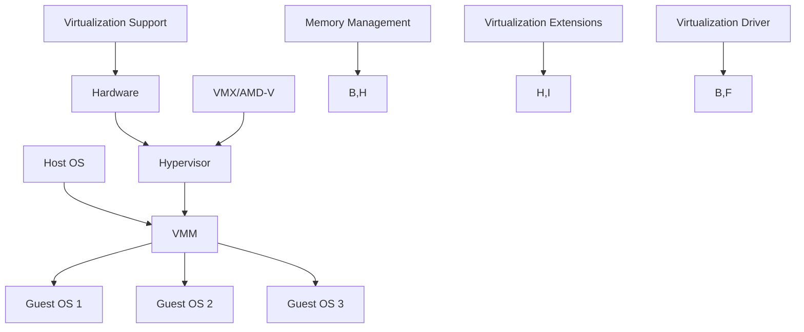

                 

关键词：x86虚拟化技术，VT-x，AMD-V，虚拟化架构，性能优化，安全性

> 摘要：本文深入探讨了x86虚拟化技术的两大重要实现方式：VT-x和AMD-V。通过对比分析，我们揭示了这两种虚拟化技术的核心原理、优势与挑战，并在最后展望了其未来发展趋势与挑战。本文旨在为读者提供全面的技术视角，帮助理解x86虚拟化技术的广泛应用和潜在价值。

## 1. 背景介绍

虚拟化技术作为现代计算机系统中的关键技术之一，已经成为了数据中心、云计算和服务器虚拟化领域不可或缺的一部分。x86虚拟化技术因其广泛的硬件支持、强大的处理能力和成本效益而备受关注。本文将聚焦于x86架构中的两大虚拟化实现技术：Intel的VT-x和AMD的AMD-V。

### 虚拟化技术概述

虚拟化技术允许在一台物理主机上同时运行多个逻辑操作系统，从而提高资源利用率和灵活性。虚拟化技术可以分为两种主要类型：全虚拟化和硬件辅助虚拟化。

- **全虚拟化（Full Virtualization）**：在这种方式下，虚拟机监控器（VMM）完全模拟硬件，为每个虚拟机提供独立的运行环境。这种方式的主要优势是兼容性强，可以在没有任何硬件优化的情况下实现虚拟化，但性能较低。

- **硬件辅助虚拟化（Hardware-Assisted Virtualization）**：硬件辅助虚拟化利用特定的硬件特性，如Intel的VT-x和AMD的AMD-V，提供对虚拟化操作的直接支持。这种方式显著提高了虚拟化的性能和安全性，但要求特定的硬件支持。

### VT-x和AMD-V的背景

Intel的VT-x和AMD的AMD-V都是为了提升硬件辅助虚拟化性能而设计的扩展指令集。这两项技术为虚拟机监控器提供了直接访问硬件的能力，从而减少了对软件模拟的依赖。

- **VT-x**：Intel的虚拟化技术，首次在2005年的Intel Core 2处理器中引入。VT-x通过扩展x86指令集，提供了对虚拟化操作的直接支持，如VMX指令集和内存管理机制。

- **AMD-V**：AMD的虚拟化技术，首次在2006年的AMD Opteron处理器中引入。AMD-V通过扩展x86-64指令集，提供了类似的虚拟化功能，包括虚拟化内存管理、虚拟化I/O和硬件页表。

## 2. 核心概念与联系

在深入了解VT-x和AMD-V之前，我们需要首先理解虚拟化技术的核心概念和架构。以下是一个用Mermaid绘制的虚拟化架构流程图，展示了虚拟化技术的各个关键组件和它们之间的关系。



### 虚拟化技术核心概念

- **Host OS（主机操作系统）**：运行在物理硬件上的操作系统，负责管理物理资源。
- **VMM（虚拟机监控器）**：运行在主机操作系统之上，负责创建和管理虚拟机。
- **Guest OS（客户操作系统）**：运行在虚拟机中的操作系统，通常是不同的操作系统。
- **Hypervisor（管理器）**：一种特殊的操作系统或软件层，负责在物理硬件和VMM之间进行资源管理和调度。
- **VMX/AMD-V（虚拟化扩展指令集）**：Intel和AMD分别提供的硬件扩展，用于直接支持虚拟化操作。
- **Memory Management（内存管理）**：虚拟机监控器负责管理虚拟内存，包括内存分配、页面置换和内存访问控制。
- **Virtualization Extensions（虚拟化扩展）**：包含VMX和AMD-V在内的硬件扩展指令集。
- **Virtualization Support（虚拟化支持）**：硬件层提供的虚拟化功能支持。
- **Virtualization Driver（虚拟化驱动程序）**：用于在操作系统和虚拟化技术之间进行通信。

## 3. 核心算法原理 & 具体操作步骤

### 3.1 算法原理概述

虚拟化技术通过将物理硬件资源抽象化，为每个虚拟机提供独立的运行环境。VT-x和AMD-V提供了对虚拟化操作的支持，使得虚拟机监控器能够高效地管理多个虚拟机。

- **VT-x**：通过扩展x86指令集，提供了虚拟化操作指令，如`VMFUNC`、`VMPTRLD`和`VMPTRST`。VT-x还包括虚拟化内存管理机制，如EPT（Extended Page Table）和VMCS（VMX Control Structure）。
- **AMD-V**：通过扩展x86-64指令集，提供了类似的虚拟化功能，如NPT（Nested Page Table）和RAPL（Real Address Processor-Lock）。AMD-V还引入了虚拟化I/O技术，如IOMMU（I/O Memory Management Unit）。

### 3.2 算法步骤详解

#### VT-x虚拟化步骤

1. **进入虚拟化模式**：虚拟机监控器通过执行`VMXON`指令进入虚拟化模式。
2. **设置VMCS**：虚拟机监控器初始化VMCS（VMX Control Structure），以管理虚拟机的状态和配置。
3. **虚拟化内存管理**：虚拟机监控器使用EPT（Extended Page Table）实现内存隔离和虚拟化。
4. **虚拟化I/O操作**：虚拟机监控器通过VMCS中的I/O控制字段管理虚拟机的I/O操作。
5. **执行虚拟机代码**：虚拟机监控器通过`VMEXIT`指令退出虚拟化模式，将控制权交还给主机操作系统。

#### AMD-V虚拟化步骤

1. **启用虚拟化支持**：在BIOS中启用AMD-V虚拟化功能。
2. **初始化NPT**：虚拟机监控器初始化NPT（Nested Page Table），以管理虚拟机的内存映射。
3. **虚拟化I/O操作**：虚拟机监控器使用IOMMU（I/O Memory Management Unit）管理虚拟机的I/O操作。
4. **执行虚拟机代码**：虚拟机监控器通过`RDTSC`指令进入虚拟化模式，执行虚拟机代码。

### 3.3 算法优缺点

#### VT-x优缺点

- **优点**：
  - 广泛的硬件支持：几乎所有现代Intel处理器都支持VT-x。
  - 高性能：硬件辅助虚拟化减少了软件模拟的开销，提高了性能。
  - 高级功能：支持虚拟化I/O、硬件页表和虚拟化内存管理。

- **缺点**：
  - 受限于Intel处理器：需要特定硬件支持，不适用于所有系统。
  - 安全性挑战：虚拟化漏洞可能导致宿主机系统受到攻击。

#### AMD-V优缺点

- **优点**：
  - 强大的硬件支持：几乎所有现代AMD处理器都支持AMD-V。
  - 高性能：硬件辅助虚拟化提高了虚拟机的性能。
  - 先进的虚拟化功能：包括虚拟化I/O和硬件页表。

- **缺点**：
  - 受限于AMD处理器：需要特定硬件支持，不适用于所有系统。
  - 安全性挑战：虚拟化漏洞可能导致宿主机系统受到攻击。

### 3.4 算法应用领域

#### VT-x应用领域

- **服务器虚拟化**：在企业环境中，VT-x广泛应用于服务器虚拟化，提供高效、可靠的虚拟化解决方案。
- **云计算**：VT-x在云计算领域得到广泛应用，用于构建大规模虚拟化基础设施。
- **安全性隔离**：VT-x用于实现安全性隔离，保护关键系统和数据。

#### AMD-V应用领域

- **高性能计算**：在需要大量并行计算的环境中，AMD-V提供了强大的虚拟化支持。
- **数据中心**：AMD-V在数据中心环境中用于构建高密度虚拟化服务器。
- **科研和教育**：在科研和教育领域，AMD-V用于创建多个隔离的虚拟实验室。

## 4. 数学模型和公式 & 详细讲解 & 举例说明

### 4.1 数学模型构建

虚拟化技术的数学模型主要包括虚拟内存管理、虚拟化I/O和硬件页表等方面。

#### 虚拟内存管理

虚拟内存管理使用页面映射表（Page Table）来管理虚拟机和宿主机的内存映射。以下是虚拟内存管理的基本数学模型：

$$
\text{Page Table} = \{ (\text{Virtual Page Number}, \text{Physical Page Number}) \}
$$

其中，Virtual Page Number表示虚拟页面的编号，Physical Page Number表示物理页面的编号。

#### 虚拟化I/O

虚拟化I/O使用I/O内存管理单元（IOMMU）来管理虚拟机与物理设备之间的I/O操作。以下是虚拟化I/O的基本数学模型：

$$
\text{IOMMU Table} = \{ (\text{Virtual Address}, \text{Physical Address}, \text{Access Rights}) \}
$$

其中，Virtual Address表示虚拟地址，Physical Address表示物理地址，Access Rights表示访问权限。

#### 硬件页表

硬件页表用于管理虚拟机的内存映射。以下是硬件页表的基本数学模型：

$$
\text{Hardware Page Table} = \{ (\text{Page Frame Number}, \text{Hardware Address}) \}
$$

其中，Page Frame Number表示页帧编号，Hardware Address表示硬件地址。

### 4.2 公式推导过程

以下是虚拟内存管理公式的推导过程：

1. **虚拟地址到物理地址的转换**：

$$
\text{Physical Address} = (\text{Virtual Page Number} \times \text{Page Size}) + (\text{Offset})
$$

其中，Page Size表示页面大小，Offset表示页内偏移量。

2. **页面映射表的构建**：

$$
\text{Page Table} = \{ (\text{Virtual Page Number}, \text{Physical Page Number}) \}
$$

其中，Virtual Page Number和Physical Page Number分别表示虚拟页面编号和物理页面编号。

### 4.3 案例分析与讲解

以下是一个虚拟内存管理的案例：

假设一个虚拟机有4GB的虚拟内存，页面大小为4KB。现在我们需要将虚拟地址`0x0000A000`映射到物理地址`0x1F000000`。

1. **虚拟地址到物理地址的转换**：

$$
\text{Physical Address} = (0x0000A000 \times 4KB) + 0x0000A000 = 0x1F000000
$$

2. **页面映射表的构建**：

$$
\text{Page Table} = \{ (0x0000A000, 0x1F000000) \}
$$

这个案例展示了如何使用虚拟内存管理公式将虚拟地址映射到物理地址。

## 5. 项目实践：代码实例和详细解释说明

### 5.1 开发环境搭建

为了实践虚拟化技术，我们需要搭建一个开发环境。以下是所需的软件和硬件配置：

- **硬件**：Intel或AMD处理器，支持VT-x或AMD-V。
- **操作系统**：Linux发行版，如Ubuntu或CentOS。
- **虚拟机监控器**：如KVM或Xen。

以下是在Ubuntu 18.04上安装KVM的步骤：

1. **安装虚拟化支持包**：

   ```
   sudo apt update
   sudo apt install qemu-kvm libvirt-daemon virt-manager
   ```

2. **启动并使能KVM模块**：

   ```
   sudo systemctl start libvirt-bin
   sudo systemctl enable libvirt-bin
   ```

3. **安装用户界面**：

   ```
   sudo apt install virt-manager
   ```

### 5.2 源代码详细实现

为了实现一个简单的虚拟化环境，我们将使用QEMU（一个通用的机器模拟器和虚拟化器）作为虚拟机监控器。以下是使用QEMU创建一个简单的虚拟机实例的步骤：

1. **创建虚拟硬盘**：

   ```
   qemu-img create -f qcow2 vm-hdd.qcow2 10G
   ```

   这条命令创建了一个大小为10GB的虚拟硬盘文件`vm-hdd.qcow2`。

2. **配置虚拟机**：

   创建一个名为`vm1.xml`的虚拟机配置文件，内容如下：

   ```xml
   <domain type='qemu' xmlns:qemu='http://libvirt.org/schemas/domain/qemu/1.0'>
       <name>vm1</name>
       <memory unit='MiB'>1024</memory>
       <os>
           <type arch='x86_64' machine='qemux86'>hvm</type>
           <boot dev='hd'/>
       </os>
       <devices>
           <disk type='file' device='disk'>
               <driver name='qemu' type='qcow2'/>
               <source file='/path/to/vm-hdd.qcow2'/>
               <target dev='hda'/>
           </disk>
           <interface type='bridge'>
               <mac address='52:54:00:12:34:56'/>
               <source bridge='virbr0'/>
           </interface>
       </devices>
   </domain>
   ```

   请确保将`/path/to/vm-hdd.qcow2`替换为实际文件路径。

3. **启动虚拟机**：

   ```
   virsh define vm1.xml
   virsh start vm1
   ```

   这两条命令分别定义和启动虚拟机`vm1`。

### 5.3 代码解读与分析

在上面的代码中，我们使用QEMU创建了一个简单的虚拟机实例。以下是关键部分的解读：

- **虚拟硬盘**：

  ```
  qemu-img create -f qcow2 vm-hdd.qcow2 10G
  ```

  这条命令创建了一个大小为10GB的虚拟硬盘文件。

- **虚拟机配置文件**：

  ```xml
  <domain type='qemu' xmlns:qemu='http://libvirt.org/schemas/domain/qemu/1.0'>
      <name>vm1</name>
      <memory unit='MiB'>1024</memory>
      <os>
          <type arch='x86_64' machine='qemux86'>hvm</type>
          <boot dev='hd'/>
      </os>
      <devices>
          <disk type='file' device='disk'>
              <driver name='qemu' type='qcow2'/>
              <source file='/path/to/vm-hdd.qcow2'/>
              <target dev='hda'/>
          </disk>
          <interface type='bridge'>
              <mac address='52:54:00:12:34:56'/>
              <source bridge='virbr0'/>
          </interface>
      </devices>
  </domain>
  ```

  这个配置文件定义了虚拟机的名称、内存大小、操作系统类型和设备配置。关键部分包括：

  - `<disk type='file' device='disk'>`：定义了虚拟硬盘文件。
  - `<interface type='bridge'>`：定义了虚拟机的网络接口。

- **启动虚拟机**：

  ```
  virsh define vm1.xml
  virsh start vm1
  ```

  这两条命令分别定义和启动虚拟机。

### 5.4 运行结果展示

在成功启动虚拟机后，我们可以在终端中查看虚拟机的状态：

```
virsh list
```

输出结果将显示虚拟机的运行状态，如下所示：

```
 Id    Name                 State
----------------------------------------------------
 1     domain-0             running
 2     vm1                  running
```

此时，虚拟机`vm1`已成功启动。我们还可以通过虚拟机管理工具（如virt-manager）查看虚拟机的详细信息。

## 6. 实际应用场景

虚拟化技术在现代计算机系统中具有广泛的应用场景。以下是一些典型的实际应用场景：

### 6.1 服务器虚拟化

服务器虚拟化是虚拟化技术最常见和最成熟的应用场景之一。通过虚拟化技术，企业可以在单个物理服务器上运行多个虚拟机，从而提高资源利用率和灵活性。服务器虚拟化广泛应用于企业数据中心、云计算平台和Web服务器等领域。

### 6.2 云计算

云计算依赖于虚拟化技术来提供灵活的、按需的IT资源。虚拟化技术使得云服务提供商能够在物理硬件上高效地创建和部署虚拟机，从而满足不同用户的需求。虚拟化技术在公共云、私有云和混合云环境中得到广泛应用。

### 6.3 容器化

虚拟化技术也为容器化技术提供了基础支持。容器是一种轻量级、独立的运行时环境，它依赖于虚拟化技术来实现资源的隔离和管理。虚拟化技术使得容器可以在不同的操作系统和硬件平台上运行，从而提高了应用的移植性和可移植性。

### 6.4 安全性隔离

虚拟化技术可用于实现安全性隔离，保护关键系统和数据。通过在虚拟机上运行敏感应用程序，企业可以在隔离的环境中测试、开发和部署应用程序，从而降低安全风险。虚拟化技术还用于创建沙盒环境，用于测试和隔离恶意软件。

### 6.5 高性能计算

在需要大量并行计算的环境中，虚拟化技术提供了强大的支持。通过在单个物理服务器上运行多个虚拟机，企业可以提高计算资源的利用率和灵活性。虚拟化技术还支持高性能计算集群的动态资源调度和负载均衡。

### 6.6 教育和科研

虚拟化技术在教育和科研领域也有广泛的应用。通过虚拟化技术，学生和研究人员可以在虚拟环境中进行实验、测试和模拟，从而提高学习效果和研究效率。虚拟化技术还用于创建虚拟实验室和虚拟课堂，为教育提供更多的灵活性和便利性。

## 7. 工具和资源推荐

### 7.1 学习资源推荐

- **《虚拟化技术导论》（Introduction to Virtualization）**：一本全面介绍虚拟化技术的入门书籍，涵盖了虚拟化技术的原理、应用和实现。
- **《Linux内核设计与实现》（Linux Kernel Development）**：一本深入介绍Linux内核设计和实现的经典书籍，其中包含了大量关于虚拟化技术的讨论。
- **《Xen虚拟化技术实战》（Xen Virtualization in Action）**：一本针对Xen虚拟化技术的实战指南，适合希望深入了解Xen的读者。

### 7.2 开发工具推荐

- **QEMU**：一个通用的虚拟化工具，适用于创建和运行虚拟机。
- **KVM**：基于Linux内核的虚拟化工具，提供了强大的虚拟化功能。
- **Xen**：一个开源的虚拟化平台，适用于大型虚拟化部署。

### 7.3 相关论文推荐

- **"Hardware-Assisted Virtualization: Performance Experience and Analysis"**：一篇关于硬件辅助虚拟化的性能分析和评估的论文。
- **"Intel VT-x and AMD-V: Hardware Support for Efficient and Secure Virtualization"**：一篇详细介绍Intel VT-x和AMD-V硬件特性的论文。
- **"Virtual Machine Monitors: New Directions in Virtual Machine Research"**：一篇关于虚拟机监控器研究的综述论文。

## 8. 总结：未来发展趋势与挑战

虚拟化技术作为现代计算机系统中的关键技术，正不断演进和发展。以下是虚拟化技术的未来发展趋势和面临的挑战：

### 8.1 研究成果总结

- **硬件虚拟化**：随着硬件技术的发展，硬件虚拟化功能日益强大，性能和安全性不断提升。
- **软件虚拟化**：软件虚拟化技术（如容器化）逐渐成熟，成为虚拟化技术的重要组成部分。
- **混合虚拟化**：混合虚拟化结合了硬件虚拟化和软件虚拟化的优势，提供了更灵活的虚拟化解决方案。
- **云计算与边缘计算**：虚拟化技术在云计算和边缘计算领域得到广泛应用，推动了虚拟化技术的发展。

### 8.2 未来发展趋势

- **容器化**：容器化技术将取代传统的虚拟化技术，成为主流的虚拟化解决方案。
- **硬件虚拟化增强**：随着硬件技术的发展，硬件虚拟化功能将更加完善，提供更高的性能和安全性。
- **混合云与多云环境**：虚拟化技术将在混合云和多云环境中发挥重要作用，提供灵活的资源管理和调度能力。
- **边缘计算虚拟化**：边缘计算虚拟化将解决边缘设备的资源限制问题，为边缘计算提供强大的支持。

### 8.3 面临的挑战

- **安全性**：虚拟化技术面临安全挑战，如虚拟化漏洞和攻击。
- **性能优化**：虚拟化技术的性能优化是一个长期的目标，需要持续改进。
- **资源调度与负载均衡**：在混合云和多云环境中，资源调度和负载均衡是一个复杂的问题。
- **标准化**：虚拟化技术需要实现更高程度的标准化，以促进不同平台之间的互操作性。

### 8.4 研究展望

- **硬件虚拟化**：未来硬件虚拟化技术将更加完善，提供更高的性能和安全性。
- **软件虚拟化**：容器化技术将继续发展，提供更灵活的虚拟化解决方案。
- **混合虚拟化**：混合虚拟化技术将结合硬件虚拟化和软件虚拟化的优势，为不同应用场景提供最佳解决方案。
- **边缘计算虚拟化**：边缘计算虚拟化技术将解决边缘设备的资源限制问题，推动边缘计算的发展。

## 9. 附录：常见问题与解答

### 9.1 虚拟化技术与容器化技术的区别

虚拟化技术通过硬件或软件模拟创建多个隔离的操作系统实例，而容器化技术通过操作系统级隔离实现轻量级的运行时环境。虚拟化技术提供了完整的操作系统环境，而容器化技术共享宿主机的操作系统内核。

### 9.2 VT-x和AMD-V的区别

VT-x和AMD-V都是硬件辅助虚拟化技术，但它们在指令集和硬件支持方面有所不同。VT-x由Intel提供，适用于Intel处理器，而AMD-V由AMD提供，适用于AMD处理器。两者都提供了虚拟化操作的支持，但AMD-V在某些方面（如虚拟化I/O）具有更强大的功能。

### 9.3 虚拟化技术的安全性问题

虚拟化技术面临安全性挑战，如虚拟机逃逸攻击和虚拟化漏洞。为了提高安全性，需要采取一系列措施，如使用加密技术、访问控制和安全监控等。

### 9.4 虚拟化技术的性能优化

虚拟化技术的性能优化包括减少虚拟机监控器开销、优化内存管理和网络传输等。硬件技术的发展，如硬件加速和专用虚拟化处理器，有助于提高虚拟化性能。

---

作者：禅与计算机程序设计艺术 / Zen and the Art of Computer Programming

