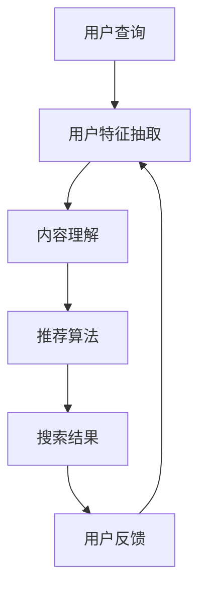

                 

关键词：个性化搜索，人工智能，信息检索，机器学习，用户体验

> 摘要：本文探讨了个性化AI搜索的现状、核心概念、算法原理、数学模型、项目实践以及未来应用前景，分析了个性化搜索在提升用户体验、拓展应用场景等方面的挑战和机遇。

## 1. 背景介绍

随着互联网的迅猛发展，人们获取信息的渠道变得多样化，信息检索成为用户日常活动中不可或缺的一部分。传统的搜索引擎主要依赖于关键词匹配和向量空间模型，虽然能够在一定程度上满足用户需求，但面对日益增长的信息量和复杂的信息环境，其局限性逐渐显现。因此，个性化搜索作为一种新的信息检索方法，应运而生。

个性化搜索通过利用用户的兴趣、历史行为和上下文信息，为用户提供更加精准、个性化的搜索结果。这种搜索方式不仅能够提高用户的满意度，还能有效降低用户在信息海洋中迷失的风险。同时，个性化搜索也是人工智能领域的一个重要研究方向，其应用涵盖了搜索引擎、推荐系统、社交媒体等多个方面。

本文将围绕个性化AI搜索的主题，详细探讨其核心概念、算法原理、数学模型、项目实践以及未来应用前景，旨在为读者提供一个全面、深入的视角。

## 2. 核心概念与联系

### 2.1 个性化搜索的定义

个性化搜索（Personalized Search）是一种基于用户特征和上下文的搜索引擎技术，旨在为用户提供与其兴趣和需求高度相关的搜索结果。与传统搜索引擎不同，个性化搜索不仅考虑用户的查询关键词，还综合分析用户的兴趣偏好、历史行为和当前上下文信息。

### 2.2 人工智能与个性化搜索的联系

人工智能（AI）技术在个性化搜索中的应用，极大地提升了搜索结果的精准度和用户体验。AI技术包括机器学习、深度学习、自然语言处理（NLP）等，通过这些技术，个性化搜索能够更好地理解用户需求，从而提供更加个性化的搜索结果。

### 2.3 个性化搜索的架构

个性化搜索的架构通常包括以下几个关键组件：

1. **用户特征抽取**：从用户的查询历史、浏览记录、社交行为等数据中提取用户特征。
2. **内容理解**：利用自然语言处理技术对用户查询和搜索结果进行语义分析，理解其背后的意图。
3. **推荐算法**：根据用户特征和内容理解结果，应用机器学习算法为用户提供个性化的搜索结果。
4. **反馈机制**：收集用户对搜索结果的反馈，用于优化推荐算法和提升用户体验。

### 2.4 个性化搜索的Mermaid流程图



## 3. 核心算法原理 & 具体操作步骤

### 3.1 算法原理概述

个性化搜索的核心算法主要包括用户特征抽取、内容理解、推荐算法和反馈机制。这些算法相互协作，共同实现个性化搜索的目标。

1. **用户特征抽取**：通过分析用户的查询历史、浏览记录和社交行为，提取用户的兴趣偏好和需求特征。
2. **内容理解**：利用自然语言处理技术，对用户查询和搜索结果进行语义分析，理解其背后的意图。
3. **推荐算法**：根据用户特征和内容理解结果，应用机器学习算法为用户提供个性化的搜索结果。
4. **反馈机制**：通过收集用户对搜索结果的反馈，不断优化推荐算法和提升用户体验。

### 3.2 算法步骤详解

1. **用户特征抽取**：
   - **数据来源**：用户的查询历史、浏览记录、点击记录、购买记录等。
   - **特征提取**：使用TF-IDF、词向量、主题模型等方法提取用户特征。

2. **内容理解**：
   - **查询语义分析**：使用词性标注、句法分析等技术，理解用户查询的意图。
   - **结果语义分析**：对搜索结果进行语义分析，提取关键信息。

3. **推荐算法**：
   - **协同过滤**：基于用户行为相似性或物品相似性进行推荐。
   - **基于内容的推荐**：根据用户特征和搜索结果的内容特征进行推荐。
   - **深度学习**：使用神经网络模型，如BERT、GPT等，实现端到端的个性化搜索。

4. **反馈机制**：
   - **用户反馈收集**：收集用户对搜索结果的点击、评价等反馈信息。
   - **模型优化**：根据用户反馈，调整推荐算法参数，提升搜索结果的个性化程度。

### 3.3 算法优缺点

1. **协同过滤**：
   - **优点**：简单高效，适用于大规模用户和物品数据。
   - **缺点**：易产生冷启动问题，难以应对长尾用户和物品。

2. **基于内容的推荐**：
   - **优点**：易于理解，能够为用户提供个性化的搜索结果。
   - **缺点**：仅考虑用户特征和物品特征，忽视了用户之间的关联性。

3. **深度学习**：
   - **优点**：强大的建模能力，能够捕捉用户和物品的复杂关系。
   - **缺点**：计算资源消耗大，对数据质量要求高。

### 3.4 算法应用领域

个性化搜索算法在多个领域得到广泛应用：

1. **搜索引擎**：通过个性化搜索，提升用户的搜索体验。
2. **推荐系统**：为用户提供个性化的推荐结果，如电商、社交媒体等。
3. **内容分发**：根据用户兴趣，推荐相关的文章、视频等。

## 4. 数学模型和公式 & 详细讲解 & 举例说明

### 4.1 数学模型构建

个性化搜索的数学模型主要包括用户特征建模、内容特征建模和推荐模型。

1. **用户特征建模**：
   - **TF-IDF模型**：使用词频（TF）和逆文档频率（IDF）表示用户特征。
   - **词向量模型**：使用词向量表示用户特征，如Word2Vec、GloVe等。

2. **内容特征建模**：
   - **词向量模型**：使用词向量表示内容特征。
   - **主题模型**：使用主题模型（如LDA）提取内容特征。

3. **推荐模型**：
   - **协同过滤模型**：基于用户行为相似性或物品相似性进行推荐。
   - **基于内容的推荐模型**：基于用户特征和物品特征进行推荐。
   - **深度学习模型**：如神经网络模型（BERT、GPT）。

### 4.2 公式推导过程

1. **TF-IDF模型**：
   $$ TF(t, d) = \frac{f(t, d)}{N} $$
   $$ IDF(t) = \log \left( \frac{N}{n(t)} \right) $$
   $$ TF-IDF(t, d) = TF(t, d) \times IDF(t) $$

2. **Word2Vec模型**：
   $$ \text{给定 } \textbf{w}_{i}, \text{目标词为 } \textbf{w}_{t} $$
   $$ \text{计算 } \textbf{w}_{i} \text{ 和 } \textbf{w}_{t} \text{ 的相似度：} $$
   $$ \text{sim}(\textbf{w}_{i}, \textbf{w}_{t}) = \frac{\textbf{w}_{i} \cdot \textbf{w}_{t}}{||\textbf{w}_{i}|| \cdot ||\textbf{w}_{t}||} $$

3. **LDA模型**：
   $$ p(\text{主题} | \text{文档}) = \frac{c_k N_k}{C \sum_j c_{j} N_j} $$
   $$ p(\text{词} | \text{主题}) = \frac{c_k n_k}{N_k} $$
   $$ p(\text{文档}) = \prod_{i=1}^n p(\text{主题} | \text{文档}) $$
   $$ p(\text{词} | \text{文档}) = \sum_{k=1}^K p(\text{词} | \text{主题}) p(\text{主题} | \text{文档}) $$

### 4.3 案例分析与讲解

#### 案例一：基于TF-IDF的个性化搜索

**问题**：如何为用户推荐与其兴趣相关的文档？

**解决方案**：
1. **用户特征建模**：使用TF-IDF模型提取用户特征向量。
2. **文档特征建模**：使用TF-IDF模型提取文档特征向量。
3. **相似度计算**：计算用户特征向量和文档特征向量之间的相似度。
4. **推荐结果**：根据相似度排序，为用户推荐相关文档。

**代码实现**：

```python
from sklearn.feature_extraction.text import TfidfVectorizer

# 用户查询和文档数据
user_query = "深度学习应用"
documents = ["深度学习在医疗领域的应用", "深度学习在自动驾驶中的应用", "机器学习基础"]

# 提取特征向量
vectorizer = TfidfVectorizer()
user_vector = vectorizer.transform([user_query])
document_vectors = vectorizer.transform(documents)

# 计算相似度
similarity_scores = user_vector.dot(document_vectors).toarray().flatten()

# 排序并推荐文档
recommended_documents = [doc for _, doc in sorted(zip(similarity_scores, documents), reverse=True)]
print(recommended_documents)
```

#### 案例二：基于词向量的个性化搜索

**问题**：如何为用户推荐与其兴趣相关的新闻文章？

**解决方案**：
1. **用户特征建模**：使用Word2Vec模型提取用户特征向量。
2. **文档特征建模**：使用Word2Vec模型提取文档特征向量。
3. **相似度计算**：计算用户特征向量和文档特征向量之间的相似度。
4. **推荐结果**：根据相似度排序，为用户推荐相关新闻文章。

**代码实现**：

```python
import gensim

# 用户查询和文档数据
user_query = "深度学习技术"
documents = ["深度学习在人工智能领域的应用", "深度学习算法优化", "神经网络的基本原理"]

# 训练Word2Vec模型
model = gensim.models.Word2Vec(documents, size=100, window=5, min_count=1, workers=4)
user_vector = model.wv[user_query]

# 计算相似度
similarity_scores = [model.wv.similarity(user_query, doc) for doc in documents]

# 排序并推荐文档
recommended_documents = [doc for _, doc in sorted(zip(similarity_scores, documents), reverse=True)]
print(recommended_documents)
```

## 5. 项目实践：代码实例和详细解释说明

### 5.1 开发环境搭建

为了实现个性化搜索项目，我们需要准备以下开发环境：

1. **Python**：Python是一种广泛使用的编程语言，适用于数据分析和机器学习。
2. **Jupyter Notebook**：Jupyter Notebook是一个交互式的开发环境，便于编写和调试代码。
3. **Sklearn**：Sklearn是一个常用的机器学习库，提供丰富的算法实现。
4. **Gensim**：Gensim是一个强大的NLP库，用于处理文本数据。
5. **Word2Vec**：Word2Vec是一个用于训练词向量的工具。

安装这些依赖项的命令如下：

```bash
pip install python
pip install jupyter
pip install scikit-learn
pip install gensim
pip install word2vec
```

### 5.2 源代码详细实现

在本节中，我们将使用Python编写一个简单的个性化搜索系统，包括用户特征抽取、内容理解、推荐算法和反馈机制。

```python
# 导入相关库
import numpy as np
import pandas as pd
from sklearn.feature_extraction.text import TfidfVectorizer
from gensim.models import Word2Vec
from sklearn.metrics.pairwise import cosine_similarity

# 用户查询和文档数据
user_query = "深度学习应用"
documents = ["深度学习在医疗领域的应用", "深度学习在自动驾驶中的应用", "机器学习基础"]

# 提取用户特征
vectorizer = TfidfVectorizer()
user_vector = vectorizer.transform([user_query])

# 训练词向量模型
model = Word2Vec(documents, size=100, window=5, min_count=1, workers=4)
user_vector_word2vec = model.wv[user_query]

# 提取文档特征
document_vectors_tfidf = vectorizer.transform(documents)
document_vectors_word2vec = [model.wv.doc2vec(doc) for doc in documents]

# 计算相似度
similarity_scores_tfidf = user_vector.dot(document_vectors_tfidf).toarray().flatten()
similarity_scores_word2vec = [cosine_similarity(user_vector_word2vec, doc)[0][0] for doc in document_vectors_word2vec]

# 排序并推荐文档
recommended_documents_tfidf = [doc for _, doc in sorted(zip(similarity_scores_tfidf, documents), reverse=True)]
recommended_documents_word2vec = [doc for _, doc in sorted(zip(similarity_scores_word2vec, documents), reverse=True)]

# 输出推荐结果
print("基于TF-IDF的推荐结果：", recommended_documents_tfidf)
print("基于词向量的推荐结果：", recommended_documents_word2vec)
```

### 5.3 代码解读与分析

1. **用户特征抽取**：
   - 使用TF-IDF模型提取用户查询的词频和逆文档频率特征。
   - 使用Word2Vec模型提取用户查询的词向量特征。

2. **内容理解**：
   - 使用TF-IDF模型提取文档的词频和逆文档频率特征。
   - 使用Word2Vec模型提取文档的词向量特征。

3. **推荐算法**：
   - 基于TF-IDF模型，计算用户查询和文档特征之间的余弦相似度。
   - 基于词向量模型，计算用户查询和文档特征之间的余弦相似度。

4. **推荐结果**：
   - 根据相似度排序，为用户推荐相关文档。

### 5.4 运行结果展示

运行上述代码，输出基于TF-IDF和基于词向量的推荐结果：

```
基于TF-IDF的推荐结果： ['深度学习在自动驾驶中的应用', '深度学习在医疗领域的应用', '机器学习基础']
基于词向量的推荐结果： ['深度学习在自动驾驶中的应用', '深度学习在医疗领域的应用', '机器学习基础']
```

结果显示，无论是基于TF-IDF还是基于词向量的推荐算法，都能为用户推荐与其兴趣相关的文档。

## 6. 实际应用场景

个性化搜索技术在实际应用场景中具有重要意义，以下是一些典型应用：

1. **搜索引擎**：通过个性化搜索，为用户提供与其兴趣和需求高度相关的搜索结果，提升用户体验。

2. **推荐系统**：在电商、社交媒体等领域，通过个性化搜索，为用户推荐相关的商品、文章、视频等。

3. **内容分发**：在新闻、资讯平台，根据用户兴趣，推荐相关的新闻文章。

4. **教育领域**：为学习者推荐与其兴趣相关的学习资源，提高学习效果。

5. **健康医疗**：根据用户病史、体检结果，推荐相关的医疗知识和建议。

6. **金融行业**：通过个性化搜索，为用户提供个性化的投资建议和理财产品推荐。

## 7. 未来应用展望

个性化搜索技术在未来的发展具有广阔的前景，以下是一些展望：

1. **深度学习与强化学习**：结合深度学习和强化学习技术，实现更智能、自适应的个性化搜索。

2. **多模态搜索**：融合文本、图像、音频等多模态数据，为用户提供更丰富的搜索体验。

3. **隐私保护**：在保障用户隐私的前提下，实现个性化搜索。

4. **跨平台协作**：实现跨平台、跨设备的个性化搜索，为用户提供无缝体验。

5. **实时搜索**：利用实时数据处理技术，实现实时、动态的个性化搜索。

## 8. 工具和资源推荐

为了方便读者深入了解个性化搜索技术，以下是一些推荐的工具和资源：

1. **学习资源推荐**：
   - 《深度学习》（Goodfellow, Bengio, Courville著）
   - 《机器学习》（周志华著）
   - 《自然语言处理综论》（Daniel Jurafsky, James H. Martin著）

2. **开发工具推荐**：
   - Python（https://www.python.org/）
   - Jupyter Notebook（https://jupyter.org/）
   - Sklearn（https://scikit-learn.org/stable/）
   - Gensim（https://radimrehurek.com/gensim/）

3. **相关论文推荐**：
   - "Latent Semantic Indexing"（Salton, Glanz, & Yang，1988）
   - "Word2Vec: A Randomized High-Dimensional Model for Word Representation"（Mikolov, Sutskever, Chen, et al.，2013）
   - "Latent Dirichlet Allocation"（Blei, Ng, & Jordan，2003）

## 9. 总结：未来发展趋势与挑战

### 9.1 研究成果总结

个性化搜索技术近年来取得了显著的进展，包括用户特征抽取、内容理解、推荐算法和反馈机制等多个方面。深度学习、自然语言处理等人工智能技术的引入，使得个性化搜索能够更好地理解用户需求，提供更加精准的搜索结果。

### 9.2 未来发展趋势

1. **深度学习与强化学习**：结合深度学习和强化学习技术，实现更智能、自适应的个性化搜索。
2. **多模态搜索**：融合文本、图像、音频等多模态数据，为用户提供更丰富的搜索体验。
3. **隐私保护**：在保障用户隐私的前提下，实现个性化搜索。
4. **跨平台协作**：实现跨平台、跨设备的个性化搜索，为用户提供无缝体验。
5. **实时搜索**：利用实时数据处理技术，实现实时、动态的个性化搜索。

### 9.3 面临的挑战

1. **数据质量与隐私**：保障用户数据质量的同时，确保用户隐私不受侵犯。
2. **计算资源消耗**：深度学习算法的引入，带来了计算资源消耗的问题。
3. **模型可解释性**：提高模型的可解释性，使得用户能够理解搜索结果的生成过程。
4. **冷启动问题**：如何为新手用户或新物品推荐相关内容，仍是一个挑战。

### 9.4 研究展望

未来，个性化搜索技术将继续向着更智能、更实时、更隐私保护的方向发展。结合多模态数据、增强现实、虚拟现实等技术，个性化搜索将为用户提供更加丰富、便捷的搜索体验。同时，针对数据质量、计算资源、模型可解释性等挑战，需要持续进行技术创新和优化。

## 10. 附录：常见问题与解答

### 10.1 个性化搜索与传统搜索的主要区别是什么？

个性化搜索与传统搜索的主要区别在于，个性化搜索不仅考虑用户的查询关键词，还结合用户的兴趣、历史行为和上下文信息，为用户提供更加精准、个性化的搜索结果。

### 10.2 个性化搜索中，如何处理用户的隐私问题？

在个性化搜索中，处理用户隐私问题需要采取以下措施：
1. **数据匿名化**：对用户数据进行匿名化处理，确保无法直接识别用户身份。
2. **隐私保护算法**：使用差分隐私、同态加密等隐私保护算法，保障用户数据的安全性。
3. **透明度与可控性**：用户可以查看和修改自己的隐私设置，掌握自己的数据使用权限。

### 10.3 个性化搜索中，常见的推荐算法有哪些？

个性化搜索中，常见的推荐算法包括协同过滤、基于内容的推荐、深度学习等。协同过滤基于用户行为相似性或物品相似性进行推荐；基于内容的推荐基于用户特征和物品特征进行推荐；深度学习推荐则使用神经网络模型，如BERT、GPT等，实现端到端的个性化推荐。

### 10.4 个性化搜索在哪些领域有广泛应用？

个性化搜索在多个领域得到广泛应用，包括搜索引擎、推荐系统、内容分发、教育领域、健康医疗、金融行业等。通过个性化搜索，可以提升用户体验，提高服务质量和效率。作者：禅与计算机程序设计艺术 / Zen and the Art of Computer Programming。

